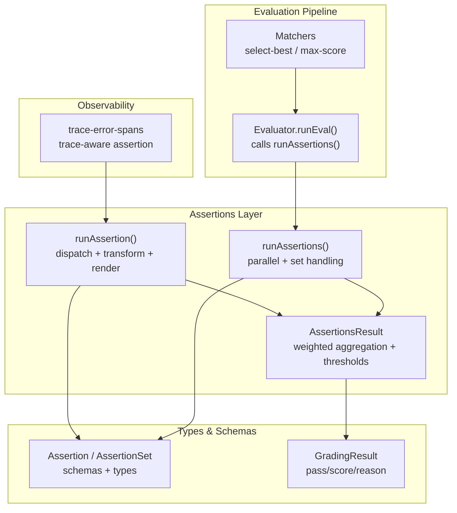
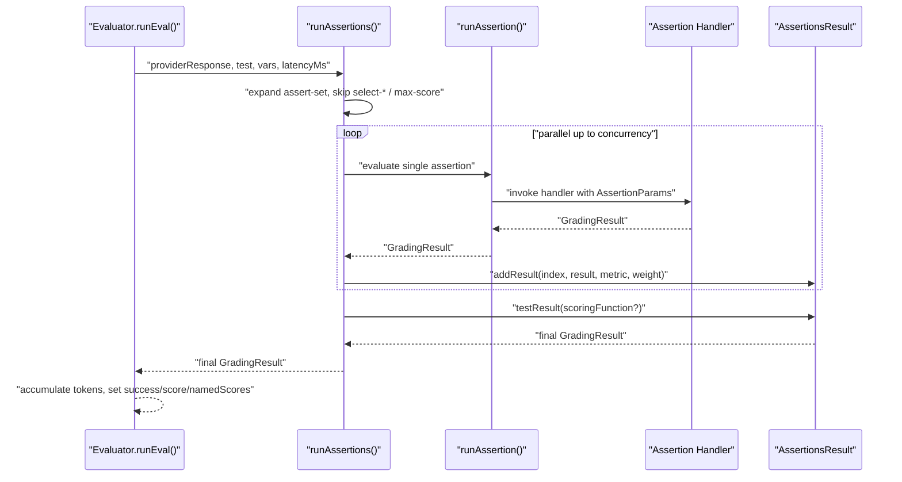
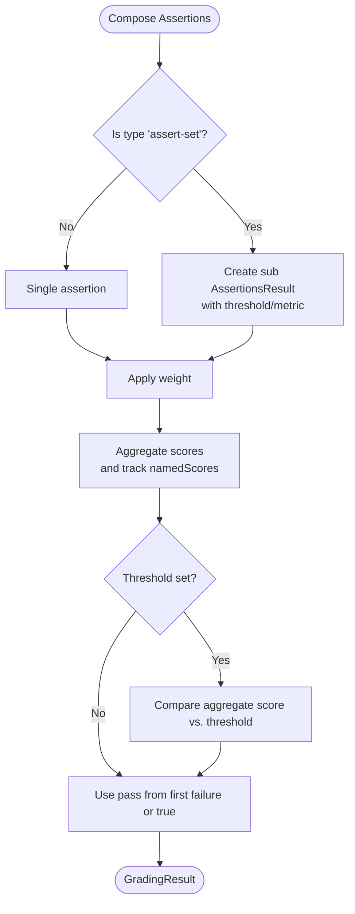
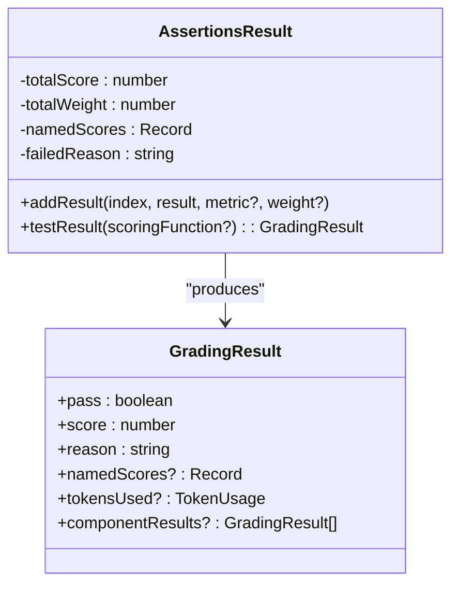
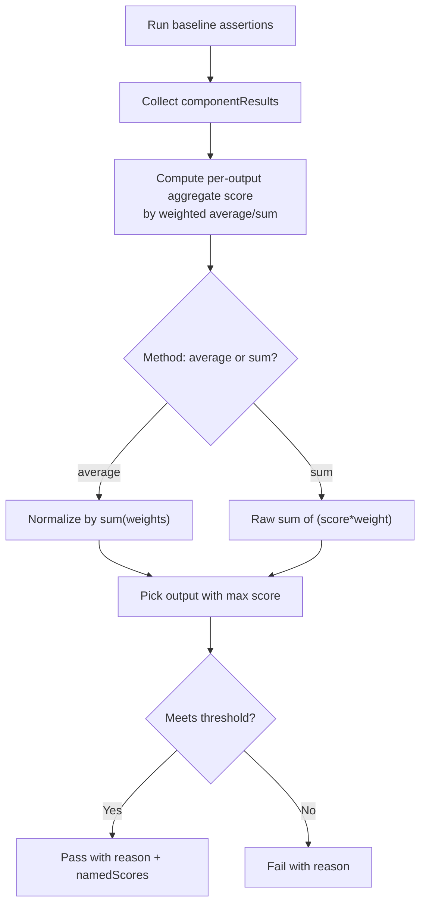
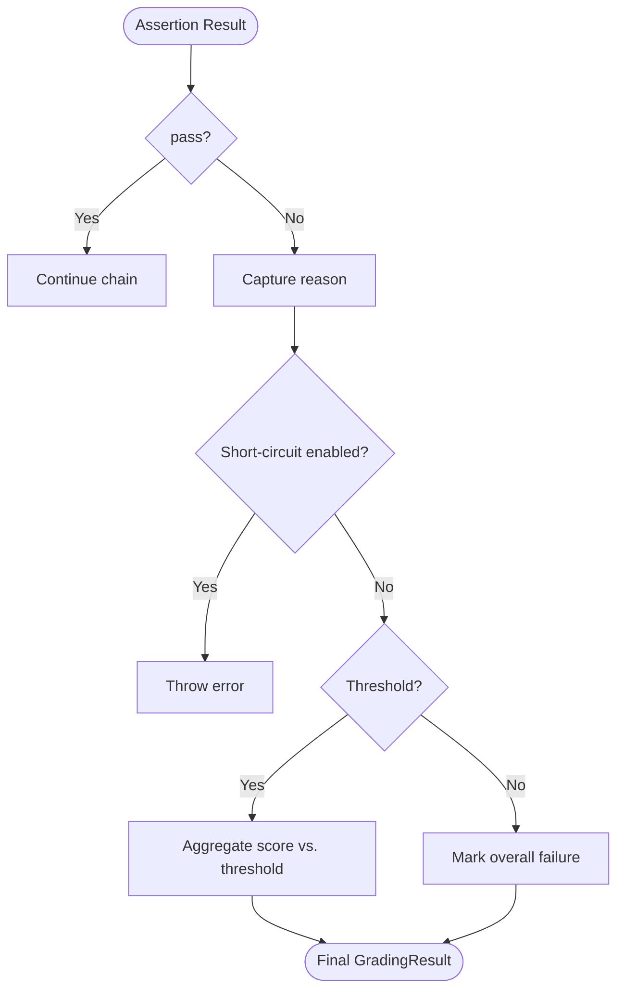
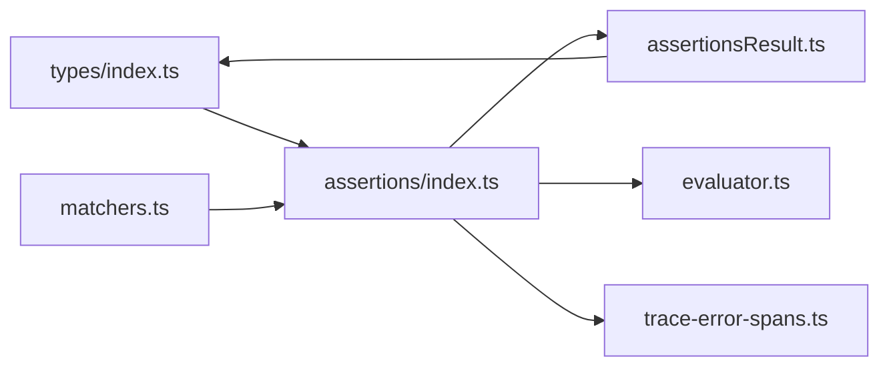

# Assertion Composition & Advanced Patterns

<cite>
**Referenced Files in This Document**
- [index.ts](file://src/assertions/index.ts)
- [assertionsResult.ts](file://src/assertions/assertionsResult.ts)
- [index.ts](file://src/types/index.ts)
- [evaluator.ts](file://src/evaluator.ts)
- [matchers.ts](file://src/matchers.ts)
- [traceErrorSpans.ts](file://src/assertions/traceErrorSpans.ts)
- [assertionResult.test.ts](file://test/assertions/assertionResult.test.ts)
- [assertionsResult.test.ts](file://test/assertions/assertionsResult.test.ts)
- [max-score.test.ts](file://test/matchers/max-score.test.ts)
- [max-score.md](file://site/docs/configuration/expected-outputs/model-graded/max-score.md)
</cite>

## Table of Contents
1. [Introduction](#introduction)
2. [Project Structure](#project-structure)
3. [Core Components](#core-components)
4. [Architecture Overview](#architecture-overview)
5. [Detailed Component Analysis](#detailed-component-analysis)
6. [Dependency Analysis](#dependency-analysis)
7. [Performance Considerations](#performance-considerations)
8. [Troubleshooting Guide](#troubleshooting-guide)
9. [Conclusion](#conclusion)
10. [Appendices](#appendices)

## Introduction
This document explains how PromptFoo composes and evaluates assertions, and how to build advanced evaluation pipelines using logical composition, conditional logic, chaining, dependency management, and result aggregation. It covers:
- Logical operators and negation via assertion types
- Assertion sets and hierarchical composition
- Weighted scoring, thresholds, and dynamic selection
- Result processing, error handling, and failure propagation
- Best practices for complex hierarchies, selective evaluation, and memory management
- Debugging and performance profiling techniques

## Project Structure
PromptFoo’s assertion system centers around a small set of core modules:
- Assertions orchestration and dispatch
- Result aggregation and scoring
- Types and schemas for assertions and grading
- Evaluation pipeline integration
- Matchers for special assertions (e.g., select-best, max-score)
- Trace-aware assertions for observability

**Diagram sources**
- [index.ts:252-512](file://src/assertions/index.ts#L252-L512)
- [index.ts:514-617](file://src/assertions/index.ts#L514-L617)
- [assertionsResult.ts:21-186](file://src/assertions/assertionsResult.ts#L21-L186)
- [index.ts:621-702](file://src/types/index.ts#L621-L702)
- [evaluator.ts:616-649](file://src/evaluator.ts#L616-L649)
- [matchers.ts:1641-1666](file://src/matchers.ts#L1641-L1666)
- [traceErrorSpans.ts:84-128](file://src/assertions/traceErrorSpans.ts#L84-L128)

**Section sources**
- [index.ts:1-120](file://src/assertions/index.ts#L1-L120)
- [index.ts:621-702](file://src/types/index.ts#L621-L702)
- [evaluator.ts:616-649](file://src/evaluator.ts#L616-L649)

## Core Components
- Assertion dispatcher and renderer: resolves values, applies transforms, renders templates, and routes to handlers.
- Assertion handlers: implement specific checks (contains, equals, model-graded, etc.).
- AssertionsResult: aggregates results with weights, thresholds, and optional scoring functions.
- Special assertions: select-best and max-score operate across multiple outputs.
- Trace-aware assertions: leverage distributed tracing data for observability.

Key behaviors:
- Inverse assertions: “not-” prefixed types invert base assertion semantics.
- Assertion sets: group related assertions and compute per-set thresholds.
- Weighted aggregation: scores are weighted sums normalized by total weights.
- Threshold gating: final pass/fail determined by aggregate score vs. threshold.
- Metric tagging: named metrics enable targeted reporting and scoring functions.

**Section sources**
- [index.ts:237-250](file://src/assertions/index.ts#L237-L250)
- [index.ts:514-617](file://src/assertions/index.ts#L514-L617)
- [assertionsResult.ts:59-131](file://src/assertions/assertionsResult.ts#L59-L131)
- [index.ts:602-652](file://src/types/index.ts#L602-L652)

## Architecture Overview
The evaluation pipeline integrates assertions tightly with provider calls and optional model-graded checks.

**Diagram sources**
- [evaluator.ts:616-649](file://src/evaluator.ts#L616-L649)
- [index.ts:514-617](file://src/assertions/index.ts#L514-L617)
- [index.ts:252-512](file://src/assertions/index.ts#L252-L512)
- [assertionsResult.ts:112-185](file://src/assertions/assertionsResult.ts#L112-L185)

## Detailed Component Analysis

### Assertion Composition Primitives
- Negation: “not-” prefixes invert base assertion semantics. Utilities detect inverse and derive base type.
- Assertion sets: group multiple assertions under a single container with optional threshold and metric.
- Weighted scoring: each assertion contributes score × weight; final score is normalized by total weight.
- Threshold gating: if a threshold is set, pass/fail depends on aggregate score meeting/exceeding threshold.
- Named metrics: attach labels to metrics for targeted scoring and reporting.

**Diagram sources**
- [index.ts:546-569](file://src/assertions/index.ts#L546-L569)
- [assertionsResult.ts:59-131](file://src/assertions/assertionsResult.ts#L59-L131)

**Section sources**
- [index.ts:237-250](file://src/assertions/index.ts#L237-L250)
- [index.ts:546-569](file://src/assertions/index.ts#L546-L569)
- [assertionsResult.ts:59-131](file://src/assertions/assertionsResult.ts#L59-L131)
- [index.ts:602-652](file://src/types/index.ts#L602-L652)

### Assertion Chaining and Dependency Management
- Chaining: compose multiple assertions sequentially; earlier failures propagate unless overridden by thresholds or metrics-only weighting.
- Dependency management: use assertion sets to enforce grouping and thresholds per group; use named metrics to feed downstream scoring functions.
- Metrics-only weighting: assertions with zero weight are treated as metrics-only and forced to pass, enabling passive monitoring.

Practical patterns:
- Guardrails first: place safety assertions early; short-circuit failures quickly.
- Hierarchical groups: split functional domains into assert-sets with domain-specific thresholds.
- Conditional logic: simulate conditionality by setting weights to zero for disabled branches; use named metrics to gate downstream decisions.

**Section sources**
- [index.ts:500-508](file://src/assertions/index.ts#L500-L508)
- [assertionsResult.ts:107-110](file://src/assertions/assertionsResult.ts#L107-L110)

### Result Aggregation Strategies
- Weighted average: sum(score × weight) / sum(weights).
- Summed scores: sum(score × weight) for additive domains.
- Threshold gating: final pass/fail determined by aggregate score vs. threshold.
- Scoring functions: optional post-processing hook receives namedScores and can override pass/score/reason.

**Diagram sources**
- [assertionsResult.ts:21-186](file://src/assertions/assertionsResult.ts#L21-L186)
- [index.ts:453-495](file://src/types/index.ts#L453-L495)

**Section sources**
- [assertionsResult.ts:112-185](file://src/assertions/assertionsResult.ts#L112-L185)
- [assertionsResult.test.ts:103-140](file://test/assertions/assertionsResult.test.ts#L103-L140)

### Advanced Patterns: Weighted Scoring and Threshold-Based Evaluation
- Weighted scoring: assign weights per assertion type or per assertion; normalize by sum of weights.
- Threshold-based evaluation: define per-test or per-assert-set thresholds to gate pass/fail.
- Dynamic selection: use select-best or max-score to pick the best output across candidates based on aggregated scores.

**Diagram sources**
- [matchers.ts:1641-1666](file://src/matchers.ts#L1641-L1666)
- [max-score.md:54-117](file://site/docs/configuration/expected-outputs/model-graded/max-score.md#L54-L117)

**Section sources**
- [matchers.ts:1641-1666](file://src/matchers.ts#L1641-L1666)
- [max-score.test.ts:237-441](file://test/matchers/max-score.test.ts#L237-L441)
- [max-score.md:54-117](file://site/docs/configuration/expected-outputs/model-graded/max-score.md#L54-L117)

### Dynamic Assertion Selection
- select-best: compare multiple outputs and return a binary pass/fail per output based on a rubric.
- max-score: compute aggregate scores across prior assertions and select the highest-scoring output; supports thresholds and tie-breaking.

Implementation highlights:
- Outputs and componentResults are aligned by index.
- Thresholds apply to the aggregate score; winners receive a reason indicating selection.
- Tie-breaking favors the first output deterministically.

**Section sources**
- [evaluator.ts:19-19](file://src/evaluator.ts#L19-L19)
- [matchers.ts:1617-1666](file://src/matchers.ts#L1617-L1666)
- [max-score.test.ts:237-441](file://test/matchers/max-score.test.ts#L237-L441)

### Assertion Result Processing, Error Handling, and Failure Propagation
- Assertion-level errors: handlers return GradingResult with pass=false and reason; tokensUsed may be accumulated.
- Short-circuit failures: when enabled, the first failing assertion throws immediately to halt evaluation.
- Guardrails: special handling for redteam guardrail failures; can be treated as blocked rather than failed depending on policy.
- Trace-aware assertions: leverage trace data to validate error spans or durations; missing trace data yields explicit errors.

**Diagram sources**
- [assertionsResult.ts:107-136](file://src/assertions/assertionsResult.ts#L107-L136)
- [traceErrorSpans.ts:84-128](file://src/assertions/traceErrorSpans.ts#L84-L128)

**Section sources**
- [assertionsResult.ts:107-136](file://src/assertions/assertionsResult.ts#L107-L136)
- [traceErrorSpans.ts:84-128](file://src/assertions/traceErrorSpans.ts#L84-L128)
- [assertionResult.test.ts:136-186](file://test/assertions/assertionResult.test.ts#L136-L186)

### Observability and Debugging
- Trace-aware assertions: use trace data to validate error spans, counts, and durations.
- Rendered assertion values: metadata stores the final rendered value for display.
- Token accounting: AssertionsResult accumulates tokensUsed across component results.

**Section sources**
- [index.ts:298-315](file://src/assertions/index.ts#L298-L315)
- [index.ts:489-498](file://src/assertions/index.ts#L489-L498)
- [assertionsResult.ts:93-99](file://src/assertions/assertionsResult.ts#L93-L99)

## Dependency Analysis
- Assertions rely on:
  - Types and schemas for validation and typing.
  - Matchers for special assertions (select-best, max-score).
  - Evaluator for orchestration and integration.
  - Trace store for observability.
- AssertionsResult depends on:
  - GradingResult shape and token usage accumulation.
  - Environment flags for short-circuit behavior.

**Diagram sources**
- [index.ts:621-702](file://src/types/index.ts#L621-L702)
- [index.ts:1-120](file://src/assertions/index.ts#L1-L120)
- [matchers.ts:1641-1666](file://src/matchers.ts#L1641-L1666)
- [assertionsResult.ts:21-186](file://src/assertions/assertionsResult.ts#L21-L186)
- [evaluator.ts:616-649](file://src/evaluator.ts#L616-L649)
- [traceErrorSpans.ts:84-128](file://src/assertions/traceErrorSpans.ts#L84-L128)

**Section sources**
- [index.ts:621-702](file://src/types/index.ts#L621-L702)
- [index.ts:1-120](file://src/assertions/index.ts#L1-L120)
- [assertionsResult.ts:21-186](file://src/assertions/assertionsResult.ts#L21-L186)
- [evaluator.ts:616-649](file://src/evaluator.ts#L616-L649)

## Performance Considerations
- Concurrency control: assertions execute with bounded concurrency to balance throughput and resource usage.
- Parallel evaluation: non-selective assertions run concurrently; select-best and max-score are deferred until all prior assertions complete.
- Memory management: AssertionsResult tracks minimal state; componentResults are flattened on finalization to reduce nesting overhead.
- Token accounting: centralized accumulation avoids repeated allocations and ensures accurate cost modeling.
- Early termination: short-circuit mode prevents unnecessary evaluation when failures are detected.

[No sources needed since this section provides general guidance]

## Troubleshooting Guide
Common issues and resolutions:
- Unknown assertion type: thrown when handler lookup fails; verify assertion type spelling and supported types.
- Script assertion misuse: returning unsupported types (boolean, GradingResult) from non-script assertion types triggers validation errors.
- Trace-aware assertion failures: missing or invalid trace data leads to explicit errors; ensure tracing is enabled and data is available.
- Threshold violations: confirm aggregate score meets threshold; inspect componentResults and namedScores to diagnose causes.
- Guardrail blocking: redteam guardrail failures are surfaced distinctly; review guardrail configuration and purpose.

**Section sources**
- [index.ts:511-512](file://src/assertions/index.ts#L511-L512)
- [index.ts:410-447](file://src/assertions/index.ts#L410-L447)
- [traceErrorSpans.ts:380-393](file://src/assertions/traceErrorSpans.ts#L380-L393)
- [assertionsResult.test.ts:89-101](file://test/assertions/assertionsResult.test.ts#L89-L101)

## Conclusion
PromptFoo’s assertion system offers a flexible, composable framework for evaluation. By combining assertion sets, weighted scoring, thresholds, and special selectors, you can build sophisticated pipelines that scale from simple checks to adaptive, multi-stage assessments. Use trace-aware assertions and metrics for observability, and lean on short-circuit and selective evaluation to optimize performance.

[No sources needed since this section summarizes without analyzing specific files]

## Appendices

### Best Practices for Complex Assertion Hierarchies
- Place safety and guardrail assertions first; use zero-weight metrics for passive monitoring.
- Group related checks into assert-sets with domain-specific thresholds.
- Use named metrics to drive downstream scoring functions and targeted reporting.
- Prefer weighted averages for comparable scales; use summed scores for additive domains.
- Keep thresholds conservative initially; refine based on componentResults analysis.

[No sources needed since this section provides general guidance]

### Example Pipelines
- Multi-stage assessment:
  - Stage 1: Safety and moderation (zero-weight metrics for visibility).
  - Stage 2: Functional correctness and content checks (assert-sets with thresholds).
  - Stage 3: Quality rubrics (model-graded) and similarity scoring.
  - Stage 4: Selection (select-best or max-score) across candidate outputs.
- Adaptive testing:
  - Use scoring functions to dynamically adjust weights based on namedScores.
  - Gate downstream stages on aggregate thresholds to avoid unnecessary computation.

[No sources needed since this section provides general guidance]