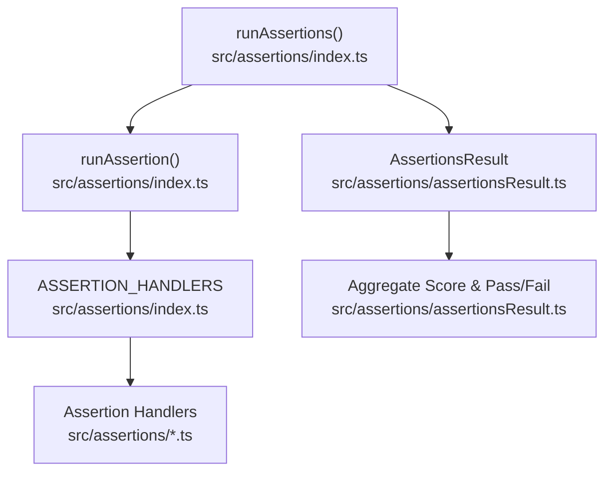
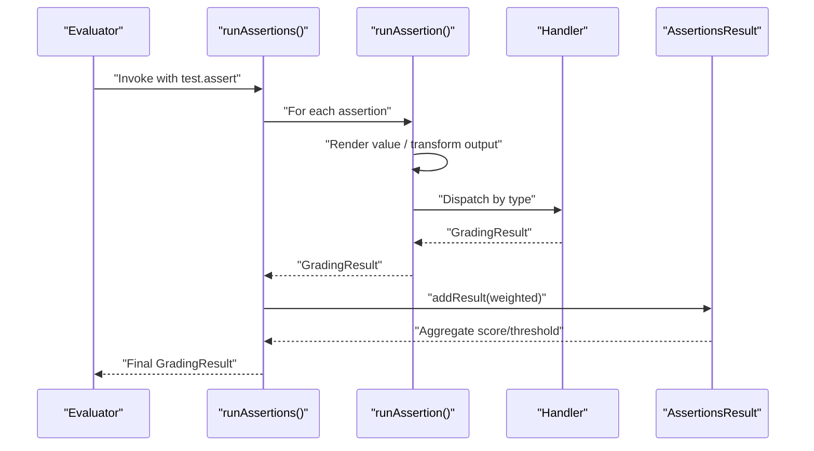
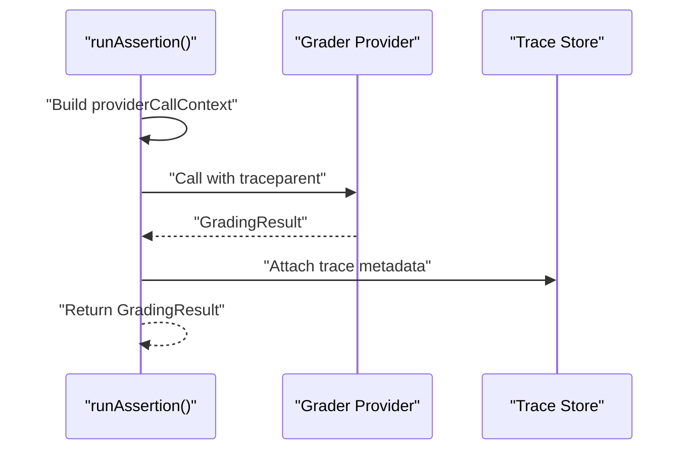
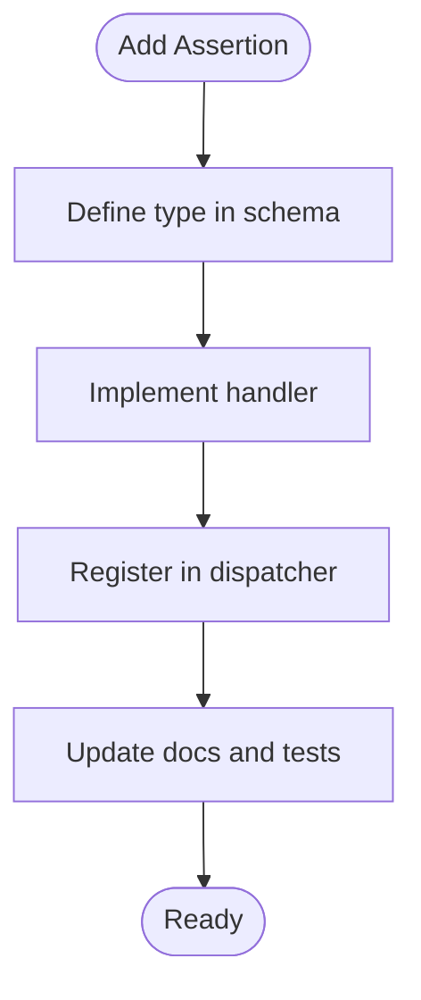
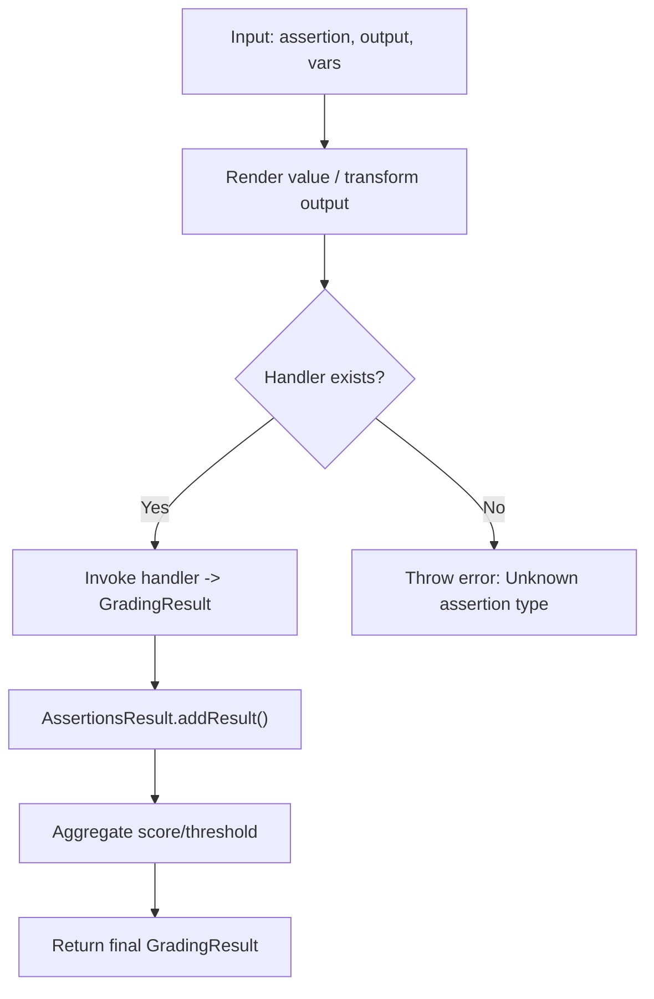
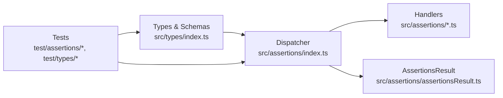

# Assertion System

<cite>
**Referenced Files in This Document**
- [index.ts](file://src/assertions/index.ts)
- [assertionsResult.ts](file://src/assertions/assertionsResult.ts)
- [index.ts](file://src/types/index.ts)
- [index.test.ts](file://test/assertions/index.test.ts)
- [index.test.ts](file://test/types/index.test.ts)
- [contributing.md](file://site/docs/contributing.md)
- [README.md](file://README.md)
</cite>

## Table of Contents
1. [Introduction](#introduction)
2. [Project Structure](#project-structure)
3. [Core Components](#core-components)
4. [Architecture Overview](#architecture-overview)
5. [Detailed Component Analysis](#detailed-component-analysis)
6. [Dependency Analysis](#dependency-analysis)
7. [Performance Considerations](#performance-considerations)
8. [Troubleshooting Guide](#troubleshooting-guide)
9. [Conclusion](#conclusion)
10. [Appendices](#appendices)

## Introduction
This document explains the PromptFoo assertion system comprehensively. It covers all built-in assertion types, syntax, parameters, scoring, composition, conditional logic, model-graded assertions, external grader integration, custom assertion development (JavaScript, Python, Ruby, TypeScript), best practices, performance, debugging, and practical examples for complex evaluation chains.

## Project Structure
The assertion system is implemented primarily in the assertions module and integrates with the broader evaluation pipeline. Key areas:
- Assertion orchestration and dispatch: [index.ts](file://src/assertions/index.ts)
- Aggregation and scoring: [assertionsResult.ts](file://src/assertions/assertionsResult.ts)
- Types and schemas: [index.ts](file://src/types/index.ts)
- Tests validating behavior and schemas: [index.test.ts](file://test/assertions/index.test.ts), [index.test.ts](file://test/types/index.test.ts)
- Contributing guidelines for adding new assertions: [contributing.md](file://site/docs/contributing.md)

**Diagram sources**
- [index.ts:514-617](file://src/assertions/index.ts#L514-L617)
- [assertionsResult.ts:21-186](file://src/assertions/assertionsResult.ts#L21-L186)

**Section sources**
- [index.ts:117-200](file://src/assertions/index.ts#L117-L200)
- [index.ts:514-617](file://src/assertions/index.ts#L514-L617)
- [assertionsResult.ts:21-186](file://src/assertions/assertionsResult.ts#L21-L186)

## Core Components
- Assertion orchestration and dispatch:
  - Central dispatcher resolves assertion type, renders values, applies transformations, and invokes the appropriate handler.
  - Supports inverse assertions (e.g., not-*) and special assertion sets.
- Assertion result aggregation:
  - Computes weighted average scores, tracks named metrics, and determines pass/fail with thresholds.
- Built-in assertion types:
  - Deterministic: contains, equals, regex, starts-with, word-count, latency, cost, finish-reason, is-* variants, etc.
  - Semantic/similarity: similar, bleu, gleu, rouge-n, levenshtein, pi.
  - Moderation and safety: moderation, guardrails, is-refusal.
  - Model-graded: llm-rubric, answer-relevance, context-relevance, context-faithfulness, context-recall, factuality, model-graded-closedqa, model-graded-factuality, search-rubric, conversation-relevance.
  - External/interactive: javascript, python, ruby, webhook.
  - Selection/comparison: select-best, max-score.
- Assertion composition:
  - Assertion sets enable grouping with weights and thresholds.
- Conditional logic:
  - Inverse assertions via not- prefix.
  - Weight=0 forces metric-only scoring without contributing to pass/fail.

**Section sources**
- [index.ts:105-115](file://src/assertions/index.ts#L105-L115)
- [index.ts:117-200](file://src/assertions/index.ts#L117-L200)
- [index.ts:237-250](file://src/assertions/index.ts#L237-L250)
- [index.ts:514-617](file://src/assertions/index.ts#L514-L617)
- [assertionsResult.ts:21-186](file://src/assertions/assertionsResult.ts#L21-L186)
- [index.ts:514-574](file://src/types/index.ts#L514-L574)

## Architecture Overview
The assertion pipeline:
1. Resolve and transform assertion values (including file references and templating).
2. Apply optional transform to model output.
3. Dispatch to the correct handler based on assertion type.
4. Aggregate results with weights and thresholds.
5. Optionally apply a custom scoring function.

**Diagram sources**
- [index.ts:514-617](file://src/assertions/index.ts#L514-L617)
- [index.ts:252-512](file://src/assertions/index.ts#L252-L512)
- [assertionsResult.ts:59-185](file://src/assertions/assertionsResult.ts#L59-L185)

## Detailed Component Analysis

### Assertion Types Reference
Below is a categorized reference of built-in assertion types. Each entry describes purpose, typical parameters, and scoring behavior.

- Deterministic
  - contains, icontains: substring match; supports arrays of targets; scoring often binary or proportional.
  - contains-all, contains-any: require all/any substrings; scoring reflects coverage.
  - equals: exact equality; strict string/object/array comparison.
  - regex: pattern match; scoring depends on match success.
  - starts-with: prefix match; binary scoring.
  - is-json, is-html, is-xml, is-sql: structural validation; pass if parsed successfully.
  - word-count: numeric comparison against target count.
  - finish-reason: validates stop reasons; pass/fail based on allowed/disallowed reasons.
  - latency: compare latencyMs to thresholds; pass if within budget.
  - cost: compare cost to budget; pass if under limit.
  - is-valid-function-call, is-valid-openai-function-call, is-valid-openai-tools-call: validate tool/function call structure; pass if syntactically valid.
  - is-refusal: detect refusal responses; pass if refusal detected.
- Semantic/Similarity
  - similar, similar:cosine, similar:dot, similar:euclidean: vector similarity; score in [0,1].
  - bleu, gleu: n-gram overlap metrics; score normalized.
  - rouge-n: ROUGE score; score normalized.
  - levenshtein: edit distance ratio; score normalized.
  - pi: PI scorer; score normalized.
- Moderation and Safety
  - moderation: content moderation checks; pass if flagged as safe.
  - guardrails: guardrail policies; pass if policy compliance achieved.
- Model-Graded
  - llm-rubric: rubric-based grading; score from LLM; pass if meets rubric criteria.
  - answer-relevance, context-relevance, context-faithfulness, context-recall, factuality: retrieval/chat QA quality; score from LLM; pass if meets thresholds.
  - model-graded-closedqa, model-graded-factuality: closed QA and factuality; score from LLM; pass if meets criteria.
  - search-rubric: search relevance rubric; score from LLM; pass if meets criteria.
  - conversation-relevance: conversational coherence; score from LLM; pass if meets criteria.
- External/Interactive
  - javascript: execute JS script returning expected value or boolean/grading result.
  - python: execute Python script returning expected value or boolean/grading result.
  - ruby: execute Ruby script returning expected value or boolean/grading result.
  - webhook: call external webhook for grading; expects structured response.
- Selection/Comparison
  - select-best: choose best among multiple outputs; requires a rubric or metric.
  - max-score: pick output with highest aggregate score across other assertions.
- Special
  - assert-set: group assertions with weight/threshold applied to the group.
  - human: manual grading placeholder (UI-driven).
  - not-*: invert semantics of base assertions (e.g., not-contains).

Scoring mechanism:
- Most assertions return a numeric score in [0,1] and a pass/fail decision.
- Inverse assertions flip pass/fail while adjusting score accordingly.
- Weighted aggregation computes a normalized score across assertions and sets.
- Thresholds can override pass/fail decisions globally.

**Section sources**
- [index.ts:105-115](file://src/assertions/index.ts#L105-L115)
- [index.ts:117-200](file://src/assertions/index.ts#L117-L200)
- [index.ts:514-574](file://src/types/index.ts#L514-L574)

### Assertion Syntax and Parameters
- Assertion shape:
  - type: one of the built-in types or custom.
  - value: varies by type (string, number, boolean, array, object, or function).
  - threshold: optional numeric threshold for pass/fail.
  - weight: optional numeric weight for aggregation.
  - metric: optional label for named metrics.
  - transform: optional transform applied to output before assertion.
  - config: optional provider-specific configuration for model-graded assertions.
- Value resolution:
  - String values support Nunjucks templating and file references (file://...).
  - Arrays of strings support templating per element.
  - Package-based references supported for dynamic modules.
- Inverse assertions:
  - Prefix any assertion with not- to invert pass/fail behavior.
- Assertion sets:
  - Group multiple assertions with assert-set; apply weight/threshold to the group.

**Section sources**
- [index.ts:317-447](file://src/assertions/index.ts#L317-L447)
- [index.ts:541-569](file://src/assertions/index.ts#L541-L569)
- [index.ts:514-600](file://src/types/index.ts#L514-L600)

### Assertion Composition and Conditional Logic
- Assertion sets:
  - Use assert-set to group related assertions and compute a composite score with its own weight and threshold.
- Weight semantics:
  - weight=0 disables contribution to pass/fail; useful for metrics-only outputs.
- Short-circuit failures:
  - Environment flag can cause evaluation to halt on first failing assertion.
- Inverse assertions:
  - not- prefix flips pass/fail outcomes while mirroring score adjustments.

**Section sources**
- [index.ts:541-569](file://src/assertions/index.ts#L541-L569)
- [index.ts:500-509](file://src/assertions/index.ts#L500-L509)
- [assertionsResult.ts:107-110](file://src/assertions/assertionsResult.ts#L107-L110)

### Model-Graded Assertions and External Grader Integration
- Model-graded types:
  - llm-rubric, answer-relevance, context-relevance, context-faithfulness, context-recall, factuality, model-graded-closedqa, model-graded-factuality, search-rubric, conversation-relevance.
- External grader integration:
  - Uses providerCallContext to route grading calls through the configured provider with tracing linkage.
  - Supports custom rubrics and provider configurations.
- Tracing:
  - Generates traceparent for grader calls to correlate with main evaluation traces.

**Diagram sources**
- [index.ts:449-459](file://src/assertions/index.ts#L449-L459)
- [index.ts:298-315](file://src/assertions/index.ts#L298-L315)

**Section sources**
- [index.ts:449-459](file://src/assertions/index.ts#L449-L459)
- [index.ts:105-115](file://src/assertions/index.ts#L105-L115)

### Custom Assertion Development
- Adding a new assertion:
  - Define the type in the base assertion schema.
  - Implement a handler that accepts AssertionParams and returns GradingResult.
  - Register the handler in the dispatcher mapping.
  - Document the assertion and add tests.
- Handler contract:
  - Accept AssertionParams including outputString, renderedValue, provider, test, and context.
  - Return pass, score, reason, optional namedScores/tokensUsed/componentResults.
- Supported script-based assertions:
  - javascript, python, ruby: can return expected values, booleans, or GradingResult objects.
  - Other assertion types interpret script output as the expected comparison value.

**Diagram sources**
- [contributing.md:251-329](file://site/docs/contributing.md#L251-L329)

**Section sources**
- [contributing.md:251-329](file://site/docs/contributing.md#L251-L329)
- [index.ts:407-447](file://src/assertions/index.ts#L407-L447)

### Assertion Execution Flow
- Rendering and transformation:
  - Values are rendered via Nunjucks and optionally loaded from files/packages.
  - Output can be transformed before assertion evaluation.
- Handler dispatch:
  - Base type derived from not- prefixes; handler invoked with AssertionParams.
- Aggregation:
  - AssertionsResult computes weighted averages, named metrics, and pass/fail with thresholds.

**Diagram sources**
- [index.ts:252-512](file://src/assertions/index.ts#L252-L512)
- [index.ts:514-617](file://src/assertions/index.ts#L514-L617)
- [assertionsResult.ts:59-185](file://src/assertions/assertionsResult.ts#L59-L185)

**Section sources**
- [index.ts:252-512](file://src/assertions/index.ts#L252-L512)
- [index.ts:514-617](file://src/assertions/index.ts#L514-L617)
- [assertionsResult.ts:59-185](file://src/assertions/assertionsResult.ts#L59-L185)

## Dependency Analysis
- Assertion handlers are registered centrally and dispatched by type.
- AssertionsResult encapsulates aggregation logic and is reused across runs.
- Types define schemas for assertion types and validation.

**Diagram sources**
- [index.ts:117-200](file://src/assertions/index.ts#L117-L200)
- [index.ts:514-617](file://src/assertions/index.ts#L514-L617)
- [assertionsResult.ts:21-186](file://src/assertions/assertionsResult.ts#L21-L186)
- [index.ts:514-600](file://src/types/index.ts#L514-L600)

**Section sources**
- [index.ts:117-200](file://src/assertions/index.ts#L117-L200)
- [index.ts:514-617](file://src/assertions/index.ts#L514-L617)
- [assertionsResult.ts:21-186](file://src/assertions/assertionsResult.ts#L21-L186)
- [index.ts:514-600](file://src/types/index.ts#L514-L600)

## Performance Considerations
- Concurrency:
  - Assertions run with bounded concurrency controlled by an environment variable.
- Weight=0 assertions:
  - Useful for metrics-only outputs without affecting pass/fail.
- Short-circuit failures:
  - Optional environment flag can stop evaluation on first failure.
- Transform and rendering:
  - Prefer minimal transforms and avoid heavy Nunjucks operations in tight loops.
- Model-graded calls:
  - Use provider caching and efficient rubrics to reduce LLM calls.
- Named metrics:
  - Use sparingly to avoid excessive memory overhead.

**Section sources**
- [index.ts](file://src/assertions/index.ts#L103)
- [index.ts:500-509](file://src/assertions/index.ts#L500-L509)
- [assertionsResult.ts:107-110](file://src/assertions/assertionsResult.ts#L107-L110)

## Troubleshooting Guide
- Unknown assertion type:
  - Occurs when a type is not registered; ensure the handler is mapped.
- Script-based assertion misuse:
  - Returning unsupported types (e.g., function/boolean/GradingResult) for non-script assertions triggers validation errors.
- Rendering failures:
  - Template rendering errors are caught and logged; check variable availability and templates.
- Guardrail safety:
  - Redteam guardrail failures are treated specially; review guardrail configuration.
- Debugging tips:
  - Inspect metadata.renderedAssertionValue for substituted values.
  - Review metadata.renderedGradingPrompt for model-graded prompts.
  - Enable tracing to correlate grader calls.

**Section sources**
- [index.ts](file://src/assertions/index.ts#L511)
- [index.ts:410-447](file://src/assertions/index.ts#L410-L447)
- [index.ts:317-389](file://src/assertions/index.ts#L317-L389)
- [assertionsResult.ts:74-79](file://src/assertions/assertionsResult.ts#L74-L79)
- [index.ts:483-494](file://src/types/index.ts#L483-L494)

## Conclusion
PromptFoo’s assertion system provides a robust, extensible framework for deterministic and model-graded evaluation. With strong composition primitives, flexible scripting, and comprehensive aggregation, it supports complex evaluation scenarios across diverse use cases. Follow the best practices and contribution guidelines to extend and maintain the system effectively.

## Appendices

### Best Practices
- Prefer model-graded assertions for subjective quality measures; use deterministic assertions for objective checks.
- Use assert-set to group related assertions and apply domain-specific thresholds.
- Keep thresholds conservative for production; iterate with lighter thresholds during exploration.
- Use weight=0 for observability-only metrics.
- Minimize expensive transforms and model-graded calls; cache where possible.
- Document rubrics and thresholds clearly for reproducibility.

### Example Patterns
- Multi-criteria evaluation:
  - Combine contains-all, regex, and similarity assertions within an assert-set with balanced weights.
- Model-graded rubric:
  - Use llm-rubric with a concise rubric; pair with moderation and latency constraints.
- Selection/comparison:
  - Use select-best with a rubric to automatically pick the best output across multiple generations.

### Assertion Selection Guidance
- Deterministic checks: equals, contains, regex, starts-with, is-json, is-html, is-xml, is-sql, word-count, latency, cost, finish-reason.
- Semantic checks: similar, bleu, gleu, rouge-n, levenshtein, pi.
- Safety: moderation, guardrails, is-refusal.
- Retrieval/chat QA: answer-relevance, context-relevance, context-faithfulness, context-recall, factuality.
- Closed QA: model-graded-closedqa.
- Search: search-rubric.
- External/interactive: javascript, python, ruby, webhook.
- Selection: select-best, max-score.

**Section sources**
- [index.ts:105-115](file://src/assertions/index.ts#L105-L115)
- [index.ts:117-200](file://src/assertions/index.ts#L117-L200)
- [index.ts:514-574](file://src/types/index.ts#L514-L574)