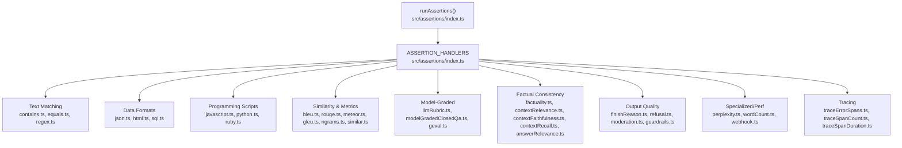
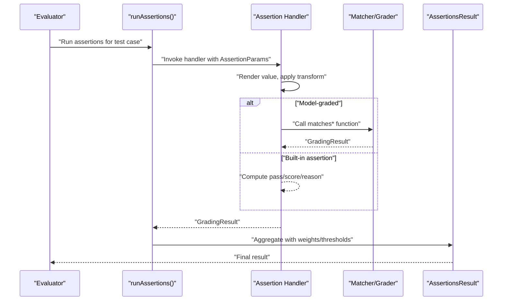
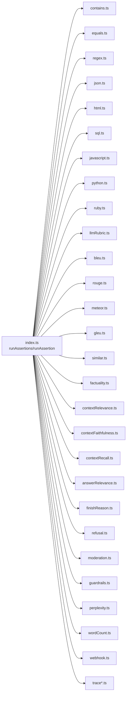

# Built-in Assertion Types

<cite>
**Referenced Files in This Document**
- [index.ts](file://src/assertions/index.ts)
- [contains.ts](file://src/assertions/contains.ts)
- [equals.ts](file://src/assertions/equals.ts)
- [regex.ts](file://src/assertions/regex.ts)
- [html.ts](file://src/assertions/html.ts)
- [json.ts](file://src/assertions/json.ts)
- [sql.ts](file://src/assertions/sql.ts)
- [javascript.ts](file://src/assertions/javascript.ts)
- [python.ts](file://src/assertions/python.ts)
- [ruby.ts](file://src/assertions/ruby.ts)
- [perplexity.ts](file://src/assertions/perplexity.ts)
- [llmRubric.ts](file://src/assertions/llmRubric.ts)
- [modelGradedClosedQa.ts](file://src/assertions/modelGradedClosedQa.ts)
- [geval.ts](file://src/assertions/geval.ts)
- [bleu.ts](file://src/assertions/bleu.ts)
- [rouge.ts](file://src/assertions/rouge.ts)
- [meteor.ts](file://src/assertions/meteor.ts)
- [gleu.ts](file://src/assertions/gleu.ts)
- [ngrams.ts](file://src/assertions/ngrams.ts)
- [factuality.ts](file://src/assertions/factuality.ts)
- [contextRelevance.ts](file://src/assertions/contextRelevance.ts)
- [contextFaithfulness.ts](file://src/assertions/contextFaithfulness.ts)
- [contextRecall.ts](file://src/assertions/contextRecall.ts)
- [answerRelevance.ts](file://src/assertions/answerRelevance.ts)
- [finishReason.ts](file://src/assertions/finishReason.ts)
- [refusal.ts](file://src/assertions/refusal.ts)
- [moderation.ts](file://src/assertions/moderation.ts)
- [guardrails.ts](file://src/assertions/guardrails.ts)
- [wordCount.ts](file://src/assertions/wordCount.ts)
- [webhook.ts](file://src/assertions/webhook.ts)
- [traceErrorSpans.ts](file://src/assertions/traceErrorSpans.ts)
- [traceSpanCount.ts](file://src/assertions/traceSpanCount.ts)
- [traceSpanDuration.ts](file://src/assertions/traceSpanDuration.ts)
- [similar.ts](file://src/assertions/similar.ts)
- [index.test.ts](file://test/assertions/index.test.ts)
</cite>

## Table of Contents
1. [Introduction](#introduction)
2. [Project Structure](#project-structure)
3. [Core Components](#core-components)
4. [Architecture Overview](#architecture-overview)
5. [Detailed Component Analysis](#detailed-component-analysis)
6. [Dependency Analysis](#dependency-analysis)
7. [Performance Considerations](#performance-considerations)
8. [Troubleshooting Guide](#troubleshooting-guide)
9. [Conclusion](#conclusion)

## Introduction
This document provides comprehensive documentation for all built-in assertion types in PromptFoo. It covers syntax, parameters, scoring mechanisms, and use cases for:
- Text matching assertions
- Semantic similarity assertions
- Model-graded assertions
- Factual consistency assertions
- Output quality assertions
- Data format assertions
- Programming language assertions
- Specialized and performance assertions

It also explains scoring algorithms, confidence thresholds, and performance characteristics, with references to the source code for accuracy.

## Project Structure
PromptFoo’s assertion system is centralized in a single dispatcher that routes each assertion type to a dedicated handler. Handlers implement the logic for each assertion and return a standardized grading result.

**Diagram sources**
- [index.ts:117-200](file://src/assertions/index.ts#L117-L200)

**Section sources**
- [index.ts:117-200](file://src/assertions/index.ts#L117-L200)

## Core Components
- Assertion dispatcher: Resolves assertion type to a handler, applies transformations, renders values, and aggregates results.
- Assertion handlers: Implement type-specific logic and return a standardized grading result with pass/fail, score, reason, and optional metadata.
- Model-graded helpers: Delegate to matcher modules for rubric-based grading and LLM evaluations.

Key behaviors:
- Inverse assertions: Prefix “not-” flips pass/fail outcomes.
- Weighted aggregation: Assertions can be weighted; zero-weight assertions act as metrics only.
- Thresholds: Numeric scores and thresholds define pass conditions for numeric-returning assertions.
- Rendering: Values can be rendered via templates or loaded from external scripts.

**Section sources**
- [index.ts:237-250](file://src/assertions/index.ts#L237-L250)
- [index.ts:500-509](file://src/assertions/index.ts#L500-L509)
- [index.ts:532-617](file://src/assertions/index.ts#L532-L617)

## Architecture Overview
The assertion pipeline:

**Diagram sources**
- [index.ts:514-617](file://src/assertions/index.ts#L514-L617)
- [llmRubric.ts:6-35](file://src/assertions/llmRubric.ts#L6-L35)

## Detailed Component Analysis

### Text Matching Assertions
- contains
  - Purpose: Check substring presence.
  - Parameters: value (string or number).
  - Scoring: 1 if present, else 0; inverse flips outcome.
  - Use cases: Verify keywords, tokens, or numeric substrings.
  - Notes: Non-string values are coerced to string.
  - Section sources
    - [contains.ts:5-27](file://src/assertions/contains.ts#L5-L27)

- icontains
  - Purpose: Case-insensitive substring presence.
  - Parameters: value (string or number).
  - Scoring: 1 if present, else 0; inverse flips outcome.
  - Section sources
    - [contains.ts:29-51](file://src/assertions/contains.ts#L29-L51)

- contains-any
  - Purpose: At least one of a comma-separated or array list is present.
  - Parameters: value (string list or array).
  - Scoring: 1 if any match, else 0; inverse flips outcome.
  - Section sources
    - [contains.ts:53-77](file://src/assertions/contains.ts#L53-L77)

- icontains-any
  - Purpose: Case-insensitive version of contains-any.
  - Parameters: value (string list or array).
  - Scoring: 1 if any match, else 0; inverse flips outcome.
  - Section sources
    - [contains.ts:79-102](file://src/assertions/contains.ts#L79-L102)

- contains-all
  - Purpose: All items in a list must be present.
  - Parameters: value (string list or array).
  - Scoring: 1 if all present, else 0; inverse flips outcome.
  - Section sources
    - [contains.ts:104-127](file://src/assertions/contains.ts#L104-L127)

- icontains-all
  - Purpose: Case-insensitive version of contains-all.
  - Parameters: value (string list or array).
  - Scoring: 1 if all present, else 0; inverse flips outcome.
  - Section sources
    - [contains.ts:129-155](file://src/assertions/contains.ts#L129-L155)

- equals
  - Purpose: Exact equality or deep equality for JSON.
  - Parameters: value (string, number, boolean, or object).
  - Scoring: 1 if equal, else 0; inverse flips outcome.
  - Notes: For object values, output is parsed as JSON and compared deeply.
  - Section sources
    - [equals.ts:5-34](file://src/assertions/equals.ts#L5-L34)

- regex
  - Purpose: Match output against a regular expression.
  - Parameters: value (string regex).
  - Scoring: 1 if matches, else 0; inverse flips outcome.
  - Notes: Invalid regex throws an error with reason.
  - Section sources
    - [regex.ts:5-33](file://src/assertions/regex.ts#L5-L33)

Best practices:
- Prefer contains-all for mandatory keyword sets.
- Use regex for flexible pattern matching; keep patterns precise to avoid false positives.
- Use icontains variants for case-insensitive checks.

### Semantic Similarity Assertions
- similarity (and variants)
  - Purpose: Semantic similarity using vector embeddings.
  - Parameters: value (string prompt), config supports distance metrics (cosine, dot, euclidean).
  - Scoring: 1 if similarity meets threshold, else 0; inverse flips outcome.
  - Notes: Delegates to matcher for embedding computation and similarity.
  - Section sources
    - [index.ts:189-193](file://src/assertions/index.ts#L189-L193)
    - [similar.ts](file://src/assertions/similar.ts)

- bleu
  - Purpose: BLEU score for text generation.
  - Parameters: value (reference text or array of references).
  - Scoring: 1 if score meets threshold, else 0; inverse flips outcome.
  - Section sources
    - [index.ts](file://src/assertions/index.ts#L122)
    - [bleu.ts](file://src/assertions/bleu.ts)

- rouge-n
  - Purpose: ROUGE-N score for text generation.
  - Parameters: value (reference text).
  - Scoring: 1 if score meets threshold, else 0; inverse flips outcome.
  - Section sources
    - [index.ts](file://src/assertions/index.ts#L187)
    - [rouge.ts](file://src/assertions/rouge.ts)

- meteor
  - Purpose: METEOR score for text generation.
  - Parameters: value (reference text).
  - Scoring: 1 if score meets threshold, else 0; inverse flips outcome.
  - Notes: Requires external package; missing package yields explicit reason.
  - Section sources
    - [index.ts:157-177](file://src/assertions/index.ts#L157-L177)
    - [meteor.ts](file://src/assertions/meteor.ts)

- gleu
  - Purpose: Google-length unified evaluation (GLEU) score.
  - Parameters: value (reference text).
  - Scoring: 1 if score meets threshold, else 0; inverse flips outcome.
  - Section sources
    - [index.ts](file://src/assertions/index.ts#L140)
    - [gleu.ts](file://src/assertions/gleu.ts)

- ngrams
  - Purpose: N-gram overlap-based similarity.
  - Parameters: value (reference text).
  - Scoring: 1 if score meets threshold, else 0; inverse flips outcome.
  - Section sources
    - [index.ts:189-193](file://src/assertions/index.ts#L189-L193)
    - [ngrams.ts](file://src/assertions/ngrams.ts)

Best practices:
- Choose similarity metric based on domain: cosine for embeddings, BLEU/ROUGE for MT/summarization.
- Use thresholds appropriate to your corpus and task difficulty.
- For METEOR, ensure the required package is installed.

### Model-Graded Assertions
- llm-rubric
  - Purpose: Rubric-based grading via an LLM.
  - Parameters: value (string rubric prompt or object), options.rubricPrompt for overrides.
  - Scoring: Delegated to matcher; returns pass/score/reason.
  - Section sources
    - [index.ts](file://src/assertions/index.ts#L156)
    - [llmRubric.ts:6-35](file://src/assertions/llmRubric.ts#L6-L35)

- model-graded-closedqa
  - Purpose: Closed QA grading via an LLM.
  - Parameters: value (rubric prompt or object), test vars and options.
  - Scoring: Delegated to matcher; returns pass/score/reason.
  - Section sources
    - [index.ts](file://src/assertions/index.ts#L178)
    - [modelGradedClosedQa.ts](file://src/assertions/modelGradedClosedQa.ts)

- g-eval
  - Purpose: Factuality and related evaluations via G-Eval.
  - Parameters: value (task definition), test vars and options.
  - Scoring: Delegated to grader; returns pass/score/reason.
  - Section sources
    - [index.ts](file://src/assertions/index.ts#L139)
    - [geval.ts](file://src/assertions/geval.ts)

Best practices:
- Keep rubrics concise and specific to reduce ambiguity.
- Use test vars to tailor rubrics per test case.
- Consider provider latency and cost for model-graded assertions.

### Factual Consistency Assertions
- factuality
  - Purpose: Factual consistency evaluation.
  - Parameters: value (prompt or rubric), test vars/options.
  - Scoring: Delegated to matcher; returns pass/score/reason.
  - Section sources
    - [index.ts](file://src/assertions/index.ts#L179)
    - [factuality.ts](file://src/assertions/factuality.ts)

- context-relevance
  - Purpose: Relevance of provided context to the query.
  - Parameters: value (prompt or rubric), test vars/options.
  - Scoring: Delegated to matcher; returns pass/score/reason.
  - Section sources
    - [index.ts](file://src/assertions/index.ts#L133)
    - [contextRelevance.ts](file://src/assertions/contextRelevance.ts)

- context-faithfulness
  - Purpose: Faithfulness of answer to provided context.
  - Parameters: value (prompt or rubric), test vars/options.
  - Scoring: Delegated to matcher; returns pass/score/reason.
  - Section sources
    - [index.ts](file://src/assertions/index.ts#L131)
    - [contextFaithfulness.ts](file://src/assertions/contextFaithfulness.ts)

- context-recall
  - Purpose: Recall of answer relative to provided context.
  - Parameters: value (prompt or rubric), test vars/options.
  - Scoring: Delegated to matcher; returns pass/score/reason.
  - Section sources
    - [index.ts](file://src/assertions/index.ts#L132)
    - [contextRecall.ts](file://src/assertions/contextRecall.ts)

- answer-relevance
  - Purpose: Relevance of answer to the query.
  - Parameters: value (prompt or rubric), test vars/options.
  - Scoring: Delegated to matcher; returns pass/score/reason.
  - Section sources
    - [index.ts](file://src/assertions/index.ts#L121)
    - [answerRelevance.ts](file://src/assertions/answerRelevance.ts)

Best practices:
- Pair context-related assertions with retrieval quality.
- Use rubrics aligned with your domain to improve reliability.

### Output Quality Assertions
- finish-reason
  - Purpose: Validate completion termination reason (e.g., stop, length).
  - Parameters: value (expected reason).
  - Scoring: 1 if matches, else 0; inverse flips outcome.
  - Section sources
    - [index.ts](file://src/assertions/index.ts#L138)
    - [finishReason.ts](file://src/assertions/finishReason.ts)

- is-refusal
  - Purpose: Detect refusal responses.
  - Parameters: value (ignored).
  - Scoring: 1 if refusal detected, else 0; inverse flips outcome.
  - Section sources
    - [index.ts](file://src/assertions/index.ts#L147)
    - [refusal.ts](file://src/assertions/refusal.ts)

- moderation
  - Purpose: Moderation checks for safety.
  - Parameters: value (ignored).
  - Scoring: 1 if flagged, else 0; inverse flips outcome.
  - Section sources
    - [index.ts](file://src/assertions/index.ts#L180)
    - [moderation.ts](file://src/assertions/moderation.ts)

- guardrails
  - Purpose: Guardrail checks for policy compliance.
  - Parameters: value (ignored).
  - Scoring: 1 if violated, else 0; inverse flips outcome.
  - Section sources
    - [index.ts](file://src/assertions/index.ts#L141)
    - [guardrails.ts](file://src/assertions/guardrails.ts)

Best practices:
- Combine moderation and guardrails for robust safety coverage.
- Use inverse assertions to detect absence of undesirable outcomes.

### Data Format Assertions
- is-json
  - Purpose: Validate JSON validity and optionally schema conformance.
  - Parameters: value (string file reference or object schema).
  - Scoring: 1 if valid and conforms, else 0; inverse flips outcome.
  - Section sources
    - [json.ts:8-60](file://src/assertions/json.ts#L8-L60)

- contains-json
  - Purpose: Check if output contains at least one valid JSON object matching schema.
  - Parameters: value (string file reference or object schema).
  - Scoring: 1 if any embedded JSON matches schema, else 0; inverse flips outcome.
  - Section sources
    - [json.ts:62-107](file://src/assertions/json.ts#L62-L107)

- is-html
  - Purpose: Validate HTML validity and structure.
  - Parameters: value (ignored).
  - Scoring: 1 if valid HTML, else 0; inverse flips outcome.
  - Notes: Uses pattern heuristics and JSDOM validation; rejects XML.
  - Section sources
    - [html.ts:301-316](file://src/assertions/html.ts#L301-L316)

- contains-html
  - Purpose: Check if output contains HTML content.
  - Parameters: value (ignored).
  - Scoring: 1 if HTML-like content detected, else 0; inverse flips outcome.
  - Notes: Pattern-based detection optimized for performance.
  - Section sources
    - [html.ts:283-299](file://src/assertions/html.ts#L283-L299)

- is-sql
  - Purpose: Validate SQL syntax and optionally whitelist tables/columns.
  - Parameters: value (object with databaseType, allowedTables, allowedColumns).
  - Scoring: 1 if valid and whitelisted, else 0; inverse flips outcome.
  - Notes: Supports MySQL by default; requires external parser.
  - Section sources
    - [sql.ts:6-148](file://src/assertions/sql.ts#L6-L148)

- contains-sql
  - Purpose: Extract and validate SQL from fenced code blocks or inline text.
  - Parameters: value (object with databaseType, allowedTables, allowedColumns).
  - Scoring: 1 if extracted SQL is valid and whitelisted, else 0; inverse flips outcome.
  - Section sources
    - [sql.ts:150-160](file://src/assertions/sql.ts#L150-L160)

Best practices:
- Use schema validation for JSON to enforce strict output formats.
- Apply contains-* variants when output may interleave prose and structured content.
- For SQL, specify allowedTables/allowedColumns to prevent injection-style misuse.

### Programming Language Assertions
- javascript
  - Purpose: Evaluate custom logic written in JavaScript.
  - Parameters: value (string expression or function), optional threshold.
  - Scoring: Boolean returns 0/1; numeric returns treated as score with threshold; GradingResult object returned directly.
  - Notes: Supports single-line auto-return or multi-line with explicit returns.
  - Section sources
    - [javascript.ts:118-209](file://src/assertions/javascript.ts#L118-L209)

- python
  - Purpose: Evaluate custom logic written in Python.
  - Parameters: value (string expression or function), optional threshold.
  - Scoring: Boolean returns 0/1; numeric returns treated as score with threshold; GradingResult object returned after JSON/object conversion.
  - Notes: Supports snake_case keys mapped to camelCase.
  - Section sources
    - [python.ts:8-126](file://src/assertions/python.ts#L8-L126)

- ruby
  - Purpose: Evaluate custom logic written in Ruby.
  - Parameters: value (string expression or function), optional threshold.
  - Scoring: Boolean returns 0/1; numeric returns treated as score with threshold; GradingResult object returned after JSON/object conversion.
  - Notes: Supports snake_case keys mapped to camelCase.
  - Section sources
    - [ruby.ts:8-127](file://src/assertions/ruby.ts#L8-L127)

Best practices:
- Keep logic deterministic and fast; avoid heavy I/O.
- Use threshold to convert continuous scores into pass/fail.
- Return structured GradingResult objects for richer reporting.

### Specialized and Performance Assertions
- perplexity
  - Purpose: Perplexity from log probabilities.
  - Parameters: value (ignored), threshold used to bound perplexity.
  - Scoring: 1 if perplexity <= threshold, else 0.
  - Notes: Requires provider logProbs.
  - Section sources
    - [perplexity.ts:3-20](file://src/assertions/perplexity.ts#L3-L20)

- perplexity-score
  - Purpose: Normalized perplexity score.
  - Parameters: value (ignored), threshold used to bound normalized score.
  - Scoring: Score is 1/(1+perplexity); 1 if normalized score >= threshold, else 0.
  - Notes: Requires provider logProbs.
  - Section sources
    - [perplexity.ts:22-44](file://src/assertions/perplexity.ts#L22-L44)

- word-count
  - Purpose: Count words in output.
  - Parameters: value (threshold or range), optional operator.
  - Scoring: 1 if word count meets condition, else 0; inverse flips outcome.
  - Section sources
    - [wordCount.ts](file://src/assertions/wordCount.ts)

- webhook
  - Purpose: Invoke external webhook for custom checks.
  - Parameters: value (URL or webhook config).
  - Scoring: Delegated to webhook handler; returns pass/score/reason.
  - Section sources
    - [index.ts](file://src/assertions/index.ts#L198)
    - [webhook.ts](file://src/assertions/webhook.ts)

- trace-error-spans
  - Purpose: Inspect trace spans for errors.
  - Parameters: value (ignored).
  - Scoring: 1 if no error spans, else 0; inverse flips outcome.
  - Section sources
    - [index.ts](file://src/assertions/index.ts#L195)
    - [traceErrorSpans.ts](file://src/assertions/traceErrorSpans.ts)

- trace-span-count
  - Purpose: Validate number of spans.
  - Parameters: value (threshold), optional operator.
  - Scoring: 1 if span count meets condition, else 0; inverse flips outcome.
  - Section sources
    - [index.ts](file://src/assertions/index.ts#L196)
    - [traceSpanCount.ts](file://src/assertions/traceSpanCount.ts)

- trace-span-duration
  - Purpose: Validate total span duration.
  - Parameters: value (threshold), optional operator.
  - Scoring: 1 if duration meets condition, else 0; inverse flips outcome.
  - Section sources
    - [index.ts](file://src/assertions/index.ts#L197)
    - [traceSpanDuration.ts](file://src/assertions/traceSpanDuration.ts)

Best practices:
- Use perplexity and perplexity-score for language model quality checks.
- Use trace assertions to monitor evaluation performance and reliability.

## Dependency Analysis
Assertion dispatch and relationships:

**Diagram sources**
- [index.ts:117-200](file://src/assertions/index.ts#L117-L200)

**Section sources**
- [index.ts:117-200](file://src/assertions/index.ts#L117-L200)

## Performance Considerations
- Concurrency: Assertions run with bounded concurrency controlled by an environment variable.
- Transform and render: Preprocessing (transform, template rendering) occurs once per assertion.
- Model-graded and similarity: These are typically the most expensive; cache results where feasible.
- Tracing: Enabling traces adds overhead but improves observability.
- Pattern-based HTML detection: Optimized to avoid expensive parsing for contains-html.

[No sources needed since this section provides general guidance]

## Troubleshooting Guide
Common issues and resolutions:
- Unknown assertion type: Ensure the type exists in the dispatcher.
- Invalid regex: Fix pattern or wrap in quotes; see regex handler error messages.
- Missing external packages (e.g., METEOR): Install required packages as indicated by the handler.
- Providers without logProbs: Perplexity assertions require providers that expose log probabilities.
- Schema validation failures: Adjust JSON schema or relax constraints.
- SQL validation errors: Review allowedTables/allowedColumns and databaseType.

**Section sources**
- [index.ts](file://src/assertions/index.ts#L511)
- [regex.ts:16-22](file://src/assertions/regex.ts#L16-L22)
- [index.ts:157-177](file://src/assertions/index.ts#L157-L177)
- [perplexity.ts:4-6](file://src/assertions/perplexity.ts#L4-L6)
- [json.ts:42-51](file://src/assertions/json.ts#L42-L51)
- [sql.ts:32-34](file://src/assertions/sql.ts#L32-L34)

## Conclusion
PromptFoo’s assertion system offers a comprehensive toolkit for validating outputs across text, structure, semantics, safety, and performance dimensions. By leveraging built-in handlers and model-graded evaluators, teams can construct robust evaluation suites tailored to their applications. Use thresholds and inverse assertions judiciously, and combine multiple assertion types to achieve high-confidence validation.