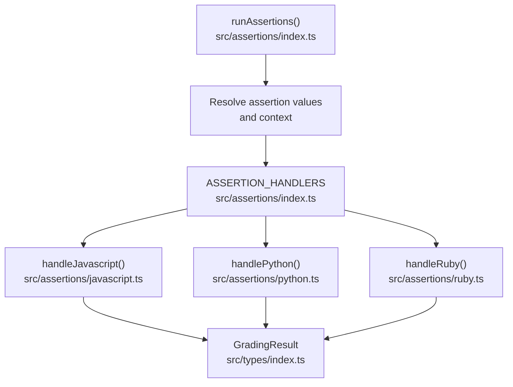
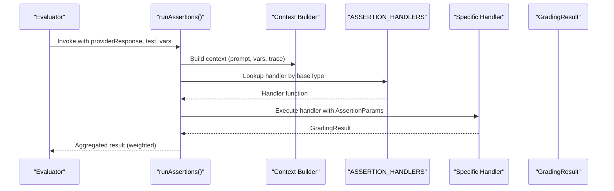
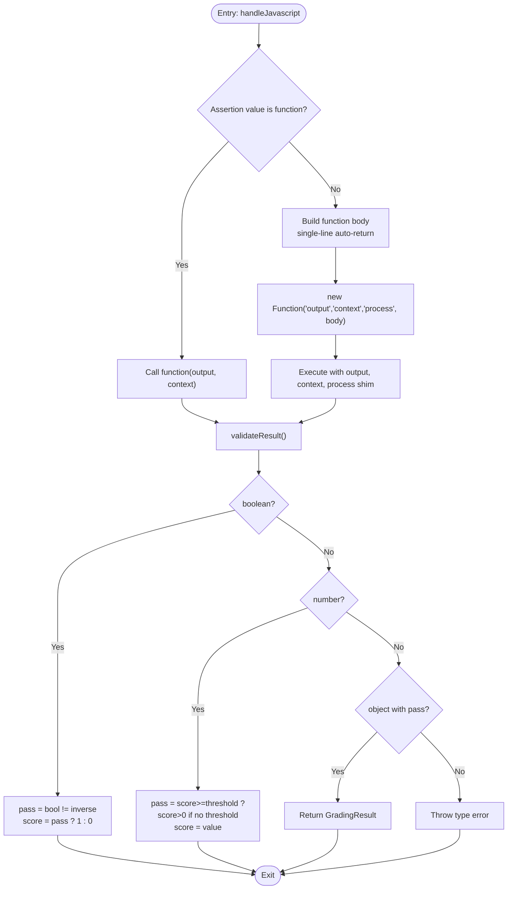
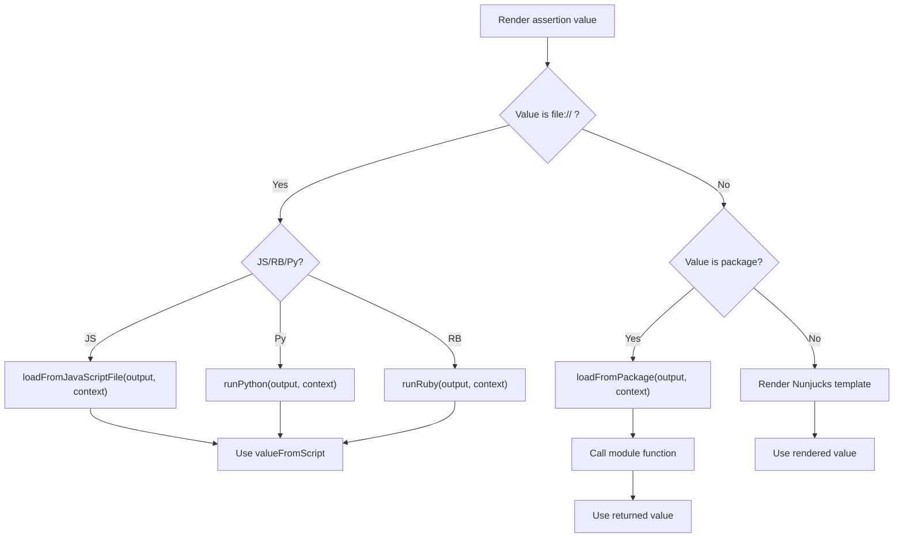
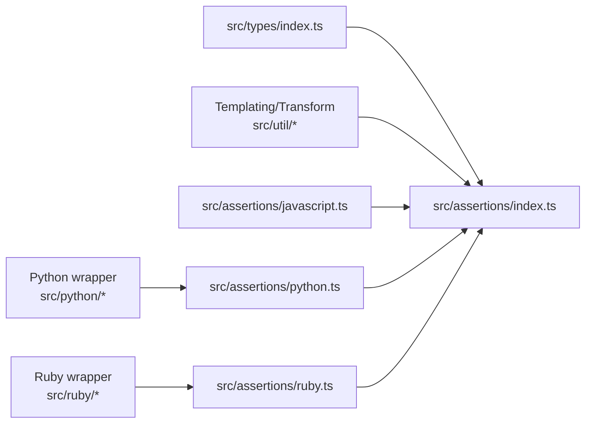

# Custom Assertion Development

<cite>
**Referenced Files in This Document**
- [index.ts](file://src/assertions/index.ts)
- [javascript.ts](file://src/assertions/javascript.ts)
- [python.ts](file://src/assertions/python.ts)
- [ruby.ts](file://src/assertions/ruby.ts)
- [index.ts](file://src/types/index.ts)
- [customAssertion.ts](file://examples/custom-grader-csv/customAssertion.ts)
- [promptfooconfig.yaml](file://examples/custom-grader-csv/promptfooconfig.yaml)
- [assert.js](file://examples/javascript-assert-external/assert.js)
- [template-prompt.rb](file://examples/executable-prompts/template-prompt.rb)
- [asserts.yaml](file://examples/standalone-assertions/asserts.yaml)
- [assertions.yaml](file://test/smoke/fixtures/configs/assertions.yaml)
- [contains-assertion.yaml](file://test/smoke/fixtures/configs/contains-assertion.yaml)
- [file-ref-assertion-value.yaml](file://test/smoke/fixtures/configs/file-ref-assertion-value.yaml)
- [inline-js-assertion.yaml](file://test/smoke/fixtures/configs/inline-js-assertion.yaml)
- [dynamic-var-assertion-7334.yaml](file://test/smoke/fixtures/configs/dynamic-var-assertion-7334.yaml)
- [contains-all-assertion.yaml](file://test/smoke/fixtures/configs/contains-all-assertion.yaml)
- [contains-any-assertion.yaml](file://test/smoke/fixtures/configs/contains-any-assertion.yaml)
- [cost-assertion.yaml](file://test/smoke/fixtures/configs/cost-assertion.yaml)
- [ends-with-assertion.yaml](file://test/smoke/fixtures/configs/ends-with-assertion.yaml)
- [failing-assertion.yaml](file://test/smoke/fixtures/configs/failing-assertion.yaml)
- [ruby-test-config.yaml](file://test/fixtures/file-script-assertions/ruby-test-config.yaml)
- [rubric-generator.py](file://test/fixtures/file-script-assertions/rubric-generator.py)
- [check_keywords.py](file://test/smoke/fixtures/assertions/check_keywords.py)
- [dynamic-value.py](file://test/smoke/fixtures/assertions/dynamic-value.py)
- [rubric-generator.rb](file://test/fixtures/file-script-assertions/rubric-generator.rb)
</cite>

## Table of Contents
1. [Introduction](#introduction)
2. [Project Structure](#project-structure)
3. [Core Components](#core-components)
4. [Architecture Overview](#architecture-overview)
5. [Detailed Component Analysis](#detailed-component-analysis)
6. [Dependency Analysis](#dependency-analysis)
7. [Performance Considerations](#performance-considerations)
8. [Troubleshooting Guide](#troubleshooting-guide)
9. [Conclusion](#conclusion)
10. [Appendices](#appendices)

## Introduction
This document explains how to develop custom assertions in PromptFoo. It covers the assertion interface, registration system, and how to implement assertions in JavaScript, TypeScript, Python, and Ruby. It also documents function signatures, parameter handling, return value formats, error management, integration with external APIs and databases, caching and performance strategies, and practical examples for complex use cases such as CSV-based grading, multi-language evaluation, and external service integration. Finally, it provides templates, testing and debugging techniques, and deployment considerations.

## Project Structure
PromptFoo’s assertion system is organized around a central dispatcher that routes assertions to specialized handlers. The core dispatcher resolves assertion values (including file/script references), prepares a context object, and invokes the appropriate handler. Handlers support built-in assertion types and custom scripts in JavaScript, Python, and Ruby.

**Diagram sources**
- [index.ts:117-200](file://src/assertions/index.ts#L117-L200)
- [javascript.ts:118-209](file://src/assertions/javascript.ts#L118-L209)
- [python.ts:8-126](file://src/assertions/python.ts#L8-L126)
- [ruby.ts:8-127](file://src/assertions/ruby.ts#L8-L127)
- [index.ts:1-200](file://src/types/index.ts#L1-L200)

**Section sources**
- [index.ts:117-200](file://src/assertions/index.ts#L117-L200)
- [index.ts:1-200](file://src/types/index.ts#L1-L200)

## Core Components
- Central dispatcher: Resolves values, builds context, selects handler, and aggregates results.
- Assertion value resolution: Supports inline values, file references, and package-based functions.
- Context object: Provides prompt, vars, test, provider info, trace data, and metadata.
- Handler registry: Maps assertion types to handler functions.
- Return format: All handlers produce a standardized GradingResult.

Key responsibilities:
- Value rendering and script execution for file/script-based assertions.
- Validation of return types from custom functions/scripts.
- Threshold handling and inverse assertion logic.
- Metric name rendering via templating.

**Section sources**
- [index.ts:252-512](file://src/assertions/index.ts#L252-L512)
- [index.ts:407-447](file://src/assertions/index.ts#L407-L447)
- [index.ts:1-200](file://src/types/index.ts#L1-L200)

## Architecture Overview
The assertion pipeline integrates with the evaluation engine to grade outputs against assertions. It supports:
- Built-in assertion types (e.g., contains, equals, similarity).
- Custom script-based assertions (javascript, python, ruby).
- File references for external scripts.
- Package-based functions.
- Tracing and metadata propagation.

**Diagram sources**
- [index.ts:514-617](file://src/assertions/index.ts#L514-L617)
- [index.ts:461-478](file://src/assertions/index.ts#L461-L478)
- [index.ts:117-200](file://src/assertions/index.ts#L117-L200)

## Detailed Component Analysis

### Assertion Interface and Registration
- AssertionParams: The unified input to all handlers, including assertion metadata, base type, provider context, output, rendered value, and flags (inverse, threshold).
- Base types and inverses: Inverse assertions (e.g., not-contains) are normalized to base types for handler selection.
- Handler registry: A map from base assertion type to handler function. Unknown types raise an error.

Implementation highlights:
- Base type extraction and inverse detection.
- Provider call context construction for model-graded assertions.
- Weight-zero assertions treated as metrics-only.

**Section sources**
- [index.ts:237-250](file://src/assertions/index.ts#L237-L250)
- [index.ts:461-478](file://src/assertions/index.ts#L461-L478)
- [index.ts:485-512](file://src/assertions/index.ts#L485-L512)

### JavaScript Assertions
Supported modes:
- Inline single-line expressions (auto-return injection).
- Multiline bodies (user-controlled returns).
- External script references returning a function or boolean/number/object.

Function signature:
- Parameters: output (stringified), context (object).
- Return: boolean, number, or GradingResult.

Validation and error handling:
- Enforces return type correctness.
- Converts boolean to pass/score and includes reason text.
- Propagates stack traces and assertion code in error messages.

**Diagram sources**
- [javascript.ts:118-209](file://src/assertions/javascript.ts#L118-L209)

**Section sources**
- [javascript.ts:118-209](file://src/assertions/javascript.ts#L118-L209)

### Python Assertions
Supported modes:
- Inline single-line expressions (auto-return injection).
- Multiline bodies with automatic indentation.
- External script references returning a function result.

Function signature:
- Parameters: output, context.
- Return: boolean, number, JSON string, or object.

Validation and error handling:
- Accepts boolean-like strings ("true"/"false").
- Parses JSON strings into GradingResult objects.
- Maps snake_case keys to camelCase for compatibility.
- Applies threshold checks and enriches reason messages.

**Section sources**
- [python.ts:8-126](file://src/assertions/python.ts#L8-L126)

### Ruby Assertions
Supported modes:
- Inline single-line expressions (auto-return injection).
- Multiline bodies with automatic indentation.
- External script references returning a function result.

Function signature:
- Parameters: output, context.
- Return: boolean, number, JSON string, or object.

Validation and error handling:
- Mirrors Python behavior for boolean-like strings and JSON parsing.
- Maps snake_case keys to camelCase for compatibility.
- Applies threshold checks and enriches reason messages.

**Section sources**
- [ruby.ts:8-127](file://src/assertions/ruby.ts#L8-L127)

### Assertion Value Resolution and Script Execution
The dispatcher resolves assertion values and supports:
- File references (file://path[:function]).
- Package-based functions (package@path:function).
- Nunjucks templating for strings and arrays.

Behavior:
- For javascript/python/ruby types, valueFromScript is interpreted as a function result or code to execute.
- For other types, valueFromScript must be a scalar or structured value (not a function/boolean/GradingResult).

**Diagram sources**
- [index.ts:321-447](file://src/assertions/index.ts#L321-L447)

**Section sources**
- [index.ts:321-447](file://src/assertions/index.ts#L321-L447)

### GradingResult Contract
All handlers must return a standardized result shape. The GradingResult contract includes:
- pass: boolean
- score: number
- reason: string
- assertion: Assertion metadata
- componentResults: optional array of sub-results
- namedScores: optional map of metric names to scores
- metadata: optional free-form metadata

Threshold and inverse logic:
- For numeric scores, pass = score >= threshold (if threshold present) or score > 0 otherwise.
- For boolean returns, pass flips when the assertion is inverse.

**Section sources**
- [index.ts:1-200](file://src/types/index.ts#L1-L200)
- [javascript.ts:178-188](file://src/assertions/javascript.ts#L178-L188)
- [python.ts:89-95](file://src/assertions/python.ts#L89-L95)
- [ruby.ts:90-96](file://src/assertions/ruby.ts#L90-L96)

### External Integrations and Custom Grading Systems
- External APIs: Use file-based scripts to call external services. The context object provides prompt, vars, provider, and metadata for constructing requests.
- Databases: Scripts can query local or remote databases using language-native drivers.
- Custom rubrics: Implement rubric scoring in Python/Ruby and return a GradingResult with componentResults and namedScores.

Examples:
- CSV-based grading: Implement a Python/Ruby function that reads CSV rubrics and computes scores.
- Multi-language evaluation: Use Ruby for domain-specific logic while keeping the rest of the pipeline in JavaScript.
- External service integration: Use file references to call REST endpoints or ML APIs.

**Section sources**
- [customAssertion.ts:1-4](file://examples/custom-grader-csv/customAssertion.ts#L1-L4)
- [promptfooconfig.yaml:1-8](file://examples/custom-grader-csv/promptfooconfig.yaml#L1-L8)
- [assert.js:1-47](file://examples/javascript-assert-external/assert.js#L1-L47)
- [template-prompt.rb:1-140](file://examples/executable-prompts/template-prompt.rb#L1-L140)

## Dependency Analysis
The assertion system depends on:
- Types for shared contracts (Assertion, GradingResult, ProviderResponse).
- Utilities for templating, transformation, and process shims.
- Language-specific executors for Python and Ruby.
- Optional external matchers and providers.

**Diagram sources**
- [index.ts:1-101](file://src/assertions/index.ts#L1-L101)
- [javascript.ts:1-6](file://src/assertions/javascript.ts#L1-L6)
- [python.ts:1-7](file://src/assertions/python.ts#L1-L7)
- [ruby.ts:1-7](file://src/assertions/ruby.ts#L1-L7)

**Section sources**
- [index.ts:1-101](file://src/assertions/index.ts#L1-L101)

## Performance Considerations
- Concurrency: Assertions run with bounded concurrency controlled by an environment variable. This prevents resource exhaustion during evaluation.
- Transformations: Use transform to pre-process outputs to reduce repeated computation.
- Script execution: Prefer lightweight scripts and avoid heavy I/O in hot paths.
- Thresholds: Use thresholds to short-circuit scoring when possible.
- Weight-zero metrics: Metrics-only assertions (weight=0) are forced to pass and do not contribute to pass/fail decisions.

**Section sources**
- [index.ts:103-103](file://src/assertions/index.ts#L103-L103)
- [index.ts:501-506](file://src/assertions/index.ts#L501-L506)

## Troubleshooting Guide
Common issues and resolutions:
- Unknown assertion type: Ensure the assertion type is registered or use a supported base type.
- Script return type errors: For javascript/python/ruby, return boolean, number, or GradingResult. For other types, return a scalar or structured value.
- Python/Ruby JSON parsing failures: Ensure returned JSON strings parse to valid GradingResult objects.
- Threshold violations: Verify threshold values and that scores meet the required conditions.
- File/script loading failures: Confirm file paths, function names, and permissions.

Debugging tips:
- Inspect rendered assertion values in result metadata.
- Log context fields (prompt, vars, providerResponse) in custom scripts.
- Use componentResults and namedScores to break down complex assertions.
- Enable trace collection to correlate assertion outcomes with provider calls.

**Section sources**
- [index.ts:511-511](file://src/assertions/index.ts#L511-L511)
- [javascript.ts:105-116](file://src/assertions/javascript.ts#L105-L116)
- [python.ts:60-72](file://src/assertions/python.ts#L60-L72)
- [ruby.ts:61-73](file://src/assertions/ruby.ts#L61-L73)

## Conclusion
PromptFoo’s assertion system provides a flexible, extensible framework for evaluating model outputs. By leveraging the centralized dispatcher, typed context, and language-specific executors, you can implement robust custom assertions in JavaScript, Python, and Ruby. Use file/script references for modular, reusable logic, integrate external services and databases, and apply thresholds and metrics to build comprehensive evaluation pipelines.

## Appendices

### Assertion Function Signatures and Return Formats
- JavaScript: (output: string, context: object) => boolean | number | GradingResult
- Python: (output, context) -> returns boolean/number/JSON-string/object
- Ruby: (output, context) -> returns boolean/number/JSON-string/object

Return format (GradingResult):
- pass: boolean
- score: number
- reason: string
- assertion: Assertion metadata
- componentResults: optional array of sub-results
- namedScores: optional map of metric names to scores
- metadata: optional free-form metadata

**Section sources**
- [javascript.ts:118-209](file://src/assertions/javascript.ts#L118-L209)
- [python.ts:8-126](file://src/assertions/python.ts#L8-L126)
- [ruby.ts:8-127](file://src/assertions/ruby.ts#L8-L127)
- [index.ts:1-200](file://src/types/index.ts#L1-L200)

### Parameter Handling and Context
- output: The provider response text.
- outputString: Stringified output for convenience.
- context: Includes prompt, vars, test, provider, providerResponse, config, and trace data when available.
- traceId: Optional identifier enabling trace retrieval and span correlation.

**Section sources**
- [index.ts:288-315](file://src/assertions/index.ts#L288-L315)
- [index.ts:461-478](file://src/assertions/index.ts#L461-L478)

### Error Management Patterns
- Type validation: Handlers enforce return types and throw descriptive errors.
- Script execution errors: Captured and wrapped with assertion code and stack traces.
- JSON parsing errors: Thrown with context for debugging.

**Section sources**
- [javascript.ts:105-116](file://src/assertions/javascript.ts#L105-L116)
- [python.ts:64-66](file://src/assertions/python.ts#L64-L66)
- [ruby.ts:63-67](file://src/assertions/ruby.ts#L63-L67)

### Integration Examples

#### CSV-Based Grading (Python/Ruby)
- Implement a function that loads a CSV rubric and computes a score.
- Return a GradingResult with pass, score, and reason.
- Reference the script via file:// in the assertion value.

**Section sources**
- [customAssertion.ts:1-4](file://examples/custom-grader-csv/customAssertion.ts#L1-L4)
- [promptfooconfig.yaml:1-8](file://examples/custom-grader-csv/promptfooconfig.yaml#L1-L8)

#### Multi-Language Evaluation
- Use Ruby for domain-specific logic while keeping the rest of the pipeline in JavaScript.
- Return a GradingResult with componentResults to capture multiple dimensions.

**Section sources**
- [template-prompt.rb:1-140](file://examples/executable-prompts/template-prompt.rb#L1-L140)
- [assert.js:13-45](file://examples/javascript-assert-external/assert.js#L13-L45)

#### External Service Integration
- Use file-based scripts to call REST endpoints or ML APIs.
- Pass context fields (prompt, vars, providerResponse) to construct requests.

**Section sources**
- [assert.js:1-47](file://examples/javascript-assert-external/assert.js#L1-L47)

### Assertion Testing and Debugging Templates

- Basic assertion templates:
  - Inline JavaScript: see [inline-js-assertion.yaml](file://test/smoke/fixtures/configs/inline-js-assertion.yaml)
  - Contains assertions: see [contains-assertion.yaml](file://test/smoke/fixtures/configs/contains-assertion.yaml), [contains-all-assertion.yaml](file://test/smoke/fixtures/configs/contains-all-assertion.yaml), [contains-any-assertion.yaml](file://test/smoke/fixtures/configs/contains-any-assertion.yaml)
  - Ends-with: see [ends-with-assertion.yaml](file://test/smoke/fixtures/configs/ends-with-assertion.yaml)
  - Cost: see [cost-assertion.yaml](file://test/smoke/fixtures/configs/cost-assertion.yaml)
  - Dynamic variables: see [dynamic-var-assertion-7334.yaml](file://test/smoke/fixtures/configs/dynamic-var-assertion-7334.yaml)
  - Failing assertions: see [failing-assertion.yaml](file://test/smoke/fixtures/configs/failing-assertion.yaml)
  - Standalone assertions: see [asserts.yaml](file://examples/standalone-assertions/asserts.yaml)

- File-reference examples:
  - JavaScript: see [file-ref-assertion-value.yaml](file://test/smoke/fixtures/configs/file-ref-assertion-value.yaml)
  - Python: see [check_keywords.py](file://test/smoke/fixtures/assertions/check_keywords.py), [dynamic-value.py](file://test/smoke/fixtures/assertions/dynamic-value.py), [rubric-generator.py](file://test/fixtures/file-script-assertions/rubric-generator.py)
  - Ruby: see [rubric-generator.rb](file://test/fixtures/file-script-assertions/rubric-generator.rb), [ruby-test-config.yaml](file://test/fixtures/file-script-assertions/ruby-test-config.yaml)

**Section sources**
- [asserts.yaml](file://examples/standalone-assertions/asserts.yaml)
- [assertions.yaml](file://test/smoke/fixtures/configs/assertions.yaml)
- [contains-assertion.yaml](file://test/smoke/fixtures/configs/contains-assertion.yaml)
- [contains-all-assertion.yaml](file://test/smoke/fixtures/configs/contains-all-assertion.yaml)
- [contains-any-assertion.yaml](file://test/smoke/fixtures/configs/contains-any-assertion.yaml)
- [cost-assertion.yaml](file://test/smoke/fixtures/configs/cost-assertion.yaml)
- [ends-with-assertion.yaml](file://test/smoke/fixtures/configs/ends-with-assertion.yaml)
- [failing-assertion.yaml](file://test/smoke/fixtures/configs/failing-assertion.yaml)
- [file-ref-assertion-value.yaml](file://test/smoke/fixtures/configs/file-ref-assertion-value.yaml)
- [inline-js-assertion.yaml](file://test/smoke/fixtures/configs/inline-js-assertion.yaml)
- [dynamic-var-assertion-7334.yaml](file://test/smoke/fixtures/configs/dynamic-var-assertion-7334.yaml)
- [check_keywords.py](file://test/smoke/fixtures/assertions/check_keywords.py)
- [dynamic-value.py](file://test/smoke/fixtures/assertions/dynamic-value.py)
- [rubric-generator.py](file://test/fixtures/file-script-assertions/rubric-generator.py)
- [rubric-generator.rb](file://test/fixtures/file-script-assertions/rubric-generator.rb)
- [ruby-test-config.yaml](file://test/fixtures/file-script-assertions/ruby-test-config.yaml)

### Deployment Considerations
- Isolate external calls: Wrap network/database calls with timeouts and retries.
- Version scripts: Pin dependencies for Python/Ruby to ensure reproducibility.
- Secure context: Avoid leaking secrets; pass only necessary context fields.
- Monitor performance: Use namedScores and componentResults to track bottlenecks.
- CI/CD: Cache assertion scripts and reuse environments to speed up evaluations.