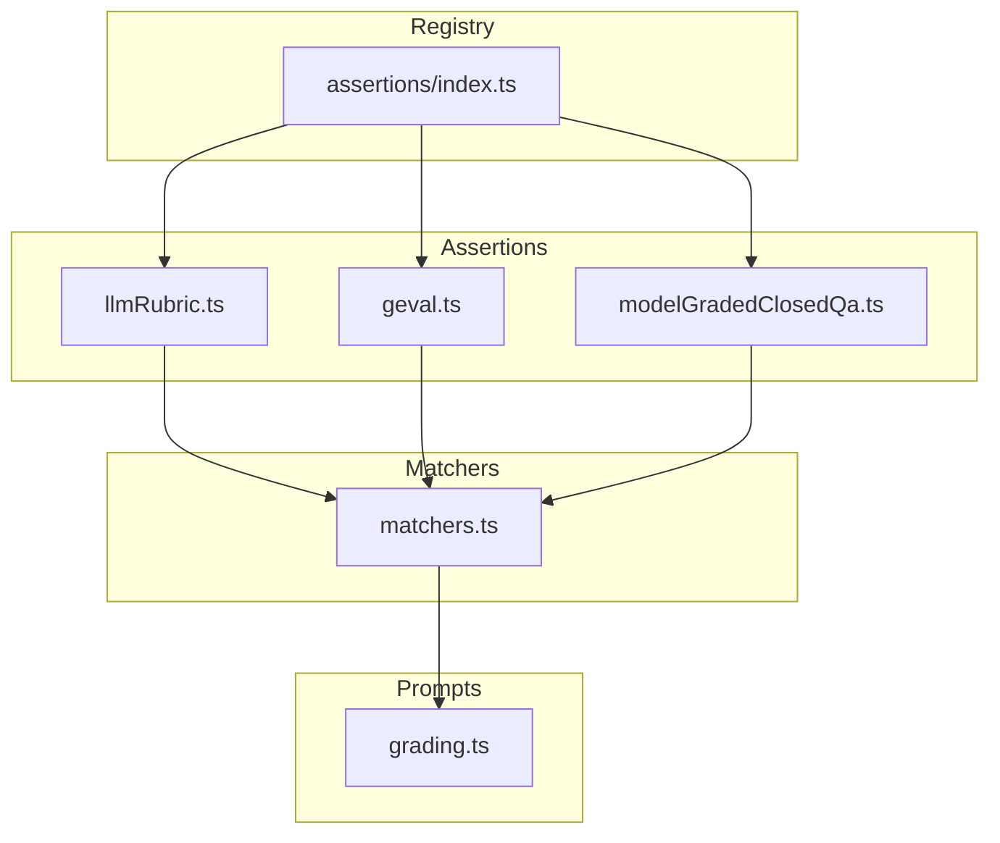
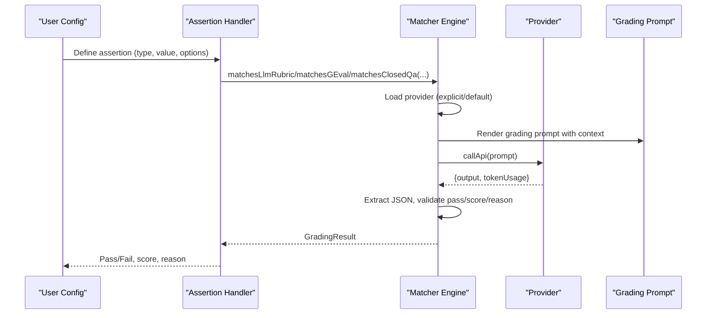
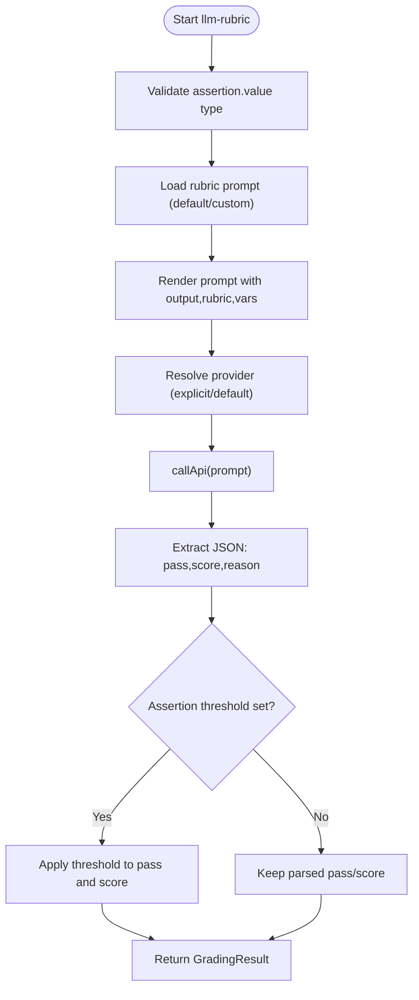
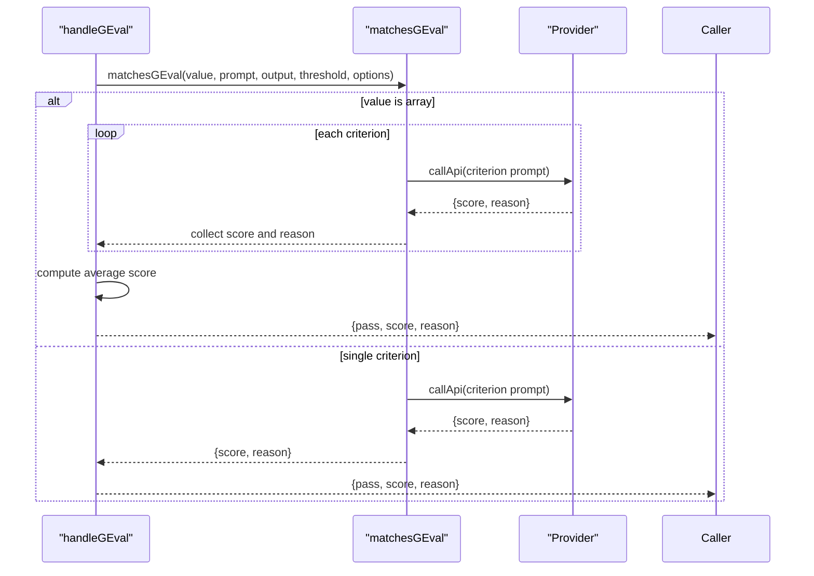
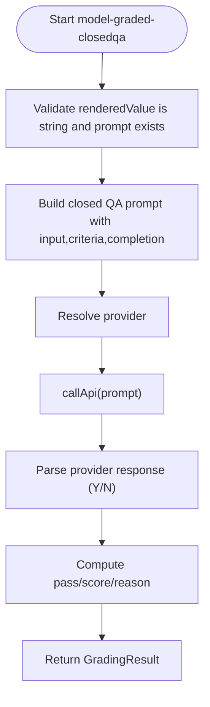
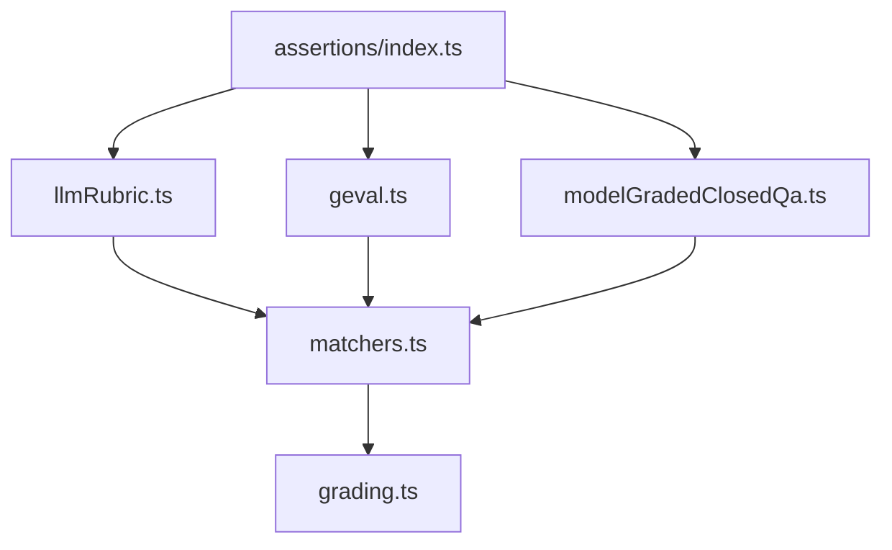

# Model-Graded Assertions

<cite>
**Referenced Files in This Document**
- [llmRubric.ts](file://src/assertions/llmRubric.ts)
- [geval.ts](file://src/assertions/geval.ts)
- [modelGradedClosedQa.ts](file://src/assertions/modelGradedClosedQa.ts)
- [grading.ts](file://src/prompts/grading.ts)
- [matchers.ts](file://src/matchers.ts)
- [index.ts](file://src/assertions/index.ts)
- [g-eval.md](file://site/docs/configuration/expected-outputs/model-graded/g-eval.md)
- [index.md](file://site/docs/configuration/expected-outputs/model-graded/index.md)
- [token-tracking.test.ts](file://test/matchers/token-tracking.test.ts)
- [closed-qa.test.ts](file://test/matchers/closed-qa.test.ts)
- [geval.test.ts](file://test/assertions/geval.test.ts)
</cite>

## Table of Contents
1. [Introduction](#introduction)
2. [Project Structure](#project-structure)
3. [Core Components](#core-components)
4. [Architecture Overview](#architecture-overview)
5. [Detailed Component Analysis](#detailed-component-analysis)
6. [Dependency Analysis](#dependency-analysis)
7. [Performance Considerations](#performance-considerations)
8. [Troubleshooting Guide](#troubleshooting-guide)
9. [Conclusion](#conclusion)
10. [Appendices](#appendices)

## Introduction
Model-graded assertions in PromptFoo use Large Language Models (LLMs) to evaluate LLM outputs, enabling scalable, nuanced assessment beyond keyword matching. This approach offers advantages such as contextual understanding, tolerance for paraphrasing, adaptability to complex rubrics, and extensibility to advanced frameworks like G-Eval.

PromptFoo supports three primary model-graded assertion types:
- LLM-Rubric: Evaluates outputs against a rubric using a configurable grader model.
- G-Eval: Applies Google’s G-Eval framework for multi-criteria evaluations with chain-of-thought and probability scoring.
- Model-Graded Closed QA: Uses a closed-domain question-answering prompt to assess adherence to a criterion.

These assertions integrate with PromptFoo’s provider system, support structured output requirements, and provide robust token usage tracking and fallback strategies.

## Project Structure
The model-graded assertion system is organized around dedicated assertion handlers, a central matcher engine, and reusable prompts for grading.

**Diagram sources**
- [llmRubric.ts:1-36](file://src/assertions/llmRubric.ts#L1-L36)
- [geval.ts:1-62](file://src/assertions/geval.ts#L1-L62)
- [modelGradedClosedQa.ts:1-34](file://src/assertions/modelGradedClosedQa.ts#L1-L34)
- [matchers.ts:1-120](file://src/matchers.ts#L1-L120)
- [grading.ts:1-150](file://src/prompts/grading.ts#L1-L150)
- [index.ts:105-200](file://src/assertions/index.ts#L105-L200)

**Section sources**
- [llmRubric.ts:1-36](file://src/assertions/llmRubric.ts#L1-L36)
- [geval.ts:1-62](file://src/assertions/geval.ts#L1-L62)
- [modelGradedClosedQa.ts:1-34](file://src/assertions/modelGradedClosedQa.ts#L1-L34)
- [matchers.ts:1-120](file://src/matchers.ts#L1-L120)
- [grading.ts:1-150](file://src/prompts/grading.ts#L1-L150)
- [index.ts:105-200](file://src/assertions/index.ts#L105-L200)

## Core Components
- LLM-Rubric Assertion Handler: Validates input types, renders rubric prompts, and delegates grading to the matcher engine.
- G-Eval Assertion Handler: Supports single or multiple criteria, computes average scores, and applies thresholds.
- Model-Graded Closed QA Handler: Requires a prompt and rubric value, constructs a closed QA prompt, and returns pass/score/reason.
- Matcher Engine: Loads providers, renders prompts, extracts JSON results, validates pass/score/reason, and tracks token usage.
- Grading Prompts: Provides default rubric, factuality, closed QA, and web-search prompts.

Key behaviors:
- Provider selection prioritizes explicit configuration, falls back to defaultTest.options.provider, and finally to built-in defaults.
- JSON extraction and validation ensure consistent grading results.
- Token usage tracking is propagated for cost and performance monitoring.

**Section sources**
- [llmRubric.ts:6-35](file://src/assertions/llmRubric.ts#L6-L35)
- [geval.ts:6-61](file://src/assertions/geval.ts#L6-L61)
- [modelGradedClosedQa.ts:6-33](file://src/assertions/modelGradedClosedQa.ts#L6-L33)
- [matchers.ts:138-240](file://src/matchers.ts#L138-L240)
- [matchers.ts:600-748](file://src/matchers.ts#L600-L748)
- [grading.ts:11-97](file://src/prompts/grading.ts#L11-L97)

## Architecture Overview
The model-graded evaluation pipeline connects assertion handlers to the matcher engine and provider layer.

**Diagram sources**
- [llmRubric.ts:6-35](file://src/assertions/llmRubric.ts#L6-L35)
- [geval.ts:6-61](file://src/assertions/geval.ts#L6-L61)
- [modelGradedClosedQa.ts:6-33](file://src/assertions/modelGradedClosedQa.ts#L6-L33)
- [matchers.ts:138-240](file://src/matchers.ts#L138-L240)
- [matchers.ts:600-748](file://src/matchers.ts#L600-L748)
- [grading.ts:11-97](file://src/prompts/grading.ts#L11-L97)

## Detailed Component Analysis

### LLM-Rubric Assertion
- Purpose: Evaluate outputs against rubrics using a configurable grader.
- Input validation: Accepts string/object/undefined rubric values; stores rendered rubric for UI display.
- Prompt rendering: Loads rubric prompt (default or custom), renders with output and rubric context.
- Provider resolution: Uses explicit provider, defaultTest.options.provider, or built-in defaults.
- Result parsing: Extracts JSON with pass, score, reason; normalizes pass/score; applies assertion threshold if provided.
- Token usage: Propagates token usage from provider responses.

**Diagram sources**
- [llmRubric.ts:13-35](file://src/assertions/llmRubric.ts#L13-L35)
- [matchers.ts:495-540](file://src/matchers.ts#L495-L540)
- [matchers.ts:600-748](file://src/matchers.ts#L600-L748)

**Section sources**
- [llmRubric.ts:6-35](file://src/assertions/llmRubric.ts#L6-L35)
- [matchers.ts:495-540](file://src/matchers.ts#L495-L540)
- [matchers.ts:600-748](file://src/matchers.ts#L600-L748)

### G-Eval Assertion
- Purpose: Evaluate outputs against one or more criteria using G-Eval’s CoT and probability scoring.
- Input validation: Accepts string or array of strings; defaults threshold to 0.7.
- Multi-criteria: Iterates over criteria, collects scores and reasons, computes average score.
- Provider resolution: Respects explicit provider, defaultTest.options.provider, or defaults.
- Result composition: Returns pass if average meets threshold; aggregates reasons.

**Diagram sources**
- [geval.ts:6-61](file://src/assertions/geval.ts#L6-L61)
- [matchers.ts:1-120](file://src/matchers.ts#L1-L120)

**Section sources**
- [geval.ts:6-61](file://src/assertions/geval.ts#L6-L61)
- [matchers.ts:1-120](file://src/matchers.ts#L1-L120)
- [g-eval.md:1-61](file://site/docs/configuration/expected-outputs/model-graded/g-eval.md#L1-L61)
- [geval.test.ts:148-204](file://test/assertions/geval.test.ts#L148-L204)

### Model-Graded Closed QA Assertion
- Purpose: Assess whether a submission meets a criterion for a given task using a closed QA prompt.
- Input validation: Requires string rubric and prompt; defers rubric rendering until matcher.
- Prompt construction: Uses a closed QA prompt template with input, completion, and criteria.
- Provider resolution: Resolves provider similarly to other model-graded assertions.
- Result interpretation: Returns pass/score/reason derived from provider response.

**Diagram sources**
- [modelGradedClosedQa.ts:14-33](file://src/assertions/modelGradedClosedQa.ts#L14-L33)
- [matchers.ts:939-945](file://src/matchers.ts#L939-L945)
- [grading.ts:80-97](file://src/prompts/grading.ts#L80-L97)

**Section sources**
- [modelGradedClosedQa.ts:6-33](file://src/assertions/modelGradedClosedQa.ts#L6-L33)
- [matchers.ts:939-945](file://src/matchers.ts#L939-L945)
- [grading.ts:80-97](file://src/prompts/grading.ts#L80-L97)
- [closed-qa.test.ts:23-40](file://test/matchers/closed-qa.test.ts#L23-L40)

### Provider Resolution and Prompt Rendering
- Provider selection: Explicit provider string/object overrides defaultTest.options.provider; otherwise falls back to built-in defaults.
- Prompt loading: Rubric prompts can be provided as strings, file references, or JavaScript functions; supports Nunjucks templating.
- Context rendering: Outputs and rubrics are parsed and injected into prompts; variables are rendered via Nunjucks.

**Section sources**
- [matchers.ts:138-240](file://src/matchers.ts#L138-L240)
- [matchers.ts:495-540](file://src/matchers.ts#L495-L540)
- [matchers.ts:577-598](file://src/matchers.ts#L577-L598)

### Structured Output Requirements and Schema Validation
- Response format support: The system supports response_format configurations (e.g., json_schema) and loads nested schemas from external files.
- Variable rendering: Variables are rendered in response_format and nested schemas prior to loading.
- Validation: Ensures schema correctness and compatibility with provider expectations.

Note: This section focuses on response_format handling and schema loading; model-graded assertions primarily consume provider outputs rather than produce structured outputs.

**Section sources**
- [index.md:163-223](file://site/docs/configuration/expected-outputs/model-graded/index.md#L163-L223)

## Dependency Analysis
Model-graded assertions depend on:
- Assertion handlers for routing and preconditions.
- Matcher engine for provider resolution, prompt rendering, and result parsing.
- Prompt registry for default and specialized prompts.
- Provider system for API calls and token usage tracking.

**Diagram sources**
- [index.ts:105-200](file://src/assertions/index.ts#L105-L200)
- [llmRubric.ts:1-36](file://src/assertions/llmRubric.ts#L1-L36)
- [geval.ts:1-62](file://src/assertions/geval.ts#L1-L62)
- [modelGradedClosedQa.ts:1-34](file://src/assertions/modelGradedClosedQa.ts#L1-L34)
- [matchers.ts:1-120](file://src/matchers.ts#L1-L120)
- [grading.ts:1-150](file://src/prompts/grading.ts#L1-L150)

**Section sources**
- [index.ts:105-200](file://src/assertions/index.ts#L105-L200)
- [matchers.ts:1-120](file://src/matchers.ts#L1-L120)

## Performance Considerations
- Provider selection: Prefer efficient models for rubric grading to reduce latency and cost; override grader via CLI or test options.
- Token usage tracking: Monitor total, prompt, and completion tokens; use this data to tune prompts and providers.
- Concurrency: Assertion evaluation runs with bounded concurrency; adjust environment variables to balance throughput and resource usage.
- Remote grading: When enabled, model-graded tasks may be evaluated remotely, reducing local overhead.

Evidence and references:
- Token tracking in matcher tests demonstrates numRequests and tokenUsage propagation.
- Provider resolution and fallback logic minimize repeated provider initialization.

**Section sources**
- [token-tracking.test.ts:16-46](file://test/matchers/token-tracking.test.ts#L16-L46)
- [matchers.ts:138-240](file://src/matchers.ts#L138-L240)
- [index.md:190-223](file://site/docs/configuration/expected-outputs/model-graded/index.md#L190-L223)

## Troubleshooting Guide
Common issues and resolutions:
- Malformed JSON from grader: The matcher extracts JSON objects and fails gracefully if none are found; ensure the grader responds with valid JSON containing pass, score, reason.
- Missing provider: If no provider is configured, the system falls back to defaults; explicitly set provider or defaultTest.options.provider to avoid ambiguity.
- Empty or unexpected output: Validate provider responses and ensure output is a string or object; the matcher handles both cases.
- Threshold misalignment: Assertion thresholds override parsed scores; confirm threshold values align with intended pass/fail behavior.

**Section sources**
- [matchers.ts:662-748](file://src/matchers.ts#L662-L748)
- [matchers.ts:138-240](file://src/matchers.ts#L138-L240)
- [geval.test.ts:206-214](file://test/assertions/geval.test.ts#L206-L214)

## Conclusion
Model-graded assertions in PromptFoo provide a flexible, extensible framework for evaluating LLM outputs. By leveraging configurable grader providers, robust prompt rendering, and structured result parsing, teams can implement nuanced rubrics, multi-criteria evaluations with G-Eval, and closed QA assessments. Proper provider selection, threshold tuning, and token usage monitoring enable cost-effective and high-performance evaluations.

## Appendices

### A. Assertion Types and Behavior Summary
- LLM-Rubric: Evaluates rubric-defined criteria; supports custom rubric prompts and thresholds.
- G-Eval: Multi-criteria evaluation with CoT and probability scoring; supports arrays of criteria.
- Model-Graded Closed QA: Criterion-based closed QA evaluation using a standardized prompt.

**Section sources**
- [index.ts:105-200](file://src/assertions/index.ts#L105-L200)
- [g-eval.md:1-61](file://site/docs/configuration/expected-outputs/model-graded/g-eval.md#L1-L61)

### B. Provider Override Options
- CLI override: Use the grader flag to specify a provider for model-graded assertions.
- Test options: Configure provider at defaultTest or per-test level.
- Per-assertion: Override provider directly on specific assertions.

**Section sources**
- [index.md:190-223](file://site/docs/configuration/expected-outputs/model-graded/index.md#L190-L223)