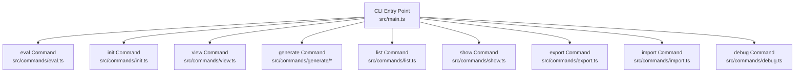
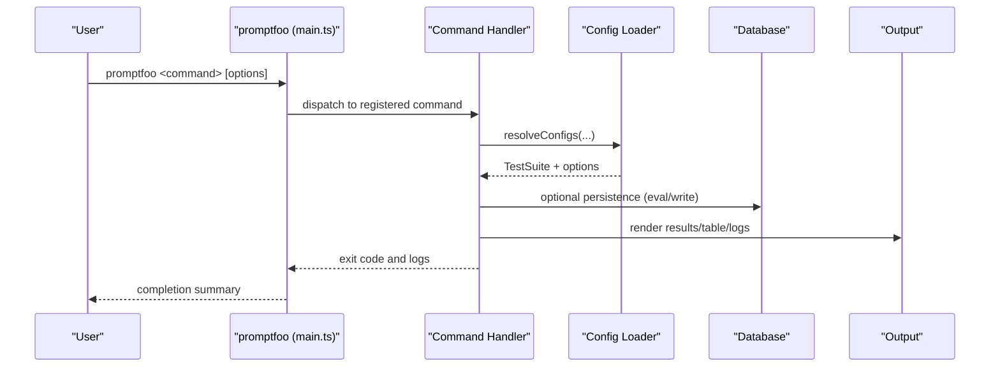
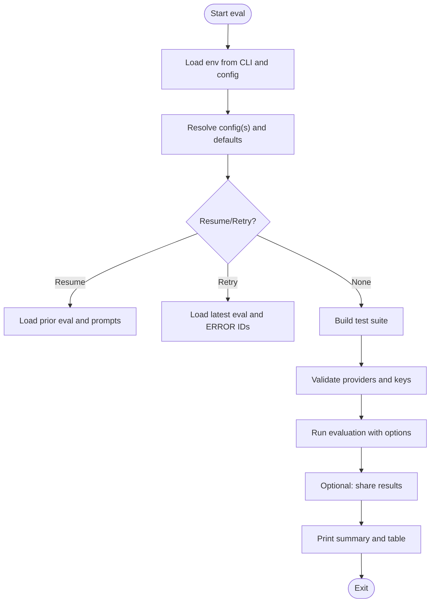
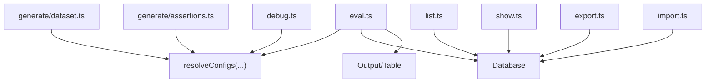

# CLI Command Reference

<cite>
**Referenced Files in This Document**
- [main.ts](file://src/main.ts)
- [eval.ts](file://src/commands/eval.ts)
- [init.ts](file://src/commands/init.ts)
- [view.ts](file://src/commands/view.ts)
- [dataset.ts](file://src/commands/generate/dataset.ts)
- [assertions.ts](file://src/commands/generate/assertions.ts)
- [list.ts](file://src/commands/list.ts)
- [show.ts](file://src/commands/show.ts)
- [export.ts](file://src/commands/export.ts)
- [import.ts](file://src/commands/import.ts)
- [debug.ts](file://src/commands/debug.ts)
</cite>

## Table of Contents
1. [Introduction](#introduction)
2. [Project Structure](#project-structure)
3. [Core Components](#core-components)
4. [Architecture Overview](#architecture-overview)
5. [Detailed Component Analysis](#detailed-component-analysis)
6. [Dependency Analysis](#dependency-analysis)
7. [Performance Considerations](#performance-considerations)
8. [Troubleshooting Guide](#troubleshooting-guide)
9. [Conclusion](#conclusion)
10. [Appendices](#appendices)

## Introduction
This document provides a comprehensive CLI command reference for PromptFoo. It covers all available commands, their syntax, options, flags, and parameters. It also explains configuration discovery, precedence, exit codes, error handling, and practical examples for common and advanced usage patterns. Command-specific options like verbose logging, filtering, concurrency, and provider-specific flags are documented, along with command chaining and piping operations.

## Project Structure
PromptFoo’s CLI is built around a central entry point that registers commands and subcommands. Commands are grouped under top-level commands (e.g., eval, init, view, generate, list, show, export, import, debug) and may include subcommands (e.g., generate dataset, generate assertions, list evals/prompts/datasets, show eval/prompt/dataset, export eval/logs).

**Diagram sources**
- [main.ts:198-245](file://src/main.ts#L198-L245)
- [eval.ts:1-800](file://src/commands/eval.ts#L1-L800)
- [init.ts:214-249](file://src/commands/init.ts#L214-L249)
- [view.ts:9-57](file://src/commands/view.ts#L9-L57)
- [dataset.ts:124-149](file://src/commands/generate/dataset.ts#L124-L149)
- [assertions.ts:130-162](file://src/commands/generate/assertions.ts#L130-L162)
- [list.ts:17-399](file://src/commands/list.ts#L17-L399)
- [show.ts:174-242](file://src/commands/show.ts#L174-L242)
- [export.ts:95-224](file://src/commands/export.ts#L95-L224)
- [import.ts:65-147](file://src/commands/import.ts#L65-L147)
- [debug.ts:78-89](file://src/commands/debug.ts#L78-L89)

**Section sources**
- [main.ts:198-245](file://src/main.ts#L198-L245)

## Core Components
- Central CLI registration and common options: The CLI registers all commands and adds common options (e.g., verbose, env-file) to every command recursively. See [addCommonOptionsRecursively:124-167](file://src/main.ts#L124-L167).
- Command execution lifecycle: Each command sets up environment variables, loads configuration, validates inputs, executes the operation, and prints summaries or artifacts. See [main.ts:169-256](file://src/main.ts#L169-L256).

Key behaviors:
- Verbose logging: Enabled via the global -v/--verbose flag, which adjusts logger verbosity.
- Environment files: Supported via --env-file/--env-path; accepts multiple files or comma-separated values.
- Telemetry: Automatically recorded for all command invocations.

**Section sources**
- [main.ts:124-167](file://src/main.ts#L124-L167)
- [main.ts:169-256](file://src/main.ts#L169-L256)

## Architecture Overview
The CLI orchestrates evaluation, generation, listing, viewing, exporting, importing, and debugging workflows. Commands may depend on configuration resolution, provider loading, database persistence, and output rendering.

**Diagram sources**
- [main.ts:198-245](file://src/main.ts#L198-L245)
- [eval.ts:132-301](file://src/commands/eval.ts#L132-L301)
- [export.ts:102-146](file://src/commands/export.ts#L102-L146)
- [import.ts:71-145](file://src/commands/import.ts#L71-L145)

## Detailed Component Analysis

### eval
Runs evaluations against configured providers and prompts. Supports filtering, resuming, retrying, sharing, and progress reporting.

Syntax
- promptfoo eval [-c PATH] [--env-file PATH] [--env-path PATH] [--verbose] [--write] [--no-write] [--table] [--grader PROVIDER] [--var KEY=VALUE] [--repeat N] [--delay MS] [--max-concurrency N] [--filter-* options] [--resume [ID]] [--retry-errors] [--watch] [--progress-bar] [--no-cache]

Key options
- -c, --config: One or more config paths or directories (directories are auto-resolved to default config filenames).
- --env-file, --env-path: Load environment variables from one or more .env files (comma-separated or multiple flags).
- --verbose: Enable debug logging.
- --write: Persist results to the database (default true unless disabled).
- --no-write: Disable persistence.
- --table: Print a summary table when results are small.
- --grader: Override default test suite grader provider.
- --var: Set variables for defaultTest.vars.
- --repeat: Repeat evaluation N times.
- --delay: Delay between API calls (limits concurrency to 1).
- --max-concurrency: Control parallelism.
- --filter-failing, --filter-failing-only, --filter-errors-only, --filter-first-n N, --filter-metadata KEY=VAL, --filter-pattern PATTERN, --filter-sample FRACTION: Filter test cases.
- --resume [ID]: Resume a prior evaluation (ID or “latest”).
- --retry-errors: Retry only ERROR results from the latest evaluation.
- --watch: Watch mode for continuous evaluation (not compatible with cloud UUID configs).
- --progress-bar: Toggle progress bar visibility.
- --no-cache: Disable caching for this run.

Common flags
- --verbose (-v): Alias for verbose logging.
- --env-file/--env-path: Global env loading.

Exit codes
- 0 on success, 1 on invalid options or fatal errors, 130 on forced exit via SIGINT during pause.

Examples
- Basic evaluation: promptfoo eval
- With config and env: promptfoo eval -c ./promptfooconfig.yaml --env-file .env.local
- Resume latest: promptfoo eval --resume
- Retry errors: promptfoo eval --retry-errors
- Limit concurrency: promptfoo eval --max-concurrency 2
- Filter failing: promptfoo eval --filter-failing
- Pause and resume: promptfoo eval --write; later promptfoo eval --resume <id>
- Chain with export: promptfoo eval && promptfoo export eval latest -o results.json

Configuration discovery and precedence
- Cloud UUID mode (-c UUID): Loads remote config; watch mode unsupported.
- Directory-based -c: Resolves to default config filename in directory.
- CLI filters and overrides apply after config resolution.

Error handling
- Missing API keys: Prints a list of missing keys and exits with code 1.
- Conflicting options (--resume and --retry-errors together): Exits with code 1.
- Pause via Ctrl+C: Writes pause instructions and exits with code 130 on second interrupt.

**Diagram sources**
- [eval.ts:132-301](file://src/commands/eval.ts#L132-L301)
- [eval.ts:464-510](file://src/commands/eval.ts#L464-L510)
- [eval.ts:604-650](file://src/commands/eval.ts#L604-L650)

**Section sources**
- [eval.ts:56-67](file://src/commands/eval.ts#L56-L67)
- [eval.ts:84-301](file://src/commands/eval.ts#L84-L301)
- [eval.ts:464-510](file://src/commands/eval.ts#L464-L510)
- [eval.ts:604-650](file://src/commands/eval.ts#L604-L650)

### init
Initializes a new project with optional example downloads and interactive setup.

Syntax
- promptfoo init [directory] [--no-interactive] [--example [name]]

Options
- --no-interactive: Disable interactive prompts.
- --example [name]: Download a specific example from the repository.

Examples
- Initialize project: promptfoo init myproj
- Select example: promptfoo init --example getting-started
- Red team example: promptfoo init --example claude-agent-sdk

Notes
- If “redteam” is passed as directory, it suggests using the redteam init command instead.

**Section sources**
- [init.ts:214-249](file://src/commands/init.ts#L214-L249)

### view
Starts the browser UI for reviewing evaluations.

Syntax
- promptfoo view [directory] [-p PORT] [-y | -n] [--env-file PATH]

Options
- -p, --port: Port number (default from constants).
- -y: Auto-open browser.
- -n: Skip opening browser.
- --env-file, --env-path: Load environment variables.

Deprecated
- --filter-description is deprecated and ignored.

**Section sources**
- [view.ts:9-57](file://src/commands/view.ts#L9-L57)

### generate
Subcommands for synthesizing data and assertions.

#### generate dataset
Generates synthetic test cases from a configuration.

Syntax
- promptfoo generate dataset [-c PATH] [--env-file PATH] [--provider ID] [--numPersonas N] [--numTestCasesPerPersona N] [--instructions TEXT] [--output PATH] [--write] [--no-cache]

Options
- -c, --config: Config path or directory.
- --env-file: Load environment variables.
- --provider: Provider for generation.
- --numPersonas: Number of personas to generate.
- --numTestCasesPerPersona: Number of test cases per persona.
- --instructions: Additional instructions for generation.
- --output: Write to YAML/CSV file.
- --write: Append generated tests to config.
- --no-cache: Disable cache.

Examples
- Generate to stdout: promptfoo generate dataset -c ./promptfooconfig.yaml
- Write to CSV: promptfoo generate dataset -c ./promptfooconfig.yaml --output tests.csv
- Write to YAML and append to config: promptfoo generate dataset -c ./promptfooconfig.yaml --output tests.yaml --write

**Section sources**
- [dataset.ts:124-149](file://src/commands/generate/dataset.ts#L124-L149)

#### generate assertions
Generates assertions for tests.

Syntax
- promptfoo generate assertions [-c PATH] [--env-file PATH] [--type TYPE] [--provider ID] [--numAssertions N] [--instructions TEXT] [--output PATH] [--write] [--no-cache]

Options
- -c, --config: Config path or directory.
- --env-file: Load environment variables.
- --type: Assertion type (pi, g-eval, llm-rubric).
- --provider: Provider for generation.
- --numAssertions: Number of assertions to generate.
- --instructions: Additional instructions for generation.
- --output: Write to YAML file.
- --write: Append assertions to defaultTest.assert.
- --no-cache: Disable cache.

Examples
- Generate assertions: promptfoo generate assertions -c ./promptfooconfig.yaml --type pi --numAssertions 5

**Section sources**
- [assertions.ts:130-162](file://src/commands/generate/assertions.ts#L130-L162)

### list
Lists evaluations, prompts, and datasets with optional interactive UI.

Syntax
- promptfoo list evals [--env-file PATH] [-n LIMIT] [--ids-only]
- promptfoo list prompts [--env-file PATH] [-n LIMIT] [--ids-only]
- promptfoo list datasets [--env-file PATH] [-n LIMIT] [--ids-only]

Options
- --env-file: Load environment variables.
- -n LIMIT: Limit number of items.
- --ids-only: Print only IDs (useful for scripting).

Interactive UI
- When enabled via environment, displays paginated lists with selection and details.

Examples
- List eval IDs: promptfoo list evals --ids-only
- List prompts with limit: promptfoo list prompts -n 50

**Section sources**
- [list.ts:17-399](file://src/commands/list.ts#L17-L399)

### show
Displays details for a specific resource or the most recent evaluation.

Syntax
- promptfoo show [id] [--env-file PATH]
- promptfoo show eval [id]
- promptfoo show prompt <id>
- promptfoo show dataset <id>

Options
- --env-file: Load environment variables.

Examples
- Show latest eval: promptfoo show
- Show specific eval: promptfoo show eval <id>
- Show prompt details: promptfoo show prompt <id>
- Show dataset details: promptfoo show dataset <id>

**Section sources**
- [show.ts:174-242](file://src/commands/show.ts#L174-L242)

### export
Exports evaluation records or collects logs for debugging.

Syntax
- promptfoo export eval <evalId> [-o PATH]
- promptfoo export logs [-n COUNT] [-o PATH]

Options
- eval <evalId>: Export a specific evaluation or “latest”.
- -o, --output: Output path for JSON export.
- logs: Collect and compress logs.
- -n, --count: Number of recent log files to include.
- -o, --output: Output path for compressed archive (.gz).

Examples
- Export latest eval: promptfoo export eval latest -o results.json
- Export specific eval: promptfoo export eval <id> -o results.json
- Collect logs: promptfoo export logs -n 5 -o logs.tar.gz

**Section sources**
- [export.ts:95-224](file://src/commands/export.ts#L95-L224)

### import
Imports evaluation records from JSON files, supporting legacy and current formats.

Syntax
- promptfoo import <file> [--new-id] [--force]

Options
- --new-id: Generate a new evaluation ID.
- --force: Replace existing evaluation with the same ID.

Examples
- Import with preserved ID: promptfoo import results.json
- Import with new ID: promptfoo import results.json --new-id
- Force replace: promptfoo import results.json --force

**Section sources**
- [import.ts:65-147](file://src/commands/import.ts#L65-L147)

### debug
Displays diagnostic information for troubleshooting.

Syntax
- promptfoo debug [-c PATH]

Options
- -c, --config: Path to configuration file.

Examples
- Show debug info: promptfoo debug

**Section sources**
- [debug.ts:78-89](file://src/commands/debug.ts#L78-L89)

## Dependency Analysis
Command interdependencies and shared utilities:
- eval depends on configuration resolution, provider loading, database persistence, and output rendering.
- generate dataset/assertions depend on configuration resolution and synthesis utilities.
- list/show rely on database queries and table rendering.
- export/import operate on evaluation records and database storage.
- debug aggregates environment and configuration diagnostics.

**Diagram sources**
- [eval.ts:132-301](file://src/commands/eval.ts#L132-L301)
- [dataset.ts:37-54](file://src/commands/generate/dataset.ts#L37-L54)
- [assertions.ts:37-54](file://src/commands/generate/assertions.ts#L37-L54)
- [list.ts:17-399](file://src/commands/list.ts#L17-L399)
- [show.ts:174-242](file://src/commands/show.ts#L174-L242)
- [export.ts:95-224](file://src/commands/export.ts#L95-L224)
- [import.ts:65-147](file://src/commands/import.ts#L65-L147)
- [debug.ts:78-89](file://src/commands/debug.ts#L78-L89)

**Section sources**
- [eval.ts:132-301](file://src/commands/eval.ts#L132-L301)
- [dataset.ts:37-54](file://src/commands/generate/dataset.ts#L37-L54)
- [assertions.ts:37-54](file://src/commands/generate/assertions.ts#L37-L54)
- [list.ts:17-399](file://src/commands/list.ts#L17-L399)
- [show.ts:174-242](file://src/commands/show.ts#L174-L242)
- [export.ts:95-224](file://src/commands/export.ts#L95-L224)
- [import.ts:65-147](file://src/commands/import.ts#L65-L147)
- [debug.ts:78-89](file://src/commands/debug.ts#L78-L89)

## Performance Considerations
- Concurrency: Use --max-concurrency to balance throughput and provider rate limits. Setting --delay forces concurrency to 1.
- Caching: Use --no-cache to bypass disk cache for reproducible runs or when cache is unreliable.
- Filtering: Pre-filter test cases to reduce runtime and resource usage.
- Table output: Large result sets skip table output to avoid memory pressure.

[No sources needed since this section provides general guidance]

## Troubleshooting Guide
Common issues and resolutions:
- Invalid options: The CLI prints help and exits with code 1 for unknown flags.
- Missing API keys: Lists missing environment variables and exits with code 1.
- Conflicting flags: --resume and --retry-errors cannot be combined; exits with code 1.
- Pause and force exit: First Ctrl+C pauses; second Ctrl+C forces exit with code 130.
- Log collection: Use export logs to gather compressed logs for debugging.
- Debug info: Use debug command to print environment and configuration diagnostics.

Exit codes
- 0: Success
- 1: Invalid options or fatal error
- 130: Forced exit during pause

**Section sources**
- [main.ts:187-196](file://src/main.ts#L187-L196)
- [eval.ts:445-460](file://src/commands/eval.ts#L445-L460)
- [eval.ts:172-182](file://src/commands/eval.ts#L172-L182)
- [eval.ts:567-600](file://src/commands/eval.ts#L567-L600)
- [export.ts:154-222](file://src/commands/export.ts#L154-L222)
- [debug.ts:20-76](file://src/commands/debug.ts#L20-L76)

## Conclusion
This reference documents PromptFoo’s CLI commands, their options, and operational patterns. Use the provided examples to integrate PromptFoo into scripts and automation workflows, and leverage the troubleshooting guidance for common issues.

[No sources needed since this section summarizes without analyzing specific files]

## Appendices

### Configuration Discovery and Precedence
- Cloud UUID mode: -c <UUID> loads a remote config; watch mode is not supported.
- Directory mode: -c <dir> resolves to the default config filename in that directory.
- CLI filters and overrides take effect after config resolution.
- Environment variables can be loaded via --env-file/--env-path (supports multiple values).

**Section sources**
- [eval.ts:111-130](file://src/commands/eval.ts#L111-L130)
- [eval.ts:153-170](file://src/commands/eval.ts#L153-L170)
- [main.ts:124-167](file://src/main.ts#L124-L167)

### Command Chaining and Piping
- Chain operations: promptfoo eval && promptfoo export eval latest -o results.json
- Pipe outputs: Use shell redirection or pipes to forward results to other tools.
- Scripting: Use --ids-only for list commands to extract IDs for automation.

[No sources needed since this section provides general guidance]