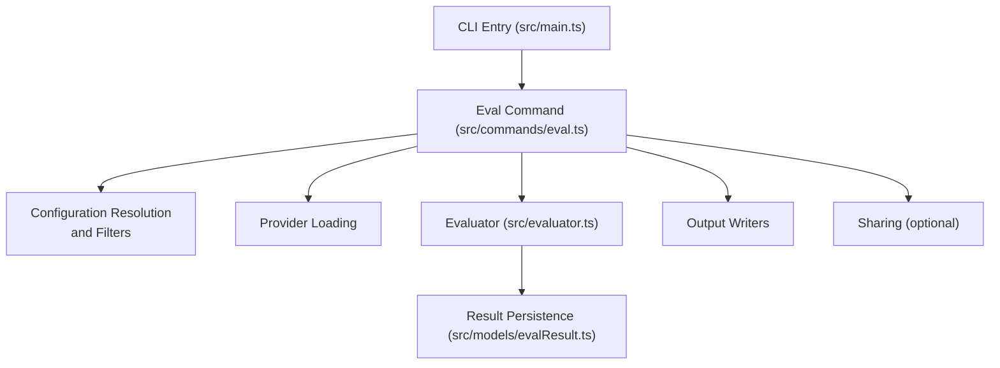
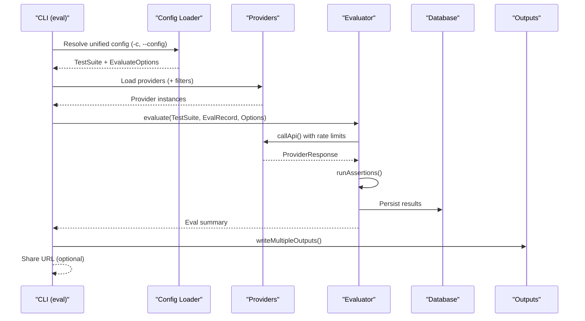
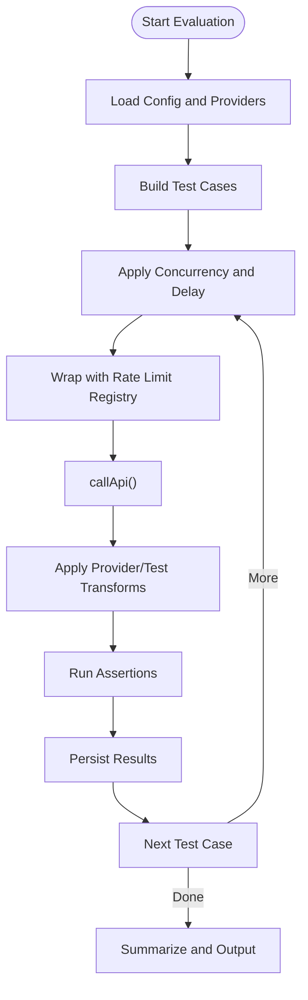
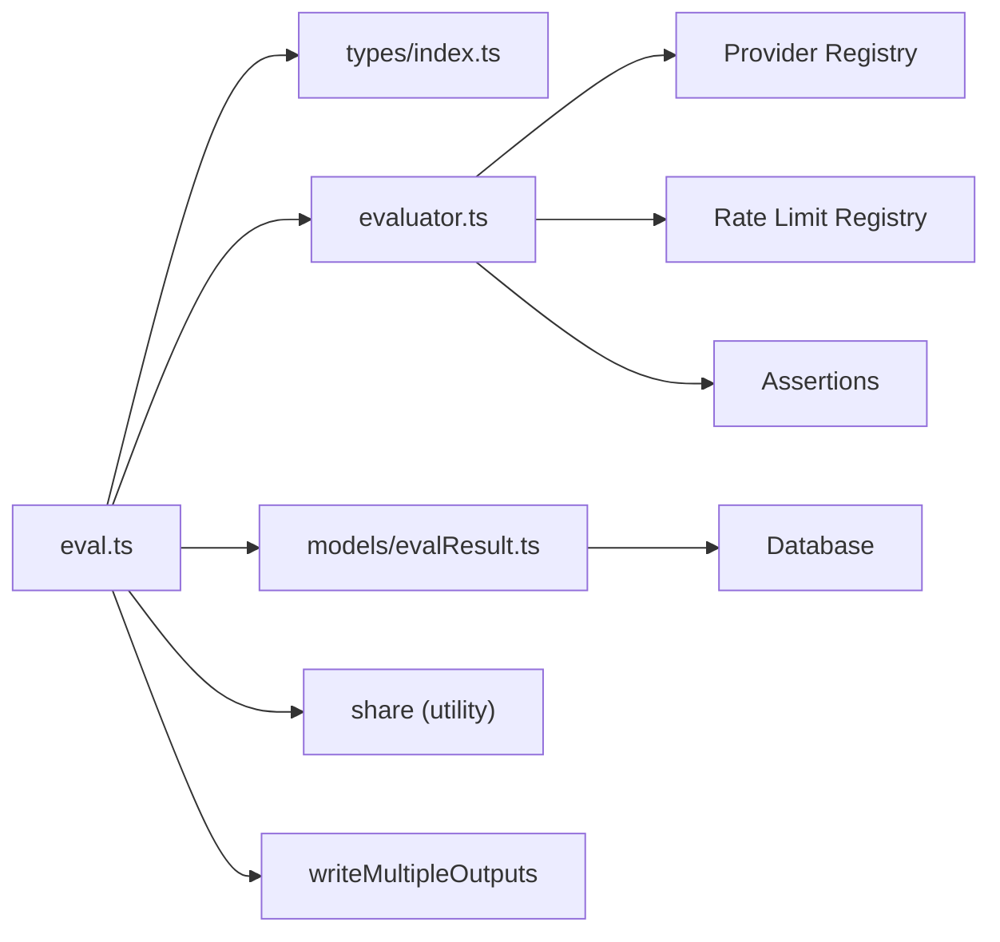

# Evaluation Command (eval)

<cite>
**Referenced Files in This Document**
- [src/main.ts](file://src/main.ts)
- [src/commands/eval.ts](file://src/commands/eval.ts)
- [src/commands/evalSetup.ts](file://src/commands/evalSetup.ts)
- [src/evaluator.ts](file://src/evaluator.ts)
- [src/models/evalResult.ts](file://src/models/evalResult.ts)
- [src/types/index.ts](file://src/types/index.ts)
- [package.json](file://package.json)
</cite>

## Table of Contents
1. [Introduction](#introduction)
2. [Project Structure](#project-structure)
3. [Core Components](#core-components)
4. [Architecture Overview](#architecture-overview)
5. [Detailed Component Analysis](#detailed-component-analysis)
6. [Dependency Analysis](#dependency-analysis)
7. [Performance Considerations](#performance-considerations)
8. [Troubleshooting Guide](#troubleshooting-guide)
9. [Conclusion](#conclusion)
10. [Appendices](#appendices)

## Introduction
This document explains the promptfoo evaluation command (eval) end-to-end. It covers the evaluation workflow from configuration loading and provider resolution to test case generation, execution, and result processing. It also documents command syntax, flags, output formats, advanced features, error handling, and CI/CD integration patterns.

## Project Structure
The eval command is implemented as a CLI subcommand with supporting modules for configuration resolution, provider loading, evaluation orchestration, result persistence, and output rendering.

**Diagram sources**
- [src/main.ts:199](file://src/main.ts#L199)
- [src/commands/eval.ts:945](file://src/commands/eval.ts#L945)
- [src/evaluator.ts:1](file://src/evaluator.ts#L1)
- [src/models/evalResult.ts:98](file://src/models/evalResult.ts#L98)

**Section sources**
- [src/main.ts:199](file://src/main.ts#L199)
- [src/commands/eval.ts:945](file://src/commands/eval.ts#L945)

## Core Components
- CLI command definition and validation: The eval command is defined with comprehensive flags for configuration, filtering, concurrency, output, and behavior toggles.
- Configuration loader: Resolves unified configuration from files, directories, and cloud UUIDs; merges defaults and command-line overrides.
- Provider resolution: Loads providers from configuration or CLI, validates API keys, and applies filters.
- Evaluation engine: Executes prompts against providers, runs assertions, tracks metrics, and manages concurrency and retries.
- Results persistence and output: Stores results in the database, generates summaries, and writes artifacts (CSV, JSON, YAML, HTML).
- Sharing: Optionally creates a shareable URL for results.

**Section sources**
- [src/commands/eval.ts:945](file://src/commands/eval.ts#L945)
- [src/commands/eval.ts:84](file://src/commands/eval.ts#L84)
- [src/evaluator.ts:1](file://src/evaluator.ts#L1)
- [src/models/evalResult.ts:98](file://src/models/evalResult.ts#L98)

## Architecture Overview
The eval command orchestrates a multi-stage pipeline: configuration resolution → provider setup → test case generation → concurrent evaluation → assertion scoring → result aggregation → output and sharing.

**Diagram sources**
- [src/commands/eval.ts:84](file://src/commands/eval.ts#L84)
- [src/evaluator.ts:291](file://src/evaluator.ts#L291)
- [src/models/evalResult.ts:99](file://src/models/evalResult.ts#L99)

## Detailed Component Analysis

### Command Syntax and Flags
The eval command supports a broad set of flags. Below are the primary categories and representative options.

- Core configuration
  - -c, --config <paths...>: Path(s) to configuration file(s) or cloud config UUID(s). Supports directories (auto-resolved to promptfooconfig.*) and cloud UUIDs.
  - -a, --assertions <path>: Assertions file path.
  - -p, --prompts <paths...>: Prompt file paths.
  - -r, --providers <names or paths...>: Provider identifiers or custom provider modules.
  - -t, --tests <path>, -v, --vars <path>: Test case CSV/JSON and variable CSV/JSON.
  - --model-outputs <path>: Pre-computed model outputs JSON.

- Prompt modification
  - --prompt-prefix <path>, --prompt-suffix <path>: Global prefix/suffix for prompts.
  - --var <key=value>: Set variables inline.

- Execution control
  - -j, --max-concurrency <number>: Concurrency limit (default from environment/constants).
  - --repeat <number>: Repeat each test N times.
  - --delay <number>: Delay between tests (in ms). Forces concurrency=1 when set.
  - --no-cache: Disable cache.
  - --remote: Prefer remote inference (red team).

- Filtering and subset selection
  - -n, --filter-first-n <number>, --filter-pattern <pattern>, --filter-sample <number>
  - --filter-failing <pathOrId>, --filter-failing-only <pathOrId>, --filter-errors-only <pathOrId>
  - --filter-metadata <key=value> (repeatable)
  - --filter-prompts <pattern>, --filter-providers, --filter-targets <providers>

- Output configuration
  - -o, --output <paths...>: Output files (csv, txt, json, yaml, yml, html).
  - --table, --no-table: Toggle CLI table output.
  - --table-cell-max-length <number>: Truncate cell length.
  - --share, --no-share: Control sharing.
  - --resume [evalId], --retry-errors: Resume or retry ERROR results.
  - --no-write: Do not persist to promptfoo directory.

- Additional features
  - --grader <provider>: Override default grader.
  - --suggest-prompts <number>: Generate new prompts.
  - -w, --watch: Watch for changes and re-run.
  - -x, --extension <paths...>: Extension hooks.

- Miscellaneous
  - --description <description>, --no-progress-bar.

Validation and help:
- The command validates options using a Zod schema and supports built-in help.

**Section sources**
- [src/commands/eval.ts:945](file://src/commands/eval.ts#L945)
- [src/commands/eval.ts:1100](file://src/commands/eval.ts#L1100)
- [src/types/index.ts:62](file://src/types/index.ts#L62)

### Configuration Loading and Resolution
- Cloud UUID mode: Passing a single UUID via -c switches to cloud config retrieval and disables watch mode.
- Directory auto-resolution: If a directory is passed to -c, the loader resolves to a promptfooconfig.* file within that directory.
- Merge order: CLI options override config defaults; defaults do not override explicit CLI values.
- Environment injection: Loads environment from --env-file/--env-path and config-provided env paths.
- Red team warnings: Warns if red team config lacks test cases.
- Evaluate options merging: Merges evaluateOptions from config into runtime options.

**Section sources**
- [src/commands/eval.ts:111](file://src/commands/eval.ts#L111)
- [src/commands/eval.ts:153](file://src/commands/eval.ts#L153)
- [src/commands/eval.ts:340](file://src/commands/eval.ts#L340)
- [src/commands/eval.ts:364](file://src/commands/eval.ts#L364)

### Provider Resolution and Filtering
- Provider loading: Providers are loaded from configuration or CLI. API key checks run after filtering.
- Filtering: Providers can be filtered by regex patterns for labels/IDs.
- API key validation: Missing keys are reported with actionable export instructions.
- Remote inference: --remote enables remote inference where supported.

**Section sources**
- [src/commands/eval.ts:438](file://src/commands/eval.ts#L438)
- [src/commands/eval.ts:445](file://src/commands/eval.ts#L445)

### Test Case Generation and Execution
- Test suite parsing: Tests and scenarios are parsed and optionally loaded from external files.
- Test generation: Tests are generated from prompts, vars, and assertions.
- Concurrency and delays: Controlled by --max-concurrency and --delay. Delay forces concurrency=1.
- Rate limiting: Providers are executed under a rate limit registry when configured.
- Conversation support: Optional conversation history injection for multi-turn tests.
- Transformations: Provider and test-level transforms are applied before assertions.
- Assertions: Assertions are run against provider outputs; results recorded with scores and named scores.

**Diagram sources**
- [src/evaluator.ts:291](file://src/evaluator.ts#L291)
- [src/evaluator.ts:452](file://src/evaluator.ts#L452)

**Section sources**
- [src/evaluator.ts:291](file://src/evaluator.ts#L291)
- [src/evaluator.ts:452](file://src/evaluator.ts#L452)

### Result Processing and Outputs
- Persistence: Results are sanitized and inserted into the database with circular-reference safety.
- Metrics: Token usage, latency, cost, and assertion counts are tracked.
- Summary: A human-readable summary is printed, including pass rate, token usage, and optional shareable URL.
- Outputs: Multiple formats supported (CSV, JSON, YAML, HTML) via writeMultipleOutputs.
- Sharing: Optional background sharing with progress indication.

**Section sources**
- [src/models/evalResult.ts:99](file://src/models/evalResult.ts#L99)
- [src/commands/eval.ts:676](file://src/commands/eval.ts#L676)
- [src/commands/eval.ts:824](file://src/commands/eval.ts#L824)

### Advanced Features
- Resume and retry:
  - --resume [evalId]: Resumes an incomplete evaluation using persisted config and prompts.
  - --retry-errors: Retries only ERROR results from the latest evaluation, deleting old ERROR results upon success.
- Watch mode: Watches config and related files; re-runs evaluation on changes.
- Suggestions: Generates new prompts and appends them to the prompt list.
- Grader override: Allows specifying a provider to grade outputs.
- Pause and graceful exit: Supports pausing via SIGINT; second SIGINT forces exit.

**Section sources**
- [src/commands/eval.ts:184](file://src/commands/eval.ts#L184)
- [src/commands/eval.ts:226](file://src/commands/eval.ts#L226)
- [src/commands/eval.ts:836](file://src/commands/eval.ts#L836)
- [src/commands/eval.ts:565](file://src/commands/eval.ts#L565)

### Practical Examples
Note: The following examples describe workflows. Replace placeholders with your actual files and values.

- Basic evaluation
  - Run a simple evaluation with a configuration file and default providers.
  - Example invocation: promptfoo eval -c path/to/promptfooconfig.yaml
- Multi-provider comparison
  - Compare multiple providers on the same prompts/tests.
  - Example invocation: promptfoo eval -c config.yaml -r openai:gpt-4 -r anthropic:claude-3
- Custom assertions
  - Use a custom assertions file for domain-specific checks.
  - Example invocation: promptfoo eval -c config.yaml -a path/to/assertions.yaml
- Rate limiting and concurrency tuning
  - Limit concurrency and add delays to respect provider quotas.
  - Example invocation: promptfoo eval -c config.yaml -j 2 --delay 100
- Output formats
  - Export results to CSV, JSON, YAML, and HTML.
  - Example invocation: promptfoo eval -c config.yaml -o results.csv -o results.json -o report.html
- Resume and retry
  - Resume a paused evaluation or retry only ERROR results from the last run.
  - Example invocation: promptfoo eval --resume
  - Example invocation: promptfoo eval --retry-errors

[No sources needed since this section provides usage examples without quoting specific code]

## Dependency Analysis
The eval command integrates several subsystems. The following diagram highlights key dependencies.

**Diagram sources**
- [src/commands/eval.ts:945](file://src/commands/eval.ts#L945)
- [src/evaluator.ts:1](file://src/evaluator.ts#L1)
- [src/models/evalResult.ts:98](file://src/models/evalResult.ts#L98)

**Section sources**
- [src/commands/eval.ts:945](file://src/commands/eval.ts#L945)
- [src/evaluator.ts:1](file://src/evaluator.ts#L1)

## Performance Considerations
- Concurrency: Tune --max-concurrency to balance throughput and provider rate limits. Lower values reduce burst usage.
- Delays: Use --delay to smooth API calls and avoid throttling.
- Cache: --no-cache disables caching; enable for repeated runs to speed up subsequent evaluations.
- Large outputs: For very large test suites, consider disabling CLI table output (--no-table) to reduce overhead.
- Streaming and transforms: Transformations and binary extraction occur during evaluation; keep transforms efficient.

[No sources needed since this section provides general guidance]

## Troubleshooting Guide
- Missing API keys
  - Symptom: Errors listing missing environment variables for providers.
  - Action: Set the required environment variables or use --env-file.
- Conflicting flags
  - Symptom: Error when using --resume and --retry-errors together, or --resume with --no-write.
  - Action: Use one of the mutually exclusive options; resume requires persistence.
- Provider errors
  - Symptom: Errors during provider calls with HTTP status and response snippets.
  - Action: Inspect logs, adjust rate limits, or retry with delays.
- Pausing and force exit
  - Behavior: First SIGINT pauses; second SIGINT forces exit.
- Share failures
  - Behavior: Sharing runs in the background; failures are logged silently unless in TTY mode.

**Section sources**
- [src/commands/eval.ts:172](file://src/commands/eval.ts#L172)
- [src/commands/eval.ts:565](file://src/commands/eval.ts#L565)
- [src/evaluator.ts:697](file://src/evaluator.ts#L697)

## Conclusion
The promptfoo eval command provides a robust, configurable framework for evaluating prompts across providers. It supports flexible configuration, powerful filtering, concurrency control, rich outputs, and advanced features like resume/retry and sharing. By combining CLI flags with configuration files, users can tailor evaluations to their needs and integrate them into CI/CD workflows.

[No sources needed since this section summarizes without analyzing specific files]

## Appendices

### Command Reference Summary
- Core: -c, -a, -p, -r, -t/-v, --model-outputs
- Prompt mods: --prompt-prefix, --prompt-suffix, --var
- Execution: -j, --repeat, --delay, --no-cache, --remote
- Filtering: -n, --filter-*, --filter-metadata
- Output: -o, --table/--no-table, --table-cell-max-length, --share/--no-share, --resume/--retry-errors, --no-write
- Extras: --grader, --suggest-prompts, -w, -x
- Misc: --description, --no-progress-bar

**Section sources**
- [src/commands/eval.ts:945](file://src/commands/eval.ts#L945)
- [src/commands/eval.ts:1100](file://src/commands/eval.ts#L1100)

### CI/CD Integration Patterns
- Non-interactive runs
  - Use --no-write to avoid persisting results to the promptfoo directory.
  - Set exit thresholds via environment variables to gate pipelines on pass rates.
- Watching and live feedback
  - Use -w to watch config files and re-run evaluations on changes.
- Sharing results
  - Use --share to generate a shareable URL for quick inspection.

**Section sources**
- [src/commands/eval.ts:908](file://src/commands/eval.ts#L908)
- [src/commands/eval.ts:836](file://src/commands/eval.ts#L836)

### Programmatic Access
- The eval command is registered in the main CLI entry and can be extended or invoked programmatically via the exported functions.

**Section sources**
- [src/main.ts:199](file://src/main.ts#L199)
- [src/commands/evalSetup.ts:9](file://src/commands/evalSetup.ts#L9)