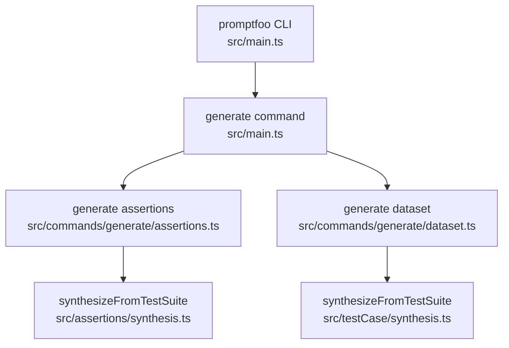
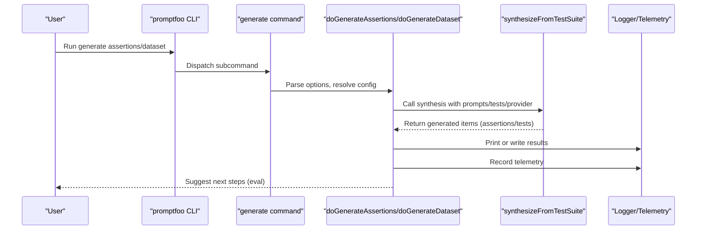
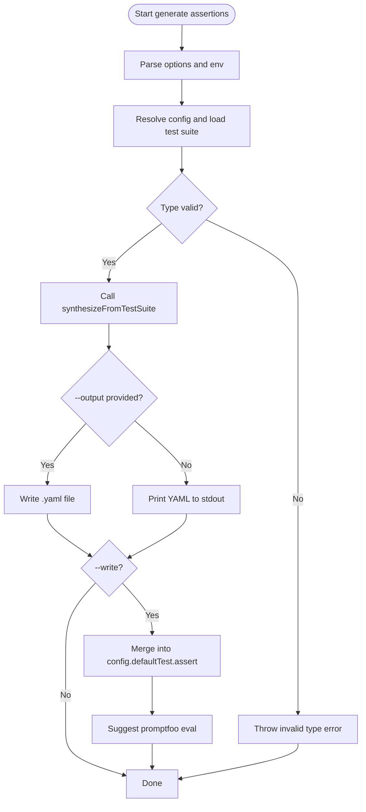
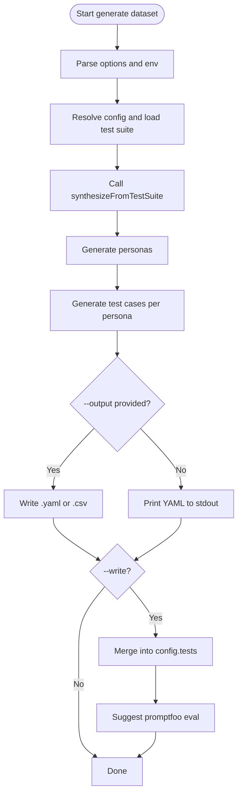
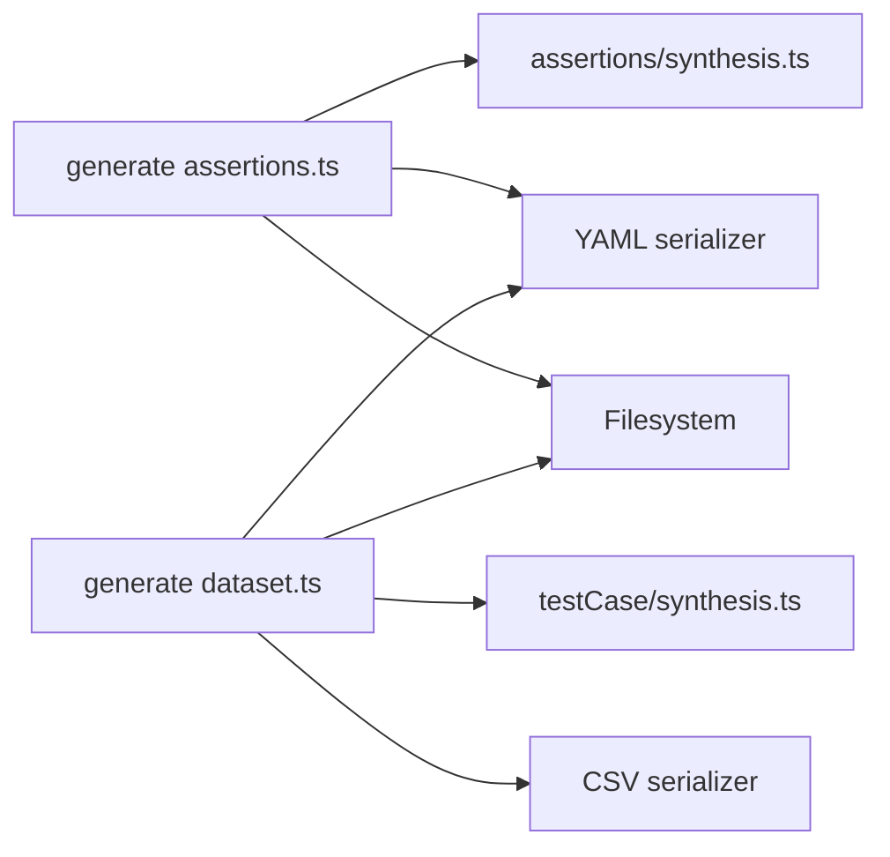

# Generate Commands (generate)

<cite>
**Referenced Files in This Document**
- [src/main.ts](file://src/main.ts)
- [src/commands/generate/assertions.ts](file://src/commands/generate/assertions.ts)
- [src/commands/generate/dataset.ts](file://src/commands/generate/dataset.ts)
- [src/assertions/synthesis.ts](file://src/assertions/synthesis.ts)
- [src/testCase/synthesis.ts](file://src/testCase/synthesis.ts)
- [examples/getting-started/promptfooconfig.yaml](file://examples/getting-started/promptfooconfig.yaml)
- [examples/assertions-generate/promptfooconfig.yaml](file://examples/assertions-generate/promptfooconfig.yaml)
- [examples/assertions-generate/README.md](file://examples/assertions-generate/README.md)
</cite>

## Table of Contents
1. [Introduction](#introduction)
2. [Project Structure](#project-structure)
3. [Core Components](#core-components)
4. [Architecture Overview](#architecture-overview)
5. [Detailed Component Analysis](#detailed-component-analysis)
6. [Dependency Analysis](#dependency-analysis)
7. [Performance Considerations](#performance-considerations)
8. [Troubleshooting Guide](#troubleshooting-guide)
9. [Conclusion](#conclusion)
10. [Appendices](#appendices)

## Introduction
This document explains the promptfoo generate command family, focusing on two subcommands:
- generate assertions: Creates automated test assertions for evaluation
- generate dataset: Synthesizes realistic test cases (training/validation sets) from prompts and personas

It covers command syntax, input requirements, output formats, configuration options, provider requirements, quality assurance features, and advanced usage patterns. It also explains how generated content integrates with the main evaluation workflow.

## Project Structure
The generate commands are registered under the top-level promptfoo command and delegate to dedicated modules:
- Assertions generation: [src/commands/generate/assertions.ts](file://src/commands/generate/assertions.ts)
- Dataset generation: [src/commands/generate/dataset.ts](file://src/commands/generate/dataset.ts)
- Underlying synthesis logic:
  - Assertions: [src/assertions/synthesis.ts](file://src/assertions/synthesis.ts)
  - Dataset: [src/testCase/synthesis.ts](file://src/testCase/synthesis.ts)

**Diagram sources**
- [src/main.ts:215-227](file://src/main.ts#L215-L227)
- [src/commands/generate/assertions.ts:130-161](file://src/commands/generate/assertions.ts#L130-L161)
- [src/commands/generate/dataset.ts:124-148](file://src/commands/generate/dataset.ts#L124-L148)
- [src/assertions/synthesis.ts:518-527](file://src/assertions/synthesis.ts#L518-L527)
- [src/testCase/synthesis.ts:224-233](file://src/testCase/synthesis.ts#L224-L233)

**Section sources**
- [src/main.ts:215-227](file://src/main.ts#L215-L227)

## Core Components
- generate assertions
  - Purpose: Auto-generates assertions (objective or subjective) for existing prompts/tests
  - Inputs: Config path, provider, instruction overrides, assertion type, number of assertions, cache toggle
  - Outputs: Prints YAML assertions to stdout or writes to a .yaml file; optionally appends to config and suggests running eval
- generate dataset
  - Purpose: Synthesizes test cases (vars) for training/validation sets
  - Inputs: Config path, provider, instructions, persona counts, cases per persona, cache toggle
  - Outputs: Prints YAML tests to stdout, or writes to .yaml or .csv; optionally appends to config and suggests running eval

Key behaviors:
- Both commands require a valid configuration file with at least one prompt
- Both support disabling cache via --no-cache
- Both support --env-file/--env-path for loading environment variables
- Both support writing results directly to the config via --write

**Section sources**
- [src/commands/generate/assertions.ts:130-161](file://src/commands/generate/assertions.ts#L130-L161)
- [src/commands/generate/dataset.ts:124-148](file://src/commands/generate/dataset.ts#L124-L148)

## Architecture Overview
High-level flow for each subcommand:
- Parse CLI options and resolve configuration
- Load test suite (prompts/tests) from config
- Invoke synthesis engine with provider and optional instructions
- Render results to stdout or write to file/config
- Record telemetry and suggest next steps (e.g., promptfoo eval)

**Diagram sources**
- [src/main.ts:225-227](file://src/main.ts#L225-L227)
- [src/commands/generate/assertions.ts:30-120](file://src/commands/generate/assertions.ts#L30-L120)
- [src/commands/generate/dataset.ts:30-122](file://src/commands/generate/dataset.ts#L30-L122)
- [src/assertions/synthesis.ts:518-527](file://src/assertions/synthesis.ts#L518-L527)
- [src/testCase/synthesis.ts:224-233](file://src/testCase/synthesis.ts#L224-L233)

## Detailed Component Analysis

### Assertions Generator (generate assertions)
Purpose:
- Generate natural language or rubric-based assertions to augment existing test suites

Inputs and options:
- --type: Assertion type selector (pi, g-eval, llm-rubric)
- --config: Path to configuration file (defaults to promptfooconfig.yaml)
- --output: Output file path (.yaml supported)
- --write: Append generated assertions to the config
- --numAssertions: Number of assertions to generate
- --provider: Provider for assertion generation (defaults to default grading provider)
- --instructions: Additional instructions for the generator
- --no-cache: Disable disk cache
- --env-file/--env-path: Environment file(s)

Behavior:
- Validates assertion type
- Resolves configuration and loads test suite
- Calls synthesis engine to produce assertions
- Prints YAML to stdout or writes to .yaml file
- Optionally merges into config and prints suggested eval command

Outputs:
- YAML-formatted assertions appended to defaultTest.assert in config (when --write)
- Or printed to stdout for manual copy/paste

Quality assurance:
- Progress bar in non-debug mode
- Telemetry recording with timing and counts
- Error handling for unsupported output types and synthesis failures

Integration with evaluation:
- After writing to config, suggests running eval to execute the new assertions

**Diagram sources**
- [src/commands/generate/assertions.ts:122-128](file://src/commands/generate/assertions.ts#L122-L128)
- [src/commands/generate/assertions.ts:30-120](file://src/commands/generate/assertions.ts#L30-L120)
- [src/assertions/synthesis.ts:518-527](file://src/assertions/synthesis.ts#L518-L527)

**Section sources**
- [src/commands/generate/assertions.ts:130-161](file://src/commands/generate/assertions.ts#L130-L161)
- [src/commands/generate/assertions.ts:30-120](file://src/commands/generate/assertions.ts#L30-L120)
- [src/assertions/synthesis.ts:429-516](file://src/assertions/synthesis.ts#L429-L516)

### Dataset Generator (generate dataset)
Purpose:
- Synthesize realistic test cases (sets of vars) for training/validation sets by generating personas and sampling test scenarios

Inputs and options:
- --instructions: Additional instructions for test case generation
- --config: Path to configuration file (defaults to promptfooconfig.yaml)
- --output: Output file path (.yaml and .csv supported)
- --write: Append generated tests to the config
- --provider: Provider for adversarial/dataset generation (defaults to default grading provider)
- --numPersonas: Number of personas to generate
- --numTestCasesPerPersona: Number of test cases per persona
- --no-cache: Disable disk cache
- --env-file/--env-path: Environment file(s)

Behavior:
- Resolves configuration and loads test suite
- Generates personas and then produces test cases per persona
- Writes .yaml or .csv depending on output suffix
- Optionally merges into config and prints suggested eval command

Outputs:
- YAML tests with vars appended to config.tests (when --write)
- Or printed to stdout for manual copy/paste

Quality assurance:
- Progress bar in non-debug mode
- Deduplication and sampling to meet requested counts
- Telemetry recording with timing and counts

Integration with evaluation:
- After writing to config, suggests running eval to execute the new tests

**Diagram sources**
- [src/commands/generate/dataset.ts:30-122](file://src/commands/generate/dataset.ts#L30-L122)
- [src/testCase/synthesis.ts:94-222](file://src/testCase/synthesis.ts#L94-L222)

**Section sources**
- [src/commands/generate/dataset.ts:124-148](file://src/commands/generate/dataset.ts#L124-L148)
- [src/commands/generate/dataset.ts:30-122](file://src/commands/generate/dataset.ts#L30-L122)
- [src/testCase/synthesis.ts:94-222](file://src/testCase/synthesis.ts#L94-L222)

## Dependency Analysis
- Assertions generation depends on:
  - CLI command module for parsing and dispatch
  - Synthesis engine for generating assertions from prompts/tests
  - YAML serialization and filesystem for output/writing
- Dataset generation depends on:
  - CLI command module for parsing and dispatch
  - Synthesis engine for generating personas and test cases
  - CSV serialization for .csv output
  - YAML serialization and filesystem for output/writing

**Diagram sources**
- [src/commands/generate/assertions.ts:6,72,92-100:6-100](file://src/commands/generate/assertions.ts#L6-L100)
- [src/commands/generate/dataset.ts:9,73-76,92-101:9-101](file://src/commands/generate/dataset.ts#L9-L101)
- [src/assertions/synthesis.ts:518-527](file://src/assertions/synthesis.ts#L518-L527)
- [src/testCase/synthesis.ts:224-233](file://src/testCase/synthesis.ts#L224-L233)

**Section sources**
- [src/commands/generate/assertions.ts:6,72,92-100:6-100](file://src/commands/generate/assertions.ts#L6-L100)
- [src/commands/generate/dataset.ts:9,73-76,92-101:9-101](file://src/commands/generate/dataset.ts#L9-L101)

## Performance Considerations
- Cache control: Use --no-cache to bypass disk cache when iterating quickly or when cache may interfere with experiments
- Provider selection: Choose a provider appropriate for the workload; dataset generation may require a model capable of structured JSON extraction
- Batch sizes: Dataset generation uses internal batching; increasing numPersonas or numTestCasesPerPersona increases total work linearly
- Progress indicators: Non-debug mode shows progress bars to track long-running synthesis tasks

[No sources needed since this section provides general guidance]

## Troubleshooting Guide
Common issues and resolutions:
- Unsupported output file type: Only .yaml is supported for assertions output; using other extensions will cause an error
- Missing configuration: A valid config with at least one prompt is required; otherwise, an error is thrown instructing to initialize or pass a config path
- Synthesis failures: Errors from the synthesis engine are propagated; verify provider credentials and model availability
- No cache: If results appear inconsistent across runs, disable cache intentionally or ensure cache is functioning

**Section sources**
- [src/commands/generate/assertions.ts:77-79](file://src/commands/generate/assertions.ts#L77-L79)
- [src/commands/generate/assertions.ts:48-54](file://src/commands/generate/assertions.ts#L48-L54)
- [src/commands/generate/dataset.ts:77-79](file://src/commands/generate/dataset.ts#L77-L79)
- [src/commands/generate/assertions.ts:188-204](file://src/commands/generate/assertions.ts#L188-L204)

## Conclusion
The generate command family streamlines building robust evaluation suites:
- Use generate assertions to enrich existing prompts with objective or rubric-based checks
- Use generate dataset to create diverse, persona-driven test cases for training/validation
Both commands integrate seamlessly with the rest of the promptfoo workflow, supporting direct config injection and clear next steps via eval.

[No sources needed since this section summarizes without analyzing specific files]

## Appendices

### Command Syntax and Options Reference
- generate assertions
  - --type: pi | g-eval | llm-rubric (default: pi)
  - --config: Path to config file (default: promptfooconfig.yaml)
  - --output: Output file path (.yaml)
  - --write: Append to config
  - --numAssertions: Number of assertions to generate
  - --provider: Provider identifier
  - --instructions: Additional instructions
  - --no-cache: Disable cache
  - --env-file/--env-path: Environment file(s)
- generate dataset
  - --instructions: Additional instructions
  - --config: Path to config file (default: promptfooconfig.yaml)
  - --output: Output file path (.yaml or .csv)
  - --write: Append to config
  - --provider: Provider identifier
  - --numPersonas: Number of personas (default: 5)
  - --numTestCasesPerPersona: Cases per persona (default: 3)
  - --no-cache: Disable cache
  - --env-file/--env-path: Environment file(s)

**Section sources**
- [src/commands/generate/assertions.ts:130-161](file://src/commands/generate/assertions.ts#L130-L161)
- [src/commands/generate/dataset.ts:124-148](file://src/commands/generate/dataset.ts#L124-L148)

### Practical Examples
- Assertion generation for rubric-based evaluation:
  - Use a config with prompts and existing assertions; generate additional llm-rubric assertions and write to config
  - See example usage in the assertions-generate example README
- Dataset creation for training/validation:
  - Provide a config with prompts; generate personas and test cases; write to .yaml or .csv; append to config for later evaluation
- Integration with existing test suites:
  - Append generated items to config.tests or config.defaultTest.assert; run eval to execute the augmented suite

**Section sources**
- [examples/assertions-generate/README.md:18-28](file://examples/assertions-generate/README.md#L18-L28)
- [examples/getting-started/promptfooconfig.yaml:17-29](file://examples/getting-started/promptfooconfig.yaml#L17-L29)
- [examples/assertions-generate/promptfooconfig.yaml:6-34](file://examples/assertions-generate/promptfooconfig.yaml#L6-L34)

### Advanced Usage Patterns
- Custom assertion templates:
  - Provide detailed --instructions to steer the generator toward desired assertion styles
- Dataset augmentation:
  - Increase numPersonas and numTestCasesPerPersona to expand coverage
- Batch processing:
  - Use --no-cache for rapid iteration; leverage --env-file to manage multiple environments
- Provider requirements:
  - Ensure the selected provider supports text generation and structured JSON extraction for dataset synthesis
  - For assertions, choose a provider suitable for rubric scoring if using llm-rubric types

**Section sources**
- [src/commands/generate/assertions.ts:155-158](file://src/commands/generate/assertions.ts#L155-L158)
- [src/commands/generate/dataset.ts:139-144](file://src/commands/generate/dataset.ts#L139-L144)
- [src/testCase/synthesis.ts:128-133](file://src/testCase/synthesis.ts#L128-L133)

### Quality Assurance Features
- Progress bars in non-debug mode for both assertion and dataset synthesis
- Telemetry recording with timing and counts for auditability
- Error handling for unsupported output formats and synthesis failures
- Deduplication and sampling for dataset synthesis to meet requested counts reliably

**Section sources**
- [src/assertions/synthesis.ts:441-449](file://src/assertions/synthesis.ts#L441-L449)
- [src/testCase/synthesis.ts:110-118](file://src/testCase/synthesis.ts#L110-L118)
- [src/commands/generate/assertions.ts:112-119](file://src/commands/generate/assertions.ts#L112-L119)
- [src/commands/generate/dataset.ts:114-121](file://src/commands/generate/dataset.ts#L114-L121)