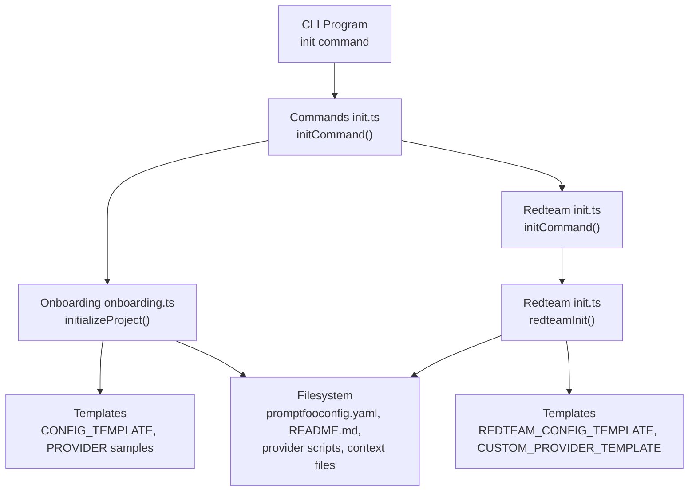
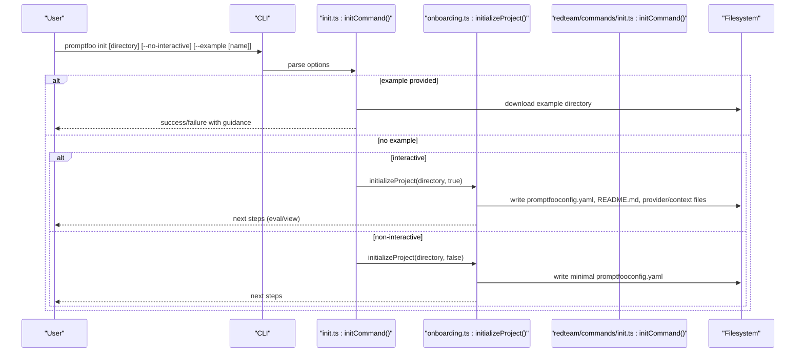
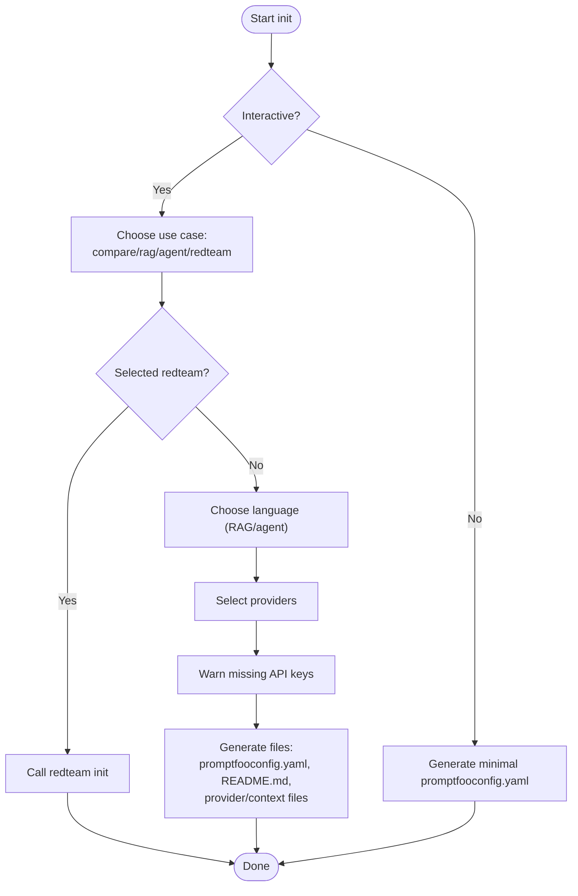
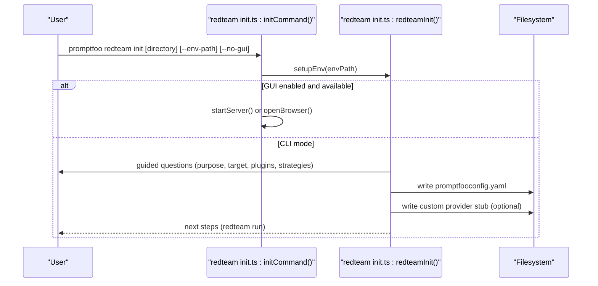
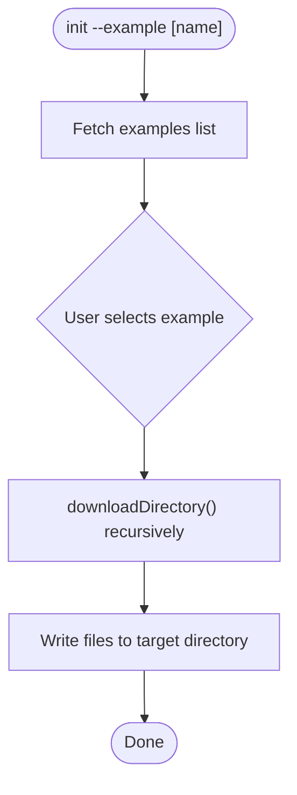
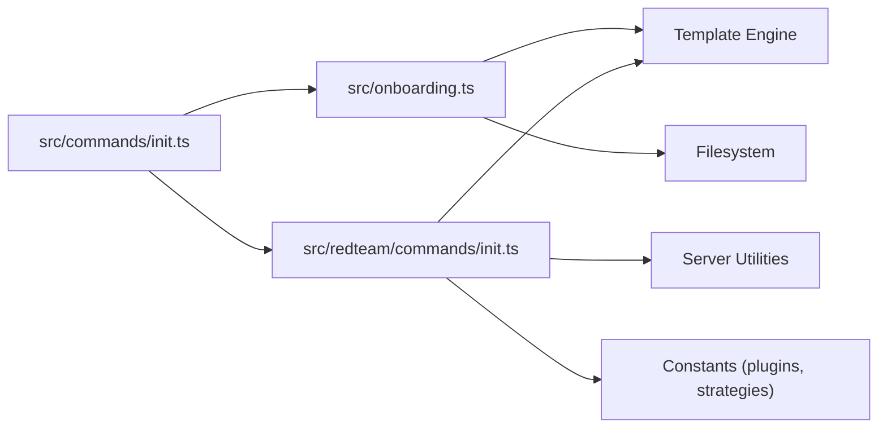

# Initialization Command (init)

<cite>
**Referenced Files in This Document**
- [init.ts](file://src/commands/init.ts)
- [init.ts](file://src/redteam/commands/init.ts)
- [onboarding.ts](file://src/onboarding.ts)
- [cli.test.ts](file://test/smoke/cli.test.ts)
- [init.test.ts](file://test/commands/init.test.ts)
- [generate.test.ts](file://test/redteam/commands/generate.test.ts)
</cite>

## Table of Contents
1. [Introduction](#introduction)
2. [Project Structure](#project-structure)
3. [Core Components](#core-components)
4. [Architecture Overview](#architecture-overview)
5. [Detailed Component Analysis](#detailed-component-analysis)
6. [Dependency Analysis](#dependency-analysis)
7. [Performance Considerations](#performance-considerations)
8. [Troubleshooting Guide](#troubleshooting-guide)
9. [Conclusion](#conclusion)

## Introduction
This document explains the promptfoo init command, covering how it initializes a new project, generates configuration files, and scaffolds example projects. It describes the command syntax, interactive and non-interactive modes, and how to generate different configuration types (basic evaluation, red teaming). It also covers environment variable setup, provider authentication, and integrating with existing projects.

## Project Structure
The init command integrates with two primary flows:
- Basic evaluation initialization via onboarding
- Red teaming initialization via a dedicated red team command

**Diagram sources**
- [init.ts:214-248](file://src/commands/init.ts#L214-L248)
- [onboarding.ts:706-751](file://src/onboarding.ts#L706-L751)
- [init.ts:677-729](file://src/redteam/commands/init.ts#L677-L729)

**Section sources**
- [init.ts:214-248](file://src/commands/init.ts#L214-L248)
- [onboarding.ts:706-751](file://src/onboarding.ts#L706-L751)
- [init.ts:677-729](file://src/redteam/commands/init.ts#L677-L729)

## Core Components
- Command registration and options:
  - init [directory]: Sets up a new project with prompts, providers, and test cases.
  - Options:
    - --no-interactive: Disable interactive mode and create a minimal configuration.
    - --example [name]: Download and scaffold a curated example from the repository.
- Onboarding flow:
  - Interactive guided setup for basic evaluation projects.
  - Generates promptfooconfig.yaml, optional provider scripts, and context files.
- Red teaming flow:
  - Dedicated redteam init command for adversarial testing.
  - Generates a red team configuration and optional custom provider stub.

**Section sources**
- [init.ts:209-248](file://src/commands/init.ts#L209-L248)
- [onboarding.ts:389-704](file://src/onboarding.ts#L389-L704)
- [init.ts:677-729](file://src/redteam/commands/init.ts#L677-L729)

## Architecture Overview
The init command orchestrates either a basic evaluation setup or a red teaming setup. It supports both interactive and non-interactive modes and can optionally download curated examples.

**Diagram sources**
- [init.ts:214-248](file://src/commands/init.ts#L214-L248)
- [onboarding.ts:706-751](file://src/onboarding.ts#L706-L751)

## Detailed Component Analysis

### Basic Evaluation Initialization (onboarding)
The onboarding flow builds a basic evaluation project:
- Prompts: Starts with simple prompts for tweet topics or RAG/agent scenarios.
- Providers: Offers a wide range of providers (cloud, local scripts, HTTP endpoints).
- Files generated:
  - promptfooconfig.yaml (templated)
  - README.md (quick start)
  - Optional provider scripts (Python/JavaScript/Bash/Windows batch)
  - Optional context files for RAG/agent scenarios

**Diagram sources**
- [onboarding.ts:389-704](file://src/onboarding.ts#L389-L704)

**Section sources**
- [onboarding.ts:19-105](file://src/onboarding.ts#L19-L105)
- [onboarding.ts:389-704](file://src/onboarding.ts#L389-L704)
- [onboarding.ts:706-751](file://src/onboarding.ts#L706-L751)

### Red Teaming Initialization
The red teaming init command creates a tailored adversarial testing configuration:
- Purpose and target selection
- Plugin and strategy selection (defaults or manual)
- Optional custom provider for HTTP endpoints or agent-like targets
- Generates promptfooconfig.yaml and optionally a custom provider stub

**Diagram sources**
- [init.ts:677-729](file://src/redteam/commands/init.ts#L677-L729)
- [init.ts:208-675](file://src/redteam/commands/init.ts#L208-L675)

**Section sources**
- [init.ts:38-206](file://src/redteam/commands/init.ts#L38-L206)
- [init.ts:208-675](file://src/redteam/commands/init.ts#L208-L675)
- [init.ts:677-729](file://src/redteam/commands/init.ts#L677-L729)

### Example Download Flow
The init command can scaffold a curated example project from the repository:
- Lists available examples from the examples directory
- Downloads the chosen example into a subdirectory
- Provides next steps and example-specific guidance

**Diagram sources**
- [init.ts:91-117](file://src/commands/init.ts#L91-L117)
- [init.ts:133-207](file://src/commands/init.ts#L133-L207)

**Section sources**
- [init.ts:91-117](file://src/commands/init.ts#L91-L117)
- [init.ts:133-207](file://src/commands/init.ts#L133-L207)

## Dependency Analysis
- init.ts depends on:
  - onboarding.ts for basic evaluation setup
  - redteam/commands/init.ts for red teaming setup
  - Utility modules for templating, environment setup, and telemetry
- onboarding.ts depends on:
  - Template rendering engine for YAML generation
  - Filesystem utilities for writing files
  - Environment helpers for API key warnings
- redteam/commands/init.ts depends on:
  - Template rendering engine for red team YAML
  - Server utilities for GUI mode
  - Constants for plugins and strategies

**Diagram sources**
- [init.ts:1-249](file://src/commands/init.ts#L1-L249)
- [onboarding.ts:1-752](file://src/onboarding.ts#L1-L752)
- [init.ts:1-730](file://src/redteam/commands/init.ts#L1-L730)

**Section sources**
- [init.ts:1-249](file://src/commands/init.ts#L1-L249)
- [onboarding.ts:1-752](file://src/onboarding.ts#L1-L752)
- [init.ts:1-730](file://src/redteam/commands/init.ts#L1-L730)

## Performance Considerations
- Network requests: Example downloads rely on GitHub API; failures fall back to the main branch reference.
- Interactive prompts: The onboarding flow uses terminal prompts; disabling interactivity (--no-interactive) reduces user interaction overhead.
- File writes: Generating multiple provider scripts or context files can increase I/O; consider skipping optional files in non-interactive mode.

[No sources needed since this section provides general guidance]

## Troubleshooting Guide
Common issues and resolutions:
- Example download failures:
  - Symptom: Failure to download example with an error message.
  - Resolution: Retry with a different example or disable interactive mode to avoid prompts. The system logs guidance for alternative commands.
- Missing API keys:
  - Symptom: Warning messages indicating missing environment variables for selected providers.
  - Resolution: Set the appropriate environment variables (for example, provider-specific keys) before running evaluations.
- Paused initialization:
  - Symptom: Exiting an interactive prompt early.
  - Resolution: Re-run the init command later to continue setup.
- Red team GUI issues:
  - Symptom: Browser UI not opening or server conflicts.
  - Resolution: Use --no-gui to run in CLI mode or ensure the default port is free.

**Section sources**
- [init.ts:152-175](file://src/commands/init.ts#L152-L175)
- [onboarding.ts:298-319](file://src/onboarding.ts#L298-L319)
- [onboarding.ts:733-750](file://src/onboarding.ts#L733-L750)
- [init.ts:690-726](file://src/redteam/commands/init.ts#L690-L726)

## Conclusion
The promptfoo init command streamlines project setup for both basic evaluation and red teaming workflows. It supports interactive and non-interactive modes, example scaffolding, and provider-specific configuration. By following the guidance in this document, you can quickly bootstrap a project, configure providers, and integrate with existing codebases.