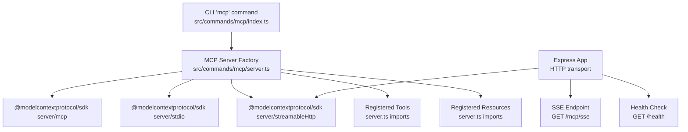
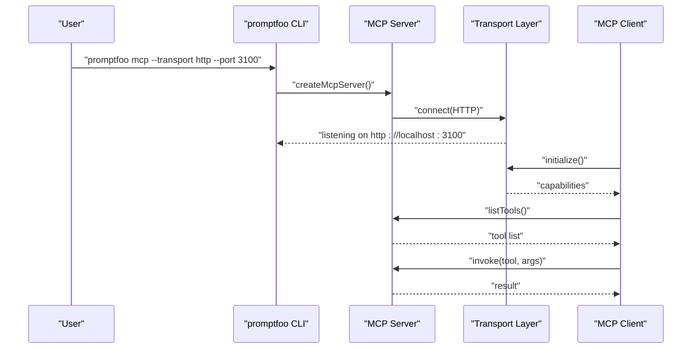
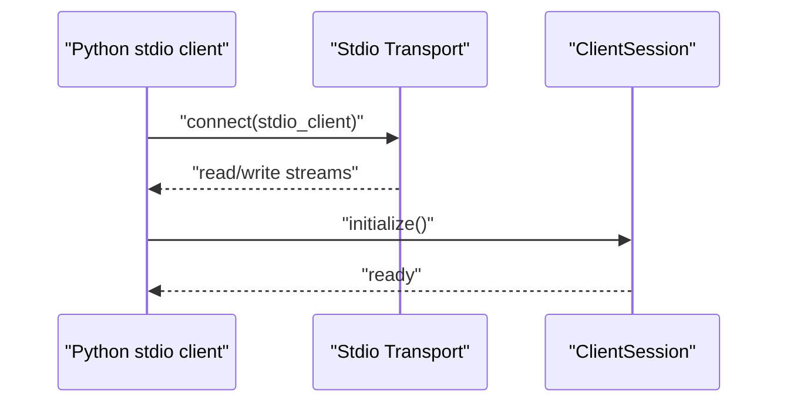
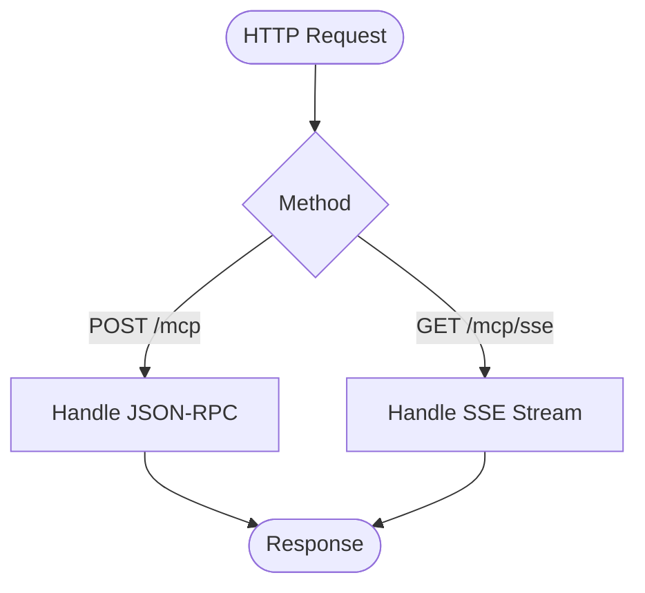
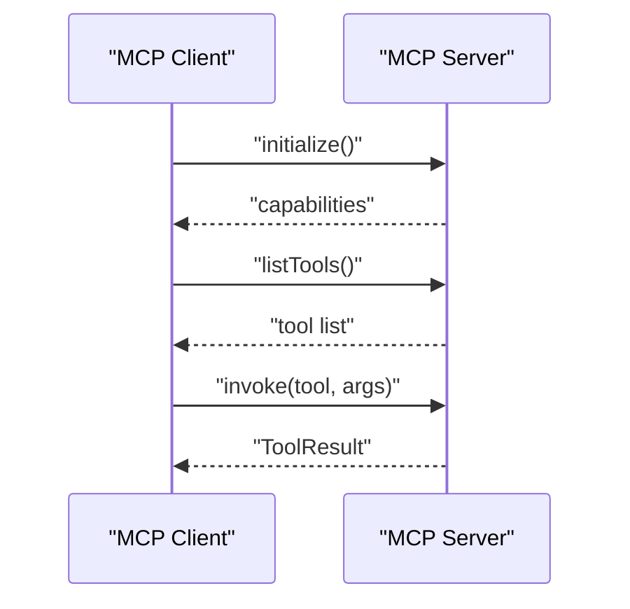
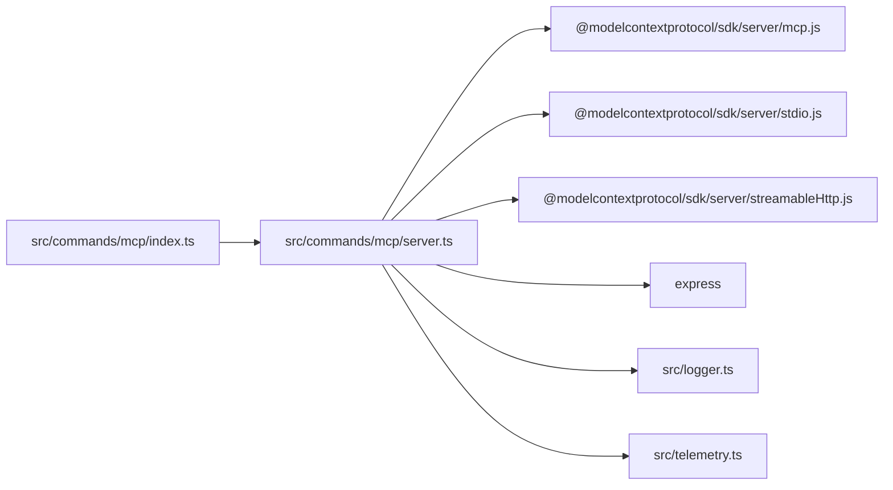
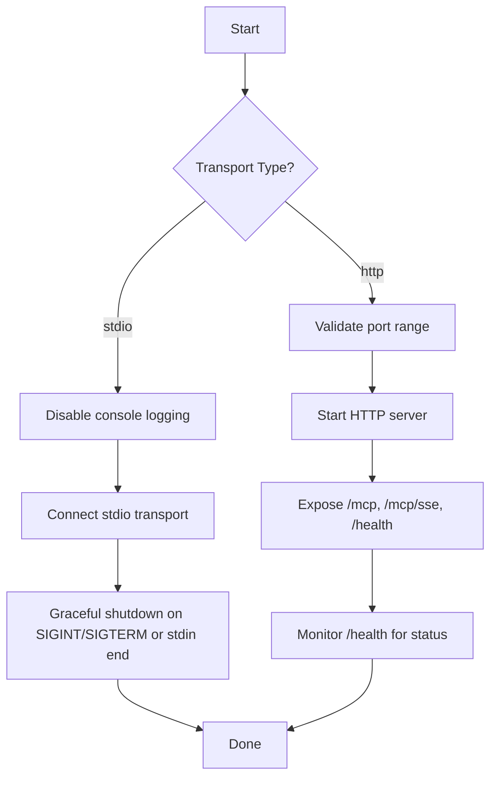

# MCP Commands

<cite>
**Referenced Files in This Document**
- [index.ts](file://src/commands/mcp/index.ts)
- [server.ts](file://src/commands/mcp/server.ts)
- [types.ts](file://src/commands/mcp/types.ts)
- [lib/types.ts](file://src/commands/mcp/lib/types.ts)
- [README.md](file://examples/openai-mcp/README.md)
- [promptfooconfig.yaml](file://examples/openai-mcp/promptfooconfig.yaml)
- [README.md](file://examples/redteam-mcp/README.md)
- [promptfooconfig.yaml](file://examples/redteam-mcp/promptfooconfig.yaml)
- [promptfooconfig.yaml](file://examples/simple-mcp/promptfooconfig.yaml)
- [promptfooconfig.yaml](file://examples/redteam-mcp-agent/promptfooconfig.yaml)
- [mcp_client.py](file://examples/redteam-api-top-10/app/mcp_client.py)
- [src/mcp-client.js](file://examples/redteam-mcp-agent/src/mcp-client.js)
- [index.test.ts](file://test/commands/mcp/index.test.ts)
- [server.test.ts](file://test/commands/mcp/server.test.ts)
- [client.test.ts](file://test/providers/mcp/client.test.ts)
- [transport.ts](file://src/codeScan/mcp/transport.ts)
</cite>

## Table of Contents
1. [Introduction](#introduction)
2. [Project Structure](#project-structure)
3. [Core Components](#core-components)
4. [Architecture Overview](#architecture-overview)
5. [Detailed Component Analysis](#detailed-component-analysis)
6. [Dependency Analysis](#dependency-analysis)
7. [Performance Considerations](#performance-considerations)
8. [Troubleshooting Guide](#troubleshooting-guide)
9. [Conclusion](#conclusion)
10. [Appendices](#appendices)

## Introduction
This document explains the promptfoo Model Context Protocol (MCP) command family for integrating MCP servers and clients into LLM applications. It covers:
- How to start MCP servers via CLI
- How to configure MCP clients in promptfoo configurations
- How to develop tools and manage resources exposed by MCP servers
- Practical deployment examples and security considerations
- Advanced features such as streaming responses, tool discovery, and dynamic resource allocation
- Integration patterns with LLM providers, agent systems, and external tool ecosystems

## Project Structure
The MCP command family is implemented under the promptfoo CLI and integrates with the @modelcontextprotocol/sdk to expose tools and resources over HTTP or stdio transports.

**Diagram sources**
- [index.ts:8-39](file://src/commands/mcp/index.ts#L8-L39)
- [server.ts:1-67](file://src/commands/mcp/server.ts#L1-L67)
- [server.ts:73-162](file://src/commands/mcp/server.ts#L73-L162)
- [server.ts:167-229](file://src/commands/mcp/server.ts#L167-L229)

**Section sources**
- [index.ts:1-44](file://src/commands/mcp/index.ts#L1-L44)
- [server.ts:1-230](file://src/commands/mcp/server.ts#L1-L230)

## Core Components
- CLI command: Adds the "mcp" command with options for transport type and port, validates inputs, records telemetry, and starts the appropriate server.
- Server factory: Creates an MCP server with a fixed identity and registers tools and resources.
- Transports: Supports HTTP (with SSE) and stdio transports.
- Tool registry: Tools are registered centrally and exposed to clients.
- Resource registry: Resources are registered centrally and exposed to clients.

Key responsibilities:
- Transport selection and validation
- Server lifecycle management (startup, graceful shutdown)
- Tool and resource registration
- Telemetry and health reporting

**Section sources**
- [index.ts:8-39](file://src/commands/mcp/index.ts#L8-L39)
- [server.ts:25-67](file://src/commands/mcp/server.ts#L25-L67)
- [server.ts:73-162](file://src/commands/mcp/server.ts#L73-L162)
- [server.ts:167-229](file://src/commands/mcp/server.ts#L167-L229)

## Architecture Overview
The MCP server exposes a standardized interface to LLMs and agents. Clients can connect via HTTP (JSON-RPC over HTTP and Server-Sent Events) or stdio. The server registers tools and resources that clients can discover and invoke.

**Diagram sources**
- [index.ts:14-38](file://src/commands/mcp/index.ts#L14-L38)
- [server.ts:73-162](file://src/commands/mcp/server.ts#L73-L162)
- [server.ts:167-229](file://src/commands/mcp/server.ts#L167-L229)

## Detailed Component Analysis

### CLI Command: mcp
- Adds the "mcp" subcommand with:
  - --port: numeric port for HTTP transport
  - --transport: "http" or "stdio"
- Validates transport type and port
- Records telemetry for command usage and transport choice
- Starts the appropriate server function

Operational flow:
- If transport is "stdio", disables console logging to avoid polluting JSON-RPC streams
- If transport is "http", validates port range and starts an Express server with:
  - POST /mcp for JSON-RPC
  - GET /mcp/sse for streaming
  - GET /health for health checks
- Registers graceful shutdown on SIGINT/SIGTERM and handles stdio client disconnect

**Section sources**
- [index.ts:8-39](file://src/commands/mcp/index.ts#L8-L39)
- [index.test.ts:27-52](file://test/commands/mcp/index.test.ts#L27-L52)

### MCP Server Factory
- Creates an McpServer with identity fields (name, version, description)
- Registers tools for:
  - Evaluations: list, get details, run, share
  - Generation: dataset generation, test case generation, provider comparison
  - Red teaming: run, generate
  - Debugging: logs
  - Resources: registered resources
- Tracks feature usage via telemetry

HTTP transport specifics:
- Uses StreamableHTTPServerTransport with a random session generator
- Exposes endpoints for JSON-RPC and SSE
- Graceful shutdown sequence closes MCP server then HTTP server with timeout

Stdio transport specifics:
- Uses StdioServerTransport
- Disables console logging to keep JSON-RPC clean
- Graceful shutdown on SIGINT/SIGTERM and stdin end

**Section sources**
- [server.ts:25-67](file://src/commands/mcp/server.ts#L25-L67)
- [server.ts:73-162](file://src/commands/mcp/server.ts#L73-L162)
- [server.ts:167-229](file://src/commands/mcp/server.ts#L167-L229)
- [server.test.ts:111-130](file://test/commands/mcp/server.test.ts#L111-L130)

### Tool and Resource Registration
- Tools are imported and registered in the server factory
- Resources are registered in the server factory
- Tool and resource definitions are typed via lib/types.ts

Typical tool categories:
- Evaluation orchestration
- Dataset and test case generation
- Provider comparison
- Red teaming workflows
- Logging and diagnostics

**Section sources**
- [server.ts:8-20](file://src/commands/mcp/server.ts#L8-L20)
- [lib/types.ts:54-73](file://src/commands/mcp/lib/types.ts#L54-L73)

### Client Configuration in Promptfoo
There are multiple ways to configure MCP clients in promptfoo:

- OpenAI MCP integration:
  - Configure MCP servers with labels and URLs
  - Optional headers for authentication
  - Tool filtering and approval policies
  - Assertions for validating tool usage

- Red team MCP integration:
  - Define MCP servers as local commands, node scripts, or HTTP endpoints
  - Compose providers and red team plugins around MCP-enabled agents

- Simple MCP evaluation:
  - Enable MCP provider with local server path
  - Use structured prompts to invoke tools and assert outcomes

- Red team MCP agent:
  - Configure multiple MCP servers (local, HTTP, CLI)
  - Define red team purpose and plugins

**Section sources**
- [README.md:65-111](file://examples/openai-mcp/README.md#L65-L111)
- [promptfooconfig.yaml:1-128](file://examples/openai-mcp/promptfooconfig.yaml#L1-L128)
- [README.md:59-87](file://examples/redteam-mcp/README.md#L59-L87)
- [promptfooconfig.yaml:1-35](file://examples/redteam-mcp/promptfooconfig.yaml#L1-L35)
- [promptfooconfig.yaml:11-21](file://examples/simple-mcp/promptfooconfig.yaml#L11-L21)
- [promptfooconfig.yaml:15-21](file://examples/redteam-mcp-agent/promptfooconfig.yaml#L15-L21)

### Client Connectivity Patterns
- Python stdio client connects via stdio transport and initializes sessions
- JavaScript stdio client connects via stdio transport and initializes sessions
- HTTP client can connect to stdio servers via MCP bridges in specialized contexts

**Diagram sources**
- [mcp_client.py:94-109](file://examples/redteam-api-top-10/app/mcp_client.py#L94-L109)

**Section sources**
- [mcp_client.py:94-109](file://examples/redteam-api-top-10/app/mcp_client.py#L94-L109)
- [src/mcp-client.js:18-45](file://examples/redteam-mcp-agent/src/mcp-client.js#L18-L45)

### Streaming Responses and SSE
- HTTP transport supports Server-Sent Events for streaming responses
- SSE endpoint is exposed at GET /mcp/sse
- JSON-RPC over HTTP is handled at POST /mcp

**Diagram sources**
- [server.ts:94-101](file://src/commands/mcp/server.ts#L94-L101)

**Section sources**
- [server.ts:94-101](file://src/commands/mcp/server.ts#L94-L101)

### Tool Discovery and Invocation
- Clients can list available tools after initialization
- Tools are invoked with structured arguments and return text content
- Tool results include metadata and error handling

**Diagram sources**
- [src/mcp-client.js:43-45](file://examples/redteam-mcp-agent/src/mcp-client.js#L43-L45)
- [lib/types.ts:25-29](file://src/commands/mcp/lib/types.ts#L25-L29)

**Section sources**
- [src/mcp-client.js:43-45](file://examples/redteam-mcp-agent/src/mcp-client.js#L43-L45)
- [lib/types.ts:54-73](file://src/commands/mcp/lib/types.ts#L54-L73)

### Dynamic Resource Allocation
- Resources are registered by the server and exposed to clients
- Clients can request resources and receive content according to resource definitions
- Implementation relies on the MCP SDK resource registration mechanism

**Section sources**
- [server.ts:63-64](file://src/commands/mcp/server.ts#L63-L64)

### MCP Protocol Implementation and Security
- Identity: MCP server identifies itself with name, version, and description
- Transport: HTTP (JSON-RPC + SSE) and stdio supported
- Authentication: Headers can be supplied in client configurations for authenticated MCP servers
- Tool filtering and approval: Configurable per server to restrict tool usage
- Logging hygiene: Stdio mode disables console logging to avoid interfering with JSON-RPC

**Section sources**
- [server.ts:26-31](file://src/commands/mcp/server.ts#L26-L31)
- [server.ts:167-177](file://src/commands/mcp/server.ts#L167-L177)
- [README.md:77-111](file://examples/openai-mcp/README.md#L77-L111)

### Integration with LLM Applications and Agent Systems
- OpenAI MCP integration: Configure MCP servers and validate tool usage in assertions
- Red team MCP: Evaluate agent behavior against MCP-enabled tools with controlled attack strategies
- Simple MCP evaluation: Validate tool behavior and security controls in a controlled environment
- Red team MCP agent: Compose agents with multiple MCP servers and define red team plugins

**Section sources**
- [README.md:51-153](file://examples/openai-mcp/README.md#L51-L153)
- [README.md:46-87](file://examples/redteam-mcp/README.md#L46-L87)
- [promptfooconfig.yaml:8-21](file://examples/simple-mcp/promptfooconfig.yaml#L8-L21)
- [promptfooconfig.yaml:15-35](file://examples/redteam-mcp-agent/promptfooconfig.yaml#L15-L35)

## Dependency Analysis
The MCP command family depends on:
- @modelcontextprotocol/sdk for server and client transports
- Express for HTTP transport
- Winston for logging (disabled in stdio mode)
- Internal telemetry and logger modules

**Diagram sources**
- [index.ts:1-6](file://src/commands/mcp/index.ts#L1-L6)
- [server.ts:1-7](file://src/commands/mcp/server.ts#L1-L7)

**Section sources**
- [index.ts:1-6](file://src/commands/mcp/index.ts#L1-L6)
- [server.ts:1-7](file://src/commands/mcp/server.ts#L1-L7)

## Performance Considerations
- Concurrency: Some MCP connections may need to be sequential; adjust evaluation concurrency accordingly
- Delays: Introduce small delays between tool invocations to avoid rate limits or contention
- Streaming: Prefer SSE for long-running tool invocations to reduce latency and improve responsiveness
- Shutdown: Graceful shutdown ensures resources are released cleanly; timeouts prevent indefinite hangs

**Section sources**
- [promptfooconfig.yaml:125-128](file://examples/simple-mcp/promptfooconfig.yaml#L125-L128)
- [server.ts:125-161](file://src/commands/mcp/server.ts#L125-L161)
- [server.ts:195-229](file://src/commands/mcp/server.ts#L195-L229)

## Troubleshooting Guide
Common issues and resolutions:
- Invalid transport type: Ensure --transport is "http" or "stdio"
- Invalid port number: Ensure --port is a valid integer in the 1–65535 range
- Stdio logging pollution: In stdio mode, console logging is disabled automatically
- Client disconnect: In stdio mode, server shuts down on stdin end
- Health checks: Use GET /health to verify server status
- SSE connectivity: Ensure clients subscribe to GET /mcp/sse for streaming responses

**Diagram sources**
- [index.ts:15-20](file://src/commands/mcp/index.ts#L15-L20)
- [index.ts:30-35](file://src/commands/mcp/index.ts#L30-L35)
- [server.ts:167-177](file://src/commands/mcp/server.ts#L167-L177)
- [server.ts:110-161](file://src/commands/mcp/server.ts#L110-L161)

**Section sources**
- [index.test.ts:41-52](file://test/commands/mcp/index.test.ts#L41-L52)
- [server.ts:73-76](file://src/commands/mcp/server.ts#L73-L76)
- [server.ts:167-177](file://src/commands/mcp/server.ts#L167-L177)
- [server.ts:110-161](file://src/commands/mcp/server.ts#L110-L161)

## Conclusion
The promptfoo MCP command family provides a robust foundation for building and consuming MCP servers and clients. It supports both HTTP and stdio transports, registers a comprehensive set of tools and resources, and integrates with promptfoo’s evaluation and red teaming workflows. By following the configuration patterns and troubleshooting guidance here, teams can deploy secure, observable, and efficient MCP integrations for LLM applications and agent systems.

## Appendices

### Practical Deployment Examples
- OpenAI MCP integration:
  - Configure servers, headers, tool filtering, and approval policies
  - Validate tool usage with assertions
- Red team MCP:
  - Define MCP servers and red team plugins
  - Evaluate agent behavior under controlled adversarial scenarios
- Simple MCP evaluation:
  - Enable MCP provider with a local server path
  - Use structured prompts to invoke tools and assert outcomes
- Red team MCP agent:
  - Compose multiple MCP servers (local, HTTP, CLI)
  - Define red team purpose and plugins

**Section sources**
- [README.md:51-153](file://examples/openai-mcp/README.md#L51-L153)
- [promptfooconfig.yaml:1-128](file://examples/openai-mcp/promptfooconfig.yaml#L1-L128)
- [README.md:46-87](file://examples/redteam-mcp/README.md#L46-L87)
- [promptfooconfig.yaml:1-35](file://examples/redteam-mcp/promptfooconfig.yaml#L1-L35)
- [promptfooconfig.yaml:11-21](file://examples/simple-mcp/promptfooconfig.yaml#L11-L21)
- [promptfooconfig.yaml:15-35](file://examples/redteam-mcp-agent/promptfooconfig.yaml#L15-L35)

### MCP Client Connectivity Utilities
- Python stdio client: Establishes stdio transport and initializes sessions
- JavaScript stdio client: Similar pattern for stdio-based clients
- Socket.io bridge: Bridges MCP stdio to WebSocket for browser environments

**Section sources**
- [mcp_client.py:94-109](file://examples/redteam-api-top-10/app/mcp_client.py#L94-L109)
- [src/mcp-client.js:18-45](file://examples/redteam-mcp-agent/src/mcp-client.js#L18-L45)
- [transport.ts:148-190](file://src/codeScan/mcp/transport.ts#L148-L190)