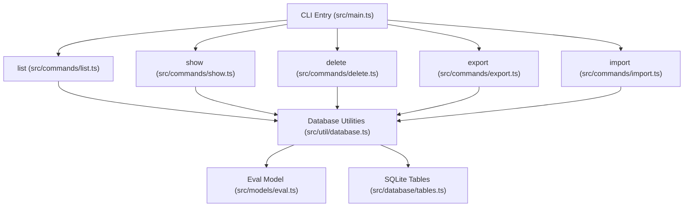
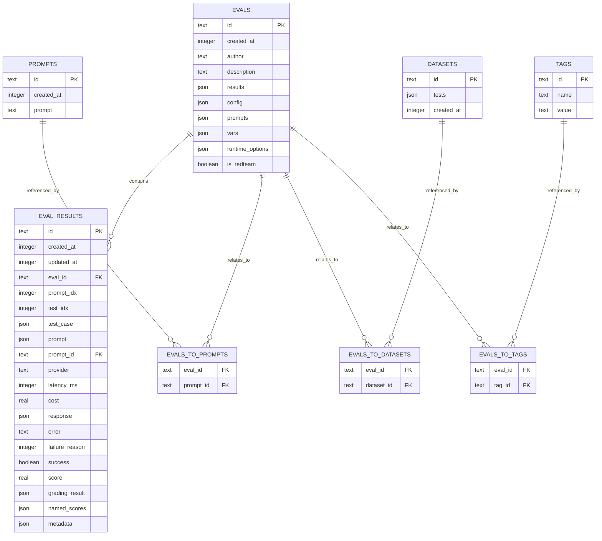
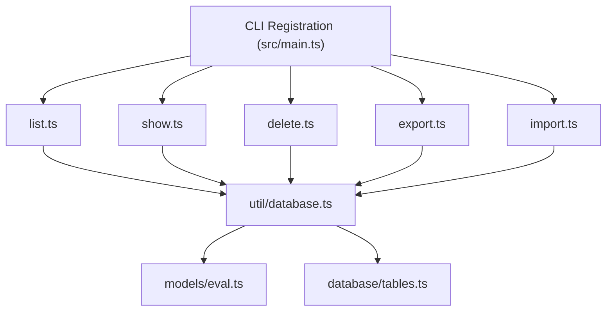

# Management Commands

<cite>
**Referenced Files in This Document**
- [src/main.ts](file://src/main.ts)
- [src/commands/list.ts](file://src/commands/list.ts)
- [src/commands/show.ts](file://src/commands/show.ts)
- [src/commands/delete.ts](file://src/commands/delete.ts)
- [src/commands/export.ts](file://src/commands/export.ts)
- [src/commands/import.ts](file://src/commands/import.ts)
- [src/util/database.ts](file://src/util/database.ts)
- [src/models/eval.ts](file://src/models/eval.ts)
- [src/database/tables.ts](file://src/database/tables.ts)
</cite>

## Table of Contents
1. [Introduction](#introduction)
2. [Project Structure](#project-structure)
3. [Core Components](#core-components)
4. [Architecture Overview](#architecture-overview)
5. [Detailed Component Analysis](#detailed-component-analysis)
6. [Dependency Analysis](#dependency-analysis)
7. [Performance Considerations](#performance-considerations)
8. [Troubleshooting Guide](#troubleshooting-guide)
9. [Conclusion](#conclusion)

## Introduction
This document explains the PromptFoo management commands for database and evaluation lifecycle operations: list, show, delete, export, and import. It covers purpose, syntax, filtering, output formatting, batch operations, and integration with the internal SQLite-based data model. Practical workflows include listing evaluations, viewing run details, deleting stored results, exporting evaluation records and logs, importing historical data, and automating cleanup and archival tasks.

## Project Structure
The management commands are registered in the main CLI entry point and implemented under the commands directory. They operate against a normalized relational model backed by SQLite tables for evaluations, prompts, datasets, tags, and results.

**Diagram sources**
- [src/main.ts:198-227](file://src/main.ts#L198-L227)
- [src/commands/list.ts:17-399](file://src/commands/list.ts#L17-L399)
- [src/commands/show.ts:174-242](file://src/commands/show.ts#L174-L242)
- [src/commands/delete.ts:31-79](file://src/commands/delete.ts#L31-L79)
- [src/commands/export.ts:95-224](file://src/commands/export.ts#L95-L224)
- [src/commands/import.ts:65-147](file://src/commands/import.ts#L65-L147)
- [src/util/database.ts:33-166](file://src/util/database.ts#L33-L166)
- [src/models/eval.ts:318-480](file://src/models/eval.ts#L318-L480)
- [src/database/tables.ts:57-155](file://src/database/tables.ts#L57-L155)

**Section sources**
- [src/main.ts:198-227](file://src/main.ts#L198-L227)

## Core Components
- list: Lists evaluations, prompts, and datasets with optional interactive UI and pagination.
- show: Displays detailed information for a specific evaluation, prompt, or dataset.
- delete: Removes a specific evaluation or all evaluations with confirmation.
- export: Exports evaluation records to JSON or collects and archives logs.
- import: Imports evaluation records from JSON, supporting both legacy and current formats.

**Section sources**
- [src/commands/list.ts:17-399](file://src/commands/list.ts#L17-L399)
- [src/commands/show.ts:174-242](file://src/commands/show.ts#L174-L242)
- [src/commands/delete.ts:31-79](file://src/commands/delete.ts#L31-L79)
- [src/commands/export.ts:95-224](file://src/commands/export.ts#L95-L224)
- [src/commands/import.ts:65-147](file://src/commands/import.ts#L65-L147)

## Architecture Overview
The management commands rely on a normalized SQLite schema with dedicated tables for evaluations, prompts, datasets, tags, and results. The Eval model encapsulates persistence and retrieval logic, while utilities provide high-level operations for listing, filtering, and deleting records.

**Diagram sources**
- [src/database/tables.ts:57-155](file://src/database/tables.ts#L57-L155)
- [src/database/tables.ts:157-172](file://src/database/tables.ts#L157-L172)
- [src/database/tables.ts:258-287](file://src/database/tables.ts#L258-L287)
- [src/database/tables.ts:178-193](file://src/database/tables.ts#L178-L193)

## Detailed Component Analysis

### list: List Evaluations, Prompts, and Datasets
Purpose
- Enumerate evaluations, prompts, and datasets with optional limits and IDs-only output.
- Interactive UI supported via Ink for evaluations and datasets; falls back to tabular output otherwise.

Syntax
- promptfoo list evals [--env-file <path>] [-n <limit>] [--ids-only]
- promptfoo list prompts [--env-file <path>] [-n <limit>] [--ids-only]
- promptfoo list datasets [--env-file <path>] [-n <limit>] [--ids-only]

Key behaviors
- Pagination and counts for evaluations when using interactive UI.
- Computed metrics (pass/fail/error counts) and provider extraction for evaluations.
- Hash-based ID shortening for compact display.

Practical examples
- List last 50 evaluations with IDs only: promptfoo list evals -n 50 --ids-only
- List prompts with interactive UI: promptfoo list prompts

Filtering and output
- Limit results with -n.
- Output only IDs with --ids-only for scripting.
- Environment loading via --env-file.

**Section sources**
- [src/commands/list.ts:17-399](file://src/commands/list.ts#L17-L399)

### show: View Evaluation, Prompt, or Dataset Details
Purpose
- Display detailed information for a specific evaluation, prompt, or dataset.
- Defaults to the most recent evaluation if no ID provided.

Syntax
- promptfoo show [id]
- promptfoo show eval [id|latest]
- promptfoo show prompt <id>
- promptfoo show dataset <id>

Key behaviors
- Resolves ID to evaluation, prompt, or dataset.
- Generates tables for evaluation results with truncation.
- Shows related evals and datasets for prompts and datasets.

Practical examples
- Show latest evaluation: promptfoo show
- Show specific evaluation: promptfoo show eval <id>
- Show prompt details: promptfoo show prompt <id>

**Section sources**
- [src/commands/show.ts:174-242](file://src/commands/show.ts#L174-L242)

### delete: Remove Stored Evaluations
Purpose
- Delete a specific evaluation by ID.
- Delete the latest evaluation or all evaluations with confirmation.

Syntax
- promptfoo delete <id>
- promptfoo delete eval <id|latest|all> [--env-file <path>]

Key behaviors
- Confirms deletion for all evaluations.
- Cleans up related records (prompts, datasets, tags, results) before removing the evaluation.
- Throws if the evaluation does not exist.

Practical examples
- Delete latest evaluation: promptfoo delete eval latest
- Delete all evaluations: promptfoo delete eval all
- Delete specific evaluation: promptfoo delete <id>

**Section sources**
- [src/commands/delete.ts:31-79](file://src/commands/delete.ts#L31-L79)
- [src/util/database.ts:440-486](file://src/util/database.ts#L440-L486)

### export: Export Evaluation Records and Logs
Purpose
- Export a single evaluation to JSON (summary or full depending on output flag).
- Collect and compress recent log files into a .gz archive for debugging.

Syntax
- promptfoo export eval <evalId|latest> [-o <outputPath>]
- promptfoo export logs [-n <count>] [-o <outputPath>]

Key behaviors
- Latest evaluation resolution.
- JSON output includes metadata and optionally a summary.
- Log collection filters by count and writes a tar-like gz stream.
- Automatic timestamped filename when output path is omitted.

Practical examples
- Export latest evaluation to file: promptfoo export eval latest -o results.json
- Export specific evaluation to stdout: promptfoo export eval <id>
- Collect last 10 logs: promptfoo export logs -n 10

**Section sources**
- [src/commands/export.ts:95-224](file://src/commands/export.ts#L95-L224)

### import: Import Evaluation Records
Purpose
- Import evaluation records from a JSON file, preserving or replacing IDs and authorship.
- Supports both legacy and current export formats.

Syntax
- promptfoo import <file> [--new-id] [--force]

Key behaviors
- Detects eval ID and timestamps from metadata/results.
- Prevents collisions unless --new-id or --force is used.
- Creates Eval and EvalResult records for current format; inserts legacy format directly.
- Records telemetry with import details.

Practical examples
- Import with new ID: promptfoo import results.json --new-id
- Replace existing: promptfoo import results.json --force

**Section sources**
- [src/commands/import.ts:65-147](file://src/commands/import.ts#L65-L147)

## Dependency Analysis
The management commands depend on the Eval model and database utilities for CRUD operations and on the SQLite schema for persistence. The CLI registers commands centrally and adds common options recursively.

**Diagram sources**
- [src/main.ts:198-227](file://src/main.ts#L198-L227)
- [src/commands/list.ts:17-399](file://src/commands/list.ts#L17-L399)
- [src/commands/show.ts:174-242](file://src/commands/show.ts#L174-L242)
- [src/commands/delete.ts:31-79](file://src/commands/delete.ts#L31-L79)
- [src/commands/export.ts:95-224](file://src/commands/export.ts#L95-L224)
- [src/commands/import.ts:65-147](file://src/commands/import.ts#L65-L147)
- [src/util/database.ts:33-166](file://src/util/database.ts#L33-L166)
- [src/models/eval.ts:318-480](file://src/models/eval.ts#L318-L480)
- [src/database/tables.ts:57-155](file://src/database/tables.ts#L57-L155)

**Section sources**
- [src/main.ts:198-227](file://src/main.ts#L198-L227)

## Performance Considerations
- Pagination and counts: The list command uses paginated queries for evaluations to avoid loading all records at once.
- Interactive UI: Ink-based lists improve UX but may increase memory usage for large datasets.
- Batch operations: Use --ids-only for scripts to minimize output volume.
- Deletion transactions: The delete command wraps cleanup in a transaction to maintain referential integrity efficiently.
- Export compression: Logs are compressed to reduce disk footprint and transfer overhead.

[No sources needed since this section provides general guidance]

## Troubleshooting Guide
Common issues and resolutions
- No evaluation found: Use promptfoo list evals to discover IDs; verify --env-file if applicable.
- Invalid option errors: The CLI reports invalid options and suggests help; ensure flags are correct.
- Log directory missing: Export logs requires an existing logs directory; run an evaluation first to create logs.
- Import conflicts: Use --new-id to generate a new evaluation ID or --force to replace an existing evaluation.
- Deletion confirmation: All-evaluation deletion requires explicit confirmation; use --env-file if needed.

**Section sources**
- [src/commands/show.ts:174-242](file://src/commands/show.ts#L174-L242)
- [src/commands/export.ts:154-222](file://src/commands/export.ts#L154-L222)
- [src/commands/import.ts:83-98](file://src/commands/import.ts#L83-L98)
- [src/commands/delete.ts:20-29](file://src/commands/delete.ts#L20-L29)

## Conclusion
The management commands provide a robust toolkit for inspecting, manipulating, and archiving evaluation data. By leveraging the normalized SQLite schema and the Eval model, these commands support efficient workflows for listing, viewing, deleting, exporting, and importing evaluation records. Use the provided flags and options to tailor operations to your needs, and integrate these commands into automated scripts for routine maintenance and data migration tasks.