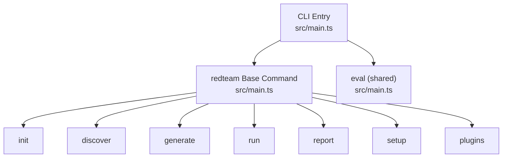
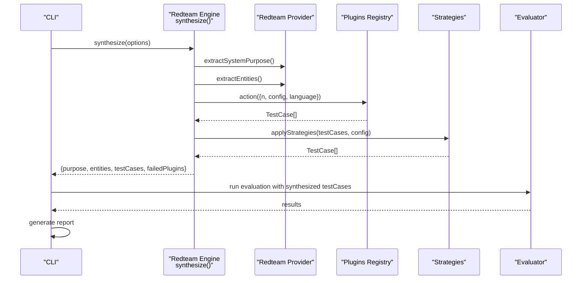
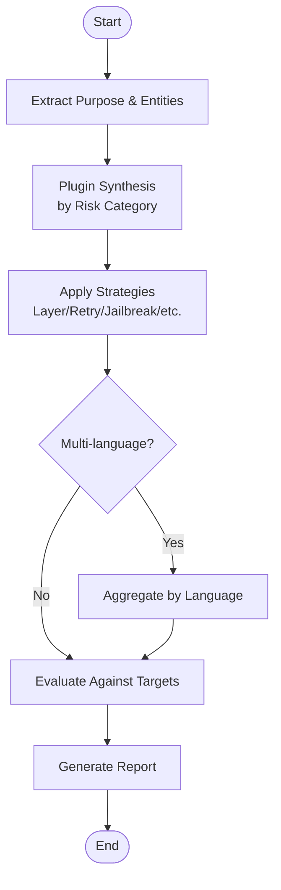
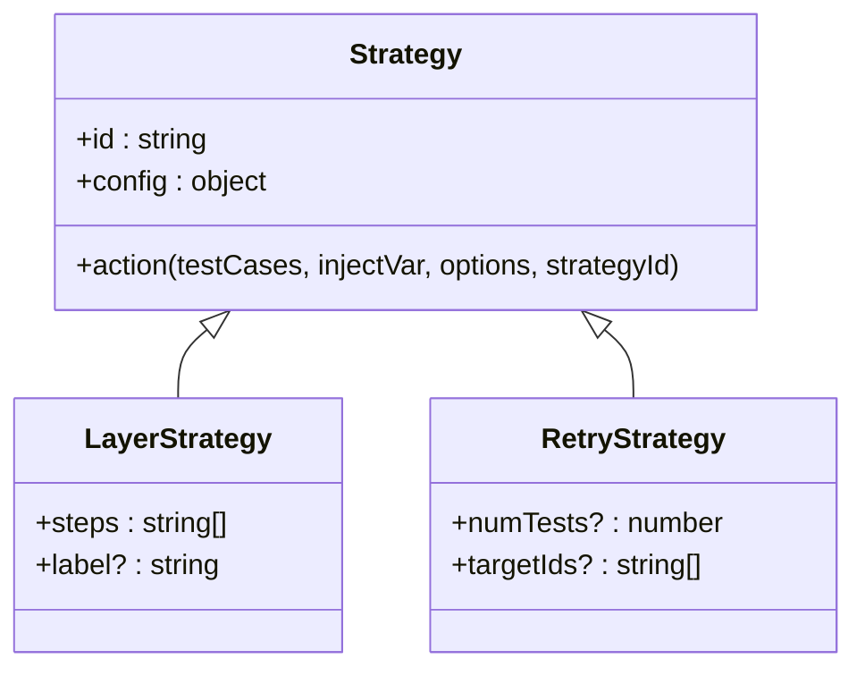
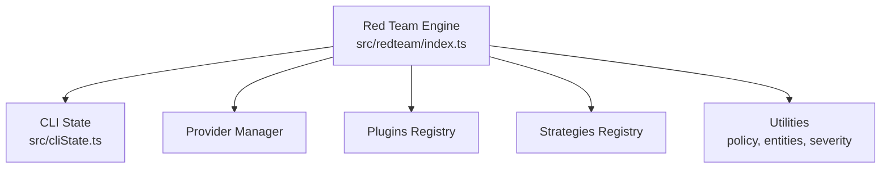

# Red Team Commands

<cite>
**Referenced Files in This Document**
- [main.ts](file://src/main.ts)
- [index.ts](file://src/redteam/index.ts)
- [cliState.ts](file://src/cliState.ts)
- [redteam-api-top-10 promptfooconfig.yaml](file://examples/redteam-api-top-10/promptfooconfig.yaml)
- [redteam-beavertails promptfooconfig.yaml](file://examples/redteam-beavertails/promptfooconfig.yaml)
- [redteam-bestOfN-strategy promptfooconfig.yaml](file://examples/redteam-bestOfN-strategy/promptfooconfig.yaml)
- [redteam-custom-strategy promptfooconfig.yaml](file://examples/redteam-custom-strategy/promptfooconfig.yaml)
- [redteam-guardrails promptfooconfig.yaml](file://examples/redteam-guardrails/promptfooconfig.yaml)
- [redteam-layer-strategy promptfooconfig.yaml](file://examples/redteam-layer-strategy/promptfooconfig.yaml)
- [redteam-tracing-example redteam_tracing_results.json](file://examples/redteam-tracing-example/redteam_tracing_results.json)
</cite>

## Table of Contents
1. [Introduction](#introduction)
2. [Project Structure](#project-structure)
3. [Core Components](#core-components)
4. [Architecture Overview](#architecture-overview)
5. [Detailed Component Analysis](#detailed-component-analysis)
6. [Dependency Analysis](#dependency-analysis)
7. [Performance Considerations](#performance-considerations)
8. [Troubleshooting Guide](#troubleshooting-guide)
9. [Conclusion](#conclusion)
10. [Appendices](#appendices)

## Introduction
This document explains the promptfoo redteam command family and the adversarial testing methodology it implements. It covers the red team workflow from discovery and setup to test generation, evaluation, and reporting. It also documents the red team plugin ecosystem, strategy system, and how results integrate with the broader evaluation framework. Practical examples are drawn from the repository’s redteam example configurations.

## Project Structure
The redteam command family is integrated under the main CLI entry point. The redteam group command exposes subcommands for initialization, discovery, generation, running evaluations, reporting, setup, and plugin inspection. The core red team engine orchestrates plugin-based test synthesis and strategy-driven transformations.

**Diagram sources**
- [main.ts:200-245](file://src/main.ts#L200-L245)

**Section sources**
- [main.ts:200-245](file://src/main.ts#L200-L245)

## Core Components
- Red team orchestration engine: synthesizes test cases from plugins and strategies, manages concurrency, and produces a unified test suite.
- Plugin registry and categories: built-in plugins organized by risk domain (foundation, harmful, bias, PII, medical, etc.), plus policy and custom plugins.
- Strategy system: transforms plugin-generated tests into adversarial variants (e.g., jailbreaks, layering, retry).
- Reporting: generates a summary table of requested vs. generated tests per plugin and strategy.

Key implementation references:
- Orchestration and synthesis: [synthesis pipeline:700-1359](file://src/redteam/index.ts#L700-L1359)
- Plugin metadata and severity: [metadata augmentation:282-324](file://src/redteam/index.ts#L282-L324)
- Strategy application: [applyStrategies:350-567](file://src/redteam/index.ts#L350-L567)
- Reporting: [generateReport:173-213](file://src/redteam/index.ts#L173-L213)

**Section sources**
- [index.ts:282-324](file://src/redteam/index.ts#L282-L324)
- [index.ts:350-567](file://src/redteam/index.ts#L350-L567)
- [index.ts:173-213](file://src/redteam/index.ts#L173-L213)

## Architecture Overview
The red team workflow follows a systematic adversarial testing cycle:
- Discovery: extract system purpose and entities to inform test generation.
- Plugin synthesis: generate baseline adversarial prompts per plugin and language.
- Strategy application: apply transformations to increase test difficulty or coverage.
- Evaluation: run the resulting test cases against target models/providers.
- Reporting: summarize success/failure rates and severity.

**Diagram sources**
- [index.ts:700-1359](file://src/redteam/index.ts#L700-L1359)
- [main.ts:232-243](file://src/main.ts#L232-L243)

## Detailed Component Analysis

### Red Team Subcommands
- init: scaffolds a red team configuration and default settings.
- discover: extracts system purpose and entities to guide test generation.
- generate: synthesizes adversarial test cases from plugins and strategies.
- run: executes evaluation of generated tests against target providers.
- report: produces a summary of plugin and strategy outcomes.
- setup: guides configuration of providers, plugins, and strategies.
- plugins: lists available plugins and categories.

Integration with the main CLI:
- The redteam base command registers all subcommands and shares the evaluation command with the broader framework.

**Section sources**
- [main.ts:232-243](file://src/main.ts#L232-L243)

### Red Team Methodology and Adversarial Testing Principles
- Purpose and entity extraction: informs realistic adversarial prompts grounded in the system’s intended use and stakeholders.
- Plugin-driven synthesis: leverages curated domains of risk to systematically probe weaknesses.
- Strategy-based escalation: increases test difficulty progressively (e.g., layering, retry, jailbreaks).
- Multi-language support: ensures robustness across locales.
- Severity tagging: annotates tests to prioritize remediation.

**Diagram sources**
- [index.ts:700-1359](file://src/redteam/index.ts#L700-L1359)

### Systematic Vulnerability Assessment Workflow
- Configure red team: define provider, plugins, strategies, and languages.
- Discover: derive purpose and entities from prompts.
- Generate: produce adversarial test cases.
- Run: evaluate against target models.
- Report: review severity and pass/fail status.
- Iterate: refine strategies/plugins based on findings.

Practical example references:
- API Top 10: [promptfooconfig.yaml](file://examples/redteam-api-top-10/promptfooconfig.yaml)
- BeaverTales: [promptfooconfig.yaml](file://examples/redteam-beavertails/promptfooconfig.yaml)
- Best-of-N strategy: [promptfooconfig.yaml](file://examples/redteam-bestOfN-strategy/promptfooconfig.yaml)
- Custom strategy: [promptfooconfig.yaml](file://examples/redteam-custom-strategy/promptfooconfig.yaml)
- Guardrails: [promptfooconfig.yaml](file://examples/redteam-guardrails/promptfooconfig.yaml)
- Layer strategy: [promptfooconfig.yaml](file://examples/redteam-layer-strategy/promptfooconfig.yaml)

**Section sources**
- [redteam-api-top-10 promptfooconfig.yaml](file://examples/redteam-api-top-10/promptfooconfig.yaml)
- [redteam-beavertails promptfooconfig.yaml](file://examples/redteam-beavertails/promptfooconfig.yaml)
- [redteam-bestOfN-strategy promptfooconfig.yaml](file://examples/redteam-bestOfN-strategy/promptfooconfig.yaml)
- [redteam-custom-strategy promptfooconfig.yaml](file://examples/redteam-custom-strategy/promptfooconfig.yaml)
- [redteam-guardrails promptfooconfig.yaml](file://examples/redteam-guardrails/promptfooconfig.yaml)
- [redteam-layer-strategy promptfooconfig.yaml](file://examples/redteam-layer-strategy/promptfooconfig.yaml)

### Command Syntax and Options
- redteam init: creates a starter configuration and defaults.
- redteam discover: computes purpose and entities from prompts.
- redteam generate: synthesizes tests using plugins and strategies.
- redteam run: executes evaluation with concurrency and remote options.
- redteam report: prints a summary table of plugin and strategy results.
- redteam setup: interactive guidance for configuring providers and strategies.
- redteam plugins: lists available plugins and categories.

CLI state integration:
- Concurrency and remote flags propagate through CLI state to the engine.

**Section sources**
- [main.ts:232-243](file://src/main.ts#L232-L243)
- [cliState.ts:1-53](file://src/cliState.ts#L1-L53)

### Configuration Requirements
- Provider configuration: specify model/provider for red team generation and evaluation.
- Plugins: select by id or category; configure per-plugin parameters and severity.
- Strategies: choose built-in strategies (e.g., layer, retry, jailbreak) and tune parameters like numTests and n.
- Languages: optional per-plugin or global multi-language support.
- Inputs: optional multi-input mode for complex prompts.

Example configurations:
- API Top 10: [promptfooconfig.yaml](file://examples/redteam-api-top-10/promptfooconfig.yaml)
- BeaverTales: [promptfooconfig.yaml](file://examples/redteam-beavertails/promptfooconfig.yaml)
- Best-of-N strategy: [promptfooconfig.yaml](file://examples/redteam-bestOfN-strategy/promptfooconfig.yaml)
- Custom strategy: [promptfooconfig.yaml](file://examples/redteam-custom-strategy/promptfooconfig.yaml)
- Guardrails: [promptfooconfig.yaml](file://examples/redteam-guardrails/promptfooconfig.yaml)
- Layer strategy: [promptfooconfig.yaml](file://examples/redteam-layer-strategy/promptfooconfig.yaml)

**Section sources**
- [redteam-api-top-10 promptfooconfig.yaml](file://examples/redteam-api-top-10/promptfooconfig.yaml)
- [redteam-beavertails promptfooconfig.yaml](file://examples/redteam-beavertails/promptfooconfig.yaml)
- [redteam-bestOfN-strategy promptfooconfig.yaml](file://examples/redteam-bestOfN-strategy/promptfooconfig.yaml)
- [redteam-custom-strategy promptfooconfig.yaml](file://examples/redteam-custom-strategy/promptfooconfig.yaml)
- [redteam-guardrails promptfooconfig.yaml](file://examples/redteam-guardrails/promptfooconfig.yaml)
- [redteam-layer-strategy promptfooconfig.yaml](file://examples/redteam-layer-strategy/promptfooconfig.yaml)

### Integration with the Main Evaluation Framework
- The redteam base command reuses the shared evaluation command, ensuring consistent output formats, result hooks, and reporting.
- CLI state carries concurrency and remote flags to align runtime behavior across red team and evaluation phases.

**Section sources**
- [main.ts:233-237](file://src/main.ts#L233-L237)
- [cliState.ts:1-53](file://src/cliState.ts#L1-L53)

### Practical Examples
- API Top 10: Demonstrates targeted red team configuration for API-focused systems.
- BeaverTales: Shows plugin and strategy combinations for narrative and scenario-based adversarial testing.
- Best-of-N strategy: Illustrates strategy-driven test amplification.
- Custom strategy: Demonstrates extending the strategy system.
- Guardrails: Highlights policy-driven plugin usage.
- Layer strategy: Shows multi-step transformation sequences.

**Section sources**
- [redteam-api-top-10 promptfooconfig.yaml](file://examples/redteam-api-top-10/promptfooconfig.yaml)
- [redteam-beavertails promptfooconfig.yaml](file://examples/redteam-beavertails/promptfooconfig.yaml)
- [redteam-bestOfN-strategy promptfooconfig.yaml](file://examples/redteam-bestOfN-strategy/promptfooconfig.yaml)
- [redteam-custom-strategy promptfooconfig.yaml](file://examples/redteam-custom-strategy/promptfooconfig.yaml)
- [redteam-guardrails promptfooconfig.yaml](file://examples/redteam-guardrails/promptfooconfig.yaml)
- [redteam-layer-strategy promptfooconfig.yaml](file://examples/redteam-layer-strategy/promptfooconfig.yaml)

### Plugin Ecosystem and Categories
- Built-in categories: foundation, harmful, bias, PII, medical, pharmacy, insurance, financial, telecom.
- Policy plugin: supports inline or cloud policy inputs with severity mapping.
- Custom plugins: loadable via file:// URIs for domain-specific adversarial prompts.

Severity and metadata:
- Severity inferred from plugin id or explicit configuration.
- Metadata includes pluginId, pluginConfig, severity, modifiers, and language.

**Section sources**
- [index.ts:246-256](file://src/redteam/index.ts#L246-L256)
- [index.ts:310-323](file://src/redteam/index.ts#L310-L323)
- [index.ts:85-94](file://src/redteam/index.ts#L85-L94)

### Strategy System and Attack Transformation
- Built-in strategies: layer, retry, jailbreak variants, and others.
- Fan-out strategies: multiply input tests into additional variants (e.g., N:1).
- Targeting: strategies can be scoped to specific plugins or categories.
- Agentic strategies: may require goal extraction from prompts and can exclude target outputs from attack generation.

**Diagram sources**
- [index.ts:350-567](file://src/redteam/index.ts#L350-L567)

**Section sources**
- [index.ts:350-567](file://src/redteam/index.ts#L350-L567)

### Advanced Red Team Techniques
- Multi-input mode: enables complex prompts with multiple variables while avoiding namespace collisions.
- Multi-language synthesis: generates tests per language and aggregates results.
- Goal extraction: supports agentic strategies by deriving intent from prompts and policies.
- Remote generation: validates remote API health before proceeding.

**Section sources**
- [index.ts:898-918](file://src/redteam/index.ts#L898-L918)
- [index.ts:1088-1093](file://src/redteam/index.ts#L1088-L1093)
- [index.ts:1177-1191](file://src/redteam/index.ts#L1177-L1191)
- [index.ts:1015-1029](file://src/redteam/index.ts#L1015-L1029)

### CI/CD Integration and Automated Security Testing
- Use redteam generate to produce test suites offline.
- Integrate redteam run with continuous evaluation jobs.
- Capture and publish redteam report outputs for compliance tracking.
- Example tracing results demonstrate artifact capture for downstream analysis.

**Section sources**
- [redteam-tracing-example redteam_tracing_results.json](file://examples/redteam-tracing-example/redteam_tracing_results.json)

### Compliance Reporting
- Severity tagging and plugin metadata enable prioritized remediation.
- Report table provides Requested vs. Generated counts per plugin and strategy.
- Multi-language breakdown aids localization compliance assessments.

**Section sources**
- [index.ts:173-213](file://src/redteam/index.ts#L173-L213)
- [index.ts:516-543](file://src/redteam/index.ts#L516-L543)

## Dependency Analysis
The red team engine depends on:
- CLI state for runtime flags (concurrency, remote).
- Provider manager for model access.
- Plugin registry for test generation actions.
- Strategy registry for transformations.
- Utilities for policy validation, entity extraction, and severity mapping.

**Diagram sources**
- [index.ts:1-55](file://src/redteam/index.ts#L1-L55)
- [cliState.ts:1-53](file://src/cliState.ts#L1-L53)

**Section sources**
- [index.ts:1-55](file://src/redteam/index.ts#L1-L55)
- [cliState.ts:1-53](file://src/cliState.ts#L1-L53)

## Performance Considerations
- Concurrency caps: enforced to prevent provider throttling.
- Progress tracking: optional progress bar or logging depending on environment.
- Pre/post limiting: strategies cap expected and actual test counts to manage workload.
- Multi-language parallelism: language-specific generations run concurrently.

**Section sources**
- [index.ts:742-745](file://src/redteam/index.ts#L742-L745)
- [index.ts:1035-1050](file://src/redteam/index.ts#L1035-L1050)
- [index.ts:404-451](file://src/redteam/index.ts#L404-L451)

## Troubleshooting Guide
- API health failures: remote generation checks fail with actionable messages.
- Validation errors: plugin validation failures skip offending plugins with warnings.
- Abort signals: synthesis respects abort to cancel long-running operations.
- Zero-generation plugins: reported in the summary table as failures requiring investigation.

**Section sources**
- [index.ts:1015-1029](file://src/redteam/index.ts#L1015-L1029)
- [index.ts:992-1009](file://src/redteam/index.ts#L992-L1009)
- [index.ts:724-732](file://src/redteam/index.ts#L724-L732)
- [index.ts:1352-1356](file://src/redteam/index.ts#L1352-L1356)

## Conclusion
The promptfoo redteam command family provides a structured, extensible framework for adversarial testing. By combining curated plugins, strategy-driven transformations, and robust reporting, teams can systematically uncover vulnerabilities, prioritize remediation via severity tagging, and integrate findings into continuous evaluation and compliance workflows.

## Appendices

### Appendix A: Example Configurations
- API Top 10: [promptfooconfig.yaml](file://examples/redteam-api-top-10/promptfooconfig.yaml)
- BeaverTales: [promptfooconfig.yaml](file://examples/redteam-beavertails/promptfooconfig.yaml)
- Best-of-N strategy: [promptfooconfig.yaml](file://examples/redteam-bestOfN-strategy/promptfooconfig.yaml)
- Custom strategy: [promptfooconfig.yaml](file://examples/redteam-custom-strategy/promptfooconfig.yaml)
- Guardrails: [promptfooconfig.yaml](file://examples/redteam-guardrails/promptfooconfig.yaml)
- Layer strategy: [promptfooconfig.yaml](file://examples/redteam-layer-strategy/promptfooconfig.yaml)

**Section sources**
- [redteam-api-top-10 promptfooconfig.yaml](file://examples/redteam-api-top-10/promptfooconfig.yaml)
- [redteam-beavertails promptfooconfig.yaml](file://examples/redteam-beavertails/promptfooconfig.yaml)
- [redteam-bestOfN-strategy promptfooconfig.yaml](file://examples/redteam-bestOfN-strategy/promptfooconfig.yaml)
- [redteam-custom-strategy promptfooconfig.yaml](file://examples/redteam-custom-strategy/promptfooconfig.yaml)
- [redteam-guardrails promptfooconfig.yaml](file://examples/redteam-guardrails/promptfooconfig.yaml)
- [redteam-layer-strategy promptfooconfig.yaml](file://examples/redteam-layer-strategy/promptfooconfig.yaml)