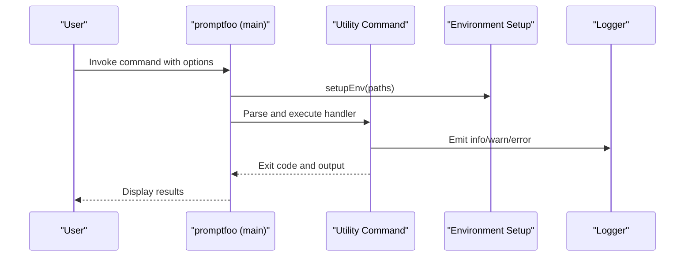
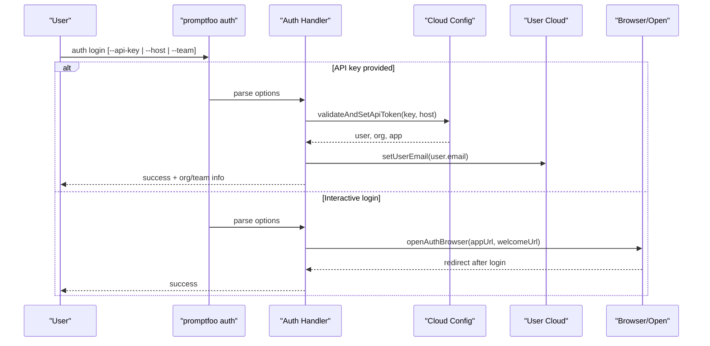
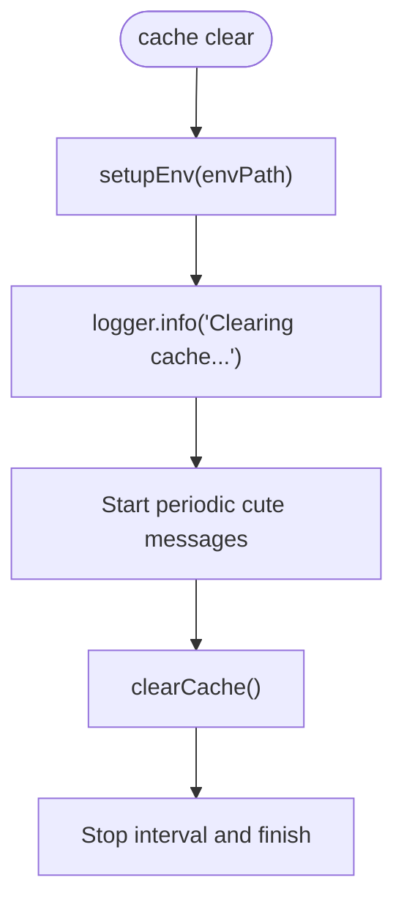
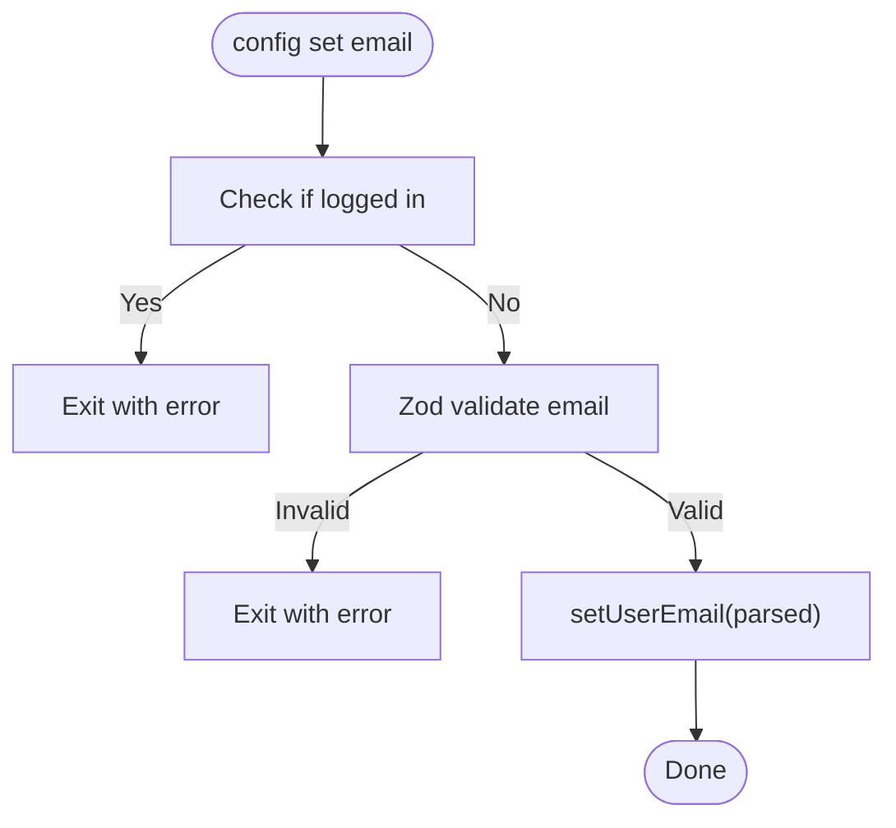
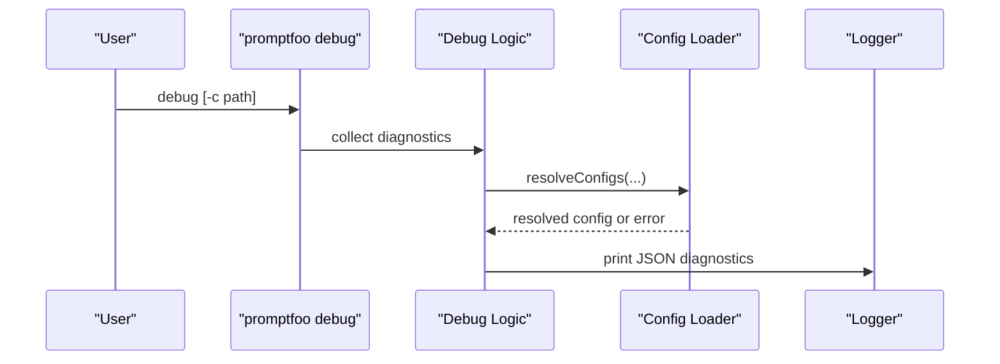
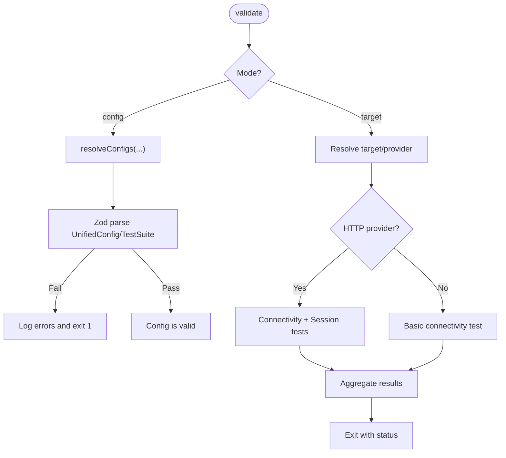
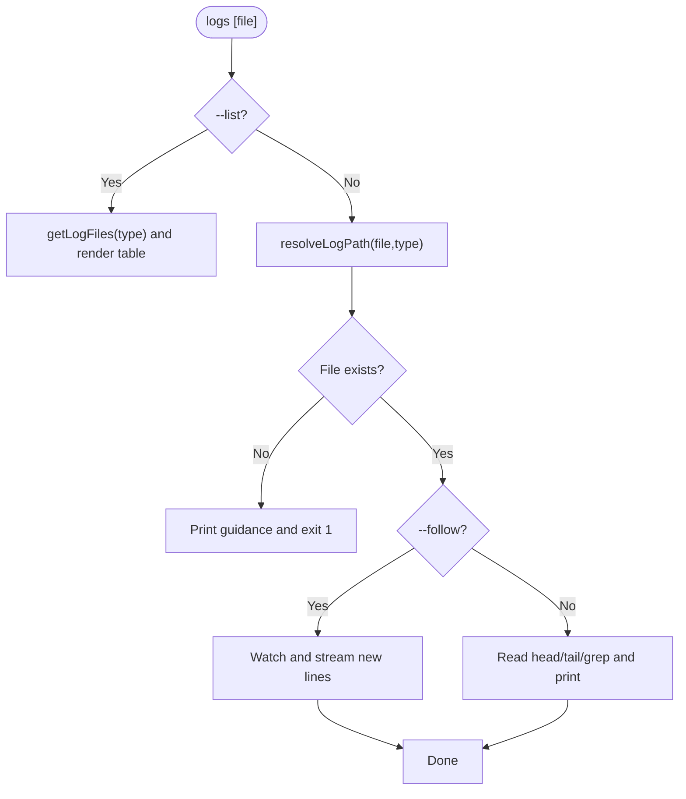
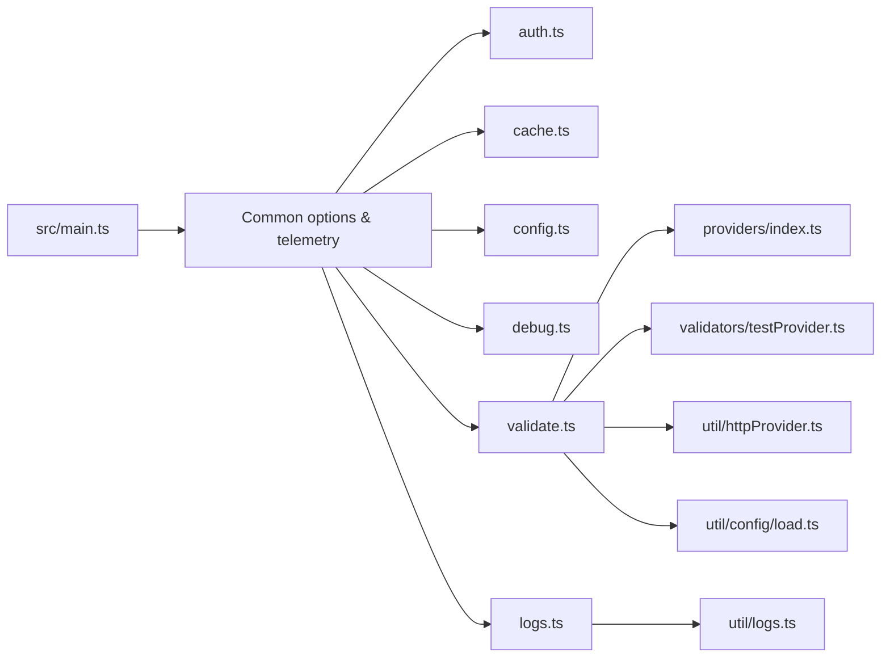

# Utility Commands

<cite>
**Referenced Files in This Document**
- [src/main.ts](file://src/main.ts)
- [src/commands/auth.ts](file://src/commands/auth.ts)
- [src/commands/cache.ts](file://src/commands/cache.ts)
- [src/commands/config.ts](file://src/commands/config.ts)
- [src/commands/debug.ts](file://src/commands/debug.ts)
- [src/commands/validate.ts](file://src/commands/validate.ts)
- [src/commands/logs.ts](file://src/commands/logs.ts)
- [src/cache.ts](file://src/cache.ts)
- [src/index.ts](file://src/index.ts)
- [examples/getting-started/promptfooconfig.yaml](file://examples/getting-started/promptfooconfig.yaml)
- [test/smoke/cli.test.ts](file://test/smoke/cli.test.ts)
- [test/commands/auth.test.ts](file://test/commands/auth.test.ts)
</cite>

## Table of Contents
1. [Introduction](#introduction)
2. [Project Structure](#project-structure)
3. [Core Components](#core-components)
4. [Architecture Overview](#architecture-overview)
5. [Detailed Component Analysis](#detailed-component-analysis)
6. [Dependency Analysis](#dependency-analysis)
7. [Performance Considerations](#performance-considerations)
8. [Troubleshooting Guide](#troubleshooting-guide)
9. [Conclusion](#conclusion)
10. [Appendices](#appendices)

## Introduction
This document explains the PromptFoo utility commands that support day-to-day operations and maintenance: auth, cache, config, debug, validate, and logs. It covers command syntax, use cases, integration with the main evaluation workflow, and practical examples. You will learn how to manage authentication, optimize performance with caching, validate configurations, troubleshoot issues, and monitor activity via logs.

## Project Structure
PromptFoo’s CLI is built around a modular command architecture. The main entry wires together all commands, including the six utilities covered here. Each utility command is implemented in its own file under src/commands and integrates with shared subsystems like logging, environment setup, and configuration resolution.

```mermaid
graph TB
Main["src/main.ts<br/>Registers all commands"] --> Auth["src/commands/auth.ts"]
Main --> Cache["src/commands/cache.ts"]
Main --> Config["src/commands/config.ts"]
Main --> Debug["src/commands/debug.ts"]
Main --> Validate["src/commands/validate.ts"]
Main --> Logs["src/commands/logs.ts"]
Auth --> GlobalCfg["src/globalConfig/*"]
Auth --> UtilCloud["src/util/cloud.ts"]
Auth --> Logger["src/logger.ts"]
Cache --> CacheCore["src/cache.ts"]
Cache --> Logger
Config --> Accounts["src/globalConfig/accounts.ts"]
Config --> CloudCfg["src/globalConfig/cloud.ts"]
Config --> Logger
Debug --> Env["src/envars.ts"]
Debug --> ConfigLoad["src/util/config/load.ts"]
Debug --> Version["src/version.ts"]
Debug --> Logger
Validate --> Providers["src/providers/index.ts"]
Validate --> Validators["src/validators/testProvider.ts"]
Validate --> HttpPatch["src/util/httpProvider.ts"]
Validate --> Logger
Logs --> LogUtil["src/util/logs.ts"]
Logs --> Logger
```

**Diagram sources**
- [src/main.ts:198-227](file://src/main.ts#L198-L227)
- [src/commands/auth.ts:19-358](file://src/commands/auth.ts#L19-L358)
- [src/commands/cache.ts:6-44](file://src/commands/cache.ts#L6-L44)
- [src/commands/config.ts:11-102](file://src/commands/config.ts#L11-L102)
- [src/commands/debug.ts:78-88](file://src/commands/debug.ts#L78-L88)
- [src/commands/validate.ts:494-524](file://src/commands/validate.ts#L494-L524)
- [src/commands/logs.ts:327-488](file://src/commands/logs.ts#L327-L488)

**Section sources**
- [src/main.ts:198-227](file://src/main.ts#L198-L227)

## Core Components
- Authentication (auth): Login/logout/whoami, team selection, and permission checks.
- Cache (cache): Clear cache with progress messages.
- Configuration (config): Manage user email setting/unsetting.
- Debug (debug): Print diagnostic information including environment and resolved config.
- Validation (validate): Validate config files and test provider connectivity/session behavior.
- Logs (logs): View, filter, and follow log files; list available logs.

These commands integrate with the broader evaluation pipeline. For example, disabling cache during evaluation toggles caching behavior globally, and validation helps catch misconfigurations before running evaluations.

**Section sources**
- [src/commands/auth.ts:19-358](file://src/commands/auth.ts#L19-L358)
- [src/commands/cache.ts:6-44](file://src/commands/cache.ts#L6-L44)
- [src/commands/config.ts:11-102](file://src/commands/config.ts#L11-L102)
- [src/commands/debug.ts:78-88](file://src/commands/debug.ts#L78-L88)
- [src/commands/validate.ts:494-524](file://src/commands/validate.ts#L494-L524)
- [src/commands/logs.ts:327-488](file://src/commands/logs.ts#L327-L488)
- [src/index.ts:125-128](file://src/index.ts#L125-L128)

## Architecture Overview
The CLI composes subcommands and applies common options (e.g., verbose logging and environment files) to all commands. Each utility command encapsulates its own logic and interacts with shared modules for environment, logging, and configuration.

**Diagram sources**
- [src/main.ts:124-167](file://src/main.ts#L124-L167)
- [src/main.ts:169-256](file://src/main.ts#L169-L256)

## Detailed Component Analysis

### Authentication (auth)
- Purpose: Manage authentication with PromptFoo Cloud, including login via API key or browser, logout, whoami, and team selection.
- Key capabilities:
  - Login with API key or interactive browser flow.
  - Team selection with automatic defaulting in CI/non-interactive environments.
  - Whoami to display current user and organization/team context.
  - Permission checks for creating targets.
- Options:
  - login: --org, --host, --api-key, --team
  - logout: none
  - whoami: none
  - can-create-targets: --team-id
  - teams: list, current, set <team>

**Diagram sources**
- [src/commands/auth.ts:22-157](file://src/commands/auth.ts#L22-L157)

Practical examples:
- Login with API key and custom host:
  - promptfoo auth login --api-key YOUR_KEY --host https://custom.promptfoo.com
- Login interactively:
  - promptfoo auth login
- Check current identity:
  - promptfoo auth whoami
- Switch team:
  - promptfoo auth teams set my-team

Integration with evaluation:
- Authentication sets credentials used by cloud-backed features; evaluation proceeds normally afterward.

**Section sources**
- [src/commands/auth.ts:19-358](file://src/commands/auth.ts#L19-L358)
- [test/commands/auth.test.ts:68-200](file://test/commands/auth.test.ts#L68-L200)

### Cache (cache)
- Purpose: Clear the cache to remove stale or corrupted entries.
- Behavior:
  - Loads environment variables from specified files.
  - Emits periodic “cute” messages while clearing.
  - Calls the underlying cache clearing routine.
- Options:
  - clear: --env-file/--env-path <path>

**Diagram sources**
- [src/commands/cache.ts:10-43](file://src/commands/cache.ts#L10-L43)

Practical examples:
- Clear cache with environment file:
  - promptfoo cache clear --env-file .env
- Clear cache without arguments:
  - promptfoo cache clear

Integration with evaluation:
- Disabling cache during evaluation prevents reusing prior results, ensuring fresh runs.

**Section sources**
- [src/commands/cache.ts:6-44](file://src/commands/cache.ts#L6-L44)
- [src/cache.ts](file://src/cache.ts)
- [src/index.ts:125-128](file://src/index.ts#L125-L128)
- [test/smoke/cli.test.ts:181-188](file://test/smoke/cli.test.ts#L181-L188)

### Configuration (config)
- Purpose: Edit local configuration settings (currently focused on user email).
- Capabilities:
  - get email: prints current email or guidance.
  - set email <email>: validates and sets email; disallows while logged in.
  - unset email [-f]: unsets email with optional force confirmation.

**Diagram sources**
- [src/commands/config.ts:38-62](file://src/commands/config.ts#L38-L62)

Practical examples:
- Set email:
  - promptfoo config set email user@example.com
- Unset email:
  - promptfoo config unset email
- Get email:
  - promptfoo config get email

**Section sources**
- [src/commands/config.ts:11-102](file://src/commands/config.ts#L11-L102)

### Debug (debug)
- Purpose: Print diagnostic information for troubleshooting.
- Outputs:
  - Version, OS/platform, Node version.
  - Proxy and TLS-related environment variables.
  - Default and specified config paths.
  - Resolved config content or error message.
- Options:
  - -c, --config [path]

**Diagram sources**
- [src/commands/debug.ts:20-76](file://src/commands/debug.ts#L20-L76)

Practical examples:
- Debug current config:
  - promptfoo debug
- Debug a specific config:
  - promptfoo debug -c path/to/promptfooconfig.yaml

**Section sources**
- [src/commands/debug.ts:78-88](file://src/commands/debug.ts#L78-L88)

### Validate (validate)
- Purpose: Validate configuration files and optionally test providers.
- Modes:
  - validate config: Validates UnifiedConfig and TestSuite schemas.
  - validate target: Tests a specific provider or all providers from a config.
- Provider testing:
  - HTTP providers: Connectivity and session tests with suggestions.
  - Non-HTTP providers: Basic connectivity test.
- Options:
  - validate config: -c, --config <paths...>
  - validate target: -t, --target <id>, -c, --config <path>

**Diagram sources**
- [src/commands/validate.ts:407-441](file://src/commands/validate.ts#L407-L441)
- [src/commands/validate.ts:446-492](file://src/commands/validate.ts#L446-L492)

Practical examples:
- Validate default config:
  - promptfoo validate config
- Validate a specific config:
  - promptfoo validate config -c path/to/promptfooconfig.yaml
- Test a provider by ID or cloud UUID:
  - promptfoo validate target -t provider-id
- Test all providers from a config:
  - promptfoo validate target -c path/to/promptfooconfig.yaml

Integration with evaluation:
- Running validate before evaluation prevents runtime failures due to misconfiguration.

**Section sources**
- [src/commands/validate.ts:494-524](file://src/commands/validate.ts#L494-L524)
- [test/smoke/cli.test.ts:155-179](file://test/smoke/cli.test.ts#L155-L179)

### Logs (logs)
- Purpose: View, filter, and follow log files; list available logs.
- Features:
  - List logs by type (debug, error, all).
  - Tail-follow logs in real-time.
  - Head/tail viewing with line limits.
  - Grep-style filtering with regex.
  - Syntax highlighting with optional disabling.
- Options:
  - --type <debug|error|all>
  - -n, --lines <count>
  - --head <count>
  - -f, --follow
  - -l, --list
  - -g, --grep <pattern>
  - --no-color

**Diagram sources**
- [src/commands/logs.ts:327-488](file://src/commands/logs.ts#L327-L488)

Practical examples:
- View latest debug log:
  - promptfoo logs
- View last 100 lines:
  - promptfoo logs -n 100
- Filter by pattern:
  - promptfoo logs -g "ERROR|Exception"
- Follow current session:
  - promptfoo logs --follow
- List all logs:
  - promptfoo logs list

**Section sources**
- [src/commands/logs.ts:327-488](file://src/commands/logs.ts#L327-L488)

## Dependency Analysis
- Common options: All commands inherit verbose logging and environment file loading from the main CLI bootstrap.
- Shared modules:
  - Environment setup: setupEnv supports multiple comma-separated or variadic paths.
  - Logging: All commands use the centralized logger.
  - Configuration resolution: validate and debug rely on the same config loader used by evaluation.
- Coupling:
  - auth depends on cloud configuration and team resolution utilities.
  - validate depends on provider loaders and validator helpers.
  - logs depends on log utilities for discovery and streaming.

**Diagram sources**
- [src/main.ts:124-167](file://src/main.ts#L124-L167)
- [src/commands/validate.ts:7-14](file://src/commands/validate.ts#L7-L14)
- [src/commands/logs.ts:13-21](file://src/commands/logs.ts#L13-L21)

**Section sources**
- [src/main.ts:124-167](file://src/main.ts#L124-L167)

## Performance Considerations
- Cache clearing:
  - Use cache clear to remove stale entries and free disk space.
  - Combine with environment-specific cache directories via --env-file to isolate environments.
- Validation:
  - Run validate before long evaluation runs to avoid repeated failures.
  - Use validate target to quickly test a single provider when iterating on configuration.
- Logging:
  - Use --head/-n to limit output for large logs.
  - Use --grep to focus on specific events.
  - Disable colors (--no-color) when piping to files or tools.

[No sources needed since this section provides general guidance]

## Troubleshooting Guide
- Authentication failures:
  - Use auth whoami to confirm current session.
  - For API key login, ensure --host matches the intended instance.
  - In CI, supply PROMPTFOO_API_KEY or use --api-key.
- Provider connectivity:
  - Run validate target -t <provider-id> to test connectivity and session behavior.
  - Review suggestions printed by validate for configuration improvements.
- Cache issues:
  - Run cache clear to reset cache state.
  - If evaluation behaves unexpectedly, disable cache during evaluation to bypass cached results.
- Logs:
  - Use logs list to discover available logs.
  - Use logs --follow to monitor live output.
  - Use logs -g "<pattern>" to filter relevant lines.

**Section sources**
- [src/commands/auth.ts:178-227](file://src/commands/auth.ts#L178-L227)
- [src/commands/validate.ts:446-492](file://src/commands/validate.ts#L446-L492)
- [src/commands/cache.ts:10-43](file://src/commands/cache.ts#L10-L43)
- [src/commands/logs.ts:406-466](file://src/commands/logs.ts#L406-L466)

## Conclusion
The six utility commands provide essential operational capabilities: secure authentication, cache hygiene, configuration editing, diagnostic insights, provider validation, and log monitoring. Together with the main evaluation workflow, they form a robust toolkit for building, validating, and operating PromptFoo evaluations reliably and efficiently.

[No sources needed since this section summarizes without analyzing specific files]

## Appendices

### Practical Examples Index
- Authentication setup:
  - promptfoo auth login --api-key YOUR_KEY --host https://custom.promptfoo.com
  - promptfoo auth teams set my-team
- Cache management:
  - promptfoo cache clear --env-file .env
- Configuration validation:
  - promptfoo validate config -c examples/getting-started/promptfooconfig.yaml
  - promptfoo validate target -t openai:gpt-5.2
- Debugging:
  - promptfoo debug -c examples/getting-started/promptfooconfig.yaml
- Log analysis:
  - promptfoo logs --follow
  - promptfoo logs -g "ERROR|Exception"

**Section sources**
- [examples/getting-started/promptfooconfig.yaml:1-30](file://examples/getting-started/promptfooconfig.yaml#L1-L30)
- [test/smoke/cli.test.ts:155-188](file://test/smoke/cli.test.ts#L155-L188)