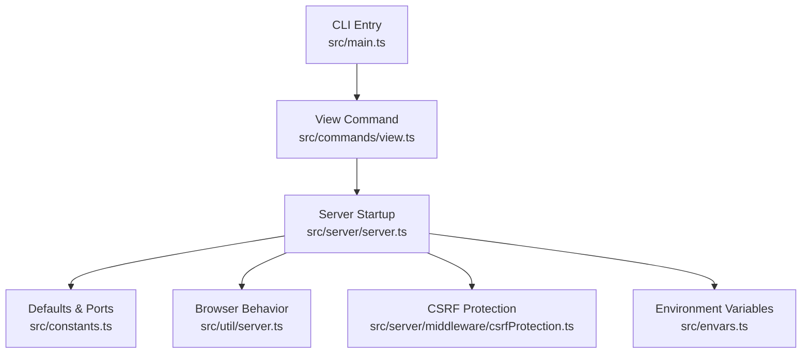
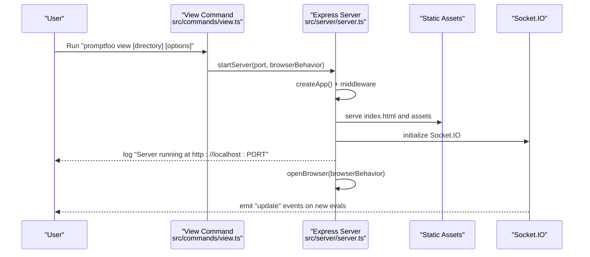
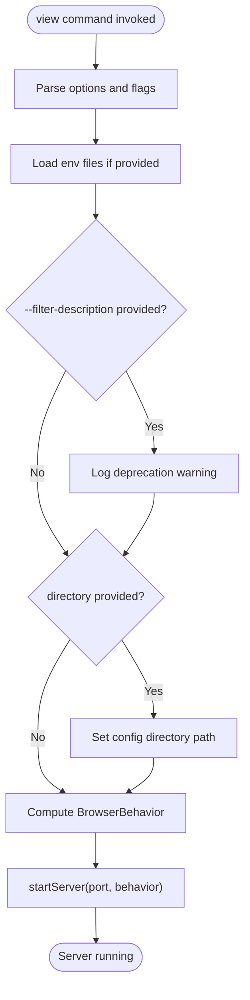
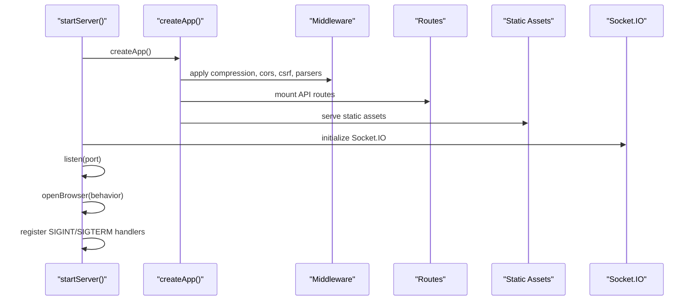
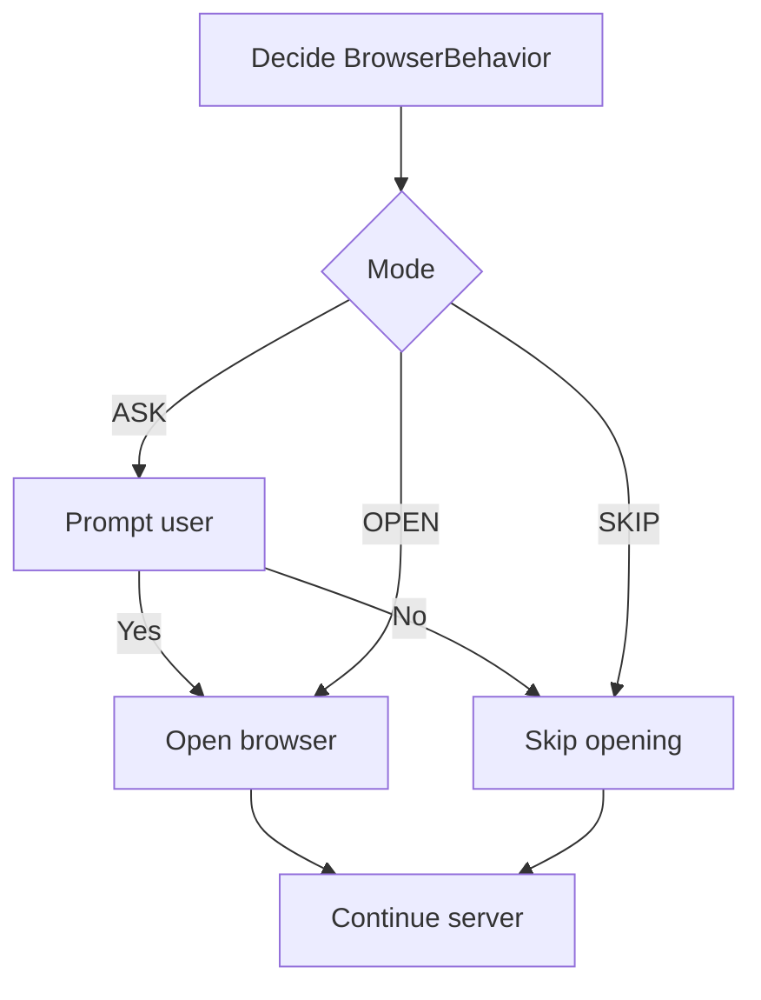
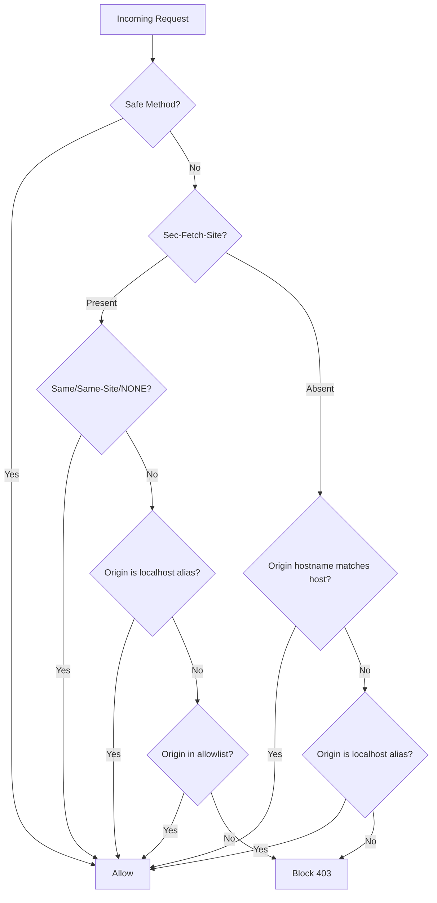
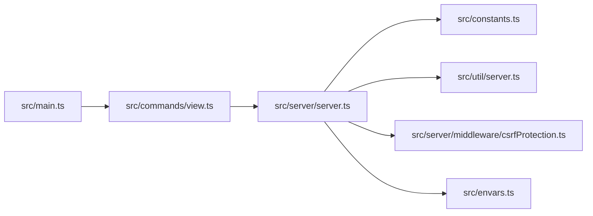

# View Command (view)

<cite>
**Referenced Files in This Document**
- [src/main.ts](file://src/main.ts)
- [src/commands/view.ts](file://src/commands/view.ts)
- [src/server/server.ts](file://src/server/server.ts)
- [src/constants.ts](file://src/constants.ts)
- [src/util/server.ts](file://src/util/server.ts)
- [src/server/middleware/csrfProtection.ts](file://src/server/middleware/csrfProtection.ts)
- [src/envars.ts](file://src/envars.ts)
- [test/commands/view.test.ts](file://test/commands/view.test.ts)
- [package.json](file://package.json)
</cite>

## Table of Contents
1. [Introduction](#introduction)
2. [Project Structure](#project-structure)
3. [Core Components](#core-components)
4. [Architecture Overview](#architecture-overview)
5. [Detailed Component Analysis](#detailed-component-analysis)
6. [Dependency Analysis](#dependency-analysis)
7. [Performance Considerations](#performance-considerations)
8. [Troubleshooting Guide](#troubleshooting-guide)
9. [Conclusion](#conclusion)
10. [Appendices](#appendices)

## Introduction
The view command starts a local web server that serves the Promptfoo browser UI and exposes APIs for evaluating results, prompts, datasets, and related metadata. It integrates with the backend Express server, Socket.IO for live updates, and the frontend static assets. Users can configure port binding, auto-open behavior, environment variables, and filtering options. The server includes built-in CSRF protection and CORS handling, and supports reverse proxy and load balancer deployments.

## Project Structure
The view command is registered in the main CLI entry and delegates to the server startup routine. The server composes middleware, routes, and static asset serving, and manages lifecycle signals for graceful shutdown.

**Diagram sources**
- [src/main.ts:198-202](file://src/main.ts#L198-L202)
- [src/commands/view.ts:9-56](file://src/commands/view.ts#L9-L56)
- [src/server/server.ts:117-310](file://src/server/server.ts#L117-L310)
- [src/constants.ts:27-29](file://src/constants.ts#L27-L29)
- [src/util/server.ts:9-27](file://src/util/server.ts#L9-L27)
- [src/server/middleware/csrfProtection.ts:53-115](file://src/server/middleware/csrfProtection.ts#L53-L115)
- [src/envars.ts:149-155](file://src/envars.ts#L149-L155)

**Section sources**
- [src/main.ts:198-202](file://src/main.ts#L198-L202)
- [src/commands/view.ts:9-56](file://src/commands/view.ts#L9-L56)
- [src/server/server.ts:117-310](file://src/server/server.ts#L117-L310)
- [src/constants.ts:27-29](file://src/constants.ts#L27-L29)
- [src/util/server.ts:9-27](file://src/util/server.ts#L9-L27)
- [src/server/middleware/csrfProtection.ts:53-115](file://src/server/middleware/csrfProtection.ts#L53-L115)
- [src/envars.ts:149-155](file://src/envars.ts#L149-L155)

## Core Components
- View command registration and options:
  - Port selection with default port resolution.
  - Auto-open behavior controlled by flags.
  - Environment file loading.
  - Deprecated filter option warning.
- Server startup:
  - Express app creation with middleware, routes, and static asset serving.
  - Socket.IO integration for live updates.
  - Graceful shutdown handling and signal watchers.
- Browser behavior:
  - Controlled via BrowserBehavior flags.
  - Optional user prompt for confirmation.
- Security:
  - CSRF protection middleware with allowlist support.
  - CORS enabled by default.

**Section sources**
- [src/commands/view.ts:9-56](file://src/commands/view.ts#L9-L56)
- [src/server/server.ts:117-310](file://src/server/server.ts#L117-L310)
- [src/util/server.ts:9-27](file://src/util/server.ts#L9-L27)
- [src/server/middleware/csrfProtection.ts:53-115](file://src/server/middleware/csrfProtection.ts#L53-L115)

## Architecture Overview
The view command orchestrates a long-running server that serves a SPA and exposes REST endpoints for evaluation data. Real-time updates are pushed via Socket.IO. The server is designed to be embedded behind reverse proxies and load balancers.

**Diagram sources**
- [src/commands/view.ts:23-54](file://src/commands/view.ts#L23-L54)
- [src/server/server.ts:312-411](file://src/server/server.ts#L312-L411)
- [src/util/server.ts:118-149](file://src/util/server.ts#L118-L149)

## Detailed Component Analysis

### View Command Options and Execution Flow
- Command syntax:
  - Subcommand: view
  - Optional positional directory argument.
  - Options:
    - -p, --port <number>: Port number with default derived from environment.
    - -y, --yes: Skip confirmation and auto-open the URL.
    - -n, --no: Skip confirmation and do not open the URL.
    - --filter-description <pattern>: Deprecated; currently ignored with a warning.
    - --env-file, --env-path <path>: Load environment variables from .env file(s).
- Execution behavior:
  - Loads environment files if provided.
  - Logs deprecation notice for the filter option.
  - Sets configuration directory if provided.
  - Determines BrowserBehavior based on flags.
  - Starts the server with the selected port and behavior.

**Diagram sources**
- [src/commands/view.ts:13-54](file://src/commands/view.ts#L13-L54)
- [src/util/server.ts:9-27](file://src/util/server.ts#L9-L27)

**Section sources**
- [src/commands/view.ts:9-56](file://src/commands/view.ts#L9-L56)
- [test/commands/view.test.ts:27-212](file://test/commands/view.test.ts#L27-L212)

### Server Startup and Lifecycle
- App creation:
  - Configures middleware: compression, CORS, CSRF protection, JSON/URL-encoded bodies, and request size limits.
  - Serves health endpoint and remote health endpoint.
  - Exposes REST endpoints for results, prompts, datasets, history, and telemetry.
  - Mounts route modules for eval, media, blobs, providers, redteam, user, configs, model audit, traces, and version.
  - Serves static assets and falls back to index.html for client-side routing.
- Socket.IO:
  - Initializes WebSocket server with permissive CORS.
  - Emits "update" events on new evaluation results.
- Lifecycle:
  - Runs database migrations on startup.
  - Registers signal watchers for live updates.
  - Listens on the configured port and opens the browser according to behavior.
  - Handles SIGINT/SIGTERM for graceful shutdown.

**Diagram sources**
- [src/server/server.ts:117-310](file://src/server/server.ts#L117-L310)
- [src/server/server.ts:312-411](file://src/server/server.ts#L312-L411)

**Section sources**
- [src/server/server.ts:117-310](file://src/server/server.ts#L117-L310)
- [src/server/server.ts:312-411](file://src/server/server.ts#L312-L411)

### Browser Behavior and Auto-Open
- BrowserBehavior modes:
  - ASK: Prompt user before opening.
  - OPEN: Open automatically.
  - SKIP: Do not open.
- URL targets:
  - Default: http://localhost:PORT
  - Special modes: report, redteam setup, eval setup (not used by view command).
- Error handling:
  - Logs failures to open the browser and continues running.

**Diagram sources**
- [src/util/server.ts:9-27](file://src/util/server.ts#L9-L27)
- [src/util/server.ts:118-149](file://src/util/server.ts#L118-L149)

**Section sources**
- [src/util/server.ts:9-27](file://src/util/server.ts#L9-L27)
- [src/util/server.ts:118-149](file://src/util/server.ts#L118-L149)

### CSRF Protection and CORS
- CSRF protection:
  - Allows safe methods without restrictions.
  - Uses Sec-Fetch-Site when present (trusted).
  - Falls back to Origin header comparison for older browsers.
  - Treats localhost aliases equivalently.
  - Supports allowlisting trusted origins via environment variable.
- CORS:
  - Enabled globally with default policy.

**Diagram sources**
- [src/server/middleware/csrfProtection.ts:53-115](file://src/server/middleware/csrfProtection.ts#L53-L115)
- [src/envars.ts:149-155](file://src/envars.ts#L149-L155)

**Section sources**
- [src/server/middleware/csrfProtection.ts:53-115](file://src/server/middleware/csrfProtection.ts#L53-L115)
- [src/envars.ts:149-155](file://src/envars.ts#L149-L155)

### Dashboard Features and Navigation
- Web UI served statically from the app directory.
- Live updates via Socket.IO when new evaluation results are detected.
- REST endpoints expose:
  - Results summaries and details.
  - Prompts and prompt sets.
  - Datasets and standalone eval history.
  - Sharing endpoints for generating shareable URLs.
  - Telemetry ingestion endpoint.
- Navigation:
  - SPA routing; server returns index.html for client-side routes.

Note: The dashboard’s UI components and filters are part of the bundled frontend application and are served statically by the server.

**Section sources**
- [src/server/server.ts:127-308](file://src/server/server.ts#L127-L308)

## Dependency Analysis
- CLI wiring:
  - The main entry registers the view command and wires it into the program.
- Command-to-server:
  - The view command invokes the server startup with computed options.
- Server dependencies:
  - Express, Socket.IO, compression, cors, zod, and internal models/utilities.
- Environment-driven defaults:
  - Default port is read from environment; CSRF allowlist is configurable.

**Diagram sources**
- [src/main.ts:198-202](file://src/main.ts#L198-L202)
- [src/commands/view.ts:3-5](file://src/commands/view.ts#L3-L5)
- [src/server/server.ts:14-35](file://src/server/server.ts#L14-L35)
- [src/constants.ts:27-29](file://src/constants.ts#L27-L29)
- [src/util/server.ts:3-4](file://src/util/server.ts#L3-L4)
- [src/server/middleware/csrfProtection.ts:1-3](file://src/server/middleware/csrfProtection.ts#L1-L3)
- [src/envars.ts:149-155](file://src/envars.ts#L149-L155)

**Section sources**
- [src/main.ts:198-202](file://src/main.ts#L198-L202)
- [src/commands/view.ts:3-5](file://src/commands/view.ts#L3-L5)
- [src/server/server.ts:14-35](file://src/server/server.ts#L14-L35)
- [src/constants.ts:27-29](file://src/constants.ts#L27-L29)
- [src/util/server.ts:3-4](file://src/util/server.ts#L3-L4)
- [src/server/middleware/csrfProtection.ts:1-3](file://src/server/middleware/csrfProtection.ts#L1-L3)
- [src/envars.ts:149-155](file://src/envars.ts#L149-L155)

## Performance Considerations
- Compression and static serving:
  - Compression middleware reduces payload sizes.
  - Static asset serving with dotfiles allowed for flexibility.
- Request limits:
  - JSON and URL-encoded body size limits mitigate abuse and memory pressure.
- Concurrency and migrations:
  - Database migrations run on startup; keep migrations minimal to reduce startup latency.
- Real-time updates:
  - Socket.IO emits lightweight update events; ensure clients debounce UI refreshes.
- Reverse proxies:
  - Place a reverse proxy in front of the server to offload compression and TLS termination.

[No sources needed since this section provides general guidance]

## Troubleshooting Guide
- Port already in use:
  - The server logs a specific message when the port is busy and exits. Choose a different port or stop the conflicting process.
- Browser auto-open fails:
  - The server logs a failure to open the browser and continues running. Manually navigate to the logged URL.
- CSRF blocked:
  - Cross-site mutating requests are blocked. Configure the allowlist environment variable for trusted origins or ensure same-origin requests.
- Health and remote health:
  - Use the /health endpoint to verify server availability and version. Use /api/remote-health to check remote generation health.

**Section sources**
- [src/server/server.ts:80-87](file://src/server/server.ts#L80-L87)
- [src/util/server.ts:132-139](file://src/util/server.ts#L132-L139)
- [src/server/server.ts:127-144](file://src/server/server.ts#L127-L144)
- [src/server/middleware/csrfProtection.ts:78-86](file://src/server/middleware/csrfProtection.ts#L78-L86)

## Conclusion
The view command provides a streamlined way to launch the Promptfoo web UI locally with minimal configuration. It supports flexible port selection, auto-open behavior, environment loading, and robust security via CSRF protection and CORS. The server is designed for reverse proxy deployments and offers real-time updates for an interactive evaluation dashboard.

[No sources needed since this section summarizes without analyzing specific files]

## Appendices

### Command Syntax and Options
- Syntax: promptfoo view [directory] [options]
- Options:
  - -p, --port <number>: Port number (default from environment).
  - -y, --yes: Auto-open the browser.
  - -n, --no: Skip browser opening.
  - --filter-description <pattern>: Deprecated (ignored).
  - --env-file, --env-path <path>: Load environment variables from .env file(s).

Practical examples:
- Local development:
  - Start on default port and auto-open: promptfoo view -y
  - Specify a port and skip opening: promptfoo view -n --port 3000
- Production deployment:
  - Behind a reverse proxy on a reserved port; disable auto-open in automated environments.
- Security considerations:
  - Use a reverse proxy with enforced TLS and CSRF protections.
  - Configure PROMPTFOO_CSRF_ALLOWED_ORIGINS for trusted cross-origin clients.

**Section sources**
- [src/commands/view.ts:13-22](file://src/commands/view.ts#L13-L22)
- [src/constants.ts:27-29](file://src/constants.ts#L27-L29)
- [src/envars.ts:149-155](file://src/envars.ts#L149-L155)

### Server Configuration and Environment Variables
- Default port:
  - Derived from API_PORT environment variable with a sensible default.
- CSRF allowlist:
  - PROMPTFOO_CSRF_ALLOWED_ORIGINS: Comma-separated list of trusted origins.
- Proxy and network:
  - HTTP_PROXY, HTTPS_PROXY, NO_PROXY and related variables are supported via internal fetch utilities.
- Reverse proxy and load balancers:
  - The server listens on a single port and relies on upstream TLS/SSL termination and routing.

**Section sources**
- [src/constants.ts:27-29](file://src/constants.ts#L27-L29)
- [src/envars.ts:149-155](file://src/envars.ts#L149-L155)
- [src/envars.ts:160-167](file://src/envars.ts#L160-L167)

### Containerized Deployment and Cloud Platforms
- Container images:
  - The project defines a Node.js engine requirement and exposes binaries via package.json.
- Recommendations:
  - Build a minimal image with the built server and static assets.
  - Expose the configured port and run behind a reverse proxy or ingress controller.
  - Set API_PORT to bind to the exposed port.
- Cloud platforms:
  - Deploy behind a managed load balancer with TLS termination.
  - Use environment variables for configuration and secrets injection.

**Section sources**
- [package.json:31-33](file://package.json#L31-L33)
- [package.json:34-37](file://package.json#L34-L37)
- [src/constants.ts:27-29](file://src/constants.ts#L27-L29)

### Authentication, CORS, and Proxies
- Authentication:
  - The view command does not implement login; use reverse proxy authentication or platform-specific auth mechanisms.
- CORS:
  - Enabled globally; consider narrowing policies behind a reverse proxy.
- Proxies:
  - The server trusts the Host header for origin checks and ignores X-Forwarded-Host for CSRF decisions.

**Section sources**
- [src/server/server.ts:122](file://src/server/server.ts#L122)
- [src/server/middleware/csrfProtection.ts:60-62](file://src/server/middleware/csrfProtection.ts#L60-L62)

### Dashboard Navigation, Filtering, and Visualization
- Navigation:
  - SPA routes; server serves index.html for all routes.
- Filtering:
  - The view command’s --filter-description option is deprecated and ignored.
- Visualization:
  - Results, prompts, datasets, and history endpoints power the UI.

**Section sources**
- [src/commands/view.ts:37-41](file://src/commands/view.ts#L37-L41)
- [src/server/server.ts:149-198](file://src/server/server.ts#L149-L198)

### Scaling and Large-Scale Evaluations
- Horizontal scaling:
  - Run multiple instances behind a load balancer; ensure shared storage for evaluation artifacts.
- Back-pressure:
  - Use reverse proxy buffering and timeouts; consider rate limiting at the proxy layer.
- Observability:
  - Monitor /health and /api/remote-health endpoints; collect logs and telemetry.

**Section sources**
- [src/server/server.ts:127-144](file://src/server/server.ts#L127-L144)