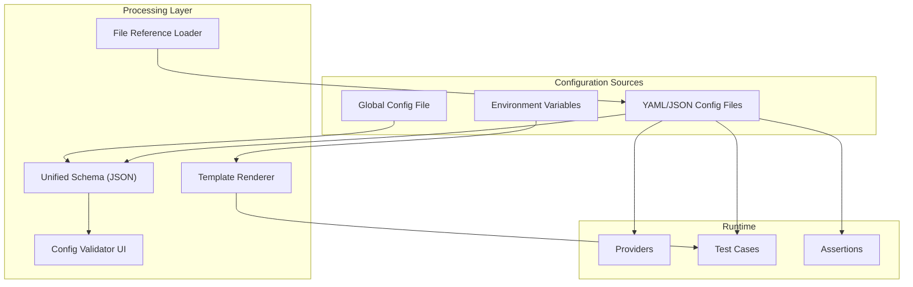
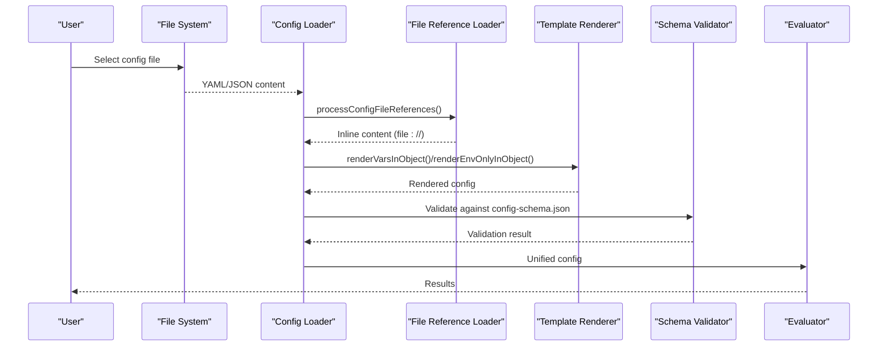
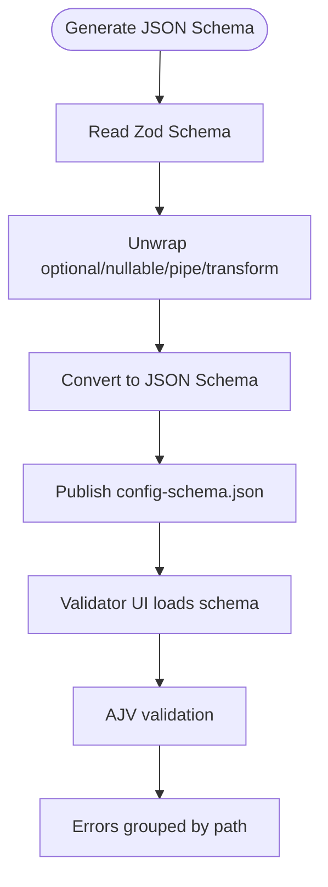
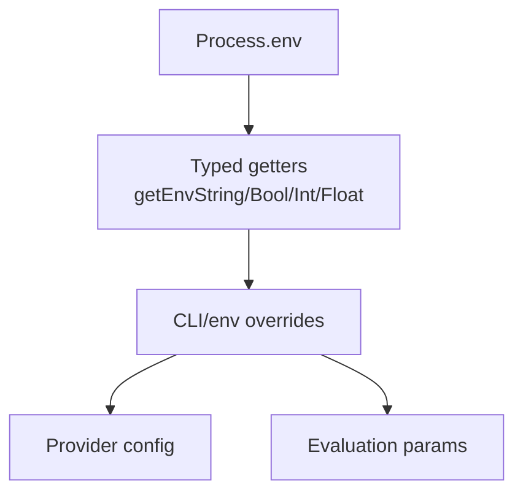
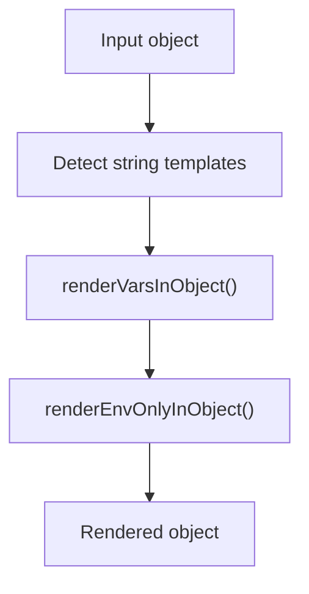
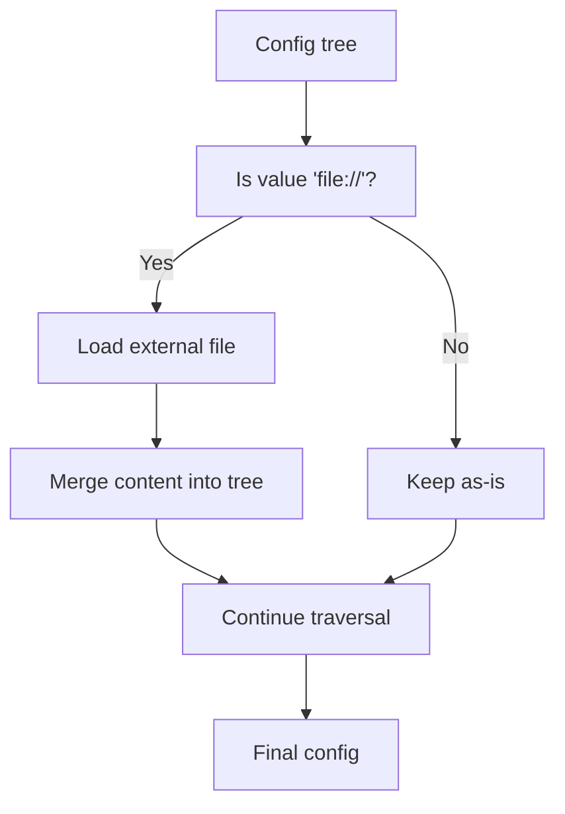
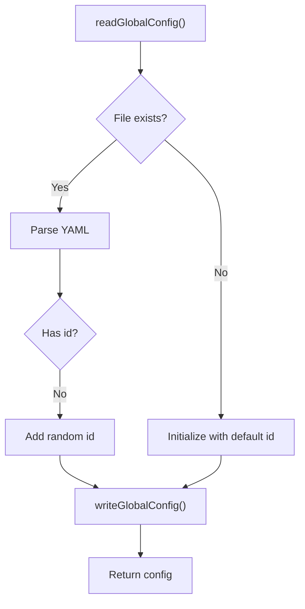
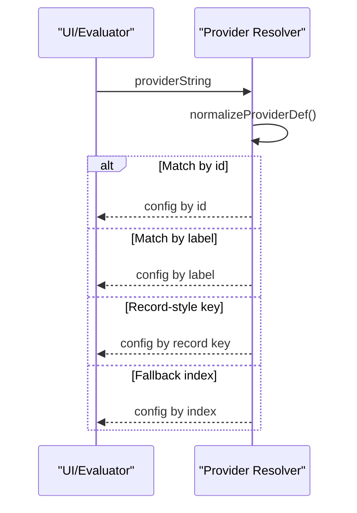
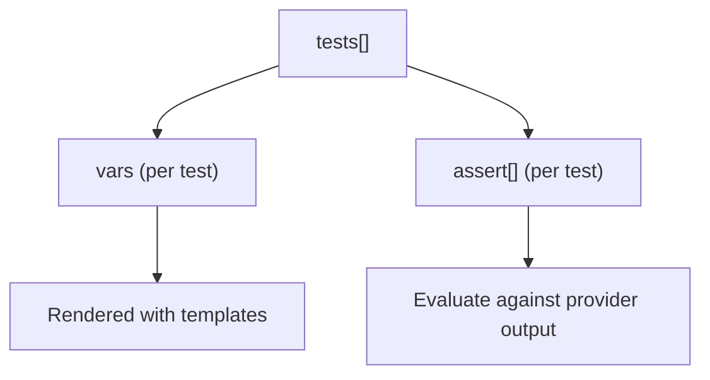
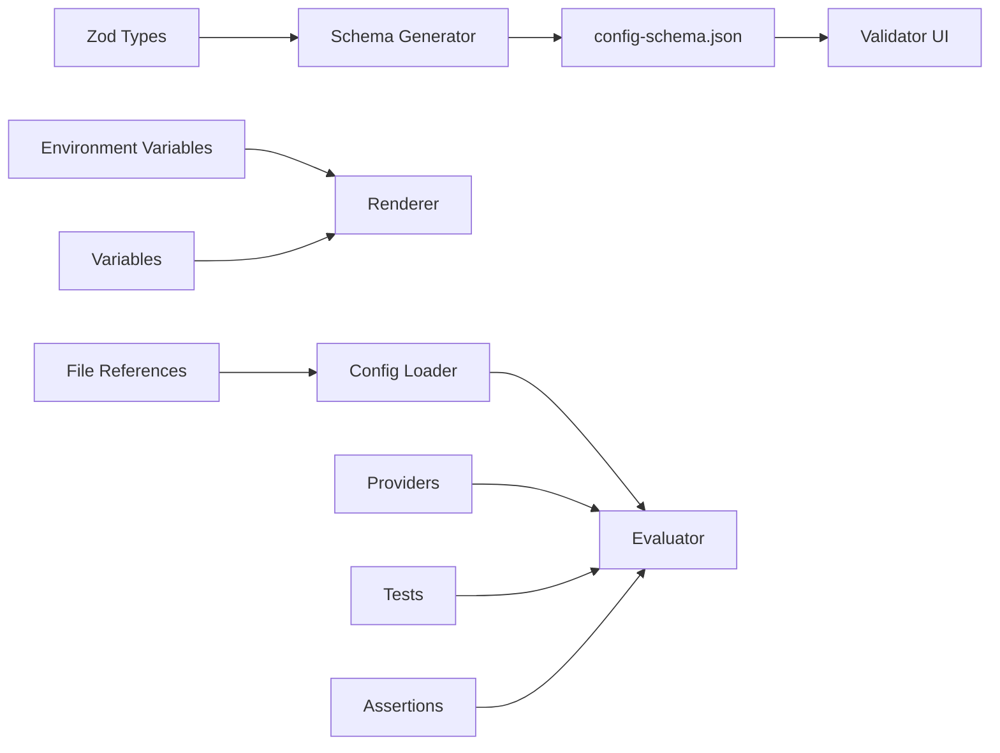

# Configuration Management

<cite>
**Referenced Files in This Document**
- [configTypes.ts](file://src/configTypes.ts)
- [globalConfig.ts](file://src/globalConfig/globalConfig.ts)
- [envars.ts](file://src/envars.ts)
- [fileReference.ts](file://src/util/fileReference.ts)
- [render.ts](file://src/util/render.ts)
- [generateJsonSchema.ts](file://scripts/generateJsonSchema.ts)
- [config-schema.json](file://site/static/config-schema.json)
- [validator.tsx](file://site/src/pages/validator.tsx)
- [promptfooconfig.yaml (getting started)](file://examples/getting-started/promptfooconfig.yaml)
- [promptfooconfig.yaml (Amazon Bedrock)](file://examples/amazon-bedrock/promptfooconfig.yaml)
- [providerConfig.ts](file://src/app/src/pages/eval/components/providerConfig.ts)
- [config-schema.test.ts](file://test/config-schema.test.ts)
- [file.test.ts](file://test/util/file.test.ts)
- [render.test.ts](file://test/util/render.test.ts)
</cite>

## Table of Contents
1. [Introduction](#introduction)
2. [Project Structure](#project-structure)
3. [Core Components](#core-components)
4. [Architecture Overview](#architecture-overview)
5. [Detailed Component Analysis](#detailed-component-analysis)
6. [Dependency Analysis](#dependency-analysis)
7. [Performance Considerations](#performance-considerations)
8. [Troubleshooting Guide](#troubleshooting-guide)
9. [Conclusion](#conclusion)
10. [Appendices](#appendices)

## Introduction
This document explains how PromptFoo manages configuration across YAML/JSON files, environment variables, and runtime overrides. It covers the unified configuration schema, variable substitution, provider configuration, test case and dataset management, assertion specification, evaluation parameters, validation, error handling, and best practices for organizing and securing configurations.

## Project Structure
PromptFoo’s configuration system centers on:
- A unified configuration schema generated from Zod types and exposed as JSON Schema
- A validator page that validates user configurations against the schema
- Environment variable integration and typed helpers
- Template rendering for variable expansion
- File reference resolution for modular and externalized content
- Global configuration persistence for user identity and cloud settings

**Diagram sources**
- [generateJsonSchema.ts:1-105](file://scripts/generateJsonSchema.ts#L1-L105)
- [config-schema.json](file://site/static/config-schema.json)
- [validator.tsx:44-153](file://site/src/pages/validator.tsx#L44-L153)
- [render.ts:86-130](file://src/util/render.ts#L86-L130)
- [fileReference.ts:34-103](file://src/util/fileReference.ts#L34-L103)
- [globalConfig.ts:13-62](file://src/globalConfig/globalConfig.ts#L13-L62)

**Section sources**
- [generateJsonSchema.ts:1-105](file://scripts/generateJsonSchema.ts#L1-L105)
- [validator.tsx:44-153](file://site/src/pages/validator.tsx#L44-L153)
- [config-schema.json](file://site/static/config-schema.json)
- [render.ts:86-130](file://src/util/render.ts#L86-L130)
- [fileReference.ts:34-103](file://src/util/fileReference.ts#L34-L103)
- [globalConfig.ts:13-62](file://src/globalConfig/globalConfig.ts#L13-L62)

## Core Components
- Unified configuration schema: Generated from Zod types and published as JSON Schema for validation and editor tooling.
- Environment variable integration: Typed helpers to read booleans, integers, floats, and provider-specific keys.
- Template rendering: Renders Nunjucks templates in configuration values using variables and environment context.
- File reference loader: Resolves file:// references to inline content for modular and externalized datasets.
- Global configuration: Stores persistent user identity and cloud settings.

**Section sources**
- [generateJsonSchema.ts:1-105](file://scripts/generateJsonSchema.ts#L1-L105)
- [envars.ts:1-568](file://src/envars.ts#L1-L568)
- [render.ts:86-130](file://src/util/render.ts#L86-L130)
- [fileReference.ts:34-103](file://src/util/fileReference.ts#L34-L103)
- [globalConfig.ts:13-62](file://src/globalConfig/globalConfig.ts#L13-L62)

## Architecture Overview
The configuration lifecycle:
1. Load YAML/JSON config (supports file:// references).
2. Resolve file:// references to inline content.
3. Render templates using variables and environment context.
4. Validate against the unified JSON schema.
5. Apply environment variable overrides and provider-specific settings.
6. Execute evaluations with providers, test cases, and assertions.

**Diagram sources**
- [fileReference.ts:70-103](file://src/util/fileReference.ts#L70-L103)
- [render.ts:86-130](file://src/util/render.ts#L86-L130)
- [validator.tsx:44-153](file://site/src/pages/validator.tsx#L44-L153)
- [config-schema.json](file://site/static/config-schema.json)

## Detailed Component Analysis

### Unified Configuration Schema
- The schema is generated from Zod types and exported as JSON Schema with definitions.
- The validator UI loads the schema and validates user input (YAML or JSON) using AJV.
- The schema supports file:// patterns and is tested for correctness and size.

**Diagram sources**
- [generateJsonSchema.ts:1-105](file://scripts/generateJsonSchema.ts#L1-L105)
- [validator.tsx:44-153](file://site/src/pages/validator.tsx#L44-L153)
- [config-schema.json](file://site/static/config-schema.json)

**Section sources**
- [generateJsonSchema.ts:1-105](file://scripts/generateJsonSchema.ts#L1-L105)
- [validator.tsx:44-153](file://site/src/pages/validator.tsx#L44-L153)
- [config-schema.test.ts:190-233](file://test/config-schema.test.ts#L190-L233)

### Environment Variables and Overrides
- Typed helpers read environment variables with defaults and type conversion.
- Provider-specific environment variables are supported (e.g., OPENAI_API_KEY, ANTHROPIC_API_KEY).
- CI detection and non-interactive environment checks are available.

**Diagram sources**
- [envars.ts:1-568](file://src/envars.ts#L1-L568)

**Section sources**
- [envars.ts:1-568](file://src/envars.ts#L1-L568)

### Variable Substitution and Template Rendering
- Templates are rendered using Nunjucks for variable expansion.
- Environment-only rendering selectively replaces env templates while preserving others.
- Tests demonstrate nested objects, arrays, and mixed structures.

**Diagram sources**
- [render.ts:86-130](file://src/util/render.ts#L86-L130)
- [render.test.ts:317-360](file://test/util/render.test.ts#L317-L360)

**Section sources**
- [render.ts:86-130](file://src/util/render.ts#L86-L130)
- [render.test.ts:317-360](file://test/util/render.test.ts#L317-L360)

### File References and Modular Configurations
- file:// protocol resolves external files into the configuration tree.
- Supports nested structures, arrays, and preserves primitives.
- Tests cover edge cases and large nested structures.

**Diagram sources**
- [fileReference.ts:34-103](file://src/util/fileReference.ts#L34-L103)
- [file.test.ts:406-575](file://test/util/file.test.ts#L406-L575)

**Section sources**
- [fileReference.ts:34-103](file://src/util/fileReference.ts#L34-L103)
- [file.test.ts:406-575](file://test/util/file.test.ts#L406-L575)

### Global Configuration Persistence
- Global config persists user identity and cloud settings.
- Reads, writes, and partial updates are supported.

**Diagram sources**
- [globalConfig.ts:13-62](file://src/globalConfig/globalConfig.ts#L13-L62)
- [configTypes.ts:1-28](file://src/configTypes.ts#L1-L28)

**Section sources**
- [globalConfig.ts:13-62](file://src/globalConfig/globalConfig.ts#L13-L62)
- [configTypes.ts:1-28](file://src/configTypes.ts#L1-L28)

### Provider Configuration Resolution
- Providers can be specified by id, label, or record-style keys.
- Supports merging provider-level config with top-level overrides.

**Diagram sources**
- [providerConfig.ts:110-192](file://src/app/src/pages/eval/components/providerConfig.ts#L110-L192)

**Section sources**
- [providerConfig.ts:110-192](file://src/app/src/pages/eval/components/providerConfig.ts#L110-L192)

### Test Case Definition and Dataset Management
- Test cases define variables and assertions.
- Datasets can be externalized and referenced via file://.
- Examples demonstrate minimal and multi-model configurations.

**Diagram sources**
- [promptfooconfig.yaml (getting started):17-30](file://examples/getting-started/promptfooconfig.yaml#L17-L30)
- [promptfooconfig.yaml (Amazon Bedrock):34-129](file://examples/amazon-bedrock/promptfooconfig.yaml#L34-L129)

**Section sources**
- [promptfooconfig.yaml (getting started):17-30](file://examples/getting-started/promptfooconfig.yaml#L17-L30)
- [promptfooconfig.yaml (Amazon Bedrock):34-129](file://examples/amazon-bedrock/promptfooconfig.yaml#L34-L129)

### Assertion Specification and Evaluation Parameters
- Assertions are evaluated per test case.
- Embedding provider overrides and evaluation options are configurable.
- Example shows embedding provider selection for similarity assertions.

**Section sources**
- [promptfooconfig.yaml (Amazon Bedrock):25-33](file://examples/amazon-bedrock/promptfooconfig.yaml#L25-L33)

## Dependency Analysis
- Schema generation depends on Zod types and produces a JSON Schema consumed by the validator UI.
- The validator UI depends on the published schema file.
- Rendering depends on environment variables and variable context.
- File reference loading depends on filesystem access and module execution for JS/Python.
- Provider resolution depends on normalized provider definitions and matching logic.

**Diagram sources**
- [generateJsonSchema.ts:1-105](file://scripts/generateJsonSchema.ts#L1-L105)
- [validator.tsx:44-153](file://site/src/pages/validator.tsx#L44-L153)
- [render.ts:86-130](file://src/util/render.ts#L86-L130)
- [fileReference.ts:34-103](file://src/util/fileReference.ts#L34-L103)

**Section sources**
- [generateJsonSchema.ts:1-105](file://scripts/generateJsonSchema.ts#L1-L105)
- [validator.tsx:44-153](file://site/src/pages/validator.tsx#L44-L153)
- [render.ts:86-130](file://src/util/render.ts#L86-L130)
- [fileReference.ts:34-103](file://src/util/fileReference.ts#L34-L103)

## Performance Considerations
- Prefer file:// references for large datasets to keep YAML/JSON compact.
- Limit template complexity to reduce rendering overhead.
- Use environment variable overrides sparingly to avoid repeated re-renders.
- Keep the schema size manageable; the generator ensures reasonable size.

## Troubleshooting Guide
- Validation errors: Use the validator UI to identify the deepest errors per path and fix accordingly.
- Template rendering failures: Check for missing environment variables or invalid filters; rendering preserves unmatched templates for later resolution.
- File reference issues: Ensure file:// paths are correct and accessible; the loader logs debug messages on failure.
- Provider resolution: Confirm provider ids/labels match normalized definitions; fallback index matching is supported for backward compatibility.

**Section sources**
- [validator.tsx:44-153](file://site/src/pages/validator.tsx#L44-L153)
- [render.ts:86-130](file://src/util/render.ts#L86-L130)
- [fileReference.ts:34-103](file://src/util/fileReference.ts#L34-L103)
- [providerConfig.ts:110-192](file://src/app/src/pages/eval/components/providerConfig.ts#L110-L192)

## Conclusion
PromptFoo’s configuration system combines a robust unified schema, flexible environment variable integration, powerful template rendering, and modular file references. By following the best practices below, teams can maintain clean, secure, and scalable configurations across diverse evaluation scenarios.

## Appendices

### Configuration Syntax and Schema Reference
- The unified schema defines top-level keys such as description, prompts, providers, tests, defaultTest, and evaluation options.
- The schema is published at the static path and consumed by the validator UI.
- The schema generator unwraps Zod transformations to produce a stable JSON Schema.

**Section sources**
- [generateJsonSchema.ts:1-105](file://scripts/generateJsonSchema.ts#L1-L105)
- [config-schema.json](file://site/static/config-schema.json)

### Variable Substitution and Environment Integration
- Use environment variables for secrets and environment-specific values.
- Use variable substitution for dynamic prompts and assertions.
- Provider-specific environment variables are supported.

**Section sources**
- [envars.ts:1-568](file://src/envars.ts#L1-L568)
- [render.ts:86-130](file://src/util/render.ts#L86-L130)

### Configuration Inheritance and Overrides
- defaultTest allows setting global evaluation options and embedding provider overrides.
- Providers can be configured with id, label, or record-style keys; merging applies provider-level overrides.

**Section sources**
- [promptfooconfig.yaml (Amazon Bedrock):25-33](file://examples/amazon-bedrock/promptfooconfig.yaml#L25-L33)
- [providerConfig.ts:110-192](file://src/app/src/pages/eval/components/providerConfig.ts#L110-L192)

### Test Case and Dataset Management
- Define test cases with vars and assert blocks.
- Externalize datasets using file:// references for CSV, JSON, or text files.

**Section sources**
- [promptfooconfig.yaml (getting started):17-30](file://examples/getting-started/promptfooconfig.yaml#L17-L30)
- [fileReference.ts:34-103](file://src/util/fileReference.ts#L34-L103)

### Provider Configuration Patterns
- Configure providers by id, label, or record-style keys.
- Use provider-specific config blocks for region, temperature, tokens, and other parameters.

**Section sources**
- [promptfooconfig.yaml (Amazon Bedrock):7-23](file://examples/amazon-bedrock/promptfooconfig.yaml#L7-L23)
- [providerConfig.ts:110-192](file://src/app/src/pages/eval/components/providerConfig.ts#L110-L192)

### Security and Secret Management
- Avoid committing secrets to source control; use environment variables or encrypted vaults.
- Use environment variable overrides for sensitive keys.
- Restrict file:// access to trusted locations.

**Section sources**
- [promptfooconfig.yaml (getting started):3-7](file://examples/getting-started/promptfooconfig.yaml#L3-L7)
- [envars.ts:1-568](file://src/envars.ts#L1-L568)

### Best Practices
- Modularize: Split large configs into smaller files and use file:// references.
- Validate early: Use the validator UI to catch schema errors before running evaluations.
- Template carefully: Keep templates readable and avoid excessive nesting.
- Secure defaults: Use environment variables for secrets; keep local overrides minimal.
- Organize providers: Use labels for readability and id for deterministic selection.