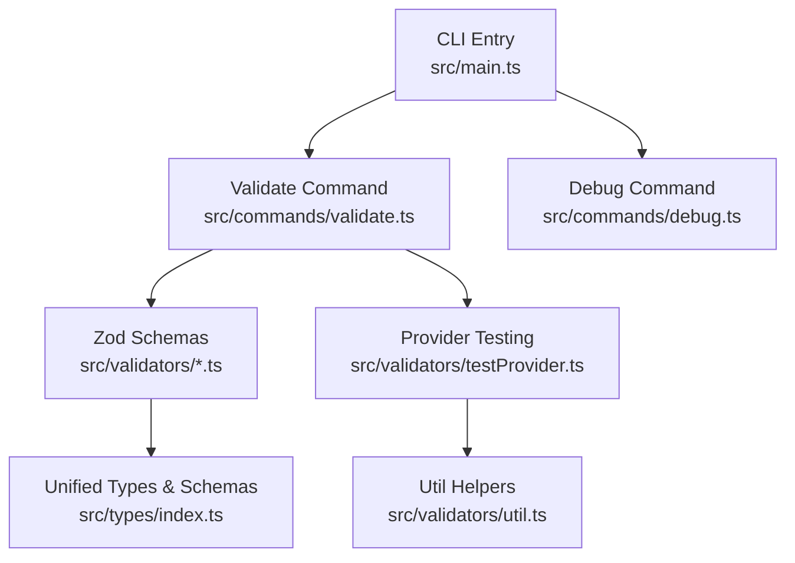
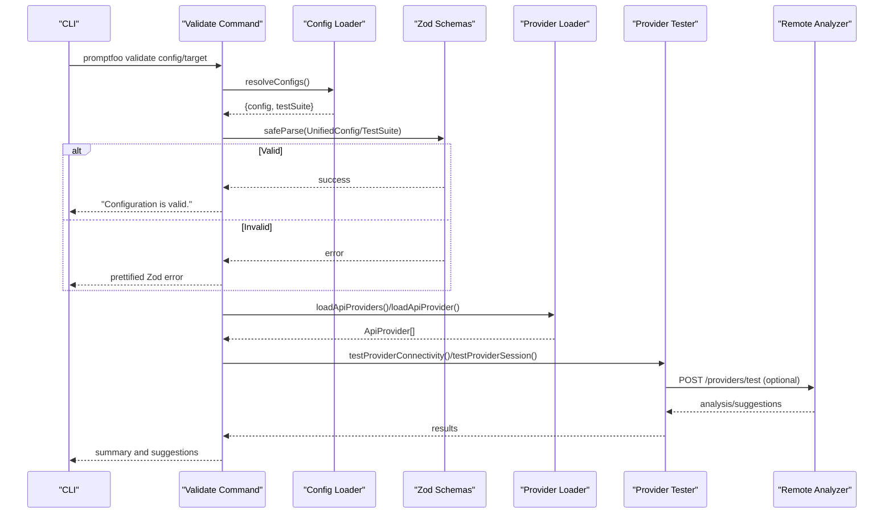
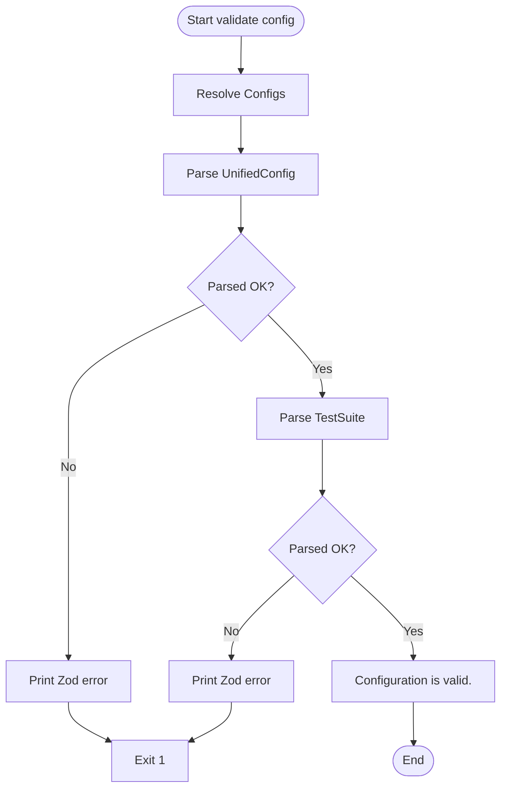
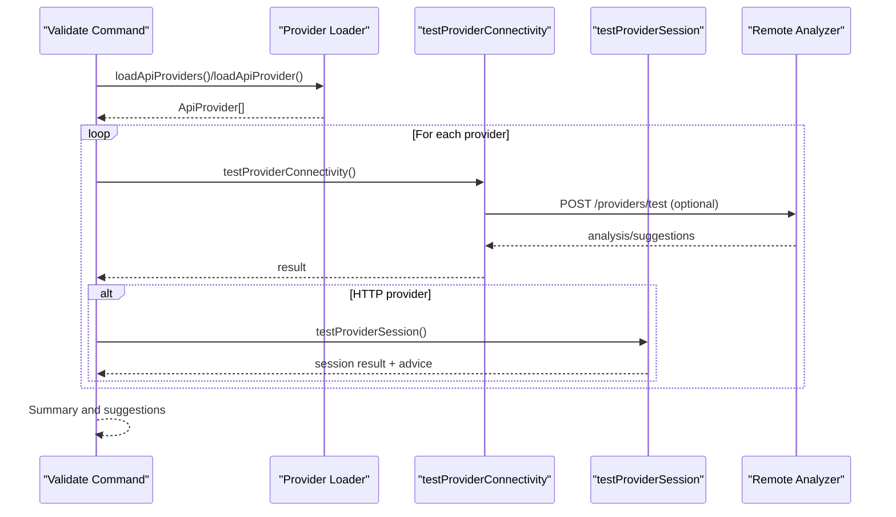
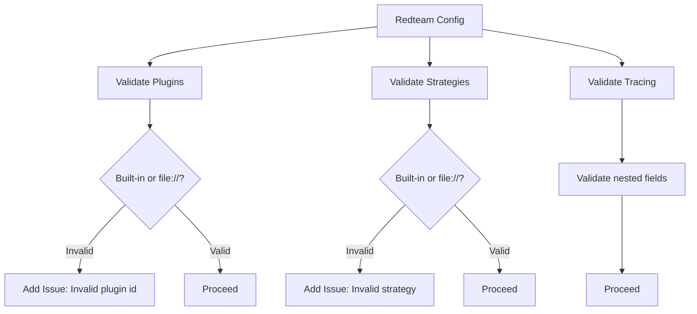
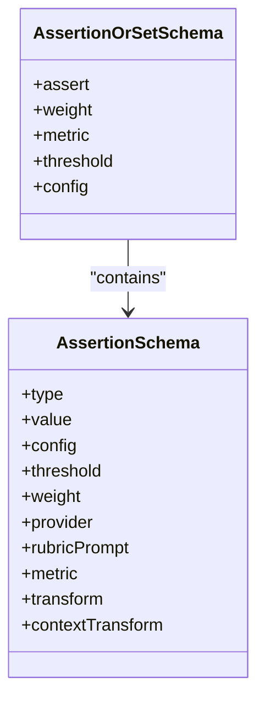
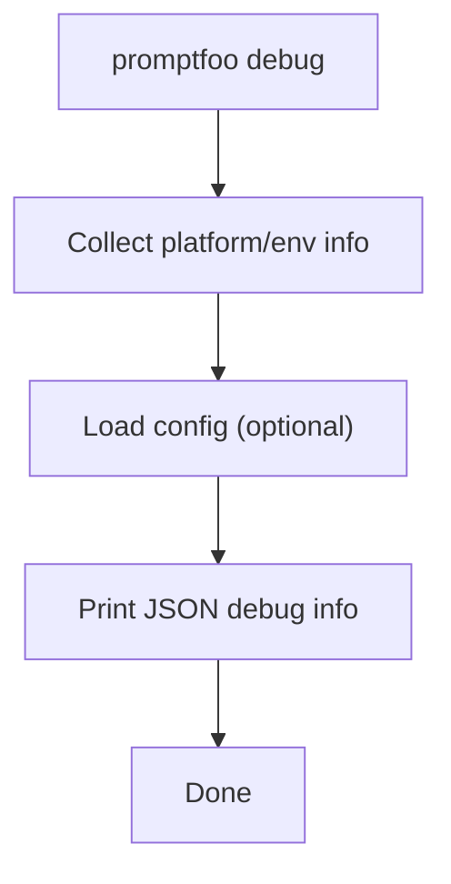
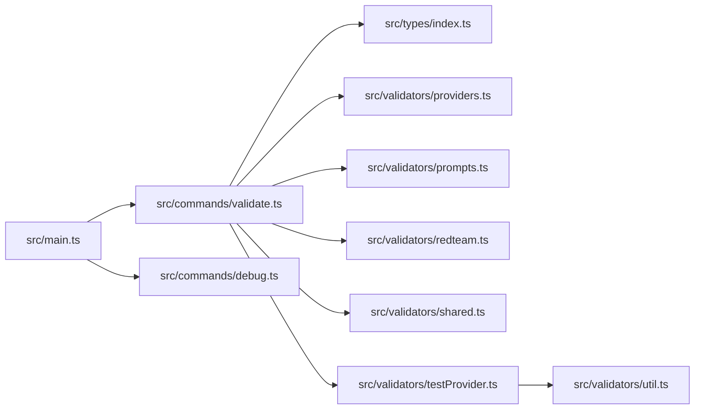

# Configuration Validation & Debugging

<cite>
**Referenced Files in This Document**
- [src/main.ts](file://src/main.ts)
- [src/commands/validate.ts](file://src/commands/validate.ts)
- [src/commands/debug.ts](file://src/commands/debug.ts)
- [src/validators/providers.ts](file://src/validators/providers.ts)
- [src/validators/prompts.ts](file://src/validators/prompts.ts)
- [src/validators/redteam.ts](file://src/validators/redteam.ts)
- [src/validators/shared.ts](file://src/validators/shared.ts)
- [src/validators/testProvider.ts](file://src/validators/testProvider.ts)
- [src/validators/util.ts](file://src/validators/util.ts)
- [src/types/index.ts](file://src/types/index.ts)
</cite>

## Table of Contents
1. [Introduction](#introduction)
2. [Project Structure](#project-structure)
3. [Core Components](#core-components)
4. [Architecture Overview](#architecture-overview)
5. [Detailed Component Analysis](#detailed-component-analysis)
6. [Dependency Analysis](#dependency-analysis)
7. [Performance Considerations](#performance-considerations)
8. [Troubleshooting Guide](#troubleshooting-guide)
9. [Conclusion](#conclusion)

## Introduction
This document explains how PromptFoo validates configurations and providers, and how to debug issues effectively. It covers:
- The validation pipeline: schema validation, provider validation, and assertion validation
- Built-in configuration validator and the web-based validation interface
- Common validation errors (missing providers, invalid assertions, malformed YAML/JSON)
- Debugging techniques for complex configurations, performance, and security
- Examples of validation failures and their solutions
- Performance optimization and batch validation for large configurations

## Project Structure
PromptFoo’s validation and debugging capabilities are implemented across several modules:
- CLI entry and command wiring: [src/main.ts](file://src/main.ts)
- Configuration validation and provider testing: [src/commands/validate.ts](file://src/commands/validate.ts)
- Debug information gathering: [src/commands/debug.ts](file://src/commands/debug.ts)
- Zod schemas for validation: [src/validators/providers.ts](file://src/validators/providers.ts), [src/validators/prompts.ts](file://src/validators/prompts.ts), [src/validators/redteam.ts](file://src/validators/redteam.ts), [src/validators/shared.ts](file://src/validators/shared.ts)
- Provider connectivity and session testing: [src/validators/testProvider.ts](file://src/validators/testProvider.ts)
- Utility helpers for session and request formatting: [src/validators/util.ts](file://src/validators/util.ts)
- Unified type and schema exports: [src/types/index.ts](file://src/types/index.ts)

**Diagram sources**
- [src/main.ts:198-256](file://src/main.ts#L198-L256)
- [src/commands/validate.ts:494-525](file://src/commands/validate.ts#L494-L525)
- [src/commands/debug.ts:78-89](file://src/commands/debug.ts#L78-L89)
- [src/validators/providers.ts:1-93](file://src/validators/providers.ts#L1-L93)
- [src/validators/testProvider.ts:1-736](file://src/validators/testProvider.ts#L1-L736)
- [src/validators/util.ts:1-123](file://src/validators/util.ts#L1-L123)
- [src/types/index.ts:1-800](file://src/types/index.ts#L1-L800)

**Section sources**
- [src/main.ts:198-256](file://src/main.ts#L198-L256)
- [src/commands/validate.ts:494-525](file://src/commands/validate.ts#L494-L525)
- [src/commands/debug.ts:78-89](file://src/commands/debug.ts#L78-L89)
- [src/validators/providers.ts:1-93](file://src/validators/providers.ts#L1-L93)
- [src/validators/prompts.ts:1-34](file://src/validators/prompts.ts#L1-L34)
- [src/validators/redteam.ts:1-573](file://src/validators/redteam.ts#L1-L573)
- [src/validators/shared.ts:1-7](file://src/validators/shared.ts#L1-L7)
- [src/validators/testProvider.ts:1-736](file://src/validators/testProvider.ts#L1-L736)
- [src/validators/util.ts:1-123](file://src/validators/util.ts#L1-L123)
- [src/types/index.ts:1-800](file://src/types/index.ts#L1-L800)

## Core Components
- Configuration validation: Uses Zod schemas to validate UnifiedConfig and TestSuite structures. On success, prints “Configuration is valid.”; otherwise, prints prettified Zod errors and exits with a non-zero code.
- Provider validation: Loads providers (single target or all from config), performs connectivity tests for HTTP providers, and session tests for stateful providers. Results include suggestions from remote analysis when available.
- Debug command: Collects environment, proxy, TLS, telemetry flags, and optionally resolves and prints the loaded configuration for troubleshooting.
- Schemas: Define allowed shapes for providers, prompts, redteam configuration, and shared structures. They enforce correctness and provide helpful error messages.

**Section sources**
- [src/commands/validate.ts:407-441](file://src/commands/validate.ts#L407-L441)
- [src/commands/validate.ts:349-405](file://src/commands/validate.ts#L349-L405)
- [src/commands/debug.ts:20-76](file://src/commands/debug.ts#L20-L76)
- [src/validators/providers.ts:14-93](file://src/validators/providers.ts#L14-L93)
- [src/validators/prompts.ts:5-34](file://src/validators/prompts.ts#L5-L34)
- [src/validators/redteam.ts:250-329](file://src/validators/redteam.ts#L250-L329)
- [src/validators/shared.ts:3-7](file://src/validators/shared.ts#L3-L7)

## Architecture Overview
The validation and debugging pipeline integrates CLI commands, Zod schemas, provider loaders, and remote analysis.

**Diagram sources**
- [src/commands/validate.ts:407-441](file://src/commands/validate.ts#L407-L441)
- [src/commands/validate.ts:349-405](file://src/commands/validate.ts#L349-L405)
- [src/validators/testProvider.ts:61-234](file://src/validators/testProvider.ts#L61-L234)
- [src/validators/testProvider.ts:427-736](file://src/validators/testProvider.ts#L427-L736)

## Detailed Component Analysis

### Configuration Validation Pipeline
- UnifiedConfig and TestSuite validation: The validate command parses the resolved configuration and test suite using Zod. On failure, it prints a prettified error and exits non-zero.
- Error handling: Errors are surfaced with clear context (e.g., config file path) and exit code is set appropriately.

**Diagram sources**
- [src/commands/validate.ts:407-441](file://src/commands/validate.ts#L407-L441)

**Section sources**
- [src/commands/validate.ts:407-441](file://src/commands/validate.ts#L407-L441)

### Provider Validation and Testing
- Connectivity test: Runs a minimal prompt through the provider and captures output/error. For HTTP providers, a detailed session test is also performed.
- Session test: Validates multi-turn behavior by sending two requests and using a rubric to determine if the provider remembers context. Provides troubleshooting advice for server/client sessions.
- Suggestions: When remote analysis is enabled, suggestions and reasons for changes are included in the result.

**Diagram sources**
- [src/commands/validate.ts:349-405](file://src/commands/validate.ts#L349-L405)
- [src/validators/testProvider.ts:61-234](file://src/validators/testProvider.ts#L61-L234)
- [src/validators/testProvider.ts:427-736](file://src/validators/testProvider.ts#L427-L736)

**Section sources**
- [src/commands/validate.ts:349-405](file://src/commands/validate.ts#L349-L405)
- [src/validators/testProvider.ts:61-234](file://src/validators/testProvider.ts#L61-L234)
- [src/validators/testProvider.ts:427-736](file://src/validators/testProvider.ts#L427-L736)

### Red Team Configuration Validation
- RedteamConfigSchema enforces plugin, strategy, and tracing structures. It includes:
  - Plugin validation with built-in and custom plugin paths
  - Strategy validation with built-in and custom strategy paths
  - Tracing configuration with nested defaults
- Transformations normalize collections and aliases into a canonical form.

**Diagram sources**
- [src/validators/redteam.ts:86-190](file://src/validators/redteam.ts#L86-L190)
- [src/validators/redteam.ts:250-329](file://src/validators/redteam.ts#L250-L329)

**Section sources**
- [src/validators/redteam.ts:86-190](file://src/validators/redteam.ts#L86-L190)
- [src/validators/redteam.ts:250-329](file://src/validators/redteam.ts#L250-L329)

### Assertion Validation
- Assertions are validated using AssertionSchema and AssertionOrSetSchema. These schemas define supported assertion types, thresholds, weights, and optional provider/rubric overrides.
- Special assertion types (e.g., select-best, human, max-score) are supported alongside base assertion types.

**Diagram sources**
- [src/types/index.ts:621-661](file://src/types/index.ts#L621-L661)

**Section sources**
- [src/types/index.ts:621-661](file://src/types/index.ts#L621-L661)

### Debugging Utilities
- The debug command collects OS/platform, environment variables (proxy/TLS/telemetry), and optionally loads and prints the resolved configuration for easy sharing when filing issues.

**Diagram sources**
- [src/commands/debug.ts:20-76](file://src/commands/debug.ts#L20-L76)

**Section sources**
- [src/commands/debug.ts:20-76](file://src/commands/debug.ts#L20-L76)

## Dependency Analysis
- CLI wiring: The main entry wires validate and debug commands into the CLI program.
- Validation depends on Zod schemas exported from validators and unified in types/index.ts.
- Provider testing depends on provider loader utilities and remote analysis endpoints.
- Session testing depends on util helpers for formatting and validation.

**Diagram sources**
- [src/main.ts:198-256](file://src/main.ts#L198-L256)
- [src/commands/validate.ts:494-525](file://src/commands/validate.ts#L494-L525)
- [src/commands/debug.ts:78-89](file://src/commands/debug.ts#L78-L89)
- [src/types/index.ts:1-800](file://src/types/index.ts#L1-L800)
- [src/validators/providers.ts:1-93](file://src/validators/providers.ts#L1-L93)
- [src/validators/prompts.ts:1-34](file://src/validators/prompts.ts#L1-L34)
- [src/validators/redteam.ts:1-573](file://src/validators/redteam.ts#L1-L573)
- [src/validators/shared.ts:1-7](file://src/validators/shared.ts#L1-L7)
- [src/validators/testProvider.ts:1-736](file://src/validators/testProvider.ts#L1-L736)
- [src/validators/util.ts:1-123](file://src/validators/util.ts#L1-L123)

**Section sources**
- [src/main.ts:198-256](file://src/main.ts#L198-L256)
- [src/commands/validate.ts:494-525](file://src/commands/validate.ts#L494-L525)
- [src/commands/debug.ts:78-89](file://src/commands/debug.ts#L78-L89)
- [src/types/index.ts:1-800](file://src/types/index.ts#L1-L800)
- [src/validators/providers.ts:1-93](file://src/validators/providers.ts#L1-L93)
- [src/validators/prompts.ts:1-34](file://src/validators/prompts.ts#L1-L34)
- [src/validators/redteam.ts:1-573](file://src/validators/redteam.ts#L1-L573)
- [src/validators/shared.ts:1-7](file://src/validators/shared.ts#L1-L7)
- [src/validators/testProvider.ts:1-736](file://src/validators/testProvider.ts#L1-L736)
- [src/validators/util.ts:1-123](file://src/validators/util.ts#L1-L123)

## Performance Considerations
- Concurrency and timeouts: Evaluation options include maxConcurrency and timeoutMs to bound resource usage. Use these to prevent long-running or runaway evaluations.
- Silent mode: Provider validation uses a silent evaluation mode to reduce noise.
- Batch validation: Validate all providers in a configuration by specifying a config path to the validate target subcommand. This enables batch-style testing without manual iteration.

[No sources needed since this section provides general guidance]

## Troubleshooting Guide

### Common Validation Errors and Fixes
- Missing providers
  - Symptom: “No providers found in configuration” when running provider validation.
  - Fix: Add providers to the configuration or specify a target provider ID.
  - Section sources
    - [src/commands/validate.ts:251-256](file://src/commands/validate.ts#L251-L256)

- Invalid provider configuration
  - Symptom: Provider test fails with an error or suggests changes.
  - Fix: Review provider options and environment overrides; leverage suggestions printed by the validator.
  - Section sources
    - [src/commands/validate.ts:78-147](file://src/commands/validate.ts#L78-L147)
    - [src/validators/testProvider.ts:184-204](file://src/validators/testProvider.ts#L184-L204)

- Malformed YAML/JSON
  - Symptom: Zod parsing errors for UnifiedConfig or TestSuite.
  - Fix: Use the validate command to surface prettified errors; fix field types and required keys.
  - Section sources
    - [src/commands/validate.ts:420-435](file://src/commands/validate.ts#L420-L435)

- Session configuration issues
  - Symptom: Session test fails or warns about missing {{sessionId}}.
  - Fix: Ensure {{sessionId}} is present in headers/body; configure sessionParser for server-side sessions; follow troubleshooting advice printed by the session test.
  - Section sources
    - [src/validators/util.ts:70-105](file://src/validators/util.ts#L70-L105)
    - [src/validators/testProvider.ts:337-420](file://src/validators/testProvider.ts#L337-L420)
    - [src/validators/testProvider.ts:697-721](file://src/validators/testProvider.ts#L697-L721)

- Red team configuration errors
  - Symptom: Invalid plugin or strategy identifiers.
  - Fix: Use built-in plugin/strategy names or file:// paths; ensure proper structure for collections and aliases.
  - Section sources
    - [src/validators/redteam.ts:86-190](file://src/validators/redteam.ts#L86-L190)
    - [src/validators/redteam.ts:250-329](file://src/validators/redteam.ts#L250-L329)

### Step-by-Step Troubleshooting
- Step 1: Validate configuration
  - Run: promptfoo validate config
  - Action: Fix reported schema errors; re-run until “Configuration is valid.”
  - Section sources
    - [src/commands/validate.ts:407-441](file://src/commands/validate.ts#L407-L441)

- Step 2: Test providers
  - Run: promptfoo validate target -t <provider-id> or -c <config-path>
  - Action: Review connectivity/session results and suggestions; adjust provider config accordingly.
  - Section sources
    - [src/commands/validate.ts:446-492](file://src/commands/validate.ts#L446-L492)
    - [src/validators/testProvider.ts:61-234](file://src/validators/testProvider.ts#L61-L234)
    - [src/validators/testProvider.ts:427-736](file://src/validators/testProvider.ts#L427-L736)

- Step 3: Gather debug info
  - Run: promptfoo debug -c <config-path>
  - Action: Share the printed JSON with maintainers for faster diagnosis.
  - Section sources
    - [src/commands/debug.ts:20-76](file://src/commands/debug.ts#L20-L76)

### Security and Proxy Considerations
- Environment variables affecting connectivity:
  - HTTP_PROXY/HTTPS_PROXY/ALL_PROXY/NO_PROXY/NODE_EXTRA_CA_CERTS/NODE_TLS_REJECT_UNAUTHORIZED
- Telemetry flags:
  - PROMPTFOO_DISABLE_TELEMETRY and PROMPTFOO_TELEMETRY_DEBUG
- Use the debug command to confirm these values and adjust as needed.

**Section sources**
- [src/commands/debug.ts:29-39](file://src/commands/debug.ts#L29-L39)

## Conclusion
PromptFoo provides robust configuration and provider validation powered by Zod schemas, plus practical provider testing and session validation. The validate and debug commands streamline troubleshooting, while suggestions and detailed summaries help resolve issues quickly. For large configurations, batch validation via the validate target subcommand accelerates diagnostics.