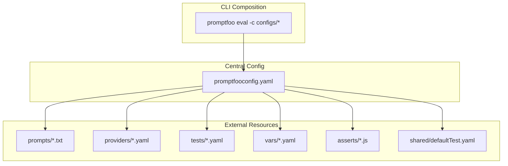
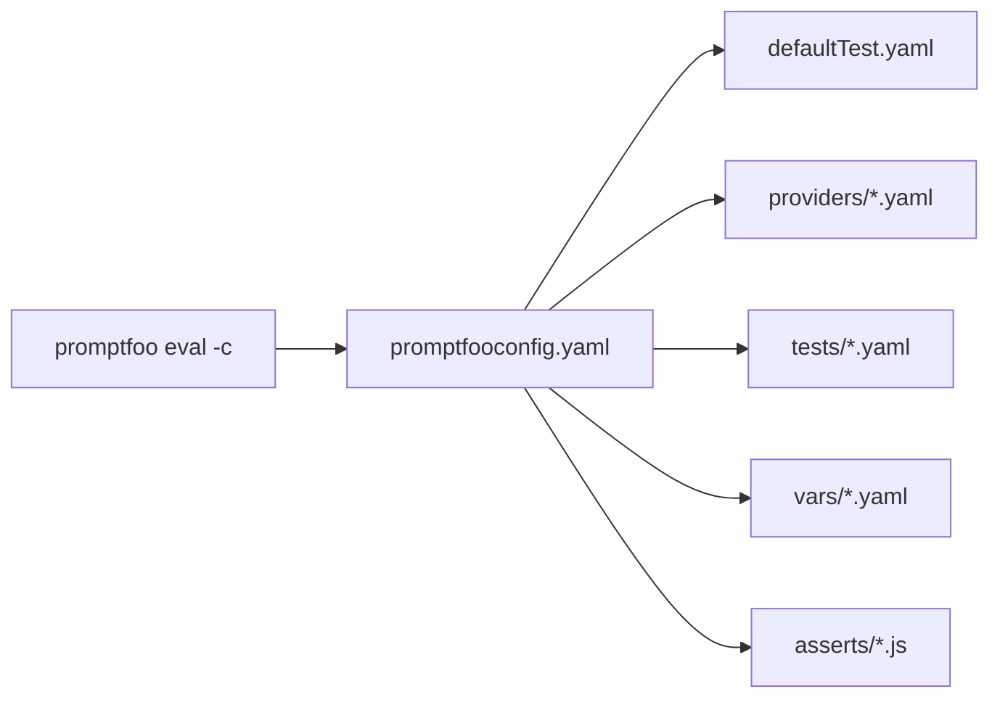

# Modular Configuration & Organization

<cite>
**Referenced Files in This Document**
- [README.md](file://README.md)
- [examples/getting-started/promptfooconfig.yaml](file://examples/getting-started/promptfooconfig.yaml)
- [examples/separate-test-configs/promptfooconfig.yaml](file://examples/separate-test-configs/promptfooconfig.yaml)
- [examples/external-defaulttest/promptfooconfig.yaml](file://examples/external-defaulttest/promptfooconfig.yaml)
- [examples/external-provider-config/promptfooconfig.yaml](file://examples/external-provider-config/promptfooconfig.yaml)
- [examples/multiple-configs/README.md](file://examples/multiple-configs/README.md)
- [examples/custom-provider/promptfooconfig.yaml](file://examples/custom-provider/promptfooconfig.yaml)
</cite>

## Table of Contents
1. [Introduction](#introduction)
2. [Project Structure](#project-structure)
3. [Core Components](#core-components)
4. [Architecture Overview](#architecture-overview)
5. [Detailed Component Analysis](#detailed-component-analysis)
6. [Dependency Analysis](#dependency-analysis)
7. [Performance Considerations](#performance-considerations)
8. [Troubleshooting Guide](#troubleshooting-guide)
9. [Conclusion](#conclusion)
10. [Appendices](#appendices)

## Introduction
This document explains modular configuration patterns and organization strategies in PromptFoo. It focuses on how to split configuration across separate files for prompts, tests, providers, and variables; how inheritance and merging work; how to integrate external datasets; how to compose configurations across environments; and how to build reusable templates and automate generation for large-scale deployments. The guidance is grounded in real configuration examples included in the repository.

## Project Structure
PromptFoo’s configuration examples demonstrate several modular approaches:
- Single-file configuration for quick starts
- Externalized default test configuration
- Externalized provider configuration
- Separate test-case files and globs
- Composition across multiple configuration files
- Custom provider integration via external files

```mermaid
graph TB
A["examples/getting-started/promptfooconfig.yaml"] --> B["Prompts"]
A --> C["Providers"]
A --> D["Tests"]
E["examples/separate-test-configs/promptfooconfig.yaml"] --> F["External defaultTest"]
E --> G["External test files (*.yaml)"]
E --> H["Vars via file://"]
I["examples/external-defaulttest/promptfooconfig.yaml"] --> J["defaultTest: file://..."]
I --> K["Tests inherit default assertions/options"]
L["examples/external-provider-config/promptfooconfig.yaml"] --> M["providers: file://*.yaml"]
L --> N["tests: inline vars"]
O["examples/multiple-configs/README.md"] --> P["Compose -c configs/*"]
O --> Q["Compose -c config1.yaml config2.yaml"]
R["examples/custom-provider/promptfooconfig.yaml"] --> S["providers.id: file://customProvider.cjs"]
R --> T["tests: file://vars.csv"]
```

**Diagram sources**
- [examples/getting-started/promptfooconfig.yaml:1-30](file://examples/getting-started/promptfooconfig.yaml#L1-L30)
- [examples/separate-test-configs/promptfooconfig.yaml:1-39](file://examples/separate-test-configs/promptfooconfig.yaml#L1-L39)
- [examples/external-defaulttest/promptfooconfig.yaml:1-54](file://examples/external-defaulttest/promptfooconfig.yaml#L1-L54)
- [examples/external-provider-config/promptfooconfig.yaml:1-16](file://examples/external-provider-config/promptfooconfig.yaml#L1-L16)
- [examples/multiple-configs/README.md:1-26](file://examples/multiple-configs/README.md#L1-L26)
- [examples/custom-provider/promptfooconfig.yaml:1-23](file://examples/custom-provider/promptfooconfig.yaml#L1-L23)

**Section sources**
- [README.md:1-97](file://README.md#L1-L97)
- [examples/getting-started/promptfooconfig.yaml:1-30](file://examples/getting-started/promptfooconfig.yaml#L1-L30)
- [examples/separate-test-configs/promptfooconfig.yaml:1-39](file://examples/separate-test-configs/promptfooconfig.yaml#L1-L39)
- [examples/external-defaulttest/promptfooconfig.yaml:1-54](file://examples/external-defaulttest/promptfooconfig.yaml#L1-L54)
- [examples/external-provider-config/promptfooconfig.yaml:1-16](file://examples/external-provider-config/promptfooconfig.yaml#L1-L16)
- [examples/multiple-configs/README.md:1-26](file://examples/multiple-configs/README.md#L1-L26)
- [examples/custom-provider/promptfooconfig.yaml:1-23](file://examples/custom-provider/promptfooconfig.yaml#L1-L23)

## Core Components
- Prompts: Defined inline or loaded from files/globs using the file:// prefix.
- Providers: Defined inline or loaded from external YAML files using the file:// prefix.
- Tests: Inline arrays of test cases, or loaded from external YAML/CSV files/globs.
- Variables: Provided inline or loaded from external files/globs.
- defaultTest: A reusable baseline for test cases, loaded from an external YAML file.

Key patterns:
- Use file:// to reference external files for prompts, providers, tests, variables, and assertions.
- Use globs (e.g., tests/*) to include multiple test files.
- Compose multiple configurations with promptfoo eval -c configs/* or -c config1.yaml config2.yaml.

**Section sources**
- [examples/getting-started/promptfooconfig.yaml:1-30](file://examples/getting-started/promptfooconfig.yaml#L1-L30)
- [examples/separate-test-configs/promptfooconfig.yaml:1-39](file://examples/separate-test-configs/promptfooconfig.yaml#L1-L39)
- [examples/external-defaulttest/promptfooconfig.yaml:1-54](file://examples/external-defaulttest/promptfooconfig.yaml#L1-L54)
- [examples/external-provider-config/promptfooconfig.yaml:1-16](file://examples/external-provider-config/promptfooconfig.yaml#L1-L16)
- [examples/multiple-configs/README.md:1-26](file://examples/multiple-configs/README.md#L1-L26)
- [examples/custom-provider/promptfooconfig.yaml:1-23](file://examples/custom-provider/promptfooconfig.yaml#L1-L23)

## Architecture Overview
The modular configuration architecture centers on composition and externalization:
- Central configuration files declare top-level sections (prompts, providers, tests, defaultTest).
- External files are referenced via file:// URIs.
- Multiple configuration files can be composed together to form a single evaluation run.

**Diagram sources**
- [examples/separate-test-configs/promptfooconfig.yaml:1-39](file://examples/separate-test-configs/promptfooconfig.yaml#L1-L39)
- [examples/external-provider-config/promptfooconfig.yaml:1-16](file://examples/external-provider-config/promptfooconfig.yaml#L1-L16)
- [examples/external-defaulttest/promptfooconfig.yaml:1-54](file://examples/external-defaulttest/promptfooconfig.yaml#L1-L54)
- [examples/multiple-configs/README.md:1-26](file://examples/multiple-configs/README.md#L1-L26)

## Detailed Component Analysis

### Prompts: Externalization and Globbing
- Inline prompts are fine for small examples.
- External prompts are loaded via file:// and support glob patterns to include multiple files.
- This enables modular prompt libraries and environment-specific prompt variants.

Best practices:
- Keep prompts in versioned files under prompts/.
- Use descriptive filenames and organize by scenario or domain.
- Combine with variables to avoid duplicating prompt text across tests.

**Section sources**
- [examples/getting-started/promptfooconfig.yaml:7-8](file://examples/getting-started/promptfooconfig.yaml#L7-L8)
- [examples/separate-test-configs/promptfooconfig.yaml:4-5](file://examples/separate-test-configs/promptfooconfig.yaml#L4-L5)

### Providers: Externalization and Reuse
- Providers can be declared inline or loaded from external YAML files using file://.
- This pattern supports reusing provider profiles across projects and environments.

Best practices:
- Define provider profiles in separate YAML files (e.g., gpt-4-mini.yaml).
- Reference them centrally to keep test configs concise.
- Override provider options per test via options when needed.

**Section sources**
- [examples/external-provider-config/promptfooconfig.yaml:4-6](file://examples/external-provider-config/promptfooconfig.yaml#L4-L6)
- [examples/external-provider-config/promptfooconfig.yaml:10-16](file://examples/external-provider-config/promptfooconfig.yaml#L10-L16)

### Tests: Modular Test Case Organization
- Tests can be defined inline or loaded from external YAML/CSV files.
- Globs enable inclusion of multiple test files.
- defaultTest allows inheriting shared assertions and options across test cases.

Recommended patterns:
- Split tests by domain or scenario into separate YAML files.
- Use defaultTest for shared assertions and options.
- Use file:// to load CSV for large datasets.

**Section sources**
- [examples/separate-test-configs/promptfooconfig.yaml:14-39](file://examples/separate-test-configs/promptfooconfig.yaml#L14-L39)
- [examples/external-defaulttest/promptfooconfig.yaml:4-5](file://examples/external-defaulttest/promptfooconfig.yaml#L4-L5)
- [examples/external-defaulttest/promptfooconfig.yaml:18-54](file://examples/external-defaulttest/promptfooconfig.yaml#L18-L54)

### Variables: Externalization and Composition
- Variables can be provided inline or loaded from external files using file://.
- This enables cross-project reuse of variable sets and environment-specific overrides.

Recommended patterns:
- Store environment-specific variables in separate files (e.g., vars/dev.yaml).
- Reference them via file:// in central configs.
- Combine with defaultTest to apply shared variables across tests.

**Section sources**
- [examples/separate-test-configs/promptfooconfig.yaml:10-12](file://examples/separate-test-configs/promptfooconfig.yaml#L10-L12)
- [examples/separate-test-configs/promptfooconfig.yaml:27-30](file://examples/separate-test-configs/promptfooconfig.yaml#L27-L30)

### Assertions: Externalization
- Assertions can be loaded from external JS files via file://.
- This is useful for complex scoring logic or reusable assertion modules.

Recommended patterns:
- Place assertion logic in asserts/ and reference via file://.
- Keep assertions deterministic and well-tested.

**Section sources**
- [examples/separate-test-configs/promptfooconfig.yaml:32-39](file://examples/separate-test-configs/promptfooconfig.yaml#L32-L39)

### Configuration Composition Across Environments
- Multiple configuration files can be composed using promptfoo eval -c configs/* or -c config1.yaml config2.yaml.
- This enables environment-specific overlays (dev, staging, prod) layered on top of a base configuration.

Recommended patterns:
- Base config: shared prompts, providers, and defaultTest.
- Environment overlays: override providers, variables, or test subsets.
- Use explicit -c ordering to control precedence (later files override earlier ones).

**Section sources**
- [examples/multiple-configs/README.md:15-25](file://examples/multiple-configs/README.md#L15-L25)

### Custom Provider Integration
- Providers can be loaded from external modules via providers.id: file://<module>.
- This enables cross-project sharing of provider implementations.

Recommended patterns:
- Package provider modules alongside configs.
- Use labels to distinguish provider instances with different configs.

**Section sources**
- [examples/custom-provider/promptfooconfig.yaml:7-11](file://examples/custom-provider/promptfooconfig.yaml#L7-L11)
- [examples/custom-provider/promptfooconfig.yaml:12-22](file://examples/custom-provider/promptfooconfig.yaml#L12-L22)

## Dependency Analysis
The modular configuration relies on a few key relationships:
- Central config depends on external resources (prompts, providers, tests, variables, assertions).
- defaultTest acts as a shared dependency for tests.
- CLI composition merges multiple configs into a single evaluation graph.

**Diagram sources**
- [examples/external-defaulttest/promptfooconfig.yaml:4-5](file://examples/external-defaulttest/promptfooconfig.yaml#L4-L5)
- [examples/external-provider-config/promptfooconfig.yaml:6-6](file://examples/external-provider-config/promptfooconfig.yaml#L6-L6)
- [examples/separate-test-configs/promptfooconfig.yaml:15-20](file://examples/separate-test-configs/promptfooconfig.yaml#L15-L20)
- [examples/multiple-configs/README.md:16-22](file://examples/multiple-configs/README.md#L16-L22)

**Section sources**
- [examples/external-defaulttest/promptfooconfig.yaml:4-5](file://examples/external-defaulttest/promptfooconfig.yaml#L4-L5)
- [examples/external-provider-config/promptfooconfig.yaml:6-6](file://examples/external-provider-config/promptfooconfig.yaml#L6-L6)
- [examples/separate-test-configs/promptfooconfig.yaml:15-20](file://examples/separate-test-configs/promptfooconfig.yaml#L15-L20)
- [examples/multiple-configs/README.md:15-25](file://examples/multiple-configs/README.md#L15-L25)

## Performance Considerations
- Prefer globs and external files to reduce duplication and improve maintainability.
- Use defaultTest to minimize repeated assertion definitions.
- Keep provider profiles consolidated to avoid redundant initialization overhead.
- For large CSV datasets, consider splitting into smaller chunks and composing via -c.

## Troubleshooting Guide
Common issues and resolutions:
- File not found when using file://: Verify the path exists relative to the config location and that the file extension matches the intended loader.
- Overridden options not taking effect: Ensure the overriding test appears after the inherited defaultTest in the effective composition order.
- Multiple configs conflicting: Use explicit -c ordering to control precedence; later configs override earlier ones.
- Custom provider not loading: Confirm the module path is correct and accessible from the current working directory.

**Section sources**
- [examples/separate-test-configs/promptfooconfig.yaml:15-20](file://examples/separate-test-configs/promptfooconfig.yaml#L15-L20)
- [examples/external-defaulttest/promptfooconfig.yaml:44-47](file://examples/external-defaulttest/promptfooconfig.yaml#L44-L47)
- [examples/multiple-configs/README.md:15-25](file://examples/multiple-configs/README.md#L15-L25)
- [examples/custom-provider/promptfooconfig.yaml:8-8](file://examples/custom-provider/promptfooconfig.yaml#L8-L8)

## Conclusion
PromptFoo’s modular configuration enables scalable, maintainable evaluation setups by externalizing prompts, providers, tests, variables, and assertions; composing multiple configs; and inheriting shared defaults. Adopting these patterns leads to cleaner separation of concerns, easier CI/CD integration, and improved cross-project reuse.

## Appendices

### Configuration Versioning and Dependency Management
- Track configuration files in version control alongside code.
- Pin provider profile versions by filename suffixes or subdirectories (e.g., providers/gpt-4-mini.v2.yaml).
- Use monorepo workspaces to colocate related configs and share provider modules.

### Automated Configuration Generation Patterns
- Generate provider YAMLs from environment variables or templates.
- Generate test YAMLs from CSV datasets using scripts invoked pre-eval.
- Use CLI composition (-c) to assemble environment-specific overlays.