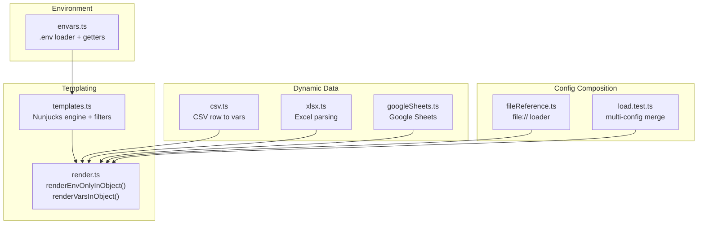
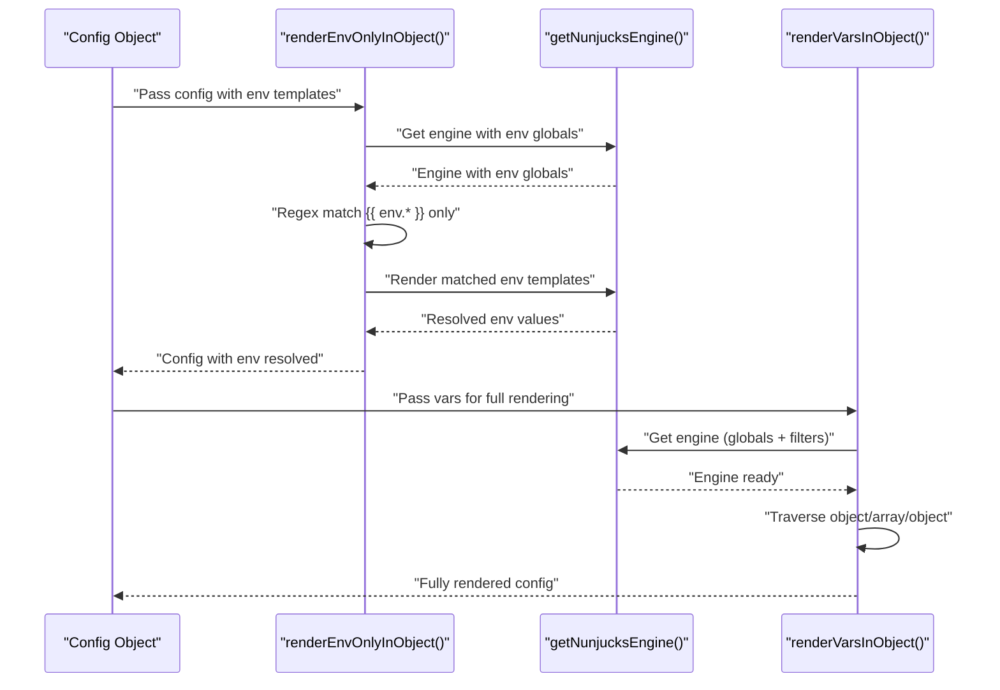
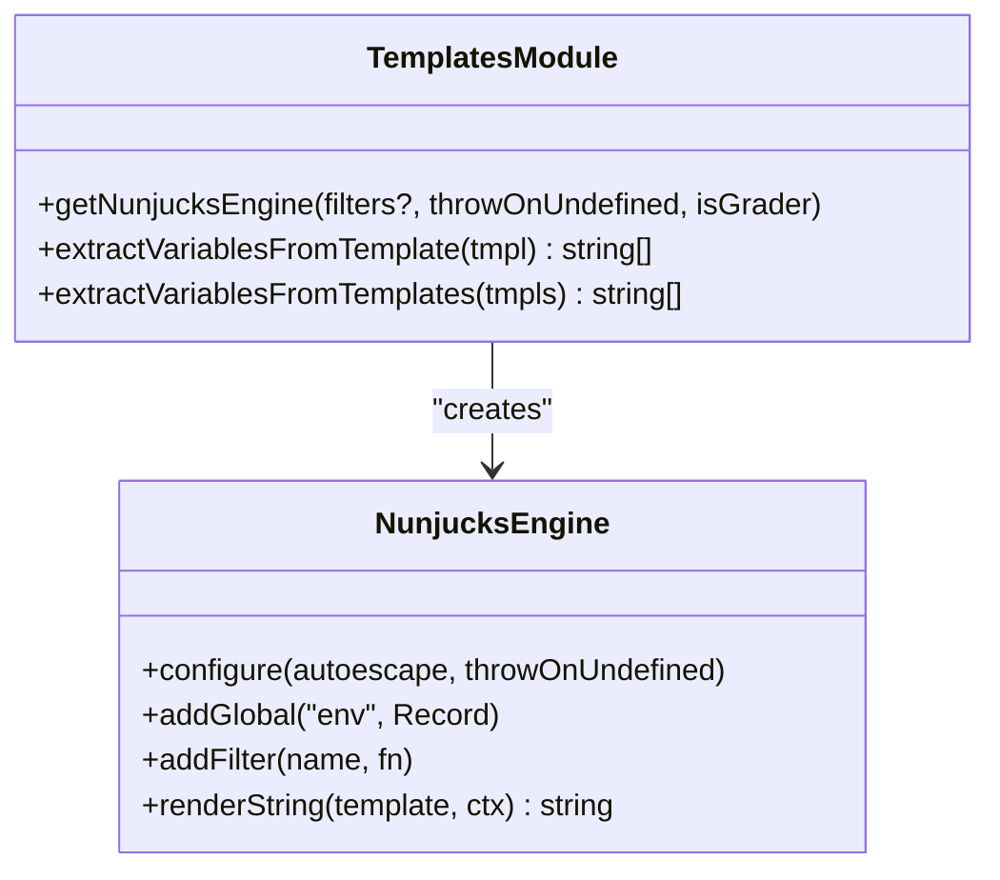
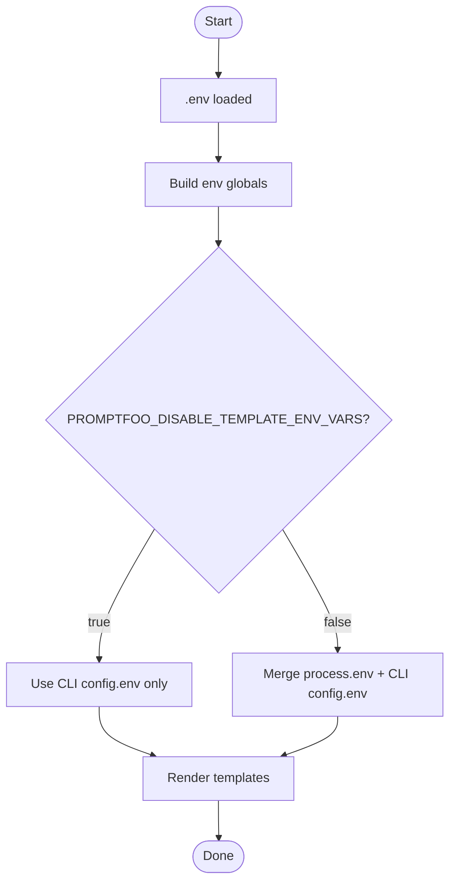
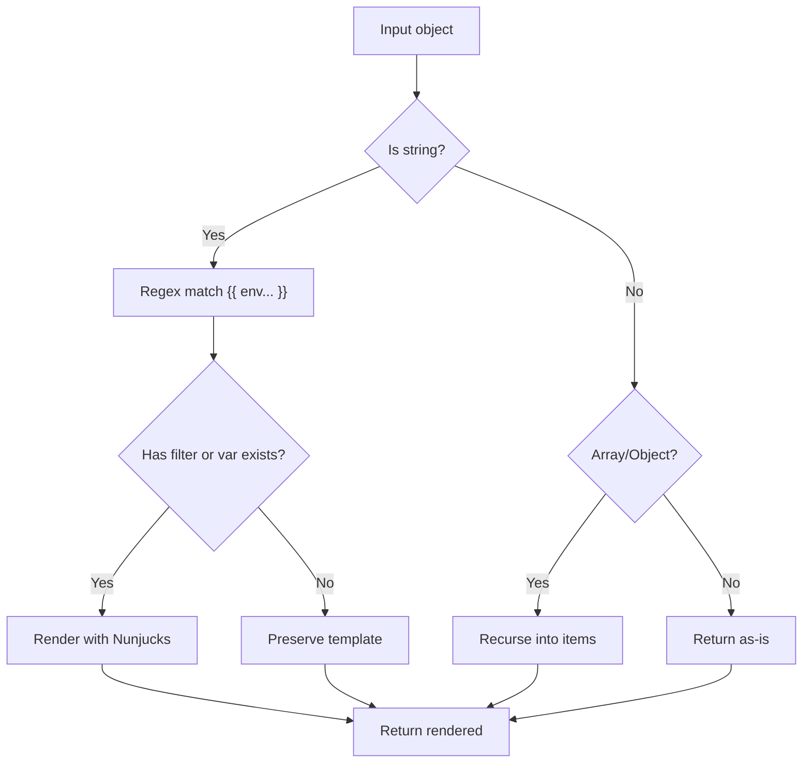
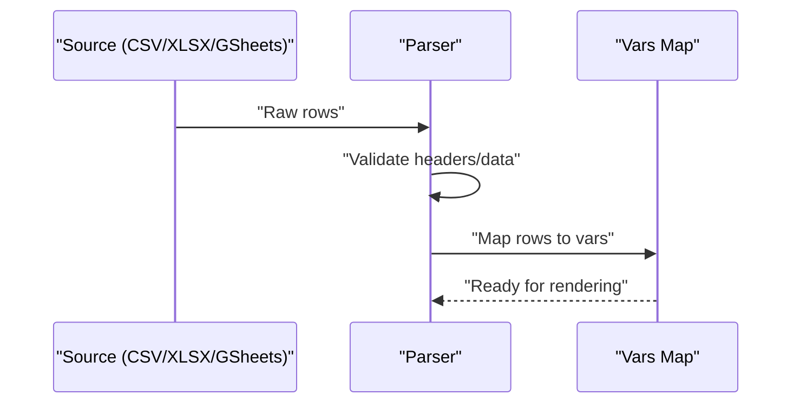
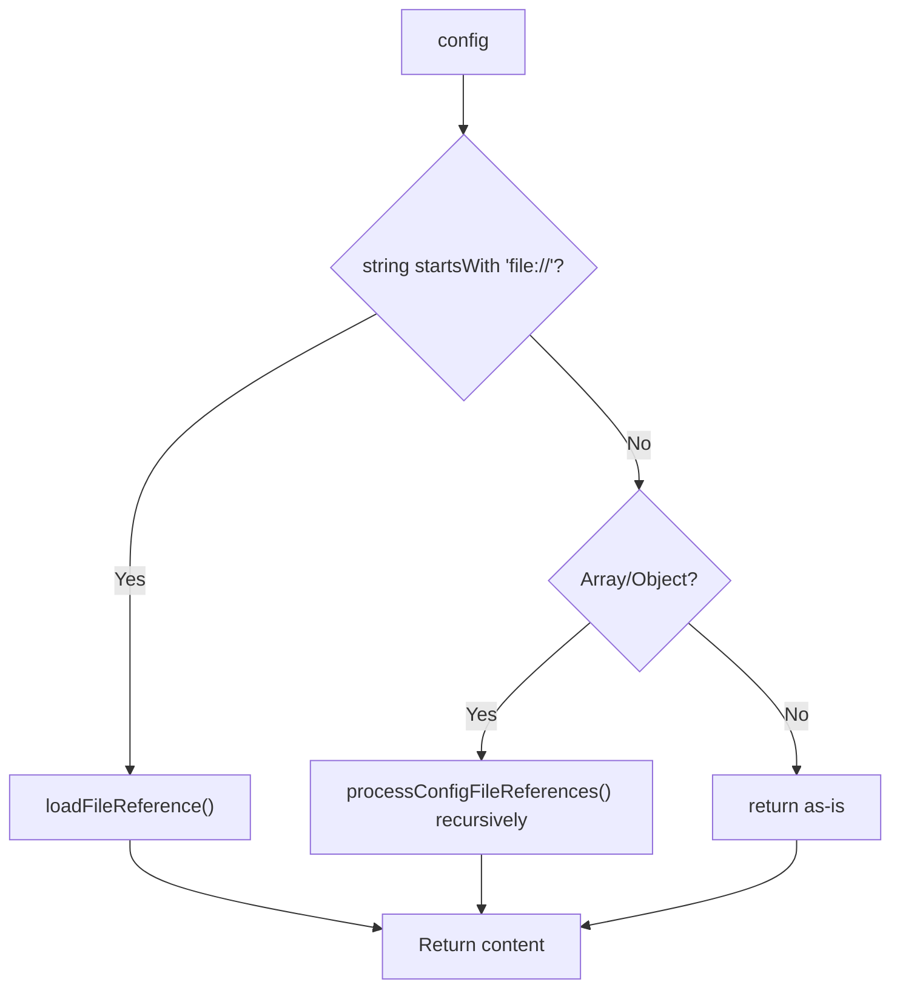
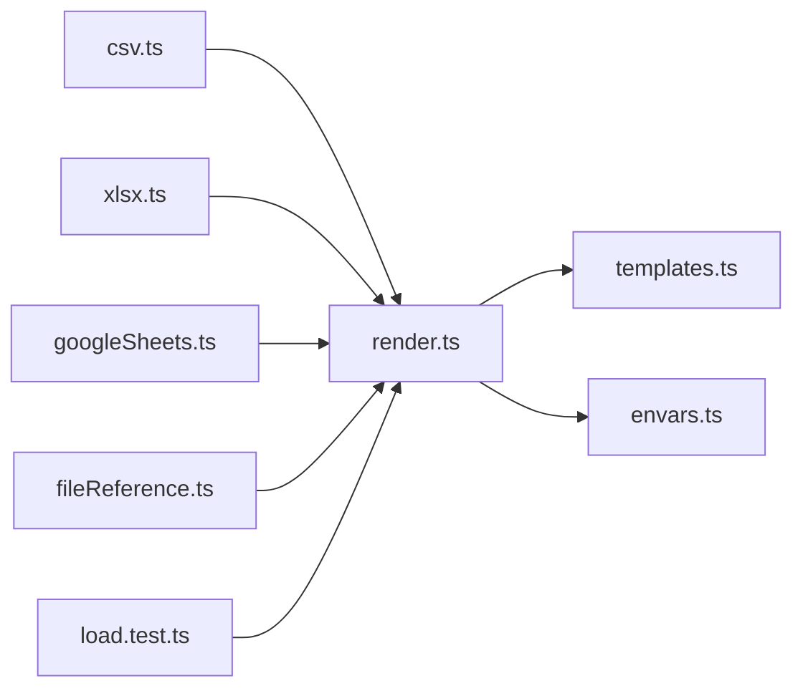

# Variable Substitution & Environment Integration

<cite>
**Referenced Files in This Document**
- [render.ts](file://src/util/render.ts)
- [templates.ts](file://src/util/templates.ts)
- [envars.ts](file://src/envars.ts)
- [csv.ts](file://src/csv.ts)
- [xlsx.ts](file://src/util/xlsx.ts)
- [fileReference.ts](file://src/util/fileReference.ts)
- [googleSheets.ts](file://src/googleSheets.ts)
- [load.test.ts](file://test/util/config/load.test.ts)
- [templates.test.ts](file://test/util/templates.test.ts)
- [render.test.ts](file://test/util/render.test.ts)
- [sanitizer.test.ts](file://test/util/sanitizer.test.ts)
</cite>

## Table of Contents
1. [Introduction](#introduction)
2. [Project Structure](#project-structure)
3. [Core Components](#core-components)
4. [Architecture Overview](#architecture-overview)
5. [Detailed Component Analysis](#detailed-component-analysis)
6. [Dependency Analysis](#dependency-analysis)
7. [Performance Considerations](#performance-considerations)
8. [Troubleshooting Guide](#troubleshooting-guide)
9. [Conclusion](#conclusion)

## Introduction
This document explains how PromptFoo manages variables across configurations, focusing on:
- Variable substitution syntax using Nunjucks templating
- Environment variable integration with ${ENV_VAR} and {{ env.VAR }} syntax
- .env file support and precedence rules across multiple config files
- Dynamic variable loading from CSV/Excel files and Google Sheets
- Variable transformation functions and conditional assignment
- Examples of complex variable scenarios (nested objects, arrays, computed values)
- Variable scoping, security considerations for secrets, and best practices

## Project Structure
PromptFoo’s variable system spans several modules:
- Templating and rendering: Nunjucks engine configuration and rendering helpers
- Environment integration: .env loading, process.env exposure, and precedence
- Dynamic data sources: CSV/Excel/Google Sheets loaders
- Configuration composition: merging multiple config files and resolving file:// references

**Diagram sources**
- [templates.ts:15-55](file://src/util/templates.ts#L15-L55)
- [render.ts:31-144](file://src/util/render.ts#L31-L144)
- [envars.ts:1-568](file://src/envars.ts#L1-L568)
- [csv.ts:134-303](file://src/csv.ts#L134-L303)
- [xlsx.ts:5-145](file://src/util/xlsx.ts#L5-L145)
- [fileReference.ts:17-103](file://src/util/fileReference.ts#L17-L103)
- [load.test.ts:288-726](file://test/util/config/load.test.ts#L288-L726)

**Section sources**
- [templates.ts:15-55](file://src/util/templates.ts#L15-L55)
- [render.ts:31-144](file://src/util/render.ts#L31-L144)
- [envars.ts:1-568](file://src/envars.ts#L1-L568)
- [csv.ts:134-303](file://src/csv.ts#L134-L303)
- [xlsx.ts:5-145](file://src/util/xlsx.ts#L5-L145)
- [fileReference.ts:17-103](file://src/util/fileReference.ts#L17-L103)
- [load.test.ts:288-726](file://test/util/config/load.test.ts#L288-L726)

## Core Components
- Nunjucks templating engine with custom filters and environment globals
- Environment variable access and precedence (CLI config env vs process.env)
- Specialized rendering for environment-only templates vs full variable rendering
- Dynamic variable sources from CSV/Excel/Google Sheets
- File reference loader supporting JSON/YAML/JS/Python/text
- Multi-config merging and variable inheritance

**Section sources**
- [templates.ts:15-55](file://src/util/templates.ts#L15-L55)
- [render.ts:31-144](file://src/util/render.ts#L31-L144)
- [envars.ts:437-567](file://src/envars.ts#L437-L567)
- [csv.ts:134-303](file://src/csv.ts#L134-L303)
- [xlsx.ts:5-145](file://src/util/xlsx.ts#L5-L145)
- [fileReference.ts:17-103](file://src/util/fileReference.ts#L17-L103)
- [load.test.ts:288-726](file://test/util/config/load.test.ts#L288-L726)

## Architecture Overview
The variable pipeline supports two distinct rendering modes:
- Environment-only rendering: resolves only {{ env.VAR }} templates while preserving others (e.g., {{ vars.x }}, {{ prompt }})
- Full variable rendering: resolves all Nunjucks templates with provided context variables

**Diagram sources**
- [render.ts:31-144](file://src/util/render.ts#L31-L144)
- [templates.ts:15-55](file://src/util/templates.ts#L15-L55)

## Detailed Component Analysis

### Nunjucks Templating Engine and Filters
- Engine configuration supports disabling templating globally and controlling undefined behavior
- Environment variables are exposed as globals under env, with precedence controlled by a feature flag
- Built-in filter load parses JSON strings
- Custom filters can be registered per-engine

**Diagram sources**
- [templates.ts:15-55](file://src/util/templates.ts#L15-L55)

**Section sources**
- [templates.ts:15-55](file://src/util/templates.ts#L15-L55)

### Environment Variables and Precedence
- .env is loaded at startup
- Environment variables are exposed to templates under env
- CLI-provided config env overrides process.env when both exist
- Feature flags control whether process.env is exposed globally

**Diagram sources**
- [envars.ts:6-426](file://src/envars.ts#L6-L426)
- [templates.ts:34-43](file://src/util/templates.ts#L34-L43)

**Section sources**
- [envars.ts:6-426](file://src/envars.ts#L6-L426)
- [templates.ts:34-43](file://src/util/templates.ts#L34-L43)
- [templates.test.ts:291-305](file://test/util/templates.test.ts#L291-L305)

### Environment-Only Rendering vs Full Rendering
- Environment-only rendering resolves only env templates and leaves others intact
- Full rendering resolves all templates with provided vars
- Regex-based matching avoids expensive ReDoS on very long strings
- Filters and expressions are supported inside env templates

**Diagram sources**
- [render.ts:31-119](file://src/util/render.ts#L31-L119)

**Section sources**
- [render.ts:31-119](file://src/util/render.ts#L31-L119)
- [render.test.ts:284-524](file://test/util/render.test.ts#L284-L524)

### Dynamic Variable Loading: CSV/Excel/Google Sheets
- CSV: Converts rows into TestCase vars, with special handling for metadata and thresholds
- Excel: Parses sheets by name or index, validates headers/data presence
- Google Sheets: Reads data and constructs ranges dynamically

**Diagram sources**
- [csv.ts:134-303](file://src/csv.ts#L134-L303)
- [xlsx.ts:5-145](file://src/util/xlsx.ts#L5-L145)
- [googleSheets.ts:107-147](file://src/googleSheets.ts#L107-L147)

**Section sources**
- [csv.ts:134-303](file://src/csv.ts#L134-L303)
- [xlsx.ts:5-145](file://src/util/xlsx.ts#L5-L145)
- [googleSheets.ts:107-147](file://src/googleSheets.ts#L107-L147)

### File Reference Loader (file://)
- Resolves file:// URLs to embedded content
- Supported formats: JSON, YAML, JS (function or module), PY (via runner), TXT/MD
- Recursively traverses config objects to replace file references

**Diagram sources**
- [fileReference.ts:17-103](file://src/util/fileReference.ts#L17-L103)

**Section sources**
- [fileReference.ts:17-103](file://src/util/fileReference.ts#L17-L103)

### Variable Transformation Functions and Conditional Assignment
- Nunjucks filters can be supplied per-engine
- Built-in load filter parses JSON strings
- Conditional assignment can be achieved using Nunjucks filters and expressions in templates

**Section sources**
- [templates.ts:45-53](file://src/util/templates.ts#L45-L53)
- [templates.test.ts:158-193](file://test/util/templates.test.ts#L158-L193)

### Complex Variable Scenarios
- Nested objects and arrays: both environment-only and full rendering traverse recursively
- Mixed nested structures: preserve non-env templates while resolving env ones
- Newlines and preservation: templates with newlines are handled correctly

**Section sources**
- [render.test.ts:321-363](file://test/util/render.test.ts#L321-L363)
- [render.test.ts:345-351](file://test/util/render.test.ts#L345-L351)
- [render.test.ts:507-515](file://test/util/render.test.ts#L507-L515)

### Variable Precedence and Inheritance Across Config Files
- Multiple configs are combined; later configs override earlier ones
- env blocks merge with CLI-provided env overrides taking precedence over process.env
- Extensions and other arrays are concatenated

**Section sources**
- [load.test.ts:288-726](file://test/util/config/load.test.ts#L288-L726)
- [templates.test.ts:291-305](file://test/util/templates.test.ts#L291-L305)

## Dependency Analysis
- render.ts depends on templates.ts for the Nunjucks engine and envars.ts for environment flags
- CSV/Excel/Google Sheets parsers depend on their respective libraries and return normalized rows
- fileReference.ts integrates with Python/JS module loaders and YAML parser
- Tests validate precedence, filtering, and recursive traversal

**Diagram sources**
- [render.ts:1-7](file://src/util/render.ts#L1-L7)
- [templates.ts:1-5](file://src/util/templates.ts#L1-L5)
- [envars.ts:1-6](file://src/envars.ts#L1-L6)
- [csv.ts:1-7](file://src/csv.ts#L1-L7)
- [xlsx.ts:1-3](file://src/util/xlsx.ts#L1-L3)
- [fileReference.ts:1-9](file://src/util/fileReference.ts#L1-L9)
- [load.test.ts:288-726](file://test/util/config/load.test.ts#L288-L726)

**Section sources**
- [render.ts:1-7](file://src/util/render.ts#L1-L7)
- [templates.ts:1-5](file://src/util/templates.ts#L1-L5)
- [envars.ts:1-6](file://src/envars.ts#L1-L6)
- [csv.ts:1-7](file://src/csv.ts#L1-L7)
- [xlsx.ts:1-3](file://src/util/xlsx.ts#L1-L3)
- [fileReference.ts:1-9](file://src/util/fileReference.ts#L1-L9)
- [load.test.ts:288-726](file://test/util/config/load.test.ts#L288-L726)

## Performance Considerations
- Environment-only rendering uses regex matching; very long strings are skipped to avoid ReDoS
- Nunjucks rendering is efficient for typical config sizes; avoid excessive template complexity
- CSV/Excel parsing validates headers and data presence early to fail fast

[No sources needed since this section provides general guidance]

## Troubleshooting Guide
- Undefined env vars: templates without filters are preserved when env vars are missing
- Confusion with env keyword: only templates starting with env are processed in environment-only mode
- Security: sensitive fields are redacted in logs and reports; avoid embedding secrets in templates intended for logs
- Template rendering disabled: set PROMPTFOO_DISABLE_TEMPLATING to bypass templating globally

**Section sources**
- [render.test.ts:311-319](file://test/util/render.test.ts#L311-L319)
- [render.test.ts:516-522](file://test/util/render.test.ts#L516-L522)
- [sanitizer.test.ts:107-979](file://test/util/sanitizer.test.ts#L107-L979)
- [envars.ts:48-48](file://src/envars.ts#L48-L48)

## Conclusion
PromptFoo’s variable system combines flexible Nunjucks templating with robust environment integration and dynamic data loading. By separating environment-only rendering from full variable rendering, it preserves runtime templates while enabling early resolution of environment-dependent values. Multi-config merging and file reference resolution enable scalable, maintainable configurations. Security is addressed through environment precedence, redaction of sensitive fields, and cautious template rendering.