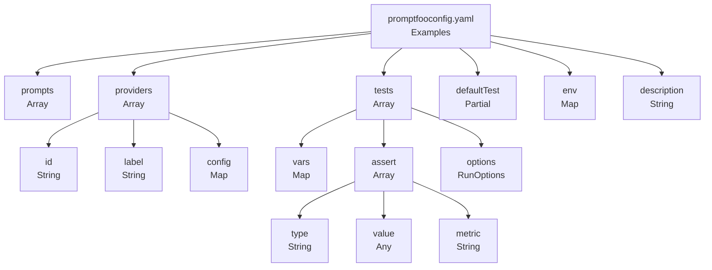
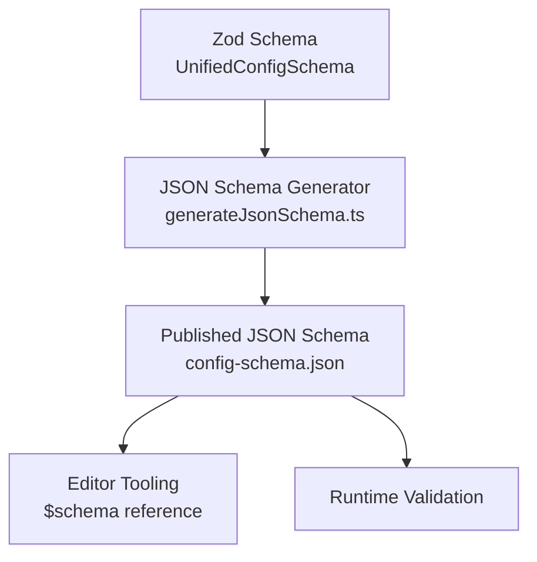
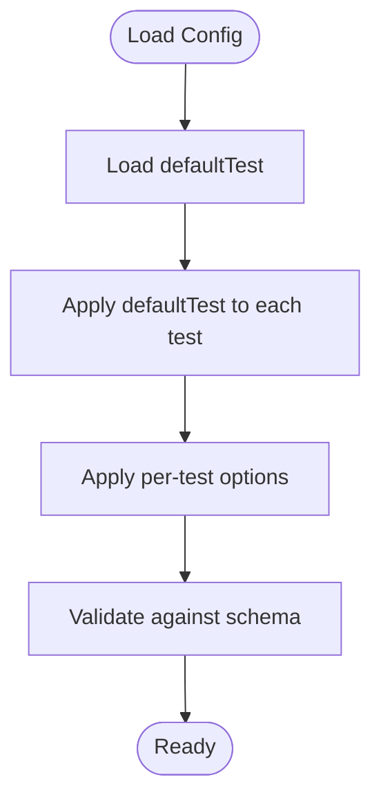

# YAML/JSON Syntax Reference

<cite>
**Referenced Files in This Document**
- [promptfooconfig.yaml](file://examples/getting-started/promptfooconfig.yaml)
- [promptfooconfig.yaml](file://examples/amazon-bedrock/promptfooconfig.yaml)
- [promptfooconfig.yaml](file://examples/agentic-sdk-comparison/promptfooconfig.yaml)
- [promptfooconfig.yaml](file://examples/anthropic/opus-4-6-coding/promptfooconfig.yaml)
- [promptfooconfig.yaml](file://examples/anthropic/structured-outputs/promptfooconfig.yaml)
- [generateJsonSchema.ts](file://scripts/generateJsonSchema.ts)
- [UnifiedConfigSchema](file://src/types/index.ts)
- [config-schema.json](file://site/src/assets/config-schema.json)
</cite>

## Table of Contents
1. [Introduction](#introduction)
2. [Project Structure](#project-structure)
3. [Core Components](#core-components)
4. [Architecture Overview](#architecture-overview)
5. [Detailed Component Analysis](#detailed-component-analysis)
6. [Dependency Analysis](#dependency-analysis)
7. [Performance Considerations](#performance-considerations)
8. [Troubleshooting Guide](#troubleshooting-guide)
9. [Conclusion](#conclusion)
10. [Appendices](#appendices)

## Introduction
This document provides a comprehensive YAML/JSON syntax reference for PromptFoo configuration files. It defines the complete schema structure, including top-level sections such as description, prompts, providers, tests, and related options. It explains data types, validation rules, defaults, arrays, nested objects, conditional fields, environment variable interpolation, special operators, and configuration inheritance/file merging behavior. It also covers validation error messages, common syntax mistakes, and schema evolution/backward compatibility considerations.

## Project Structure
PromptFoo’s configuration is primarily defined via a single configuration file (commonly promptfooconfig.yaml or promptfooconfig.json). Example configurations across the repository demonstrate practical usage patterns for prompts, providers, tests, and advanced options like defaultTest and output_format.

**Diagram sources**
- [promptfooconfig.yaml:1-30](file://examples/getting-started/promptfooconfig.yaml#L1-L30)
- [promptfooconfig.yaml:1-129](file://examples/amazon-bedrock/promptfooconfig.yaml#L1-L129)
- [promptfooconfig.yaml:1-112](file://examples/agentic-sdk-comparison/promptfooconfig.yaml#L1-L112)
- [promptfooconfig.yaml:1-165](file://examples/anthropic/opus-4-6-coding/promptfooconfig.yaml#L1-L165)
- [promptfooconfig.yaml:1-155](file://examples/anthropic/structured-outputs/promptfooconfig.yaml#L1-L155)

**Section sources**
- [promptfooconfig.yaml:1-30](file://examples/getting-started/promptfooconfig.yaml#L1-L30)
- [promptfooconfig.yaml:1-129](file://examples/amazon-bedrock/promptfooconfig.yaml#L1-L129)
- [promptfooconfig.yaml:1-112](file://examples/agentic-sdk-comparison/promptfooconfig.yaml#L1-L112)
- [promptfooconfig.yaml:1-165](file://examples/anthropic/opus-4-6-coding/promptfooconfig.yaml#L1-L165)
- [promptfooconfig.yaml:1-155](file://examples/anthropic/structured-outputs/promptfooconfig.yaml#L1-L155)

## Core Components
This section documents the top-level configuration schema and key subsections with precise field definitions, types, and behaviors.

- description: String. Optional human-readable description of the evaluation suite.
- env: Map<String, String>. Optional environment variable overrides scoped to this configuration. Keys are variable names; values are literal or interpolated strings. Interpolation follows the environment variable syntax described below.
- prompts: Array. Required unless tests supply inline prompts. Elements are either:
  - String: A prompt template string. Variables are referenced with double curly braces.
  - File reference: A string prefixed with file:// pointing to a local file containing the prompt(s).
- providers: Array<Provider>. Required. Each Provider has:
  - id: String. Provider identifier (e.g., service:model or service:category:model).
  - label: String. Optional friendly name for reporting.
  - config: Map<String, Any>. Provider-specific configuration (e.g., region, max_tokens, temperature).
- tests: Array<Test>. Required. Each Test has:
  - vars: Map<String, Any>. Variable bindings for this test case.
  - assert: Array<Assertion>. Assertions to evaluate outputs.
  - description: String. Optional description for the test case.
  - options: RunOptions. Optional per-test runtime controls.
- defaultTest: Partial<Test>. Optional global defaults applied to all tests unless overridden by individual tests.
- options: Global run options. Optional. Includes fields such as timeout and others used across runs.

Validation and defaults:
- The configuration is validated against a Zod-based schema. The JSON Schema is generated from the Zod schema and published at a canonical URL for editor tooling and validation.
- Many fields are optional and derive defaults from provider implementations or PromptFoo internals. For example, provider config fields commonly default to safe values if omitted.

Environment variable interpolation:
- Values in env and elsewhere support environment variable interpolation using the standard shell-like syntax. For example, ${VAR} expands to the environment variable VAR. If the variable is unset, the behavior depends on the implementation; typically, it leaves the placeholder unresolved or treats it as empty.

Special operators and references:
- file:// protocol: Used in prompts to reference external files. Also used in certain provider config fields (e.g., output_format) to reference JSON schema files.
- Provider IDs: May include hierarchical segments separated by colons to specify service, category, and model.

Conditional fields:
- Certain assertions and provider features are conditionally required or recommended depending on the assertion type (e.g., embedding provider for similarity assertions).

**Section sources**
- [promptfooconfig.yaml:1-30](file://examples/getting-started/promptfooconfig.yaml#L1-L30)
- [promptfooconfig.yaml:1-129](file://examples/amazon-bedrock/promptfooconfig.yaml#L1-L129)
- [promptfooconfig.yaml:1-112](file://examples/agentic-sdk-comparison/promptfooconfig.yaml#L1-L112)
- [promptfooconfig.yaml:1-165](file://examples/anthropic/opus-4-6-coding/promptfooconfig.yaml#L1-L165)
- [promptfooconfig.yaml:1-155](file://examples/anthropic/structured-outputs/promptfooconfig.yaml#L1-L155)
- [generateJsonSchema.ts:1-105](file://scripts/generateJsonSchema.ts#L1-L105)

## Architecture Overview
The configuration schema is defined in TypeScript using Zod and transformed into a JSON Schema for external tooling and validation. The JSON Schema is published and referenced by example configurations to enable editor validation and autocompletion.

**Diagram sources**
- [generateJsonSchema.ts:1-105](file://scripts/generateJsonSchema.ts#L1-L105)
- [config-schema.json](file://site/src/assets/config-schema.json)

**Section sources**
- [generateJsonSchema.ts:1-105](file://scripts/generateJsonSchema.ts#L1-L105)

## Detailed Component Analysis

### Top-Level Fields
- description: String. Human-readable description of the evaluation suite.
- env: Map<String, String>. Environment variable overrides scoped to this configuration. Supports interpolation syntax for environment variables.
- prompts: Array<String | FileRef>. Prompt templates or file references.
- providers: Array<Provider>. Required. Provider definitions with id, label, and config.
- tests: Array<Test>. Required. Test cases with vars, assert, and optional description/options.
- defaultTest: Partial<Test>. Optional. Global defaults merged into each test.
- options: Global run options. Optional.

Data types and defaults:
- description: String; default undefined.
- env: Map<String, String>; default undefined.
- prompts: Array; default undefined unless tests provide inline prompts.
- providers: Array<Provider>; required.
- tests: Array<Test>; required.
- defaultTest: Partial<Test>; default undefined.
- options: Global run options; default undefined.

Validation rules:
- At least one provider must be defined.
- At least one test must be defined.
- Prompts must be provided unless tests supply inline prompts.

**Section sources**
- [promptfooconfig.yaml:1-30](file://examples/getting-started/promptfooconfig.yaml#L1-L30)
- [promptfooconfig.yaml:1-129](file://examples/amazon-bedrock/promptfooconfig.yaml#L1-L129)

### Providers
- id: String. Provider identifier (service:model or service:category:model).
- label: String. Friendly name for reporting.
- config: Map<String, Any>. Provider-specific configuration (e.g., region, max_tokens, temperature).

Common provider config fields (examples):
- region: String. Cloud region for hosted providers.
- max_tokens: Integer. Maximum tokens to generate.
- temperature: Number. Sampling temperature.
- embedding: ProviderRef. Embedding provider for similarity assertions.
- output_format: Inline JSON schema or file:// reference to a JSON schema file.

Provider ID patterns:
- openai:gpt-4
- anthropic:messages:claude-3-opus
- bedrock:us-west-2:anthropic.claude-3-opus
- file://path/to/provider-config.yaml

**Section sources**
- [promptfooconfig.yaml:7-33](file://examples/amazon-bedrock/promptfooconfig.yaml#L7-L33)
- [promptfooconfig.yaml:9-68](file://examples/agentic-sdk-comparison/promptfooconfig.yaml#L9-L68)
- [promptfooconfig.yaml:24-82](file://examples/anthropic/structured-outputs/promptfooconfig.yaml#L24-L82)

### Tests
- vars: Map<String, Any>. Variable bindings for this test case.
- assert: Array<Assertion>. Assertions to evaluate outputs.
- description: String. Optional description.
- options: RunOptions. Optional per-test runtime controls.

Assertion types (selected):
- contains, icontains: Check substring presence.
- similar: Semantic similarity using embeddings.
- llm-rubric: Rubric-based evaluation.
- javascript: Custom JavaScript assertion logic.

Per-test options:
- timeout: Milliseconds.
- provider: Override provider for this test.

**Section sources**
- [promptfooconfig.yaml:17-30](file://examples/getting-started/promptfooconfig.yaml#L17-L30)
- [promptfooconfig.yaml:34-129](file://examples/amazon-bedrock/promptfooconfig.yaml#L34-L129)
- [promptfooconfig.yaml:14-165](file://examples/anthropic/opus-4-6-coding/promptfooconfig.yaml#L14-L165)

### DefaultTest
- Applies to all tests unless overridden by per-test options.
- Commonly used to set embedding provider for similarity assertions.

**Section sources**
- [promptfooconfig.yaml:25-33](file://examples/amazon-bedrock/promptfooconfig.yaml#L25-L33)

### Environment Variable Interpolation
- Syntax: ${VAR}. Expands to the environment variable VAR.
- Behavior: If the variable is unset, the placeholder remains unresolved or is treated as empty depending on implementation.
- Scope: env overrides environment variables for this configuration.

**Section sources**
- [promptfooconfig.yaml:5-7](file://examples/getting-started/promptfooconfig.yaml#L5-L7)

### Special Operators and References
- file:// protocol:
  - Used in prompts to reference external files.
  - Used in provider config (e.g., output_format) to reference JSON schema files.
- Provider IDs with hierarchical segments:
  - service:model
  - service:category:model

**Section sources**
- [promptfooconfig.yaml:4-5](file://examples/amazon-bedrock/promptfooconfig.yaml#L4-L5)
- [promptfooconfig.yaml:70-74](file://examples/anthropic/structured-outputs/promptfooconfig.yaml#L70-L74)

### Conditional Fields
- Similarity assertions require an embedding provider configured either globally in defaultTest.options.provider.embedding or per-test.
- Structured output assertions require output_format configuration in provider config.

**Section sources**
- [promptfooconfig.yaml:25-33](file://examples/amazon-bedrock/promptfooconfig.yaml#L25-L33)
- [promptfooconfig.yaml:28-81](file://examples/anthropic/structured-outputs/promptfooconfig.yaml#L28-L81)

### Configuration Inheritance and File Merging
- defaultTest merges into each test, allowing global defaults while still enabling per-test overrides.
- Per-test options override global defaultTest settings.
- Provider-level config merges with defaults from provider implementations.

**Diagram sources**
- [promptfooconfig.yaml:25-33](file://examples/amazon-bedrock/promptfooconfig.yaml#L25-L33)
- [promptfooconfig.yaml:17-30](file://examples/getting-started/promptfooconfig.yaml#L17-L30)

**Section sources**
- [promptfooconfig.yaml:25-33](file://examples/amazon-bedrock/promptfooconfig.yaml#L25-L33)
- [promptfooconfig.yaml:17-30](file://examples/getting-started/promptfooconfig.yaml#L17-L30)

## Dependency Analysis
The configuration schema is generated from a Zod schema and published as JSON Schema for validation and editor tooling.

**Diagram sources**
- [generateJsonSchema.ts:1-105](file://scripts/generateJsonSchema.ts#L1-L105)
- [config-schema.json](file://site/src/assets/config-schema.json)

**Section sources**
- [generateJsonSchema.ts:1-105](file://scripts/generateJsonSchema.ts#L1-L105)

## Performance Considerations
- Prefer embedding providers optimized for your assertion workload to reduce latency.
- Limit max_tokens and adjust temperature to balance quality and speed.
- Use concise prompts and targeted assertions to minimize evaluation time.
- Batch tests thoughtfully; very large test sets increase runtime.

## Troubleshooting Guide
Common validation errors and resolutions:
- Missing providers: Ensure at least one provider is defined.
- Missing tests: Ensure at least one test is defined.
- Invalid provider ID: Verify the provider ID format matches supported patterns.
- Missing embedding provider for similarity assertions: Configure defaultTest.options.provider.embedding or per-test provider.embedding.
- Invalid file:// reference: Ensure the referenced file exists and is readable.
- Unresolved environment variables: Set required environment variables or provide values in env.

Common syntax mistakes:
- Omitting required sections (providers, tests).
- Incorrect indentation in YAML leading to parsing errors.
- Using unsupported assertion types without required dependencies (e.g., similarity without embeddings).
- Misusing file:// references (nonexistent or unreadable paths).

**Section sources**
- [promptfooconfig.yaml:25-33](file://examples/amazon-bedrock/promptfooconfig.yaml#L25-L33)
- [promptfooconfig.yaml:17-30](file://examples/getting-started/promptfooconfig.yaml#L17-L30)

## Conclusion
PromptFoo’s configuration schema supports flexible, reproducible evaluations across providers and test suites. By leveraging env interpolation, file references, and defaultTest inheritance, teams can compose robust configurations. The published JSON Schema enables editor validation and improves developer experience.

## Appendices

### Minimal Configuration Example
A minimal configuration includes description, prompts, providers, and tests with basic assertions.

**Section sources**
- [promptfooconfig.yaml:1-30](file://examples/getting-started/promptfooconfig.yaml#L1-L30)

### Complex Configuration Example
A complex configuration demonstrates advanced features such as structured outputs, embedding overrides, and custom JavaScript assertions.

**Section sources**
- [promptfooconfig.yaml:1-112](file://examples/agentic-sdk-comparison/promptfooconfig.yaml#L1-L112)
- [promptfooconfig.yaml:1-155](file://examples/anthropic/structured-outputs/promptfooconfig.yaml#L1-L155)
- [promptfooconfig.yaml:1-165](file://examples/anthropic/opus-4-6-coding/promptfooconfig.yaml#L1-L165)

### Schema Evolution and Backward Compatibility
- The configuration schema is generated from Zod, ensuring strong validation rules.
- The JSON Schema is published at a canonical URL and referenced by example configurations for editor tooling.
- Backward compatibility is maintained by evolving the Zod schema while preserving existing behavior where possible.

**Section sources**
- [generateJsonSchema.ts:1-105](file://scripts/generateJsonSchema.ts#L1-L105)
- [config-schema.json](file://site/src/assets/config-schema.json)