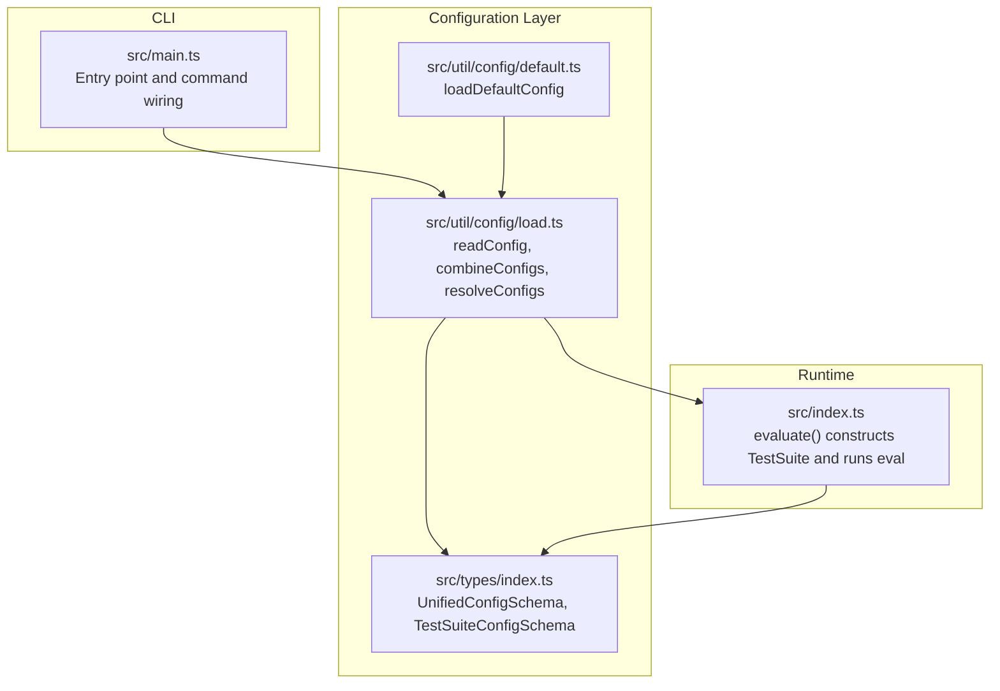
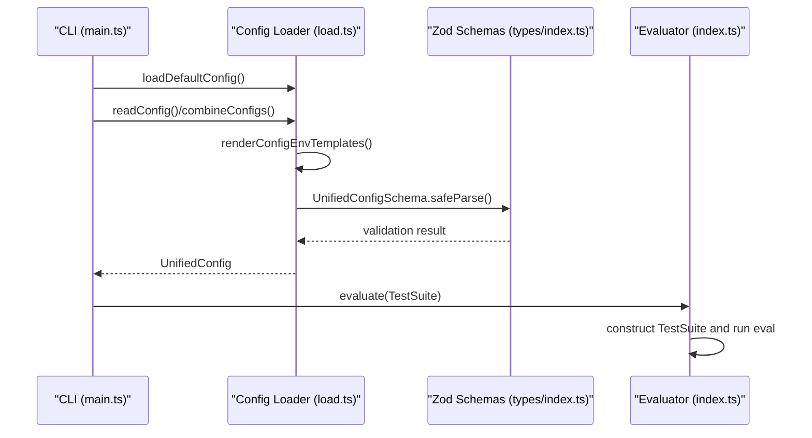
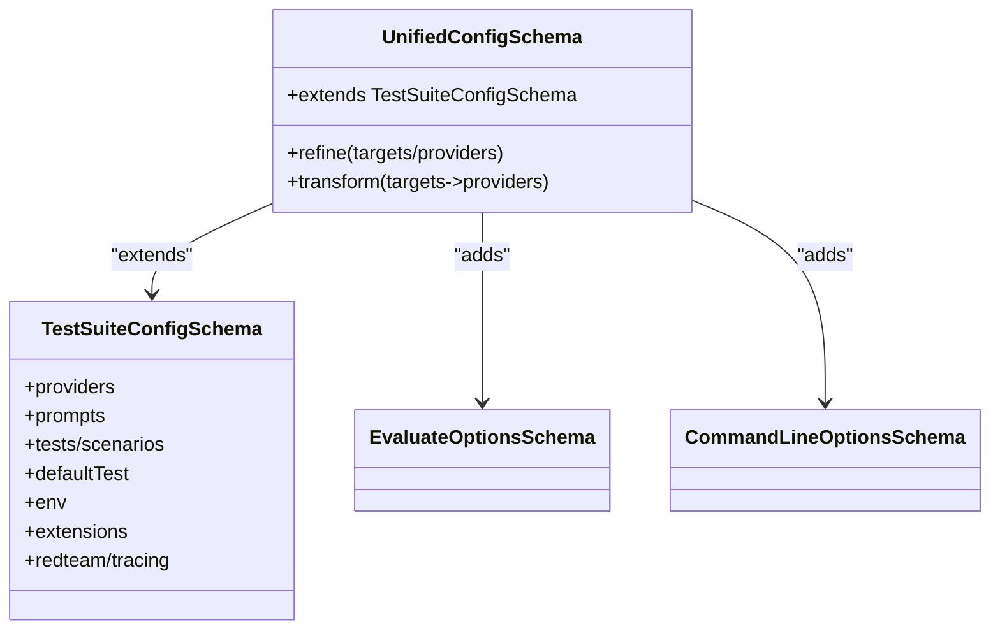
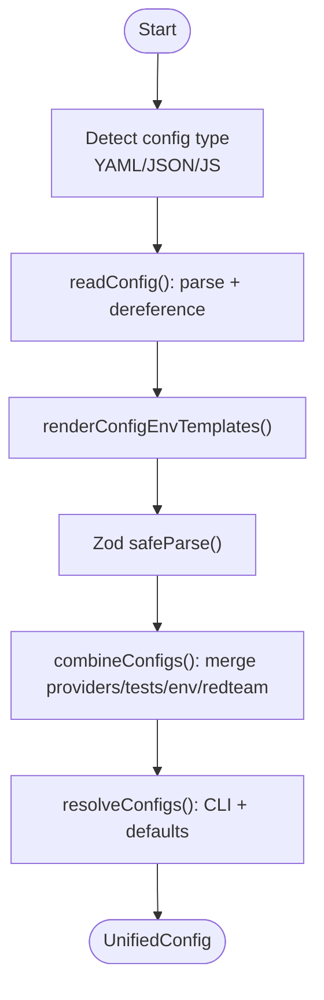
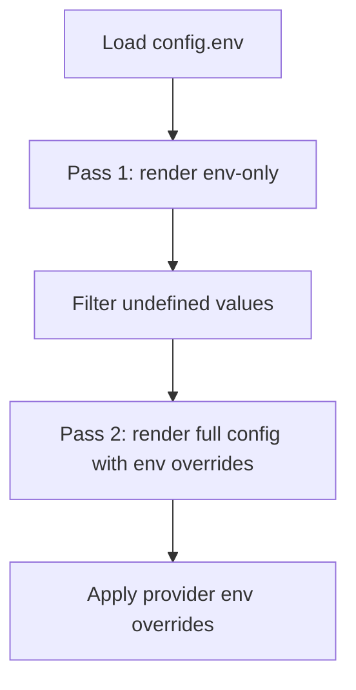
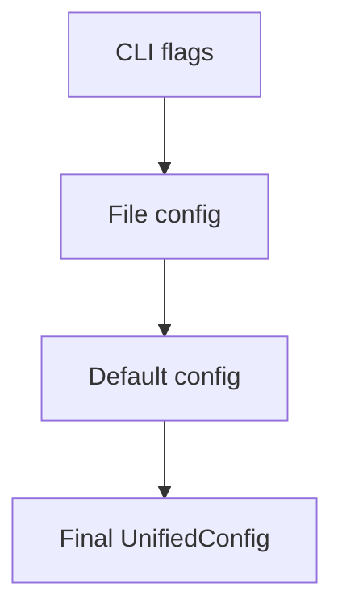
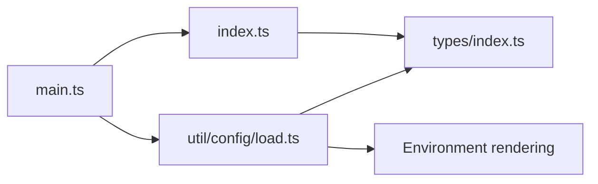

# Configuration System

<cite>
**Referenced Files in This Document**
- [src\types\index.ts](file://src\types\index.ts)
- [src\util\config\load.ts](file://src\util\config\load.ts)
- [src\util\config\default.ts](file://src\util\config\default.ts)
- [src\index.ts](file://src\index.ts)
- [src\main.ts](file://src\main.ts)
- [examples\getting-started\promptfooconfig.yaml](file://examples\getting-started\promptfooconfig.yaml)
- [examples\amazon-bedrock\promptfooconfig.yaml](file://examples\amazon-bedrock\promptfooconfig.yaml)
- [scripts\generateJsonSchema.ts](file://scripts\generateJsonSchema.ts)
- [site\src\pages\validator.tsx](file://site\src\pages\validator.tsx)
</cite>

## Table of Contents
1. [Introduction](#introduction)
2. [Project Structure](#project-structure)
3. [Core Components](#core-components)
4. [Architecture Overview](#architecture-overview)
5. [Detailed Component Analysis](#detailed-component-analysis)
6. [Dependency Analysis](#dependency-analysis)
7. [Performance Considerations](#performance-considerations)
8. [Troubleshooting Guide](#troubleshooting-guide)
9. [Conclusion](#conclusion)
10. [Appendices](#appendices)

## Introduction
This document explains PromptFoo’s configuration system with a focus on the UnifiedConfig structure, parsing and validation pipeline, configuration hierarchy, environment variable integration, variable substitution and templating, and practical examples from the repository. It is designed to be accessible to users with varying technical backgrounds while providing precise references to the source code.

## Project Structure
PromptFoo’s configuration system centers around:
- Unified configuration schema and types
- Configuration loading and merging logic
- Environment variable rendering and overrides
- Validation and JSON schema generation for editor tooling and runtime validation

**Diagram sources**
- [src\main.ts:169-256](file://src\main.ts#L169-L256)
- [src\util\config\load.ts:253-351](file://src\util\config\load.ts#L253-L351)
- [src\util\config\default.ts:24-60](file://src\util\config\default.ts#L24-L60)
- [src\types\index.ts:1203-1237](file://src\types\index.ts#L1203-L1237)
- [src\index.ts:41-178](file://src\index.ts#L41-L178)

**Section sources**
- [src\main.ts:169-256](file://src\main.ts#L169-L256)
- [src\util\config\load.ts:253-351](file://src\util\config\load.ts#L253-L351)
- [src\util\config\default.ts:24-60](file://src\util\config\default.ts#L24-L60)
- [src\types\index.ts:1203-1237](file://src\types\index.ts#L1203-L1237)
- [src\index.ts:41-178](file://src\index.ts#L41-L178)

## Core Components
- UnifiedConfig: The canonical configuration shape used across the application. It merges file-based configuration with defaults and CLI overrides, validates inputs, and prepares the runtime TestSuite.
- TestSuiteConfigSchema and UnifiedConfigSchema: Define the structure, refinements, and transformations for configuration validation.
- readConfig/combineConfigs/resolveConfigs: Load, merge, and normalize configuration from files and defaults.
- Environment variable rendering and overrides: Two-pass rendering for env templates and provider env overrides.
- JSON schema generation and validation UI: Generates a JSON schema for editor tooling and provides a validator page.

**Section sources**
- [src\types\index.ts:1203-1237](file://src\types\index.ts#L1203-L1237)
- [src\util\config\load.ts:253-351](file://src\util\config\load.ts#L253-L351)
- [src\util\config\load.ts:372-603](file://src\util\config\load.ts#L372-L603)
- [src\util\config\load.ts:228-251](file://src\util\config\load.ts#L228-L251)
- [scripts\generateJsonSchema.ts:1-40](file://scripts\generateJsonSchema.ts#L1-L40)
- [site\src\pages\validator.tsx:44-153](file://site\src\pages\validator.tsx#L44-L153)

## Architecture Overview
The configuration lifecycle:
1. CLI loads default configuration and parses command-line options.
2. Configuration files are read and merged (supports YAML/JSON/JS).
3. Environment variable templates are rendered in two passes.
4. Validation occurs using Zod schemas; JSON schema is generated for tooling.
5. The runtime TestSuite is constructed and evaluation proceeds.

**Diagram sources**
- [src\main.ts:180-181](file://src\main.ts#L180-L181)
- [src\util\config\load.ts:253-351](file://src\util\config\load.ts#L253-L351)
- [src\util\config\load.ts:228-251](file://src\util\config\load.ts#L228-L251)
- [src\types\index.ts:1203-1237](file://src\types\index.ts#L1203-L1237)
- [src\index.ts:41-178](file://src\index.ts#L41-L178)

## Detailed Component Analysis

### UnifiedConfig and Schemas
- UnifiedConfigSchema extends TestSuiteConfigSchema with evaluateOptions and commandLineOptions, enforces mutual exclusivity between targets/providers, and normalizes extensions.
- TestSuiteConfigSchema defines the core structure: providers, prompts, tests/scenarios, defaultTest, env overrides, extensions, redteam, tracing, and more.
- The schemas leverage Zod for strict validation, including refinements and transforms.

**Diagram sources**
- [src\types\index.ts:1203-1237](file://src\types\index.ts#L1203-L1237)
- [src\types\index.ts:1060-1199](file://src\types\index.ts#L1060-L1199)
- [src\types\index.ts:213-257](file://src\types\index.ts#L213-L257)
- [src\types\index.ts:62-111](file://src\types\index.ts#L62-L111)

**Section sources**
- [src\types\index.ts:1203-1237](file://src\types\index.ts#L1203-L1237)
- [src\types\index.ts:1060-1199](file://src\types\index.ts#L1060-L1199)
- [src\types\index.ts:213-257](file://src\types\index.ts#L213-L257)
- [src\types\index.ts:62-111](file://src\types\index.ts#L62-L111)

### Configuration Loading and Merging
- readConfig supports YAML, JSON, and JS files, performs JSON schema dereferencing, renders env templates, and validates with Zod.
- combineConfigs merges multiple configs, deduplicates providers/tests/extensions, and merges env and redteam sections.
- resolveConfigs integrates CLI overrides, default configs, and file configs into a final TestSuite.

**Diagram sources**
- [src\util\config\load.ts:253-351](file://src\util\config\load.ts#L253-L351)
- [src\util\config\load.ts:372-603](file://src\util\config\load.ts#L372-L603)
- [src\util\config\load.ts:609-800](file://src\util\config\load.ts#L609-L800)

**Section sources**
- [src\util\config\load.ts:253-351](file://src\util\config\load.ts#L253-L351)
- [src\util\config\load.ts:372-603](file://src\util\config\load.ts#L372-L603)
- [src\util\config\load.ts:609-800](file://src\util\config\load.ts#L609-L800)

### Environment Variable Integration and Overrides
- Two-pass rendering of env templates:
  - First pass renders config.env values using process.env only.
  - Second pass renders the full config using the pre-rendered config.env as overrides.
- Provider env overrides are supported via env: in the configuration and passed to provider loaders.
- Self-hosted environments can disable template rendering via PROMPTFOO_DISABLE_TEMPLATE_ENV_VARS.

**Diagram sources**
- [src\util\config\load.ts:228-251](file://src\util\config\load.ts#L228-L251)

**Section sources**
- [src\util\config\load.ts:228-251](file://src\util\config\load.ts#L228-L251)

### Variable Substitution and Templating with Nunjucks
- Nunjucks filters can be configured globally and per-test.
- Templates support variable substitution for prompts and test cases.
- The evaluation pipeline resolves providers and applies filters during rendering.

**Section sources**
- [src\index.ts:70-74](file://src\index.ts#L70-L74)
- [src\types\index.ts:972-973](file://src\types\index.ts#L972-L973)

### Configuration Hierarchy and Resolution
- Order of precedence:
  1) CLI flags (highest)
  2) File-based configuration
  3) Default configuration (from promptfooconfig files)
- Providers, tests, scenarios, defaultTest, env, extensions, redteam, and tracing are merged according to their types.

**Diagram sources**
- [src\util\config\load.ts:609-800](file://src\util\config\load.ts#L609-L800)

**Section sources**
- [src\util\config\load.ts:609-800](file://src\util\config\load.ts#L609-L800)

### Practical Examples
- Getting Started example demonstrates basic prompts, providers, and simple assertions.
- Amazon Bedrock example shows provider configuration with IDs, labels, and region-specific settings, plus defaultTest overrides for embeddings.

**Section sources**
- [examples\getting-started\promptfooconfig.yaml:1-30](file://examples\getting-started\promptfooconfig.yaml#L1-L30)
- [examples\amazon-bedrock\promptfooconfig.yaml:1-129](file://examples\amazon-bedrock\promptfooconfig.yaml#L1-L129)

## Dependency Analysis
- CLI depends on configuration loader to assemble UnifiedConfig.
- Configuration loader depends on Zod schemas for validation and on environment utilities for rendering.
- Runtime evaluation depends on the constructed TestSuite and provider resolution.

**Diagram sources**
- [src\main.ts:169-256](file://src\main.ts#L169-L256)
- [src\util\config\load.ts:253-351](file://src\util\config\load.ts#L253-L351)
- [src\types\index.ts:1203-1237](file://src\types\index.ts#L1203-L1237)
- [src\index.ts:41-178](file://src\index.ts#L41-L178)

**Section sources**
- [src\main.ts:169-256](file://src\main.ts#L169-L256)
- [src\util\config\load.ts:253-351](file://src\util\config\load.ts#L253-L351)
- [src\types\index.ts:1203-1237](file://src\types\index.ts#L1203-L1237)
- [src\index.ts:41-178](file://src\index.ts#L41-L178)

## Performance Considerations
- Configuration merging and validation occur once per run; caching of default configs reduces repeated file I/O.
- Provider filtering and prompt filtering reduce unnecessary work during evaluation.
- JSON dereferencing is applied selectively and can be disabled via environment variable for self-hosted deployments.

[No sources needed since this section provides general guidance]

## Troubleshooting Guide
- Invalid configuration warnings: The loader prints prettified Zod errors when validation fails.
- Missing configuration files: The loader normalizes module-not-found errors to ENOENT and returns undefined for missing files.
- No prompts/providers: The system logs actionable warnings and exits with non-zero status when required fields are absent.
- JSON schema validation: A validator UI is available to validate YAML/JSON against the generated schema.

**Section sources**
- [src\util\config\load.ts:288-292](file://src\util\config\load.ts#L288-L292)
- [src\util\config\load.ts:353-364](file://src\util\config\load.ts#L353-L364)
- [src\util\config\load.ts:714-744](file://src\util\config\load.ts#L714-L744)
- [site\src\pages\validator.tsx:44-153](file://site\src\pages\validator.tsx#L44-L153)

## Conclusion
PromptFoo’s configuration system is built around a robust Zod schema (UnifiedConfigSchema/TestSuiteConfigSchema), a flexible loader that supports multiple formats and merges multiple configs, and a two-pass environment rendering mechanism. The system provides strong validation, editor tooling via JSON schema, and a clear hierarchy of overrides. Practical examples demonstrate common patterns for prompts, providers, and assertions.

[No sources needed since this section summarizes without analyzing specific files]

## Appendices

### JSON Schema Generation and Editor Tooling
- A script extracts the base schema from UnifiedConfigSchema and emits a JSON schema for editor integration and validation UI.
- The validator UI loads the schema and validates user input using AJV, aggregating errors by path.

**Section sources**
- [scripts\generateJsonSchema.ts:1-40](file://scripts\generateJsonSchema.ts#L1-L40)
- [scripts\generateJsonSchema.ts:63-104](file://scripts\generateJsonSchema.ts#L63-L104)
- [site\src\pages\validator.tsx:44-153](file://site\src\pages\validator.tsx#L44-L153)