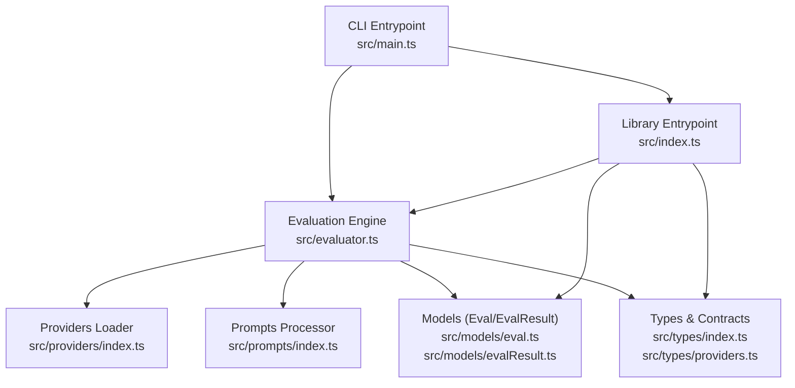
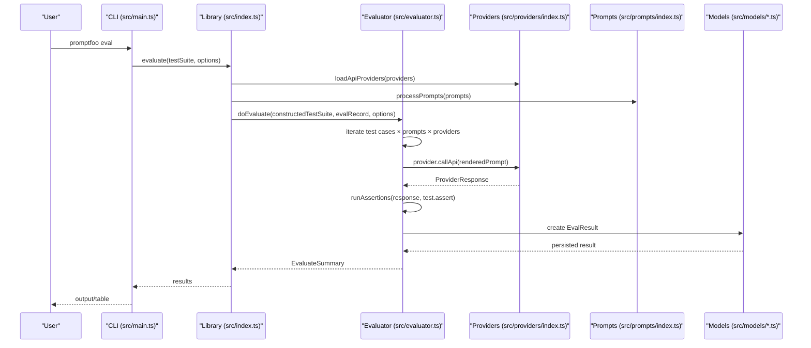
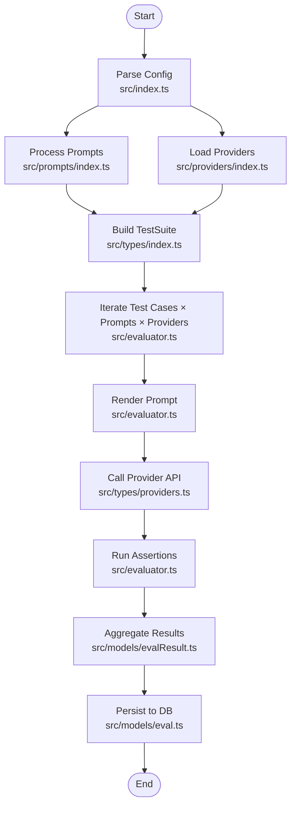
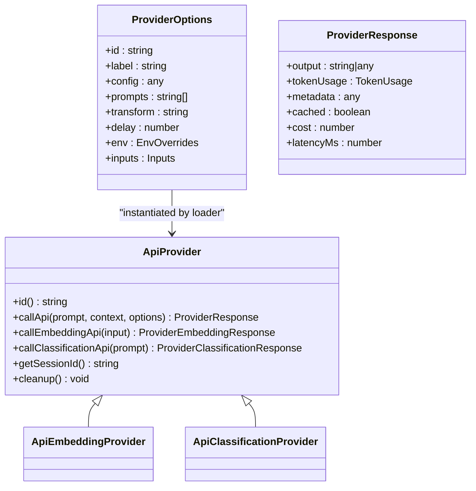
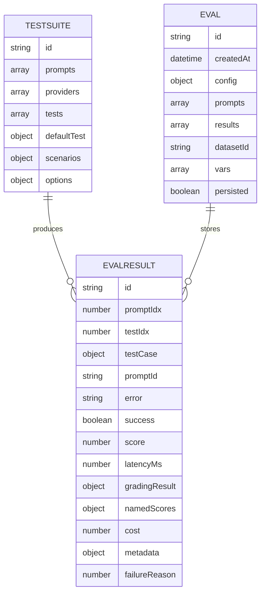
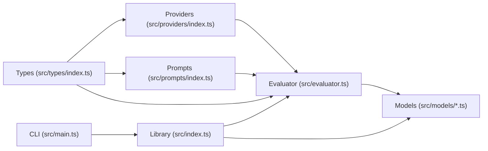

# Core Concepts

<cite>
**Referenced Files in This Document**
- [README.md](file://README.md)
- [src/index.ts](file://src/index.ts)
- [src/main.ts](file://src/main.ts)
- [src/evaluator.ts](file://src/evaluator.ts)
- [src/prompts/index.ts](file://src/prompts/index.ts)
- [src/providers/index.ts](file://src/providers/index.ts)
- [src/types/index.ts](file://src/types/index.ts)
- [src/types/providers.ts](file://src/types/providers.ts)
- [src/models/eval.ts](file://src/models/eval.ts)
- [src/models/evalResult.ts](file://src/models/evalResult.ts)
- [examples/getting-started/promptfooconfig.yaml](file://examples/getting-started/promptfooconfig.yaml)
- [examples/amazon-bedrock/promptfooconfig.yaml](file://examples/amazon-bedrock/promptfooconfig.yaml)
</cite>

## Table of Contents
1. [Introduction](#introduction)
2. [Project Structure](#project-structure)
3. [Core Components](#core-components)
4. [Architecture Overview](#architecture-overview)
5. [Detailed Component Analysis](#detailed-component-analysis)
6. [Dependency Analysis](#dependency-analysis)
7. [Performance Considerations](#performance-considerations)
8. [Troubleshooting Guide](#troubleshooting-guide)
9. [Conclusion](#conclusion)
10. [Appendices](#appendices)

## Introduction
This document explains PromptFoo’s core concepts and fundamental architecture. It covers the evaluation pipeline from configuration parsing through provider execution to result aggregation, the key data models (TestSuite, Provider, Assertion, EvaluateResult), provider abstraction, and configuration syntax. Practical examples are drawn from the examples directory to demonstrate prompts, variables, providers, and assertions in real configurations.

## Project Structure
PromptFoo is organized around a CLI entrypoint, a core evaluation engine, provider abstractions, prompt processing, and data models for results and persistence. The CLI orchestrates commands and delegates evaluation to the core engine, which coordinates providers, executes prompts, runs assertions, and aggregates results.

**Diagram sources**
- [src/main.ts:169-256](file://src/main.ts#L169-L256)
- [src/index.ts:41-178](file://src/index.ts#L41-L178)
- [src/evaluator.ts:1-120](file://src/evaluator.ts#L1-L120)
- [src/providers/index.ts:345-417](file://src/providers/index.ts#L345-L417)
- [src/prompts/index.ts:232-261](file://src/prompts/index.ts#L232-L261)
- [src/models/eval.ts:491-610](file://src/models/eval.ts#L491-L610)
- [src/models/evalResult.ts:98-164](file://src/models/evalResult.ts#L98-L164)
- [src/types/index.ts:1-120](file://src/types/index.ts#L1-L120)
- [src/types/providers.ts:102-120](file://src/types/providers.ts#L102-L120)

**Section sources**
- [README.md:1-97](file://README.md#L1-L97)
- [src/main.ts:169-256](file://src/main.ts#L169-L256)
- [src/index.ts:41-178](file://src/index.ts#L41-L178)

## Core Components
- TestSuite: The unified configuration object that holds prompts, providers, tests, scenarios, and runtime options. It is constructed from user-provided configuration and validated schemas.
- Provider: A unified interface for AI/LLM services and other capabilities (text, embeddings, classification, moderation). Providers expose a standardized callApi method and optional specialized APIs.
- Assertion: A validation rule applied to provider outputs, including built-in types (contains, similarity, moderation, etc.) and custom scoring functions.
- EvaluateResult: The per-case result capturing provider response, scores, latency, token usage, and assertion outcomes.
- Eval/EvalResult models: Persisted evaluation records and individual results, enabling sharing, filtering, and reporting.

**Section sources**
- [src/types/index.ts:769-800](file://src/types/index.ts#L769-L800)
- [src/types/providers.ts:102-120](file://src/types/providers.ts#L102-L120)
- [src/models/eval.ts:318-340](file://src/models/eval.ts#L318-L340)
- [src/models/evalResult.ts:98-164](file://src/models/evalResult.ts#L98-L164)

## Architecture Overview
The evaluation lifecycle is orchestrated by the library entrypoint, which loads providers, processes prompts, constructs the TestSuite, and invokes the evaluator. The evaluator runs provider calls, applies transformations, executes assertions, and aggregates results into EvaluateResult objects stored via Eval/EvalResult models.

**Diagram sources**
- [src/main.ts:199-200](file://src/main.ts#L199-L200)
- [src/index.ts:41-178](file://src/index.ts#L41-L178)
- [src/evaluator.ts:291-308](file://src/evaluator.ts#L291-L308)
- [src/providers/index.ts:345-417](file://src/providers/index.ts#L345-L417)
- [src/prompts/index.ts:232-261](file://src/prompts/index.ts#L232-L261)
- [src/models/evalResult.ts:98-164](file://src/models/evalResult.ts#L98-L164)

## Detailed Component Analysis

### Evaluation Pipeline
The pipeline stages:
1. Configuration parsing and construction of TestSuite
2. Provider loading and resolution
3. Prompt processing and provider-to-prompt mapping
4. Test case generation from vars and tests
5. Concurrent execution of provider calls
6. Assertion processing and scoring
7. Result aggregation and persistence

**Diagram sources**
- [src/index.ts:41-178](file://src/index.ts#L41-L178)
- [src/providers/index.ts:345-417](file://src/providers/index.ts#L345-L417)
- [src/prompts/index.ts:232-261](file://src/prompts/index.ts#L232-L261)
- [src/evaluator.ts:291-308](file://src/evaluator.ts#L291-L308)
- [src/types/providers.ts:102-120](file://src/types/providers.ts#L102-L120)
- [src/models/evalResult.ts:98-164](file://src/models/evalResult.ts#L98-L164)
- [src/models/eval.ts:491-610](file://src/models/eval.ts#L491-L610)

**Section sources**
- [src/index.ts:41-178](file://src/index.ts#L41-L178)
- [src/evaluator.ts:291-308](file://src/evaluator.ts#L291-L308)

### Provider Abstraction
Providers implement a common interface with a standardized callApi method and optional specialized methods. Providers can be loaded from strings, files, functions, or objects, with environment overrides and label rendering.

**Diagram sources**
- [src/types/providers.ts:102-120](file://src/types/providers.ts#L102-L120)
- [src/types/providers.ts:50-59](file://src/types/providers.ts#L50-L59)
- [src/types/providers.ts:145-188](file://src/types/providers.ts#L145-L188)

**Section sources**
- [src/providers/index.ts:345-417](file://src/providers/index.ts#L345-L417)
- [src/types/providers.ts:102-120](file://src/types/providers.ts#L102-L120)

### Data Models
- TestSuite: Holds prompts, providers, tests, scenarios, and runtime options. Constructed from user config and validated schemas.
- EvaluateResult: Captures per-test results, scores, latency, token usage, and assertion outcomes.
- Eval/EvalResult: Persisted evaluation records and individual results with sanitization and blob extraction support.

**Diagram sources**
- [src/types/index.ts:769-800](file://src/types/index.ts#L769-L800)
- [src/models/evalResult.ts:312-380](file://src/models/evalResult.ts#L312-L380)
- [src/models/eval.ts:318-340](file://src/models/eval.ts#L318-L340)

**Section sources**
- [src/types/index.ts:769-800](file://src/types/index.ts#L769-L800)
- [src/models/evalResult.ts:98-164](file://src/models/evalResult.ts#L98-L164)
- [src/models/eval.ts:491-610](file://src/models/eval.ts#L491-L610)

### Configuration System and Variable Substitution
- YAML/JSON syntax: Tests, prompts, providers, and defaultTest are defined in configuration files. Examples include getting-started and amazon-bedrock.
- Variable substitution: Vars are substituted into prompts using templating; provider transforms and test transforms can further process outputs.
- Provider resolution: Providers can be referenced by string, file, function, or object; file references are resolved to ProviderOptions.

Practical examples:
- Getting started example defines prompts, providers, and tests with variables and assertions.
- Amazon Bedrock example demonstrates provider configuration, defaultTest overrides, and embedding provider selection.

**Section sources**
- [examples/getting-started/promptfooconfig.yaml:1-30](file://examples/getting-started/promptfooconfig.yaml#L1-L30)
- [examples/amazon-bedrock/promptfooconfig.yaml:1-129](file://examples/amazon-bedrock/promptfooconfig.yaml#L1-L129)
- [src/prompts/index.ts:232-261](file://src/prompts/index.ts#L232-L261)
- [src/providers/index.ts:345-417](file://src/providers/index.ts#L345-L417)

### Test Cases, Scenarios, and Datasets
- Test cases: Generated from the combination of prompts, vars, and provider filters. Each test case produces one EvaluateResult.
- Scenarios: Optional grouping of tests with shared configuration.
- Datasets: Serialized test sets used for reproducibility and persistence.

**Section sources**
- [src/types/index.ts:769-800](file://src/types/index.ts#L769-L800)
- [src/models/eval.ts:510-574](file://src/models/eval.ts#L510-L574)

## Dependency Analysis
The evaluation engine depends on providers, prompts, types, and models. The library entrypoint composes these components and exposes evaluate for programmatic usage.

**Diagram sources**
- [src/types/index.ts:1-120](file://src/types/index.ts#L1-L120)
- [src/providers/index.ts:345-417](file://src/providers/index.ts#L345-L417)
- [src/prompts/index.ts:232-261](file://src/prompts/index.ts#L232-L261)
- [src/evaluator.ts:1-120](file://src/evaluator.ts#L1-L120)
- [src/models/eval.ts:491-610](file://src/models/eval.ts#L491-L610)
- [src/index.ts:41-178](file://src/index.ts#L41-L178)
- [src/main.ts:169-256](file://src/main.ts#L169-L256)

**Section sources**
- [src/index.ts:41-178](file://src/index.ts#L41-L178)
- [src/evaluator.ts:1-120](file://src/evaluator.ts#L1-L120)

## Performance Considerations
- Concurrency: The evaluator supports configurable max concurrency and optional rate-limiting registry for adaptive control.
- Caching: Cache can be disabled or reused depending on evaluation options and repeated runs.
- Token usage tracking: Aggregated across provider responses and assertion requests.
- Streaming and transforms: Provider and test transforms can reduce payload sizes and improve throughput.

[No sources needed since this section provides general guidance]

## Troubleshooting Guide
- Provider errors: The evaluator captures provider error context including HTTP status and response snippets, and logs AbortError specially.
- Serialization issues: Results sanitize circular references and non-serializable values to prevent crashes.
- Sharing and persistence: Sharing URLs are created when enabled; database migrations and signal updates are handled during evaluation lifecycle.

**Section sources**
- [src/evaluator.ts:697-765](file://src/evaluator.ts#L697-L765)
- [src/models/evalResult.ts:74-96](file://src/models/evalResult.ts#L74-L96)
- [src/index.ts:150-167](file://src/index.ts#L150-L167)

## Conclusion
PromptFoo’s architecture centers on a robust evaluation pipeline, a unified provider abstraction, and strong data models for results and persistence. The configuration system supports flexible YAML/JSON definitions, variable substitution, and provider resolution. Together, these components enable scalable, repeatable evaluations across diverse AI services and assertion types.

[No sources needed since this section summarizes without analyzing specific files]

## Appendices

### Example Configurations
- Getting started example: Demonstrates prompts, providers, and basic assertions with variables.
- Amazon Bedrock example: Shows provider configuration, defaultTest overrides, and embedding provider selection.

**Section sources**
- [examples/getting-started/promptfooconfig.yaml:1-30](file://examples/getting-started/promptfooconfig.yaml#L1-L30)
- [examples/amazon-bedrock/promptfooconfig.yaml:1-129](file://examples/amazon-bedrock/promptfooconfig.yaml#L1-L129)