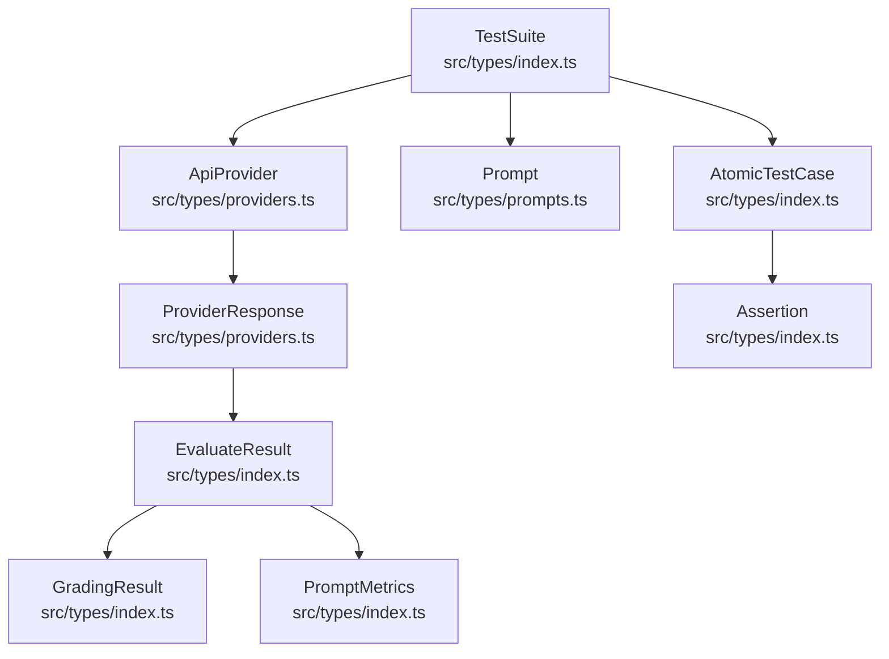
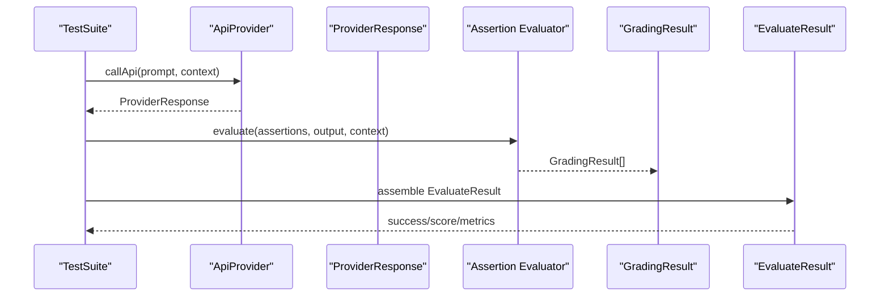
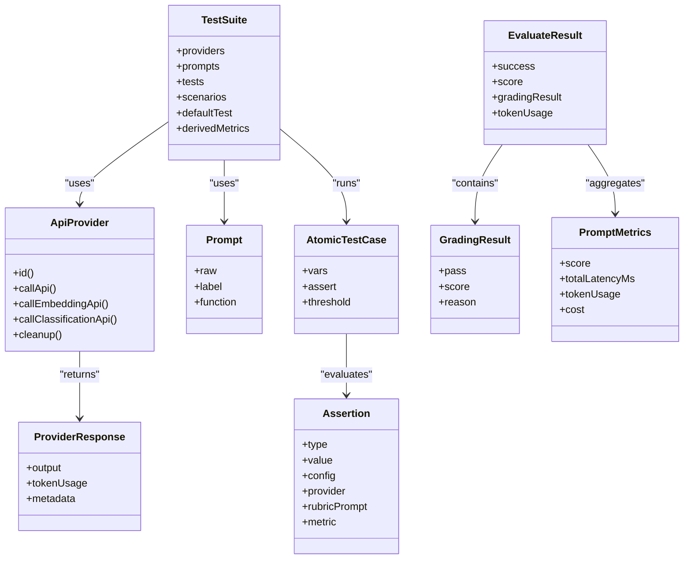

# Data Models & Types

<cite>
**Referenced Files in This Document**
- [src/types/index.ts](file://src/types/index.ts)
- [src/types/providers.ts](file://src/types/providers.ts)
- [src/types/prompts.ts](file://src/types/prompts.ts)
- [src/validators/providers.ts](file://src/validators/providers.ts)
- [src/validators/prompts.ts](file://src/validators/prompts.ts)
- [examples/getting-started/promptfooconfig.yaml](file://examples/getting-started/promptfooconfig.yaml)
- [examples/simple-test/promptfooconfig.yaml](file://examples/simple-test/promptfooconfig.yaml)
</cite>

## Table of Contents
1. [Introduction](#introduction)
2. [Project Structure](#project-structure)
3. [Core Components](#core-components)
4. [Architecture Overview](#architecture-overview)
5. [Detailed Component Analysis](#detailed-component-analysis)
6. [Dependency Analysis](#dependency-analysis)
7. [Performance Considerations](#performance-considerations)
8. [Troubleshooting Guide](#troubleshooting-guide)
9. [Conclusion](#conclusion)
10. [Appendices](#appendices)

## Introduction
This document explains PromptFoo’s core data models and type system. It focuses on how TestSuite, AtomicTestCase, Provider, Assertion, and EvaluateResult relate during evaluation, and how Zod schemas enforce configuration correctness. It also documents result data structures like EvaluateResult, GradingResult, and PromptMetrics, and shows practical configuration examples from the examples directory.

## Project Structure
The type system spans two primary areas:
- src/types: Pure TypeScript interfaces and runtime helpers
- src/validators: Zod schemas for configuration validation and parsing

Key relationships:
- TestSuite defines providers and prompts and orchestrates evaluation.
- Providers implement ApiProvider and return ProviderResponse.
- Assertions define checks on model outputs.
- EvaluateResult captures per-case outcomes, including GradingResult and metrics.

**Diagram sources**
- [src/types/index.ts:940-1057](file://src/types/index.ts#L940-L1057)
- [src/types/providers.ts:102-218](file://src/types/providers.ts#L102-L218)
- [src/types/prompts.ts:46-55](file://src/types/prompts.ts#L46-L55)

**Section sources**
- [src/types/index.ts:940-1057](file://src/types/index.ts#L940-L1057)
- [src/types/providers.ts:102-218](file://src/types/providers.ts#L102-L218)
- [src/types/prompts.ts:46-55](file://src/types/prompts.ts#L46-L55)

## Core Components
- TestSuite: Top-level configuration containing providers, prompts, tests/scenarios, defaults, and evaluation options.
- AtomicTestCase: A single test case with vars, optional provider override, filters, precomputed providerOutput, assertions, and scoring.
- Provider (ApiProvider): Contract for calling LLMs/embeddings/classifiers, returning ProviderResponse with metadata and token usage.
- Assertion: Typed checks (including sets) with optional provider, rubric, thresholds, weights, and transforms.
- EvaluateResult: Per-case evaluation outcome including success, score, latency, token usage, and GradingResult.
- GradingResult: Structured pass/fail/score with optional component results and metadata.
- PromptMetrics: Aggregated metrics across a prompt run (scores, counts, latency, token usage, costs).

**Section sources**
- [src/types/index.ts:940-1057](file://src/types/index.ts#L940-L1057)
- [src/types/index.ts:872-876](file://src/types/index.ts#L872-L876)
- [src/types/providers.ts:102-218](file://src/types/providers.ts#L102-L218)
- [src/types/index.ts:621-652](file://src/types/index.ts#L621-L652)
- [src/types/index.ts:325-346](file://src/types/index.ts#L325-L346)
- [src/types/index.ts:453-495](file://src/types/index.ts#L453-L495)
- [src/types/index.ts:259-279](file://src/types/index.ts#L259-L279)

## Architecture Overview
The evaluation pipeline:
1. TestSuite loads providers and prompts.
2. For each AtomicTestCase, the selected Provider is invoked with the rendered Prompt.
3. ProviderResponse is produced and passed to Assertion evaluators.
4. Assertions produce GradingResult(s); EvaluateResult aggregates pass/fail, scores, latency, token usage, and metadata.
5. PromptMetrics summarize per-prompt statistics.

**Diagram sources**
- [src/types/index.ts:940-1057](file://src/types/index.ts#L940-L1057)
- [src/types/providers.ts:102-218](file://src/types/providers.ts#L102-L218)
- [src/types/index.ts:621-652](file://src/types/index.ts#L621-L652)
- [src/types/index.ts:453-495](file://src/types/index.ts#L453-L495)
- [src/types/index.ts:325-346](file://src/types/index.ts#L325-L346)

## Detailed Component Analysis

### TestSuite and Configuration Schemas
- TestSuiteSchema: Defines providers, prompts, optional providerPromptMap, tests, scenarios, defaultTest, nunjucksFilters, env overrides, derivedMetrics, extensions, redteam, and tracing.
- TestSuiteConfigSchema: Pre-parsed form supporting file paths and inline content.
- UnifiedConfigSchema: Merges evaluateOptions and command-line options with validation ensuring exclusive providers/targets.

Key relationships:
- Providers can be strings, function providers, or ProviderOptions.
- Prompts can be file paths or inline Prompt objects.
- Tests can be file paths, inline TestCase, or generator configs.

Practical example references:
- [examples/getting-started/promptfooconfig.yaml:1-30](file://examples/getting-started/promptfooconfig.yaml#L1-L30)
- [examples/simple-test/promptfooconfig.yaml:1-60](file://examples/simple-test/promptfooconfig.yaml#L1-L60)

**Section sources**
- [src/types/index.ts:940-1057](file://src/types/index.ts#L940-L1057)
- [src/types/index.ts:1060-1199](file://src/types/index.ts#L1060-L1199)
- [src/types/index.ts:1203-1237](file://src/types/index.ts#L1203-L1237)
- [examples/getting-started/promptfooconfig.yaml:1-30](file://examples/getting-started/promptfooconfig.yaml#L1-L30)
- [examples/simple-test/promptfooconfig.yaml:1-60](file://examples/simple-test/promptfooconfig.yaml#L1-L60)

### AtomicTestCase
- AtomicTestCaseSchema enforces a flattened, strict form of TestCase with validated vars.
- TestCaseSchema supports vars, provider override, provider/filter lists, prompts filter, precomputed providerOutput, assertions (including AssertionSet), scoring function, options, threshold, and metadata.

Runtime validation:
- VarsSchema ensures a plain object with allowed primitive/array/object values.
- Options merges PromptConfigSchema, OutputConfigSchema, GradingConfigSchema with catch-all support.

**Section sources**
- [src/types/index.ts:872-876](file://src/types/index.ts#L872-L876)
- [src/types/index.ts:769-835](file://src/types/index.ts#L769-L835)
- [src/types/index.ts:739-748](file://src/types/index.ts#L739-L748)
- [src/types/index.ts:807-820](file://src/types/index.ts#L807-L820)

### Provider (ApiProvider) and ProviderResponse
- ApiProvider: Contract with id, callApi, optional embedding/classification/moderation, label, transform, delay, config, inputs, cleanup.
- ProviderResponse: Includes cached, cost, error, isBase64/format hints, logProbs, latencyMs, metadata, prompt override, raw output, providerTransformedOutput, tokenUsage, finishReason, guardrails, and media outputs (audio/video/images).

Validation schemas:
- ApiProviderSchema, ProviderOptionsSchema, ProviderResponseSchema, and ProvidersSchema ensure consistent provider configuration and runtime shape.

**Section sources**
- [src/types/providers.ts:102-218](file://src/types/providers.ts#L102-L218)
- [src/validators/providers.ts:14-93](file://src/validators/providers.ts#L14-L93)

### Assertion and AssertionSet
- AssertionTypeSchema unions base types, negated base types, special types (select-best, human, max-score), and redteam types.
- AssertionSchema defines type, optional value/config/threshold/weight/provider/rubric/metric/transform/contextTransform.
- AssertionSetSchema groups multiple assertions with weight, metric, threshold, and config.

Runtime validation:
- AssertionOrSetSchema validates either regular or grouped assertions.

**Section sources**
- [src/types/index.ts:514-598](file://src/types/index.ts#L514-L598)
- [src/types/index.ts:602-652](file://src/types/index.ts#L602-L652)
- [src/types/index.ts:660-661](file://src/types/index.ts#L660-L661)

### EvaluateResult, GradingResult, and PromptMetrics
- EvaluateResult: Per-case result with id, promptIdx, testIdx, testCase, promptId, provider identity, prompt rendering, vars, response, error, failureReason, success, score, latencyMs, gradingResult, namedScores, cost, metadata, tokenUsage.
- GradingResult: Pass/fail/score/reason, optional namedScores/tokensUsed/componentResults/assertion/comment/suggestions/metadata.
- PromptMetrics: Aggregated counts (pass/fail/error), totalLatencyMs, tokenUsage, namedScores/namedScoresCount, optional redteam counters, cost.

**Section sources**
- [src/types/index.ts:325-346](file://src/types/index.ts#L325-L346)
- [src/types/index.ts:453-495](file://src/types/index.ts#L453-L495)
- [src/types/index.ts:259-279](file://src/types/index.ts#L259-L279)

### Type Validation Using Zod
- Zod schemas are used extensively to validate configuration inputs at runtime:
  - TestSuiteSchema, TestSuiteConfigSchema, UnifiedConfigSchema
  - ProviderOptionsSchema, ApiProviderSchema, ProvidersSchema
  - AssertionSchema, AssertionSetSchema, AssertionOrSetSchema
  - PromptSchema, PromptConfigSchema
  - EvaluateOptionsSchema, OutputConfigSchema, GradingConfigSchema
  - VarsSchema, AtomicTestCaseSchema, TestCaseSchema

Validation patterns:
- Strict schemas (e.g., AtomicTestCaseSchema.strict())
- Catch-all support via .catchall(z.any()) to allow provider-specific options
- Union schemas for flexible provider inputs
- Transform/refine for normalization and cross-field constraints

**Section sources**
- [src/types/index.ts:940-1057](file://src/types/index.ts#L940-L1057)
- [src/types/index.ts:1060-1199](file://src/types/index.ts#L1060-L1199)
- [src/types/index.ts:1203-1237](file://src/types/index.ts#L1203-L1237)
- [src/validators/providers.ts:14-93](file://src/validators/providers.ts#L14-L93)
- [src/validators/prompts.ts:5-34](file://src/validators/prompts.ts#L5-L34)
- [src/types/index.ts:621-652](file://src/types/index.ts#L621-L652)
- [src/types/index.ts:602-616](file://src/types/index.ts#L602-L616)
- [src/types/index.ts:739-748](file://src/types/index.ts#L739-L748)
- [src/types/index.ts:872-876](file://src/types/index.ts#L872-L876)
- [src/types/index.ts:213-257](file://src/types/index.ts#L213-L257)
- [src/types/index.ts:153-163](file://src/types/index.ts#L153-L163)
- [src/types/index.ts:124-149](file://src/types/index.ts#L124-L149)

### Example Configurations
- Getting Started example demonstrates minimal prompts, providers, and simple assertions.
- Simple test example shows multiple assertion types, templates, and output configuration.

References:
- [examples/getting-started/promptfooconfig.yaml:1-30](file://examples/getting-started/promptfooconfig.yaml#L1-L30)
- [examples/simple-test/promptfooconfig.yaml:1-60](file://examples/simple-test/promptfooconfig.yaml#L1-L60)

**Section sources**
- [examples/getting-started/promptfooconfig.yaml:1-30](file://examples/getting-started/promptfooconfig.yaml#L1-L30)
- [examples/simple-test/promptfooconfig.yaml:1-60](file://examples/simple-test/promptfooconfig.yaml#L1-L60)

## Dependency Analysis
Relationships among core types and schemas:

**Diagram sources**
- [src/types/index.ts:940-1057](file://src/types/index.ts#L940-L1057)
- [src/types/providers.ts:102-218](file://src/types/providers.ts#L102-L218)
- [src/types/prompts.ts:46-55](file://src/types/prompts.ts#L46-L55)
- [src/types/index.ts:872-876](file://src/types/index.ts#L872-L876)
- [src/types/index.ts:621-652](file://src/types/index.ts#L621-L652)
- [src/types/index.ts:325-346](file://src/types/index.ts#L325-L346)
- [src/types/index.ts:453-495](file://src/types/index.ts#L453-L495)
- [src/types/index.ts:259-279](file://src/types/index.ts#L259-L279)

**Section sources**
- [src/types/index.ts:940-1057](file://src/types/index.ts#L940-L1057)
- [src/types/providers.ts:102-218](file://src/types/providers.ts#L102-L218)
- [src/types/prompts.ts:46-55](file://src/types/prompts.ts#L46-L55)
- [src/types/index.ts:872-876](file://src/types/index.ts#L872-L876)
- [src/types/index.ts:621-652](file://src/types/index.ts#L621-L652)
- [src/types/index.ts:325-346](file://src/types/index.ts#L325-L346)
- [src/types/index.ts:453-495](file://src/types/index.ts#L453-L495)
- [src/types/index.ts:259-279](file://src/types/index.ts#L259-L279)

## Performance Considerations
- Token usage tracking: ProviderResponse.tokenUsage and PromptMetrics.tokenUsage enable cost and throughput monitoring.
- LatencyMs: Captured at provider and aggregated for PromptMetrics to inform performance tuning.
- Concurrency and timeouts: EvaluateOptions controls maxConcurrency and per-call timeoutMs; EvaluateOptions.maxEvalTimeMs caps total runtime.
- Serialization: ProviderResponse can carry base64-encoded binary outputs to avoid bloating token counts in downstream steps.

[No sources needed since this section provides general guidance]

## Troubleshooting Guide
Common validation pitfalls and remedies:
- Provider configuration mismatches: Ensure ProvidersSchema matches ApiProviderSchema expectations (id, callApi, optional methods).
- Assertion misuse: Verify AssertionTypeSchema and AssertionSchema constraints; use AssertionSet for weighted/grouped checks.
- Vars validation: Confirm VarsSchema accepts only plain objects with allowed value types.
- TestSuiteConfig normalization: UnifiedConfigSchema enforces exclusive providers/targets and cleans extension fields.

Diagnostic helpers:
- isApiProvider/isProviderOptions guards in providers.ts help distinguish provider shapes at runtime.
- isGradingResult guard in types/index.ts validates grading result structure.

**Section sources**
- [src/validators/providers.ts:14-93](file://src/validators/providers.ts#L14-L93)
- [src/types/providers.ts:262-278](file://src/types/providers.ts#L262-L278)
- [src/types/index.ts:497-512](file://src/types/index.ts#L497-L512)
- [src/types/index.ts:739-748](file://src/types/index.ts#L739-L748)
- [src/types/index.ts:1203-1237](file://src/types/index.ts#L1203-L1237)

## Conclusion
PromptFoo’s type system cleanly separates configuration validation (Zod) from runtime behavior (pure TypeScript). TestSuite orchestrates Providers and Prompts, AtomicTestCase defines test inputs and checks, Assertions produce GradingResult, and EvaluateResult/PromptMetrics capture outcomes. The provided examples demonstrate practical YAML configurations that align with the schemas documented here.

[No sources needed since this section summarizes without analyzing specific files]

## Appendices

### Configuration Examples Index
- Getting Started: [examples/getting-started/promptfooconfig.yaml:1-30](file://examples/getting-started/promptfooconfig.yaml#L1-L30)
- Simple Test: [examples/simple-test/promptfooconfig.yaml:1-60](file://examples/simple-test/promptfooconfig.yaml#L1-L60)

**Section sources**
- [examples/getting-started/promptfooconfig.yaml:1-30](file://examples/getting-started/promptfooconfig.yaml#L1-L30)
- [examples/simple-test/promptfooconfig.yaml:1-60](file://examples/simple-test/promptfooconfig.yaml#L1-L60)