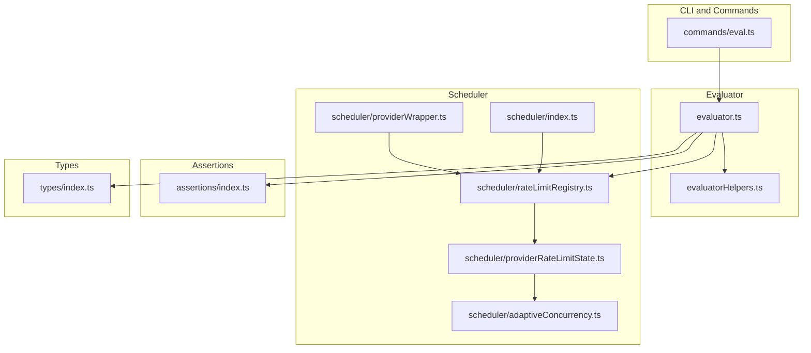
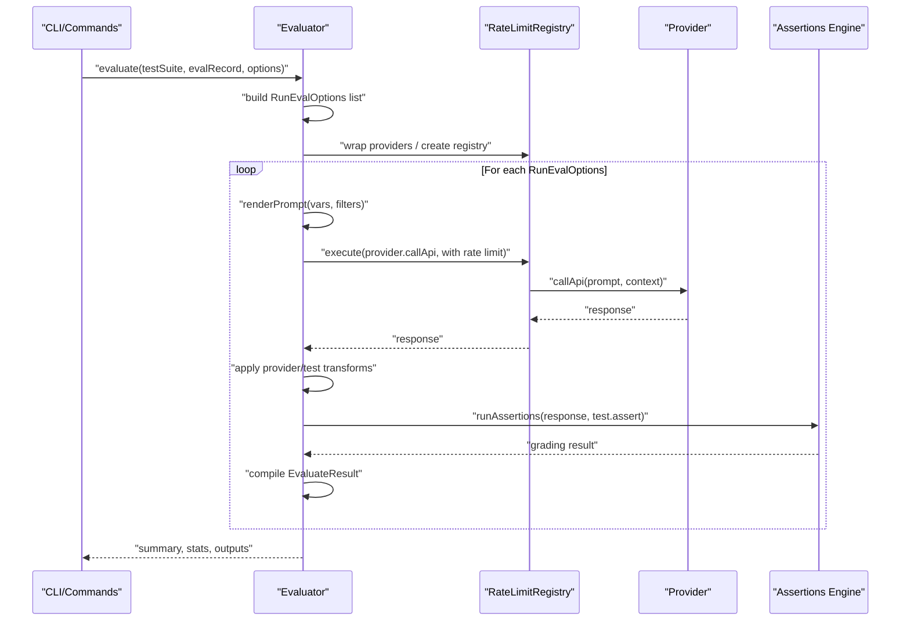
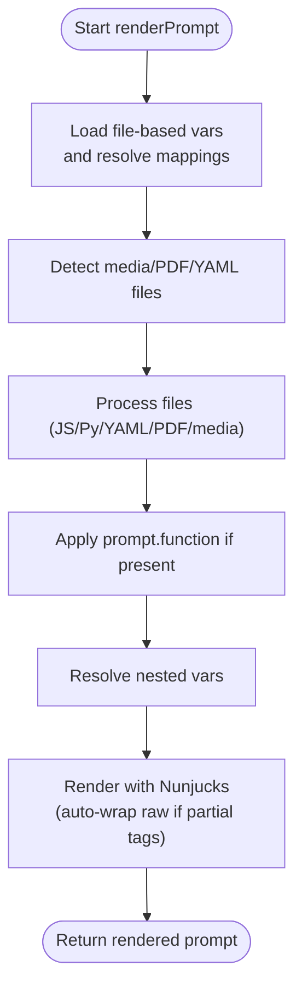
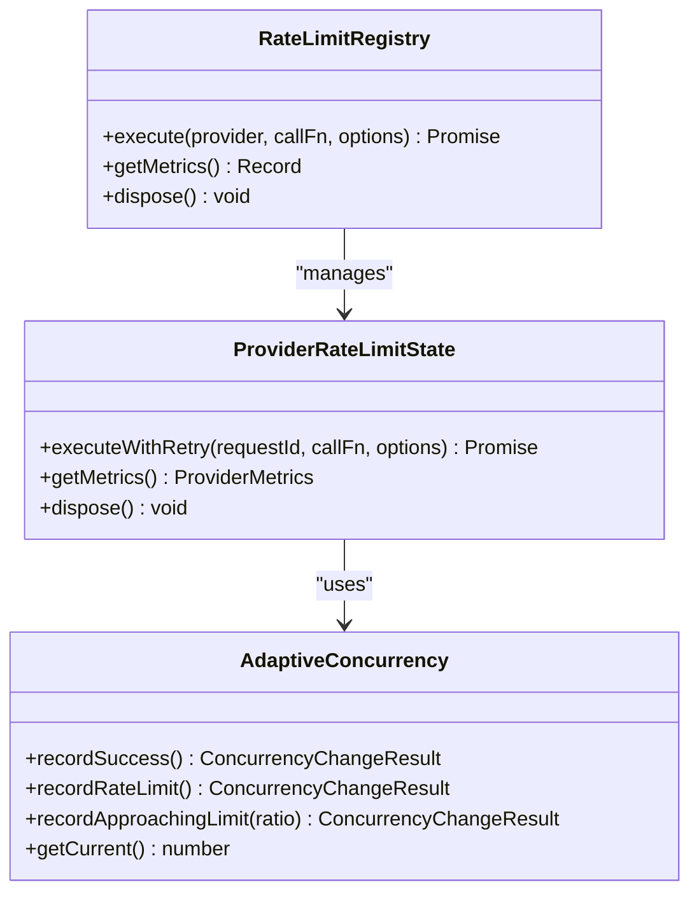
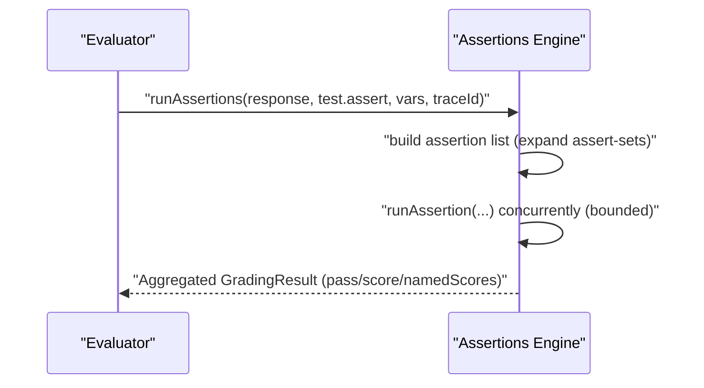
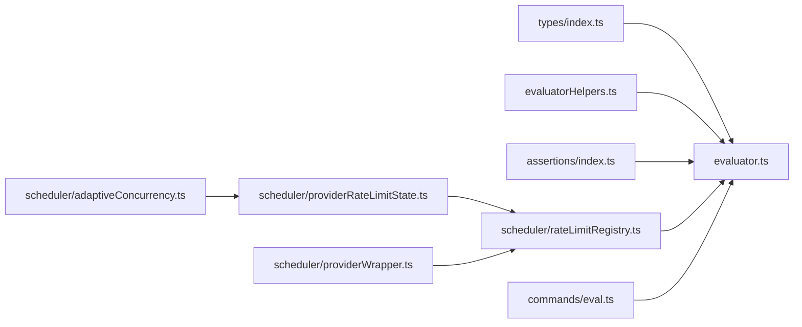

# Evaluation Pipeline

<cite>
**Referenced Files in This Document**
- [evaluator.ts](file://src/evaluator.ts)
- [evaluatorHelpers.ts](file://src/evaluatorHelpers.ts)
- [scheduler/index.ts](file://src/scheduler/index.ts)
- [scheduler/adaptiveConcurrency.ts](file://src/scheduler/adaptiveConcurrency.ts)
- [scheduler/rateLimitRegistry.ts](file://src/scheduler/rateLimitRegistry.ts)
- [scheduler/providerWrapper.ts](file://src/scheduler/providerWrapper.ts)
- [scheduler/providerRateLimitState.ts](file://src/scheduler/providerRateLimitState.ts)
- [types/index.ts](file://src/types/index.ts)
- [commands/eval.ts](file://src/commands/eval.ts)
- [assertions/index.ts](file://src/assertions/index.ts)
- [util/config/default.ts](file://src/util/config/default.ts)
</cite>

## Table of Contents
1. [Introduction](#introduction)
2. [Project Structure](#project-structure)
3. [Core Components](#core-components)
4. [Architecture Overview](#architecture-overview)
5. [Detailed Component Analysis](#detailed-component-analysis)
6. [Dependency Analysis](#dependency-analysis)
7. [Performance Considerations](#performance-considerations)
8. [Troubleshooting Guide](#troubleshooting-guide)
9. [Conclusion](#conclusion)

## Introduction
This document explains PromptFoo’s evaluation pipeline end-to-end. It covers how configuration is parsed, how test cases are generated and transformed, how providers are executed under adaptive rate limiting, how assertions are processed, and how results are aggregated and summarized. It also documents the RunEvalOptions interface and how individual evaluations are orchestrated, along with the relationship between EvaluateOptions, provider wrappers, and the scheduler system. Practical examples illustrate how prompts, variables, and assertions flow through the pipeline, and guidance is provided on performance, concurrency controls, and error handling.

## Project Structure
The evaluation pipeline spans several modules:
- Command layer: parses CLI and loads configuration, then invokes the evaluator.
- Evaluator: orchestrates test case execution, provider calls, assertion processing, and result aggregation.
- Scheduler: adaptive rate limiting and concurrency control for provider calls.
- Assertions: assertion engine that evaluates outputs against criteria.
- Helpers: prompt rendering, file metadata collection, extension hooks, and tracing.

**Diagram sources**
- [commands/eval.ts:1-800](file://src/commands/eval.ts#L1-L800)
- [evaluator.ts:1-800](file://src/evaluator.ts#L1-L800)
- [evaluatorHelpers.ts:1-714](file://src/evaluatorHelpers.ts#L1-L714)
- [scheduler/rateLimitRegistry.ts:1-146](file://src/scheduler/rateLimitRegistry.ts#L1-L146)
- [scheduler/providerRateLimitState.ts:1-398](file://src/scheduler/providerRateLimitState.ts#L1-L398)
- [scheduler/adaptiveConcurrency.ts:1-143](file://src/scheduler/adaptiveConcurrency.ts#L1-L143)
- [scheduler/providerWrapper.ts:1-140](file://src/scheduler/providerWrapper.ts#L1-L140)
- [scheduler/index.ts:1-61](file://src/scheduler/index.ts#L1-L61)
- [assertions/index.ts:1-669](file://src/assertions/index.ts#L1-L669)
- [types/index.ts:1-800](file://src/types/index.ts#L1-L800)

**Section sources**
- [commands/eval.ts:1-800](file://src/commands/eval.ts#L1-L800)
- [evaluator.ts:1-800](file://src/evaluator.ts#L1-L800)
- [evaluatorHelpers.ts:1-714](file://src/evaluatorHelpers.ts#L1-L714)
- [scheduler/index.ts:1-61](file://src/scheduler/index.ts#L1-L61)

## Core Components
- RunEvalOptions: encapsulates a single evaluation step (provider, prompt, test case, vars, delays, conversation/session state, and optional rate limit registry).
- EvaluateOptions: global evaluation settings (max concurrency, delay, cache, timeouts, progress callbacks).
- RateLimitRegistry: per-evaluation registry managing provider rate limit state and adaptive concurrency.
- ProviderRateLimitState: tracks provider-specific limits, queues slots, and adapts concurrency.
- AdaptiveConcurrency: learns and adjusts concurrency based on rate limit feedback.
- Provider wrappers: add rate limiting to providers for consistent control outside the main evaluator.
- Assertions engine: executes assertion sets and scoring functions, aggregates results.
- Evaluator: renders prompts, calls providers, applies transforms, runs assertions, and compiles results.

**Section sources**
- [types/index.ts:174-211](file://src/types/index.ts#L174-L211)
- [types/index.ts:213-257](file://src/types/index.ts#L213-L257)
- [scheduler/rateLimitRegistry.ts:1-146](file://src/scheduler/rateLimitRegistry.ts#L1-L146)
- [scheduler/providerRateLimitState.ts:1-398](file://src/scheduler/providerRateLimitState.ts#L1-L398)
- [scheduler/adaptiveConcurrency.ts:1-143](file://src/scheduler/adaptiveConcurrency.ts#L1-L143)
- [scheduler/providerWrapper.ts:1-140](file://src/scheduler/providerWrapper.ts#L1-L140)
- [assertions/index.ts:514-617](file://src/assertions/index.ts#L514-L617)
- [evaluator.ts:291-695](file://src/evaluator.ts#L291-L695)

## Architecture Overview
The evaluation lifecycle:
1. Configuration parsing and resolution: load default config, merge CLI overrides, filter tests/providers, and resolve runtime options.
2. Test case generation: expand scenarios/tests, apply filters, and compute the cross-product of prompts × providers × vars × repeats.
3. Execution orchestration: create a rate limit registry, optionally wrap providers, and schedule evaluations with adaptive concurrency.
4. Provider execution: render prompts, call providers (with rate limiting), apply provider/test transforms, and extract binary data.
5. Assertion processing: run assertions concurrently (subject to concurrency limits), aggregate scores, and compute named metrics.
6. Result compilation: compile per-test results, update token usage, and produce summaries and tables.

**Diagram sources**
- [commands/eval.ts:605-610](file://src/commands/eval.ts#L605-L610)
- [evaluator.ts:291-695](file://src/evaluator.ts#L291-L695)
- [scheduler/rateLimitRegistry.ts:42-89](file://src/scheduler/rateLimitRegistry.ts#L42-L89)
- [assertions/index.ts:514-617](file://src/assertions/index.ts#L514-L617)

## Detailed Component Analysis

### RunEvalOptions and EvaluateOptions
- RunEvalOptions defines a single evaluation step: provider, prompt, test case, vars, delay, conversation/session registers, and optional rate limit registry. It is the unit of work scheduled and executed concurrently.
- EvaluateOptions defines global evaluation behavior: max concurrency, delay, cache, timeouts, progress callbacks, and flags like silent/isRedteam.

Practical example flow:
- A prompt template and vars are merged; the prompt is rendered; provider.callApi is invoked; provider and test transforms are applied; assertions are evaluated; results are compiled.

**Section sources**
- [types/index.ts:174-211](file://src/types/index.ts#L174-L211)
- [types/index.ts:213-257](file://src/types/index.ts#L213-L257)
- [evaluator.ts:291-308](file://src/evaluator.ts#L291-L308)

### Prompt Rendering and Variable Resolution
- Prompt rendering uses Nunjucks with optional raw wrapping for partial tags, supports file-based vars (images, videos, audio, PDFs, YAML), and resolves nested variable references.
- File metadata is collected for tracked outputs and assertions.
- Special handling for red team tests skips rendering of injection variables to avoid double-evaluation.

**Diagram sources**
- [evaluatorHelpers.ts:220-496](file://src/evaluatorHelpers.ts#L220-L496)

**Section sources**
- [evaluatorHelpers.ts:100-131](file://src/evaluatorHelpers.ts#L100-L131)
- [evaluatorHelpers.ts:220-496](file://src/evaluatorHelpers.ts#L220-L496)

### Provider Execution and Rate Limiting
- Providers are wrapped with rate limiting when a registry is provided. Calls are executed with retry logic and adaptive concurrency.
- ProviderRateLimitState updates limits from headers, marks rate limits, and proactively reduces concurrency when thresholds are approached.
- AdaptiveConcurrency increases concurrency after sustained success and decreases it upon rate limit hits or proactive warnings.

**Diagram sources**
- [scheduler/rateLimitRegistry.ts:19-137](file://src/scheduler/rateLimitRegistry.ts#L19-L137)
- [scheduler/providerRateLimitState.ts:84-397](file://src/scheduler/providerRateLimitState.ts#L84-L397)
- [scheduler/adaptiveConcurrency.ts:29-142](file://src/scheduler/adaptiveConcurrency.ts#L29-L142)

**Section sources**
- [evaluator.ts:452-470](file://src/evaluator.ts#L452-L470)
- [scheduler/providerWrapper.ts:93-125](file://src/scheduler/providerWrapper.ts#L93-L125)
- [scheduler/rateLimitRegistry.ts:42-89](file://src/scheduler/rateLimitRegistry.ts#L42-L89)
- [scheduler/providerRateLimitState.ts:127-253](file://src/scheduler/providerRateLimitState.ts#L127-L253)
- [scheduler/adaptiveConcurrency.ts:46-129](file://src/scheduler/adaptiveConcurrency.ts#L46-L129)

### Assertion Processing and Scoring
- Assertions are executed concurrently up to a bounded limit. Assertion sets and weights are supported, and special assertions (select-best, max-score) are deferred until all outputs are available.
- Model-graded assertions integrate with grader providers and tracing contexts. Named metrics are computed and tracked.

**Diagram sources**
- [assertions/index.ts:514-617](file://src/assertions/index.ts#L514-L617)
- [assertions/index.ts:252-512](file://src/assertions/index.ts#L252-L512)

**Section sources**
- [assertions/index.ts:103-120](file://src/assertions/index.ts#L103-L120)
- [assertions/index.ts:514-617](file://src/assertions/index.ts#L514-L617)

### Result Compilation and Aggregation
- Evaluator compiles EvaluateResult objects, tracks token usage, extracts session IDs, and stores binary data references for large outputs.
- Progress bars and metrics are updated per evaluation step. Final summaries and tables are generated.

**Section sources**
- [evaluator.ts:517-662](file://src/evaluator.ts#L517-L662)
- [evaluator.ts:115-234](file://src/evaluator.ts#L115-L234)

### Orchestration and CLI Integration
- The CLI command loads configuration, merges overrides, sets runtime options (max concurrency, delay, cache), filters tests/providers, and invokes the evaluator.
- It supports resume and retry modes, graceful shutdown, and sharing results.

**Section sources**
- [commands/eval.ts:84-800](file://src/commands/eval.ts#L84-L800)
- [util/config/default.ts:24-55](file://src/util/config/default.ts#L24-L55)

## Dependency Analysis
- Evaluator depends on:
  - Types (RunEvalOptions, EvaluateOptions, EvaluateResult)
  - Scheduler (registry, provider state, adaptive concurrency)
  - Assertions (assertion engine)
  - Helpers (prompt rendering, file metadata, extension hooks)
- Scheduler is decoupled from provider implementations and operates via rate limit keys and headers.
- Assertions are provider-agnostic and can invoke grader providers with tracing context.

**Diagram sources**
- [types/index.ts:1-800](file://src/types/index.ts#L1-L800)
- [evaluator.ts:1-800](file://src/evaluator.ts#L1-L800)
- [evaluatorHelpers.ts:1-714](file://src/evaluatorHelpers.ts#L1-L714)
- [assertions/index.ts:1-669](file://src/assertions/index.ts#L1-L669)
- [scheduler/rateLimitRegistry.ts:1-146](file://src/scheduler/rateLimitRegistry.ts#L1-L146)
- [scheduler/providerRateLimitState.ts:1-398](file://src/scheduler/providerRateLimitState.ts#L1-L398)
- [scheduler/adaptiveConcurrency.ts:1-143](file://src/scheduler/adaptiveConcurrency.ts#L1-L143)
- [scheduler/providerWrapper.ts:1-140](file://src/scheduler/providerWrapper.ts#L1-L140)
- [commands/eval.ts:1-800](file://src/commands/eval.ts#L1-L800)

**Section sources**
- [types/index.ts:1-800](file://src/types/index.ts#L1-L800)
- [evaluator.ts:1-800](file://src/evaluator.ts#L1-L800)
- [scheduler/index.ts:1-61](file://src/scheduler/index.ts#L1-L61)

## Performance Considerations
- Concurrency control:
  - Max concurrency is configurable and can be overridden by CLI or config. When a delay is set, concurrency is forced to 1.
  - Adaptive concurrency increases throughput after sustained success and proactively reduces when limits are near exhaustion.
- Rate limiting:
  - Limits are learned from response headers and enforced via a slot queue. Retry policies govern backoff and retry behavior.
- Transform and assertion overhead:
  - Provider and test transforms are applied before assertions. Large binary outputs are extracted to avoid token bloat in model-graded assertions.
- Memory and progress:
  - Results are cleared from memory after summary generation to mitigate memory pressure for large runs.

[No sources needed since this section provides general guidance]

## Troubleshooting Guide
- Provider errors:
  - Errors are captured with sanitized metadata and logged with context (provider ID, status, response snippet). Abort errors are suppressed to avoid noisy logs.
- Rate limit handling:
  - When rate limits are hit, the system retries with backoff and adapts concurrency. Persistent rate limits trigger a sentinel error to prevent double counting.
- Assertion failures:
  - Assertion results include reasons and named metrics. For model-graded assertions, trace context is attached for debugging.
- Configuration and environment:
  - Missing API keys are detected early. Environment files can be loaded via CLI options.

**Section sources**
- [evaluator.ts:663-694](file://src/evaluator.ts#L663-L694)
- [scheduler/providerRateLimitState.ts:176-251](file://src/scheduler/providerRateLimitState.ts#L176-L251)
- [assertions/index.ts:480-512](file://src/assertions/index.ts#L480-L512)
- [commands/eval.ts:445-460](file://src/commands/eval.ts#L445-L460)

## Conclusion
PromptFoo’s evaluation pipeline is designed for reliability and scalability. Configuration is parsed and merged early, test cases are generated systematically, and provider calls are executed under adaptive rate limiting with robust retry logic. Assertions are processed concurrently with careful attention to performance and correctness. The evaluator compiles results, tracks metrics, and produces actionable summaries. Together, these components form a cohesive system for automated evaluation of language model prompts and providers.