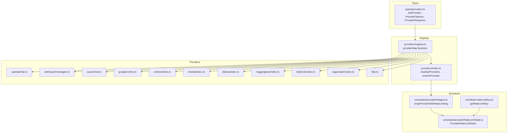
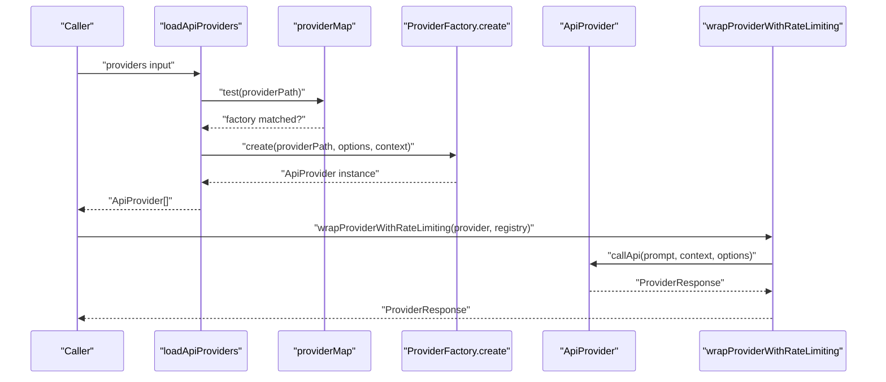
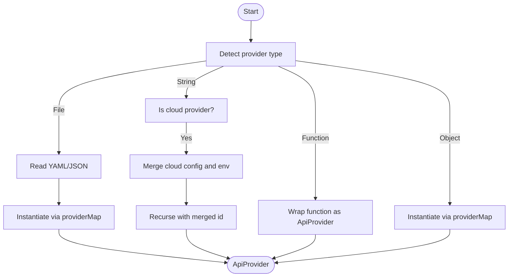
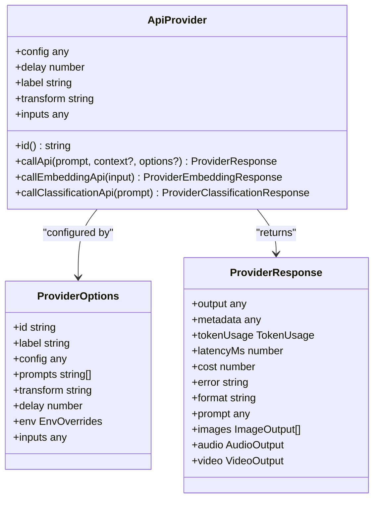
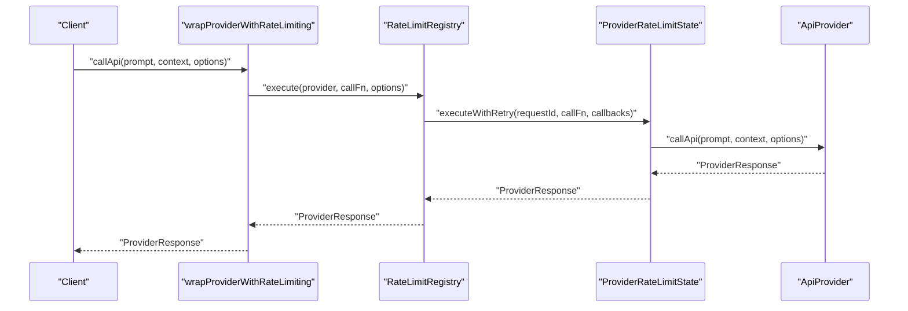
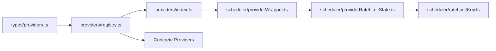

# Provider Abstraction

<cite>
**Referenced Files in This Document**
- [providers/index.ts](file://src/providers/index.ts)
- [providers/registry.ts](file://src/providers/registry.ts)
- [types/providers.ts](file://src/types/providers.ts)
- [scheduler/providerWrapper.ts](file://src/scheduler/providerWrapper.ts)
- [scheduler/rateLimitKey.ts](file://src/scheduler/rateLimitKey.ts)
- [scheduler/providerRateLimitState.ts](file://src/scheduler/providerRateLimitState.ts)
- [providers/http.ts](file://src/providers/http.ts)
- [providers/openai/chat.ts](file://src/providers/openai/chat.ts)
- [providers/anthropic/messages.ts](file://src/providers/anthropic/messages.ts)
- [providers/azure/chat.ts](file://src/providers/azure/chat.ts)
- [providers/google/vertex.ts](file://src/providers/google/vertex.ts)
- [providers/cohere/index.ts](file://src/providers/cohere/index.ts)
- [providers/mistral/index.ts](file://src/providers/mistral/index.ts)
- [providers/ollama/index.ts](file://src/providers/ollama/index.ts)
- [providers/huggingface/index.ts](file://src/providers/huggingface/index.ts)
- [providers/bedrock/index.ts](file://src/providers/bedrock/index.ts)
- [providers/sagemaker/index.ts](file://src/providers/sagemaker/index.ts)
- [providers/customProvider.js](file://examples/custom-provider/customProvider.js)
- [providers/customProvider.ts](file://examples/custom-provider-typescript/customProvider.ts)
- [providers/customProvider.mjs](file://examples/custom-provider-mjs/customProvider.mjs)
</cite>

## Table of Contents
1. [Introduction](#introduction)
2. [Project Structure](#project-structure)
3. [Core Components](#core-components)
4. [Architecture Overview](#architecture-overview)
5. [Detailed Component Analysis](#detailed-component-analysis)
6. [Dependency Analysis](#dependency-analysis)
7. [Performance Considerations](#performance-considerations)
8. [Troubleshooting Guide](#troubleshooting-guide)
9. [Conclusion](#conclusion)
10. [Appendices](#appendices)

## Introduction
This document explains PromptFoo’s provider abstraction layer: how different AI services are unified under a common ApiProvider interface, how providers are discovered and instantiated, how authentication and configuration are handled, how provider responses are normalized, and how the provider wrapper system enforces rate limiting and retry logic. It also covers the provider registry, ProviderOptions schema, and practical examples for supported providers and custom implementations.

## Project Structure
The provider abstraction spans several modules:
- Types define the ApiProvider contract and ProviderResponse shape.
- The registry maps provider identifiers to factory functions that instantiate providers.
- Loader utilities resolve provider strings, files, and functions into concrete ApiProvider instances.
- Scheduler wrappers add rate limiting, retries, and adaptive concurrency around any ApiProvider.
- Individual provider implementations encapsulate service-specific logic.

**Diagram sources**
- [types/providers.ts:102-120](file://src/types/providers.ts#L102-L120)
- [providers/registry.ts:143-1759](file://src/providers/registry.ts#L143-L1759)
- [providers/index.ts:31-177](file://src/providers/index.ts#L31-L177)
- [scheduler/providerWrapper.ts:93-140](file://src/scheduler/providerWrapper.ts#L93-L140)
- [scheduler/rateLimitKey.ts:9-42](file://src/scheduler/rateLimitKey.ts#L9-L42)
- [scheduler/providerRateLimitState.ts:101-137](file://src/scheduler/providerRateLimitState.ts#L101-L137)

**Section sources**
- [types/providers.ts:102-120](file://src/types/providers.ts#L102-L120)
- [providers/registry.ts:143-1759](file://src/providers/registry.ts#L143-L1759)
- [providers/index.ts:31-177](file://src/providers/index.ts#L31-L177)
- [scheduler/providerWrapper.ts:93-140](file://src/scheduler/providerWrapper.ts#L93-L140)
- [scheduler/rateLimitKey.ts:9-42](file://src/scheduler/rateLimitKey.ts#L9-L42)
- [scheduler/providerRateLimitState.ts:101-137](file://src/scheduler/providerRateLimitState.ts#L101-L137)

## Core Components
- ApiProvider: The core interface that all providers implement. It defines id(), callApi(), and optional specialized APIs (e.g., embeddings, classification, moderation). It also supports optional fields for configuration, labeling, delays, and transforms.
- ProviderOptions: A flexible configuration container that carries provider identity, labels, environment overrides, per-provider config, and optional transforms/delays/inputs.
- ProviderResponse: The normalized output shape returned by providers, including output, metadata, token usage, latency, and optional media fields (audio, video, images).
- Provider factories: Registry entries that recognize provider identifiers and construct the appropriate provider instance.

Key responsibilities:
- Unified interface: callApi(prompt, context?, options?) returns ProviderResponse.
- Normalized outputs: All providers produce a consistent response shape.
- Configurable behavior: ProviderOptions controls authentication, base paths, labels, delays, and transforms.
- Dynamic discovery: providerMap routes provider identifiers to concrete implementations.

**Section sources**
- [types/providers.ts:50-59](file://src/types/providers.ts#L50-L59)
- [types/providers.ts:102-120](file://src/types/providers.ts#L102-L120)
- [types/providers.ts:145-218](file://src/types/providers.ts#L145-L218)
- [providers/registry.ts:127-134](file://src/providers/registry.ts#L127-L134)

## Architecture Overview
The provider abstraction follows a layered design:
- Loader layer: Parses provider strings, files, and functions into ProviderOptions and instantiates ApiProvider instances.
- Registry layer: Matches provider identifiers to factory functions and constructs provider instances.
- Provider layer: Implements service-specific logic behind the ApiProvider interface.
- Wrapper layer: Adds rate limiting, retries, and adaptive concurrency around any ApiProvider.

**Diagram sources**
- [providers/index.ts:345-417](file://src/providers/index.ts#L345-L417)
- [providers/registry.ts:127-134](file://src/providers/registry.ts#L127-L134)
- [scheduler/providerWrapper.ts:93-125](file://src/scheduler/providerWrapper.ts#L93-L125)

## Detailed Component Analysis

### ApiProvider Interface and ProviderResponse Normalization
- ApiProvider contract:
  - id(): string
  - callApi(prompt, context?, options?): Promise<ProviderResponse>
  - Optional: callEmbeddingApi, callClassificationApi, callModerationApi
  - Optional fields: config, delay, getSessionId, inputs, label, transform, toJSON, cleanup
- ProviderResponse normalization:
  - Standard fields: output, metadata, tokenUsage, latencyMs, cost, error
  - Optional media: audio, video, images
  - Additional: prompt override, format hints, guardrails, finishReason, sessionId

Benefits:
- Consistent evaluation and assertion logic across providers.
- Transparent handling of differences in provider capabilities and output formats.

**Section sources**
- [types/providers.ts:102-120](file://src/types/providers.ts#L102-L120)
- [types/providers.ts:145-218](file://src/types/providers.ts#L145-L218)

### Provider Options Schema and Environment Handling
ProviderOptions supports:
- id: Provider identifier or alias
- label: Human-readable label
- config: Provider-specific configuration (e.g., API keys, base URLs, regions)
- prompts: Optional filter to restrict prompts for a provider
- transform: Optional transform script applied to outputs
- delay: Per-request delay in milliseconds
- env: Environment overrides merged from context, cloud, and local sources
- inputs: Optional inputs passed to callApi

Environment merging:
- Context env (test suite) forms the base.
- Cloud provider env overrides context.
- Local env overrides everything.

Rendered templates:
- At load time, environment-only templates are rendered for provider initialization.
- Runtime templates (e.g., variable substitutions) are preserved for callApi.

**Section sources**
- [types/providers.ts:50-59](file://src/types/providers.ts#L50-L59)
- [providers/index.ts:39-48](file://src/providers/index.ts#L39-L48)
- [providers/index.ts:94-99](file://src/providers/index.ts#L94-L99)

### Provider Registry and Dynamic Loading
The registry uses a providerMap of factories:
- Each factory exposes test(providerPath) and create(providerPath, options, context).
- Supported patterns include service prefixes (e.g., anthropic:, azure:, openai:), file references (file://...), and function providers.

Loading pipeline:
- loadApiProviders accepts strings, arrays, functions, or objects.
- resolveProvider optimizes by checking providerMap directly for strings.
- loadApiProvider handles:
  - Cloud provider resolution and merging of overrides.
  - File-based provider configs (.yaml/.yml/.json).
  - Factory-based instantiation via providerMap.
  - Error reporting with helpful guidance.

**Diagram sources**
- [providers/index.ts:31-177](file://src/providers/index.ts#L31-L177)
- [providers/index.ts:345-417](file://src/providers/index.ts#L345-L417)

**Section sources**
- [providers/registry.ts:143-1759](file://src/providers/registry.ts#L143-L1759)
- [providers/index.ts:31-177](file://src/providers/index.ts#L31-L177)
- [providers/index.ts:345-417](file://src/providers/index.ts#L345-L417)

### Authentication, Rate Limits, and Provider-Specific Configurations
- Authentication:
  - Many providers rely on environment variables (e.g., API keys).
  - Some providers support explicit ProviderOptions.config fields (e.g., base URLs, organization).
  - HTTP provider supports multiple auth schemes (basic, bearer, API key, OAuth client credentials/password) with strict validation.
- Rate limits:
  - getRateLimitKey derives a stable key from provider id plus relevant config (e.g., apiKey tail, region, organization).
  - ProviderRateLimitState manages concurrency, retries, and adaptive adjustments.
  - wrapProviderWithRateLimiting injects rate-limit-aware execution around any ApiProvider.

**Diagram sources**
- [types/providers.ts:102-120](file://src/types/providers.ts#L102-L120)
- [types/providers.ts:50-59](file://src/types/providers.ts#L50-L59)
- [types/providers.ts:145-218](file://src/types/providers.ts#L145-L218)

**Section sources**
- [scheduler/rateLimitKey.ts:9-42](file://src/scheduler/rateLimitKey.ts#L9-L42)
- [scheduler/providerRateLimitState.ts:101-137](file://src/scheduler/providerRateLimitState.ts#L101-L137)
- [scheduler/providerWrapper.ts:93-125](file://src/scheduler/providerWrapper.ts#L93-L125)
- [providers/http.ts:739-826](file://src/providers/http.ts#L739-L826)

### Provider Wrapper System for Rate Limiting and Retry Logic
The wrapper system:
- Prevents double-wrapping using a symbol marker.
- Delegates id() to preserve provider identity.
- Wraps callApi to route through RateLimitRegistry.execute with:
  - getHeaders: extracts response headers from ProviderResponse.
  - isRateLimited: detects rate-limited responses.
  - getRetryAfter: parses retry-after headers (ms or seconds) and error messages.

**Diagram sources**
- [scheduler/providerWrapper.ts:93-125](file://src/scheduler/providerWrapper.ts#L93-L125)
- [scheduler/providerRateLimitState.ts:127-137](file://src/scheduler/providerRateLimitState.ts#L127-L137)

**Section sources**
- [scheduler/providerWrapper.ts:23-81](file://src/scheduler/providerWrapper.ts#L23-L81)
- [scheduler/providerWrapper.ts:93-140](file://src/scheduler/providerWrapper.ts#L93-L140)
- [scheduler/providerRateLimitState.ts:127-137](file://src/scheduler/providerRateLimitState.ts#L127-L137)

### Supported Providers and Examples
Below are representative providers and where to find their implementations. These are organized by service family:

- OpenAI
  - Chat completions: [providers/openai/chat.ts](file://src/providers/openai/chat.ts)
- Anthropic
  - Messages: [providers/anthropic/messages.ts](file://src/providers/anthropic/messages.ts)
- Azure OpenAI
  - Chat completions: [providers/azure/chat.ts](file://src/providers/azure/chat.ts)
- Google Vertex AI
  - Chat and embeddings: [providers/google/vertex.ts](file://src/providers/google/vertex.ts)
- Cohere
  - Chat and embeddings: [providers/cohere/index.ts](file://src/providers/cohere/index.ts)
- Mistral
  - Chat and embeddings: [providers/mistral/index.ts](file://src/providers/mistral/index.ts)
- Ollama
  - Chat, completion, embeddings: [providers/ollama/index.ts](file://src/providers/ollama/index.ts)
- Hugging Face
  - Chat, embeddings, classification, generation: [providers/huggingface/index.ts](file://src/providers/huggingface/index.ts)
- AWS Bedrock
  - Completions, embeddings, agents, video: [providers/bedrock/index.ts](file://src/providers/bedrock/index.ts)
- AWS SageMaker
  - Completions and embeddings: [providers/sagemaker/index.ts](file://src/providers/sagemaker/index.ts)
- HTTP
  - Generic HTTP provider with auth schemas: [providers/http.ts:739-826](file://src/providers/http.ts#L739-L826)

Examples of custom providers:
- JavaScript: [examples/custom-provider/customProvider.js](file://examples/custom-provider/customProvider.js)
- TypeScript: [examples/custom-provider-typescript/customProvider.ts](file://examples/custom-provider-typescript/customProvider.ts)
- ES Module: [examples/custom-provider-mjs/customProvider.mjs](file://examples/custom-provider-mjs/customProvider.mjs)

Implementation tips:
- Implement the ApiProvider interface (id and callApi).
- Return a ProviderResponse with normalized fields.
- Optionally implement embedding/classification/moderation APIs if applicable.
- Use ProviderOptions.config to read environment variables and service-specific settings.

**Section sources**
- [providers/openai/chat.ts](file://src/providers/openai/chat.ts)
- [providers/anthropic/messages.ts](file://src/providers/anthropic/messages.ts)
- [providers/azure/chat.ts](file://src/providers/azure/chat.ts)
- [providers/google/vertex.ts](file://src/providers/google/vertex.ts)
- [providers/cohere/index.ts](file://src/providers/cohere/index.ts)
- [providers/mistral/index.ts](file://src/providers/mistral/index.ts)
- [providers/ollama/index.ts](file://src/providers/ollama/index.ts)
- [providers/huggingface/index.ts](file://src/providers/huggingface/index.ts)
- [providers/bedrock/index.ts](file://src/providers/bedrock/index.ts)
- [providers/sagemaker/index.ts](file://src/providers/sagemaker/index.ts)
- [providers/http.ts:739-826](file://src/providers/http.ts#L739-L826)
- [examples/custom-provider/customProvider.js](file://examples/custom-provider/customProvider.js)
- [examples/custom-provider-typescript/customProvider.ts](file://examples/custom-provider-typescript/customProvider.ts)
- [examples/custom-provider-mjs/customProvider.mjs](file://examples/custom-provider-mjs/customProvider.mjs)

## Dependency Analysis
The provider abstraction exhibits low coupling and high cohesion:
- Types define the contract; implementations depend on it.
- Registry decouples provider identification from instantiation.
- Loader centralizes environment merging and file resolution.
- Wrapper composes behavior without modifying provider internals.

**Diagram sources**
- [types/providers.ts:102-120](file://src/types/providers.ts#L102-L120)
- [providers/registry.ts:143-1759](file://src/providers/registry.ts#L143-L1759)
- [providers/index.ts:31-177](file://src/providers/index.ts#L31-L177)
- [scheduler/providerWrapper.ts:93-125](file://src/scheduler/providerWrapper.ts#L93-L125)
- [scheduler/providerRateLimitState.ts:101-137](file://src/scheduler/providerRateLimitState.ts#L101-L137)
- [scheduler/rateLimitKey.ts:9-42](file://src/scheduler/rateLimitKey.ts#L9-L42)

**Section sources**
- [types/providers.ts:102-120](file://src/types/providers.ts#L102-L120)
- [providers/registry.ts:143-1759](file://src/providers/registry.ts#L143-L1759)
- [providers/index.ts:31-177](file://src/providers/index.ts#L31-L177)
- [scheduler/providerWrapper.ts:93-125](file://src/scheduler/providerWrapper.ts#L93-L125)
- [scheduler/providerRateLimitState.ts:101-137](file://src/scheduler/providerRateLimitState.ts#L101-L137)
- [scheduler/rateLimitKey.ts:9-42](file://src/scheduler/rateLimitKey.ts#L9-L42)

## Performance Considerations
- Adaptive concurrency: ProviderRateLimitState adjusts concurrency based on sustained success or rate-limit events to maximize throughput while respecting provider quotas.
- Header-driven retry: The wrapper parses retry-after headers (both milliseconds and seconds) to schedule backoff precisely.
- Stable rate-limit keys: getRateLimitKey hashes relevant config to group requests appropriately without leaking secrets.
- Minimize overhead: The wrapper avoids copying unnecessary fields and delegates id() explicitly to preserve performance.

[No sources needed since this section provides general guidance]

## Troubleshooting Guide
Common issues and resolutions:
- Unknown provider identifier:
  - Ensure the providerPath matches a registered pattern or is a valid file reference.
  - Confirm environment variables are set for required credentials.
- Cloud provider loops:
  - Cloud providers must resolve to a concrete provider, not another cloud provider.
- File-based provider misconfiguration:
  - YAML/JSON must contain a single provider config when using loadApiProvider; use loadApiProviders for arrays.
- Rate-limiting spikes:
  - Increase queueTimeoutMs or reduce maxConcurrency in ProviderRateLimitState options.
  - Verify retry-after headers are present and parsed correctly.

**Section sources**
- [providers/index.ts:167-177](file://src/providers/index.ts#L167-L177)
- [providers/index.ts:130-134](file://src/providers/index.ts#L130-L134)
- [scheduler/providerWrapper.ts:46-81](file://src/scheduler/providerWrapper.ts#L46-L81)

## Conclusion
PromptFoo’s provider abstraction cleanly unifies diverse AI services behind a single ApiProvider interface. The registry and loader system enable dynamic discovery and instantiation, while ProviderOptions centralizes configuration and environment handling. The wrapper system ensures robust, efficient execution under provider rate limits and failures. This design makes it straightforward to integrate new providers and maintain consistent evaluation behavior across heterogeneous backends.

[No sources needed since this section summarizes without analyzing specific files]

## Appendices

### ProviderResponse Field Reference
- output: Final text or structured output
- metadata: Arbitrary provider metadata (e.g., HTTP status, headers)
- tokenUsage: Token counts and cost estimates
- latencyMs: Request duration
- cost: Computed cost
- error: Error message if present
- format: Output format hint (e.g., json)
- prompt: Overridden prompt for display and assertions
- images/audio/video: Media outputs with optional blob references
- providerTransformedOutput: Output after provider-level transform
- isRefusal: Whether the provider indicated refusal
- sessionId: Session identifier if supported
- guardrails: Guardrail flags and reasons
- finishReason: Reason the model stopped generating
- isBase64: Indicates base64-encoded binary data

**Section sources**
- [types/providers.ts:145-218](file://src/types/providers.ts#L145-L218)