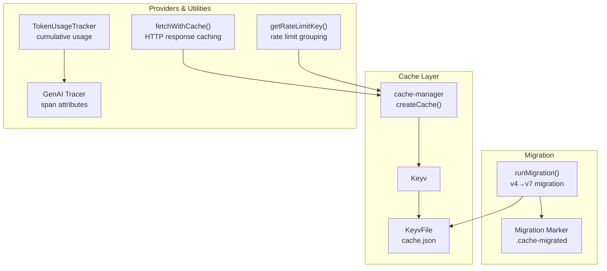
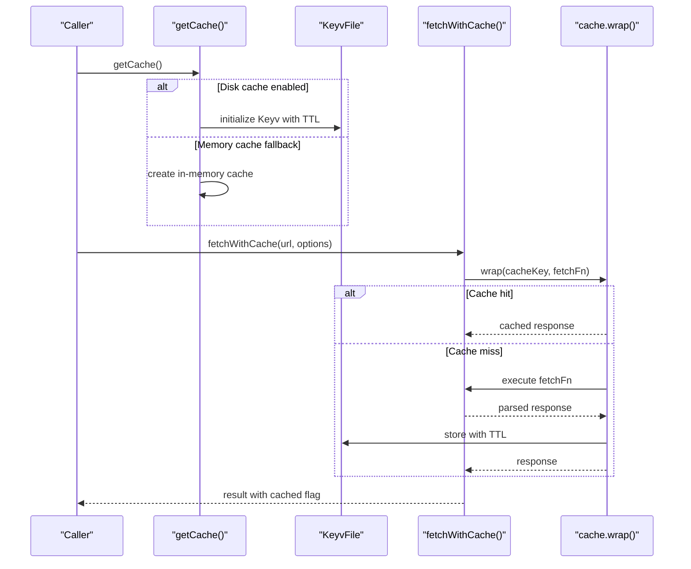
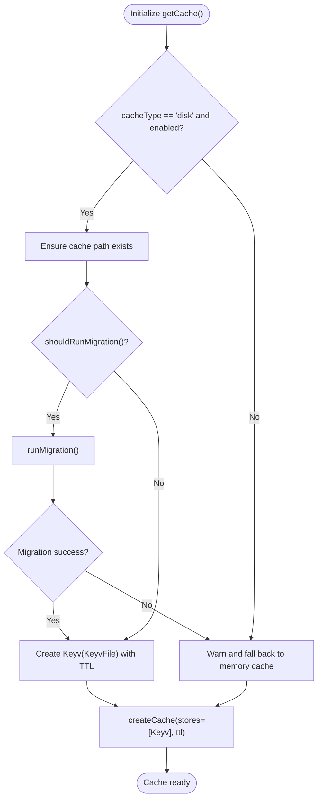
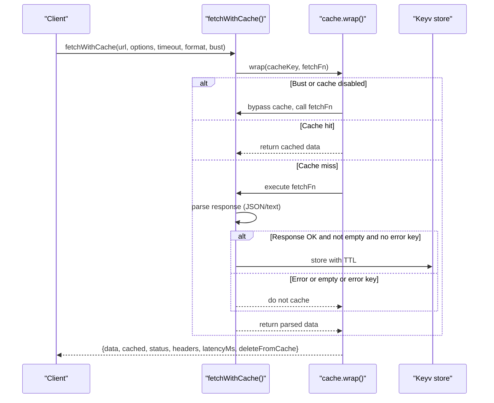
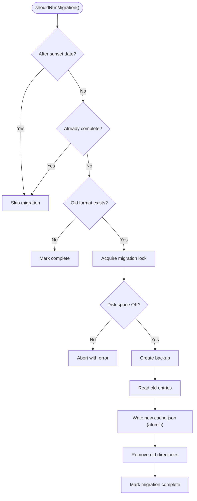
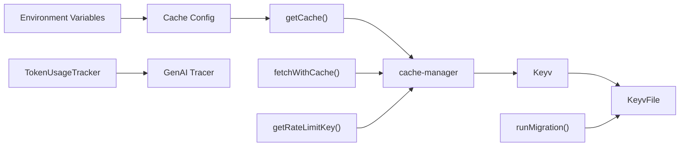

# Cache Management

<cite>
**Referenced Files in This Document**
- [cache.ts](file://src/cache.ts)
- [cacheMigration.ts](file://src/cacheMigration.ts)
- [caching.md](file://site/docs/configuration/caching.md)
- [cache.test.ts](file://test/cache.test.ts)
- [cacheMigration.test.ts](file://test/cacheMigration.test.ts)
- [rateLimitKey.ts](file://src/scheduler/rateLimitKey.ts)
- [tokenUsage.ts](file://src/util/tokenUsage.ts)
- [genaiTracer.ts](file://src/tracing/genaiTracer.ts)
- [tokenUsageCompat.ts](file://src/util/tokenUsageCompat.ts)
</cite>

## Table of Contents
1. [Introduction](#introduction)
2. [Project Structure](#project-structure)
3. [Core Components](#core-components)
4. [Architecture Overview](#architecture-overview)
5. [Detailed Component Analysis](#detailed-component-analysis)
6. [Dependency Analysis](#dependency-analysis)
7. [Performance Considerations](#performance-considerations)
8. [Troubleshooting Guide](#troubleshooting-guide)
9. [Conclusion](#conclusion)
10. [Appendices](#appendices)

## Introduction
This document explains PromptFoo’s cache management system with a focus on cache layer architecture, invalidation policies, TTL mechanisms, migration procedures, and operational guidance. It covers both memory and disk-based caching, provider response caching, token usage tracking, and rate limit state considerations. It also documents configuration options, performance tuning, monitoring, and debugging tools.

## Project Structure
PromptFoo’s cache system centers around a single cache manager instance backed by cache-manager and Keyv/Keyv-file for disk storage. A dedicated migration module supports upgrading from legacy cache formats. Supporting utilities track token usage and provide rate-limit key generation. Documentation describes configuration and operational commands.

**Diagram sources**
- [cache.ts:35-114](file://src/cache.ts#L35-L114)
- [cacheMigration.ts:642-779](file://src/cacheMigration.ts#L642-L779)
- [rateLimitKey.ts:9-42](file://src/scheduler/rateLimitKey.ts#L9-L42)
- [tokenUsage.ts:20-105](file://src/util/tokenUsage.ts#L20-L105)
- [genaiTracer.ts:57-57](file://src/tracing/genaiTracer.ts#L57-L57)

**Section sources**
- [cache.ts:1-114](file://src/cache.ts#L1-L114)
- [cacheMigration.ts:1-110](file://src/cacheMigration.ts#L1-L110)
- [caching.md:1-143](file://site/docs/configuration/caching.md#L1-L143)

## Core Components
- Cache manager initialization and selection between memory and disk storage
- Disk-backed cache using Keyv and Keyv-file
- HTTP response caching with cache keys derived from URL and request options
- Cache invalidation via TTL and manual eviction
- Cache migration from legacy formats to current Keyv-file format
- Token usage tracking and rate limit key derivation

**Section sources**
- [cache.ts:19-114](file://src/cache.ts#L19-L114)
- [cacheMigration.ts:26-800](file://src/cacheMigration.ts#L26-L800)
- [rateLimitKey.ts:9-42](file://src/scheduler/rateLimitKey.ts#L9-L42)
- [tokenUsage.ts:20-105](file://src/util/tokenUsage.ts#L20-L105)

## Architecture Overview
The cache architecture uses cache-manager with a Keyv store backed by Keyv-file for persistent disk storage. During initialization, the system detects environment conditions and applies migration logic if needed. HTTP responses are cached with a composite key that includes URL and normalized request options. TTL is enforced at the Keyv level. Manual eviction and clearing are supported. Token usage tracking complements tracing for observability.

**Diagram sources**
- [cache.ts:35-114](file://src/cache.ts#L35-L114)
- [cache.ts:162-280](file://src/cache.ts#L162-L280)

**Section sources**
- [cache.ts:35-114](file://src/cache.ts#L35-L114)
- [cache.ts:162-280](file://src/cache.ts#L162-L280)

## Detailed Component Analysis

### Cache Manager Initialization and Storage Strategy
- Storage selection:
  - Disk cache: enabled when cache type is disk and cache is enabled; creates a cache.json file under a configured path
  - Memory cache: used in test environments or when disk initialization fails
- TTL:
  - Configured via environment variable with a default of 14 days
  - Applied at the Keyv store level
- Disk space and migration:
  - Migration runs automatically when needed and is protected by a lock file
  - Backup is created before migration; cleanup removes old directories after success

**Diagram sources**
- [cache.ts:35-114](file://src/cache.ts#L35-L114)
- [cacheMigration.ts:788-800](file://src/cacheMigration.ts#L788-L800)

**Section sources**
- [cache.ts:19-114](file://src/cache.ts#L19-L114)
- [cacheMigration.ts:142-246](file://src/cacheMigration.ts#L142-L246)

### HTTP Response Caching
- Cache key composition:
  - Includes a versioned prefix, URL, and a normalized representation of request options (excluding headers)
  - Ensures idempotent methods benefit from body-read retries on transient errors
- Behavior:
  - Successful responses are cached with status, headers, latency, and parsed data
  - Error responses are not cached to allow retries
  - Empty responses are not cached
  - JSON parsing errors are surfaced with context
  - Eviction is supported via a delete function attached to results

**Diagram sources**
- [cache.ts:162-280](file://src/cache.ts#L162-L280)

**Section sources**
- [cache.ts:162-280](file://src/cache.ts#L162-L280)
- [cache.test.ts:187-494](file://test/cache.test.ts#L187-L494)

### Cache Invalidation Policies and TTL
- TTL enforcement:
  - TTL is applied at initialization and enforced by Keyv
  - Default TTL is 14 days; configurable via environment variable
- Manual invalidation:
  - Clear cache via API or CLI
  - Evict individual entries using the delete function returned by fetchWithCache
- Error and empty response handling:
  - Non-OK responses are not cached
  - Empty responses are not cached
  - Responses containing an error key are not cached

**Section sources**
- [cache.ts:24-33](file://src/cache.ts#L24-L33)
- [cache.ts:282-296](file://src/cache.ts#L282-L296)
- [caching.md:90-102](file://site/docs/configuration/caching.md#L90-L102)

### Cache Warming Procedures
- Warm-up strategy:
  - Trigger repeated calls to warm frequently accessed endpoints
  - Use cache busting to populate cache entries for specific URLs and options
- Practical guidance:
  - Warm before long-running evaluations to reduce cold-start latency
  - Combine with cache TTL tuning to balance freshness and performance

**Section sources**
- [cache.ts:162-280](file://src/cache.ts#L162-L280)
- [caching.md:128-142](file://site/docs/configuration/caching.md#L128-L142)

### Provider Response Caching
- Provider-level caching:
  - HTTP provider responses are cached via fetchWithCache
  - Cache keys incorporate URL and normalized request options
- Observability:
  - Tracing captures cache hit status as a span attribute
  - Some providers expose cached flags for downstream logic

**Section sources**
- [cache.ts:201-261](file://src/cache.ts#L201-L261)
- [genaiTracer.ts:57-57](file://src/tracing/genaiTracer.ts#L57-L57)

### Token Usage Tracking
- Cumulative tracking:
  - TokenUsageTracker maintains per-provider totals and aggregated usage
  - Deprecated in favor of tracing-based usage capture
- Tracing-based usage:
  - New implementations should rely on OpenTelemetry tracing
  - Per-call token usage is captured as span attributes

**Section sources**
- [tokenUsage.ts:20-105](file://src/util/tokenUsage.ts#L20-L105)
- [tokenUsageCompat.ts:1-200](file://src/util/tokenUsageCompat.ts#L1-L200)

### Rate Limit State Caching
- Rate limit grouping:
  - getRateLimitKey derives a stable key from provider identity and relevant config (API base URL, region, organization, and a tail of the API key)
  - This enables pooling of rate limits per provider configuration variant
- Consistency:
  - Rate limit state is not cached in the same store as HTTP responses; it is grouped for scheduling and throttling

**Section sources**
- [rateLimitKey.ts:9-42](file://src/scheduler/rateLimitKey.ts#L9-L42)

### Cache Migration Procedures and Version Compatibility
- Migration scope:
  - Moves from cache-manager-fs-hash (multiple JSON files) to keyv-file (single cache.json)
- Safety measures:
  - Lock file prevents concurrent migrations
  - Backup created before migration; old directories cleaned up after success
  - Validation ensures written cache file integrity
- Sunset policy:
  - Migration module includes a sunset date; after that date, migration is skipped and users start with a fresh cache

**Diagram sources**
- [cacheMigration.ts:788-800](file://src/cacheMigration.ts#L788-L800)
- [cacheMigration.ts:642-779](file://src/cacheMigration.ts#L642-L779)
- [cacheMigration.ts:142-246](file://src/cacheMigration.ts#L142-L246)

**Section sources**
- [cacheMigration.ts:16-24](file://src/cacheMigration.ts#L16-L24)
- [cacheMigration.ts:642-779](file://src/cacheMigration.ts#L642-L779)
- [cacheMigration.test.ts:1-503](file://test/cacheMigration.test.ts#L1-L503)

### Cache Monitoring and Debugging Tools
- CLI and programmatic cache management:
  - Clear cache via CLI or API
  - Toggle cache enable/disable at runtime
- Debugging:
  - Logging indicates cache hits, misses, and migration events
  - Tests demonstrate cache behavior, including busting and eviction

**Section sources**
- [caching.md:103-142](file://site/docs/configuration/caching.md#L103-L142)
- [cache.ts:282-296](file://src/cache.ts#L282-L296)
- [cache.test.ts:471-494](file://test/cache.test.ts#L471-L494)

### Examples of Cache Configuration for Deployment Scenarios
- Test environments:
  - Memory cache is automatic; ensure deterministic behavior
- CI/CD:
  - Persist cache directory across runs using PROMPTFOO_CACHE_PATH
  - Tune TTL for ephemeral runners
- Production:
  - Disk cache with explicit cache path and TTL
  - Monitor cache directory permissions and disk space

**Section sources**
- [caching.md:77-96](file://site/docs/configuration/caching.md#L77-L96)
- [cache.ts:19-22](file://src/cache.ts#L19-L22)

### Cache Memory Management and Garbage Collection
- Memory footprint:
  - Disk cache minimizes memory overhead; only the cache manager instance is retained
  - Migration and disk operations are designed to avoid excessive memory usage
- Cleanup:
  - Clear cache to reclaim disk space
  - Token usage tracker can be reset to prevent accumulation over long sessions

**Section sources**
- [cache.ts:107-111](file://src/cache.ts#L107-L111)
- [tokenUsage.ts:99-105](file://src/util/tokenUsage.ts#L99-L105)

### Cache Consistency Guarantees and Eventual Consistency Patterns
- Strong consistency:
  - Cache reads are consistent within the process; concurrent callers share the same cache instance
- Eventual consistency:
  - TTL-driven expiration ensures stale data is eventually evicted
  - Manual eviction and clearing provide immediate invalidation
- Provider-specific behavior:
  - Some providers may short-circuit on cache hits to avoid redundant calls

**Section sources**
- [cache.ts:107-111](file://src/cache.ts#L107-L111)
- [cache.ts:201-261](file://src/cache.ts#L201-L261)

## Dependency Analysis
The cache system integrates with:
- cache-manager and Keyv/Keyv-file for storage
- Environment variables for configuration
- Migration utilities for upgrade support
- Tracing for observability
- Token usage utilities for metrics

**Diagram sources**
- [cache.ts:19-114](file://src/cache.ts#L19-L114)
- [cacheMigration.ts:642-779](file://src/cacheMigration.ts#L642-L779)
- [rateLimitKey.ts:9-42](file://src/scheduler/rateLimitKey.ts#L9-L42)
- [tokenUsage.ts:20-105](file://src/util/tokenUsage.ts#L20-L105)
- [genaiTracer.ts:57-57](file://src/tracing/genaiTracer.ts#L57-L57)

**Section sources**
- [cache.ts:1-15](file://src/cache.ts#L1-L15)
- [cacheMigration.ts:1-10](file://src/cacheMigration.ts#L1-L10)
- [rateLimitKey.ts:1-50](file://src/scheduler/rateLimitKey.ts#L1-L50)
- [tokenUsage.ts:1-20](file://src/util/tokenUsage.ts#L1-L20)
- [genaiTracer.ts:57-57](file://src/tracing/genaiTracer.ts#L57-L57)

## Performance Considerations
- Choose disk cache for persistent, cross-run reuse; memory cache for tests
- Tune TTL to balance freshness and cost/performance
- Warm hotspots before heavy evaluations
- Monitor cache hit ratio via tracing and logs; adjust TTL and warming accordingly

[No sources needed since this section provides general guidance]

## Troubleshooting Guide
- Cache not persisting:
  - Verify PROMPTFOO_CACHE_TYPE and PROMPTFOO_CACHE_PATH
  - Ensure directory exists and is writable
- Migration issues:
  - Check for lock file conflicts and insufficient disk space
  - Review migration logs and marker presence
- Unexpected misses:
  - Confirm cache is enabled and not busted
  - Validate cache key differences caused by request options
- Excessive misses:
  - Increase TTL or warm cache entries
  - Investigate frequent cache busting or error responses

**Section sources**
- [caching.md:86-102](file://site/docs/configuration/caching.md#L86-L102)
- [cacheMigration.ts:142-246](file://src/cacheMigration.ts#L142-L246)
- [cache.test.ts:121-185](file://test/cache.test.ts#L121-L185)

## Conclusion
PromptFoo’s cache system provides robust, configurable caching for HTTP responses with strong defaults and operational safety. Disk-backed caching, TTL enforcement, and migration support enable reliable performance across environments. Complementary tracing and token usage utilities offer visibility into cache behavior and resource consumption.

[No sources needed since this section summarizes without analyzing specific files]

## Appendices

### Configuration Options
- PROMPTFOO_CACHE_ENABLED: Enable or disable cache
- PROMPTFOO_CACHE_TYPE: disk or memory
- PROMPTFOO_CACHE_PATH: Directory for cache.json
- PROMPTFOO_CACHE_TTL: TTL in seconds (default: 14 days)

**Section sources**
- [caching.md:90-96](file://site/docs/configuration/caching.md#L90-L96)