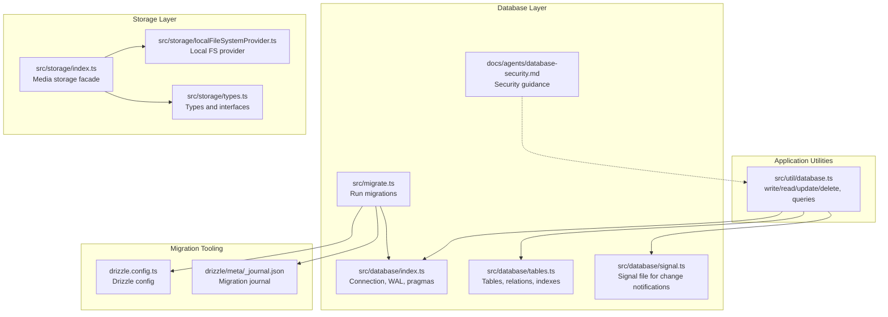
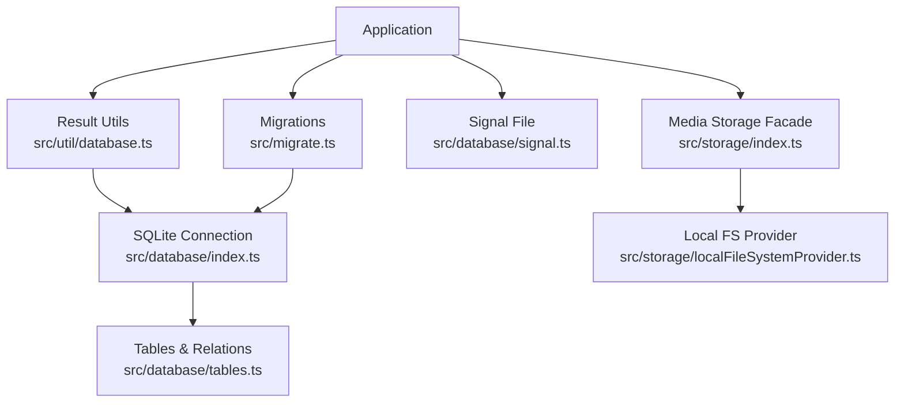
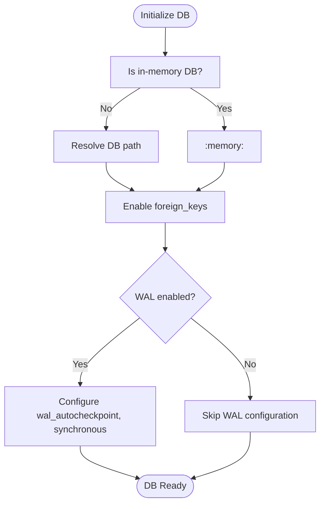
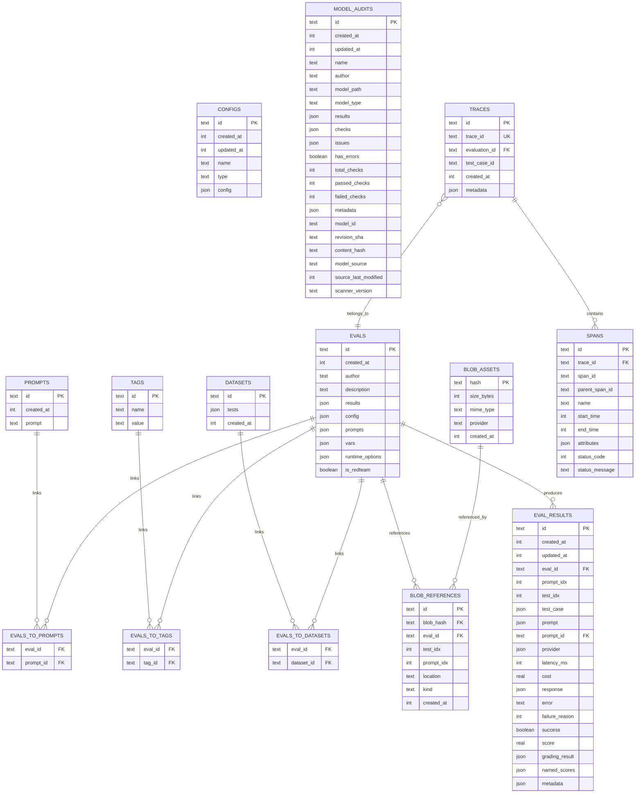
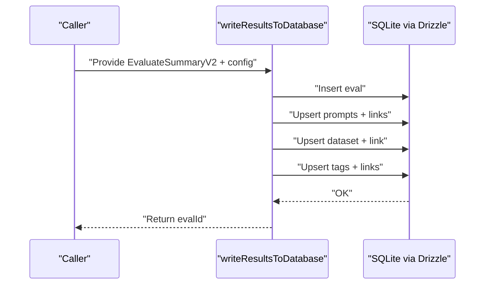
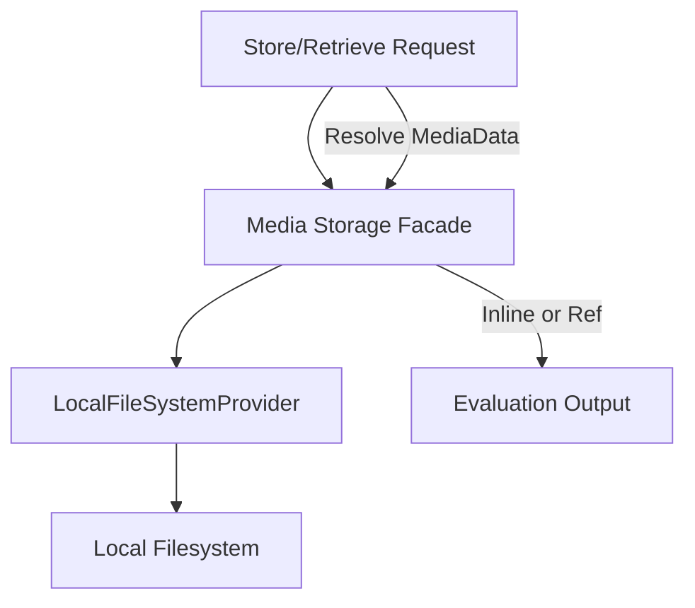
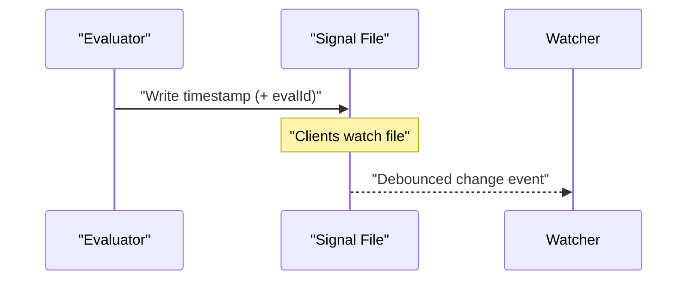
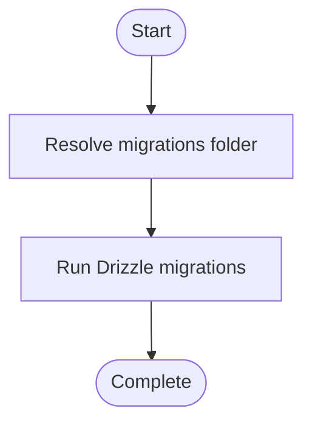
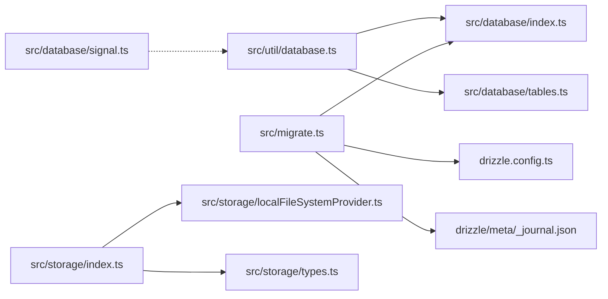

# Database & Storage

<cite>
**Referenced Files in This Document**
- [src/database/index.ts](file://src/database/index.ts)
- [src/database/tables.ts](file://src/database/tables.ts)
- [src/database/signal.ts](file://src/database/signal.ts)
- [src/util/database.ts](file://src/util/database.ts)
- [src/storage/index.ts](file://src/storage/index.ts)
- [src/storage/localFileSystemProvider.ts](file://src/storage/localFileSystemProvider.ts)
- [src/storage/types.ts](file://src/storage/types.ts)
- [src/migrate.ts](file://src/migrate.ts)
- [drizzle.config.ts](file://drizzle.config.ts)
- [drizzle/meta/_journal.json](file://drizzle/meta/_journal.json)
- [docs/agents/database-security.md](file://docs/agents/database-security.md)
</cite>

## Table of Contents
1. [Introduction](#introduction)
2. [Project Structure](#project-structure)
3. [Core Components](#core-components)
4. [Architecture Overview](#architecture-overview)
5. [Detailed Component Analysis](#detailed-component-analysis)
6. [Dependency Analysis](#dependency-analysis)
7. [Performance Considerations](#performance-considerations)
8. [Troubleshooting Guide](#troubleshooting-guide)
9. [Conclusion](#conclusion)
10. [Appendices](#appendices)

## Introduction
This document explains PromptFoo’s SQLite-based result storage system and associated storage architecture. It covers the database schema, relationships, indexing strategies, persistence and query capabilities, media storage, caching, performance tuning, migrations, backups, retention, security, and operational guidance. The goal is to help both developers and operators manage evaluation results reliably and efficiently.

## Project Structure
PromptFoo organizes database and storage concerns into focused modules:
- Database connection and WAL tuning
- Schema definitions and relations
- Migration orchestration
- Result persistence and retrieval utilities
- Signal-based change notifications
- Media storage abstraction and local filesystem provider
- Security guidance for SQL injection prevention

**Diagram sources**
- [src/database/index.ts:1-122](file://src/database/index.ts#L1-L122)
- [src/database/tables.ts:1-496](file://src/database/tables.ts#L1-L496)
- [src/database/signal.ts:1-90](file://src/database/signal.ts#L1-L90)
- [src/util/database.ts:1-624](file://src/util/database.ts#L1-L624)
- [src/storage/index.ts:1-189](file://src/storage/index.ts#L1-L189)
- [src/storage/localFileSystemProvider.ts](file://src/storage/localFileSystemProvider.ts)
- [src/storage/types.ts](file://src/storage/types.ts)
- [src/migrate.ts:1-123](file://src/migrate.ts#L1-L123)
- [drizzle.config.ts:1-12](file://drizzle.config.ts#L1-L12)
- [drizzle/meta/_journal.json:1-174](file://drizzle/meta/_journal.json#L1-L174)

**Section sources**
- [src/database/index.ts:1-122](file://src/database/index.ts#L1-L122)
- [src/database/tables.ts:1-496](file://src/database/tables.ts#L1-L496)
- [src/util/database.ts:1-624](file://src/util/database.ts#L1-L624)
- [src/storage/index.ts:1-189](file://src/storage/index.ts#L1-L189)
- [src/migrate.ts:1-123](file://src/migrate.ts#L1-L123)
- [drizzle.config.ts:1-12](file://drizzle.config.ts#L1-L12)
- [drizzle/meta/_journal.json:1-174](file://drizzle/meta/_journal.json#L1-L174)
- [docs/agents/database-security.md:1-80](file://docs/agents/database-security.md#L1-L80)

## Core Components
- SQLite connection and WAL tuning: Establishes the database connection, enables foreign keys, and configures WAL mode with performance-oriented pragmas. Includes safe close semantics and WAL checkpointing.
- Schema definitions: Declares tables, relations, and indexes for evaluations, prompts, datasets, tags, blob assets and references, configs, model audits, and OpenTelemetry traces/spans.
- Migration system: Runs Drizzle migrations from a configurable folder and supports both development and distribution contexts.
- Result persistence utilities: Insert, read, update, delete, and query evaluation results; batch deletion; and a standalone evals view with caching.
- Signal file: Writes a timestamped signal file to notify clients of new data; supports debounced watchers.
- Media storage: Abstraction for storing binary media (audio, images, video) separately from the database, with a local filesystem provider and helpers for conversion and resolution.

**Section sources**
- [src/database/index.ts:29-122](file://src/database/index.ts#L29-L122)
- [src/database/tables.ts:28-496](file://src/database/tables.ts#L28-L496)
- [src/migrate.ts:47-82](file://src/migrate.ts#L47-L82)
- [src/util/database.ts:33-166](file://src/util/database.ts#L33-L166)
- [src/database/signal.ts:12-90](file://src/database/signal.ts#L12-L90)
- [src/storage/index.ts:48-189](file://src/storage/index.ts#L48-L189)

## Architecture Overview
The storage architecture separates relational evaluation data from binary media. SQLite with WAL improves concurrency and durability. Drizzle ORM provides type-safe schema definitions and queries. Migrations evolve the schema over time. A signal file enables lightweight client-side change detection. Media is stored on the local filesystem to reduce database bloat.

**Diagram sources**
- [src/util/database.ts:33-166](file://src/util/database.ts#L33-L166)
- [src/database/index.ts:29-122](file://src/database/index.ts#L29-L122)
- [src/database/tables.ts:28-496](file://src/database/tables.ts#L28-L496)
- [src/migrate.ts:47-82](file://src/migrate.ts#L47-L82)
- [src/database/signal.ts:12-90](file://src/database/signal.ts#L12-L90)
- [src/storage/index.ts:48-189](file://src/storage/index.ts#L48-L189)
- [src/storage/localFileSystemProvider.ts](file://src/storage/localFileSystemProvider.ts)

## Detailed Component Analysis

### SQLite Connection and WAL Tuning
- Connection lifecycle: Lazily initializes a SQLite connection, enabling foreign keys and optionally WAL mode. WAL is configured with auto-checkpoint and synchronous settings for balanced durability and performance.
- Environment controls: Supports disabling WAL mode and enabling verbose database logs.
- Graceful shutdown: Attempts a WAL checkpoint before closing and clears internal instances to prevent reuse of a potentially corrupted connection.

**Diagram sources**
- [src/database/index.ts:29-122](file://src/database/index.ts#L29-L122)

**Section sources**
- [src/database/index.ts:29-122](file://src/database/index.ts#L29-L122)

### Schema Design and Relationships
Primary tables and relationships:
- evals: Top-level evaluation record with JSON config and results.
- prompts: Prompt texts with creation timestamps.
- evals_to_prompts: Many-to-many bridge linking evaluations to prompts.
- datasets: Test sets stored as JSON; linked to evaluations.
- tags: Tag taxonomy; linked to evaluations.
- evals_to_tags: Bridge for evaluation-tag associations.
- eval_results: Per-test, per-prompt results with provider info, latency, cost, response/error, success/score, grading results, and metadata/named scores.
- blob_assets: Binary asset metadata (hash, MIME type, provider, created).
- blob_references: Links assets to evaluations/tests/prompt indices and locations.
- configs: Named configurations (e.g., redteam/eval) with type and JSON payload.
- model_audits: Model audit scans with extracted checks/issues and revision tracking.
- traces/spans: OpenTelemetry-style tracing for evaluations.

Indexes and JSON-extracted indexes enable efficient filtering and querying on nested fields.

**Diagram sources**
- [src/database/tables.ts:28-496](file://src/database/tables.ts#L28-L496)

**Section sources**
- [src/database/tables.ts:28-496](file://src/database/tables.ts#L28-L496)

### Result Persistence and Query Capabilities
- Write results: Inserts eval, prompts, datasets, tags, and links; ensures conflict-free inserts; returns eval ID.
- Read/update: Loads evals, converts to ResultsFile, updates config/table, persists changes.
- Delete: Supports single or batch deletion with cascading cleanup of related rows.
- Standalone evals view: Left joins evals with prompts/datasets/tags; filters by tag and description; caches results for 2 hours.

**Diagram sources**
- [src/util/database.ts:33-166](file://src/util/database.ts#L33-L166)

**Section sources**
- [src/util/database.ts:33-166](file://src/util/database.ts#L33-L166)
- [src/util/database.ts:440-486](file://src/util/database.ts#L440-L486)
- [src/util/database.ts:509-623](file://src/util/database.ts#L509-L623)

### Media Storage
- Abstraction: Provides store/retrieve/existence/delete/getUrl plus helpers to convert base64 to refs and back.
- Local filesystem provider: Stores media under a configurable base path; integrates with blob references.
- Toggle: Uses environment to decide between inline base64 and storage-backed media.

**Diagram sources**
- [src/storage/index.ts:48-189](file://src/storage/index.ts#L48-L189)
- [src/storage/localFileSystemProvider.ts](file://src/storage/localFileSystemProvider.ts)
- [src/storage/types.ts](file://src/storage/types.ts)

**Section sources**
- [src/storage/index.ts:48-189](file://src/storage/index.ts#L48-L189)
- [src/storage/localFileSystemProvider.ts](file://src/storage/localFileSystemProvider.ts)
- [src/storage/types.ts](file://src/storage/types.ts)

### Signal-Based Change Notifications
- Signal file: Updated with a timestamp and optional eval ID; supports reading and debounced watching for clients.
- Purpose: Lightweight mechanism to notify UI or external systems of new data without polling.

**Diagram sources**
- [src/database/signal.ts:12-90](file://src/database/signal.ts#L12-L90)

**Section sources**
- [src/database/signal.ts:12-90](file://src/database/signal.ts#L12-L90)

### Migration System and Schema Evolution
- Drizzle configuration: Points to the SQLite file path and schema definition.
- Migration runner: Detects migrations folder across development and distribution contexts, runs migrations synchronously off the main tick, and logs outcomes.
- Journal: Tracks applied migrations and versions.

**Diagram sources**
- [drizzle.config.ts:1-12](file://drizzle.config.ts#L1-L12)
- [src/migrate.ts:47-82](file://src/migrate.ts#L47-L82)
- [drizzle/meta/_journal.json:1-174](file://drizzle/meta/_journal.json#L1-L174)

**Section sources**
- [drizzle.config.ts:1-12](file://drizzle.config.ts#L1-L12)
- [src/migrate.ts:47-82](file://src/migrate.ts#L47-L82)
- [drizzle/meta/_journal.json:1-174](file://drizzle/meta/_journal.json#L1-L174)

### Database Security and Access Control
- SQL injection prevention: All queries must use parameterized Drizzle SQL fragments. Special handling applies for JSON paths in SQLite.
- Guidance: Escapes JSON path content and passes SQL fragments between functions rather than raw strings.

**Section sources**
- [docs/agents/database-security.md:1-80](file://docs/agents/database-security.md#L1-L80)

## Dependency Analysis
- Result utilities depend on database connection and schema definitions.
- Migrations depend on the database connection and Drizzle configuration.
- Media storage depends on local filesystem provider and types.
- Signal file is independent but used by higher-level components.

**Diagram sources**
- [src/util/database.ts:1-624](file://src/util/database.ts#L1-L624)
- [src/database/index.ts:1-122](file://src/database/index.ts#L1-L122)
- [src/database/tables.ts:1-496](file://src/database/tables.ts#L1-L496)
- [src/migrate.ts:1-123](file://src/migrate.ts#L1-L123)
- [drizzle.config.ts:1-12](file://drizzle.config.ts#L1-L12)
- [drizzle/meta/_journal.json:1-174](file://drizzle/meta/_journal.json#L1-L174)
- [src/storage/index.ts:1-189](file://src/storage/index.ts#L1-L189)
- [src/storage/localFileSystemProvider.ts](file://src/storage/localFileSystemProvider.ts)
- [src/storage/types.ts](file://src/storage/types.ts)
- [src/database/signal.ts:1-90](file://src/database/signal.ts#L1-L90)

**Section sources**
- [src/util/database.ts:1-624](file://src/util/database.ts#L1-L624)
- [src/database/index.ts:1-122](file://src/database/index.ts#L1-L122)
- [src/database/tables.ts:1-496](file://src/database/tables.ts#L1-L496)
- [src/migrate.ts:1-123](file://src/migrate.ts#L1-L123)
- [drizzle.config.ts:1-12](file://drizzle.config.ts#L1-L12)
- [drizzle/meta/_journal.json:1-174](file://drizzle/meta/_journal.json#L1-L174)
- [src/storage/index.ts:1-189](file://src/storage/index.ts#L1-L189)
- [src/storage/localFileSystemProvider.ts](file://src/storage/localFileSystemProvider.ts)
- [src/storage/types.ts](file://src/storage/types.ts)
- [src/database/signal.ts:1-90](file://src/database/signal.ts#L1-L90)

## Performance Considerations
- WAL mode: Enabled by default except in-memory or when explicitly disabled; improves concurrency and reduces writer stalls.
- Pragmas: wal_autocheckpoint tuned for throughput; synchronous set to NORMAL with WAL for balanced durability/speed.
- Indexes: Extensive indexes on foreign keys, composite keys, and JSON-extracted fields to accelerate filtering and joins.
- Caching: LRU cache for standalone evals view to reduce repeated queries.
- Media separation: Storing binary media on filesystem avoids bloating the SQLite database and improves IO characteristics.

**Section sources**
- [src/database/index.ts:39-71](file://src/database/index.ts#L39-L71)
- [src/database/tables.ts:116-155](file://src/database/tables.ts#L116-L155)
- [src/util/database.ts:501-507](file://src/util/database.ts#L501-L507)
- [src/storage/index.ts:185-189](file://src/storage/index.ts#L185-L189)

## Troubleshooting Guide
- WAL mode warnings: If WAL cannot be enabled (e.g., on network filesystems), the system warns and continues with default journal mode. Disable WAL mode intentionally if needed.
- Close failures: On close, the system attempts a WAL checkpoint and logs errors; it still clears instances to prevent reuse of a potentially corrupted connection.
- Migration failures: Migration errors are logged with stack traces; ensure migrations folder is resolvable in both development and distribution contexts.
- Signal file issues: Watcher setup errors are caught and warned; verify file permissions and path existence.
- Query performance: Use indexes documented in schema; prefer filtered queries with JSON-extracted indexes for metadata/named scores.

**Section sources**
- [src/database/index.ts:79-103](file://src/database/index.ts#L79-L103)
- [src/migrate.ts:76-81](file://src/migrate.ts#L76-L81)
- [src/database/signal.ts:70-89](file://src/database/signal.ts#L70-L89)
- [src/database/tables.ts:116-155](file://src/database/tables.ts#L116-L155)

## Conclusion
PromptFoo’s storage system combines a robust SQLite backend with Drizzle ORM, a migration framework, and a media abstraction. The schema emphasizes relational integrity and query performance through strategic indexing. WAL mode and pragmatic pragmas improve concurrency and reliability. Operators should monitor WAL behavior, leverage migrations for schema evolution, and use the signal file for lightweight change notifications. For media-heavy workloads, rely on the local filesystem provider to keep the database lean.

## Appendices

### Backup and Restore Procedures
- Backup: Copy the SQLite database file from the configuration directory to a secure location.
- Restore: Stop writes, replace the database file with the backup copy, and restart the service. If WAL mode is enabled, the restored file remains compatible.

**Section sources**
- [src/database/index.ts:21-27](file://src/database/index.ts#L21-L27)

### Storage Configuration and Disk Space Management
- Database path: Resolved from the configuration directory; ensure sufficient disk space and appropriate permissions.
- Media storage: Controlled by environment; default is filesystem-based storage. Adjust base path and retention externally as needed.

**Section sources**
- [src/database/index.ts:21-27](file://src/database/index.ts#L21-L27)
- [src/storage/index.ts:48-55](file://src/storage/index.ts#L48-L55)

### Retention Policies
- No built-in retention policy is enforced in the codebase. Implement retention externally by deleting old evaluation records and associated media assets after copying desired results elsewhere.

**Section sources**
- [src/util/database.ts:440-486](file://src/util/database.ts#L440-L486)

### Data Export/Import Functionality
- Export: Use queries to retrieve evals, prompts, datasets, tags, and results; serialize to JSON for archival.
- Import: Reconstruct evals and related entities; ensure foreign keys and uniqueness constraints are respected.

**Section sources**
- [src/util/database.ts:384-428](file://src/util/database.ts#L384-L428)

### Example Queries for Result Analysis and Reporting
Note: Replace placeholders with actual values and ensure parameterization to prevent SQL injection.

- List latest evaluations with author and description:
  - Select evals ordered by created_at descending.
- Filter evaluations by tag key/value:
  - Join evals with evals_to_tags and tags; apply equality predicates on name and value.
- Count successes/failures per eval:
  - Aggregate eval_results success and failure reasons grouped by eval_id.
- Find evals containing a specific metadata value:
  - Use JSON-extracted indexes on metadata fields.

**Section sources**
- [src/util/database.ts:384-428](file://src/util/database.ts#L384-L428)
- [src/util/database.ts:537-551](file://src/util/database.ts#L537-L551)
- [src/database/tables.ts:116-155](file://src/database/tables.ts#L116-L155)