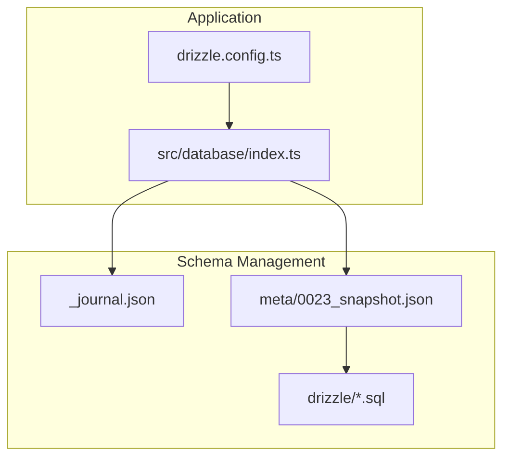
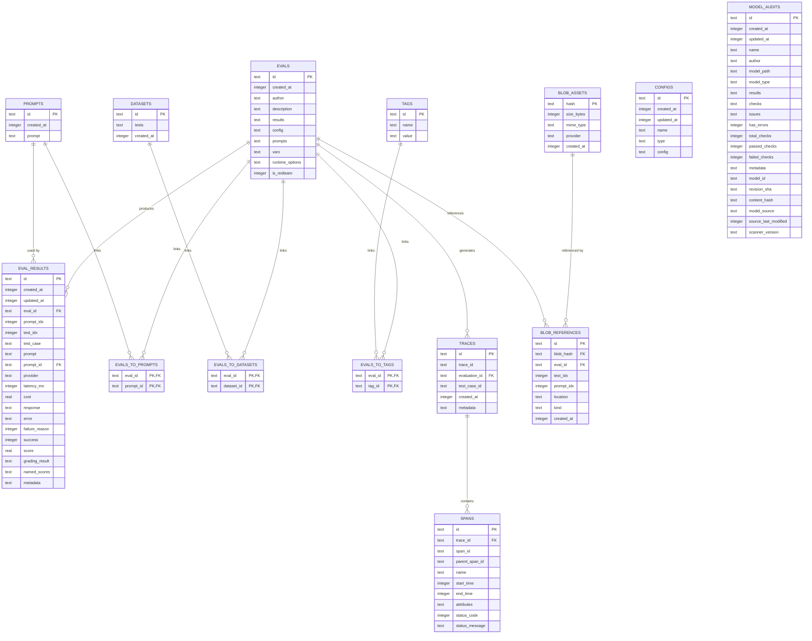
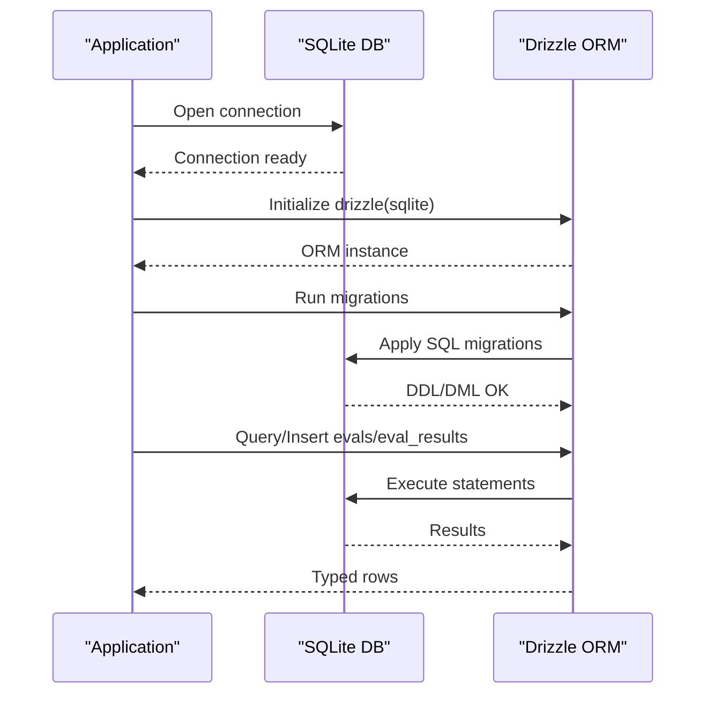
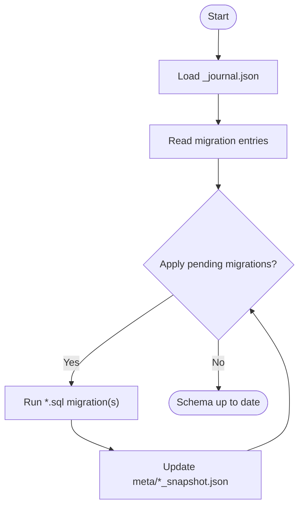
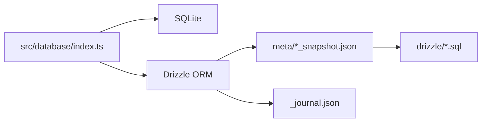

# Database Schema & Design

<cite>
**Referenced Files in This Document**
- [drizzle.config.ts](file://drizzle.config.ts)
- [src/database/index.ts](file://src/database/index.ts)
- [drizzle/meta/_journal.json](file://drizzle/meta/_journal.json)
- [drizzle/meta/0023_snapshot.json](file://drizzle/meta/0023_snapshot.json)
- [drizzle/0023_wooden_mandrill.sql](file://drizzle/0023_wooden_mandrill.sql)
- [drizzle/0012_late_marten_broadcloak.sql](file://drizzle/0012_late_marten_broadcloak.sql)
</cite>

## Table of Contents
1. [Introduction](#introduction)
2. [Project Structure](#project-structure)
3. [Core Components](#core-components)
4. [Architecture Overview](#architecture-overview)
5. [Detailed Component Analysis](#detailed-component-analysis)
6. [Dependency Analysis](#dependency-analysis)
7. [Performance Considerations](#performance-considerations)
8. [Troubleshooting Guide](#troubleshooting-guide)
9. [Conclusion](#conclusion)
10. [Appendices](#appendices)

## Introduction
This document describes PromptFoo’s SQLite-based storage system. It focuses on the schema for the tables relevant to evaluation storage and analytics, including evals, eval_results, prompts, datasets, evals_to_datasets, evals_to_prompts, tags, evals_to_tags, traces, spans, configs, blob_assets, blob_references, and model_audits. It explains table relationships, foreign keys, indexing strategies, primary and unique constraints, and the migration system. It also covers WAL mode configuration, performance optimizations, and practical query patterns for result analysis.

## Project Structure
PromptFoo uses Drizzle ORM with SQLite. The schema is managed via Drizzle migrations stored under drizzle/, and the runtime database connection is configured and initialized in src/database/index.ts. Drizzle Kit configuration points to the SQLite file path resolved by the application.

**Diagram sources**
- [drizzle.config.ts:1-12](file://drizzle.config.ts#L1-L12)
- [src/database/index.ts:1-122](file://src/database/index.ts#L1-L122)
- [drizzle/meta/_journal.json:1-174](file://drizzle/meta/_journal.json#L1-L174)
- [drizzle/meta/0023_snapshot.json:1-1496](file://drizzle/meta/0023_snapshot.json#L1-L1496)

**Section sources**
- [drizzle.config.ts:1-12](file://drizzle.config.ts#L1-L12)
- [src/database/index.ts:1-122](file://src/database/index.ts#L1-L122)
- [drizzle/meta/_journal.json:1-174](file://drizzle/meta/_journal.json#L1-L174)
- [drizzle/meta/0023_snapshot.json:1-1496](file://drizzle/meta/0023_snapshot.json#L1-L1496)

## Core Components
- SQLite connection and WAL mode: The database connection is created with foreign key enforcement and optional WAL mode enabled. Journal mode is set to WAL unless disabled by environment variable, with synchronous set to NORMAL and wal_autocheckpoint tuned for performance.
- Migration system: Drizzle migrations are tracked in _journal.json and represented by numbered SQL files. Snapshots capture the canonical schema state at each migration.
- Schema location: Drizzle Kit schema path points to src/database/tables.ts, which defines the TypeScript models that generate the migrations and snapshots.

Key behaviors:
- Foreign keys are enforced via PRAGMA foreign_keys = ON.
- WAL mode is enabled with safeguards and warnings when unsupported.
- Environment flags control logging and WAL behavior.

**Section sources**
- [src/database/index.ts:36-71](file://src/database/index.ts#L36-L71)
- [src/database/index.ts:79-103](file://src/database/index.ts#L79-L103)
- [drizzle.config.ts:4-11](file://drizzle.config.ts#L4-L11)

## Architecture Overview
The schema centers around evaluations and their results. Evaluations are linked to prompts and datasets via many-to-many association tables. Tracing spans connect to evaluations. Blob assets and references support binary content. Model audits track model checks and metadata. Configs and tags provide auxiliary categorization and configuration storage.

**Diagram sources**
- [drizzle/meta/0023_snapshot.json:691-1427](file://drizzle/meta/0023_snapshot.json#L691-L1427)

## Detailed Component Analysis

### evals
- Purpose: Stores evaluation metadata and serialized artifacts (config, prompts, vars, runtime options).
- Primary key: id
- Notable fields: created_at, author, description, results, config, prompts, vars, runtime_options, is_redteam
- Indexes: created_at, author, is_redteam
- Notes: JSON-like fields (results, config, prompts, vars) are stored as text; application code serializes/deserializes.

**Section sources**
- [drizzle/meta/0023_snapshot.json:592-695](file://drizzle/meta/0023_snapshot.json#L592-L695)

### eval_results
- Purpose: Stores per-test, per-prompt evaluation outcomes and metrics.
- Primary key: id
- Foreign keys: eval_id -> evals.id, prompt_id -> prompts.id
- Notable fields: eval_id, prompt_idx, test_idx, test_case, prompt, provider, latency_ms, cost, response, error, failure_reason, success, score, grading_result, named_scores, metadata
- Indexes: eval_id, test_idx, composite (eval_id, test_idx), (eval_id, success), (eval_id, failure_reason), (eval_id, test_idx, success), plus JSON-extract indexes on grading_result, test_case.vars, metadata, named_scores
- Notes: JSON fields are indexed using json_extract expressions to enable efficient filtering and sorting.

**Section sources**
- [drizzle/meta/0023_snapshot.json:301-591](file://drizzle/meta/0023_snapshot.json#L301-L591)

### prompts
- Purpose: Stores prompt texts with timestamps.
- Primary key: id
- Indexes: created_at

**Section sources**
- [drizzle/meta/0023_snapshot.json:1143-1182](file://drizzle/meta/0023_snapshot.json#L1143-L1182)

### datasets
- Purpose: Stores dataset identifiers and serialized test sets.
- Primary key: id
- Indexes: created_at

**Section sources**
- [drizzle/meta/0023_snapshot.json:261-300](file://drizzle/meta/0023_snapshot.json#L261-L300)

### evals_to_prompts
- Purpose: Many-to-many relationship between evaluations and prompts.
- Composite primary key: (eval_id, prompt_id)
- Foreign keys: eval_id -> evals.id (cascade), prompt_id -> prompts.id

**Section sources**
- [drizzle/meta/0023_snapshot.json:770-843](file://drizzle/meta/0023_snapshot.json#L770-L843)

### evals_to_datasets
- Purpose: Many-to-many relationship between evaluations and datasets.
- Composite primary key: (eval_id, dataset_id)
- Foreign keys: eval_id -> evals.id, dataset_id -> datasets.id

**Section sources**
- [drizzle/meta/0023_snapshot.json:696-769](file://drizzle/meta/0023_snapshot.json#L696-L769)

### tags
- Purpose: Tagging system for evaluations.
- Primary key: id
- Unique constraint: (name, value)
- Indexes: name

**Section sources**
- [drizzle/meta/0023_snapshot.json:1292-1338](file://drizzle/meta/0023_snapshot.json#L1292-L1338)

### evals_to_tags
- Purpose: Many-to-many relationship between evaluations and tags.
- Composite primary key: (eval_id, tag_id)
- Foreign keys: eval_id -> evals.id, tag_id -> tags.id

**Section sources**
- [drizzle/meta/0023_snapshot.json:844-917](file://drizzle/meta/0023_snapshot.json#L844-L917)

### traces
- Purpose: Evaluation trace metadata.
- Primary key: id
- Unique constraint: trace_id
- Foreign keys: evaluation_id -> evals.id

**Section sources**
- [drizzle/meta/0023_snapshot.json:1339-1427](file://drizzle/meta/0023_snapshot.json#L1339-L1427)

### spans
- Purpose: Tracing spans associated with traces.
- Primary key: id
- Foreign keys: trace_id -> traces.trace_id

**Section sources**
- [drizzle/meta/0023_snapshot.json:1183-1291](file://drizzle/meta/0023_snapshot.json#L1183-L1291)

### configs
- Purpose: Generic configuration storage keyed by name/type.
- Primary key: id
- Indexes: created_at, type

**Section sources**
- [drizzle/meta/0023_snapshot.json:192-260](file://drizzle/meta/0023_snapshot.json#L192-L260)

### blob_assets
- Purpose: Binary asset metadata.
- Primary key: hash
- Indexes: provider, created_at, mime_type

**Section sources**
- [drizzle/meta/0023_snapshot.json:7-74](file://drizzle/meta/0023_snapshot.json#L7-L74)

### blob_references
- Purpose: Links binary assets to evaluations and optional indices.
- Primary key: id
- Foreign keys: blob_hash -> blob_assets.hash (cascade), eval_id -> evals.id (cascade)
- Indexes: blob_hash, eval_id, (blob_hash, created_at)

**Section sources**
- [drizzle/meta/0023_snapshot.json:75-191](file://drizzle/meta/0023_snapshot.json#L75-L191)

### model_audits
- Purpose: Model audit records with counts and metadata.
- Primary key: id
- Indexes: created_at, model_path, has_errors, model_type, model_id, revision_sha, content_hash, composite(model_id, revision_sha), composite(model_id, content_hash)

**Section sources**
- [drizzle/meta/0023_snapshot.json:918-1142](file://drizzle/meta/0023_snapshot.json#L918-L1142)

## Architecture Overview

**Diagram sources**
- [src/database/index.ts:29-77](file://src/database/index.ts#L29-L77)
- [drizzle.config.ts:4-11](file://drizzle.config.ts#L4-L11)

## Detailed Component Analysis

### Relationship and Foreign Key Constraints
- eval_results.eval_id → evals.id
- eval_results.prompt_id → prompts.id
- evals_to_prompts.eval_id → evals.id (cascade)
- evals_to_prompts.prompt_id → prompts.id
- evals_to_datasets.eval_id → evals.id
- evals_to_datasets.dataset_id → datasets.id
- evals_to_tags.eval_id → evals.id
- evals_to_tags.tag_id → tags.id
- traces.evaluation_id → evals.id
- spans.trace_id → traces.trace_id
- blob_references.blob_hash → blob_assets.hash (cascade)
- blob_references.eval_id → evals.id (cascade)

These constraints enforce referential integrity and cascade deletes appropriately for related records.

**Section sources**
- [drizzle/meta/0023_snapshot.json:560-591](file://drizzle/meta/0023_snapshot.json#L560-L591)
- [drizzle/meta/0023_snapshot.json:730-843](file://drizzle/meta/0023_snapshot.json#L730-L843)
- [drizzle/meta/0023_snapshot.json:878-917](file://drizzle/meta/0023_snapshot.json#L878-L917)
- [drizzle/meta/0023_snapshot.json:1410-1423](file://drizzle/meta/0023_snapshot.json#L1410-L1423)
- [drizzle/meta/0023_snapshot.json:1274-1287](file://drizzle/meta/0023_snapshot.json#L1274-L1287)
- [drizzle/meta/0023_snapshot.json:160-191](file://drizzle/meta/0023_snapshot.json#L160-L191)

### Indexing Strategies
- Single-column indexes for frequently filtered/sorted columns (e.g., evals.created_at, evals.author, evals.is_redteam, prompts.created_at, datasets.created_at, tags.name).
- Composite indexes for join-heavy queries (e.g., eval_results.(eval_id, test_idx), eval_results.(eval_id, success), eval_results.(eval_id, failure_reason), eval_results.(eval_id, test_idx, success)).
- JSON-extract indexes on nested fields to accelerate filtering on grading_result.reason/comment, test_case.vars, metadata, and named_scores.

These indexes optimize common analytical workloads such as:
- Listing evaluations by date or author
- Filtering results by success/failure reason
- Aggregating scores and metrics per evaluation/test
- Joining results with prompts and datasets

**Section sources**
- [drizzle/meta/0023_snapshot.json:668-695](file://drizzle/meta/0023_snapshot.json#L668-L695)
- [drizzle/meta/0023_snapshot.json:448-559](file://drizzle/meta/0023_snapshot.json#L448-L559)

### Field Definitions, Data Types, and Validation Rules
- Text fields: Used for identifiers, serialized JSON, and free-form text. Enforced via NOT NULL where applicable.
- Integer fields: Used for timestamps, booleans stored as integers, and counts.
- Real fields: Used for numeric scores and costs.
- Default values: CURRENT_TIMESTAMP for created_at/updated_at fields where present.
- Unique constraints: tags.(name,value), traces.trace_id, blob_assets.hash.
- Composite primary keys: evals_to_prompts, evals_to_datasets, evals_to_tags.

Validation is enforced at the database level via NOT NULL, PRIMARY KEY, UNIQUE, and FOREIGN KEY constraints.

**Section sources**
- [drizzle/meta/0023_snapshot.json:1317-1333](file://drizzle/meta/0023_snapshot.json#L1317-L1333)
- [drizzle/meta/0023_snapshot.json:1386-1393](file://drizzle/meta/0023_snapshot.json#L1386-L1393)
- [drizzle/meta/0023_snapshot.json:75-74](file://drizzle/meta/0023_snapshot.json#L75-L74)

### Migration System and Schema Evolution
- Drizzle migrations are numbered and tracked in _journal.json with timestamps and tags.
- Snapshots in meta/0023_snapshot.json represent the canonical schema at version 0023.
- SQL migration files (e.g., 0023_wooden_mandrill.sql) add secondary indexes after initial table creation.
- Example evolution:
  - Version 0012 adds evals.vars and creates a composite index on eval_results.(eval_id, test_idx).
  - Version 0023 introduces blob_assets, blob_references, model_audits, and additional indexes.

**Diagram sources**
- [drizzle/meta/_journal.json:1-174](file://drizzle/meta/_journal.json#L1-L174)
- [drizzle/meta/0023_snapshot.json:1-1496](file://drizzle/meta/0023_snapshot.json#L1-L1496)
- [drizzle/0023_wooden_mandrill.sql:1-2](file://drizzle/0023_wooden_mandrill.sql#L1-L2)
- [drizzle/0012_late_marten_broadcloak.sql:1-2](file://drizzle/0012_late_marten_broadcloak.sql#L1-L2)

**Section sources**
- [drizzle/meta/_journal.json:1-174](file://drizzle/meta/_journal.json#L1-L174)
- [drizzle/meta/0023_snapshot.json:1-1496](file://drizzle/meta/0023_snapshot.json#L1-L1496)
- [drizzle/0023_wooden_mandrill.sql:1-2](file://drizzle/0023_wooden_mandrill.sql#L1-L2)
- [drizzle/0012_late_marten_broadcloak.sql:1-2](file://drizzle/0012_late_marten_broadcloak.sql#L1-L2)

### Performance Optimizations
- WAL mode: Enabled by default for concurrency benefits; verified and logged with warnings when unsupported.
- Checkpoint tuning: wal_autocheckpoint adjusted to 1000 pages.
- Synchronous setting: NORMAL with WAL balances durability and performance.
- Index coverage: Extensive single and composite indexes for common analytical queries; JSON-extract indexes for nested data filtering.

Operational tips:
- Prefer composite indexes for join+filter patterns.
- Use JSON-extract indexes for filtering on nested fields.
- Monitor WAL mode status in logs when running on network filesystems.

**Section sources**
- [src/database/index.ts:39-71](file://src/database/index.ts#L39-L71)

### Examples of Complex Queries and Joins
Below are representative query patterns commonly used for result analysis. Replace placeholders with actual values and adjust WHERE clauses as needed.

- Aggregate success/failure by evaluation and test:
  - Join eval_results with evals on eval_id.
  - Group by eval_id and test_idx; compute counts of success=1 vs failure_reason distribution.

- Score analysis by prompt and provider:
  - Join eval_results with prompts on prompt_id.
  - Filter by provider; compute average score and latency_ms grouped by prompt_id/provider.

- Metadata filtering:
  - Use JSON-extract indexes to filter eval_results.metadata fields (e.g., pluginId, strategyId).
  - Combine with test_case.vars to segment by variable values.

- Tracing correlation:
  - Join traces with evals on evaluation_id.
  - Join spans on trace_id to analyze timing and status across spans.

- Blob asset linkage:
  - Join blob_references with blob_assets on blob_hash to retrieve asset metadata for referenced blobs.

Note: These are conceptual examples designed to illustrate typical join and filtering patterns. They are not tied to specific SQL files in the repository.

[No sources needed since this section provides conceptual examples]

## Dependency Analysis

**Diagram sources**
- [src/database/index.ts:29-77](file://src/database/index.ts#L29-L77)
- [drizzle/meta/_journal.json:1-174](file://drizzle/meta/_journal.json#L1-L174)
- [drizzle/meta/0023_snapshot.json:1-1496](file://drizzle/meta/0023_snapshot.json#L1-L1496)

**Section sources**
- [src/database/index.ts:29-77](file://src/database/index.ts#L29-L77)
- [drizzle/meta/_journal.json:1-174](file://drizzle/meta/_journal.json#L1-L174)
- [drizzle/meta/0023_snapshot.json:1-1496](file://drizzle/meta/0023_snapshot.json#L1-L1496)

## Performance Considerations
- Use WAL mode for concurrent reads/writes; expect reduced performance on unsupported filesystems.
- Keep indexes aligned with analytical queries; avoid over-indexing to reduce write overhead.
- Normalize judiciously: eval_results references prompts and evals via foreign keys, enabling normalization while maintaining query performance through indexes.
- Consider partitioning strategies for very large datasets (e.g., time-based sharding) if growth warrants.

[No sources needed since this section provides general guidance]

## Troubleshooting Guide
- WAL mode warnings: If WAL mode cannot be enabled (e.g., network filesystem), the code logs a warning and continues. Set PROMPTFOO_DISABLE_WAL_MODE=true to suppress warnings.
- Foreign key failures: Ensure referential integrity by inserting dependent records in the correct order or using cascading relationships where appropriate.
- Checkpointing on close: On supported systems, the code attempts a WAL checkpoint before closing to minimize recovery time.

**Section sources**
- [src/database/index.ts:52-70](file://src/database/index.ts#L52-L70)
- [src/database/index.ts:82-90](file://src/database/index.ts#L82-L90)

## Conclusion
PromptFoo’s SQLite schema is migration-driven, normalized for relational integrity, and optimized for analytical queries through strategic indexing. WAL mode and pragmatic defaults improve concurrency and performance. The schema supports rich evaluation analytics, tracing, and asset management, with clear foreign key relationships and evolving snapshots capturing schema changes over time.

[No sources needed since this section summarizes without analyzing specific files]

## Appendices

### Appendix A: Environment Variables and Their Effects
- PROMPTFOO_ENABLE_DATABASE_LOGS: Enables Drizzle SQL logging.
- IS_TESTING: Uses an in-memory SQLite database (:memory:).
- PROMPTFOO_DISABLE_WAL_MODE: Disables WAL mode configuration and suppresses WAL warnings.

**Section sources**
- [src/database/index.ts:10-16](file://src/database/index.ts#L10-L16)
- [src/database/index.ts:31-32](file://src/database/index.ts#L31-L32)
- [src/database/index.ts:40-71](file://src/database/index.ts#L40-L71)