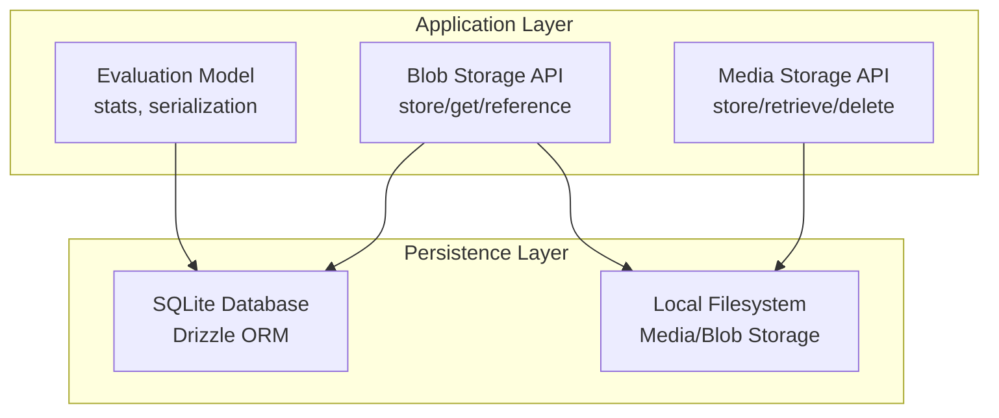
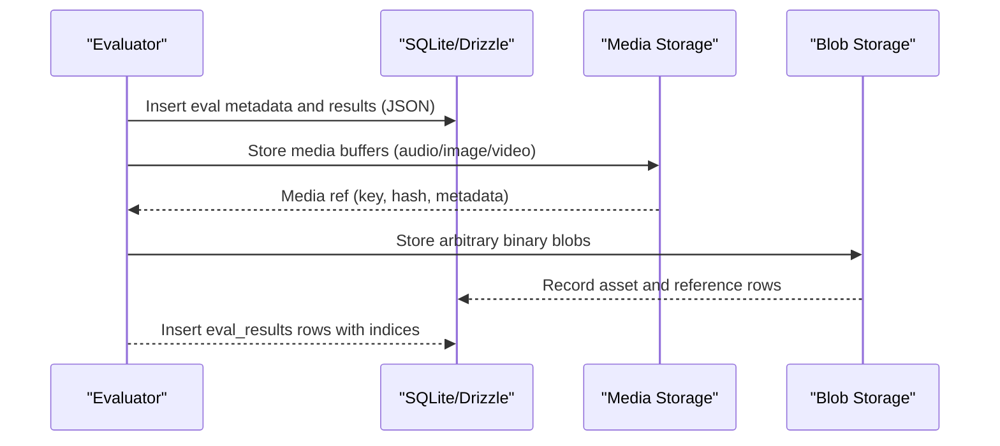
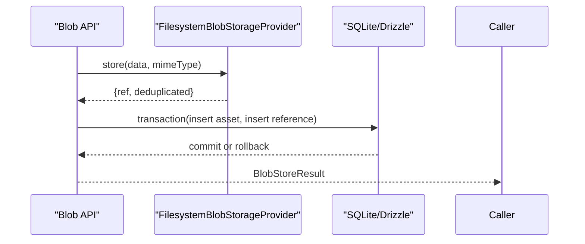
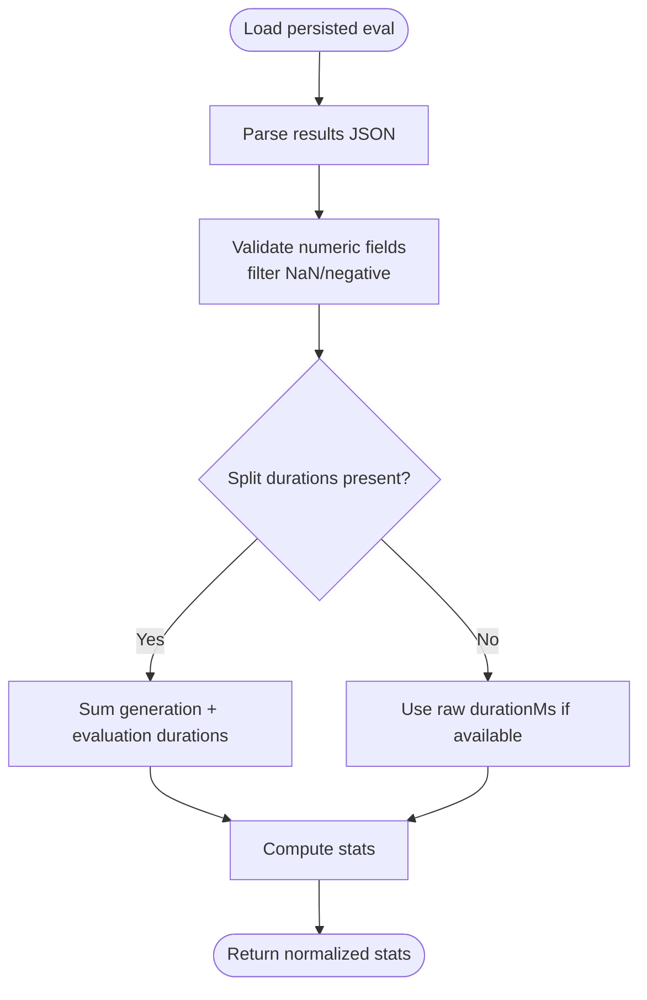
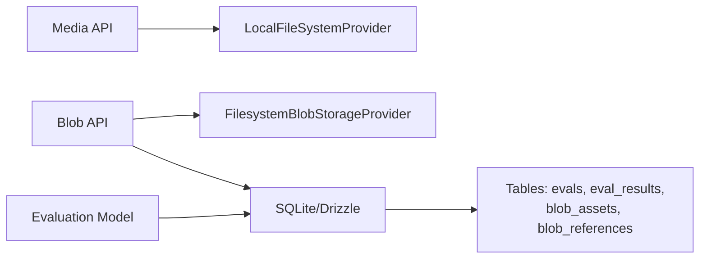

# Result Persistence & Storage

<cite>
**Referenced Files in This Document**
- [storage/index.ts](file://src/storage/index.ts)
- [storage/types.ts](file://src/storage/types.ts)
- [storage/localFileSystemProvider.ts](file://src/storage/localFileSystemProvider.ts)
- [blobs/index.ts](file://src/blobs/index.ts)
- [blobs/filesystemProvider.ts](file://src/blobs/filesystemProvider.ts)
- [database/index.ts](file://src/database/index.ts)
- [database/tables.ts](file://src/database/tables.ts)
- [models/eval.ts](file://src/models/eval.ts)
- [test/models/eval.test.ts](file://test/models/eval.test.ts)
- [test/storage/localFileSystemProvider.test.ts](file://test/storage/localFileSystemProvider.test.ts)
- [test/database/index.test.ts](file://test/database/index.test.ts)
</cite>

## Table of Contents
1. [Introduction](#introduction)
2. [Project Structure](#project-structure)
3. [Core Components](#core-components)
4. [Architecture Overview](#architecture-overview)
5. [Detailed Component Analysis](#detailed-component-analysis)
6. [Dependency Analysis](#dependency-analysis)
7. [Performance Considerations](#performance-considerations)
8. [Troubleshooting Guide](#troubleshooting-guide)
9. [Conclusion](#conclusion)
10. [Appendices](#appendices)

## Introduction
This document explains how PromptFoo persists and manages evaluation results across its storage layers. It covers:
- Database storage for structured evaluation metadata and results
- File-based storage for binary media and blobs
- Transaction handling and data consistency guarantees
- Serialization formats and content deduplication
- Storage optimization, pruning, and cleanup
- Concurrency and locking behavior
- Versioning and historical data management
- Backup and disaster recovery guidance
- Example retrieval patterns and export formats
- Performance tuning and capacity planning

## Project Structure
PromptFoo organizes persistence into three primary areas:
- SQLite database (via Drizzle ORM) for structured evaluation records and indices
- Local filesystem storage for media and blobs
- Evaluation model utilities for result serialization and statistics



**Diagram sources**
- [database/index.ts:29-77](file://src/database/index.ts#L29-L77)
- [database/tables.ts:57-155](file://src/database/tables.ts#L57-L155)
- [blobs/index.ts:43-105](file://src/blobs/index.ts#L43-L105)
- [storage/index.ts:75-110](file://src/storage/index.ts#L75-L110)
- [models/eval.ts:384-413](file://src/models/eval.ts#L384-L413)

**Section sources**
- [database/index.ts:1-122](file://src/database/index.ts#L1-L122)
- [database/tables.ts:1-496](file://src/database/tables.ts#L1-L496)
- [storage/index.ts:1-189](file://src/storage/index.ts#L1-L189)
- [storage/localFileSystemProvider.ts:1-330](file://src/storage/localFileSystemProvider.ts#L1-L330)
- [blobs/index.ts:1-170](file://src/blobs/index.ts#L1-L170)
- [blobs/filesystemProvider.ts:1-215](file://src/blobs/filesystemProvider.ts#L1-L215)
- [models/eval.ts:384-413](file://src/models/eval.ts#L384-L413)

## Core Components
- SQLite database with WAL mode enabled for concurrency and durability
- Drizzle ORM schema with tables for evaluations, results, prompts, tags, datasets, model audits, traces/spans, and blob assets/references
- Media storage provider for binary media (audio, images, video) with content-based deduplication and metadata
- Blob storage provider for generic binary assets with URI scheme and reference tracking
- Evaluation model utilities for computing stats, validating durations, and serializing results

Key responsibilities:
- Database: durable persistence of structured evaluation data and indices
- Media/Blob: offloads large binary payloads from the database, enabling efficient retrieval and reuse
- Evaluation model: normalizes and validates result statistics, ensuring robustness against corrupted data

**Section sources**
- [database/index.ts:29-77](file://src/database/index.ts#L29-L77)
- [database/tables.ts:57-155](file://src/database/tables.ts#L57-L155)
- [storage/localFileSystemProvider.ts:137-200](file://src/storage/localFileSystemProvider.ts#L137-L200)
- [blobs/filesystemProvider.ts:88-123](file://src/blobs/filesystemProvider.ts#L88-L123)
- [models/eval.ts:384-413](file://src/models/eval.ts#L384-L413)

## Architecture Overview
The persistence architecture integrates database and filesystem layers to optimize for both structured querying and large binary payloads.



**Diagram sources**
- [database/tables.ts:57-155](file://src/database/tables.ts#L57-L155)
- [storage/localFileSystemProvider.ts:137-200](file://src/storage/localFileSystemProvider.ts#L137-L200)
- [blobs/filesystemProvider.ts:88-123](file://src/blobs/filesystemProvider.ts#L88-L123)
- [blobs/index.ts:43-105](file://src/blobs/index.ts#L43-L105)

## Detailed Component Analysis

### Database Storage Layer
- Database engine: SQLite via better-sqlite3 with Drizzle ORM
- WAL mode enabled by default for improved concurrency; configurable via environment
- Foreign keys enabled for referential integrity
- Tables:
  - evals: top-level evaluation metadata and serialized results
  - eval_results: per-test/per-prompt result rows with indices for filtering and joins
  - prompts/tags/datasets: related entities with relations
  - blob_assets/blob_references: asset catalog and reference tracking for blobs
  - model_audits, traces/spans: optional audit and observability tables

Transaction handling:
- Blob storage uses a Drizzle transaction to atomically insert asset and reference rows; on DB failure, the filesystem write is rolled back to maintain consistency

Concurrency and locking:
- WAL mode improves concurrent reads/writes; synchronous setting balances safety and speed
- Graceful shutdown checkpoints the WAL to minimize corruption risk

Data consistency guarantees:
- Foreign keys and cascade deletes ensure referential integrity
- Transactions wrap blob asset/reference inserts to keep catalog and storage in sync

**Section sources**
- [database/index.ts:29-103](file://src/database/index.ts#L29-L103)
- [database/tables.ts:57-155](file://src/database/tables.ts#L57-L155)
- [database/tables.ts:212-254](file://src/database/tables.ts#L212-L254)
- [blobs/index.ts:59-102](file://src/blobs/index.ts#L59-L102)

### Media Storage Layer (Local Filesystem)
Purpose:
- Store large binary media (audio, images, video) separately from the database
- Deduplicate content by SHA-256 hash
- Maintain metadata alongside files

Key behaviors:
- Hash index file tracks contentHash → storage key for deduplication
- Path traversal protection ensures safe key resolution
- Metadata stored as adjacent .meta.json files
- Stats enumeration walks the directory tree to compute counts and sizes

```mermaid
classDiagram
class LocalFileSystemProvider {
+providerId : string
-basePath : string
-hashIndexPath : string
-hashIndex : Map~string,string~
+store(data, metadata) StoreResult
+retrieve(key) Buffer
+exists(key) boolean
+delete(key) void
+getUrl(key, expiresIn?) string|null
+findByHash(contentHash) string|null
+getBasePath() string
+getStats() {fileCount,totalSizeBytes}
}
```

**Diagram sources**
- [storage/localFileSystemProvider.ts:59-330](file://src/storage/localFileSystemProvider.ts#L59-L330)
- [storage/types.ts:85-131](file://src/storage/types.ts#L85-L131)

**Section sources**
- [storage/index.ts:48-118](file://src/storage/index.ts#L48-L118)
- [storage/localFileSystemProvider.ts:137-200](file://src/storage/localFileSystemProvider.ts#L137-L200)
- [storage/localFileSystemProvider.ts:257-287](file://src/storage/localFileSystemProvider.ts#L257-L287)
- [storage/localFileSystemProvider.ts:292-328](file://src/storage/localFileSystemProvider.ts#L292-L328)
- [test/storage/localFileSystemProvider.test.ts:32-45](file://test/storage/localFileSystemProvider.test.ts#L32-L45)

### Blob Storage Layer (Local Filesystem)
Purpose:
- Generic binary asset storage with URI scheme and reference tracking
- Deduplicates by SHA-256 hash
- Records asset metadata and references to evaluations

Key behaviors:
- Stores files under a nested directory layout derived from the hash
- Writes metadata alongside the asset
- Tracks references in blob_references for auditability and cleanup
- Provides transactional insertion of asset and reference rows



**Diagram sources**
- [blobs/index.ts:43-105](file://src/blobs/index.ts#L43-L105)
- [blobs/filesystemProvider.ts:88-123](file://src/blobs/filesystemProvider.ts#L88-L123)
- [database/tables.ts:212-254](file://src/database/tables.ts#L212-L254)

**Section sources**
- [blobs/index.ts:43-105](file://src/blobs/index.ts#L43-L105)
- [blobs/filesystemProvider.ts:88-123](file://src/blobs/filesystemProvider.ts#L88-L123)
- [blobs/filesystemProvider.ts:160-183](file://src/blobs/filesystemProvider.ts#L160-L183)

### Evaluation Results Serialization and Statistics
- Results are stored as JSON in the evals table and normalized into per-result rows in eval_results
- Statistics computation validates numeric fields and reconstructs totals defensively
- DurationMs and split durations are validated to exclude NaN or negative values



**Diagram sources**
- [models/eval.ts:384-413](file://src/models/eval.ts#L384-L413)
- [test/models/eval.test.ts:246-274](file://test/models/eval.test.ts#L246-L274)

**Section sources**
- [models/eval.ts:384-413](file://src/models/eval.ts#L384-L413)
- [test/models/eval.test.ts:218-281](file://test/models/eval.test.ts#L218-L281)

### Result Retrieval and Export Formats
- Serialized evaluation results include version, timestamps, config, prompts, and results summary
- Exported results file captures current evaluation state for downstream consumption

Example retrieval/export:
- Build a results file with version, creation timestamp, config, prompts, and results summary

**Section sources**
- [test/models/eval.test.ts:662-693](file://test/models/eval.test.ts#L662-L693)

## Dependency Analysis
- Media storage depends on filesystem paths and hash indexing
- Blob storage depends on filesystem provider and database references
- Evaluation model depends on database-backed evals and results tables
- Database initialization configures WAL and foreign keys; tests verify open/close state



**Diagram sources**
- [storage/index.ts:75-110](file://src/storage/index.ts#L75-L110)
- [blobs/index.ts:43-105](file://src/blobs/index.ts#L43-L105)
- [database/tables.ts:57-155](file://src/database/tables.ts#L57-L155)

**Section sources**
- [database/index.ts:108-121](file://src/database/index.ts#L108-L121)
- [test/database/index.test.ts:130-147](file://test/database/index.test.ts#L130-L147)

## Performance Considerations
- WAL mode: enabled by default for concurrency; verify success and consider disabling on unsupported filesystems
- Journaling and synchronous settings: NORMAL provides a good balance of safety and speed with WAL
- Indices: eval_results includes composite and JSON-extracted indices for common filters (success, failureReason, metadata, namedScores)
- Media/Blob deduplication: reduces storage footprint and I/O by reusing identical content
- Stats enumeration: directory walk is O(n) over stored files; monitor directory depth and file counts

Environment controls:
- PROMPTFOO_ENABLE_DATABASE_LOGS: enable Drizzle logs
- PROMPTFOO_DISABLE_WAL_MODE: disable WAL mode if needed
- PROMPTFOO_INLINE_MEDIA: toggle media storage vs inline base64

Capacity planning:
- Estimate media size growth from eval volume, media per result, and retention policies
- Monitor filesystem usage and prune old evals and unused blobs

[No sources needed since this section provides general guidance]

## Troubleshooting Guide
Common issues and remedies:
- WAL mode warnings: indicates filesystem limitations; set PROMPTFOO_DISABLE_WAL_MODE=true to suppress warnings if acceptable
- Database open/close state: verify with isDbOpen() and ensure graceful shutdown via closeDbIfOpen()
- Path traversal attempts: both media and blob providers reject unsafe paths; ensure keys/paths are sanitized
- Corrupted durations: statistics filtering excludes NaN and negative values; investigate upstream providers or data ingestion

**Section sources**
- [database/index.ts:50-70](file://src/database/index.ts#L50-L70)
- [database/index.ts:108-121](file://src/database/index.ts#L108-L121)
- [test/storage/localFileSystemProvider.test.ts:32-45](file://test/storage/localFileSystemProvider.test.ts#L32-L45)
- [test/models/eval.test.ts:246-274](file://test/models/eval.test.ts#L246-L274)

## Conclusion
PromptFoo’s persistence model separates structured evaluation data from large binary payloads, leveraging SQLite for reliability and filesystem storage for scalability. Transactions and indices ensure consistency and query performance, while deduplication and metadata reduce storage overhead. With WAL mode and careful configuration, the system supports concurrent workloads and long-term data retention.

[No sources needed since this section summarizes without analyzing specific files]

## Appendices

### Storage Optimization Strategies
- Deduplication: rely on content hash-based reuse for media and blobs
- Cleanup: periodically remove unused blob references and orphaned files; prune old evals and associated media according to retention
- Compression: consider compressing large text outputs externally; media formats are already compressed
- Partitioning: archive older evals to cold storage; keep recent data hot in local filesystem

[No sources needed since this section provides general guidance]

### Result Versioning and Historical Data
- Evaluation model exposes a version field for serialization; use it to track schema changes
- Historical snapshots can be exported via results file format for compliance or auditing

**Section sources**
- [test/models/eval.test.ts:662-693](file://test/models/eval.test.ts#L662-L693)

### Backup and Disaster Recovery
- SQLite database file: back up promptfoo.db regularly; restore by replacing the file and verifying WAL checkpoint on restart
- Media and blob directories: back up filesystem directories containing media and blob assets
- Recovery steps: stop service, restore database and filesystem backups, restart service, verify isDbOpen()

**Section sources**
- [database/index.ts:79-103](file://src/database/index.ts#L79-L103)

### Example Result Retrieval Queries
- List evaluations with indices on createdAt, author, and redteam flag
- Query eval_results with composite indexes for evalId/testIdx/success
- Filter by metadata JSON fields and namedScores JSON fields
- Blob library queries by type filters and pagination parameters

Note: These are conceptual examples based on declared indices and tables.

[No sources needed since this section doesn't analyze specific files]