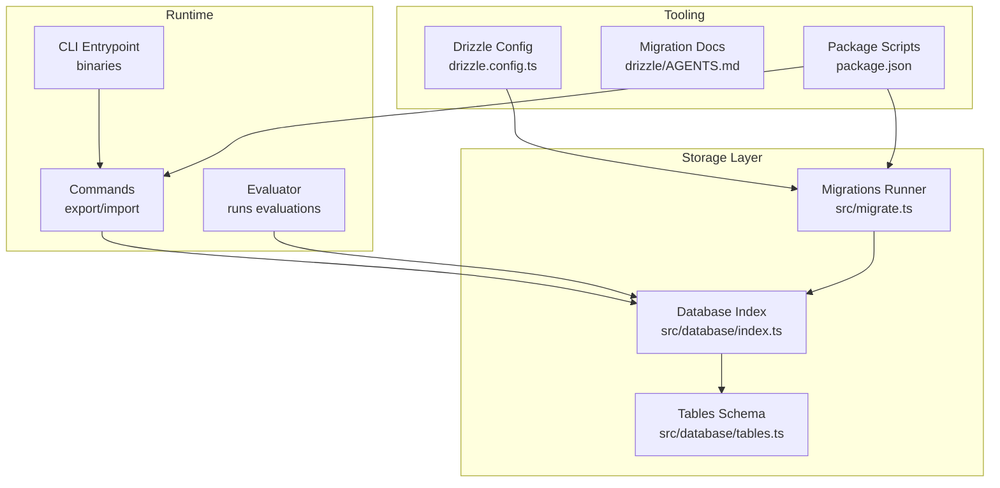
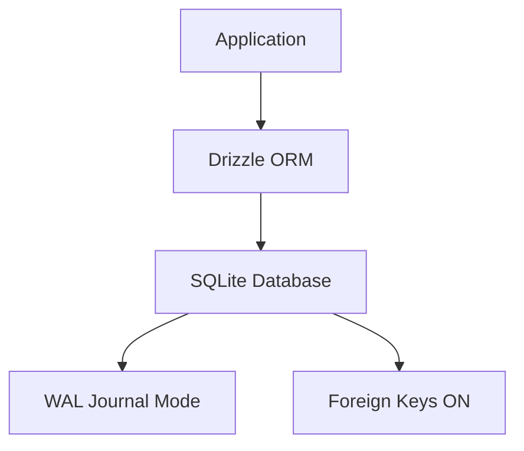
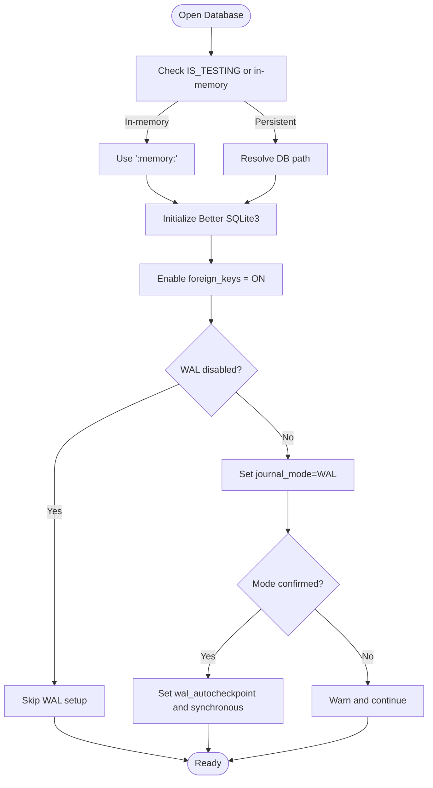
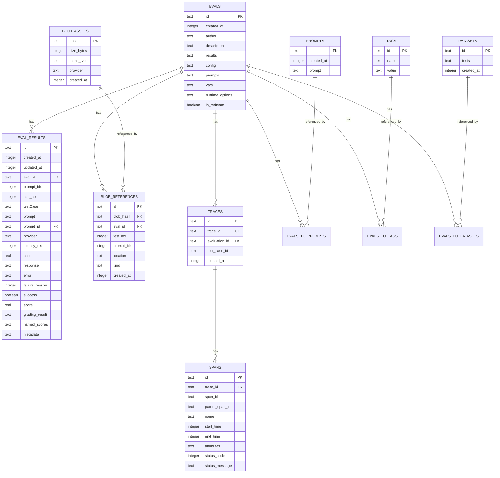
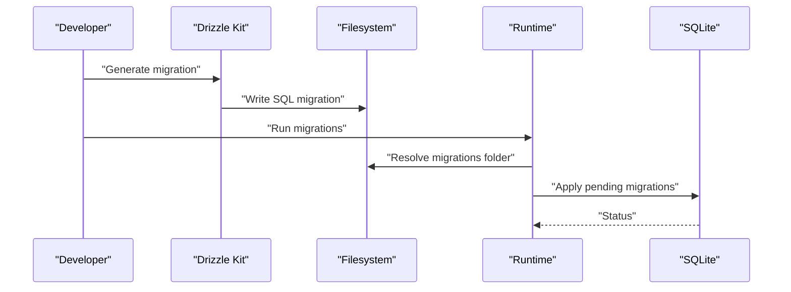
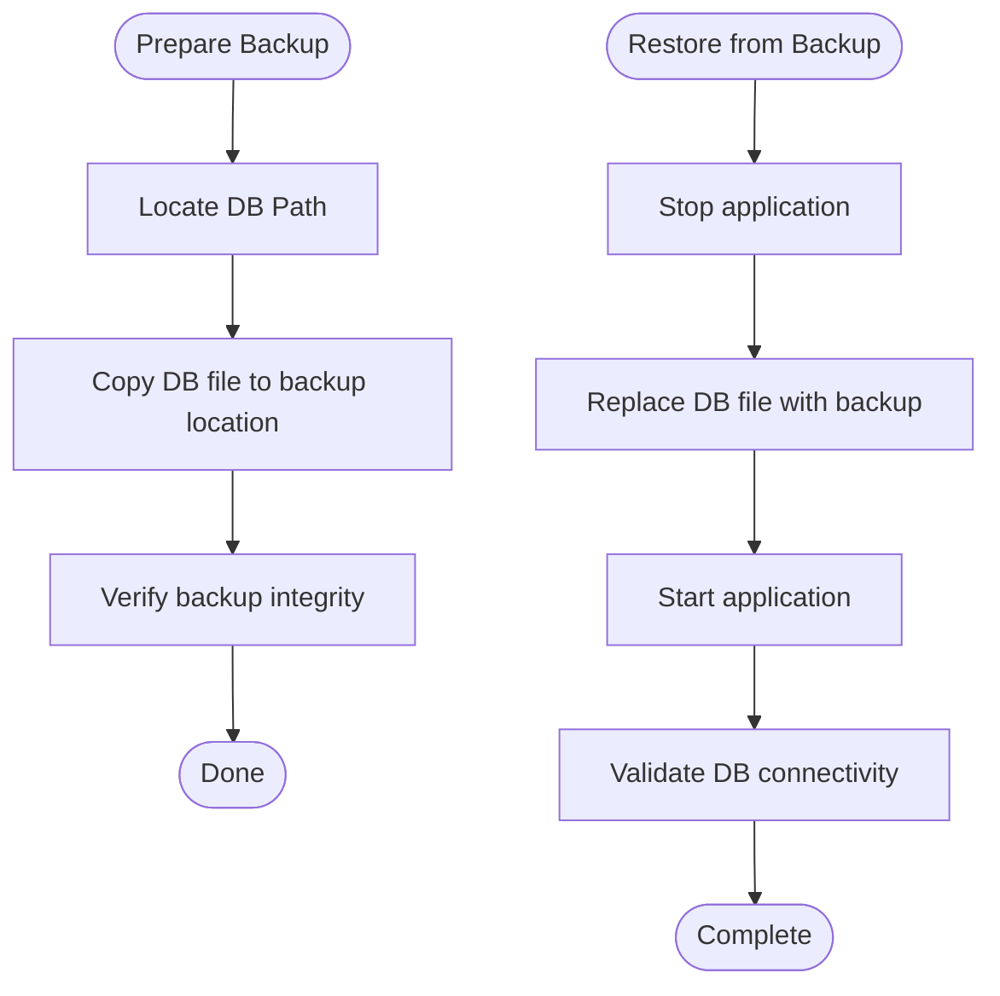
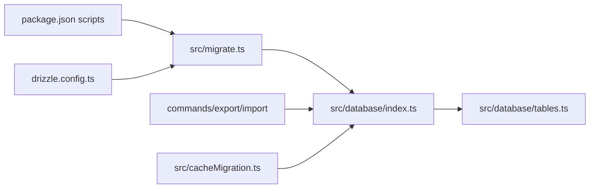

# Storage Operations & Maintenance

<cite>
**Referenced Files in This Document**
- [drizzle.config.ts](file://drizzle.config.ts)
- [AGENTS.md](file://drizzle/AGENTS.md)
- [package.json](file://package.json)
- [src/database/index.ts](file://src/database/index.ts)
- [src/database/tables.ts](file://src/database/tables.ts)
- [src/migrate.ts](file://src/migrate.ts)
- [src/cacheMigration.ts](file://src/cacheMigration.ts)
- [src/commands/export.ts](file://src/commands/export.ts)
- [src/commands/import.ts](file://src/commands/import.ts)
- [src/storage/local.ts](file://src/storage/local.ts)
- [src/util/config/manage.ts](file://src/util/config/manage.ts)
- [src/envars.ts](file://src/envars.ts)
- [src/logger.ts](file://src/logger.ts)
- [src/util/logs.ts](file://src/util/logs.ts)
- [src/util/fs.ts](file://src/util/fs.ts)
- [src/util/apiHealth.ts](file://src/util/apiHealth.ts)
- [docs/agents/database-security.md](file://docs/agents/database-security.md)
</cite>

## Table of Contents
1. [Introduction](#introduction)
2. [Project Structure](#project-structure)
3. [Core Components](#core-components)
4. [Architecture Overview](#architecture-overview)
5. [Detailed Component Analysis](#detailed-component-analysis)
6. [Dependency Analysis](#dependency-analysis)
7. [Performance Considerations](#performance-considerations)
8. [Troubleshooting Guide](#troubleshooting-guide)
9. [Conclusion](#conclusion)
10. [Appendices](#appendices)

## Introduction
This document provides comprehensive storage operations and maintenance guidance for PromptFoo. It covers database configuration, migrations, backups and restores, integrity checks, performance tuning, cleanup procedures, monitoring, capacity planning, security, scaling, and disaster recovery. The content is grounded in the repository’s database layer, migration tooling, and operational scripts.

## Project Structure
PromptFoo uses an embedded SQLite database accessed via Drizzle ORM and Better SQLite3. Migrations are managed by Drizzle Kit and applied at runtime. Configuration and environment variables control database location, WAL mode, and logging. Operational commands support export/import of evaluation data.

**Diagram sources**
- [src/database/index.ts:29-77](file://src/database/index.ts#L29-L77)
- [src/database/tables.ts:1-496](file://src/database/tables.ts#L1-L496)
- [src/migrate.ts:47-82](file://src/migrate.ts#L47-L82)
- [drizzle.config.ts:1-12](file://drizzle.config.ts#L1-L12)
- [AGENTS.md:1-69](file://drizzle/AGENTS.md#L1-L69)
- [package.json:38-86](file://package.json#L38-L86)

**Section sources**
- [drizzle.config.ts:1-12](file://drizzle.config.ts#L1-L12)
- [AGENTS.md:1-69](file://drizzle/AGENTS.md#L1-L69)
- [package.json:38-86](file://package.json#L38-L86)

## Core Components
- Database connection and WAL configuration: Establishes SQLite connection, enables foreign keys, sets journal mode to WAL (unless disabled), and configures synchronous mode and auto-checkpointing.
- Schema definitions: Define relational tables, indexes, and relations for evaluations, prompts, tags, datasets, blob assets/references, model audits, and tracing spans/traces.
- Migration system: Drizzle Kit generates SQL migrations; runtime runner applies pending migrations from source or distribution paths.
- Operational commands: Export and import commands for evaluation data; cache migration utilities for storage cleanup and backup.
- Environment and configuration: Database path resolution, signal file path, environment flags for WAL mode and database logs.

**Section sources**
- [src/database/index.ts:21-122](file://src/database/index.ts#L21-L122)
- [src/database/tables.ts:28-496](file://src/database/tables.ts#L28-L496)
- [src/migrate.ts:47-82](file://src/migrate.ts#L47-L82)
- [drizzle.config.ts:1-12](file://drizzle.config.ts#L1-L12)
- [AGENTS.md:11-32](file://drizzle/AGENTS.md#L11-L32)

## Architecture Overview
The storage architecture centers on an embedded SQLite database configured for concurrent reads/writes via WAL mode. Drizzle ORM provides type-safe schema definitions and migration execution. Migrations are generated from schema changes and applied at startup or via dedicated scripts. Evaluation results and related artifacts are stored in normalized tables with indexes optimized for common queries.

**Diagram sources**
- [src/database/index.ts:34-71](file://src/database/index.ts#L34-L71)
- [src/database/tables.ts:28-155](file://src/database/tables.ts#L28-L155)

## Detailed Component Analysis

### Database Connection and WAL Configuration
- Initializes Better SQLite3 connection and enables foreign keys.
- Attempts to enable WAL mode unless explicitly disabled or in-memory testing mode.
- Verifies WAL activation and logs warnings if unsupported (e.g., network filesystems).
- Sets wal_autocheckpoint and synchronous modes for performance.
- Provides safe close routine with optional WAL checkpoint before closing.

**Diagram sources**
- [src/database/index.ts:34-71](file://src/database/index.ts#L34-L71)

**Section sources**
- [src/database/index.ts:29-103](file://src/database/index.ts#L29-L103)

### Schema and Indexes
- Prompts, tags, evals, eval results, datasets, and relations define the evaluation data model.
- Blob assets and references track media artifacts with provider and MIME type indexing.
- Tracing spans and traces capture execution traces for debugging.
- JSON columns store complex evaluation metadata and results.

**Diagram sources**
- [src/database/tables.ts:28-496](file://src/database/tables.ts#L28-L496)

**Section sources**
- [src/database/tables.ts:28-496](file://src/database/tables.ts#L28-L496)

### Migration System
- Drizzle Kit configuration defines schema path and SQLite file URL.
- Migration generation and application are exposed via package scripts.
- Runtime migration runner resolves migrations folder across source and distribution contexts.
- Direct execution detection supports running migrations standalone.

**Diagram sources**
- [drizzle.config.ts:1-12](file://drizzle.config.ts#L1-L12)
- [AGENTS.md:11-32](file://drizzle/AGENTS.md#L11-L32)
- [src/migrate.ts:47-82](file://src/migrate.ts#L47-L82)

**Section sources**
- [drizzle.config.ts:1-12](file://drizzle.config.ts#L1-L12)
- [AGENTS.md:11-32](file://drizzle/AGENTS.md#L11-L32)
- [src/migrate.ts:47-82](file://src/migrate.ts#L47-L82)

### Backup and Restore Procedures
- Backup: Use SQLite’s built-in backup command against the resolved database path.
- Restore: Replace the database file with the backup copy and ensure proper permissions.
- Operational commands: Export and import commands operate on evaluation data and logs; they can be combined with filesystem-level backups for complete recovery.

**Diagram sources**
- [AGENTS.md:54-55](file://drizzle/AGENTS.md#L54-L55)
- [src/database/index.ts:21-23](file://src/database/index.ts#L21-L23)
- [src/commands/export.ts](file://src/commands/export.ts)
- [src/commands/import.ts](file://src/commands/import.ts)

**Section sources**
- [AGENTS.md:54-55](file://drizzle/AGENTS.md#L54-L55)
- [src/database/index.ts:21-23](file://src/database/index.ts#L21-L23)
- [src/commands/export.ts](file://src/commands/export.ts)
- [src/commands/import.ts](file://src/commands/import.ts)

### Storage Cleanup and Temporary Management
- Cache migration utility:
  - Calculates cache directory size and available disk space.
  - Creates backups before migrating cache entries.
  - Retains backups when failures occur for debugging; removes backups when only expired entries existed.
  - Cleans up backup directories after successful migration.
- Temporary file management:
  - Signal file indicates last written evaluation for coordination.
  - Logs directory managed via utility functions; logs can be archived externally.

**Section sources**
- [src/cacheMigration.ts:100-120](file://src/cacheMigration.ts#L100-L120)
- [src/cacheMigration.ts:603-625](file://src/cacheMigration.ts#L603-L625)
- [src/database/index.ts:25-27](file://src/database/index.ts#L25-L27)
- [src/util/logs.ts](file://src/util/logs.ts)

### Monitoring and Health Checks
- Database connectivity and WAL mode verification are logged during initialization.
- Health checks for remote APIs are supported by utility functions; similar patterns can be adapted for database reachability.
- Logging can be enabled for SQL statements via environment flag.

**Section sources**
- [src/database/index.ts:46-71](file://src/database/index.ts#L46-L71)
- [src/envars.ts](file://src/envars.ts)
- [src/util/apiHealth.ts](file://src/util/apiHealth.ts)

### Security Measures
- Encryption:
  - SQLite does not provide transparent encryption; use filesystem-level encryption or database encryption at rest.
- Access controls:
  - Restrict file system permissions on the database directory.
  - Use environment variables to control database path and logging.
- Audit and hardening:
  - Review database-security documentation for additional guidance.

**Section sources**
- [docs/agents/database-security.md](file://docs/agents/database-security.md)

## Dependency Analysis
- Drizzle ORM and Better SQLite3 form the core persistence layer.
- Drizzle Kit manages schema evolution and migration generation.
- Package scripts orchestrate migration lifecycle and development workflows.
- Operational commands depend on database connectivity and filesystem access.

**Diagram sources**
- [package.json:38-86](file://package.json#L38-L86)
- [drizzle.config.ts:1-12](file://drizzle.config.ts#L1-L12)
- [src/migrate.ts:47-82](file://src/migrate.ts#L47-L82)
- [src/database/index.ts:29-77](file://src/database/index.ts#L29-L77)
- [src/database/tables.ts:28-155](file://src/database/tables.ts#L28-L155)
- [src/commands/export.ts](file://src/commands/export.ts)
- [src/commands/import.ts](file://src/commands/import.ts)
- [src/cacheMigration.ts:100-120](file://src/cacheMigration.ts#L100-L120)

**Section sources**
- [package.json:38-86](file://package.json#L38-L86)
- [drizzle.config.ts:1-12](file://drizzle.config.ts#L1-L12)
- [src/migrate.ts:47-82](file://src/migrate.ts#L47-L82)
- [src/database/index.ts:29-77](file://src/database/index.ts#L29-L77)
- [src/database/tables.ts:28-155](file://src/database/tables.ts#L28-L155)
- [src/commands/export.ts](file://src/commands/export.ts)
- [src/commands/import.ts](file://src/commands/import.ts)
- [src/cacheMigration.ts:100-120](file://src/cacheMigration.ts#L100-L120)

## Performance Considerations
- WAL mode improves concurrency and read throughput; verify activation and adjust wal_autocheckpoint based on workload.
- Synchronous mode set to NORMAL balances durability and performance under WAL.
- Indexes on frequently queried columns (creation timestamps, foreign keys, JSON-extracted fields) reduce query times.
- Prefer batch operations and limit large JSON payloads where possible.
- Monitor checkpoint frequency and tune based on write patterns.

[No sources needed since this section provides general guidance]

## Troubleshooting Guide
- WAL mode not enabled:
  - Symptoms: Reduced performance or warnings about journal mode.
  - Actions: Confirm filesystem support; disable WAL mode via environment variable if necessary.
- Migration failures:
  - Use migration logs and re-run with verbose logging; ensure migrations folder path is correct in both source and distribution contexts.
- Database corruption or lock issues:
  - Perform backup, rebuild database from scratch, and reapply migrations; verify foreign key constraints and indexes.
- Disk space constraints during cache migration:
  - Ensure sufficient free space; backups require ~2x cache size plus overhead.
- Health and connectivity:
  - Use database connectivity checks and environment-based logging to diagnose issues.

**Section sources**
- [src/database/index.ts:46-71](file://src/database/index.ts#L46-L71)
- [src/migrate.ts:47-82](file://src/migrate.ts#L47-L82)
- [src/cacheMigration.ts:100-120](file://src/cacheMigration.ts#L100-L120)
- [src/envars.ts](file://src/envars.ts)

## Conclusion
PromptFoo’s storage layer is designed for simplicity and performance using an embedded SQLite database with WAL mode and Drizzle ORM. Robust migration tooling, operational commands, and cleanup utilities support ongoing maintenance. Adhering to the procedures outlined here ensures reliable operation, integrity, and scalability.

[No sources needed since this section summarizes without analyzing specific files]

## Appendices

### Maintenance Schedules and Automated Tasks
- Daily:
  - Monitor database connectivity and WAL mode status.
  - Review logs for migration and cache migration activity.
- Weekly:
  - Verify backup copies and validate restore procedure.
  - Review index usage and query performance.
- Monthly:
  - Rebuild indexes if fragmentation suspected.
  - Archive and retain logs per retention policy.
- Quarterly:
  - Capacity planning review and growth forecasting.
  - Update and test disaster recovery procedures.

[No sources needed since this section provides general guidance]

### Disaster Recovery and Business Continuity
- Maintain off-host backups of the database file.
- Test restore procedures regularly.
- Document environment variables and configuration locations.
- Coordinate with application restart procedures and migration validation.

**Section sources**
- [AGENTS.md:54-55](file://drizzle/AGENTS.md#L54-L55)
- [src/database/index.ts:21-23](file://src/database/index.ts#L21-L23)