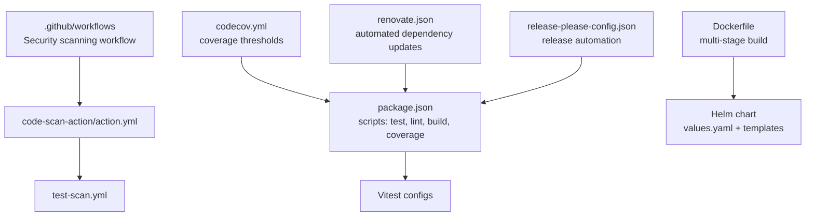
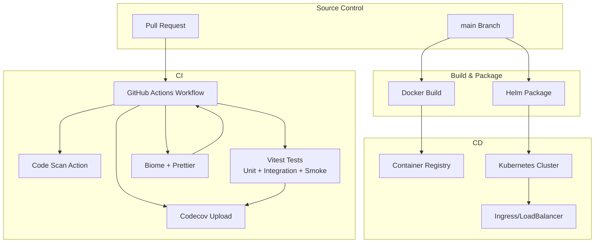
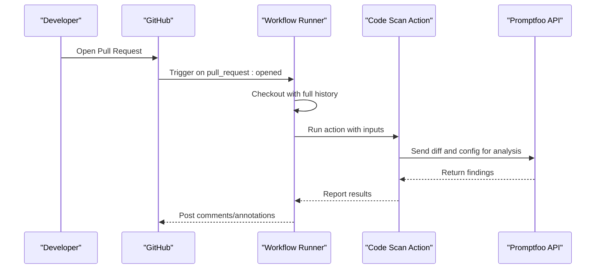
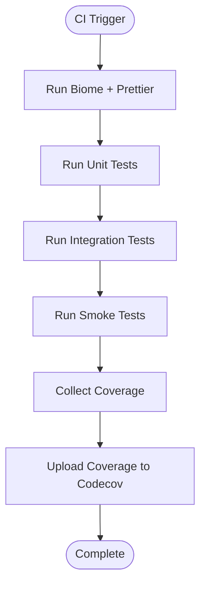
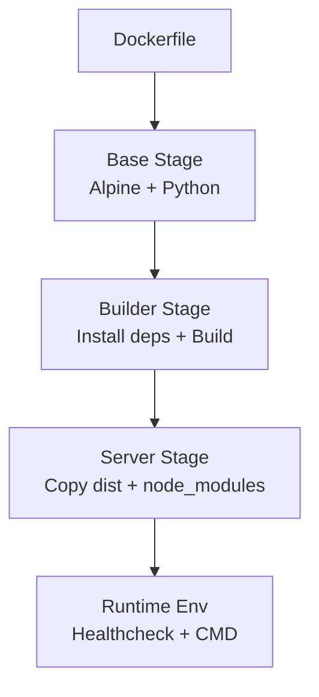
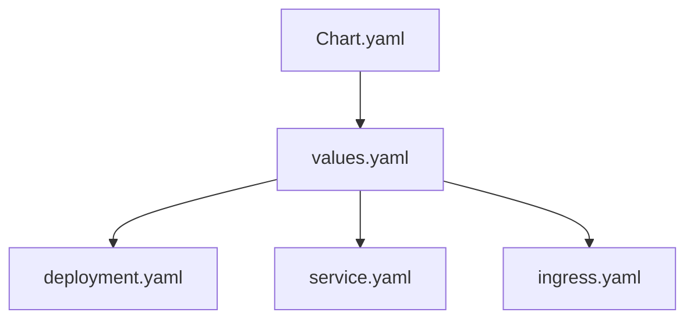
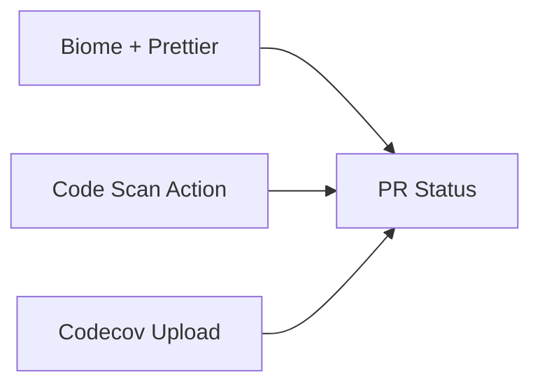
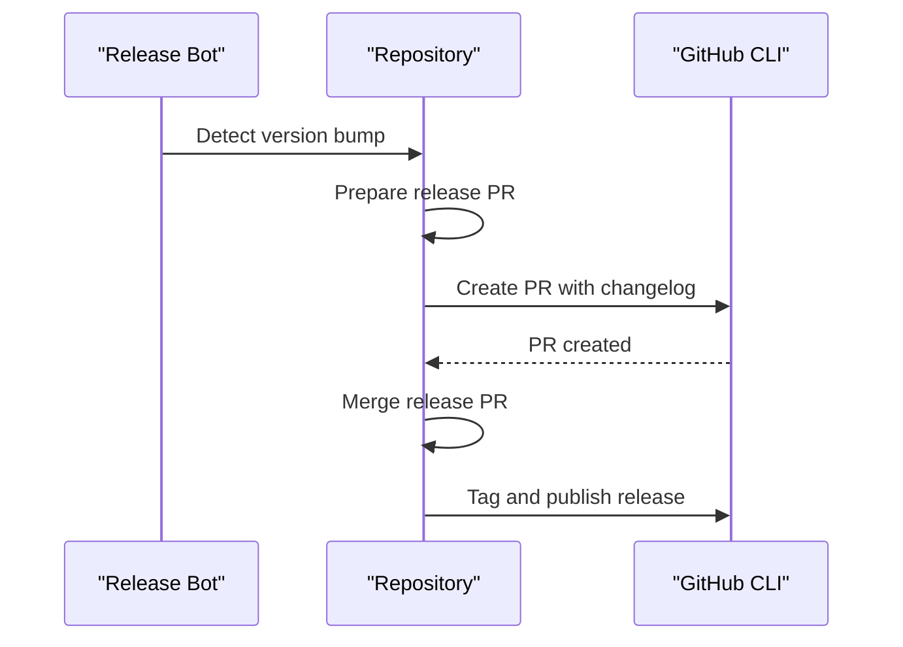
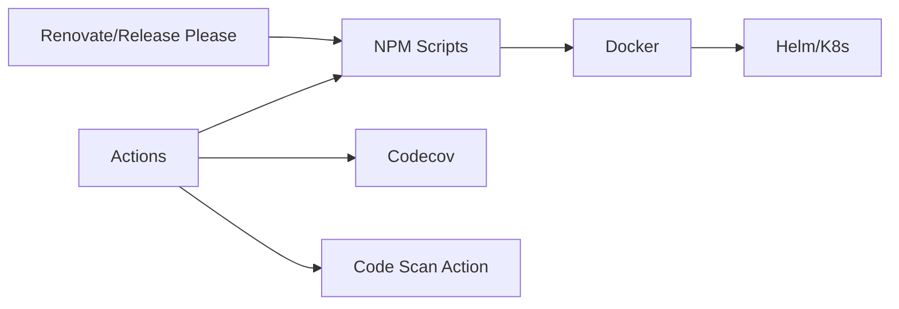

# CI/CD Integration

<cite>
**Referenced Files in This Document**
- [Dockerfile](file://Dockerfile)
- [package.json](file://package.json)
- [codecov.yml](file://codecov.yml)
- [code-scan-action/action.yml](file://code-scan-action/action.yml)
- [code-scan-action/.github/workflows/test-scan.yml](file://code-scan-action/.github/workflows/test-scan.yml)
- [vitest.config.ts](file://vitest.config.ts)
- [vitest.integration.config.ts](file://vitest.integration.config.ts)
- [vitest.smoke.config.ts](file://vitest.smoke.config.ts)
- [renovate.json](file://renovate.json)
- [release-please-config.json](file://release-please-config.json)
- [helm/chart/promptfoo/values.yaml](file://helm/chart/promptfoo/values.yaml)
- [helm/chart/promptfoo/templates/deployment.yaml](file://helm/chart/promptfoo/templates/deployment.yaml)
- [helm/chart/promptfoo/templates/service.yaml](file://helm/chart/promptfoo/templates/service.yaml)
- [helm/chart/promptfoo/templates/ingress.yaml](file://helm/chart/promptfoo/templates/ingress.yaml)
- [helm/chart/promptfoo/Chart.yaml](file://helm/chart/promptfoo/Chart.yaml)
</cite>

## Table of Contents
1. [Introduction](#introduction)
2. [Project Structure](#project-structure)
3. [Core Components](#core-components)
4. [Architecture Overview](#architecture-overview)
5. [Detailed Component Analysis](#detailed-component-analysis)
6. [Dependency Analysis](#dependency-analysis)
7. [Performance Considerations](#performance-considerations)
8. [Troubleshooting Guide](#troubleshooting-guide)
9. [Conclusion](#conclusion)
10. [Appendices](#appendices)

## Introduction
This document provides comprehensive CI/CD integration guidance for PromptFoo automated workflows. It covers continuous integration, testing, and deployment pipelines across GitHub Actions, Docker, Helm, and related automation tools. It explains workflow triggers, job dependencies, artifact management, automated testing strategies (unit, integration, smoke), deployment targets (Docker, Kubernetes), code quality and security scanning, dependency management, branch protection and release processes, and cross-platform CI examples (Jenkins, GitLab CI, Azure DevOps). Guidance also includes secrets management, environment configuration, and rollback procedures.

## Project Structure
PromptFoo’s CI/CD capabilities are supported by:
- GitHub Actions workflows for security scanning and local testing
- NPM scripts for building, testing, linting, and publishing
- Docker containerization for runtime deployment
- Helm charts for Kubernetes deployments
- Coverage reporting via Codecov
- Automated dependency updates via Renovate and Release Please

**Diagram sources**
- [code-scan-action/.github/workflows/test-scan.yml:1-47](file://code-scan-action/.github/workflows/test-scan.yml#L1-L47)
- [code-scan-action/action.yml:1-43](file://code-scan-action/action.yml#L1-L43)
- [package.json:38-85](file://package.json#L38-L85)
- [Dockerfile:1-67](file://Dockerfile#L1-L67)
- [helm/chart/promptfoo/values.yaml](file://helm/chart/promptfoo/values.yaml)
- [helm/chart/promptfoo/templates/deployment.yaml](file://helm/chart/promptfoo/templates/deployment.yaml)
- [helm/chart/promptfoo/templates/service.yaml](file://helm/chart/promptfoo/templates/service.yaml)
- [helm/chart/promptfoo/templates/ingress.yaml](file://helm/chart/promptfoo/templates/ingress.yaml)
- [codecov.yml:1-58](file://codecov.yml#L1-L58)
- [renovate.json](file://renovate.json)
- [release-please-config.json](file://release-please-config.json)

**Section sources**
- [code-scan-action/.github/workflows/test-scan.yml:1-47](file://code-scan-action/.github/workflows/test-scan.yml#L1-L47)
- [code-scan-action/action.yml:1-43](file://code-scan-action/action.yml#L1-L43)
- [package.json:38-85](file://package.json#L38-L85)
- [Dockerfile:1-67](file://Dockerfile#L1-L67)
- [codecov.yml:1-58](file://codecov.yml#L1-L58)
- [renovate.json](file://renovate.json)
- [release-please-config.json](file://release-please-config.json)
- [helm/chart/promptfoo/values.yaml](file://helm/chart/promptfoo/values.yaml)
- [helm/chart/promptfoo/templates/deployment.yaml](file://helm/chart/promptfoo/templates/deployment.yaml)
- [helm/chart/promptfoo/templates/service.yaml](file://helm/chart/promptfoo/templates/service.yaml)
- [helm/chart/promptfoo/templates/ingress.yaml](file://helm/chart/promptfoo/templates/ingress.yaml)
- [helm/chart/promptfoo/Chart.yaml](file://helm/chart/promptfoo/Chart.yaml)

## Core Components
- GitHub Actions Security Scanner: A reusable action that scans pull requests for LLM security vulnerabilities during PR lifecycle.
- NPM Scripts: Centralized automation for linting, formatting, testing, coverage, builds, and publishing.
- Docker Image: Multi-stage build producing a secure, minimal runtime image with health checks.
- Helm Charts: Kubernetes manifests for deployment, service exposure, and ingress configuration.
- Codecov: Coverage reporting configuration enforcing coverage targets and ignoring generated/test paths.
- Dependency Automation: Renovate for automated dependency updates; Release Please for release PRs and changelog generation.

**Section sources**
- [code-scan-action/action.yml:1-43](file://code-scan-action/action.yml#L1-L43)
- [code-scan-action/.github/workflows/test-scan.yml:1-47](file://code-scan-action/.github/workflows/test-scan.yml#L1-L47)
- [package.json:38-85](file://package.json#L38-L85)
- [Dockerfile:1-67](file://Dockerfile#L1-L67)
- [codecov.yml:1-58](file://codecov.yml#L1-L58)
- [renovate.json](file://renovate.json)
- [release-please-config.json](file://release-please-config.json)
- [helm/chart/promptfoo/values.yaml](file://helm/chart/promptfoo/values.yaml)
- [helm/chart/promptfoo/templates/deployment.yaml](file://helm/chart/promptfoo/templates/deployment.yaml)
- [helm/chart/promptfoo/templates/service.yaml](file://helm/chart/promptfoo/templates/service.yaml)
- [helm/chart/promptfoo/templates/ingress.yaml](file://helm/chart/promptfoo/templates/ingress.yaml)
- [helm/chart/promptfoo/Chart.yaml](file://helm/chart/promptfoo/Chart.yaml)

## Architecture Overview
The CI/CD pipeline integrates GitHub Actions, NPM automation, Docker, and Helm to deliver a robust development-to-production workflow.

**Diagram sources**
- [code-scan-action/.github/workflows/test-scan.yml:1-47](file://code-scan-action/.github/workflows/test-scan.yml#L1-L47)
- [code-scan-action/action.yml:1-43](file://code-scan-action/action.yml#L1-L43)
- [package.json:38-85](file://package.json#L38-L85)
- [codecov.yml:1-58](file://codecov.yml#L1-L58)
- [Dockerfile:1-67](file://Dockerfile#L1-L67)
- [helm/chart/promptfoo/values.yaml](file://helm/chart/promptfoo/values.yaml)
- [helm/chart/promptfoo/templates/deployment.yaml](file://helm/chart/promptfoo/templates/deployment.yaml)
- [helm/chart/promptfoo/templates/service.yaml](file://helm/chart/promptfoo/templates/service.yaml)
- [helm/chart/promptfoo/templates/ingress.yaml](file://helm/chart/promptfoo/templates/ingress.yaml)

## Detailed Component Analysis

### GitHub Actions Security Scanning Workflow
- Trigger: Pull request opened events.
- Permissions: Token scopes for content, pull requests, and OIDC identity.
- Steps:
  - Checkout repository with full history for accurate diffs.
  - Optional local git initialization for local testing environments.
  - Setup Node.js runtime aligned with the action’s runtime.
  - Run the Promptfoo Code Scan action with configurable inputs (API host, minimum severity, guidance, fork PRs, token).
- Outputs: Comments and annotations on PRs indicating security findings.

**Diagram sources**
- [code-scan-action/.github/workflows/test-scan.yml:1-47](file://code-scan-action/.github/workflows/test-scan.yml#L1-L47)
- [code-scan-action/action.yml:1-43](file://code-scan-action/action.yml#L1-L43)

**Section sources**
- [code-scan-action/.github/workflows/test-scan.yml:1-47](file://code-scan-action/.github/workflows/test-scan.yml#L1-L47)
- [code-scan-action/action.yml:1-43](file://code-scan-action/action.yml#L1-L43)

### Automated Testing Strategies
- Unit tests: Executed via Vitest with a dedicated configuration.
- Integration tests: Separate Vitest configuration for integration suites.
- Smoke tests: Dedicated smoke test configuration for quick regression checks.
- Coverage: Combined coverage collection across backend and frontend workspaces.
- Formatting and linting: Biome CI and Prettier checks integrated into CI.

**Diagram sources**
- [package.json:38-85](file://package.json#L38-L85)
- [codecov.yml:1-58](file://codecov.yml#L1-L58)
- [vitest.config.ts](file://vitest.config.ts)
- [vitest.integration.config.ts](file://vitest.integration.config.ts)
- [vitest.smoke.config.ts](file://vitest.smoke.config.ts)

**Section sources**
- [package.json:38-85](file://package.json#L38-L85)
- [codecov.yml:1-58](file://codecov.yml#L1-L58)
- [vitest.config.ts](file://vitest.config.ts)
- [vitest.integration.config.ts](file://vitest.integration.config.ts)
- [vitest.smoke.config.ts](file://vitest.smoke.config.ts)

### Docker Image Build and Deployment
- Multi-stage build:
  - Base stage installs Python and sets up non-root user.
  - Builder stage installs dependencies, builds React app, and compiles TypeScript.
  - Server stage copies built artifacts and sets runtime environment variables.
- Runtime:
  - Exposes port 3000.
  - Health check endpoint for readiness.
  - Runs as non-root user.
- Build arguments:
  - PYTHON_VERSION, VITE_PUBLIC_BASENAME, PROMPTFOO_REMOTE_API_BASE_URL.

**Diagram sources**
- [Dockerfile:1-67](file://Dockerfile#L1-L67)

**Section sources**
- [Dockerfile:1-67](file://Dockerfile#L1-L67)

### Kubernetes Deployment with Helm
- Chart metadata and values define deployment, service, and ingress resources.
- Typical resources:
  - Deployment: Container image, replicas, environment variables, probes.
  - Service: ClusterIP/NodePort/LB exposure.
  - Ingress: TLS termination and routing rules.
- Values customization supports environment-specific overrides.

**Diagram sources**
- [helm/chart/promptfoo/Chart.yaml](file://helm/chart/promptfoo/Chart.yaml)
- [helm/chart/promptfoo/values.yaml](file://helm/chart/promptfoo/values.yaml)
- [helm/chart/promptfoo/templates/deployment.yaml](file://helm/chart/promptfoo/templates/deployment.yaml)
- [helm/chart/promptfoo/templates/service.yaml](file://helm/chart/promptfoo/templates/service.yaml)
- [helm/chart/promptfoo/templates/ingress.yaml](file://helm/chart/promptfoo/templates/ingress.yaml)

**Section sources**
- [helm/chart/promptfoo/Chart.yaml](file://helm/chart/promptfoo/Chart.yaml)
- [helm/chart/promptfoo/values.yaml](file://helm/chart/promptfoo/values.yaml)
- [helm/chart/promptfoo/templates/deployment.yaml](file://helm/chart/promptfoo/templates/deployment.yaml)
- [helm/chart/promptfoo/templates/service.yaml](file://helm/chart/promptfoo/templates/service.yaml)
- [helm/chart/promptfoo/templates/ingress.yaml](file://helm/chart/promptfoo/templates/ingress.yaml)

### Code Quality Checks and Security Scanning
- Code quality:
  - Biome CI linting and formatting checks.
  - Prettier formatting enforcement for non-TypeScript files.
- Security scanning:
  - Promptfoo Code Scan action invoked on PRs with configurable severity and guidance.
- Coverage:
  - Codecov configuration enforces project and patch coverage targets and ignores generated/test paths.

**Diagram sources**
- [package.json:54-65](file://package.json#L54-L65)
- [code-scan-action/action.yml:1-43](file://code-scan-action/action.yml#L1-L43)
- [codecov.yml:1-58](file://codecov.yml#L1-L58)

**Section sources**
- [package.json:54-65](file://package.json#L54-L65)
- [code-scan-action/action.yml:1-43](file://code-scan-action/action.yml#L1-L43)
- [codecov.yml:1-58](file://codecov.yml#L1-L58)

### Dependency Management and Release Automation
- Automated dependency updates:
  - Renovate configured for scheduled and on-demand updates.
- Release automation:
  - Release Please generates release PRs and changelogs.
  - Pre/post version hooks integrate with GitHub CLI and changelog generation.

**Diagram sources**
- [release-please-config.json](file://release-please-config.json)
- [package.json:68-71](file://package.json#L68-L71)
- [renovate.json](file://renovate.json)

**Section sources**
- [release-please-config.json](file://release-please-config.json)
- [package.json:68-71](file://package.json#L68-L71)
- [renovate.json](file://renovate.json)

### Secrets Management and Environment Configuration
- Secrets:
  - Use repository-level secrets for tokens and credentials (e.g., GitHub token for PR annotations).
  - For production deployments, manage registry credentials and Kubernetes secrets externally.
- Environment variables:
  - Docker build-time args for Python version and public basename.
  - Runtime environment variables for API base URL and telemetry.
  - Helm values support environment-specific overrides.

**Section sources**
- [code-scan-action/.github/workflows/test-scan.yml:31-46](file://code-scan-action/.github/workflows/test-scan.yml#L31-L46)
- [Dockerfile:8-28](file://Dockerfile#L8-L28)
- [helm/chart/promptfoo/values.yaml](file://helm/chart/promptfoo/values.yaml)

### Rollback Procedures
- Docker/Kubernetes:
  - Rollback by redeploying previous image tag or Helm revision.
  - Use rolling updates with replica counts and readiness probes to minimize downtime.
- CI/CD safety:
  - Gate deployments behind coverage and security checks.
  - Use canary or blue/green strategies via Helm values and Ingress rules.

**Section sources**
- [Dockerfile:63-66](file://Dockerfile#L63-L66)
- [helm/chart/promptfoo/templates/deployment.yaml](file://helm/chart/promptfoo/templates/deployment.yaml)
- [helm/chart/promptfoo/templates/ingress.yaml](file://helm/chart/promptfoo/templates/ingress.yaml)

## Dependency Analysis
The CI/CD stack exhibits low coupling between components, with clear separation of concerns:
- GitHub Actions orchestrates security scanning and local testing.
- NPM scripts encapsulate build, test, lint, and coverage tasks.
- Docker and Helm provide portable packaging and deployment abstractions.
- Codecov and automation tools enforce quality gates.

**Diagram sources**
- [code-scan-action/.github/workflows/test-scan.yml:1-47](file://code-scan-action/.github/workflows/test-scan.yml#L1-L47)
- [package.json:38-85](file://package.json#L38-L85)
- [Dockerfile:1-67](file://Dockerfile#L1-L67)
- [helm/chart/promptfoo/values.yaml](file://helm/chart/promptfoo/values.yaml)
- [codecov.yml:1-58](file://codecov.yml#L1-L58)
- [renovate.json](file://renovate.json)
- [release-please-config.json](file://release-please-config.json)

**Section sources**
- [code-scan-action/.github/workflows/test-scan.yml:1-47](file://code-scan-action/.github/workflows/test-scan.yml#L1-L47)
- [package.json:38-85](file://package.json#L38-L85)
- [Dockerfile:1-67](file://Dockerfile#L1-L67)
- [helm/chart/promptfoo/values.yaml](file://helm/chart/promptfoo/values.yaml)
- [codecov.yml:1-58](file://codecov.yml#L1-L58)
- [renovate.json](file://renovate.json)
- [release-please-config.json](file://release-please-config.json)

## Performance Considerations
- Build caching: Docker BuildKit cache for npm dependencies and incremental builds.
- Parallelization: NPM scripts leverage concurrent execution for faster feedback.
- Coverage scope: Exclude generated and test files to reduce noise and improve performance.
- Resource limits: Configure container resource requests/limits in Helm values for predictable performance.

[No sources needed since this section provides general guidance]

## Troubleshooting Guide
- Security scan failures:
  - Verify API host and minimum severity thresholds.
  - Ensure PRs include meaningful diffs and that fork PRs are enabled if needed.
- Coverage gaps:
  - Confirm coverage thresholds and ignored paths align with project structure.
  - Validate upload token and repository visibility settings.
- Docker build errors:
  - Check Python version argument and network connectivity for package installation.
  - Ensure build args are passed consistently across stages.
- Kubernetes rollout issues:
  - Inspect pod logs and readiness/liveness probe outcomes.
  - Validate Ingress rules and certificate configuration.

**Section sources**
- [code-scan-action/action.yml:9-38](file://code-scan-action/action.yml#L9-L38)
- [codecov.yml:4-58](file://codecov.yml#L4-L58)
- [Dockerfile:8-44](file://Dockerfile#L8-L44)
- [helm/chart/promptfoo/templates/deployment.yaml](file://helm/chart/promptfoo/templates/deployment.yaml)
- [helm/chart/promptfoo/templates/ingress.yaml](file://helm/chart/promptfoo/templates/ingress.yaml)

## Conclusion
PromptFoo’s CI/CD integration leverages GitHub Actions, NPM automation, Docker, and Helm to provide a robust pipeline for security scanning, testing, and deployment. By combining quality gates, automated dependency management, and standardized deployment manifests, teams can reliably deliver changes while maintaining security and performance.

[No sources needed since this section summarizes without analyzing specific files]

## Appendices

### Cross-Platform CI Examples

- Jenkins
  - Pipeline-as-Code with declarative Jenkinsfile.
  - Stages: Checkout, Lint, Test, Coverage, Docker Build, Helm Deploy.
  - Credentials: Use Jenkins credentials for container registry and Kubernetes.
  - Artifacts: Archive test results and coverage reports.

- GitLab CI
  - .gitlab-ci.yml with stages: lint, test, build, deploy.
  - Services: Use Docker-in-Docker or Kaniko for image builds.
  - Review Apps: Auto-deploy branches to ephemeral environments.

- Azure DevOps
  - YAML pipeline with jobs: Lint, Test, Publish Code Coverage, Build & Push Image, Helm Deploy.
  - Task groups: Reusable steps for linting and testing.
  - Variable groups: Securely manage secrets and environment variables.

[No sources needed since this section provides general guidance]