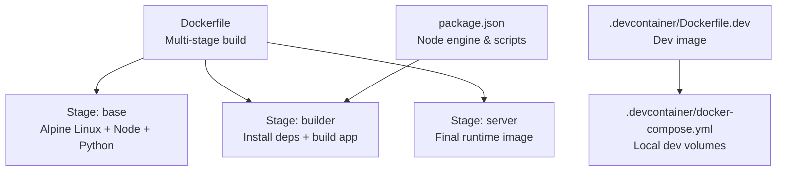
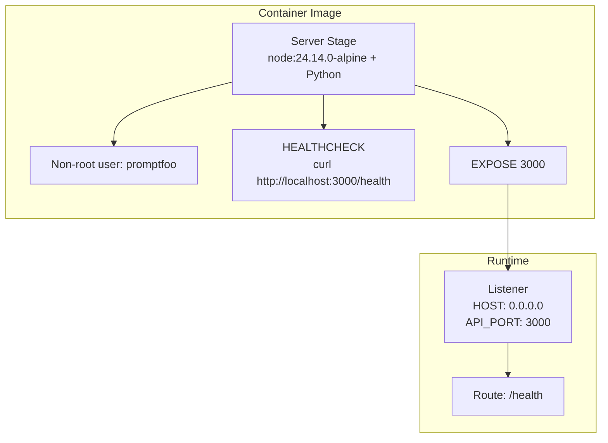
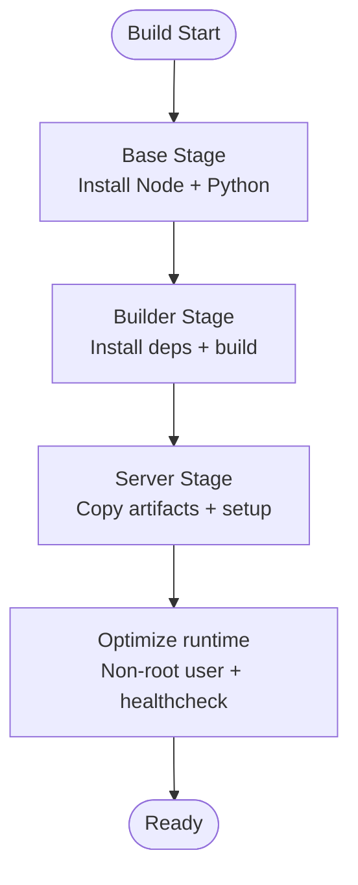
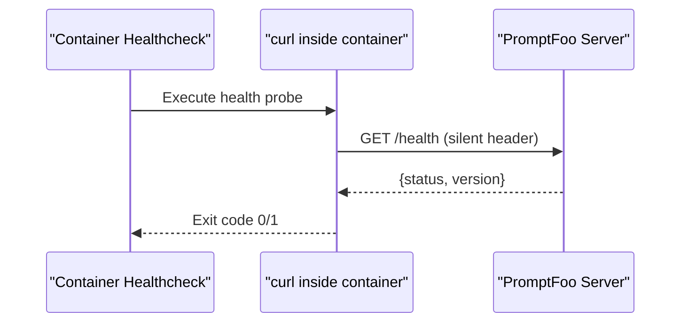
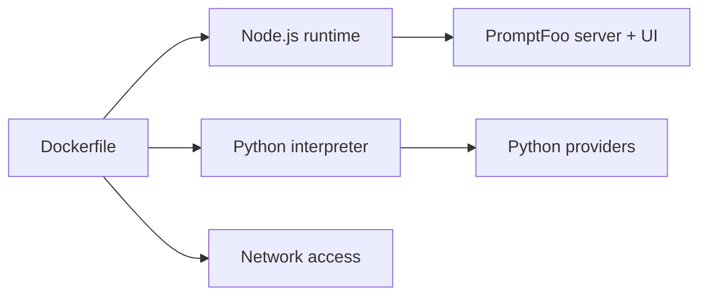

# Containerization

<cite>
**Referenced Files in This Document**
- [Dockerfile](file://Dockerfile)
- [.devcontainer/Dockerfile.dev](file://.devcontainer/Dockerfile.dev)
- [.devcontainer/docker-compose.yml](file://.devcontainer/docker-compose.yml)
- [package.json](file://package.json)
- [src/envars.ts](file://src/envars.ts)
- [src/server/index.ts](file://src/server/index.ts)
- [src/util/server.ts](file://src/util/server.ts)
</cite>

## Table of Contents
1. [Introduction](#introduction)
2. [Project Structure](#project-structure)
3. [Core Components](#core-components)
4. [Architecture Overview](#architecture-overview)
5. [Detailed Component Analysis](#detailed-component-analysis)
6. [Dependency Analysis](#dependency-analysis)
7. [Performance Considerations](#performance-considerations)
8. [Troubleshooting Guide](#troubleshooting-guide)
9. [Conclusion](#conclusion)
10. [Appendices](#appendices)

## Introduction
This document provides comprehensive containerization guidance for deploying PromptFoo using Docker. It covers the multi-stage build process, base image setup, Python installation for provider support, build optimization strategies, environment variable configuration for hosted deployments, security hardening through non-root user execution, health check implementation, networking and ports, volume mounting for persistence, build arguments for customization, and operational best practices for development, staging, and production environments.

## Project Structure
PromptFoo’s containerization is centered around a single Dockerfile that defines a multi-stage build. The repository also includes a developer container definition and a docker-compose configuration for local development.

**Diagram sources**
- [Dockerfile:1-67](file://Dockerfile#L1-L67)
- [.devcontainer/Dockerfile.dev:1-22](file://.devcontainer/Dockerfile.dev#L1-L22)
- [.devcontainer/docker-compose.yml:1-15](file://.devcontainer/docker-compose.yml#L1-L15)
- [package.json:1-326](file://package.json#L1-L326)

**Section sources**
- [Dockerfile:1-67](file://Dockerfile#L1-L67)
- [.devcontainer/Dockerfile.dev:1-22](file://.devcontainer/Dockerfile.dev#L1-L22)
- [.devcontainer/docker-compose.yml:1-15](file://.devcontainer/docker-compose.yml#L1-L15)
- [package.json:1-326](file://package.json#L1-L326)

## Core Components
- Multi-stage Docker build:
  - Base stage installs Node.js and Python for provider support.
  - Builder stage installs dependencies and builds the React app and server bundle.
  - Server stage produces the minimal runtime image with non-root user and health check.
- Environment variables:
  - Hosted mode flags and UI base path are configured during build.
  - Runtime environment variables are documented for security, networking, and provider configuration.
- Health check:
  - A simple HTTP health check probes the server’s health endpoint.
- Networking and ports:
  - The server listens on a configurable host/port and exposes the default port.
- Persistence:
  - Volume mounts are recommended for configuration and cache directories.

**Section sources**
- [Dockerfile:1-67](file://Dockerfile#L1-L67)
- [src/envars.ts:1-568](file://src/envars.ts#L1-L568)
- [src/server/index.ts:1-21](file://src/server/index.ts#L1-L21)
- [src/util/server.ts:102-116](file://src/util/server.ts#L102-L116)

## Architecture Overview
The containerized PromptFoo runtime consists of:
- A minimal Node.js server serving the built UI and API.
- Optional Python support for providers and custom logic.
- Non-root user execution for security.
- Health check integration for container orchestrators.

**Diagram sources**
- [Dockerfile:46-67](file://Dockerfile#L46-L67)
- [src/util/server.ts:102-116](file://src/util/server.ts#L102-L116)

## Detailed Component Analysis

### Multi-Stage Build Process
- Base stage:
  - Uses an Alpine Linux Node.js image.
  - Upgrades system packages and creates a dedicated non-root user.
  - Installs Python with a configurable version via build argument.
- Builder stage:
  - Sets hosted/build-time flags and UI base path.
  - Uses deterministic dependency installation with BuildKit cache.
  - Builds the React app and server bundle.
- Server stage:
  - Copies built artifacts and sets up a symlink to the package.
  - Creates a persistent home directory for configuration.
  - Switches to non-root user and exposes the default port.
  - Defines a health check probing the server’s health endpoint.

**Diagram sources**
- [Dockerfile:2-67](file://Dockerfile#L2-L67)

**Section sources**
- [Dockerfile:2-67](file://Dockerfile#L2-L67)

### Python Installation for Provider Support
- Python is installed in the base stage with a configurable version via build argument.
- This enables Python-based providers and custom logic without bloating the runtime image further.

**Section sources**
- [Dockerfile:8-13](file://Dockerfile#L8-L13)

### Build Optimization Strategies
- Deterministic dependency installation with BuildKit cache for npm modules.
- Separate builder stage to keep the final runtime image small.
- Minimal base image (Alpine) and explicit package installation.

**Section sources**
- [Dockerfile:30-44](file://Dockerfile#L30-L44)

### Environment Variables for Hosted Deployments
Hosted-related flags and UI base path are set during build. Runtime environment variables control server behavior, security, and provider integrations.

- Build-time variables:
  - VITE_PUBLIC_BASENAME
  - PROMPTFOO_REMOTE_API_BASE_URL
- Runtime variables (selected):
  - API_HOST, API_PORT
  - PROMPTFOO_SELF_HOSTED
  - PROMPTFOO_CSRF_ALLOWED_ORIGINS
  - Proxy variables (HTTP_PROXY, HTTPS_PROXY, NO_PROXY)
  - Provider-specific keys and endpoints
  - Telemetry and tracing toggles

Note: The environment variable schema is extensive. The above list highlights the most relevant ones for containerized deployments.

**Section sources**
- [Dockerfile:21-28](file://Dockerfile#L21-L28)
- [src/envars.ts:64](file://src/envars.ts#L64)
- [src/envars.ts:155](file://src/envars.ts#L155)
- [src/envars.ts:160](file://src/envars.ts#L160)
- [src/envars.ts:232](file://src/envars.ts#L232)

### Security Hardening and Non-Root Execution
- A non-root user is created and used for the runtime process.
- The image avoids running as root, reducing risk.

**Section sources**
- [Dockerfile:7](file://Dockerfile#L7)
- [Dockerfile:59](file://Dockerfile#L59)

### Health Check Implementation
- The container defines a health check that queries the server’s health endpoint.
- The server-side health route is probed via localhost on the exposed port.

**Diagram sources**
- [Dockerfile:63-64](file://Dockerfile#L63-L64)
- [src/util/server.ts:102-116](file://src/util/server.ts#L102-L116)

**Section sources**
- [Dockerfile:63-64](file://Dockerfile#L63-L64)
- [src/util/server.ts:102-116](file://src/util/server.ts#L102-L116)

### Networking, Ports, and Exposure
- The server binds to a configurable host and port.
- The container exposes the default port for external access.

**Section sources**
- [Dockerfile:55-61](file://Dockerfile#L55-L61)
- [src/server/index.ts:7](file://src/server/index.ts#L7)

### Volume Mounting for Persistent Data
- Recommended volumes for persistent configuration and cache:
  - Application cache directory under the non-root user’s home.
  - Global npm cache directory for development images.

**Section sources**
- [Dockerfile:53](file://Dockerfile#L53)
- [.devcontainer/docker-compose.yml:6-9](file://.devcontainer/docker-compose.yml#L6-L9)

### Build Arguments for Customization
- PYTHON_VERSION: Selects the Python version installed in the base stage.
- VITE_PUBLIC_BASENAME: Sets the UI base path for hosted deployments.
- PROMPTFOO_REMOTE_API_BASE_URL: Configures remote API base URL at build time.

**Section sources**
- [Dockerfile:9](file://Dockerfile#L9)
- [Dockerfile:21-23](file://Dockerfile#L21-L23)

## Dependency Analysis
The container depends on:
- Node.js runtime for the server and UI.
- Python for provider support.
- Network connectivity for optional remote features.

**Diagram sources**
- [Dockerfile:2-13](file://Dockerfile#L2-L13)

**Section sources**
- [Dockerfile:2-13](file://Dockerfile#L2-L13)

## Performance Considerations
- Use multi-stage builds to minimize the final image size.
- Enable BuildKit caching for npm installs to speed up rebuilds.
- Keep Python installation minimal; only install required packages.
- Tune Node.js memory settings via environment variables if needed.
- Prefer smaller base images (Alpine) for reduced attack surface and faster pulls.

[No sources needed since this section provides general guidance]

## Troubleshooting Guide
- Health check failures:
  - Verify the server is listening on the expected host and port.
  - Confirm the health route responds with the expected payload.
- Port conflicts:
  - Ensure the container port is mapped correctly and not blocked by the host.
- Permission issues:
  - Confirm the non-root user has write permissions to mounted volumes.
- Proxy and TLS:
  - Configure proxy environment variables if behind a corporate proxy.
  - Provide CA certificates when required for secure communications.

**Section sources**
- [Dockerfile:63-64](file://Dockerfile#L63-L64)
- [src/util/server.ts:102-116](file://src/util/server.ts#L102-L116)
- [src/envars.ts:160](file://src/envars.ts#L160)
- [src/envars.ts:177](file://src/envars.ts#L177)

## Conclusion
PromptFoo’s Dockerfile implements a secure, optimized, and minimal containerized deployment. By leveraging multi-stage builds, a non-root runtime user, and a health check, it is suitable for development, staging, and production environments. Properly setting environment variables and mounting volumes ensures reliable, secure, and maintainable deployments.

[No sources needed since this section summarizes without analyzing specific files]

## Appendices

### Deployment Scenarios

- Development
  - Use the developer container for local iteration.
  - Mount the project directory and cache volumes for fast rebuilds.
  - Keep telemetry disabled for local runs.

  **Section sources**
  - [.devcontainer/Dockerfile.dev:1-22](file://.devcontainer/Dockerfile.dev#L1-L22)
  - [.devcontainer/docker-compose.yml:1-15](file://.devcontainer/docker-compose.yml#L1-L15)

- Staging
  - Build with hosted flags and a custom UI base path.
  - Expose the default port and configure health checks.
  - Mount persistent volumes for configuration and cache.

  **Section sources**
  - [Dockerfile:21-28](file://Dockerfile#L21-L28)
  - [Dockerfile:55-61](file://Dockerfile#L55-L61)

- Production
  - Pin Python version via build argument.
  - Enforce strict CORS and CSRF origins.
  - Use read-only root filesystem and drop unnecessary capabilities where supported.
  - Set resource limits (CPU/memory) at the orchestrator level.

  **Section sources**
  - [Dockerfile:9](file://Dockerfile#L9)
  - [src/envars.ts:155](file://src/envars.ts#L155)

### Environment Variable Reference (Selected)
- Hosted/runtime flags:
  - PROMPTFOO_SELF_HOSTED
- Networking:
  - API_HOST, API_PORT
  - HTTP_PROXY, HTTPS_PROXY, NO_PROXY
- Security:
  - PROMPTFOO_CSRF_ALLOWED_ORIGINS
- Provider credentials and endpoints:
  - OPENAI_API_KEY, ANTHROPIC_API_KEY, etc.
- Tracing and telemetry:
  - PROMPTFOO_DISABLE_TELEMETRY, PROMPTFOO_OTEL_* variants

**Section sources**
- [src/envars.ts:64](file://src/envars.ts#L64)
- [src/envars.ts:155](file://src/envars.ts#L155)
- [src/envars.ts:160](file://src/envars.ts#L160)
- [src/envars.ts:232](file://src/envars.ts#L232)