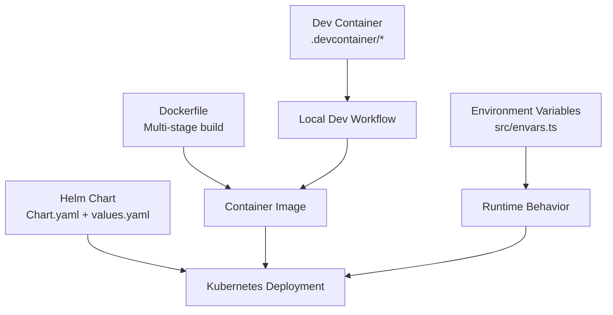
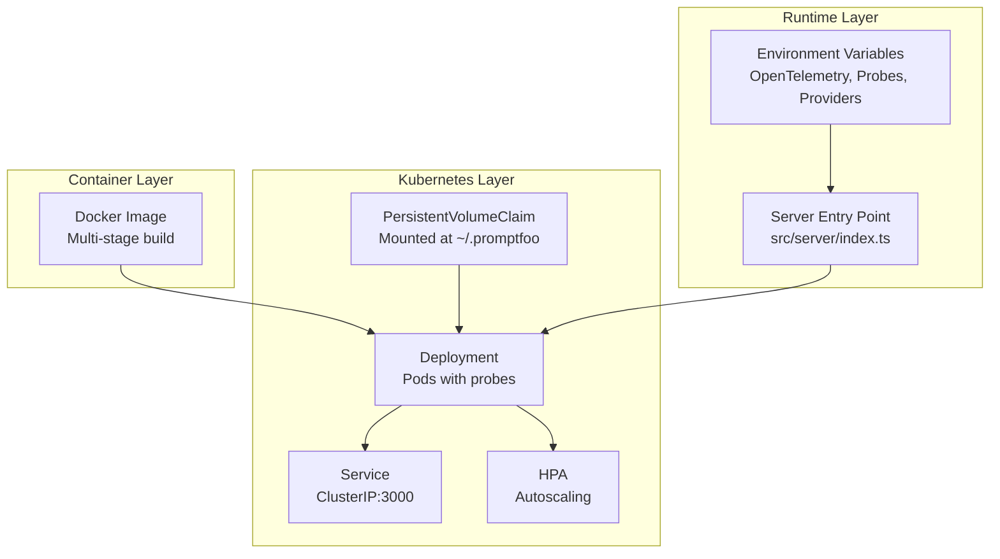
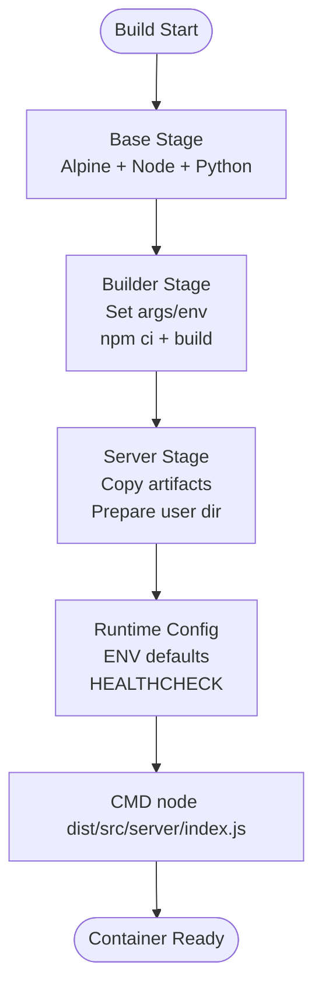
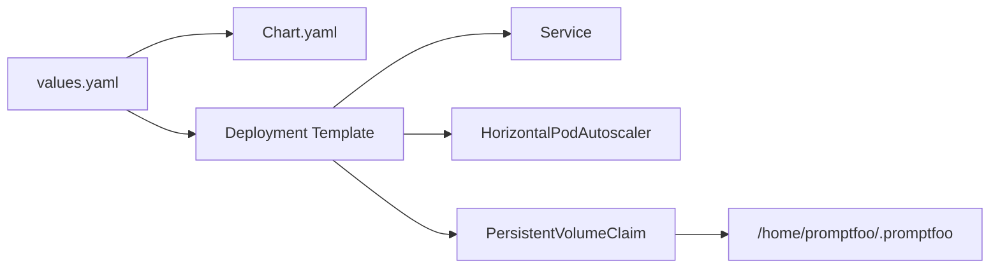
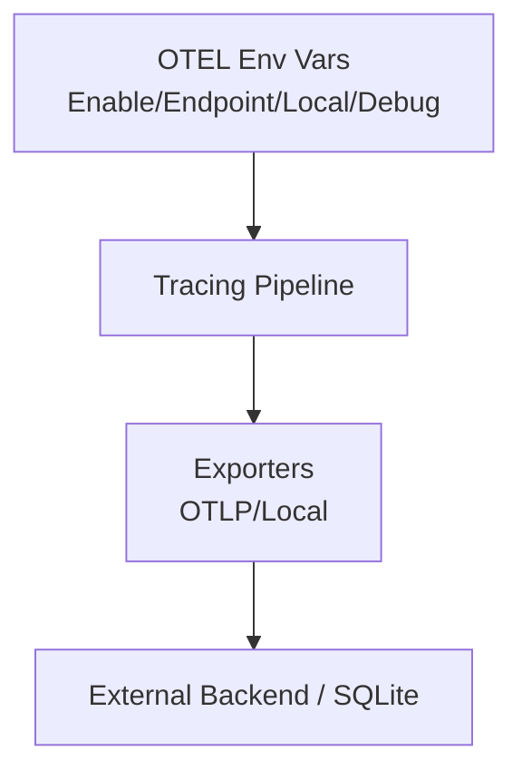
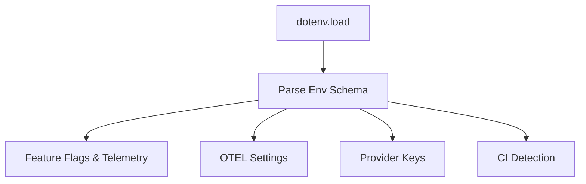
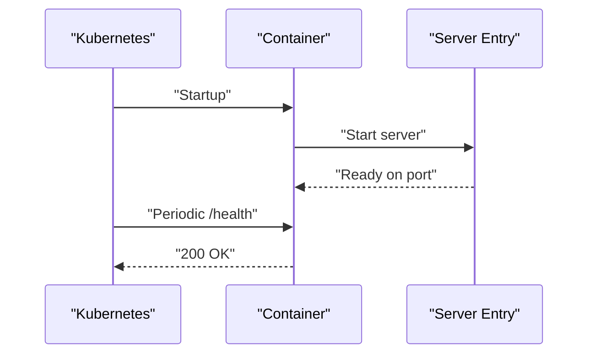
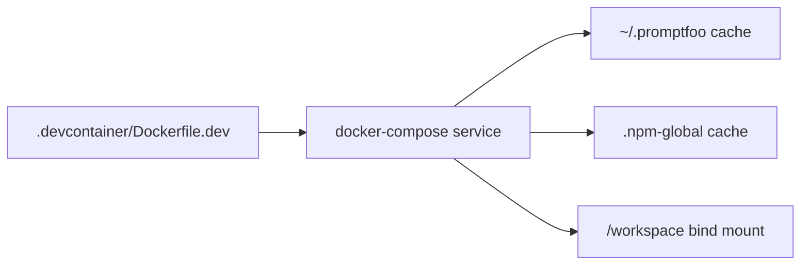
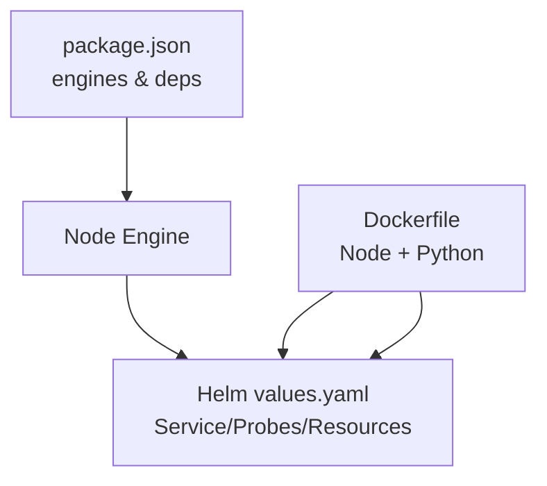

# Deployment & Operations

<cite>
**Referenced Files in This Document**
- [Dockerfile](file://Dockerfile)
- [package.json](file://package.json)
- [src/server/index.ts](file://src/server/index.ts)
- [src/envars.ts](file://src/envars.ts)
- [helm/chart/promptfoo/Chart.yaml](file://helm/chart/promptfoo/Chart.yaml)
- [helm/chart/promptfoo/values.yaml](file://helm/chart/promptfoo/values.yaml)
- [.devcontainer/Dockerfile.dev](file://.devcontainer/Dockerfile.dev)
- [.devcontainer/docker-compose.yml](file://.devcontainer/docker-compose.yml)
</cite>

## Table of Contents
1. [Introduction](#introduction)
2. [Project Structure](#project-structure)
3. [Core Components](#core-components)
4. [Architecture Overview](#architecture-overview)
5. [Detailed Component Analysis](#detailed-component-analysis)
6. [Dependency Analysis](#dependency-analysis)
7. [Performance Considerations](#performance-considerations)
8. [Troubleshooting Guide](#troubleshooting-guide)
9. [Conclusion](#conclusion)
10. [Appendices](#appendices)

## Introduction
This document provides comprehensive deployment and operations guidance for PromptFoo, covering containerization with Docker multi-stage builds, Kubernetes deployment via Helm, CI/CD integration patterns, observability with OpenTelemetry, security hardening, performance tuning, backup and disaster recovery, and operational best practices. It synthesizes the repository’s container, Helm chart, environment configuration, and server startup behavior to deliver practical, production-ready guidance.

## Project Structure
PromptFoo’s deployment assets are centered around:
- A Dockerfile implementing a multi-stage build for Node.js and Python support, with a dedicated non-root user and health checks.
- A Helm chart defining a Kubernetes application with configurable resources, probes, autoscaling, and persistent storage for configuration.
- Environment variable configuration supporting OpenTelemetry tracing, CI detection, and numerous provider credentials.
- A development container configuration for local iteration and caching.

**Diagram sources**
- [Dockerfile:1-67](file://Dockerfile#L1-L67)
- [helm/chart/promptfoo/Chart.yaml:1-25](file://helm/chart/promptfoo/Chart.yaml#L1-L25)
- [helm/chart/promptfoo/values.yaml:1-95](file://helm/chart/promptfoo/values.yaml#L1-L95)
- [src/envars.ts:1-568](file://src/envars.ts#L1-L568)
- [.devcontainer/Dockerfile.dev:1-22](file://.devcontainer/Dockerfile.dev#L1-L22)
- [.devcontainer/docker-compose.yml:1-15](file://.devcontainer/docker-compose.yml#L1-L15)

**Section sources**
- [Dockerfile:1-67](file://Dockerfile#L1-L67)
- [helm/chart/promptfoo/Chart.yaml:1-25](file://helm/chart/promptfoo/Chart.yaml#L1-L25)
- [helm/chart/promptfoo/values.yaml:1-95](file://helm/chart/promptfoo/values.yaml#L1-L95)
- [src/envars.ts:1-568](file://src/envars.ts#L1-L568)
- [.devcontainer/Dockerfile.dev:1-22](file://.devcontainer/Dockerfile.dev#L1-L22)
- [.devcontainer/docker-compose.yml:1-15](file://.devcontainer/docker-compose.yml#L1-L15)

## Core Components
- Containerization: Multi-stage Docker build with Node.js base, Python installation for provider support, deterministic npm installs, and a non-root runtime user with health checks.
- Kubernetes: Helm chart packaging the application as a Deployment with probes, autoscaling, and persistent volume mounts for configuration.
- Observability: Built-in OpenTelemetry support via environment variables for enabling tracing, configuring exporters, and local SQLite trace storage.
- Environment Management: Centralized environment variable schema and helpers for CI detection, timeouts, and provider credentials.
- Developer Workflow: Dev container with Python and npm caches mounted for fast local iteration.

**Section sources**
- [Dockerfile:1-67](file://Dockerfile#L1-L67)
- [helm/chart/promptfoo/Chart.yaml:1-25](file://helm/chart/promptfoo/Chart.yaml#L1-L25)
- [helm/chart/promptfoo/values.yaml:1-95](file://helm/chart/promptfoo/values.yaml#L1-L95)
- [src/envars.ts:76-103](file://src/envars.ts#L76-L103)
- [src/envars.ts:214-229](file://src/envars.ts#L214-L229)
- [.devcontainer/Dockerfile.dev:1-22](file://.devcontainer/Dockerfile.dev#L1-L22)
- [.devcontainer/docker-compose.yml:1-15](file://.devcontainer/docker-compose.yml#L1-L15)

## Architecture Overview
The deployment architecture integrates container images, Helm-managed Kubernetes resources, and environment-driven runtime behavior.

**Diagram sources**
- [Dockerfile:1-67](file://Dockerfile#L1-L67)
- [helm/chart/promptfoo/values.yaml:40-95](file://helm/chart/promptfoo/values.yaml#L40-L95)
- [src/server/index.ts:1-21](file://src/server/index.ts#L1-L21)
- [src/envars.ts:76-103](file://src/envars.ts#L76-L103)

## Detailed Component Analysis

### Containerization with Docker
- Base image and OS: Uses a recent Node.js Alpine base, upgrades packages, and adds Python with configurable version.
- Multi-stage build:
  - Builder stage sets build-time arguments and environment variables, performs deterministic npm installs with BuildKit cache, compiles the React app, and builds the server.
  - Server stage copies built artifacts, links the package locally, prepares the non-root user directory, and sets defaults for host binding and port.
- Runtime:
  - Non-root user and group ownership for safety.
  - Health check probing the root path.
  - Exposed port and default command launching the server entrypoint.

**Diagram sources**
- [Dockerfile:1-67](file://Dockerfile#L1-L67)

**Section sources**
- [Dockerfile:1-67](file://Dockerfile#L1-L67)

### Kubernetes Deployment with Helm
- Chart metadata defines the application type and app version.
- Values configure:
  - Image repository, tag, pull policy, and pull secrets.
  - Service type and port.
  - Resources with CPU/memory limits and requests.
  - Liveness/readiness probes.
  - Autoscaling toggled off by default with targets.
  - Persistent volume and mount for configuration under the non-root home directory.
  - Node selector and scheduling constraints.

**Diagram sources**
- [helm/chart/promptfoo/Chart.yaml:1-25](file://helm/chart/promptfoo/Chart.yaml#L1-L25)
- [helm/chart/promptfoo/values.yaml:1-95](file://helm/chart/promptfoo/values.yaml#L1-L95)

**Section sources**
- [helm/chart/promptfoo/Chart.yaml:1-25](file://helm/chart/promptfoo/Chart.yaml#L1-L25)
- [helm/chart/promptfoo/values.yaml:1-95](file://helm/chart/promptfoo/values.yaml#L1-L95)

### Observability and OpenTelemetry
- OpenTelemetry configuration is controlled via environment variables:
  - Enable/disable tracing globally.
  - Configure service name and OTLP endpoint.
  - Toggle local export to SQLite and debug logs.
- These variables are defined centrally and can be injected at deployment time via Helm values or Kubernetes Secrets.

**Diagram sources**
- [src/envars.ts:76-103](file://src/envars.ts#L76-L103)

**Section sources**
- [src/envars.ts:76-103](file://src/envars.ts#L76-L103)

### Environment Variables and CI Detection
- Centralized environment variable schema supports:
  - Feature flags, timeouts, cache settings, and provider credentials.
  - OpenTelemetry configuration.
  - Security and CORS settings.
  - Proxy and TLS options.
  - CI platform detection across major vendors.
- CI detection enables non-interactive behavior and tailored logging.

**Diagram sources**
- [src/envars.ts:1-568](file://src/envars.ts#L1-L568)

**Section sources**
- [src/envars.ts:1-568](file://src/envars.ts#L1-L568)

### Server Startup and Health
- The server entrypoint determines the default port, checks for an existing process, and starts the server.
- The container exposes a health check against the root path, suitable for Kubernetes probes.

**Diagram sources**
- [src/server/index.ts:1-21](file://src/server/index.ts#L1-L21)
- [Dockerfile:63-67](file://Dockerfile#L63-L67)

**Section sources**
- [src/server/index.ts:1-21](file://src/server/index.ts#L1-L21)
- [Dockerfile:63-67](file://Dockerfile#L63-L67)

### Developer Containerization
- A dev container image extends the official Node TypeScript devcontainer with Python and essential tools.
- docker-compose mounts persistent volumes for configuration and npm cache, and runs a long-lived process for interactive sessions.

**Diagram sources**
- [.devcontainer/Dockerfile.dev:1-22](file://.devcontainer/Dockerfile.dev#L1-L22)
- [.devcontainer/docker-compose.yml:1-15](file://.devcontainer/docker-compose.yml#L1-L15)

**Section sources**
- [.devcontainer/Dockerfile.dev:1-22](file://.devcontainer/Dockerfile.dev#L1-L22)
- [.devcontainer/docker-compose.yml:1-15](file://.devcontainer/docker-compose.yml#L1-L15)

## Dependency Analysis
- Container to Kubernetes:
  - The Docker image’s exposed port aligns with the Helm service port.
  - Persistent volume mounts target the non-root user’s configuration directory.
- Runtime dependencies:
  - Node.js engine requirements are declared in package metadata.
  - OpenTelemetry libraries are present in dependencies for tracing integration.

**Diagram sources**
- [package.json:31-33](file://package.json#L31-L33)
- [Dockerfile:1-67](file://Dockerfile#L1-L67)
- [helm/chart/promptfoo/values.yaml:40-95](file://helm/chart/promptfoo/values.yaml#L40-L95)

**Section sources**
- [package.json:31-33](file://package.json#L31-L33)
- [Dockerfile:1-67](file://Dockerfile#L1-L67)
- [helm/chart/promptfoo/values.yaml:40-95](file://helm/chart/promptfoo/values.yaml#L40-L95)

## Performance Considerations
- Resource requests and limits:
  - Current defaults are modest; scale CPU/memory based on concurrent evaluations and provider latency.
- Autoscaling:
  - HorizontalPodAutoscaler is disabled by default; enable and tune thresholds according to observed CPU utilization.
- Build optimization:
  - The Dockerfile leverages BuildKit cache for npm installs; keep lockfiles stable to maximize cache hits.
- Runtime tuning:
  - Adjust evaluation timeouts and concurrency via environment variables to balance throughput and stability.
- Storage:
  - Persistent volume sizing should accommodate configuration and logs; monitor growth and retention policies.

[No sources needed since this section provides general guidance]

## Troubleshooting Guide
- Health checks:
  - Kubernetes probes use the root path; ensure the server responds and that the container healthcheck is active.
- OpenTelemetry:
  - Verify OTEL environment variables and exporter endpoints; enable local export for offline diagnostics.
- CI and interactivity:
  - Confirm CI detection flags and non-interactive behavior to avoid TTY-dependent operations.
- Provider connectivity:
  - Validate provider keys and proxy/TLS settings via environment variables.
- Container startup:
  - Review server startup logs and port binding; confirm the default port is not blocked.

**Section sources**
- [Dockerfile:63-67](file://Dockerfile#L63-L67)
- [helm/chart/promptfoo/values.yaml:54-61](file://helm/chart/promptfoo/values.yaml#L54-L61)
- [src/envars.ts:76-103](file://src/envars.ts#L76-L103)
- [src/envars.ts:214-229](file://src/envars.ts#L214-L229)
- [src/server/index.ts:1-21](file://src/server/index.ts#L1-L21)

## Conclusion
PromptFoo’s deployment assets provide a solid foundation for containerized and Kubernetes-native operations. By leveraging the multi-stage Docker build, Helm chart, and environment-driven configuration, teams can achieve secure, observable, and scalable deployments. Combine these with CI/CD pipelines, robust monitoring, and disciplined change management to operate reliably in production.

[No sources needed since this section summarizes without analyzing specific files]

## Appendices

### CI/CD Integration Patterns
- General guidance:
  - Use the Dockerfile to build images and push to a registry.
  - Apply Helm values to deploy to target clusters, injecting secrets via Kubernetes Secrets or Helm values.
  - Integrate environment variables for OpenTelemetry and provider credentials.
- CI platforms:
  - The environment schema includes detection flags for major CI systems; configure pipelines to set these and pass secrets securely.

**Section sources**
- [Dockerfile:1-67](file://Dockerfile#L1-L67)
- [helm/chart/promptfoo/values.yaml:1-95](file://helm/chart/promptfoo/values.yaml#L1-L95)
- [src/envars.ts:214-229](file://src/envars.ts#L214-L229)

### Security Hardening
- Kubernetes:
  - Enable PodSecurityContext and SecurityContext fields in values.yaml to drop capabilities, run as non-root, and enforce read-only root filesystem.
  - Restrict Service exposure and use NetworkPolicies to limit ingress/egress.
- Secrets:
  - Store provider keys and sensitive configuration in Kubernetes Secrets and mount via values.yaml.
- Access controls:
  - Use RBAC to restrict who can deploy and modify the Helm release.

**Section sources**
- [helm/chart/promptfoo/values.yaml:29-39](file://helm/chart/promptfoo/values.yaml#L29-L39)
- [src/envars.ts:232-426](file://src/envars.ts#L232-L426)

### Backup and Disaster Recovery
- Persistent storage:
  - Back up the mounted PersistentVolumeClaim regularly; maintain snapshots per retention policy.
- Configuration:
  - Treat the configuration directory as stateful; include it in backups and restore procedures.
- DR plan:
  - Practice restoring from backups and validate health checks post-restore.

**Section sources**
- [helm/chart/promptfoo/values.yaml:70-87](file://helm/chart/promptfoo/values.yaml#L70-L87)

### Monitoring, Logging, and Observability
- OpenTelemetry:
  - Enable tracing and configure exporters; use local SQLite export for offline analysis.
- Logs:
  - Ensure log level and output destinations are configured via environment variables.
- Metrics:
  - Use HPA and cluster autoscaling to adapt to workload; monitor pod restarts and probe failures.

**Section sources**
- [src/envars.ts:76-103](file://src/envars.ts#L76-L103)
- [helm/chart/promptfoo/values.yaml:46-68](file://helm/chart/promptfoo/values.yaml#L46-L68)