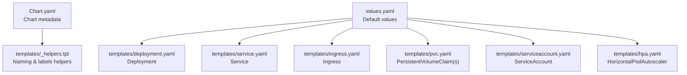
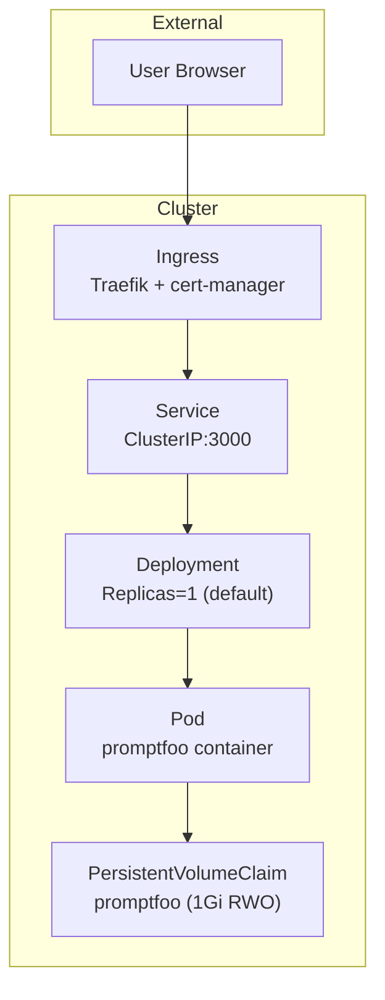
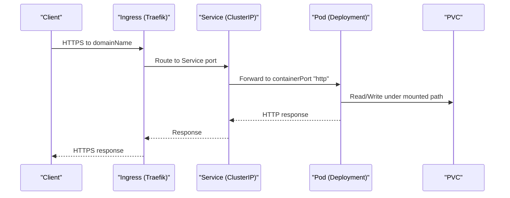
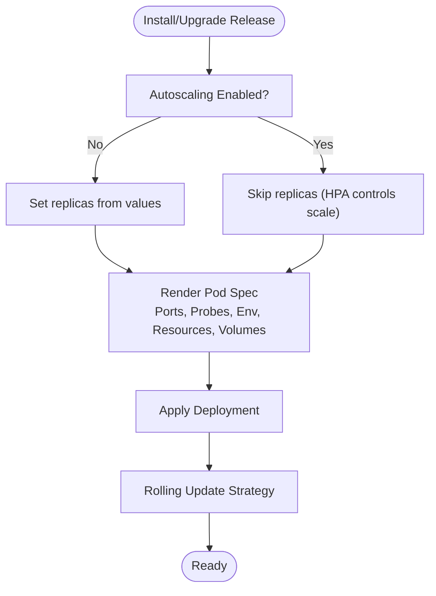
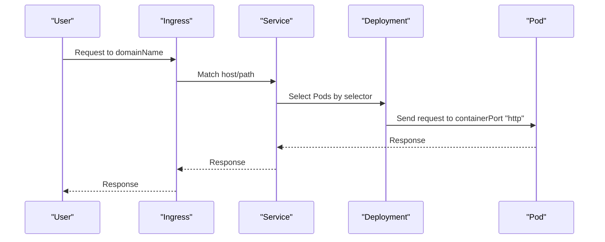
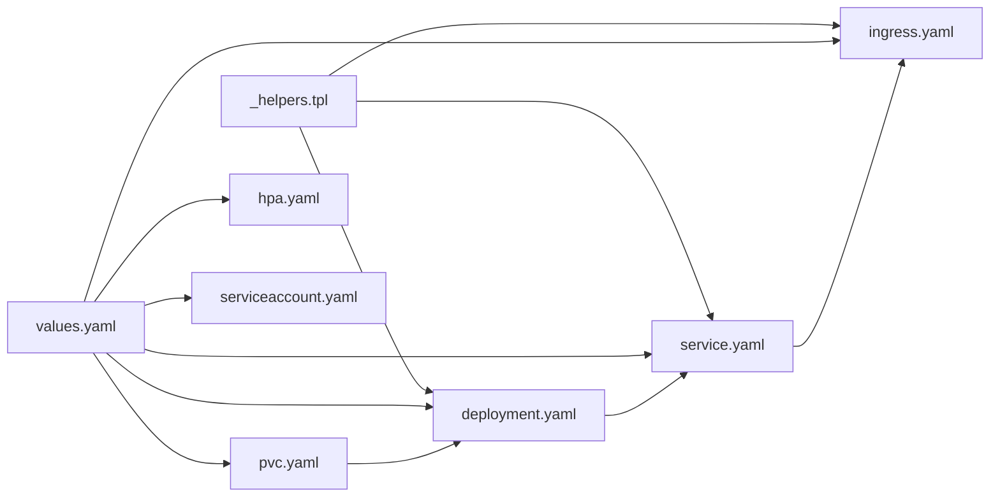

# Kubernetes Deployment

<cite>
**Referenced Files in This Document**
- [Chart.yaml](file://helm/chart/promptfoo/Chart.yaml)
- [values.yaml](file://helm/chart/promptfoo/values.yaml)
- [_helpers.tpl](file://helm/chart/promptfoo/templates/_helpers.tpl)
- [deployment.yaml](file://helm/chart/promptfoo/templates/deployment.yaml)
- [service.yaml](file://helm/chart/promptfoo/templates/service.yaml)
- [ingress.yaml](file://helm/chart/promptfoo/templates/ingress.yaml)
- [pvc.yaml](file://helm/chart/promptfoo/templates/pvc.yaml)
- [serviceaccount.yaml](file://helm/chart/promptfoo/templates/serviceaccount.yaml)
- [hpa.yaml](file://helm/chart/promptfoo/templates/hpa.yaml)
- [self-hosting.md](file://site/docs/usage/self-hosting.md)
</cite>

## Table of Contents
1. [Introduction](#introduction)
2. [Project Structure](#project-structure)
3. [Core Components](#core-components)
4. [Architecture Overview](#architecture-overview)
5. [Detailed Component Analysis](#detailed-component-analysis)
6. [Dependency Analysis](#dependency-analysis)
7. [Performance Considerations](#performance-considerations)
8. [Troubleshooting Guide](#troubleshooting-guide)
9. [Conclusion](#conclusion)
10. [Appendices](#appendices)

## Introduction
This document provides comprehensive Kubernetes deployment guidance for PromptFoo using the Helm chart included in the repository. It explains the Helm chart structure, values.yaml configuration, and customization options for pods, services, and ingress. It also covers persistent volume claims for database storage, secrets and ConfigMaps for configuration, autoscaling, rolling update strategies, namespace and RBAC considerations, and operational topics such as monitoring, cluster autoscaling, node affinity, and pod disruption budgets.

## Project Structure
PromptFoo’s Helm chart is organized as a standard Helm application chart with the following key files:
- Chart metadata and versioning
- Default values for configuration
- Template files for Kubernetes resources
- Helper templates for naming and labels
- Documentation for self-hosting and Helm usage

**Diagram sources**
- [Chart.yaml:1-25](file://helm/chart/promptfoo/Chart.yaml#L1-L25)
- [_helpers.tpl:1-47](file://helm/chart/promptfoo/templates/_helpers.tpl#L1-L47)
- [values.yaml:1-95](file://helm/chart/promptfoo/values.yaml#L1-L95)
- [deployment.yaml:1-74](file://helm/chart/promptfoo/templates/deployment.yaml#L1-L74)
- [service.yaml:1-16](file://helm/chart/promptfoo/templates/service.yaml#L1-L16)
- [ingress.yaml:1-27](file://helm/chart/promptfoo/templates/ingress.yaml#L1-L27)
- [pvc.yaml:1-17](file://helm/chart/promptfoo/templates/pvc.yaml#L1-L17)
- [serviceaccount.yaml:1-14](file://helm/chart/promptfoo/templates/serviceaccount.yaml#L1-L14)
- [hpa.yaml:1-33](file://helm/chart/promptfoo/templates/hpa.yaml#L1-L33)

**Section sources**
- [Chart.yaml:1-25](file://helm/chart/promptfoo/Chart.yaml#L1-L25)
- [values.yaml:1-95](file://helm/chart/promptfoo/values.yaml#L1-L95)

## Core Components
- Chart metadata defines the chart as an application with semantic versioning and an app version.
- Values define defaults for image, replicas, probes, resources, autoscaling, PVCs, volumes, node placement, and domain name for ingress.
- Templates render Kubernetes resources from values and helpers.

Key areas covered:
- Pod specification: container image, ports, probes, environment variables, volumes, and node placement.
- Service: ClusterIP type and port mapping.
- Ingress: Traefik ingress class, TLS via cert-manager, and domain-based routing.
- Persistence: PVC creation and mounting under the application’s home directory.
- Autoscaling: optional HPA targeting CPU utilization.
- Identity and permissions: ServiceAccount creation and optional automount.

**Section sources**
- [Chart.yaml:1-25](file://helm/chart/promptfoo/Chart.yaml#L1-L25)
- [values.yaml:1-95](file://helm/chart/promptfoo/values.yaml#L1-L95)
- [deployment.yaml:1-74](file://helm/chart/promptfoo/templates/deployment.yaml#L1-L74)
- [service.yaml:1-16](file://helm/chart/promptfoo/templates/service.yaml#L1-L16)
- [ingress.yaml:1-27](file://helm/chart/promptfoo/templates/ingress.yaml#L1-L27)
- [pvc.yaml:1-17](file://helm/chart/promptfoo/templates/pvc.yaml#L1-L17)
- [hpa.yaml:1-33](file://helm/chart/promptfoo/templates/hpa.yaml#L1-L33)
- [serviceaccount.yaml:1-14](file://helm/chart/promptfoo/templates/serviceaccount.yaml#L1-L14)

## Architecture Overview
The Helm-rendered architecture connects client traffic through an Ingress to a Service, which targets Pods managed by a Deployment. Persistent storage is provided by a PVC mounted into the Pod.

**Diagram sources**
- [ingress.yaml:1-27](file://helm/chart/promptfoo/templates/ingress.yaml#L1-L27)
- [service.yaml:1-16](file://helm/chart/promptfoo/templates/service.yaml#L1-L16)
- [deployment.yaml:1-74](file://helm/chart/promptfoo/templates/deployment.yaml#L1-L74)
- [pvc.yaml:1-17](file://helm/chart/promptfoo/templates/pvc.yaml#L1-L17)

## Detailed Component Analysis

### Helm Chart Metadata and Values
- Chart metadata includes chart versioning and app versioning semantics.
- Values provide defaults for image repository/tag, replicas, probes, resources, autoscaling, PVCs, volumes, node selection, and domain name for ingress.

Customization highlights:
- replicaCount: Set to 1 by default to align with the single-instance SQLite and in-memory queue constraints.
- image: repository, tag, pullPolicy, and pull secrets.
- service: type and port.
- domainName: controls the Ingress host.
- resources: CPU/memory limits and requests.
- autoscaling: enable/disable and thresholds.
- persistentVolumesClaims: list of PVCs to create.
- volumes and volumeMounts: mount PVC into the container filesystem.
- nodeSelector, affinity, tolerations: node placement controls.

**Section sources**
- [Chart.yaml:1-25](file://helm/chart/promptfoo/Chart.yaml#L1-L25)
- [values.yaml:1-95](file://helm/chart/promptfoo/values.yaml#L1-L95)

### Deployment Template
The Deployment manages the application Pod with:
- Selector and labels derived from helpers.
- Optional replica count controlled by autoscaling flag.
- Container port, probes, environment variables, resources, and volumes.
- Node placement via nodeSelector, affinity, and tolerations.
- Security contexts and image pull secrets.

Environment variables:
- Remote API and app base URLs are set to localhost within the cluster.

Rolling updates:
- The Deployment controller handles rolling updates by default. Adjust strategy via values if needed.

**Section sources**
- [deployment.yaml:1-74](file://helm/chart/promptfoo/templates/deployment.yaml#L1-L74)
- [_helpers.tpl:1-47](file://helm/chart/promptfoo/templates/_helpers.tpl#L1-L47)

### Service Template
The Service exposes the Deployment internally:
- Type: ClusterIP by default.
- Port mapping: service port to container port “http”.

**Section sources**
- [service.yaml:1-16](file://helm/chart/promptfoo/templates/service.yaml#L1-L16)

### Ingress Template
The Ingress enables external HTTPS access:
- Ingress class: Traefik.
- Host: configured via values.domainName.
- TLS: managed by cert-manager with a ClusterIssuer and a TLS secret name.
- Backend: routes to the Service on the configured port.

Notes:
- Ensure cert-manager and the referenced ClusterIssuer exist in-cluster.
- The ingressClassName must match an installed controller.

**Section sources**
- [ingress.yaml:1-27](file://helm/chart/promptfoo/templates/ingress.yaml#L1-L27)

### Persistent Volume Claims
The chart provisions one or more PVCs based on values:
- Name, size, access mode (ReadWriteOnce), and storage class.
- A corresponding volume is mounted into the Pod at the application’s config directory.

Recommendations:
- Choose a StorageClass appropriate for your platform and workload.
- Ensure the PVC size accommodates logs, datasets, and configuration.

**Section sources**
- [pvc.yaml:1-17](file://helm/chart/promptfoo/templates/pvc.yaml#L1-L17)
- [values.yaml:70-87](file://helm/chart/promptfoo/values.yaml#L70-L87)

### Horizontal Pod Autoscaling
HPA is optional and disabled by default:
- When enabled, it targets CPU utilization percentage.
- It scales the Deployment rendered by the chart.

Operational note:
- Ensure Metrics Server or Prometheus Adapter is installed for autoscaling to function.

**Section sources**
- [hpa.yaml:1-33](file://helm/chart/promptfoo/templates/hpa.yaml#L1-L33)
- [values.yaml:63-68](file://helm/chart/promptfoo/values.yaml#L63-L68)

### ServiceAccount and Permissions
- ServiceAccount creation is configurable.
- Automounting tokens is configurable.
- Additional RBAC bindings (Role/ClusterRole, RoleBinding/ClusterRoleBinding) are not generated by this chart and must be applied separately if required.

**Section sources**
- [serviceaccount.yaml:1-14](file://helm/chart/promptfoo/templates/serviceaccount.yaml#L1-L14)
- [values.yaml:18-24](file://helm/chart/promptfoo/values.yaml#L18-L24)

### Secrets and ConfigMaps
- The chart does not generate Secrets or ConfigMaps by default.
- To pass sensitive configuration (e.g., API keys), mount them via volumes and volumeMounts in values.yaml or override the template.
- Alternatively, manage Secrets externally and reference them in the Deployment template.

[No sources needed since this section provides general guidance]

### Namespace Management
- The Ingress manifest sets the namespace explicitly from the Helm release namespace.
- Deployments and Services are created in the same namespace as the release.

[No sources needed since this section provides general guidance]

## Architecture Overview

**Diagram sources**
- [ingress.yaml:1-27](file://helm/chart/promptfoo/templates/ingress.yaml#L1-L27)
- [service.yaml:1-16](file://helm/chart/promptfoo/templates/service.yaml#L1-L16)
- [deployment.yaml:1-74](file://helm/chart/promptfoo/templates/deployment.yaml#L1-L74)
- [pvc.yaml:1-17](file://helm/chart/promptfoo/templates/pvc.yaml#L1-L17)

## Detailed Component Analysis

### Deployment Flow and Rolling Updates

**Diagram sources**
- [deployment.yaml:1-74](file://helm/chart/promptfoo/templates/deployment.yaml#L1-L74)
- [hpa.yaml:1-33](file://helm/chart/promptfoo/templates/hpa.yaml#L1-L33)

### Ingress to Service Routing

**Diagram sources**
- [ingress.yaml:1-27](file://helm/chart/promptfoo/templates/ingress.yaml#L1-L27)
- [service.yaml:1-16](file://helm/chart/promptfoo/templates/service.yaml#L1-L16)
- [deployment.yaml:1-74](file://helm/chart/promptfoo/templates/deployment.yaml#L1-L74)

## Dependency Analysis
- The Deployment depends on the Service for internal routing.
- The Service selects Pods via labels produced by helpers.
- The Ingress depends on the Service and the configured domain name.
- PVCs depend on StorageClasses provisioned by the cluster.

**Diagram sources**
- [_helpers.tpl:1-47](file://helm/chart/promptfoo/templates/_helpers.tpl#L1-L47)
- [deployment.yaml:1-74](file://helm/chart/promptfoo/templates/deployment.yaml#L1-L74)
- [service.yaml:1-16](file://helm/chart/promptfoo/templates/service.yaml#L1-L16)
- [ingress.yaml:1-27](file://helm/chart/promptfoo/templates/ingress.yaml#L1-L27)
- [pvc.yaml:1-17](file://helm/chart/promptfoo/templates/pvc.yaml#L1-L17)
- [hpa.yaml:1-33](file://helm/chart/promptfoo/templates/hpa.yaml#L1-L33)
- [serviceaccount.yaml:1-14](file://helm/chart/promptfoo/templates/serviceaccount.yaml#L1-L14)
- [values.yaml:1-95](file://helm/chart/promptfoo/values.yaml#L1-L95)

**Section sources**
- [_helpers.tpl:1-47](file://helm/chart/promptfoo/templates/_helpers.tpl#L1-L47)
- [values.yaml:1-95](file://helm/chart/promptfoo/values.yaml#L1-L95)

## Performance Considerations
- Resource requests and limits are defined in values.yaml. Tune them based on workload characteristics.
- Enable autoscaling to dynamically adjust capacity during traffic spikes.
- Keep replicaCount at 1 for the default single-instance SQLite configuration.
- Use appropriate StorageClasses for PVCs to avoid I/O bottlenecks.
- Monitor CPU utilization thresholds and adjust autoscaling targets accordingly.

[No sources needed since this section provides general guidance]

## Troubleshooting Guide
Common issues and resolutions:
- Ingress not reachable:
  - Verify domainName matches the certificate and DNS resolution.
  - Confirm the ingressClassName exists and the controller is installed.
- TLS certificate problems:
  - Ensure cert-manager is installed and the referenced ClusterIssuer exists.
- Service cannot reach Pod:
  - Check selector labels match between Service and Deployment.
  - Validate containerPort name and targetPort alignment.
- Persistent storage issues:
  - Confirm StorageClass exists and PVC status is Bound.
  - Check Pod volume mounts match PVC name.
- Autoscaling not working:
  - Ensure Metrics Server or Prometheus Adapter is installed.
  - Verify HPA references the correct Deployment name.

**Section sources**
- [ingress.yaml:1-27](file://helm/chart/promptfoo/templates/ingress.yaml#L1-L27)
- [service.yaml:1-16](file://helm/chart/promptfoo/templates/service.yaml#L1-L16)
- [deployment.yaml:1-74](file://helm/chart/promptfoo/templates/deployment.yaml#L1-L74)
- [pvc.yaml:1-17](file://helm/chart/promptfoo/templates/pvc.yaml#L1-L17)
- [hpa.yaml:1-33](file://helm/chart/promptfoo/templates/hpa.yaml#L1-L33)

## Conclusion
PromptFoo’s Helm chart provides a concise, production-ready foundation for deploying the application on Kubernetes. It emphasizes simplicity with a single-replica default, persistent storage, and optional autoscaling. Customize values.yaml to fit your environment, and augment with Secrets/ConfigMaps and RBAC as needed for your security posture.

[No sources needed since this section summarizes without analyzing specific files]

## Appendices

### Environment-Specific Deployment Manifests
- Development: Use smaller resource requests/limits, disable autoscaling, and expose via LoadBalancer or port-forward.
- Staging: Enable autoscaling with conservative thresholds, use a dedicated StorageClass, and configure ingress with a staging cert-manager issuer.
- Production: Enable autoscaling, enforce strict securityContexts, use hardened StorageClasses, and apply RBAC and NetworkPolicies.

[No sources needed since this section provides general guidance]

### Monitoring Integration with Prometheus
- Scrape the Service endpoints using Prometheus Operator or kube-prometheus Stack.
- Ensure ServiceMonitor or PrometheusRule resources are configured to capture metrics from the application.

[No sources needed since this section provides general guidance]

### Cluster Autoscaling, Node Affinity, and Pod Disruption Budgets
- Cluster autoscaling: Configure cluster-autoscaler and ensure node pools match nodeSelector/affinity.
- Node affinity: Use values.nodeSelector and values.affinity to schedule Pods on appropriate nodes.
- Pod Disruption Budgets: Define PDBs to maintain availability during maintenance windows.

[No sources needed since this section provides general guidance]

### Installation and Usage Notes
- The repository documents Helm installation steps and cautions about keeping replicaCount at 1 for the default SQLite configuration.

**Section sources**
- [self-hosting.md:162-202](file://site/docs/usage/self-hosting.md#L162-L202)