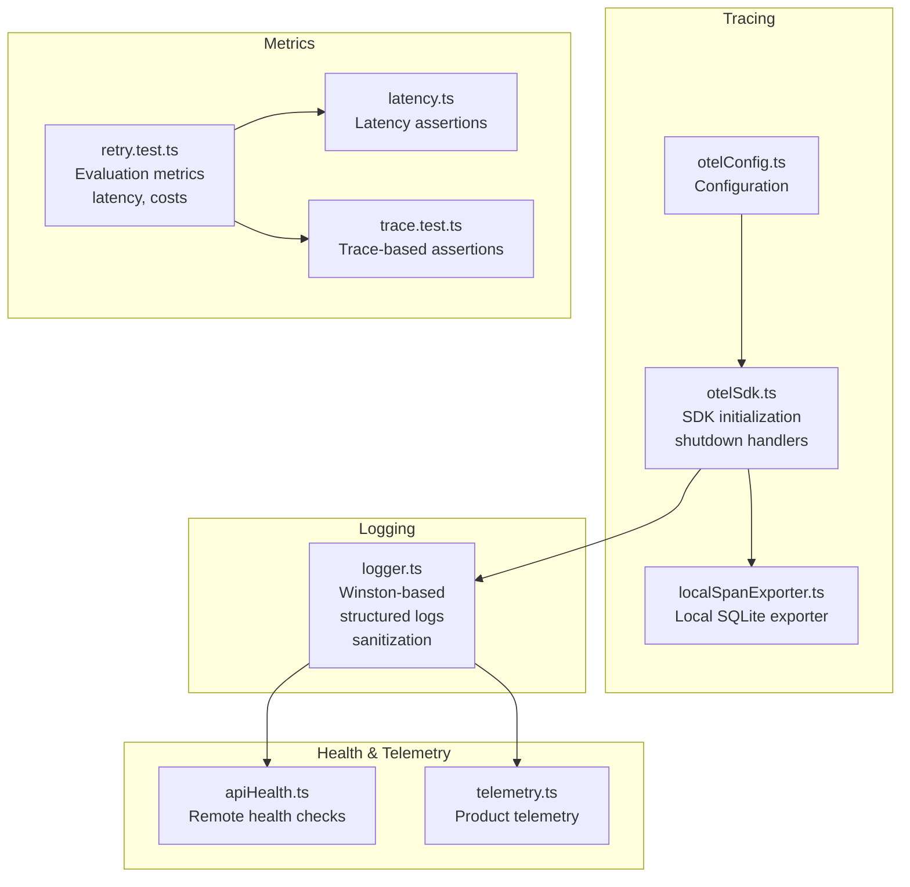
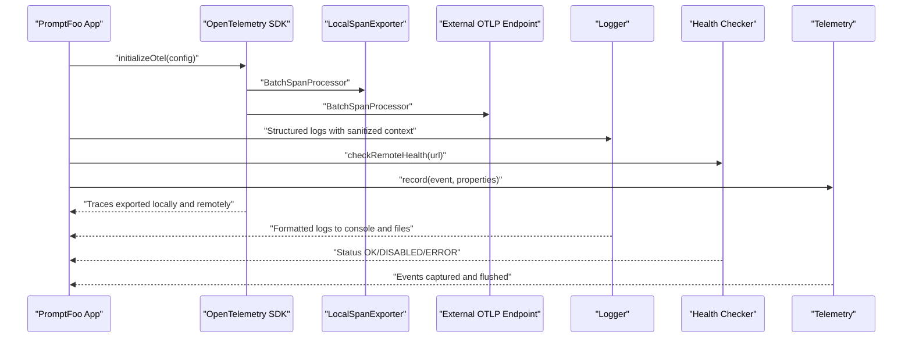
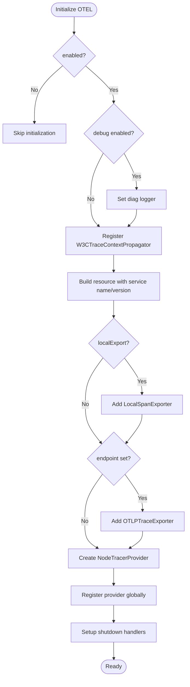
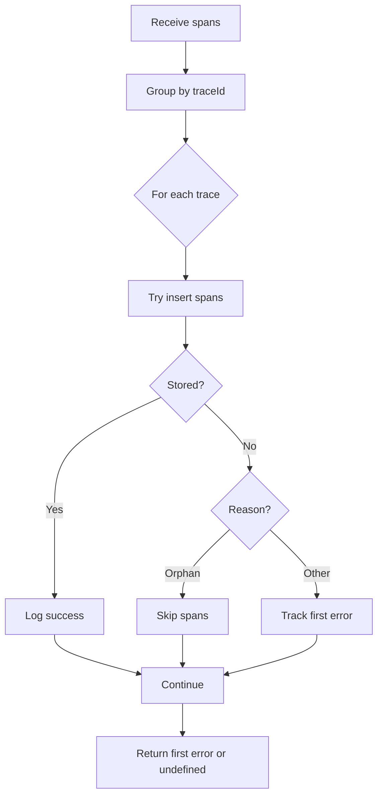
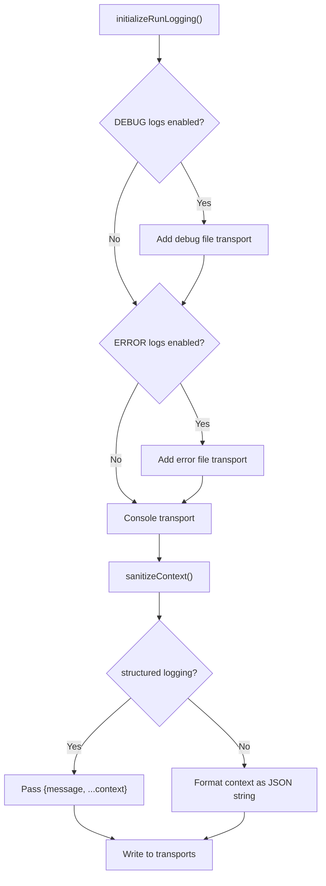
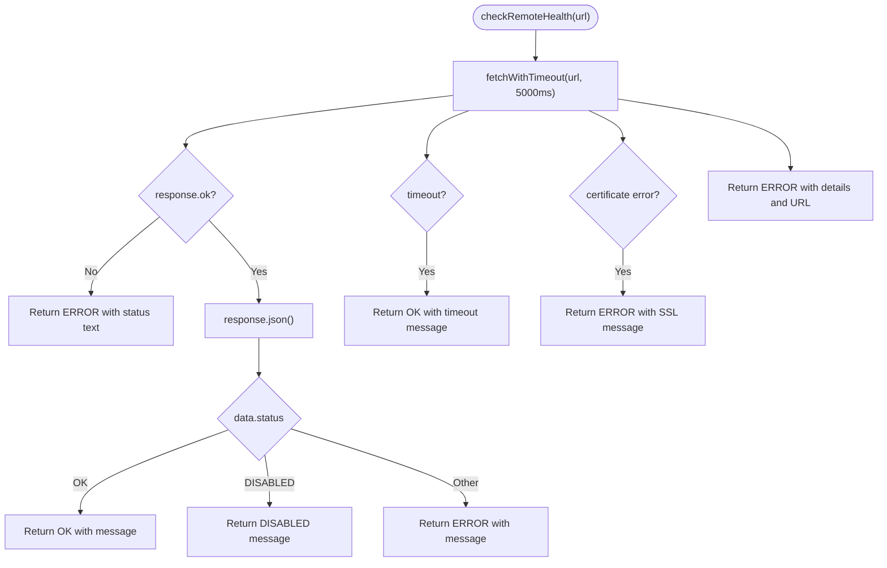
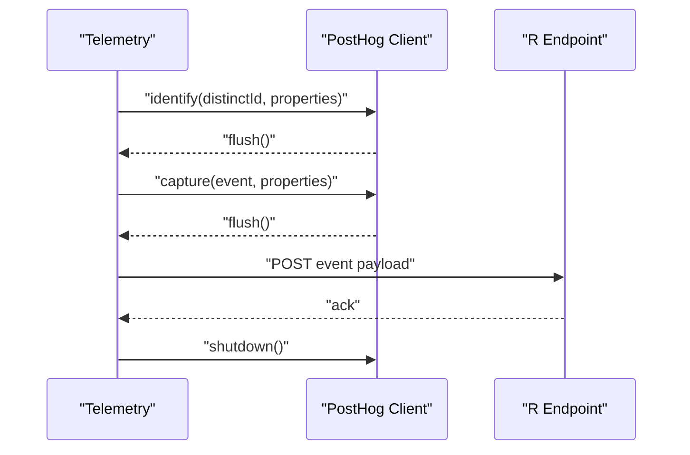
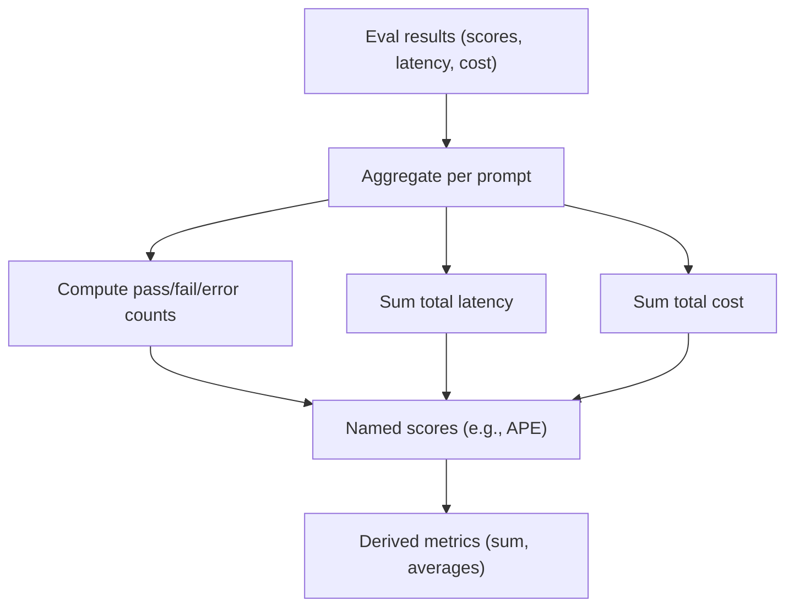
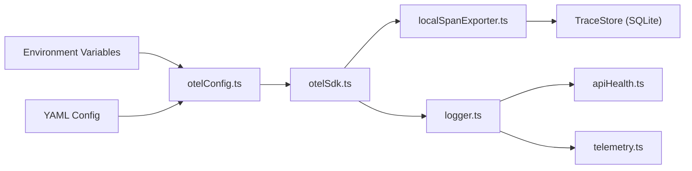

# Monitoring & Observability

<cite>
**Referenced Files in This Document**
- [otelConfig.ts](file://src/tracing/otelConfig.ts)
- [otelSdk.ts](file://src/tracing/otelSdk.ts)
- [localSpanExporter.ts](file://src/tracing/localSpanExporter.ts)
- [logger.ts](file://src/logger.ts)
- [apiHealth.ts](file://src/util/apiHealth.ts)
- [telemetry.ts](file://src/telemetry.ts)
- [retry.test.ts](file://test/commands/retry.test.ts)
- [latency.ts](file://src/assertions/latency.ts)
- [trace.test.ts](file://test/assertions/trace.test.ts)
</cite>

## Table of Contents
1. [Introduction](#introduction)
2. [Project Structure](#project-structure)
3. [Core Components](#core-components)
4. [Architecture Overview](#architecture-overview)
5. [Detailed Component Analysis](#detailed-component-analysis)
6. [Dependency Analysis](#dependency-analysis)
7. [Performance Considerations](#performance-considerations)
8. [Troubleshooting Guide](#troubleshooting-guide)
9. [Conclusion](#conclusion)
10. [Appendices](#appendices)

## Introduction
This document provides comprehensive monitoring and observability guidance for PromptFoo production deployments. It covers OpenTelemetry integration for distributed tracing, metrics collection, and logging correlation; explains trace sampling, span attributes, and performance monitoring setup; documents application health checks, uptime monitoring, and alerting configuration; outlines log aggregation, structured logging, and log analysis strategies; details metrics instrumentation for evaluation performance, provider latency, and resource utilization; and describes dashboard creation and alerting for key performance indicators. It also addresses monitoring for distributed evaluations, provider rate limiting, and database performance, with integration examples for Prometheus, Grafana, and cloud-native observability tools.

## Project Structure
PromptFoo’s observability stack is composed of:
- OpenTelemetry tracing with local and external exporters
- Structured logging with sanitization and file transports
- Application health checks for remote APIs
- Telemetry events for product insights
- Evaluation metrics and derived metrics for performance and quality

**Diagram sources**
- [otelConfig.ts:1-94](file://src/tracing/otelConfig.ts#L1-L94)
- [otelSdk.ts:1-229](file://src/tracing/otelSdk.ts#L1-L229)
- [localSpanExporter.ts:1-156](file://src/tracing/localSpanExporter.ts#L1-L156)
- [logger.ts:1-537](file://src/logger.ts#L1-L537)
- [apiHealth.ts:1-129](file://src/util/apiHealth.ts#L1-L129)
- [telemetry.ts:1-242](file://src/telemetry.ts#L1-L242)
- [retry.test.ts:283-612](file://test/commands/retry.test.ts#L283-L612)
- [latency.ts:1-21](file://src/assertions/latency.ts#L1-L21)
- [trace.test.ts:36-90](file://test/assertions/trace.test.ts#L36-L90)

**Section sources**
- [otelConfig.ts:1-94](file://src/tracing/otelConfig.ts#L1-L94)
- [otelSdk.ts:1-229](file://src/tracing/otelSdk.ts#L1-L229)
- [localSpanExporter.ts:1-156](file://src/tracing/localSpanExporter.ts#L1-L156)
- [logger.ts:1-537](file://src/logger.ts#L1-L537)
- [apiHealth.ts:1-129](file://src/util/apiHealth.ts#L1-L129)
- [telemetry.ts:1-242](file://src/telemetry.ts#L1-L242)
- [retry.test.ts:283-612](file://test/commands/retry.test.ts#L283-L612)
- [latency.ts:1-21](file://src/assertions/latency.ts#L1-L21)
- [trace.test.ts:36-90](file://test/assertions/trace.test.ts#L36-L90)

## Core Components
- OpenTelemetry tracing: centralized configuration, SDK initialization, graceful shutdown, and dual-span export (local and external).
- Structured logging: Winston-backed logger with sanitization, file transports, and structured context support.
- Health checks: robust remote API health verification with detailed error categorization.
- Telemetry: opt-out telemetry for product insights with immediate flush and safe shutdown.
- Metrics instrumentation: evaluation metrics, latency thresholds, and trace-based assertions.

**Section sources**
- [otelConfig.ts:1-94](file://src/tracing/otelConfig.ts#L1-L94)
- [otelSdk.ts:52-114](file://src/tracing/otelSdk.ts#L52-L114)
- [logger.ts:25-27](file://src/logger.ts#L25-L27)
- [logger.ts:388-396](file://src/logger.ts#L388-L396)
- [apiHealth.ts:16-128](file://src/util/apiHealth.ts#L16-L128)
- [telemetry.ts:68-122](file://src/telemetry.ts#L68-L122)
- [retry.test.ts:291-347](file://test/commands/retry.test.ts#L291-L347)
- [latency.ts:3-21](file://src/assertions/latency.ts#L3-L21)
- [trace.test.ts:36-54](file://test/assertions/trace.test.ts#L36-L54)

## Architecture Overview
The observability architecture integrates tracing, logging, health checks, and telemetry into a cohesive monitoring solution.

**Diagram sources**
- [otelSdk.ts:52-114](file://src/tracing/otelSdk.ts#L52-L114)
- [localSpanExporter.ts:16-37](file://src/tracing/localSpanExporter.ts#L16-L37)
- [logger.ts:388-396](file://src/logger.ts#L388-L396)
- [apiHealth.ts:16-128](file://src/util/apiHealth.ts#L16-L128)
- [telemetry.ts:116-145](file://src/telemetry.ts#L116-L145)

## Detailed Component Analysis

### OpenTelemetry Tracing
- Configuration: environment-driven configuration with YAML overrides and defaults.
- Initialization: registers W3C trace context propagator, builds resource attributes, and attaches span processors for local and external exports.
- Graceful shutdown: handles SIGTERM/SIGINT and beforeExit to flush and shutdown cleanly.
- Local export: writes spans to a local TraceStore (SQLite) for UI analysis.
- External export: sends spans to an OTLP endpoint for Jaeger, Honeycomb, or similar backends.

**Diagram sources**
- [otelSdk.ts:52-114](file://src/tracing/otelSdk.ts#L52-L114)
- [otelConfig.ts:34-44](file://src/tracing/otelConfig.ts#L34-L44)

**Section sources**
- [otelConfig.ts:34-93](file://src/tracing/otelConfig.ts#L34-L93)
- [otelSdk.ts:52-114](file://src/tracing/otelSdk.ts#L52-L114)
- [otelSdk.ts:120-137](file://src/tracing/otelSdk.ts#L120-L137)
- [otelSdk.ts:143-156](file://src/tracing/otelSdk.ts#L143-L156)
- [otelSdk.ts:170-206](file://src/tracing/otelSdk.ts#L170-L206)

### Local Span Exporter
- Groups spans by trace ID and inserts into the TraceStore.
- Handles foreign key constraint errors by skipping orphaned traces.
- Converts OTEL attributes to a plain object and normalizes timestamps.

**Diagram sources**
- [localSpanExporter.ts:43-101](file://src/tracing/localSpanExporter.ts#L43-L101)

**Section sources**
- [localSpanExporter.ts:16-37](file://src/tracing/localSpanExporter.ts#L16-L37)
- [localSpanExporter.ts:43-101](file://src/tracing/localSpanExporter.ts#L43-L101)
- [localSpanExporter.ts:106-139](file://src/tracing/localSpanExporter.ts#L106-L139)

### Structured Logging and Sanitization
- Structured logging toggle enables passing { message, ...context } to sinks.
- Sanitization removes sensitive data from URLs, headers, bodies, and arbitrary contexts.
- File transports are created per run with automatic cleanup of old log files.
- Shutdown gracefully flushes file transports and prevents “write after end” errors.

**Diagram sources**
- [logger.ts:251-276](file://src/logger.ts#L251-L276)
- [logger.ts:388-396](file://src/logger.ts#L388-L396)
- [logger.ts:476-529](file://src/logger.ts#L476-L529)

**Section sources**
- [logger.ts:25-27](file://src/logger.ts#L25-L27)
- [logger.ts:344-358](file://src/logger.ts#L344-L358)
- [logger.ts:476-529](file://src/logger.ts#L476-L529)

### Application Health Checks
- Performs a timed fetch to the health endpoint with detailed error handling.
- Categorizes failures: connection refused, timeouts, SSL/cert issues, non-OK responses, and malformed JSON.
- Returns standardized status and messages for integration with uptime monitors.

**Diagram sources**
- [apiHealth.ts:16-128](file://src/util/apiHealth.ts#L16-L128)

**Section sources**
- [apiHealth.ts:16-128](file://src/util/apiHealth.ts#L16-L128)

### Telemetry Events
- Product telemetry captures events with package version and CI context.
- Identifies users with cloud auth metadata and flushes immediately to avoid keeping the event loop alive.
- Provides a shutdown hook for safe process exit.

**Diagram sources**
- [telemetry.ts:79-103](file://src/telemetry.ts#L79-L103)
- [telemetry.ts:124-145](file://src/telemetry.ts#L124-L145)
- [telemetry.ts:166-185](file://src/telemetry.ts#L166-L185)

**Section sources**
- [telemetry.ts:68-122](file://src/telemetry.ts#L68-L122)
- [telemetry.ts:166-185](file://src/telemetry.ts#L166-L185)

### Metrics Instrumentation
- Evaluation metrics: pass/fail/error counts, total latency, and cost are computed and accumulated across batches.
- Latency assertions: enforce thresholds and fail fast when latency exceeds limits.
- Trace-based assertions: compute average span duration and other trace-derived metrics.

**Diagram sources**
- [retry.test.ts:291-347](file://test/commands/retry.test.ts#L291-L347)
- [retry.test.ts:509-611](file://test/commands/retry.test.ts#L509-L611)

**Section sources**
- [retry.test.ts:291-347](file://test/commands/retry.test.ts#L291-L347)
- [retry.test.ts:509-611](file://test/commands/retry.test.ts#L509-L611)
- [latency.ts:3-21](file://src/assertions/latency.ts#L3-L21)
- [trace.test.ts:36-54](file://test/assertions/trace.test.ts#L36-L54)

## Dependency Analysis
- Tracing depends on environment variables and YAML configuration to determine exporters and service identity.
- LocalSpanExporter depends on the TraceStore and handles foreign key constraint errors gracefully.
- Logger integrates with Winston, supports structured logging, and sanitizes sensitive data.
- Health checker encapsulates network concerns and returns normalized statuses.
- Telemetry depends on PostHog and a secondary endpoint for event delivery.

**Diagram sources**
- [otelConfig.ts:34-64](file://src/tracing/otelConfig.ts#L34-L64)
- [otelSdk.ts:52-114](file://src/tracing/otelSdk.ts#L52-L114)
- [localSpanExporter.ts:48-70](file://src/tracing/localSpanExporter.ts#L48-L70)
- [logger.ts:251-276](file://src/logger.ts#L251-L276)
- [apiHealth.ts:16-128](file://src/util/apiHealth.ts#L16-L128)
- [telemetry.ts:42-64](file://src/telemetry.ts#L42-L64)

**Section sources**
- [otelConfig.ts:34-93](file://src/tracing/otelConfig.ts#L34-L93)
- [otelSdk.ts:52-114](file://src/tracing/otelSdk.ts#L52-L114)
- [localSpanExporter.ts:48-101](file://src/tracing/localSpanExporter.ts#L48-L101)
- [logger.ts:251-276](file://src/logger.ts#L251-L276)
- [apiHealth.ts:16-128](file://src/util/apiHealth.ts#L16-L128)
- [telemetry.ts:42-64](file://src/telemetry.ts#L42-L64)

## Performance Considerations
- Tracing overhead: enable local export for UI analysis and external export for backend observability; tune batch sizes and flush intervals at the backend.
- Logging volume: limit excessive debug logs in production; use structured logging for downstream log processors.
- Health checks: keep timeouts reasonable to avoid blocking startup; surface SSL/cert issues early.
- Telemetry: immediate flush avoids long-running timers; ensure network proxies are configured for reliable delivery.
- Evaluation metrics: precompute aggregates and derived metrics to reduce UI rendering cost.

[No sources needed since this section provides general guidance]

## Troubleshooting Guide
- Tracing not exporting:
  - Verify OTEL enabled flag and endpoint configuration.
  - Confirm graceful shutdown handlers are registered and not duplicated.
- Local export errors:
  - Foreign key constraint errors indicate orphaned traces; spans are skipped safely.
- Health check failures:
  - Connection refused indicates unreachable endpoint; timeouts are handled gracefully.
  - Certificate errors require CA bundle or TLS configuration adjustments.
- Telemetry not sending:
  - Ensure telemetry is not disabled and PostHog key is present; confirm network proxy settings.

**Section sources**
- [otelSdk.ts:170-206](file://src/tracing/otelSdk.ts#L170-L206)
- [localSpanExporter.ts:82-98](file://src/tracing/localSpanExporter.ts#L82-L98)
- [apiHealth.ts:83-110](file://src/util/apiHealth.ts#L83-L110)
- [telemetry.ts:42-64](file://src/telemetry.ts#L42-L64)

## Conclusion
PromptFoo’s observability stack combines OpenTelemetry tracing with structured logging, health checks, and telemetry to deliver production-grade monitoring. By leveraging local and external exporters, sanitization, and robust error handling, teams can monitor distributed evaluations, provider latency, and database performance effectively. Integrations with Prometheus/Grafana and cloud-native backends are straightforward via OTLP and structured logs.

[No sources needed since this section summarizes without analyzing specific files]

## Appendices

### Environment Variables and Configuration
- OpenTelemetry:
  - PROMPTFOO_OTEL_ENABLED: enable/disable tracing
  - PROMPTFOO_OTEL_SERVICE_NAME: service name for traces
  - PROMPTFOO_OTEL_ENDPOINT: OTLP endpoint URL
  - PROMPTFOO_OTEL_LOCAL_EXPORT: enable local export
  - PROMPTFOO_OTEL_DEBUG: enable debug logging
- Logging:
  - LOG_LEVEL: console log level
  - PROMPTFOO_LOG_DIR: custom log directory
  - PROMPTFOO_DISABLE_DEBUG_LOG / PROMPTFOO_DISABLE_ERROR_LOG: disable run log files
- Health:
  - HTTP_PROXY / HTTPS_PROXY / ALL_PROXY / NO_PROXY / NODE_EXTRA_CA_CERTS / NODE_TLS_REJECT_UNAUTHORIZED: proxy and TLS settings
- Telemetry:
  - PROMPTFOO_DISABLE_TELEMETRY: disable telemetry

**Section sources**
- [otelConfig.ts:34-44](file://src/tracing/otelConfig.ts#L34-L44)
- [logger.ts:204-233](file://src/logger.ts#L204-L233)
- [apiHealth.ts:16-30](file://src/util/apiHealth.ts#L16-L30)
- [telemetry.ts:42-64](file://src/telemetry.ts#L42-L64)