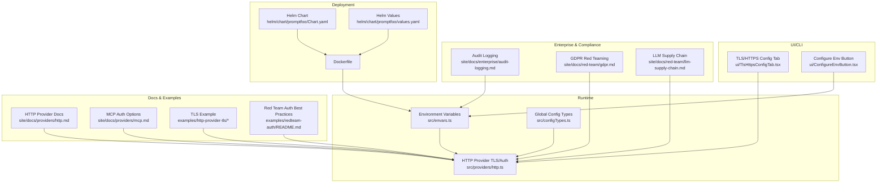
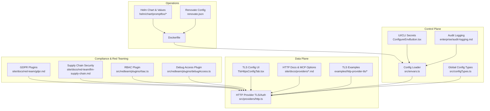
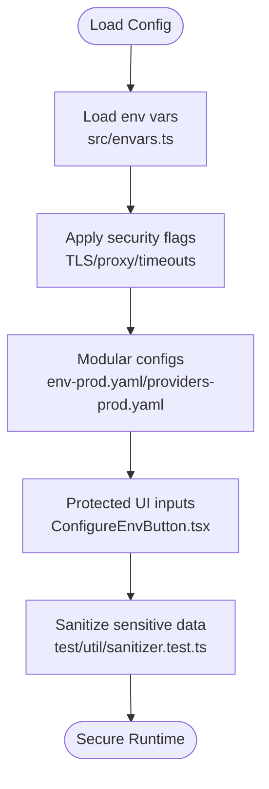
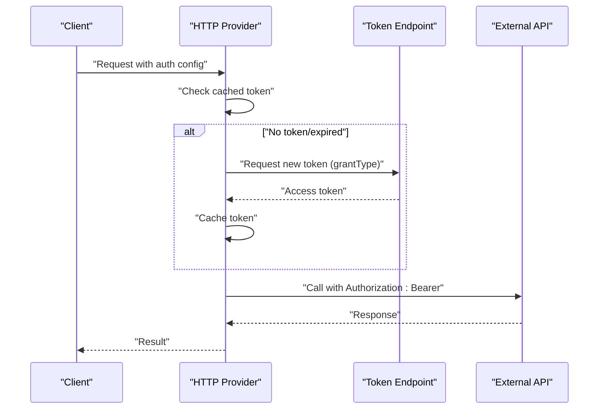
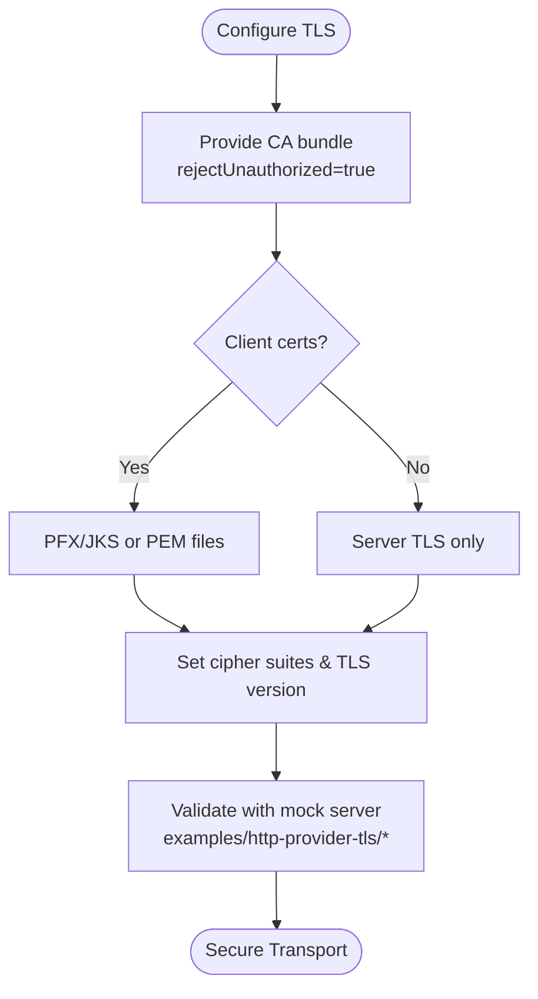
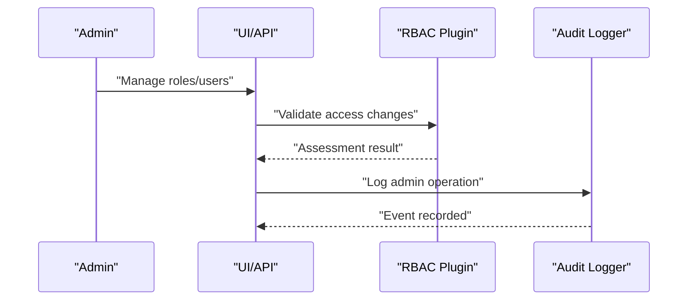
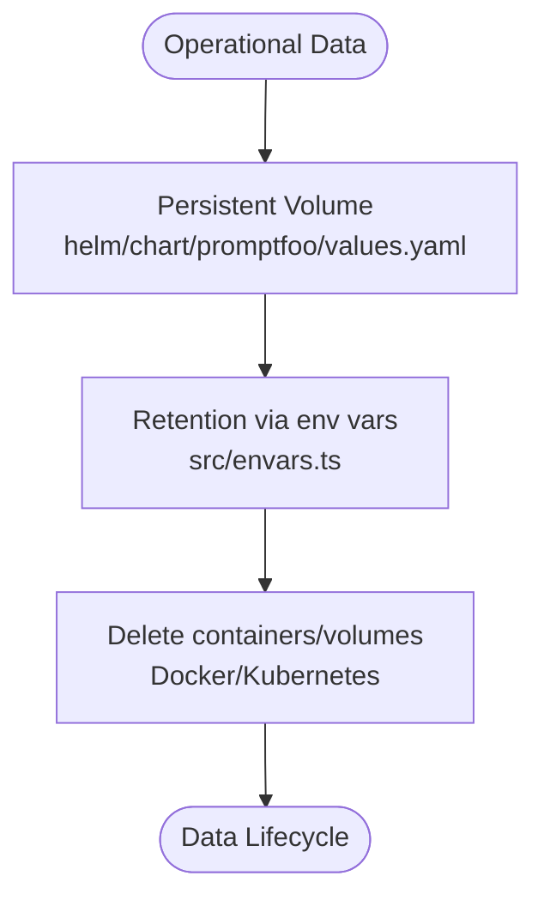
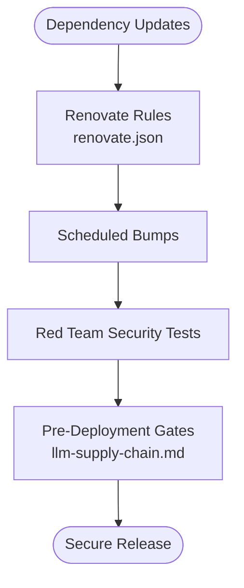
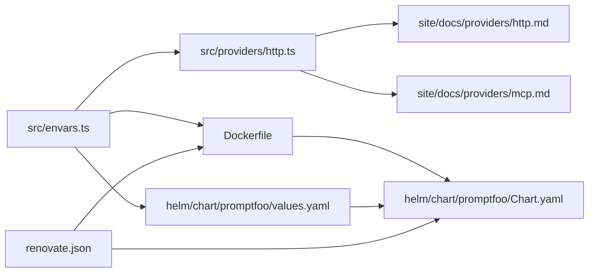

# Security & Operations

<cite>
**Referenced Files in This Document**
- [SECURITY.md](file://SECURITY.md)
- [CONTRIBUTING.md](file://CONTRIBUTING.md)
- [Dockerfile](file://Dockerfile)
- [helm/chart/promptfoo/Chart.yaml](file://helm/chart/promptfoo/Chart.yaml)
- [helm/chart/promptfoo/values.yaml](file://helm/chart/promptfoo/values.yaml)
- [src/envars.ts](file://src/envars.ts)
- [src/configTypes.ts](file://src/configTypes.ts)
- [src/providers/http.ts](file://src/providers/http.ts)
- [src/app/src/pages/redteam/setup/components/Targets/tabs/TlsHttpsConfigTab.tsx](file://src/app/src/pages/redteam/setup/components/Targets/tabs/TlsHttpsConfigTab.tsx)
- [src/app/src/pages/eval-creator/components/ConfigureEnvButton.tsx](file://src/app/src/pages/eval-creator/components/ConfigureEnvButton.tsx)
- [site/docs/providers/http.md](file://site/docs/providers/http.md)
- [site/docs/providers/mcp.md](file://site/docs/providers/mcp.md)
- [site/docs/configuration/modular-configs.md](file://site/docs/configuration/modular-configs.md)
- [site/docs/enterprise/audit-logging.md](file://site/docs/enterprise/audit-logging.md)
- [site/docs/red-team/gdpr.md](file://site/docs/red-team/gdpr.md)
- [site/docs/red-team/llm-supply-chain.md](file://site/docs/red-team/llm-supply-chain.md)
- [site/blog/sensitive-information-disclosure.md](file://site/blog/sensitive-information-disclosure.md)
- [examples/http-provider-tls/README.md](file://examples/http-provider-tls/README.md)
- [examples/http-provider-tls/generate-test-certs.sh](file://examples/http-provider-tls/generate-test-certs.sh)
- [examples/http-provider-tls/mock-server.js](file://examples/http-provider-tls/mock-server.js)
- [examples/redteam-auth/README.md](file://examples/redteam-auth/README.md)
- [renovate.json](file://renovate.json)
- [src/redteam/plugins/rbac.ts](file://src/redteam/plugins/rbac.ts)
- [src/redteam/plugins/debugAccess.ts](file://src/redteam/plugins/debugAccess.ts)
- [src/redteam/plugins/telecom/lawEnforcementRequestHandling.ts](file://src/redteam/plugins/telecom/lawEnforcementRequestHandling.ts)
- [test/util/sanitizer.test.ts](file://test/util/sanitizer.test.ts)
</cite>

## Table of Contents
1. [Introduction](#introduction)
2. [Project Structure](#project-structure)
3. [Core Components](#core-components)
4. [Architecture Overview](#architecture-overview)
5. [Detailed Component Analysis](#detailed-component-analysis)
6. [Dependency Analysis](#dependency-analysis)
7. [Performance Considerations](#performance-considerations)
8. [Troubleshooting Guide](#troubleshooting-guide)
9. [Conclusion](#conclusion)
10. [Appendices](#appendices)

## Introduction
This document provides comprehensive security and operations guidance for deploying and operating PromptFoo. It covers secure configuration management, API key handling, credential rotation, network security (TLS, mTLS, firewalls), access control (OAuth, RBAC, audit logging), data protection (encryption at rest, retention, deletion), vulnerability management, security scanning integration, incident response, operational security (SDL, dependency management, supply chain), compliance and assessments, and environment-specific configuration examples.

## Project Structure
PromptFoo’s security and operations surface spans:
- Core runtime and configuration (environment variables, provider TLS)
- UI and CLI for managing secrets and targets
- Helm/Kubernetes deployment artifacts
- Documentation and examples for TLS and OAuth
- Red team plugins for compliance and guardrails
- Dependency management and security scanning

**Diagram sources**
- [src/envars.ts:1-568](file://src/envars.ts#L1-L568)
- [src/configTypes.ts:1-28](file://src/configTypes.ts#L1-L28)
- [src/providers/http.ts:706-743](file://src/providers/http.ts#L706-L743)
- [src/app/src/pages/redteam/setup/components/Targets/tabs/TlsHttpsConfigTab.tsx:1026-1049](file://src/app/src/pages/redteam/setup/components/Targets/tabs/TlsHttpsConfigTab.tsx#L1026-L1049)
- [src/app/src/pages/eval-creator/components/ConfigureEnvButton.tsx:38-93](file://src/app/src/pages/eval-creator/components/ConfigureEnvButton.tsx#L38-L93)
- [site/docs/providers/http.md:835-1051](file://site/docs/providers/http.md#L835-L1051)
- [site/docs/providers/mcp.md:221-237](file://site/docs/providers/mcp.md#L221-L237)
- [examples/http-provider-tls/README.md:128-162](file://examples/http-provider-tls/README.md#L128-L162)
- [examples/http-provider-tls/generate-test-certs.sh:1-118](file://examples/http-provider-tls/generate-test-certs.sh#L1-L118)
- [examples/http-provider-tls/mock-server.js:1-45](file://examples/http-provider-tls/mock-server.js#L1-L45)
- [examples/redteam-auth/README.md:162-183](file://examples/redteam-auth/README.md#L162-L183)
- [site/docs/enterprise/audit-logging.md:1-37](file://site/docs/enterprise/audit-logging.md#L1-L37)
- [site/docs/red-team/gdpr.md:235-428](file://site/docs/red-team/gdpr.md#L235-L428)
- [site/docs/red-team/llm-supply-chain.md:1-438](file://site/docs/red-team/llm-supply-chain.md#L1-L438)
- [Dockerfile:1-67](file://Dockerfile#L1-L67)
- [helm/chart/promptfoo/Chart.yaml:1-24](file://helm/chart/promptfoo/Chart.yaml#L1-L24)
- [helm/chart/promptfoo/values.yaml:1-95](file://helm/chart/promptfoo/values.yaml#L1-L95)

**Section sources**
- [src/envars.ts:1-568](file://src/envars.ts#L1-L568)
- [src/providers/http.ts:706-743](file://src/providers/http.ts#L706-L743)
- [site/docs/providers/http.md:835-1051](file://site/docs/providers/http.md#L835-L1051)
- [examples/http-provider-tls/README.md:128-162](file://examples/http-provider-tls/README.md#L128-L162)
- [Dockerfile:1-67](file://Dockerfile#L1-L67)
- [helm/chart/promptfoo/Chart.yaml:1-24](file://helm/chart/promptfoo/Chart.yaml#L1-L24)
- [helm/chart/promptfoo/values.yaml:1-95](file://helm/chart/promptfoo/values.yaml#L1-L95)

## Core Components
- Environment variables and secret management
  - Centralized environment variable loader and typed getters
  - Dedicated flags for TLS, proxies, and security-related behaviors
- Provider TLS and authentication
  - Support for client certificates, PFX/JKS, CA bundles, cipher suites, and TLS versions
  - OAuth 2.0 client credentials and password grants
- UI/CLI for secure configuration
  - Protected input fields for API keys and environment variables
  - Target TLS configuration UI
- Enterprise audit logging
  - Administrative event logging for compliance and forensics
- Compliance and red teaming
  - GDPR-aligned plugin strategies and guardrails
  - Supply chain security testing and gates
- Deployment hardening
  - Container base image, non-root user, health checks, and probes
  - Kubernetes chart with persistent volumes and resource limits

**Section sources**
- [src/envars.ts:1-568](file://src/envars.ts#L1-L568)
- [src/providers/http.ts:706-743](file://src/providers/http.ts#L706-L743)
- [site/docs/providers/http.md:835-1051](file://site/docs/providers/http.md#L835-L1051)
- [site/docs/providers/mcp.md:221-237](file://site/docs/providers/mcp.md#L221-L237)
- [src/app/src/pages/eval-creator/components/ConfigureEnvButton.tsx:38-93](file://src/app/src/pages/eval-creator/components/ConfigureEnvButton.tsx#L38-L93)
- [src/app/src/pages/redteam/setup/components/Targets/tabs/TlsHttpsConfigTab.tsx:1026-1049](file://src/app/src/pages/redteam/setup/components/Targets/tabs/TlsHttpsConfigTab.tsx#L1026-L1049)
- [site/docs/enterprise/audit-logging.md:1-37](file://site/docs/enterprise/audit-logging.md#L1-L37)
- [site/docs/red-team/gdpr.md:235-428](file://site/docs/red-team/gdpr.md#L235-L428)
- [site/docs/red-team/llm-supply-chain.md:1-438](file://site/docs/red-team/llm-supply-chain.md#L1-L438)
- [Dockerfile:1-67](file://Dockerfile#L1-L67)
- [helm/chart/promptfoo/Chart.yaml:1-24](file://helm/chart/promptfoo/Chart.yaml#L1-L24)
- [helm/chart/promptfoo/values.yaml:1-95](file://helm/chart/promptfoo/values.yaml#L1-L95)

## Architecture Overview
The security architecture integrates configuration, transport security, identity, and compliance:

**Diagram sources**
- [src/envars.ts:1-568](file://src/envars.ts#L1-L568)
- [src/configTypes.ts:1-28](file://src/configTypes.ts#L1-L28)
- [src/app/src/pages/eval-creator/components/ConfigureEnvButton.tsx:38-93](file://src/app/src/pages/eval-creator/components/ConfigureEnvButton.tsx#L38-L93)
- [src/app/src/pages/redteam/setup/components/Targets/tabs/TlsHttpsConfigTab.tsx:1026-1049](file://src/app/src/pages/redteam/setup/components/Targets/tabs/TlsHttpsConfigTab.tsx#L1026-L1049)
- [src/providers/http.ts:706-743](file://src/providers/http.ts#L706-L743)
- [site/docs/providers/http.md:835-1051](file://site/docs/providers/http.md#L835-L1051)
- [site/docs/providers/mcp.md:221-237](file://site/docs/providers/mcp.md#L221-L237)
- [examples/http-provider-tls/README.md:128-162](file://examples/http-provider-tls/README.md#L128-L162)
- [examples/http-provider-tls/generate-test-certs.sh:1-118](file://examples/http-provider-tls/generate-test-certs.sh#L1-L118)
- [examples/http-provider-tls/mock-server.js:1-45](file://examples/http-provider-tls/mock-server.js#L1-L45)
- [site/docs/red-team/gdpr.md:235-428](file://site/docs/red-team/gdpr.md#L235-L428)
- [site/docs/red-team/llm-supply-chain.md:1-438](file://site/docs/red-team/llm-supply-chain.md#L1-L438)
- [src/redteam/plugins/rbac.ts:99-124](file://src/redteam/plugins/rbac.ts#L99-L124)
- [src/redteam/plugins/debugAccess.ts:144-154](file://src/redteam/plugins/debugAccess.ts#L144-L154)
- [Dockerfile:1-67](file://Dockerfile#L1-L67)
- [helm/chart/promptfoo/Chart.yaml:1-24](file://helm/chart/promptfoo/Chart.yaml#L1-L24)
- [helm/chart/promptfoo/values.yaml:1-95](file://helm/chart/promptfoo/values.yaml#L1-L95)
- [renovate.json:1-333](file://renovate.json#L1-L333)

## Detailed Component Analysis

### Secure Configuration Management
- Environment variables
  - Centralized loader with typed helpers for strings, booleans, integers, floats
  - Dedicated flags for TLS, proxies, timeouts, and security toggles
- Modular configuration
  - Separate environment and provider configs for production isolation
- Secret handling in UI
  - Password-type inputs for API keys and sensitive values
- Sanitization
  - Utility to redact sensitive fields in logs and outputs

**Diagram sources**
- [src/envars.ts:1-568](file://src/envars.ts#L1-L568)
- [site/docs/configuration/modular-configs.md:118-139](file://site/docs/configuration/modular-configs.md#L118-L139)
- [src/app/src/pages/eval-creator/components/ConfigureEnvButton.tsx:38-93](file://src/app/src/pages/eval-creator/components/ConfigureEnvButton.tsx#L38-L93)
- [test/util/sanitizer.test.ts:370-414](file://test/util/sanitizer.test.ts#L370-L414)

**Section sources**
- [src/envars.ts:1-568](file://src/envars.ts#L1-L568)
- [site/docs/configuration/modular-configs.md:118-139](file://site/docs/configuration/modular-configs.md#L118-L139)
- [src/app/src/pages/eval-creator/components/ConfigureEnvButton.tsx:38-93](file://src/app/src/pages/eval-creator/components/ConfigureEnvButton.tsx#L38-L93)
- [test/util/sanitizer.test.ts:370-414](file://test/util/sanitizer.test.ts#L370-L414)

### API Key Handling and Credential Rotation
- OAuth 2.0
  - Client credentials and password grants with token caching and refresh
  - Scopes and token URL configuration
- API key and bearer tokens
  - Header/query placement options for API keys
  - MCP authentication options reference
- Best practices
  - Never commit credentials
  - Use environment variables
  - Rotate credentials regularly
  - Use base64 encoding for private keys in environment variables

**Diagram sources**
- [site/docs/providers/http.md:1142-1200](file://site/docs/providers/http.md#L1142-L1200)
- [site/docs/providers/mcp.md:221-237](file://site/docs/providers/mcp.md#L221-L237)
- [examples/redteam-auth/README.md:162-183](file://examples/redteam-auth/README.md#L162-L183)

**Section sources**
- [site/docs/providers/http.md:1142-1200](file://site/docs/providers/http.md#L1142-L1200)
- [site/docs/providers/mcp.md:221-237](file://site/docs/providers/mcp.md#L221-L237)
- [examples/redteam-auth/README.md:162-183](file://examples/redteam-auth/README.md#L162-L183)

### Network Security: TLS, mTLS, Firewalls, Protocols
- TLS configuration
  - Custom CA, client certs, PFX/JKS, cipher suites, TLS versions
  - Reject unauthorized by default; multiple CA support
- mTLS
  - Client certificate verification with CA trust chain
- Firewall and protocol guidance
  - Prefer TLS 1.2/1.3
  - Restrict outbound egress for third-party code
  - Reverse proxy with authentication for remote UI access
- Example tooling
  - Self-signed certificate generation for testing
  - Mock HTTPS server for mTLS validation

**Diagram sources**
- [site/docs/providers/http.md:835-1051](file://site/docs/providers/http.md#L835-L1051)
- [examples/http-provider-tls/README.md:128-162](file://examples/http-provider-tls/README.md#L128-L162)
- [examples/http-provider-tls/generate-test-certs.sh:1-118](file://examples/http-provider-tls/generate-test-certs.sh#L1-L118)
- [examples/http-provider-tls/mock-server.js:1-45](file://examples/http-provider-tls/mock-server.js#L1-L45)
- [src/providers/http.ts:706-743](file://src/providers/http.ts#L706-L743)
- [src/app/src/pages/redteam/setup/components/Targets/tabs/TlsHttpsConfigTab.tsx:1026-1049](file://src/app/src/pages/redteam/setup/components/Targets/tabs/TlsHttpsConfigTab.tsx#L1026-L1049)

**Section sources**
- [site/docs/providers/http.md:835-1051](file://site/docs/providers/http.md#L835-L1051)
- [examples/http-provider-tls/README.md:128-162](file://examples/http-provider-tls/README.md#L128-L162)
- [examples/http-provider-tls/generate-test-certs.sh:1-118](file://examples/http-provider-tls/generate-test-certs.sh#L1-L118)
- [examples/http-provider-tls/mock-server.js:1-45](file://examples/http-provider-tls/mock-server.js#L1-L45)
- [src/providers/http.ts:706-743](file://src/providers/http.ts#L706-L743)
- [src/app/src/pages/redteam/setup/components/Targets/tabs/TlsHttpsConfigTab.tsx:1026-1049](file://src/app/src/pages/redteam/setup/components/Targets/tabs/TlsHttpsConfigTab.tsx#L1026-L1049)

### Access Control: OAuth, RBAC, Audit Logging
- OAuth integration
  - Client credentials and password grants with scopes
- RBAC
  - Red team plugin defines pass/fail criteria for role-based access scenarios
- Audit logging
  - Administrative operation logging for users, roles, permissions, and service accounts
- Debug access
  - Plugin to ensure educational explanations do not reveal actual internal data

**Diagram sources**
- [site/docs/providers/http.md:1142-1200](file://site/docs/providers/http.md#L1142-L1200)
- [src/redteam/plugins/rbac.ts:99-124](file://src/redteam/plugins/rbac.ts#L99-L124)
- [site/docs/enterprise/audit-logging.md:1-37](file://site/docs/enterprise/audit-logging.md#L1-L37)
- [src/redteam/plugins/debugAccess.ts:144-154](file://src/redteam/plugins/debugAccess.ts#L144-L154)

**Section sources**
- [site/docs/providers/http.md:1142-1200](file://site/docs/providers/http.md#L1142-L1200)
- [src/redteam/plugins/rbac.ts:99-124](file://src/redteam/plugins/rbac.ts#L99-L124)
- [site/docs/enterprise/audit-logging.md:1-37](file://site/docs/enterprise/audit-logging.md#L1-L37)
- [src/redteam/plugins/debugAccess.ts:144-154](file://src/redteam/plugins/debugAccess.ts#L144-L154)

### Data Protection: Encryption at Rest, Retention, Deletion
- Encryption at rest
  - Kubernetes persistent volumes mounted for data persistence
- Data retention
  - Environment variables for log directory and history length
- Secure deletion
  - Remove containers and volumes; rely on persistent volumes for data continuity
- GDPR-aligned red teaming
  - Plugins for privacy, PII, and security of processing

**Diagram sources**
- [helm/chart/promptfoo/values.yaml:70-95](file://helm/chart/promptfoo/values.yaml#L70-L95)
- [src/envars.ts:1-568](file://src/envars.ts#L1-L568)
- [Dockerfile:1-67](file://Dockerfile#L1-L67)
- [site/docs/red-team/gdpr.md:235-428](file://site/docs/red-team/gdpr.md#L235-L428)

**Section sources**
- [helm/chart/promptfoo/values.yaml:70-95](file://helm/chart/promptfoo/values.yaml#L70-L95)
- [src/envars.ts:1-568](file://src/envars.ts#L1-L568)
- [Dockerfile:1-67](file://Dockerfile#L1-L67)
- [site/docs/red-team/gdpr.md:235-428](file://site/docs/red-team/gdpr.md#L235-L428)

### Vulnerability Management and Security Scanning
- Dependency management
  - Automated dependency updates with minimum release age windows
  - Grouping and scheduling for stability and noise reduction
- Security scanning integration
  - Red team plugins for SSRF, injection, debug access, and RBAC/BOLA/BFLA
  - Supply chain security testing and deployment gates

**Diagram sources**
- [renovate.json:1-333](file://renovate.json#L1-L333)
- [site/docs/red-team/llm-supply-chain.md:393-438](file://site/docs/red-team/llm-supply-chain.md#L393-L438)
- [site/docs/red-team/gdpr.md:318-340](file://site/docs/red-team/gdpr.md#L318-L340)

**Section sources**
- [renovate.json:1-333](file://renovate.json#L1-L333)
- [site/docs/red-team/llm-supply-chain.md:393-438](file://site/docs/red-team/llm-supply-chain.md#L393-L438)
- [site/docs/red-team/gdpr.md:318-340](file://site/docs/red-team/gdpr.md#L318-L340)

### Incident Response Procedures
- Reporting
  - Responsible disclosure via GitHub Security Advisories or email
- Scope and acknowledgment
  - In-scope: untrusted data leading to code execution, credential leakage, path traversal
  - Out-of-scope: explicit custom code execution, local web API misuse, third-party issues
- Guidance
  - Isolate affected environments
  - Rotate credentials and certificates
  - Review audit logs and red team findings
  - Update policies and guardrails

**Section sources**
- [SECURITY.md:56-100](file://SECURITY.md#L56-L100)

### Operational Security Practices
- Secure development lifecycle
  - Least privilege containers, non-root users, health checks
- Dependency management
  - Automated updates with delays to absorb supply chain incidents
- Supply chain security
  - Static/dynamic model scanning, behavioral regression testing, deployment gates

**Section sources**
- [Dockerfile:1-67](file://Dockerfile#L1-L67)
- [CONTRIBUTING.md:5-10](file://CONTRIBUTING.md#L5-L10)
- [site/docs/red-team/llm-supply-chain.md:1-438](file://site/docs/red-team/llm-supply-chain.md#L1-L438)

### Compliance Considerations
- GDPR-aligned testing
  - Art. 25 (data protection by design), Art. 32 (security of processing)
  - Plugins for privacy, PII, injection, SSRF, debug access, RBAC/BOLA/BFLA
- Law enforcement handling
  - Red team plugin for lawful request handling and compliance procedures
- Audit logging
  - Forensic visibility into administrative operations

**Section sources**
- [site/docs/red-team/gdpr.md:235-428](file://site/docs/red-team/gdpr.md#L235-L428)
- [src/redteam/plugins/telecom/lawEnforcementRequestHandling.ts:31-57](file://src/redteam/plugins/telecom/lawEnforcementRequestHandling.ts#L31-L57)
- [site/docs/enterprise/audit-logging.md:1-37](file://site/docs/enterprise/audit-logging.md#L1-L37)

### Security Configuration Examples by Environment
- Docker
  - Non-root user, health checks, environment variables for ports and URLs
- Kubernetes (Helm)
  - Persistent volumes, resource requests/limits, replica count 1 for SQLite
- TLS examples
  - Self-signed certs for testing, mTLS with CA trust chain, PFX/JKS usage

**Section sources**
- [Dockerfile:1-67](file://Dockerfile#L1-L67)
- [helm/chart/promptfoo/Chart.yaml:1-24](file://helm/chart/promptfoo/Chart.yaml#L1-L24)
- [helm/chart/promptfoo/values.yaml:1-95](file://helm/chart/promptfoo/values.yaml#L1-L95)
- [examples/http-provider-tls/README.md:128-162](file://examples/http-provider-tls/README.md#L128-L162)
- [examples/http-provider-tls/generate-test-certs.sh:1-118](file://examples/http-provider-tls/generate-test-certs.sh#L1-L118)
- [examples/http-provider-tls/mock-server.js:1-45](file://examples/http-provider-tls/mock-server.js#L1-L45)

## Dependency Analysis

**Diagram sources**
- [src/envars.ts:1-568](file://src/envars.ts#L1-L568)
- [src/providers/http.ts:706-743](file://src/providers/http.ts#L706-L743)
- [Dockerfile:1-67](file://Dockerfile#L1-L67)
- [helm/chart/promptfoo/values.yaml:1-95](file://helm/chart/promptfoo/values.yaml#L1-L95)
- [site/docs/providers/http.md:835-1051](file://site/docs/providers/http.md#L835-L1051)
- [site/docs/providers/mcp.md:221-237](file://site/docs/providers/mcp.md#L221-L237)
- [helm/chart/promptfoo/Chart.yaml:1-24](file://helm/chart/promptfoo/Chart.yaml#L1-L24)
- [renovate.json:1-333](file://renovate.json#L1-L333)

**Section sources**
- [src/envars.ts:1-568](file://src/envars.ts#L1-L568)
- [src/providers/http.ts:706-743](file://src/providers/http.ts#L706-L743)
- [Dockerfile:1-67](file://Dockerfile#L1-L67)
- [helm/chart/promptfoo/values.yaml:1-95](file://helm/chart/promptfoo/values.yaml#L1-L95)
- [site/docs/providers/http.md:835-1051](file://site/docs/providers/http.md#L835-L1051)
- [site/docs/providers/mcp.md:221-237](file://site/docs/providers/mcp.md#L221-L237)
- [helm/chart/promptfoo/Chart.yaml:1-24](file://helm/chart/promptfoo/Chart.yaml#L1-L24)
- [renovate.json:1-333](file://renovate.json#L1-L333)

## Performance Considerations
- TLS handshake overhead
  - Prefer modern cipher suites and TLS 1.3 where possible
- Token caching
  - Proactive refresh with buffer reduces latency and avoids repeated auth calls
- Resource limits
  - Set CPU/memory requests/limits in Kubernetes to prevent noisy-neighbor issues

[No sources needed since this section provides general guidance]

## Troubleshooting Guide
- TLS connection issues
  - Verify rejectUnauthorized flag and CA trust chain
  - Confirm client certificates and passphrases
- OAuth token errors
  - Check grant type, scopes, and token URL
  - Ensure client credentials are rotated and environment variables are set
- Audit logging gaps
  - Confirm enterprise license and admin operation events are enabled
- Supply chain regressions
  - Re-run red team scans and compare against baselines

**Section sources**
- [examples/http-provider-tls/README.md:146-162](file://examples/http-provider-tls/README.md#L146-L162)
- [site/docs/providers/http.md:1142-1200](file://site/docs/providers/http.md#L1142-L1200)
- [site/docs/enterprise/audit-logging.md:1-37](file://site/docs/enterprise/audit-logging.md#L1-L37)
- [site/docs/red-team/llm-supply-chain.md:431-438](file://site/docs/red-team/llm-supply-chain.md#L431-L438)

## Conclusion
PromptFoo’s security and operations model emphasizes secure configuration management, robust transport security, identity controls, compliance-driven red teaming, and resilient deployment practices. By leveraging environment variables, provider TLS, OAuth, audit logging, and supply chain testing, teams can operate PromptFoo securely across diverse environments while maintaining strong governance and incident response readiness.

## Appendices
- Hardening recommendations
  - Run in containers/VMs with minimal privileges
  - Use least-privileged API keys
  - Avoid secrets in prompts/fixtures
  - Restrict network egress for third-party code
  - Do not expose local web server to untrusted networks
  - Use reverse proxy with authentication for remote access
  - Rotate credentials regularly

**Section sources**
- [SECURITY.md:35-47](file://SECURITY.md#L35-L47)