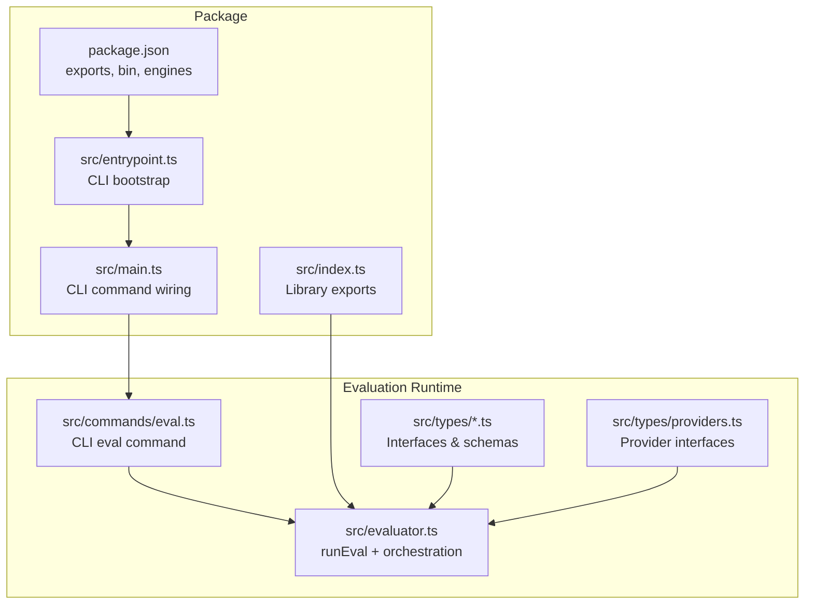
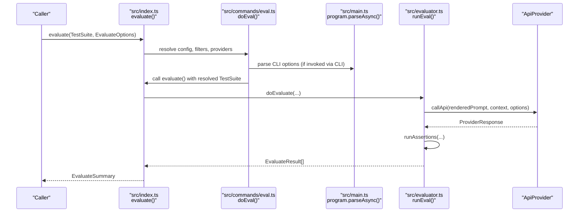
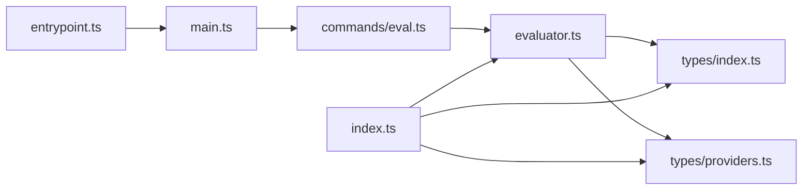

# API Reference

<cite>
**Referenced Files in This Document**
- [package.json](file://package.json)
- [src/index.ts](file://src/index.ts)
- [src/main.ts](file://src/main.ts)
- [src/entrypoint.ts](file://src/entrypoint.ts)
- [src/commands/eval.ts](file://src/commands/eval.ts)
- [src/evaluator.ts](file://src/evaluator.ts)
- [src/types/index.ts](file://src/types/index.ts)
- [src/types/providers.ts](file://src/types/providers.ts)
- [src/configTypes.ts](file://src/configTypes.ts)
</cite>

## Table of Contents
1. [Introduction](#introduction)
2. [Project Structure](#project-structure)
3. [Core Components](#core-components)
4. [Architecture Overview](#architecture-overview)
5. [Detailed Component Analysis](#detailed-component-analysis)
6. [Dependency Analysis](#dependency-analysis)
7. [Performance Considerations](#performance-considerations)
8. [Troubleshooting Guide](#troubleshooting-guide)
9. [Conclusion](#conclusion)
10. [Appendices](#appendices)

## Introduction
This document provides a comprehensive API reference for PromptFoo’s programmatic interfaces. It covers:
- Node.js package exports and entry points
- TypeScript interfaces and types for evaluation, providers, and configuration
- Evaluation API including runEval function parameters, configuration objects, and result structures
- Provider interfaces for custom provider development
- Assertion APIs for custom validation logic and scoring functions
- CLI programmatic usage including command execution, option parsing, and output processing
- Configuration API for dynamic config modification and validation
- Examples of common integration patterns, error handling strategies, and performance optimization techniques
- Deprecations, migration notes, and version compatibility

## Project Structure
PromptFoo exposes a Node.js package with dual exports (ESM and CommonJS), a CLI entrypoint, and a rich TypeScript API surface for programmatic evaluation and provider integration.

**Diagram sources**
- [package.json:13-37](file://package.json#L13-L37)
- [src/index.ts:197-207](file://src/index.ts#L197-L207)
- [src/entrypoint.ts:42-46](file://src/entrypoint.ts#L42-L46)
- [src/main.ts:182-256](file://src/main.ts#L182-L256)
- [src/commands/eval.ts:84-637](file://src/commands/eval.ts#L84-L637)
- [src/evaluator.ts:291-695](file://src/evaluator.ts#L291-L695)
- [src/types/index.ts:1-120](file://src/types/index.ts#L1-L120)
- [src/types/providers.ts:1-120](file://src/types/providers.ts#L1-L120)

**Section sources**
- [package.json:13-37](file://package.json#L13-L37)
- [src/index.ts:197-207](file://src/index.ts#L197-L207)
- [src/entrypoint.ts:42-46](file://src/entrypoint.ts#L42-L46)
- [src/main.ts:182-256](file://src/main.ts#L182-L256)
- [src/commands/eval.ts:84-637](file://src/commands/eval.ts#L84-L637)
- [src/evaluator.ts:291-695](file://src/evaluator.ts#L291-L695)
- [src/types/index.ts:1-120](file://src/types/index.ts#L1-L120)
- [src/types/providers.ts:1-120](file://src/types/providers.ts#L1-L120)

## Core Components
- Library exports: The primary programmatic entry is the evaluate function exported from the library entrypoint. It accepts a TestSuite and EvaluateOptions, resolves providers and prompts, and orchestrates evaluation.
- CLI entrypoint: The CLI binary delegates to main.ts, which wires commands and options, then invokes the evaluation flow.
- Evaluation runtime: runEval executes a single test case, renders prompts, calls providers, applies transforms, runs assertions, and aggregates results.
- Provider interfaces: ApiProvider defines the contract for custom providers, including callApi, optional embeddings/classification/moderation, and optional cleanup.
- Types and schemas: Strongly typed interfaces define EvaluateOptions, EvaluateResult, Assertion, ProviderResponse, and more.

**Section sources**
- [src/index.ts:41-178](file://src/index.ts#L41-L178)
- [src/entrypoint.ts:24-40](file://src/entrypoint.ts#L24-L40)
- [src/main.ts:169-256](file://src/main.ts#L169-L256)
- [src/evaluator.ts:291-695](file://src/evaluator.ts#L291-L695)
- [src/types/providers.ts:102-120](file://src/types/providers.ts#L102-L120)
- [src/types/index.ts:213-257](file://src/types/index.ts#L213-L257)

## Architecture Overview
The evaluation pipeline integrates CLI commands, configuration resolution, provider invocation, assertion execution, and result aggregation.

**Diagram sources**
- [src/index.ts:41-178](file://src/index.ts#L41-L178)
- [src/commands/eval.ts:84-637](file://src/commands/eval.ts#L84-L637)
- [src/main.ts:169-256](file://src/main.ts#L169-L256)
- [src/evaluator.ts:291-695](file://src/evaluator.ts#L291-L695)
- [src/types/providers.ts:102-120](file://src/types/providers.ts#L102-L120)

## Detailed Component Analysis

### Library Exports and Programmatic API
- evaluate(testSuite, options?): Orchestrates evaluation, loads providers, resolves prompts/tests/scenarios, constructs a unified TestSuite, optionally migrates DB, and runs doEvaluate. It also handles sharing, output writing, and returns a summary.
- Default export and named exports include assertions, cache, evaluate, guardrails, loadApiProvider, and redteam utilities.

Key behaviors:
- Provider resolution and mapping by id/label
- DefaultTest resolution from external files
- Nested provider resolution for defaultTest and test.options
- Cache disabling when repeat > 1 or cache explicitly false
- Sharing and output writing based on configuration

**Section sources**
- [src/index.ts:41-178](file://src/index.ts#L41-L178)
- [src/index.ts:197-207](file://src/index.ts#L197-L207)

### Evaluation API: runEval and Options
- runEval(RunEvalOptions): Executes a single test case end-to-end:
  - Renders prompt with vars and filters
  - Calls provider.callApi with CallApiContextParams and optional AbortSignal
  - Applies provider and test transforms
  - Runs assertions and computes scores
  - Tracks token usage and stores session IDs
  - Returns EvaluateResult[]
- EvaluateOptions: Controls caching, delays, concurrency, timeouts, progress callbacks, and verbosity.

Important types and structures:
- RunEvalOptions: includes provider, prompt, test, delay, testIdx, promptIdx, repeatIndex, conversations, registers, isRedteam, abortSignal, evalId, rateLimitRegistry
- EvaluateOptions: includes cache, delay, eventSource, generateSuggestions, maxConcurrency, progressCallback, repeat, showProgressBar, timeoutMs, maxEvalTimeMs, isRedteam, silent, abortSignal
- EvaluateResult: includes provider identity, prompt, vars, response/error, failureReason, success, score, latencyMs, gradingResult, namedScores, cost, metadata, tokenUsage
- ProviderResponse: standardized shape for provider outputs, including tokenUsage, latencyMs, metadata, and optional binary/audio/video/image attachments

**Section sources**
- [src/evaluator.ts:291-695](file://src/evaluator.ts#L291-L695)
- [src/types/index.ts:174-211](file://src/types/index.ts#L174-L211)
- [src/types/index.ts:213-257](file://src/types/index.ts#L213-L257)
- [src/types/index.ts:325-346](file://src/types/index.ts#L325-L346)
- [src/types/providers.ts:145-218](file://src/types/providers.ts#L145-L218)

### Provider Interfaces for Custom Provider Development
- ApiProvider: core interface with id(), callApi(prompt, context?, options?), optional callClassificationApi, callEmbeddingApi, and cleanup().
- CallApiContextParams: includes vars, prompt, filters, originalProvider, test, logger, getCache, debug, traceparent/tracestate, evaluationId/testCaseId/testIdx/promptIdx/repeatIndex.
- CallApiOptionsParams: includes includeLogProbs and AbortSignal.
- ProviderResponse: standardized output shape with output, tokenUsage, latencyMs, metadata, and optional binary/audio/video/image attachments.
- GuardrailResponse and ModerationFlag: optional guardrails and moderation outputs.

Implementation guidelines:
- Implement callApi to return a ProviderResponse with accurate tokenUsage and latencyMs
- Use CallApiContextParams to access vars, filters, and trace context
- Optionally implement callEmbeddingApi or callClassificationApi for specialized providers
- Implement cleanup() to release resources on abort or cancellation

**Section sources**
- [src/types/providers.ts:102-120](file://src/types/providers.ts#L102-L120)
- [src/types/providers.ts:61-100](file://src/types/providers.ts#L61-L100)
- [src/types/providers.ts:145-218](file://src/types/providers.ts#L145-L218)
- [src/types/providers.ts:138-143](file://src/types/providers.ts#L138-L143)

### Assertion APIs and Scoring Functions
- Assertion: defines type, value, config, threshold, weight, provider, rubricPrompt, metric, transform, contextTransform
- AssertionSet: groups multiple assertions with weight, metric, threshold, and optional config
- AssertionValueFunction: dynamic value computation with context including prompt, vars, test, logProbs, providerResponse, trace
- ScoringFunction: custom scoring function that takes namedScores and optional context (threshold, parentAssertionSet, componentResults, tokensUsed) and returns GradingResult
- runAssertions: executes assertions and returns GradingResult with pass/score/reason/namedScores/tokensUsed/componentResults/metadata

Validation and schemas:
- AssertionSchema, AssertionSetSchema, AssertionOrSetSchema, BaseAssertionTypesSchema, SpecialAssertionTypesSchema
- GradingConfigSchema for rubricPrompt/provider/factuality overrides

**Section sources**
- [src/types/index.ts:621-652](file://src/types/index.ts#L621-L652)
- [src/types/index.ts:602-616](file://src/types/index.ts#L602-L616)
- [src/types/index.ts:514-574](file://src/types/index.ts#L514-L574)
- [src/types/index.ts:663-702](file://src/types/index.ts#L663-L702)
- [src/types/index.ts:750-765](file://src/types/index.ts#L750-L765)
- [src/types/index.ts:453-495](file://src/types/index.ts#L453-L495)

### CLI Programmatic Usage
- CLI bootstrap: src/entrypoint.ts enforces minimum Node.js version and sets argv[1] to main.js before importing.
- CLI wiring: src/main.ts creates the commander program, adds common options (-v/--verbose, --env-file/--env-path), registers commands, and parses options.
- Evaluation command: src/commands/eval.ts implements doEval(), which resolves configs, validates options, filters providers/tests, checks API keys, and calls evaluate().

Key option parsing behaviors:
- normalizeEnvPaths: expands comma-separated env-file paths and flattens arrays
- addCommonOptionsRecursively: attaches verbose and env-file options to all commands and records telemetry
- doEval: merges CLI and config options, applies filters, manages retries/pauses, and writes outputs

**Section sources**
- [src/entrypoint.ts:24-40](file://src/entrypoint.ts#L24-L40)
- [src/entrypoint.ts:42-46](file://src/entrypoint.ts#L42-L46)
- [src/main.ts:54-72](file://src/main.ts#L54-L72)
- [src/main.ts:124-167](file://src/main.ts#L124-L167)
- [src/main.ts:182-256](file://src/main.ts#L182-L256)
- [src/commands/eval.ts:56-67](file://src/commands/eval.ts#L56-L67)
- [src/commands/eval.ts:84-637](file://src/commands/eval.ts#L84-L637)

### Configuration API and Dynamic Modification
- GlobalConfig: structure for cloud and account settings used across the app
- EvaluateOptionsSchema: validated options for evaluation runtime
- CommandLineOptionsSchema: validated CLI options
- TestSuiteSchema: validated configuration structure for tests, prompts, providers, scenarios, and defaultTest
- Dynamic modifications:
  - Provider resolution by id/label
  - External file resolution for defaultTest and tests/scenarios
  - Runtime option merging (repeat, cache, maxConcurrency, delay)
  - Filtering of providers/tests via CLI options

**Section sources**
- [src/configTypes.ts:1-28](file://src/configTypes.ts#L1-L28)
- [src/types/index.ts:62-113](file://src/types/index.ts#L62-L113)
- [src/types/index.ts:213-257](file://src/types/index.ts#L213-L257)
- [src/commands/eval.ts:522-532](file://src/commands/eval.ts#L522-L532)
- [src/index.ts:58-61](file://src/index.ts#L58-L61)
- [src/index.ts:102-123](file://src/index.ts#L102-L123)

### Version Compatibility and Deprecations
- Engines: requires Node.js ^20.20.0 or >=22.22.0
- Deprecated EvaluateOptions.interactiveProviders: marked as removed as of 2024-08-21; use maxConcurrency: 1 or CLI -j 1 to run serially
- Deprecated OutputConfig.postprocess: superseded by transform

**Section sources**
- [package.json:31-33](file://package.json#L31-L33)
- [src/types/index.ts:218-223](file://src/types/index.ts#L218-L223)
- [src/types/index.ts:156-157](file://src/types/index.ts#L156-L157)

## Dependency Analysis
High-level dependencies between modules:

**Diagram sources**
- [src/entrypoint.ts:42-46](file://src/entrypoint.ts#L42-L46)
- [src/main.ts:182-256](file://src/main.ts#L182-L256)
- [src/commands/eval.ts:84-637](file://src/commands/eval.ts#L84-L637)
- [src/evaluator.ts:291-695](file://src/evaluator.ts#L291-L695)
- [src/types/index.ts:1-120](file://src/types/index.ts#L1-L120)
- [src/types/providers.ts:1-120](file://src/types/providers.ts#L1-L120)
- [src/index.ts:197-207](file://src/index.ts#L197-L207)

**Section sources**
- [src/entrypoint.ts:42-46](file://src/entrypoint.ts#L42-L46)
- [src/main.ts:182-256](file://src/main.ts#L182-L256)
- [src/commands/eval.ts:84-637](file://src/commands/eval.ts#L84-L637)
- [src/evaluator.ts:291-695](file://src/evaluator.ts#L291-L695)
- [src/types/index.ts:1-120](file://src/types/index.ts#L1-L120)
- [src/types/providers.ts:1-120](file://src/types/providers.ts#L1-L120)
- [src/index.ts:197-207](file://src/index.ts#L197-L207)

## Performance Considerations
- Concurrency control: Use maxConcurrency to limit parallel provider calls; setting a delay forces serial execution (concurrency=1)
- Cache behavior: Disable cache when repeat > 1 or when cache=false; this avoids stale results but increases cost/time
- Timeout controls: Use timeoutMs for per-test timeouts and maxEvalTimeMs for overall evaluation limits
- Transforms and binary extraction: Provider and test transforms occur before grading; large outputs are externalized to avoid token bloat
- Progress reporting: Disable progress bar in CI or for large runs to reduce overhead

[No sources needed since this section provides general guidance]

## Troubleshooting Guide
Common issues and strategies:
- Node.js version mismatch: The CLI checks the Node.js version and exits with a helpful message if unsupported
- Missing API keys: Provider filtering occurs after config resolution; missing keys are reported with environment variable hints
- Pausing/resuming: SIGINT can pause evaluation; a second SIGINT forces exit; resume via --resume with the evaluation ID
- Retry errors: Use --retry-errors to rerun only ERROR results from the latest evaluation; old ERROR results are deleted after successful retry
- Sharing failures: Sharing is attempted asynchronously; failures are logged as warnings and do not fail the evaluation
- Abort handling: runEval catches AbortError specially and avoids noisy logging; use AbortSignal to cancel long-running evaluations

**Section sources**
- [src/entrypoint.ts:24-40](file://src/entrypoint.ts#L24-L40)
- [src/commands/eval.ts:446-460](file://src/commands/eval.ts#L446-L460)
- [src/commands/eval.ts:567-600](file://src/commands/eval.ts#L567-L600)
- [src/commands/eval.ts:612-634](file://src/commands/eval.ts#L612-L634)
- [src/evaluator.ts:673-676](file://src/evaluator.ts#L673-L676)

## Conclusion
PromptFoo’s programmatic API centers around a robust evaluation engine with strongly typed interfaces, flexible provider contracts, and comprehensive CLI integration. The library enables dynamic configuration, custom assertions, and extensible provider development, while the CLI provides powerful options for filtering, pausing, retrying, and sharing results.

[No sources needed since this section summarizes without analyzing specific files]

## Appendices

### API Quick Reference

- Library
  - evaluate(testSuite, options?): Promise<Eval>
  - Default export: { assertions, cache, evaluate, guardrails, loadApiProvider, redteam }
- Evaluation
  - runEval(options): Promise<EvaluateResult[]>
  - EvaluateOptions: cache, delay, eventSource, generateSuggestions, maxConcurrency, progressCallback, repeat, showProgressBar, timeoutMs, maxEvalTimeMs, isRedteam, silent, abortSignal
  - EvaluateResult: provider, prompt, vars, response/error, failureReason, success, score, latencyMs, gradingResult, namedScores, cost, metadata, tokenUsage
- Providers
  - ApiProvider: id(), callApi(), optional callClassificationApi(), callEmbeddingApi(), cleanup()
  - CallApiContextParams: vars, prompt, filters, originalProvider, test, logger, getCache, debug, traceparent/tracestate, evaluationId/testCaseId/testIdx/promptIdx/repeatIndex
  - ProviderResponse: output, tokenUsage, latencyMs, metadata, optional binary/audio/video/image attachments
- Assertions
  - Assertion/AssertionSet: type, value, config, threshold, weight, provider, rubricPrompt, metric, transform, contextTransform
  - ScoringFunction: (namedScores, context?) => GradingResult | Promise<GradingResult>
  - runAssertions(params): Promise<GradingResult>
- CLI
  - src/entrypoint.ts: Node.js version enforcement and bootstrap
  - src/main.ts: Commander program, common options, command registration
  - src/commands/eval.ts: doEval(), option parsing, filtering, retries, sharing

**Section sources**
- [src/index.ts:41-178](file://src/index.ts#L41-L178)
- [src/evaluator.ts:291-695](file://src/evaluator.ts#L291-L695)
- [src/types/index.ts:213-257](file://src/types/index.ts#L213-L257)
- [src/types/index.ts:325-346](file://src/types/index.ts#L325-L346)
- [src/types/providers.ts:102-120](file://src/types/providers.ts#L102-L120)
- [src/types/providers.ts:61-100](file://src/types/providers.ts#L61-L100)
- [src/types/providers.ts:145-218](file://src/types/providers.ts#L145-L218)
- [src/types/index.ts:621-652](file://src/types/index.ts#L621-L652)
- [src/types/index.ts:750-765](file://src/types/index.ts#L750-L765)
- [src/entrypoint.ts:24-40](file://src/entrypoint.ts#L24-L40)
- [src/main.ts:124-167](file://src/main.ts#L124-L167)
- [src/commands/eval.ts:84-637](file://src/commands/eval.ts#L84-L637)