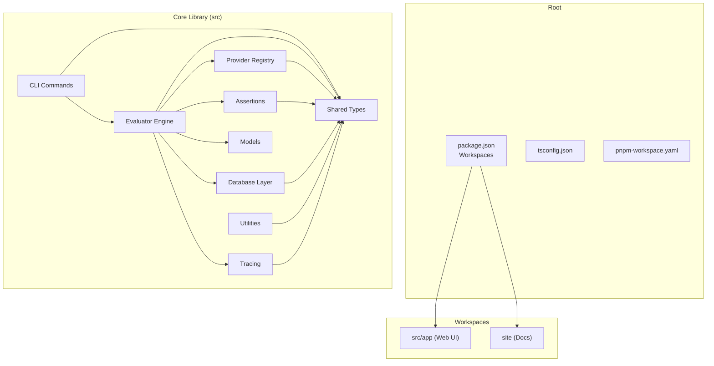
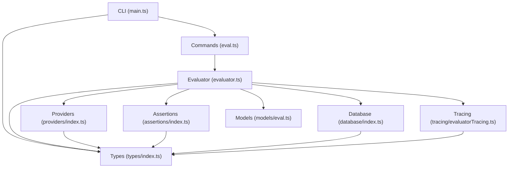
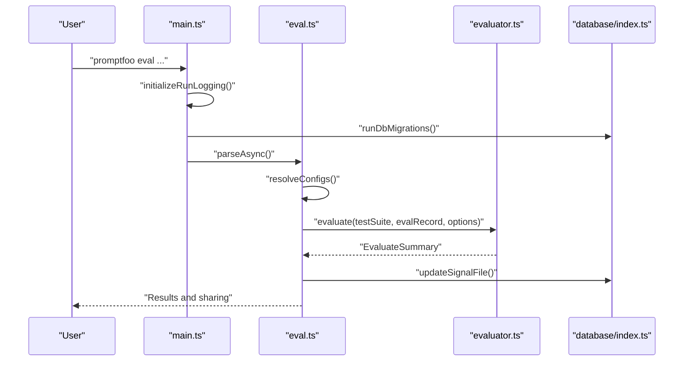
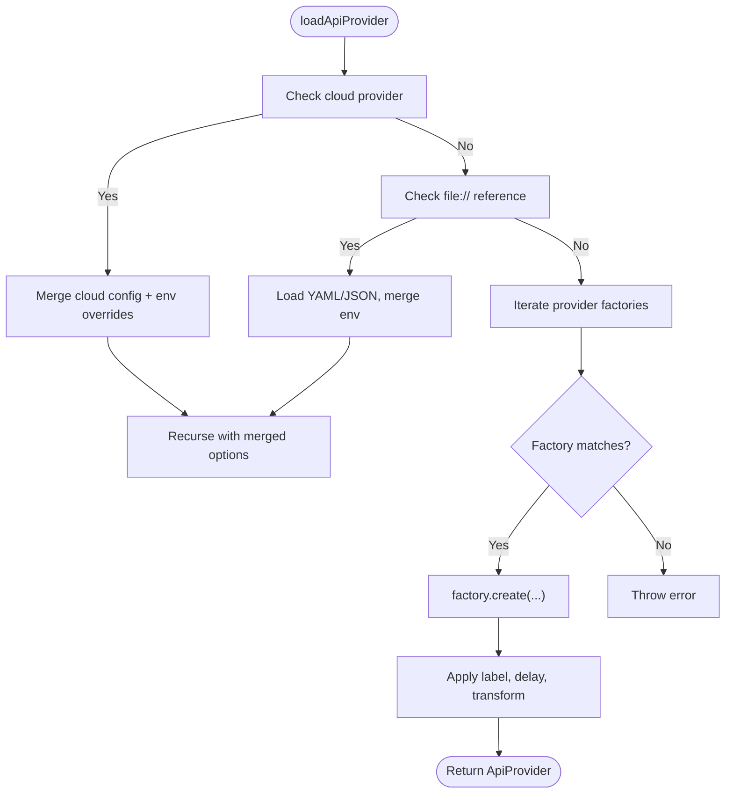
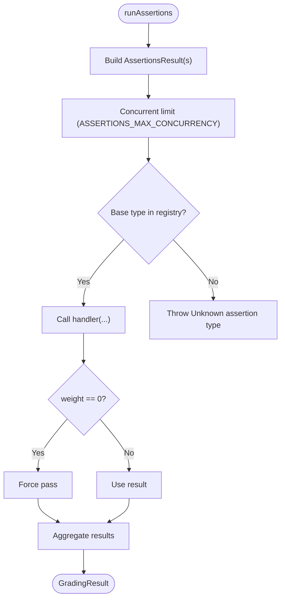
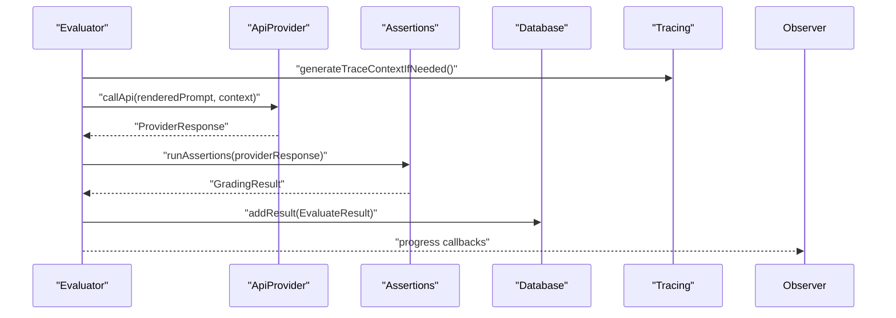
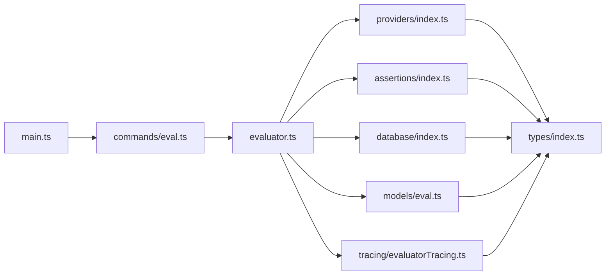

# Codebase Architecture

<cite>
**Referenced Files in This Document**
- [package.json](file://package.json)
- [tsconfig.json](file://tsconfig.json)
- [pnpm-workspace.yaml](file://pnpm-workspace.yaml)
- [src/index.ts](file://src/index.ts)
- [src/main.ts](file://src/main.ts)
- [src/evaluator.ts](file://src/evaluator.ts)
- [src/providers/index.ts](file://src/providers/index.ts)
- [src/assertions/index.ts](file://src/assertions/index.ts)
- [src/database/index.ts](file://src/database/index.ts)
- [src/server/index.ts](file://src/server/index.ts)
- [src/providers/providerRegistry.ts](file://src/providers/providerRegistry.ts)
- [src/tracing/evaluatorTracing.ts](file://src/tracing/evaluatorTracing.ts)
- [src/util/index.ts](file://src/util/index.ts)
- [src/types/index.ts](file://src/types/index.ts)
- [src/models/eval.ts](file://src/models/eval.ts)
- [src/commands/eval.ts](file://src/commands/eval.ts)
</cite>

## Table of Contents
1. [Introduction](#introduction)
2. [Project Structure](#project-structure)
3. [Core Components](#core-components)
4. [Architecture Overview](#architecture-overview)
5. [Detailed Component Analysis](#detailed-component-analysis)
6. [Dependency Analysis](#dependency-analysis)
7. [Performance Considerations](#performance-considerations)
8. [Troubleshooting Guide](#troubleshooting-guide)
9. [Conclusion](#conclusion)

## Introduction
This document provides comprehensive architecture documentation for PromptFoo, a monorepo-based LLM evaluation and testing toolkit. It explains the monorepo structure, TypeScript compilation setup, module organization, and core architectural patterns including factory patterns for providers, strategy patterns for assertions, and observer patterns for evaluation lifecycle. It also documents the dependency injection system, plugin architecture, event-driven design, build system, testing framework configuration, and development workflow. Finally, it outlines the separation of concerns between CLI, web interface, database layer, and provider integrations, along with code organization principles, naming conventions, and architectural decisions.

## Project Structure
PromptFoo is organized as a monorepo with multiple packages and a central source tree:
- Root package defines workspaces for the main application and documentation site.
- The core library resides under src/, with subdirectories for major functional areas:
  - CLI entrypoints and commands
  - Evaluation engine
  - Provider integrations
  - Assertion implementations
  - Database and ORM layer
  - Web server and UI components
  - Tracing and telemetry
  - Utilities and shared types
- The documentation site is a separate workspace package.

**Diagram sources**
- [package.json:19-22](file://package.json#L19-L22)
- [pnpm-workspace.yaml:1-4](file://pnpm-workspace.yaml#L1-L4)
- [tsconfig.json:1-46](file://tsconfig.json#L1-L46)

**Section sources**
- [package.json:1-326](file://package.json#L1-L326)
- [pnpm-workspace.yaml:1-4](file://pnpm-workspace.yaml#L1-L4)
- [tsconfig.json:1-46](file://tsconfig.json#L1-L46)

## Core Components
This section introduces the primary building blocks of the system and their responsibilities.

- CLI and Command System
  - The CLI orchestrates configuration loading, environment setup, provider resolution, and evaluation execution. It supports pausing/resuming, retrying, and sharing results.
  - Key entry points: main.ts initializes the CLI, sets up telemetry and migrations, and wires commands.

- Evaluation Engine
  - The evaluator coordinates provider calls, assertion execution, progress tracking, and result aggregation. It manages concurrency, rate limits, and tracing.

- Provider System
  - A factory-based provider loader resolves provider configurations from strings, files, or objects. It supports cloud-linked providers and merges environment overrides.

- Assertion System
  - A strategy-based assertion engine dispatches to specialized handlers for different assertion types. It supports scripting, model-graded assertions, and external integrations.

- Database Layer
  - SQLite-backed persistence with Drizzle ORM. Provides evaluation records, results, prompts, datasets, and tags with optimized queries and JSON metadata support.

- Tracing and Observability
  - OpenTelemetry-based tracing with OTLP receiver support. Generates trace contexts and links evaluation runs to trace data.

- Models and Types
  - Strongly typed schemas for configuration, evaluation results, prompts, providers, and assertions. Includes Zod schemas for validation and runtime type guards.

**Section sources**
- [src/main.ts:1-373](file://src/main.ts#L1-L373)
- [src/commands/eval.ts:1-800](file://src/commands/eval.ts#L1-L800)
- [src/evaluator.ts:1-800](file://src/evaluator.ts#L1-L800)
- [src/providers/index.ts:1-466](file://src/providers/index.ts#L1-L466)
- [src/assertions/index.ts:1-669](file://src/assertions/index.ts#L1-L669)
- [src/database/index.ts:1-122](file://src/database/index.ts#L1-L122)
- [src/tracing/evaluatorTracing.ts:1-213](file://src/tracing/evaluatorTracing.ts#L1-L213)
- [src/types/index.ts:1-800](file://src/types/index.ts#L1-L800)

## Architecture Overview
The system follows a layered architecture with clear separation of concerns:
- Presentation Layer: CLI and web UI (src/app) consume configuration and display results.
- Application Layer: Commands orchestrate evaluation lifecycle, manage state, and coordinate subsystems.
- Domain Layer: Evaluator encapsulates evaluation logic, concurrency, and result processing.
- Persistence Layer: Database models and repositories manage evaluation artifacts and metadata.
- Integration Layer: Provider and assertion factories integrate external services and strategies.

**Diagram sources**
- [src/main.ts:1-373](file://src/main.ts#L1-L373)
- [src/commands/eval.ts:1-800](file://src/commands/eval.ts#L1-L800)
- [src/evaluator.ts:1-800](file://src/evaluator.ts#L1-L800)
- [src/providers/index.ts:1-466](file://src/providers/index.ts#L1-L466)
- [src/assertions/index.ts:1-669](file://src/assertions/index.ts#L1-L669)
- [src/database/index.ts:1-122](file://src/database/index.ts#L1-L122)
- [src/tracing/evaluatorTracing.ts:1-213](file://src/tracing/evaluatorTracing.ts#L1-L213)
- [src/models/eval.ts:1-800](file://src/models/eval.ts#L1-L800)
- [src/types/index.ts:1-800](file://src/types/index.ts#L1-L800)

## Detailed Component Analysis

### CLI and Command System
The CLI initializes logging, migrations, and telemetry, then constructs a command tree with shared options and pre/post hooks. It supports pausing/resuming, retrying, and sharing results, and integrates with cloud configuration and permissions.

**Diagram sources**
- [src/main.ts:169-256](file://src/main.ts#L169-L256)
- [src/commands/eval.ts:132-637](file://src/commands/eval.ts#L132-L637)
- [src/evaluator.ts:1-800](file://src/evaluator.ts#L1-L800)
- [src/database/index.ts:1-122](file://src/database/index.ts#L1-L122)

**Section sources**
- [src/main.ts:1-373](file://src/main.ts#L1-L373)
- [src/commands/eval.ts:1-800](file://src/commands/eval.ts#L1-L800)

### Provider Factory Pattern
Providers are resolved through a factory registry. The loader supports:
- Cloud-linked providers with validation and merging of overrides
- File-based provider configs with environment rendering
- Function providers and direct provider objects
- Labeling, delays, and transforms

**Diagram sources**
- [src/providers/index.ts:31-177](file://src/providers/index.ts#L31-L177)
- [src/providers/index.ts:192-235](file://src/providers/index.ts#L192-L235)
- [src/providers/index.ts:345-417](file://src/providers/index.ts#L345-L417)

**Section sources**
- [src/providers/index.ts:1-466](file://src/providers/index.ts#L1-L466)

### Assertion Strategy Pattern
Assertions are dispatched through a centralized handler registry keyed by assertion type. The system supports:
- Built-in assertion handlers
- Script-based assertions (JavaScript, Python, Ruby)
- Model-graded assertions with trace linking
- Assertion sets and weighted scoring

**Diagram sources**
- [src/assertions/index.ts:514-617](file://src/assertions/index.ts#L514-L617)
- [src/assertions/index.ts:117-200](file://src/assertions/index.ts#L117-L200)

**Section sources**
- [src/assertions/index.ts:1-669](file://src/assertions/index.ts#L1-L669)

### Evaluation Lifecycle Observer Pattern
The evaluator observes test execution stages:
- Progress tracking with CLI progress bars and web UI signals
- Concurrency and rate-limiting coordination
- Telemetry and tracing integration
- Result aggregation and persistence

**Diagram sources**
- [src/evaluator.ts:291-695](file://src/evaluator.ts#L291-L695)
- [src/tracing/evaluatorTracing.ts:142-212](file://src/tracing/evaluatorTracing.ts#L142-L212)
- [src/models/eval.ts:744-757](file://src/models/eval.ts#L744-L757)

**Section sources**
- [src/evaluator.ts:1-800](file://src/evaluator.ts#L1-L800)
- [src/tracing/evaluatorTracing.ts:1-213](file://src/tracing/evaluatorTracing.ts#L1-L213)
- [src/models/eval.ts:1-800](file://src/models/eval.ts#L1-L800)

### Dependency Injection and Plugin Architecture
- Dependency Injection
  - Provider instances are injected into evaluation contexts, including trace context, caches, and abort signals.
  - Rate limit registry is injected for adaptive concurrency control.
- Plugin Architecture
  - Redteam plugins and strategies are integrated through dedicated modules and registries.
  - Extensions leverage hook contexts for custom behavior.

**Section sources**
- [src/evaluator.ts:420-470](file://src/evaluator.ts#L420-L470)
- [src/types/index.ts:34-51](file://src/types/index.ts#L34-L51)

### Event-Driven Design
- Signal-based notifications for new results (updateSignalFile triggers UI refresh).
- Graceful shutdown with timeouts and cleanup handlers.
- OTLP tracing receiver lifecycle management.

**Section sources**
- [src/models/eval.ts:754-756](file://src/models/eval.ts#L754-L756)
- [src/main.ts:262-338](file://src/main.ts#L262-L338)
- [src/tracing/evaluatorTracing.ts:59-99](file://src/tracing/evaluatorTracing.ts#L59-L99)

### Build System and Development Workflow
- TypeScript configuration targets ESNext modules with bundler resolution and composite builds.
- Root package defines workspaces for src/app and site.
- Scripts orchestrate concurrent TypeScript compilation, watcher builds, and app builds.
- Development uses concurrently for server and app watching.

**Section sources**
- [tsconfig.json:1-46](file://tsconfig.json#L1-L46)
- [package.json:19-22](file://package.json#L19-L22)
- [package.json:38-85](file://package.json#L38-L85)

### Testing Framework Configuration
- Vitest is configured for unit and integration tests with coverage.
- Smoke tests and CI-friendly configurations are provided.
- Mocks and factories support isolated testing.

**Section sources**
- [package.json:74-81](file://package.json#L74-L81)
- [vitest.config.ts](file://vitest.config.ts)

### Separation of Concerns
- CLI: Parses commands, loads configs, and invokes evaluation.
- Web Interface: Separate workspace under src/app for UI components.
- Database: Dedicated ORM layer with typed schemas and optimized queries.
- Provider Integrations: Factory-based loader with environment rendering and cloud support.
- Assertions: Strategy-based dispatch with scripting and model-graded capabilities.

**Section sources**
- [src/main.ts:1-373](file://src/main.ts#L1-L373)
- [src/commands/eval.ts:1-800](file://src/commands/eval.ts#L1-L800)
- [src/database/index.ts:1-122](file://src/database/index.ts#L1-L122)
- [src/providers/index.ts:1-466](file://src/providers/index.ts#L1-L466)
- [src/assertions/index.ts:1-669](file://src/assertions/index.ts#L1-L669)

## Dependency Analysis
The system exhibits low coupling and high cohesion:
- Modules import from shared types and utilities rather than duplicating logic.
- Provider and assertion systems are decoupled from evaluation logic via interfaces.
- Database layer abstracts persistence behind typed models.

**Diagram sources**
- [src/main.ts:1-373](file://src/main.ts#L1-L373)
- [src/commands/eval.ts:1-800](file://src/commands/eval.ts#L1-L800)
- [src/evaluator.ts:1-800](file://src/evaluator.ts#L1-L800)
- [src/providers/index.ts:1-466](file://src/providers/index.ts#L1-L466)
- [src/assertions/index.ts:1-669](file://src/assertions/index.ts#L1-L669)
- [src/database/index.ts:1-122](file://src/database/index.ts#L1-L122)
- [src/models/eval.ts:1-800](file://src/models/eval.ts#L1-L800)
- [src/tracing/evaluatorTracing.ts:1-213](file://src/tracing/evaluatorTracing.ts#L1-L213)
- [src/types/index.ts:1-800](file://src/types/index.ts#L1-L800)

**Section sources**
- [src/util/index.ts:1-31](file://src/util/index.ts#L1-L31)

## Performance Considerations
- Concurrency Control
  - Evaluation uses configurable max concurrency and rate-limiting registry for adaptive control.
  - Assertions execute with bounded concurrency to prevent overload.
- Memory Management
  - In-memory results are cleared after summary generation to avoid memory pressure on large evaluations.
  - Batched result retrieval for large datasets.
- Database Optimizations
  - SQLite WAL mode improves concurrency; foreign keys enabled for integrity.
  - JSON metadata indexing and safe JSON path construction for queries.
- Caching and Deduplication
  - Cache disabling for repeated runs or when explicitly disabled.
  - Provider prompt map parsing to optimize provider selection.

**Section sources**
- [src/evaluator.ts:1-800](file://src/evaluator.ts#L1-L800)
- [src/assertions/index.ts:103-103](file://src/assertions/index.ts#L103-L103)
- [src/database/index.ts:39-71](file://src/database/index.ts#L39-L71)
- [src/models/eval.ts:744-757](file://src/models/eval.ts#L744-L757)

## Troubleshooting Guide
- Graceful Shutdown
  - The CLI implements a robust shutdown sequence with forced timeouts and cleanup of telemetry, logger, database, and HTTP agents.
- Provider Cleanup
  - A provider registry ensures Python providers are terminated on process exit.
- Error Context
  - Provider errors are enriched with context (status, response snippet) for easier debugging.
- Database Health
  - WAL checkpointing and mode verification with warnings for unsupported environments.

**Section sources**
- [src/main.ts:262-338](file://src/main.ts#L262-L338)
- [src/providers/providerRegistry.ts:14-74](file://src/providers/providerRegistry.ts#L14-L74)
- [src/evaluator.ts:697-765](file://src/evaluator.ts#L697-L765)
- [src/database/index.ts:60-71](file://src/database/index.ts#L60-L71)

## Conclusion
PromptFoo’s architecture emphasizes modularity, extensibility, and observability. The factory pattern for providers, strategy pattern for assertions, and observer-style evaluation lifecycle enable flexible integrations and scalable execution. The monorepo structure, TypeScript configuration, and comprehensive testing setup support maintainable development. The database layer, tracing, and graceful shutdown mechanisms ensure reliability and operability at scale.