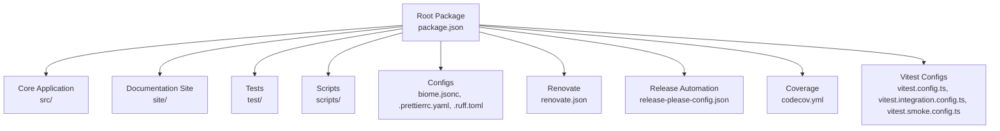
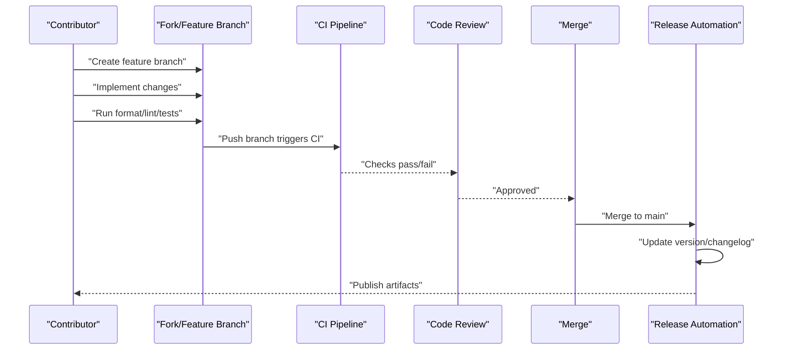
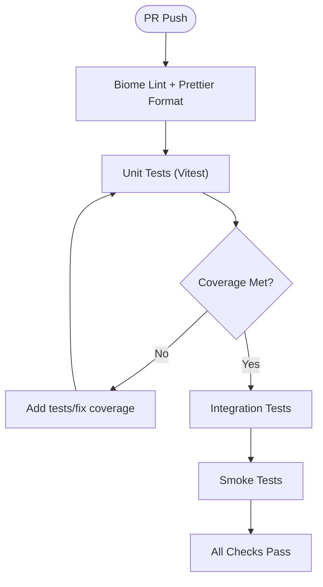
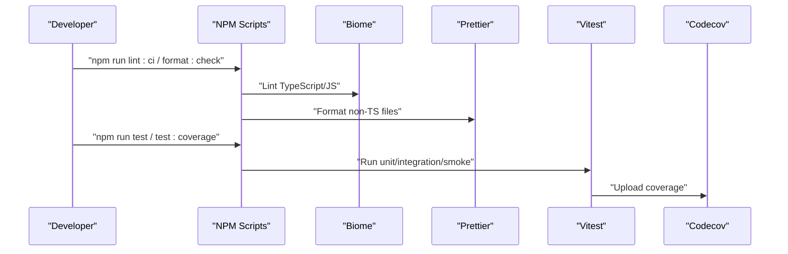
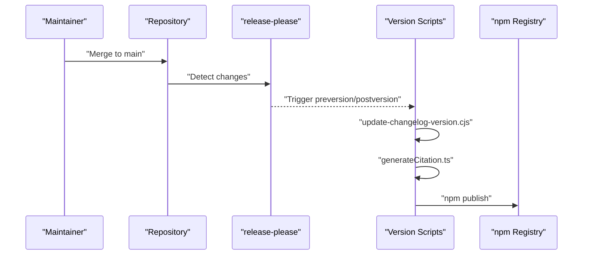
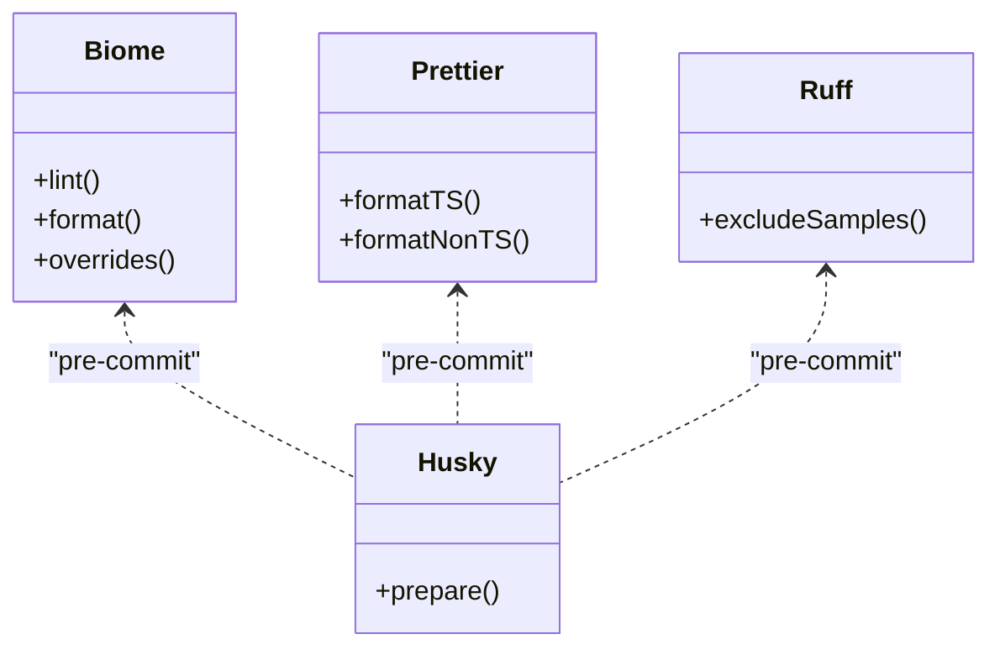
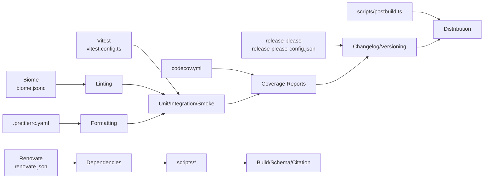

# Contribution Guidelines

<cite>
**Referenced Files in This Document**
- [CONTRIBUTING.md](file://CONTRIBUTING.md)
- [CODE_OF_CONDUCT.md](file://CODE_OF_CONDUCT.md)
- [SECURITY.md](file://SECURITY.md)
- [package.json](file://package.json)
- [biome.jsonc](file://biome.jsonc)
- [.prettierrc.yaml](file://.prettierrc.yaml)
- [.ruff.toml](file://.ruff.toml)
- [renovate.json](file://renovate.json)
- [release-please-config.json](file://release-please-config.json)
- [.release-please-manifest.json](file://.release-please-manifest.json)
- [codecov.yml](file://codecov.yml)
- [vitest.config.ts](file://vitest.config.ts)
- [vitest.integration.config.ts](file://vitest.integration.config.ts)
- [vitest.smoke.config.ts](file://vitest.smoke.config.ts)
- [vitest.setup.ts](file://vitest.setup.ts)
- [scripts/update-changelog-version.cjs](file://scripts/update-changelog-version.cjs)
- [scripts/generateCitation.ts](file://scripts/generateCitation.ts)
- [scripts/generateJsonSchema.ts](file://scripts/generateJsonSchema.ts)
- [scripts/postbuild.ts](file://scripts/postbuild.ts)
- [README.md](file://README.md)
</cite>

## Table of Contents
1. [Introduction](#introduction)
2. [Project Structure](#project-structure)
3. [Core Components](#core-components)
4. [Architecture Overview](#architecture-overview)
5. [Detailed Component Analysis](#detailed-component-analysis)
6. [Dependency Analysis](#dependency-analysis)
7. [Performance Considerations](#performance-considerations)
8. [Troubleshooting Guide](#troubleshooting-guide)
9. [Conclusion](#conclusion)
10. [Appendices](#appendices)

## Introduction
This document provides comprehensive contribution guidelines for PromptFoo development. It covers the development workflow (forking, branching, commits, pull requests), code review and quality gates, continuous integration and automated testing, release and versioning, coding standards and formatting, issue and feature processes, documentation and example contributions, community plugin development, and community engagement policies including code of conduct and enforcement.

## Project Structure
PromptFoo is a monorepo with multiple workspaces and a rich automation setup:
- Root workspace defines Node.js tooling, scripts, and engines.
- Workspaces include the core application and the documentation site.
- Testing is powered by Vitest with multiple configurations for unit, integration, and smoke tests.
- Formatting and linting are enforced via Biome and Prettier.
- Dependency updates are managed by Renovate with staged rollouts.
- Release automation uses release-please with a changelog generator and version bumping scripts.

**Diagram sources**
- [package.json:19-22](file://package.json#L19-L22)
- [package.json:38-85](file://package.json#L38-L85)
- [biome.jsonc:1-347](file://biome.jsonc#L1-L347)
- [.prettierrc.yaml:1-12](file://.prettierrc.yaml#L1-L12)
- [.ruff.toml:1-4](file://.ruff.toml#L1-L4)
- [renovate.json:1-333](file://renovate.json#L1-L333)
- [release-please-config.json:1-16](file://release-please-config.json#L1-L16)
- [codecov.yml:1-58](file://codecov.yml#L1-L58)
- [vitest.config.ts:1-71](file://vitest.config.ts#L1-L71)
- [vitest.integration.config.ts:1-49](file://vitest.integration.config.ts#L1-L49)
- [vitest.smoke.config.ts:1-32](file://vitest.smoke.config.ts#L1-L32)

**Section sources**
- [package.json:19-22](file://package.json#L19-L22)
- [package.json:38-85](file://package.json#L38-L85)

## Core Components
- Development workflow: Fork, branch, commit, PR, review, merge.
- Commit message conventions: Follow semantic prefixes and concise descriptions.
- Pull request process: Include tests, documentation updates, and changelog entries where applicable.
- Code review: Require at least one maintainer approval; ensure passing CI and coverage thresholds.
- Quality gates: Lint/format checks, unit tests, integration tests, smoke tests, and coverage targets.
- Continuous integration: Automated linting, formatting, unit tests, integration tests, and coverage reporting.
- Deployment: Release automation via release-please and version bump scripts; publication handled by npm scripts.
- Coding standards: Biome for JavaScript/TypeScript linting and formatting; Prettier for non-TypeScript files; Ruff for Python examples.
- Issue reporting: Use GitHub issues; sensitive matters via security contact.
- Feature requests: Use GitHub issues with appropriate labels and templates.
- Community engagement: Follow the Code of Conduct; report issues via Discord or email.

**Section sources**
- [CONTRIBUTING.md:1-10](file://CONTRIBUTING.md#L1-L10)
- [CODE_OF_CONDUCT.md:1-96](file://CODE_OF_CONDUCT.md#L1-L96)
- [SECURITY.md:1-100](file://SECURITY.md#L1-L100)
- [package.json:38-85](file://package.json#L38-L85)
- [biome.jsonc:1-347](file://biome.jsonc#L1-L347)
- [.prettierrc.yaml:1-12](file://.prettierrc.yaml#L1-L12)
- [.ruff.toml:1-4](file://.ruff.toml#L1-L4)
- [codecov.yml:1-58](file://codecov.yml#L1-L58)

## Architecture Overview
The contribution lifecycle integrates development, quality gates, and release automation.

**Diagram sources**
- [package.json:38-85](file://package.json#L38-L85)
- [codecov.yml:1-58](file://codecov.yml#L1-L58)
- [release-please-config.json:1-16](file://release-please-config.json#L1-L16)
- [scripts/update-changelog-version.cjs](file://scripts/update-changelog-version.cjs)

## Detailed Component Analysis

### Development Workflow and Git Conventions
- Fork the repository and create a feature branch from the latest main.
- Keep commits focused and use conventional prefixes (e.g., feat:, fix:, chore:, docs:).
- Reference related issues in commit messages (e.g., Fixes #123).
- Rebase onto main before opening a pull request to keep history linear.

Quality gates enforced by CI:
- Lint and format checks for changed files.
- Unit tests and coverage thresholds.
- Optional integration and smoke tests depending on changes.

**Section sources**
- [CONTRIBUTING.md:1-10](file://CONTRIBUTING.md#L1-L10)
- [package.json:54-68](file://package.json#L54-L68)
- [codecov.yml:4-17](file://codecov.yml#L4-L17)

### Pull Request Process and Code Review
- Open a pull request targeting main with a clear description and linked issues.
- Ensure all CI checks pass, including lint, format, unit tests, and coverage.
- Include documentation updates and changelog entries when applicable.
- Address reviewer feedback promptly; avoid force-pushing once review starts.

Review criteria:
- Code correctness and adherence to standards.
- Test coverage and regression prevention.
- Security considerations for code execution contexts.

**Section sources**
- [CODE_OF_CONDUCT.md:42-48](file://CODE_OF_CONDUCT.md#L42-L48)
- [SECURITY.md:7-11](file://SECURITY.md#L7-L11)
- [codecov.yml:49-58](file://codecov.yml#L49-L58)

### Testing Requirements and Quality Gates
- Unit tests: Run via Vitest with random order and forked workers for isolation.
- Integration tests: Separate configuration with increased timeouts and memory.
- Smoke tests: Deterministic ordering for quick regressions.
- Coverage: Project-level target with patch-level minimum; ignore generated/test files.
- Setup: Global environment variables and mock API keys initialized in vitest.setup.ts.

**Diagram sources**
- [package.json:54-68](file://package.json#L54-L68)
- [vitest.config.ts:10-71](file://vitest.config.ts#L10-L71)
- [vitest.integration.config.ts:9-49](file://vitest.integration.config.ts#L9-L49)
- [vitest.smoke.config.ts:3-32](file://vitest.smoke.config.ts#L3-L32)
- [codecov.yml:4-17](file://codecov.yml#L4-L17)

**Section sources**
- [vitest.config.ts:10-71](file://vitest.config.ts#L10-L71)
- [vitest.integration.config.ts:9-49](file://vitest.integration.config.ts#L9-L49)
- [vitest.smoke.config.ts:3-32](file://vitest.smoke.config.ts#L3-L32)
- [vitest.setup.ts:11-54](file://vitest.setup.ts#L11-L54)
- [codecov.yml:49-58](file://codecov.yml#L49-L58)

### Continuous Integration and Automated Testing
- Scripts orchestrate Biome linting, Prettier formatting, and Vitest runs.
- CI enforces lint/format and test matrices across Node.js versions.
- Coverage reporting is uploaded to Codecov with component flags.

**Diagram sources**
- [package.json:54-68](file://package.json#L54-L68)
- [biome.jsonc:1-347](file://biome.jsonc#L1-L347)
- [.prettierrc.yaml:1-12](file://.prettierrc.yaml#L1-L12)
- [codecov.yml:1-58](file://codecov.yml#L1-L58)

**Section sources**
- [package.json:54-68](file://package.json#L54-L68)
- [codecov.yml:1-58](file://codecov.yml#L1-L58)

### Deployment and Release Procedures
- Versioning: release-please tracks versions and updates package.json and CHANGELOG.md.
- Changelog: Automated generation and validation via scripts.
- Citation metadata: Regenerated on version bump.
- Publishing: prepublishOnly validates environment and builds before publish.

**Diagram sources**
- [release-please-config.json:1-16](file://release-please-config.json#L1-L16)
- [.release-please-manifest.json:1-4](file://.release-please-manifest.json#L1-L4)
- [scripts/update-changelog-version.cjs](file://scripts/update-changelog-version.cjs)
- [scripts/generateCitation.ts](file://scripts/generateCitation.ts)
- [package.json:68-71](file://package.json#L68-L71)

**Section sources**
- [release-please-config.json:1-16](file://release-please-config.json#L1-L16)
- [.release-please-manifest.json:1-4](file://.release-please-manifest.json#L1-L4)
- [scripts/update-changelog-version.cjs](file://scripts/update-changelog-version.cjs)
- [scripts/generateCitation.ts](file://scripts/generateCitation.ts)
- [package.json:68-71](file://package.json#L68-L71)

### Coding Standards, Linting, and Formatting
- JavaScript/TypeScript: Biome linter/formatter with strict rules and custom overrides for examples and tests.
- Non-TypeScript: Prettier formatting with trailing commas, single quotes, and print width 100.
- Python examples: Ruff excludes demo/sample projects.
- Pre-commit hooks: Husky prepares Git hooks automatically.

**Diagram sources**
- [biome.jsonc:1-347](file://biome.jsonc#L1-L347)
- [.prettierrc.yaml:1-12](file://.prettierrc.yaml#L1-L12)
- [.ruff.toml:1-4](file://.ruff.toml#L1-L4)
- [package.json:85](file://package.json#L85)

**Section sources**
- [biome.jsonc:1-347](file://biome.jsonc#L1-L347)
- [.prettierrc.yaml:1-12](file://.prettierrc.yaml#L1-L12)
- [.ruff.toml:1-4](file://.ruff.toml#L1-L4)
- [package.json:85](file://package.json#L85)

### Dependency Management and Updates
- Renovate automates dependency bumps with grouped updates and staged rollouts.
- Runtime dependencies wait 5 days; dev/optional dependencies wait 2 days.
- Major Node.js version updates are disabled to preserve stability.
- Provider-specific packages are grouped and updated on weekdays to reduce noise.

**Section sources**
- [renovate.json:1-333](file://renovate.json#L1-L333)
- [CONTRIBUTING.md:5-10](file://CONTRIBUTING.md#L5-L10)

### Issue Reporting, Feature Requests, and Security
- Issues: Use GitHub Issues with templates; label appropriately.
- Feature requests: Open an issue with “enhancement” label and acceptance criteria.
- Security: Report privately via GitHub Security Advisories or email; do not open public issues for vulnerabilities.
- Code of Conduct: Follow the Contributor Covenant; report violations via Discord or email.

**Section sources**
- [SECURITY.md:56-99](file://SECURITY.md#L56-L99)
- [CODE_OF_CONDUCT.md:42-48](file://CODE_OF_CONDUCT.md#L42-L48)

### Documentation Contributions
- Documentation site is a separate workspace; update site/docs and run local preview.
- Schema generation and JSON schema updates are automated via scripts.
- Ensure docs align with code changes and include examples where relevant.

**Section sources**
- [package.json:19-22](file://package.json#L19-L22)
- [package.json:58](file://package.json#L58)
- [scripts/generateJsonSchema.ts](file://scripts/generateJsonSchema.ts)

### Example Submissions and Community Plugins
- Examples live under examples/; follow existing patterns and include READMEs.
- Community plugins are supported; ensure they are self-contained and documented.
- Use promptfooconfig.yaml for configuration and include test cases where applicable.

**Section sources**
- [README.md](file://README.md)

### Diversity and Inclusion, Code of Conduct, and Recognition
- Promote an inclusive, respectful community aligned with the Contributor Covenant.
- Enforcement ladder includes warnings, limited activity, temporary suspension, and permanent bans.
- Recognition: Contributors are acknowledged in releases and community channels.

**Section sources**
- [CODE_OF_CONDUCT.md:1-96](file://CODE_OF_CONDUCT.md#L1-L96)

## Dependency Analysis
The repository’s automation relies on coordinated tooling and configuration.

**Diagram sources**
- [renovate.json:1-333](file://renovate.json#L1-L333)
- [biome.jsonc:1-347](file://biome.jsonc#L1-L347)
- [.prettierrc.yaml:1-12](file://.prettierrc.yaml#L1-L12)
- [vitest.config.ts:10-71](file://vitest.config.ts#L10-L71)
- [codecov.yml:1-58](file://codecov.yml#L1-L58)
- [release-please-config.json:1-16](file://release-please-config.json#L1-L16)
- [scripts/update-changelog-version.cjs](file://scripts/update-changelog-version.cjs)
- [scripts/generateCitation.ts](file://scripts/generateCitation.ts)
- [scripts/generateJsonSchema.ts](file://scripts/generateJsonSchema.ts)
- [scripts/postbuild.ts](file://scripts/postbuild.ts)

**Section sources**
- [renovate.json:1-333](file://renovate.json#L1-L333)
- [biome.jsonc:1-347](file://biome.jsonc#L1-L347)
- [.prettierrc.yaml:1-12](file://.prettierrc.yaml#L1-L12)
- [vitest.config.ts:10-71](file://vitest.config.ts#L10-L71)
- [codecov.yml:1-58](file://codecov.yml#L1-L58)
- [release-please-config.json:1-16](file://release-please-config.json#L1-L16)

## Performance Considerations
- Use forked workers in Vitest to avoid memory leaks and improve isolation.
- Limit concurrency and tune worker counts based on CPU cores.
- Prefer deterministic smoke tests and randomized unit tests to catch edge cases efficiently.

[No sources needed since this section provides general guidance]

## Troubleshooting Guide
- Lint/format failures: Run the format and lint scripts locally before pushing.
- Test failures: Use Vitest’s built-in flags to debug (e.g., disable randomization for specific failures).
- Coverage gaps: Add targeted tests and verify ignore patterns in codecov.yml.
- Dependency conflicts: Allow Renovate to propose grouped updates; avoid manual bumps unless urgent.

**Section sources**
- [package.json:54-68](file://package.json#L54-L68)
- [vitest.config.ts:24-26](file://vitest.config.ts#L24-L26)
- [codecov.yml:24-36](file://codecov.yml#L24-L36)
- [renovate.json:254-271](file://renovate.json#L254-L271)

## Conclusion
PromptFoo’s contribution process emphasizes collaboration, quality, and safety. By following the development workflow, adhering to coding standards, meeting quality gates, and participating in the community with respect, contributors help maintain a robust, secure, and inclusive project.

[No sources needed since this section summarizes without analyzing specific files]

## Appendices

### Appendix A: Quick Reference
- Development: Fork → branch → implement → format/lint → test → PR.
- Review: At least one maintainer approval; passing CI and coverage.
- Releases: Automated via release-please; version bump scripts handle changelog and citations.
- Security: Private reporting via advisories or email.
- CoC: Follow the Code of Conduct; report violations via Discord or email.

**Section sources**
- [CONTRIBUTING.md:1-10](file://CONTRIBUTING.md#L1-L10)
- [SECURITY.md:56-99](file://SECURITY.md#L56-L99)
- [CODE_OF_CONDUCT.md:42-48](file://CODE_OF_CONDUCT.md#L42-L48)
- [release-please-config.json:1-16](file://release-please-config.json#L1-L16)