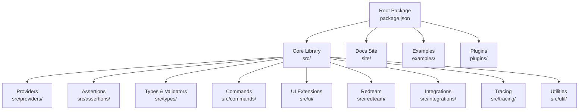
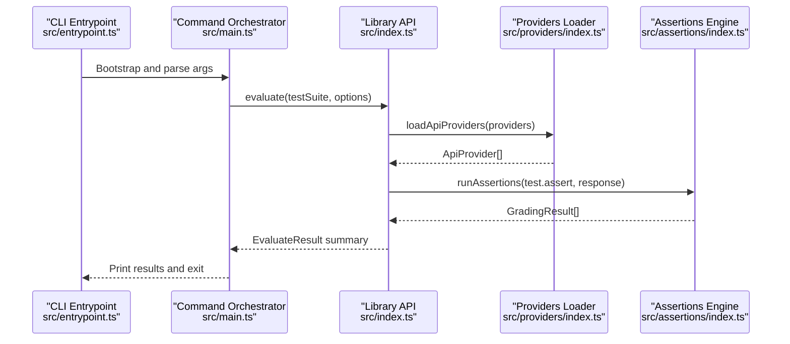
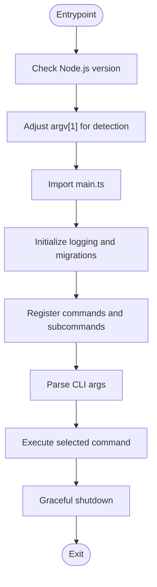
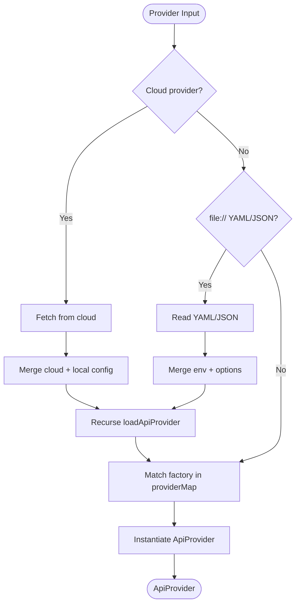
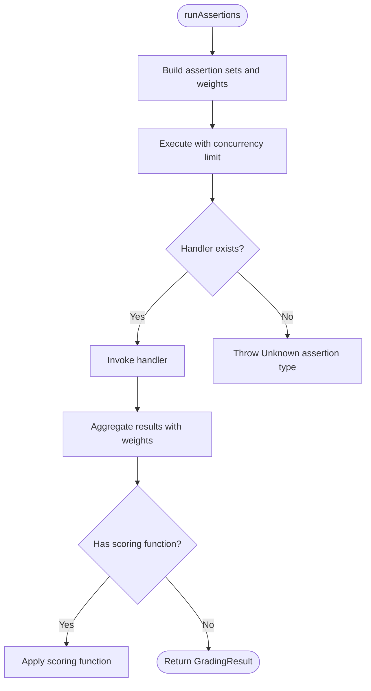
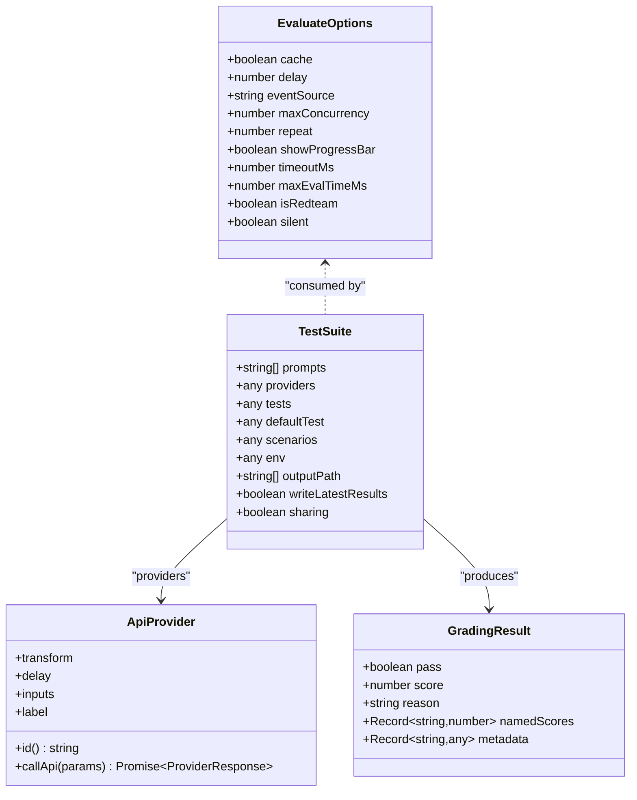
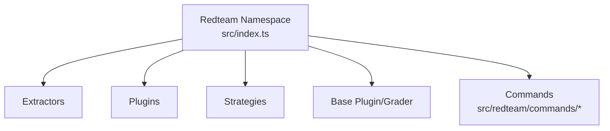
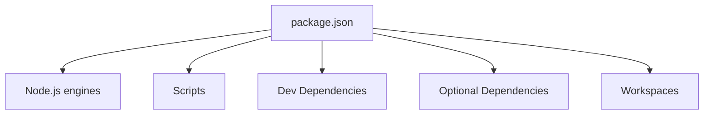

# Development & Extension

<cite>
**Referenced Files in This Document**
- [package.json](file://package.json)
- [README.md](file://README.md)
- [CONTRIBUTING.md](file://CONTRIBUTING.md)
- [src/index.ts](file://src/index.ts)
- [src/main.ts](file://src/main.ts)
- [src/entrypoint.ts](file://src/entrypoint.ts)
- [src/providers/index.ts](file://src/providers/index.ts)
- [src/assertions/index.ts](file://src/assertions/index.ts)
- [src/types/index.ts](file://src/types/index.ts)
- [vitest.config.ts](file://vitest.config.ts)
- [vitest.integration.config.ts](file://vitest.integration.config.ts)
- [vitest.smoke.config.ts](file://vitest.smoke.config.ts)
- [drizzle.config.ts](file://drizzle.config.ts)
- [scripts/postbuild.ts](file://scripts/postbuild.ts)
- [scripts/generateJsonSchema.ts](file://scripts/generateJsonSchema.ts)
- [scripts/generateCitation.ts](file://scripts/generateCitation.ts)
- [site/docusaurus.config.ts](file://site/docusaurus.config.ts)
- [.github/workflows](file://.github/workflows)
</cite>

## Table of Contents
1. [Introduction](#introduction)
2. [Project Structure](#project-structure)
3. [Core Components](#core-components)
4. [Architecture Overview](#architecture-overview)
5. [Detailed Component Analysis](#detailed-component-analysis)
6. [Dependency Analysis](#dependency-analysis)
7. [Performance Considerations](#performance-considerations)
8. [Troubleshooting Guide](#troubleshooting-guide)
9. [Conclusion](#conclusion)
10. [Appendices](#appendices)

## Introduction
This document provides comprehensive development and extension guidance for PromptFoo. It covers the TypeScript codebase architecture, development setup, plugin systems (providers, assertions, UI), API reference for programmatic integration, contribution guidelines, monorepo structure, build system, testing strategies, CI/QA processes, debugging and profiling tips, performance optimization, and community contribution workflows.

PromptFoo is a CLI and Node.js library for evaluating and red-teaming LLM applications. It supports provider plugins (LLM APIs and custom functions), assertion plugins (grading and checks), and UI extensions. The project emphasizes developer productivity, privacy, flexibility, and extensibility.

## Project Structure
PromptFoo is organized as a monorepo with:
- Root package and scripts for building, testing, linting, and publishing
- Core library under src/ implementing CLI, evaluation engine, providers, assertions, types, and utilities
- Site documentation under site/
- Example configurations and demonstrations under examples/
- Plugins under plugins/

**Diagram sources**
- [package.json:19-22](file://package.json#L19-L22)
- [package.json:31-33](file://package.json#L31-L33)

**Section sources**
- [package.json:19-22](file://package.json#L19-L22)
- [package.json:31-33](file://package.json#L31-L33)

## Core Components
- CLI entrypoint and main command orchestration
- Provider loading and resolution (built-in and custom)
- Assertion engine and grading pipeline
- Evaluation loop and result aggregation
- Red teaming framework and plugins
- Programmatic Node.js API for embedding

Key responsibilities:
- src/entrypoint.ts validates Node.js version and bootstraps src/main.ts
- src/main.ts sets up commands, telemetry, migrations, and graceful shutdown
- src/index.ts exposes the Node.js API for programmatic evaluation
- src/providers/index.ts loads and resolves providers from strings, files, or functions
- src/assertions/index.ts executes assertion handlers and model-graded checks
- src/types/index.ts defines TypeScript interfaces, schemas, and shared types

**Section sources**
- [src/entrypoint.ts:1-50](file://src/entrypoint.ts#L1-L50)
- [src/main.ts:169-256](file://src/main.ts#L169-L256)
- [src/index.ts:41-178](file://src/index.ts#L41-L178)
- [src/providers/index.ts:31-177](file://src/providers/index.ts#L31-L177)
- [src/assertions/index.ts:252-512](file://src/assertions/index.ts#L252-L512)
- [src/types/index.ts:62-111](file://src/types/index.ts#L62-L111)

## Architecture Overview
High-level flow:
- CLI initializes, loads default config, registers commands, and parses arguments
- Providers are loaded and resolved into ApiProvider instances
- Prompts and test cases are processed and combined with provider configurations
- Evaluation runs concurrently with rate-limiting and caching controls
- Assertions are executed; results aggregated into summaries and tables
- Optional sharing and output writing

**Diagram sources**
- [src/entrypoint.ts:42-46](file://src/entrypoint.ts#L42-L46)
- [src/main.ts:198-256](file://src/main.ts#L198-L256)
- [src/index.ts:41-178](file://src/index.ts#L41-L178)
- [src/providers/index.ts:345-417](file://src/providers/index.ts#L345-L417)
- [src/assertions/index.ts:514-617](file://src/assertions/index.ts#L514-L617)

## Detailed Component Analysis

### CLI Entrypoint and Main Orchestration
- Version gating ensures compatibility with Node.js runtime
- Main orchestrates commands, telemetry, migrations, and graceful shutdown
- Common options (verbose, env-file) are added recursively to all commands
- Post-action reporting prints error logs and debug logs

**Diagram sources**
- [src/entrypoint.ts:24-46](file://src/entrypoint.ts#L24-L46)
- [src/main.ts:169-256](file://src/main.ts#L169-L256)
- [src/main.ts:262-338](file://src/main.ts#L262-L338)

**Section sources**
- [src/entrypoint.ts:11-46](file://src/entrypoint.ts#L11-L46)
- [src/main.ts:124-167](file://src/main.ts#L124-L167)
- [src/main.ts:247-253](file://src/main.ts#L247-L253)

### Provider System (Extending LLM Backends)
Providers are loaded from:
- Strings (e.g., OpenAI, Anthropic, Azure)
- Files (YAML/JSON) containing provider definitions
- Functions (custom provider implementations)
- Cloud-linked provider references

Resolution logic:
- Render environment templates at load time
- Merge cloud provider configs with local overrides
- Support labels, transforms, delays, and per-provider env overrides

**Diagram sources**
- [src/providers/index.ts:31-177](file://src/providers/index.ts#L31-L177)
- [src/providers/index.ts:345-417](file://src/providers/index.ts#L345-L417)

**Section sources**
- [src/providers/index.ts:31-177](file://src/providers/index.ts#L31-L177)
- [src/providers/index.ts:345-417](file://src/providers/index.ts#L345-L417)

### Assertion Engine (Grading and Checks)
- Central handler map routes assertion types to implementations
- Supports model-graded assertions (LLM rubrics, factuality, relevance)
- Supports external scripts (JavaScript, Python, Ruby) for custom logic
- Concurrency-limited execution with weighted aggregation
- Special handling for select-best and max-score assertions

**Diagram sources**
- [src/assertions/index.ts:514-617](file://src/assertions/index.ts#L514-L617)
- [src/assertions/index.ts:117-200](file://src/assertions/index.ts#L117-L200)

**Section sources**
- [src/assertions/index.ts:117-200](file://src/assertions/index.ts#L117-L200)
- [src/assertions/index.ts:252-512](file://src/assertions/index.ts#L252-L512)
- [src/assertions/index.ts:514-617](file://src/assertions/index.ts#L514-L617)

### Programmatic API Reference
The Node.js package exposes:
- evaluate(testSuite, options) to run evaluations programmatically
- loadApiProvider for loading a single provider
- assertions and guardrails utilities
- redteam namespace for red teaming operations

Interfaces and types:
- EvaluateOptions, EvaluateTestSuite, TestSuite, Assertion, ProviderResponse, ApiProvider, and more are defined in src/types/index.ts

**Diagram sources**
- [src/types/index.ts:213-257](file://src/types/index.ts#L213-L257)
- [src/types/index.ts:325-346](file://src/types/index.ts#L325-L346)
- [src/index.ts:41-178](file://src/index.ts#L41-L178)

**Section sources**
- [src/index.ts:41-178](file://src/index.ts#L41-L178)
- [src/types/index.ts:213-257](file://src/types/index.ts#L213-L257)
- [src/types/index.ts:325-346](file://src/types/index.ts#L325-L346)

### Red Teaming Framework
- Extractors for entities, MCP tools, and system purpose
- Plugins and strategies for adversarial testing
- Base plugin and grader abstractions
- Commands for generate, run, report, and setup

**Diagram sources**
- [src/index.ts:180-195](file://src/index.ts#L180-L195)

**Section sources**
- [src/index.ts:180-195](file://src/index.ts#L180-L195)

### UI Extensions
- UI extensions are supported via the extension hook context types exported from the library API
- Hooks include before/after all and each phases for lifecycle integration

**Section sources**
- [src/index.ts:32-39](file://src/index.ts#L32-L39)

## Dependency Analysis
- Node.js version requirement enforced at startup
- Workspaces define app and site subprojects
- Scripts coordinate building, testing, linting, and migrations
- Dev and optional dependencies include provider SDKs, testing frameworks, and tooling

**Diagram sources**
- [package.json:31-33](file://package.json#L31-L33)
- [package.json:38-85](file://package.json#L38-L85)
- [package.json:115-214](file://package.json#L115-L214)
- [package.json:19-22](file://package.json#L19-L22)

**Section sources**
- [package.json:31-33](file://package.json#L31-L33)
- [package.json:38-85](file://package.json#L38-L85)
- [package.json:115-214](file://package.json#L115-L214)
- [package.json:19-22](file://package.json#L19-L22)

## Performance Considerations
- Concurrency control: EvaluateOptions.maxConcurrency limits simultaneous provider calls
- Caching: cache.disableCache() can be toggled; repeated runs leverage cache by default
- Rate limiting: RateLimitRegistryRef wraps provider calls with adaptive control
- Streaming and timeouts: ProviderResponse streaming and EvaluateOptions.timeoutMs/maxEvalTimeMs protect long-running calls
- Memory and CPU: tsdown build and increased Node heap memory are configured in scripts

**Section sources**
- [src/types/index.ts:213-257](file://src/types/index.ts#L213-L257)
- [src/index.ts:126-128](file://src/index.ts#L126-L128)

## Troubleshooting Guide
- Verbose logging: Use --verbose to enable debug logs
- Environment files: --env-file/--env-path supports multiple files and comma-separated lists
- Error reporting: postAction callback prints error and debug logs
- Graceful shutdown: shutdownGracefully ensures cleanup with timeouts
- Node.js version: Entrypoint enforces minimum Node.js version and exits with guidance

**Section sources**
- [src/main.ts:124-167](file://src/main.ts#L124-L167)
- [src/main.ts:247-253](file://src/main.ts#L247-L253)
- [src/main.ts:262-338](file://src/main.ts#L262-L338)
- [src/entrypoint.ts:24-40](file://src/entrypoint.ts#L24-L40)

## Conclusion
PromptFoo offers a robust, extensible framework for LLM evaluation and red teaming. Its provider and assertion plugin systems, rich Node.js API, and comprehensive CLI enable flexible, scalable workflows. The monorepo structure, strong typing, and CI/CD tooling support ongoing development and quality assurance.

## Appendices

### Development Setup
- Install dependencies and run scripts defined in package.json
- Use dev scripts for watch mode, server, and app development
- Build with tsdown and tsc; postbuild script finalizes artifacts

**Section sources**
- [package.json:38-85](file://package.json#L38-L85)
- [scripts/postbuild.ts](file://scripts/postbuild.ts)

### Testing Strategies
- Unit tests: vitest with coverage
- Integration tests: dedicated integration config
- Smoke tests: dedicated smoke config
- CI workflows automate linting, formatting, and test runs

**Section sources**
- [vitest.config.ts](file://vitest.config.ts)
- [vitest.integration.config.ts](file://vitest.integration.config.ts)
- [vitest.smoke.config.ts](file://vitest.smoke.config.ts)
- [.github/workflows](file://.github/workflows)

### Continuous Integration and Quality Assurance
- Biome linting and Prettier formatting
- Knip for unused dependencies
- Drizzle migrations and studio
- JSON schema generation for site

**Section sources**
- [package.json:54-65](file://package.json#L54-L65)
- [package.json:59](file://package.json#L59)
- [drizzle.config.ts](file://drizzle.config.ts)
- [scripts/generateJsonSchema.ts](file://scripts/generateJsonSchema.ts)

### Contribution Guidelines
- Refer to the contributing guide for change procedures and dependency updates
- Dependency updates are managed by Renovate with staged PRs

**Section sources**
- [CONTRIBUTING.md:1-10](file://CONTRIBUTING.md#L1-L10)

### Community and Documentation
- Website and docs site powered by Docusaurus
- Community links and badges in README

**Section sources**
- [README.md:1-97](file://README.md#L1-L97)
- [site/docusaurus.config.ts](file://site/docusaurus.config.ts)

### Examples and Templates
- Extensive examples under examples/ demonstrate provider configs, assertions, and integrations
- Use examples to bootstrap custom providers, assertions, and UI extensions

**Section sources**
- [README.md:23-46](file://README.md#L23-L46)

### Debugging, Profiling, and Performance Tips
- Enable verbose logging via CLI
- Use EvaluateOptions.timeoutMs and maxEvalTimeMs to bound evaluation time
- Tune maxConcurrency for throughput vs. resource contention
- Inspect ProviderResponse metadata and traces for diagnostics

**Section sources**
- [src/main.ts:124-167](file://src/main.ts#L124-L167)
- [src/types/index.ts:213-257](file://src/types/index.ts#L213-L257)

### API Reference Highlights
- Evaluate options and schemas
- Assertion types and value handling
- Provider interfaces and response shapes

**Section sources**
- [src/types/index.ts:62-111](file://src/types/index.ts#L62-L111)
- [src/types/index.ts:514-598](file://src/types/index.ts#L514-L598)
- [src/types/index.ts:213-257](file://src/types/index.ts#L213-L257)