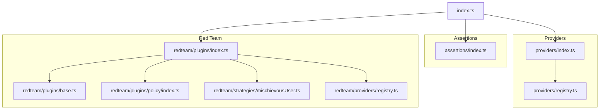
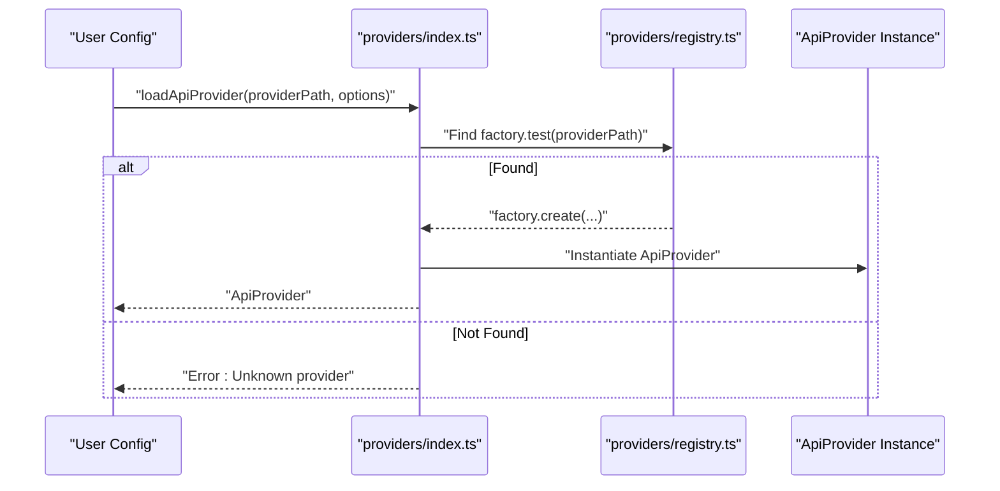
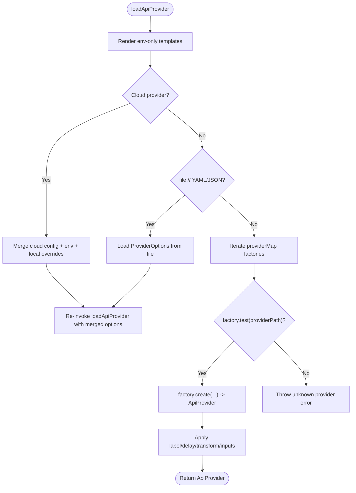
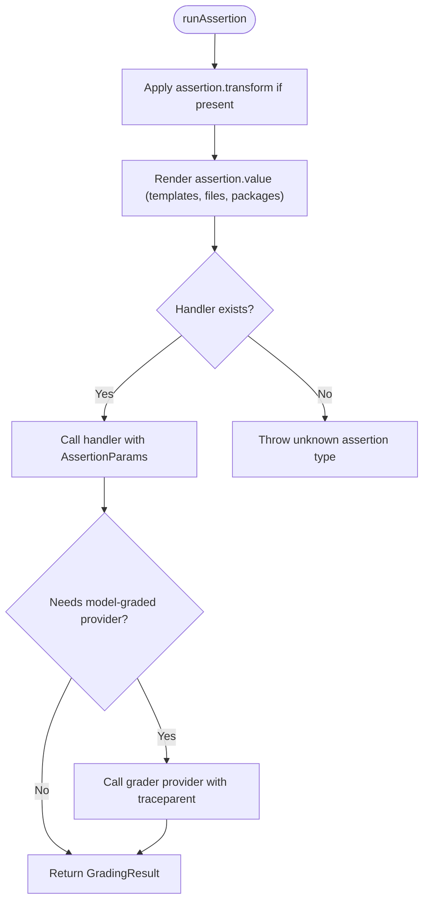
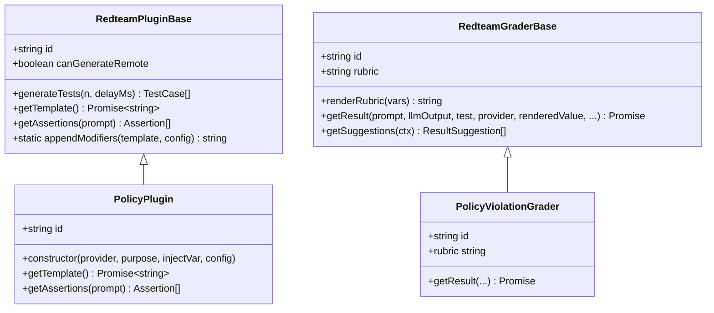
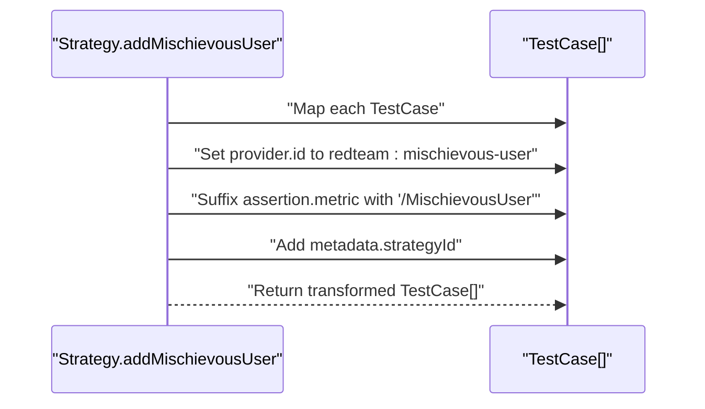
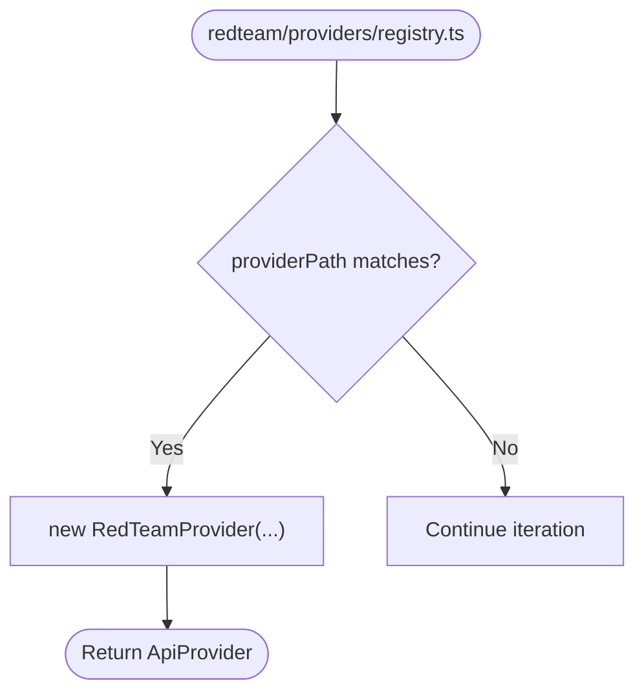
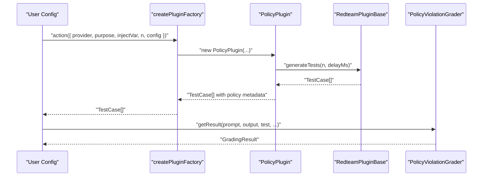
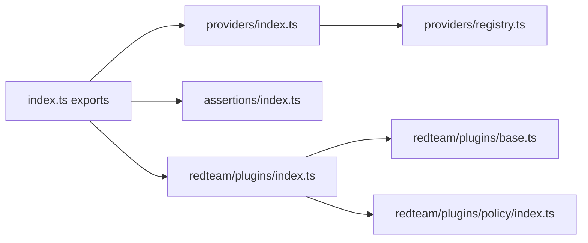

# Plugin Development

<cite>
**Referenced Files in This Document**
- [index.ts](file://src/index.ts)
- [package.json](file://package.json)
- [providers/index.ts](file://src/providers/index.ts)
- [providers/registry.ts](file://src/providers/registry.ts)
- [assertions/index.ts](file://src/assertions/index.ts)
- [redteam/plugins/index.ts](file://src/redteam/plugins/index.ts)
- [redteam/plugins/base.ts](file://src/redteam/plugins/base.ts)
- [redteam/plugins/policy/index.ts](file://src/redteam/plugins/policy/index.ts)
- [redteam/strategies/mischievousUser.ts](file://src/redteam/strategies/mischievousUser.ts)
- [redteam/providers/registry.ts](file://src/redteam/providers/registry.ts)
- [customProvider.js](file://examples/custom-provider/customProvider.js)
</cite>

## Table of Contents
1. [Introduction](#introduction)
2. [Project Structure](#project-structure)
3. [Core Components](#core-components)
4. [Architecture Overview](#architecture-overview)
5. [Detailed Component Analysis](#detailed-component-analysis)
6. [Dependency Analysis](#dependency-analysis)
7. [Performance Considerations](#performance-considerations)
8. [Troubleshooting Guide](#troubleshooting-guide)
9. [Conclusion](#conclusion)
10. [Appendices](#appendices)

## Introduction
This document explains how to develop plugins for PromptFoo, covering the plugin architecture and extension points for:
- Custom providers
- Assertion plugins
- Red team plugins

It details the plugin registration system, interface contracts, lifecycle management, and provides step-by-step guides for building robust plugins with authentication, rate limiting, and error handling. It also covers packaging, distribution, versioning, testing, debugging, and performance optimization, with examples from existing plugins such as the Policy plugin and Claude Agent SDK integration patterns.

## Project Structure
PromptFoo organizes plugin-related functionality across three primary subsystems:
- Providers: external model/API integrations and custom provider implementations
- Assertions: scoring and validation logic for evaluating model outputs
- Red team: adversarial testing plugins and strategies

**Diagram sources**
- [index.ts:180-195](file://src/index.ts#L180-L195)
- [providers/index.ts:31-177](file://src/providers/index.ts#L31-L177)
- [providers/registry.ts:143-1759](file://src/providers/registry.ts#L143-L1759)
- [assertions/index.ts:117-200](file://src/assertions/index.ts#L117-L200)
- [redteam/plugins/index.ts:199-420](file://src/redteam/plugins/index.ts#L199-L420)
- [redteam/plugins/base.ts:33-296](file://src/redteam/plugins/base.ts#L33-L296)
- [redteam/plugins/policy/index.ts:20-130](file://src/redteam/plugins/policy/index.ts#L20-L130)
- [redteam/strategies/mischievousUser.ts:3-26](file://src/redteam/strategies/mischievousUser.ts#L3-L26)
- [redteam/providers/registry.ts:1453-1496](file://src/redteam/providers/registry.ts#L1453-L1496)

**Section sources**
- [index.ts:180-195](file://src/index.ts#L180-L195)
- [providers/index.ts:31-177](file://src/providers/index.ts#L31-L177)
- [assertions/index.ts:117-200](file://src/assertions/index.ts#L117-L200)
- [redteam/plugins/index.ts:199-420](file://src/redteam/plugins/index.ts#L199-L420)

## Core Components
- Provider registration and loading: Providers are identified by a path string and resolved through a factory registry. The loader supports file references, cloud-linked providers, and function-based providers.
- Assertion pipeline: Assertions are mapped to handlers, support scripting, and integrate with model-graded evaluators.
- Red team plugin framework: Plugins generate test cases and assertions, with optional remote generation and pluggable graders.

Key responsibilities:
- Provider lifecycle: instantiate, transform, delay, inputs, and label handling
- Assertion lifecycle: transform output, render values, call model-graded providers, and aggregate scores
- Red team lifecycle: generate prompts, convert to test cases, attach assertions, and grade outputs

**Section sources**
- [providers/index.ts:31-177](file://src/providers/index.ts#L31-L177)
- [providers/index.ts:345-417](file://src/providers/index.ts#L345-L417)
- [assertions/index.ts:252-512](file://src/assertions/index.ts#L252-L512)
- [redteam/plugins/base.ts:33-296](file://src/redteam/plugins/base.ts#L33-L296)

## Architecture Overview
The plugin system is built around a factory pattern and centralized registries. Providers are resolved via a providerMap of test/create functions. Assertions are dispatched to registered handlers. Red team plugins are instantiated via plugin factories and can optionally delegate generation to a remote service.

**Diagram sources**
- [providers/index.ts:31-177](file://src/providers/index.ts#L31-L177)
- [providers/registry.ts:143-1759](file://src/providers/registry.ts#L143-L1759)

**Section sources**
- [providers/index.ts:31-177](file://src/providers/index.ts#L31-L177)
- [providers/registry.ts:143-1759](file://src/providers/registry.ts#L143-L1759)

## Detailed Component Analysis

### Provider Registration and Lifecycle
Providers are loaded through a deterministic pipeline:
- Environment rendering and merging
- Cloud provider resolution and overrides
- File-based provider configs
- Factory-based instantiation
- Post-instantiation transformations (label, delay, transform, inputs)

**Diagram sources**
- [providers/index.ts:31-177](file://src/providers/index.ts#L31-L177)
- [providers/registry.ts:143-1759](file://src/providers/registry.ts#L143-L1759)

**Section sources**
- [providers/index.ts:31-177](file://src/providers/index.ts#L31-L177)
- [providers/index.ts:345-417](file://src/providers/index.ts#L345-L417)

### Custom Provider Development
Step-by-step guide to create a custom provider with authentication, rate limiting, and error handling:
1. Implement the ApiProvider interface:
   - Provide an id() method
   - Implement callApi(prompt) returning { output, tokenUsage?, cost?, metadata? }
2. Authentication:
   - Read secrets from environment variables
   - Attach Authorization headers or API keys to requests
3. Rate limiting:
   - Enforce per-minute limits using a simple counter or library
   - Optionally delay calls with a configurable delayMs
4. Error handling:
   - Normalize API errors into structured error responses
   - Distinguish transient vs permanent failures
5. Caching and timeouts:
   - Use the internal cache.fetchWithCache for retries and caching
   - Set reasonable request timeouts
6. Optional extras:
   - Support transform, delay, inputs, and label overrides from configuration

Example reference:
- [customProvider.js:1-57](file://examples/custom-provider/customProvider.js#L1-L57)

**Section sources**
- [customProvider.js:1-57](file://examples/custom-provider/customProvider.js#L1-L57)

### Assertion Plugin Development
Assertion plugins integrate into the assertions pipeline:
- Register a handler in the ASSERTION_HANDLERS map keyed by assertion type
- Implement runAssertion to:
  - Transform output if needed
  - Render assertion values (including file:// and package:// references)
  - Call model-graded providers when required
  - Aggregate results with weights and thresholds
- For red team assertions, route to handleRedteam and return appropriate GradingResult

**Diagram sources**
- [assertions/index.ts:252-512](file://src/assertions/index.ts#L252-L512)

**Section sources**
- [assertions/index.ts:117-200](file://src/assertions/index.ts#L117-L200)
- [assertions/index.ts:252-512](file://src/assertions/index.ts#L252-L512)

### Red Team Plugin Development
Red team plugins generate adversarial test cases and assertions:
- Extend RedteamPluginBase:
  - Define id, getTemplate(), getAssertions(prompt)
  - Optionally override getDefaultExcludedStrategies()
- Use generateTests(n, delayMs) to:
  - Render template with purpose, n, examples, and output format
  - Append modifiers via static appendModifiers
  - Retry with deduplication and sample final results
  - Convert prompts to test cases with vars and metadata
- Plugin factories:
  - Use createPluginFactory to register plugins with validation and remote generation support
  - Remote generation is gated by environment and health checks
- Graders:
  - Extend RedteamGraderBase to implement rubric rendering and getResult
  - Support plugin-specific guidance and grader examples

**Diagram sources**
- [redteam/plugins/base.ts:33-296](file://src/redteam/plugins/base.ts#L33-L296)
- [redteam/plugins/policy/index.ts:20-130](file://src/redteam/plugins/policy/index.ts#L20-L130)
- [redteam/plugins/policy/index.ts:132-200](file://src/redteam/plugins/policy/index.ts#L132-L200)

**Section sources**
- [redteam/plugins/base.ts:33-296](file://src/redteam/plugins/base.ts#L33-L296)
- [redteam/plugins/index.ts:199-420](file://src/redteam/plugins/index.ts#L199-L420)
- [redteam/plugins/policy/index.ts:20-130](file://src/redteam/plugins/policy/index.ts#L20-L130)
- [redteam/plugins/policy/index.ts:132-200](file://src/redteam/plugins/policy/index.ts#L132-L200)

### Red Team Strategy Integration Example
Strategies can wrap test cases generated by plugins, adding provider overrides, assertion metrics, and metadata. For example, mischievous user strategy augments test cases with a provider id and assertion metric suffix.

**Diagram sources**
- [redteam/strategies/mischievousUser.ts:3-26](file://src/redteam/strategies/mischievousUser.ts#L3-L26)

**Section sources**
- [redteam/strategies/mischievousUser.ts:3-26](file://src/redteam/strategies/mischievousUser.ts#L3-L26)

### Red Team Provider Registration
Red team providers are registered similarly to regular providers, enabling specialized red team workflows such as iterative or best-of-N strategies.

**Diagram sources**
- [redteam/providers/registry.ts:1453-1496](file://src/redteam/providers/registry.ts#L1453-L1496)

**Section sources**
- [redteam/providers/registry.ts:1453-1496](file://src/redteam/providers/registry.ts#L1453-L1496)

### Example: Policy Plugin
The Policy plugin demonstrates:
- Validation of policy configuration
- Template-driven prompt generation
- Assertion attachment with metric scoping
- Grading with rubric rendering and refusal handling

**Diagram sources**
- [redteam/plugins/index.ts:160-190](file://src/redteam/plugins/index.ts#L160-L190)
- [redteam/plugins/base.ts:98-200](file://src/redteam/plugins/base.ts#L98-L200)
- [redteam/plugins/policy/index.ts:20-130](file://src/redteam/plugins/policy/index.ts#L20-L130)
- [redteam/plugins/policy/index.ts:132-200](file://src/redteam/plugins/policy/index.ts#L132-L200)

**Section sources**
- [redteam/plugins/index.ts:160-190](file://src/redteam/plugins/index.ts#L160-L190)
- [redteam/plugins/base.ts:98-200](file://src/redteam/plugins/base.ts#L98-L200)
- [redteam/plugins/policy/index.ts:20-130](file://src/redteam/plugins/policy/index.ts#L20-L130)
- [redteam/plugins/policy/index.ts:132-200](file://src/redteam/plugins/policy/index.ts#L132-L200)

## Dependency Analysis
The plugin system relies on:
- Central exports and namespaces for consumers
- Provider and assertion registries for discovery and instantiation
- Red team plugin factories for standardized generation and grading

**Diagram sources**
- [index.ts:180-195](file://src/index.ts#L180-L195)
- [providers/index.ts:31-177](file://src/providers/index.ts#L31-L177)
- [assertions/index.ts:117-200](file://src/assertions/index.ts#L117-L200)
- [redteam/plugins/index.ts:199-420](file://src/redteam/plugins/index.ts#L199-L420)

**Section sources**
- [index.ts:180-195](file://src/index.ts#L180-L195)
- [providers/index.ts:31-177](file://src/providers/index.ts#L31-L177)
- [assertions/index.ts:117-200](file://src/assertions/index.ts#L117-L200)
- [redteam/plugins/index.ts:199-420](file://src/redteam/plugins/index.ts#L199-L420)

## Performance Considerations
- Concurrency control for assertions
  - Assertions are executed with bounded concurrency to avoid overwhelming external APIs
- Provider caching and timeouts
  - Use cache.fetchWithCache to reduce repeated calls and handle transient failures
- Batched generation for red team plugins
  - Plugins generate in batches and sample to desired count
- Remote generation gating
  - Remote generation is disabled by environment flag and health checks to prevent wasted resources

**Section sources**
- [assertions/index.ts:103](file://src/assertions/index.ts#L103)
- [redteam/plugins/base.ts:104-105](file://src/redteam/plugins/base.ts#L104-L105)
- [redteam/plugins/index.ts:101-104](file://src/redteam/plugins/index.ts#L101-L104)

## Troubleshooting Guide
Common issues and resolutions:
- Unknown provider
  - Ensure providerPath matches a registered factory or is a valid file reference
- Cloud provider loops
  - Cloud providers must resolve to a concrete provider, not another cloud provider
- Assertion value type mismatches
  - Scripts for non-script assertion types must return comparison values, not booleans or GradingResult objects
- Refusals during generation
  - Plugins detect refusal responses and suggest adjusting purpose/examples
- Remote generation failures
  - Health checks and environment flags gate remote generation; inspect logs for errors

**Section sources**
- [providers/index.ts:167-177](file://src/providers/index.ts#L167-L177)
- [providers/index.ts:73-77](file://src/providers/index.ts#L73-L77)
- [assertions/index.ts:410-447](file://src/assertions/index.ts#L410-L447)
- [redteam/plugins/base.ts:164-181](file://src/redteam/plugins/base.ts#L164-L181)
- [redteam/plugins/index.ts:107-114](file://src/redteam/plugins/index.ts#L107-L114)

## Conclusion
PromptFoo’s plugin architecture provides a robust, extensible foundation for integrating custom providers, assertions, and red team plugins. By adhering to the factory and registry patterns, implementing standardized interfaces, and leveraging built-in utilities for caching, timeouts, and remote generation, developers can build reliable, maintainable plugins that integrate seamlessly with the evaluation pipeline.

## Appendices

### Packaging, Distribution, and Versioning
- Package metadata and exports define the published API surface
- Versioning follows semantic versioning; scripts automate changelog updates and publishing

**Section sources**
- [package.json:1-326](file://package.json#L1-L326)

### Templates and Boilerplate Code
- Custom provider boilerplate:
  - [customProvider.js:1-57](file://examples/custom-provider/customProvider.js#L1-L57)
- Red team plugin skeleton:
  - Extend RedteamPluginBase and implement id, getTemplate, getAssertions
  - Use createPluginFactory to register the plugin with validation and remote generation support

**Section sources**
- [redteam/plugins/base.ts:33-296](file://src/redteam/plugins/base.ts#L33-L296)
- [redteam/plugins/index.ts:160-190](file://src/redteam/plugins/index.ts#L160-L190)