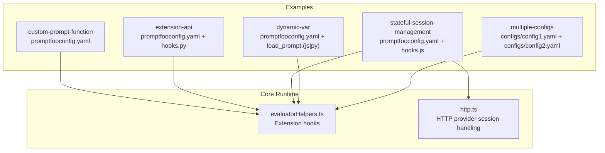
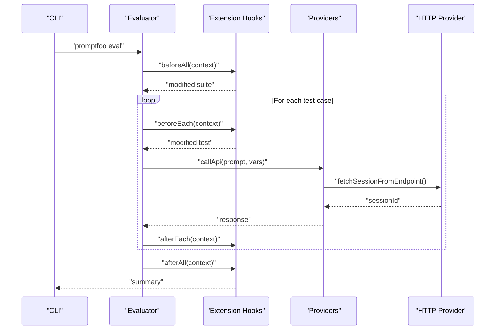
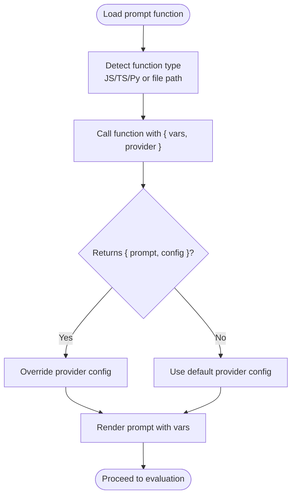
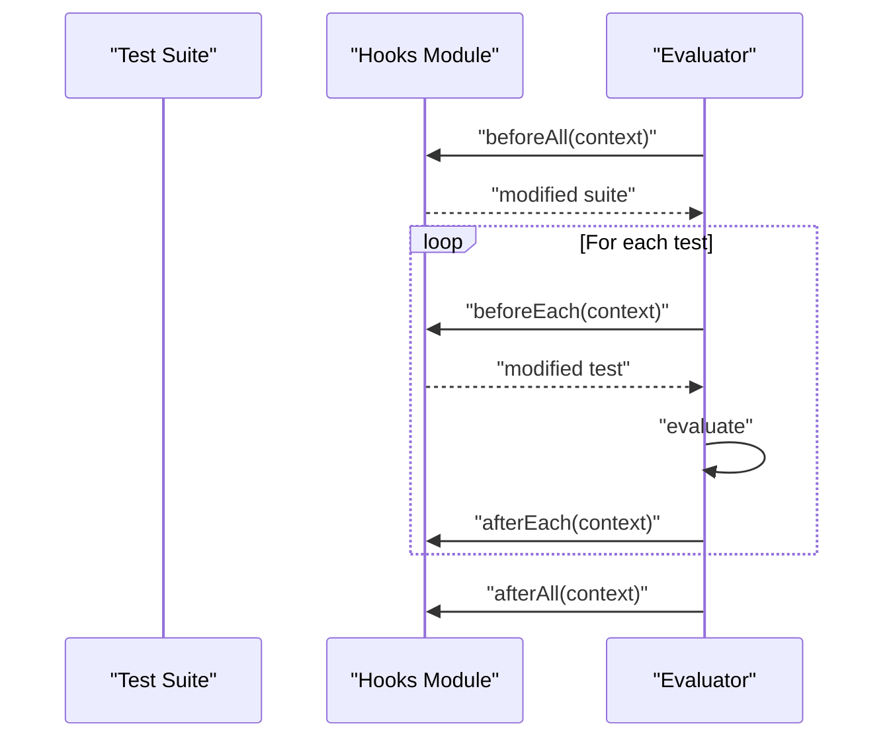
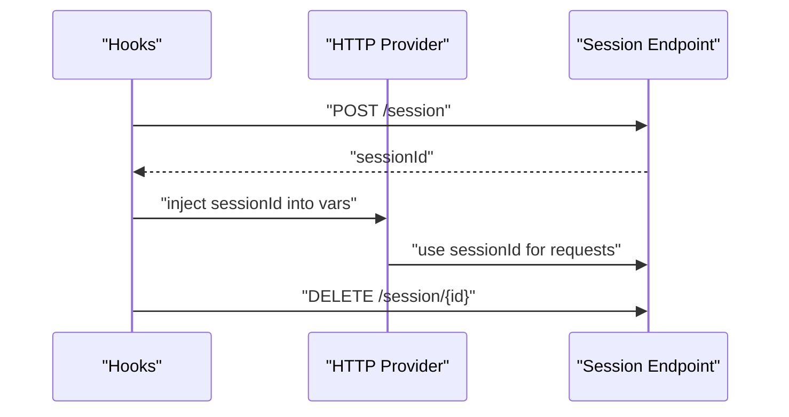
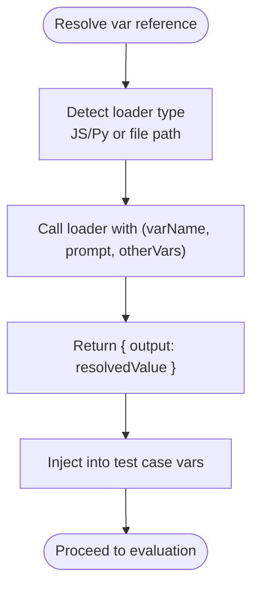
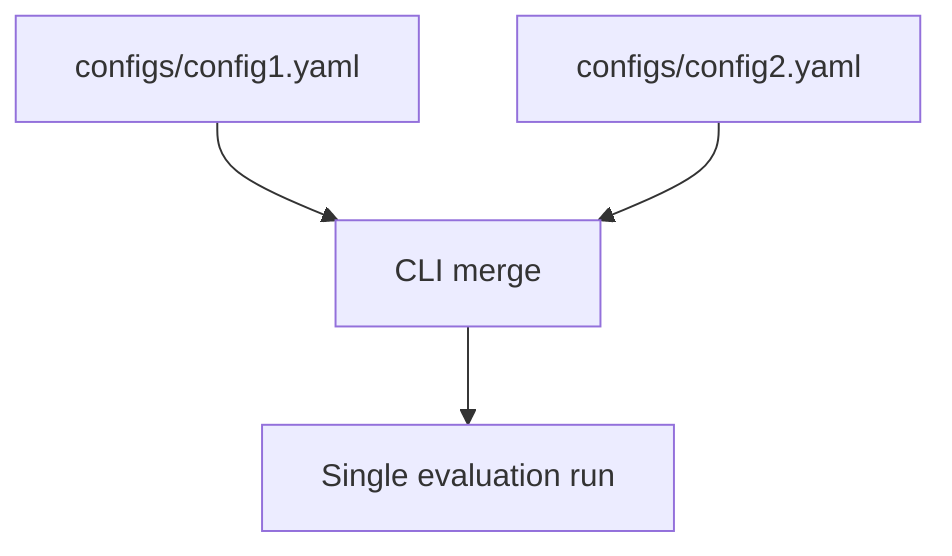
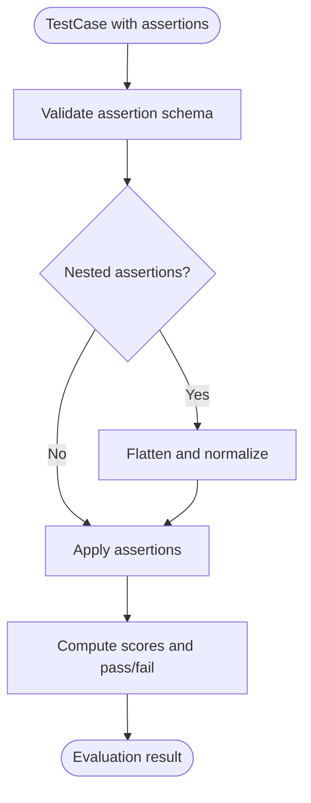
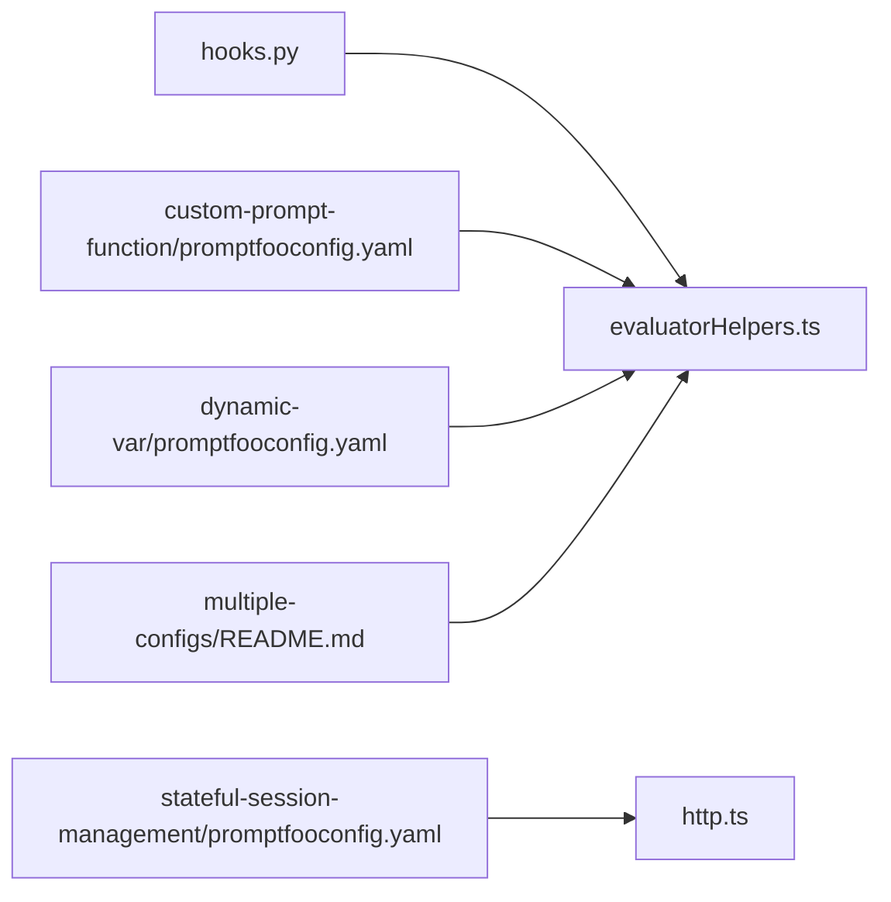

# Advanced Configuration Examples

<cite>
**Referenced Files in This Document**
- [promptfooconfig.yaml](file://examples/custom-prompt-function/promptfooconfig.yaml)
- [prompt_chat.ts](file://examples/custom-prompt-function/prompt_chat.ts)
- [README.md](file://examples/custom-prompt-function/README.md)
- [promptfooconfig.yaml](file://examples/extension-api/promptfooconfig.yaml)
- [hooks.py](file://examples/extension-api/hooks.py)
- [promptfooconfig.yaml](file://examples/stateful-session-management/promptfooconfig.yaml)
- [hooks.js](file://examples/stateful-session-management/hooks.js)
- [promptfooconfig.yaml](file://examples/dynamic-var/promptfooconfig.yaml)
- [load_prompt.js](file://examples/dynamic-var/load_prompt.js)
- [load_prompt.py](file://examples/dynamic-var/load_prompt.py)
- [promptfooconfig.yaml](file://examples/multiple-configs/configs/config1.yaml)
- [promptfooconfig.yaml](file://examples/multiple-configs/configs/config2.yaml)
- [README.md](file://examples/multiple-configs/README.md)
- [evaluatorHelpers.ts](file://src/evaluatorHelpers.ts)
- [http.ts](file://src/providers/http.ts)
- [http.test.ts](file://test/providers/http.test.ts)
- [util.test.ts](file://test/validators/util.test.ts)
- [validateAssertions.test.ts](file://test/assertions/validateAssertions.test.ts)
- [performance.ts](file://src/commands/mcp/lib/performance.ts)
</cite>

## Table of Contents
1. [Introduction](#introduction)
2. [Project Structure](#project-structure)
3. [Core Components](#core-components)
4. [Architecture Overview](#architecture-overview)
5. [Detailed Component Analysis](#detailed-component-analysis)
6. [Dependency Analysis](#dependency-analysis)
7. [Performance Considerations](#performance-considerations)
8. [Troubleshooting Guide](#troubleshooting-guide)
9. [Conclusion](#conclusion)
10. [Appendices](#appendices)

## Introduction
This document provides advanced configuration examples for PromptFoo, focusing on complex patterns such as custom prompt functions, extension API integration, and stateful session management. It explains dynamic variable injection, modular configuration organization, advanced test case structuring, environment-specific settings, conditional evaluation logic, advanced assertions, custom evaluation hooks, and programmatic test generation. Guidance is included for configuration optimization, performance tuning, and scalable evaluation setups, along with troubleshooting and best practices for complex evaluation scenarios.

## Project Structure
PromptFoo’s advanced configuration examples are organized under the examples directory. Each example demonstrates a specific advanced pattern:
- Custom prompt functions: combining multiple prompt formats and dynamic configuration overrides
- Extension API integration: lifecycle hooks around test suites and evaluations
- Stateful session management: session creation and cleanup across turns
- Dynamic variable injection: loading variables from scripts and files
- Modular configuration management: splitting configurations across multiple files
- Advanced assertions and evaluation hooks: validating and extending evaluation behavior

**Diagram sources**
- [promptfooconfig.yaml:1-100](file://examples/custom-prompt-function/promptfooconfig.yaml#L1-L100)
- [promptfooconfig.yaml:1-32](file://examples/extension-api/promptfooconfig.yaml#L1-L32)
- [hooks.py:1-139](file://examples/extension-api/hooks.py#L1-L139)
- [promptfooconfig.yaml:1-29](file://examples/stateful-session-management/promptfooconfig.yaml#L1-L29)
- [hooks.js:1-37](file://examples/stateful-session-management/hooks.js#L1-L37)
- [promptfooconfig.yaml:1-37](file://examples/dynamic-var/promptfooconfig.yaml#L1-L37)
- [load_prompt.js:1-21](file://examples/dynamic-var/load_prompt.js#L1-L21)
- [load_prompt.py:1-18](file://examples/dynamic-var/load_prompt.py#L1-L18)
- [promptfooconfig.yaml:1-25](file://examples/multiple-configs/configs/config1.yaml#L1-L25)
- [promptfooconfig.yaml:1-19](file://examples/multiple-configs/configs/config2.yaml#L1-L19)
- [evaluatorHelpers.ts:500-545](file://src/evaluatorHelpers.ts#L500-L545)
- [http.ts:1792-1825](file://src/providers/http.ts#L1792-L1825)

**Section sources**
- [promptfooconfig.yaml:1-100](file://examples/custom-prompt-function/promptfooconfig.yaml#L1-L100)
- [promptfooconfig.yaml:1-32](file://examples/extension-api/promptfooconfig.yaml#L1-L32)
- [hooks.py:1-139](file://examples/extension-api/hooks.py#L1-L139)
- [promptfooconfig.yaml:1-29](file://examples/stateful-session-management/promptfooconfig.yaml#L1-L29)
- [hooks.js:1-37](file://examples/stateful-session-management/hooks.js#L1-L37)
- [promptfooconfig.yaml:1-37](file://examples/dynamic-var/promptfooconfig.yaml#L1-L37)
- [load_prompt.js:1-21](file://examples/dynamic-var/load_prompt.js#L1-L21)
- [load_prompt.py:1-18](file://examples/dynamic-var/load_prompt.py#L1-L18)
- [promptfooconfig.yaml:1-25](file://examples/multiple-configs/configs/config1.yaml#L1-L25)
- [promptfooconfig.yaml:1-19](file://examples/multiple-configs/configs/config2.yaml#L1-L19)
- [README.md:1-26](file://examples/multiple-configs/README.md#L1-L26)

## Core Components
- Custom prompt functions: Generate prompts dynamically with JavaScript/TypeScript/Python, optionally returning dynamic provider configuration overrides
- Extension API: Lifecycle hooks executed before/after test suites and individual evaluations
- Stateful session management: Create, reuse, and clean up sessions across multi-turn or stateful evaluations
- Dynamic variable injection: Load variables from scripts or files at runtime
- Modular configuration: Split configurations across multiple YAML files and combine them via CLI
- Advanced assertions and validation: Nested assertions, custom evaluators, and validation logic
- Programmatic test generation: Extend test suites programmatically via hooks

**Section sources**
- [README.md:1-84](file://examples/custom-prompt-function/README.md#L1-L84)
- [evaluatorHelpers.ts:500-545](file://src/evaluatorHelpers.ts#L500-L545)
- [http.ts:1792-1825](file://src/providers/http.ts#L1792-L1825)
- [promptfooconfig.yaml:1-37](file://examples/dynamic-var/promptfooconfig.yaml#L1-L37)
- [promptfooconfig.yaml:1-25](file://examples/multiple-configs/configs/config1.yaml#L1-L25)
- [validateAssertions.test.ts:170-221](file://test/assertions/validateAssertions.test.ts#L170-L221)

## Architecture Overview
The advanced configuration patterns integrate with PromptFoo’s evaluation pipeline. Extensions run before/after each test and suite, enabling dynamic modifications to test cases and default assertions. Providers can be configured for stateful behavior, and dynamic prompts and variables enrich test coverage.

**Diagram sources**
- [evaluatorHelpers.ts:500-545](file://src/evaluatorHelpers.ts#L500-L545)
- [http.ts:1792-1825](file://src/providers/http.ts#L1792-L1825)
- [hooks.py:68-139](file://examples/extension-api/hooks.py#L68-L139)
- [hooks.js:22-34](file://examples/stateful-session-management/hooks.js#L22-L34)

## Detailed Component Analysis

### Custom Prompt Functions and Dynamic Configuration
- Purpose: Generate prompts from multiple formats and optionally return dynamic provider configuration overrides
- Patterns:
  - Multiple prompt formats: raw text, files, globs, JSON chat, Markdown, Jinja2, CSV, executable scripts
  - Dynamic configuration: functions can return both prompt content and provider overrides
  - Provider comparisons: compare multiple providers with dynamic prompt behavior
- Implementation highlights:
  - Prompt functions in JavaScript/TypeScript/Python
  - Returning { prompt, config } to override provider settings
  - Nested prompt files and subfolders
- Example references:
  - [promptfooconfig.yaml:1-100](file://examples/custom-prompt-function/promptfooconfig.yaml#L1-L100)
  - [prompt_chat.ts:1-13](file://examples/custom-prompt-function/prompt_chat.ts#L1-L13)
  - [README.md:1-84](file://examples/custom-prompt-function/README.md#L1-L84)

**Diagram sources**
- [promptfooconfig.yaml:70-74](file://examples/custom-prompt-function/promptfooconfig.yaml#L70-L74)
- [prompt_chat.ts:1-13](file://examples/custom-prompt-function/prompt_chat.ts#L1-L13)

**Section sources**
- [promptfooconfig.yaml:1-100](file://examples/custom-prompt-function/promptfooconfig.yaml#L1-L100)
- [prompt_chat.ts:1-13](file://examples/custom-prompt-function/prompt_chat.ts#L1-L13)
- [README.md:1-84](file://examples/custom-prompt-function/README.md#L1-L84)

### Extension API Integration
- Purpose: Integrate custom logic around test execution using lifecycle hooks
- Hooks:
  - beforeAll: Modify suite-level configuration and add default assertions
  - beforeEach: Modify individual test cases (e.g., mutate variables)
  - afterEach: Inspect results and log metadata (e.g., session IDs)
  - afterAll: Aggregate results and compute metrics
- Implementation highlights:
  - Hook signatures and context payloads
  - Thread-safety warnings for counters
  - Logging and metadata extraction
- Example references:
  - [promptfooconfig.yaml:1-32](file://examples/extension-api/promptfooconfig.yaml#L1-L32)
  - [hooks.py:1-139](file://examples/extension-api/hooks.py#L1-L139)
  - [evaluatorHelpers.ts:500-545](file://src/evaluatorHelpers.ts#L500-L545)

**Diagram sources**
- [evaluatorHelpers.ts:500-545](file://src/evaluatorHelpers.ts#L500-L545)
- [hooks.py:68-139](file://examples/extension-api/hooks.py#L68-L139)

**Section sources**
- [promptfooconfig.yaml:1-32](file://examples/extension-api/promptfooconfig.yaml#L1-L32)
- [hooks.py:1-139](file://examples/extension-api/hooks.py#L1-L139)
- [evaluatorHelpers.ts:500-545](file://src/evaluatorHelpers.ts#L500-L545)

### Stateful Session Management
- Purpose: Manage persistent sessions across multi-turn or stateful evaluations
- Patterns:
  - Session creation before each test
  - Session cleanup after each test
  - Provider-level session handling for HTTP endpoints
- Implementation highlights:
  - Hooks orchestrate session lifecycle
  - HTTP provider fetches session IDs from endpoints
  - Validation ensures proper session parsing and source selection
- Example references:
  - [promptfooconfig.yaml:1-29](file://examples/stateful-session-management/promptfooconfig.yaml#L1-L29)
  - [hooks.js:1-37](file://examples/stateful-session-management/hooks.js#L1-L37)
  - [http.ts:1792-1825](file://src/providers/http.ts#L1792-L1825)
  - [http.test.ts:3239-3284](file://test/providers/http.test.ts#L3239-L3284)
  - [util.test.ts:163-259](file://test/validators/util.test.ts#L163-L259)

**Diagram sources**
- [hooks.js:5-20](file://examples/stateful-session-management/hooks.js#L5-L20)
- [http.ts:1792-1825](file://src/providers/http.ts#L1792-L1825)
- [http.test.ts:3239-3284](file://test/providers/http.test.ts#L3239-L3284)

**Section sources**
- [promptfooconfig.yaml:1-29](file://examples/stateful-session-management/promptfooconfig.yaml#L1-L29)
- [hooks.js:1-37](file://examples/stateful-session-management/hooks.js#L1-L37)
- [http.ts:1792-1825](file://src/providers/http.ts#L1792-L1825)
- [http.test.ts:3239-3284](file://test/providers/http.test.ts#L3239-L3284)
- [util.test.ts:163-259](file://test/validators/util.test.ts#L163-L259)

### Dynamic Variable Injection
- Purpose: Load variables from scripts or files at runtime to tailor prompts and behavior
- Patterns:
  - JavaScript and Python variable loaders
  - File-based variable references
  - Role-based system prompts loaded dynamically
- Implementation highlights:
  - Variable loader functions return structured outputs
  - Integration with test case variables
- Example references:
  - [promptfooconfig.yaml:1-37](file://examples/dynamic-var/promptfooconfig.yaml#L1-L37)
  - [load_prompt.js:1-21](file://examples/dynamic-var/load_prompt.js#L1-L21)
  - [load_prompt.py:1-18](file://examples/dynamic-var/load_prompt.py#L1-L18)

**Diagram sources**
- [promptfooconfig.yaml:14-36](file://examples/dynamic-var/promptfooconfig.yaml#L14-L36)
- [load_prompt.js:16-20](file://examples/dynamic-var/load_prompt.js#L16-L20)
- [load_prompt.py:13-17](file://examples/dynamic-var/load_prompt.py#L13-L17)

**Section sources**
- [promptfooconfig.yaml:1-37](file://examples/dynamic-var/promptfooconfig.yaml#L1-L37)
- [load_prompt.js:1-21](file://examples/dynamic-var/load_prompt.js#L1-L21)
- [load_prompt.py:1-18](file://examples/dynamic-var/load_prompt.py#L1-L18)

### Modular Configuration Organization
- Purpose: Split complex evaluations across multiple configuration files and combine them at runtime
- Patterns:
  - Multiple YAML files under a directory
  - CLI invocation with multiple -c arguments or glob patterns
- Implementation highlights:
  - Combine multiple configurations for broader coverage
  - Keep environment-specific settings in separate files
- Example references:
  - [README.md:1-26](file://examples/multiple-configs/README.md#L1-L26)
  - [promptfooconfig.yaml:1-25](file://examples/multiple-configs/configs/config1.yaml#L1-L25)
  - [promptfooconfig.yaml:1-19](file://examples/multiple-configs/configs/config2.yaml#L1-L19)

**Diagram sources**
- [README.md:15-23](file://examples/multiple-configs/README.md#L15-L23)
- [promptfooconfig.yaml:1-25](file://examples/multiple-configs/configs/config1.yaml#L1-L25)
- [promptfooconfig.yaml:1-19](file://examples/multiple-configs/configs/config2.yaml#L1-L19)

**Section sources**
- [README.md:1-26](file://examples/multiple-configs/README.md#L1-L26)
- [promptfooconfig.yaml:1-25](file://examples/multiple-configs/configs/config1.yaml#L1-L25)
- [promptfooconfig.yaml:1-19](file://examples/multiple-configs/configs/config2.yaml#L1-L19)

### Advanced Assertions and Conditional Logic
- Purpose: Enforce sophisticated validation and scoring logic across test cases
- Patterns:
  - Nested assertions with assert-set
  - Custom evaluators (JavaScript/Python)
  - Validation of assertion structures
- Implementation highlights:
  - Nested assertions validated at runtime
  - Custom evaluators enable domain-specific checks
- Example references:
  - [validateAssertions.test.ts:170-221](file://test/assertions/validateAssertions.test.ts#L170-L221)

**Diagram sources**
- [validateAssertions.test.ts:170-221](file://test/assertions/validateAssertions.test.ts#L170-L221)

**Section sources**
- [validateAssertions.test.ts:170-221](file://test/assertions/validateAssertions.test.ts#L170-L221)

### Programmatic Test Generation
- Purpose: Dynamically add or modify test cases and default assertions via extension hooks
- Patterns:
  - beforeAll: Append additional test cases and default assertions
  - beforeEach: Mutate variables per test
  - afterAll: Aggregate metrics and logs
- Implementation highlights:
  - Modify suite and test objects in place
  - Extract metadata (e.g., session IDs) for observability
- Example references:
  - [hooks.py:77-139](file://examples/extension-api/hooks.py#L77-L139)
  - [evaluatorHelpers.ts:500-545](file://src/evaluatorHelpers.ts#L500-L545)

**Section sources**
- [hooks.py:1-139](file://examples/extension-api/hooks.py#L1-L139)
- [evaluatorHelpers.ts:500-545](file://src/evaluatorHelpers.ts#L500-L545)

## Dependency Analysis
- Extension hooks depend on the evaluator lifecycle and receive mutable contexts
- HTTP provider session handling depends on configuration and variable rendering
- Dynamic variable loaders depend on test case variables and file resolution
- Modular configurations depend on CLI merging semantics

**Diagram sources**
- [hooks.py:1-139](file://examples/extension-api/hooks.py#L1-L139)
- [evaluatorHelpers.ts:500-545](file://src/evaluatorHelpers.ts#L500-L545)
- [http.ts:1792-1825](file://src/providers/http.ts#L1792-L1825)
- [promptfooconfig.yaml:1-100](file://examples/custom-prompt-function/promptfooconfig.yaml#L1-L100)
- [promptfooconfig.yaml:1-37](file://examples/dynamic-var/promptfooconfig.yaml#L1-L37)
- [README.md:1-26](file://examples/multiple-configs/README.md#L1-L26)

**Section sources**
- [hooks.py:1-139](file://examples/extension-api/hooks.py#L1-L139)
- [evaluatorHelpers.ts:500-545](file://src/evaluatorHelpers.ts#L500-L545)
- [http.ts:1792-1825](file://src/providers/http.ts#L1792-L1825)
- [promptfooconfig.yaml:1-100](file://examples/custom-prompt-function/promptfooconfig.yaml#L1-L100)
- [promptfooconfig.yaml:1-37](file://examples/dynamic-var/promptfooconfig.yaml#L1-L37)
- [README.md:1-26](file://examples/multiple-configs/README.md#L1-L26)

## Performance Considerations
- Concurrency and streaming:
  - Use controlled concurrency for batch processing
  - Stream results to reduce memory overhead
- Caching:
  - Evaluation and configuration caches improve repeated runs
- Recommendations:
  - Tune concurrency based on provider rate limits
  - Prefer streaming for large test suites
  - Enable caching for expensive computations

**Section sources**
- [performance.ts:149-186](file://src/commands/mcp/lib/performance.ts#L149-L186)

## Troubleshooting Guide
- Extension hooks:
  - Verify hook signatures and context payloads
  - Be aware of thread-safety limitations for counters
- Stateful sessions:
  - Ensure session endpoints are reachable and return valid IDs
  - Validate session parsing and source selection logic
- Dynamic variables:
  - Confirm variable loaders return expected shapes
  - Check file paths and permissions for dynamic var files
- Assertions:
  - Validate assertion structures and nested assertions
  - Use custom evaluators judiciously to avoid heavy computation

**Section sources**
- [hooks.py:1-139](file://examples/extension-api/hooks.py#L1-L139)
- [util.test.ts:163-259](file://test/validators/util.test.ts#L163-L259)
- [http.test.ts:3239-3284](file://test/providers/http.test.ts#L3239-L3284)
- [validateAssertions.test.ts:170-221](file://test/assertions/validateAssertions.test.ts#L170-L221)

## Conclusion
By combining custom prompt functions, extension hooks, stateful session management, dynamic variable injection, modular configurations, and advanced assertions, PromptFoo enables robust, scalable, and maintainable evaluation setups. Use the patterns and references in this document to build complex evaluation workflows tailored to your needs.

## Appendices
- Best practices:
  - Keep configuration modular and environment-specific
  - Use extension hooks for cross-cutting concerns
  - Validate assertions rigorously
  - Monitor session lifecycles and provider limits
  - Optimize performance with streaming and caching