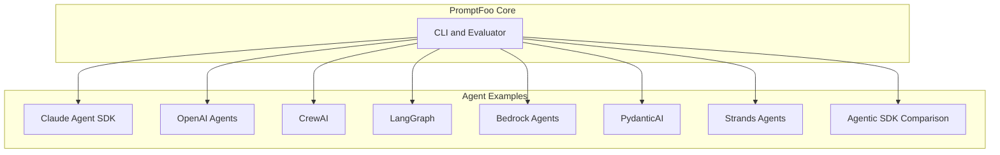
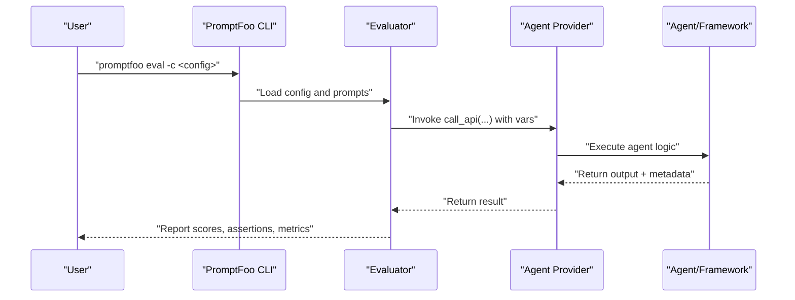
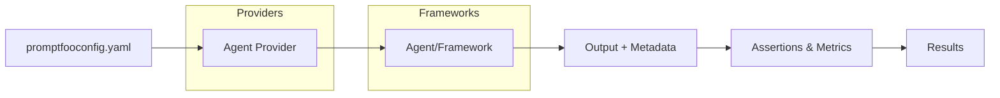

# Agent Evaluation Examples

<cite>
**Referenced Files in This Document**
- [AGENTS.md](file://AGENTS.md)
- [CLAUDE.md](file://CLAUDE.md)
- [examples/claude-agent-sdk/README.md](file://examples/claude-agent-sdk/README.md)
- [examples/claude-agent-sdk/basic/promptfooconfig.yaml](file://examples/claude-agent-sdk/basic/promptfooconfig.yaml)
- [examples/claude-agent-sdk/advanced/promptfooconfig.yaml](file://examples/claude-agent-sdk/advanced/promptfooconfig.yaml)
- [examples/openai-agents/README.md](file://examples/openai-agents/README.md)
- [examples/openai-agents/promptfooconfig.yaml](file://examples/openai-agents/promptfooconfig.yaml)
- [examples/crewai/README.md](file://examples/crewai/README.md)
- [examples/crewai/promptfooconfig.yaml](file://examples/crewai/promptfooconfig.yaml)
- [examples/langgraph/README.md](file://examples/langgraph/README.md)
- [examples/langgraph/promptfooconfig.yaml](file://examples/langgraph/promptfooconfig.yaml)
- [examples/bedrock-agents/README.md](file://examples/bedrock-agents/README.md)
- [examples/bedrock-agents/promptfooconfig.multi-agent.yaml](file://examples/bedrock-agents/promptfooconfig.multi-agent.yaml)
- [examples/pydantic-ai/README.md](file://examples/pydantic-ai/README.md)
- [examples/strands-agents/README.md](file://examples/strands-agents/README.md)
- [examples/agentic-sdk-comparison/README.md](file://examples/agentic-sdk-comparison/README.md)
- [examples/agentic-sdk-comparison/promptfooconfig.yaml](file://examples/agentic-sdk-comparison/promptfooconfig.yaml)
</cite>

## Table of Contents
1. [Introduction](#introduction)
2. [Project Structure](#project-structure)
3. [Core Components](#core-components)
4. [Architecture Overview](#architecture-overview)
5. [Detailed Component Analysis](#detailed-component-analysis)
6. [Dependency Analysis](#dependency-analysis)
7. [Performance Considerations](#performance-considerations)
8. [Troubleshooting Guide](#troubleshooting-guide)
9. [Conclusion](#conclusion)
10. [Appendices](#appendices)

## Introduction
This document presents comprehensive agent evaluation examples for PromptFoo across multiple frameworks and architectures. It covers:
- OpenAI Agents SDK evaluation (multi-agent customer service)
- Claude Agent SDK testing (basic, working directory, advanced editing, MCP integration, structured output, AskUserQuestion handling, skills)
- CrewAI agent assessment (recruitment agent)
- LangGraph agent workflows (research agent)
- AWS Bedrock Agents (single and multi-agent systems)
- Agentic SDK comparison (Codex, Claude Agent, OpenCode)
- PydanticAI and Strands Agents SDK examples

It explains multi-turn conversation evaluation, tool usage testing, decision-making assessment, agent-specific configurations, state management evaluation, and performance metrics. Guidance is included for designing evaluation scenarios, measuring effectiveness, identifying limitations, and addressing agent-specific challenges such as memory management, tool integration, and long-term conversation quality.

## Project Structure
PromptFoo organizes agent evaluation examples under the examples/ directory, each with:
- A README describing the example and prerequisites
- A promptfooconfig.yaml defining prompts, providers, tests, and assertions
- Optional provider wrappers (e.g., Python call_api) for local agent orchestration

**Section sources**
- [AGENTS.md:10-24](file://AGENTS.md#L10-L24)

## Core Components
- Providers: Each example integrates a specific agent framework/provider via promptfooconfig.yaml. Providers include:
  - anthropic:claude-agent-sdk
  - file://agent_provider.py (OpenAI Agents)
  - file://./agent.py (CrewAI)
  - file://./provider.py (LangGraph)
  - bedrock-agent:<AGENT_ID> (AWS Bedrock)
  - openai:codex-sdk, opencode:sdk (Agentic SDK comparison)
  - openai:gpt-5.1 (baseline/plain LLM)
- Prompts: Defined in promptfooconfig.yaml; may include variables for multi-turn and scenario-driven tests.
- Tests and Assertions: Include rubrics, JSON schema validation, latency thresholds, and custom JavaScript/Python assertions.
- Extension Hooks and Options: Some examples leverage extension hooks and evaluateOptions for environment setup and concurrency control.

**Section sources**
- [examples/claude-agent-sdk/basic/promptfooconfig.yaml:1-17](file://examples/claude-agent-sdk/basic/promptfooconfig.yaml#L1-L17)
- [examples/claude-agent-sdk/advanced/promptfooconfig.yaml:1-34](file://examples/claude-agent-sdk/advanced/promptfooconfig.yaml#L1-L34)
- [examples/openai-agents/promptfooconfig.yaml:1-49](file://examples/openai-agents/promptfooconfig.yaml#L1-L49)
- [examples/crewai/promptfooconfig.yaml:1-79](file://examples/crewai/promptfooconfig.yaml#L1-L79)
- [examples/langgraph/promptfooconfig.yaml:1-36](file://examples/langgraph/promptfooconfig.yaml#L1-L36)
- [examples/bedrock-agents/promptfooconfig.multi-agent.yaml:1-240](file://examples/bedrock-agents/promptfooconfig.multi-agent.yaml#L1-L240)
- [examples/agentic-sdk-comparison/promptfooconfig.yaml:1-112](file://examples/agentic-sdk-comparison/promptfooconfig.yaml#L1-L112)

## Architecture Overview
The evaluation pipeline connects PromptFoo’s CLI and evaluator to agent providers and agents, then captures outputs, metadata, and metrics for assertions and scoring.

**Diagram sources**
- [examples/crewai/promptfooconfig.yaml:7-12](file://examples/crewai/promptfooconfig.yaml#L7-L12)
- [examples/langgraph/promptfooconfig.yaml:9-11](file://examples/langgraph/promptfooconfig.yaml#L9-L11)
- [examples/openai-agents/promptfooconfig.yaml:7-21](file://examples/openai-agents/promptfooconfig.yaml#L7-L21)

## Detailed Component Analysis

### Claude Agent SDK Examples
Claude Agent SDK enables controlled, reproducible agent evaluations with configurable tools, permissions, and environments. Key examples:
- Basic: Temporary directory with no tools; minimal agent behavior.
- Working Directory: Read-only access to a sample project; demonstrates Read, Grep, Glob, LS tools.
- Advanced Editing: Adds Write/Edit/MultiEdit tools, permission_mode acceptEdits, git hooks for resets, and serial execution.
- MCP Integration: Connects to an MCP weather server; restricts tool permissions to specific MCP tools.
- Structured Output: Validates JSON schema and analysis correctness.
- AskUserQuestion Handling: Automated responses for user-interaction tools.
- Skills Testing: Loads reusable SKILL.md skills and asserts skill invocations via metadata.
- Cyber Espionage Red Team: Authorized security testing against AI espionage patterns.

Agent-specific configurations covered:
- Model selection and sandbox/runtime settings
- Working directory and tool permissions
- Permission modes and CLI arguments
- Structured output schema validation
- MCP tool permissions and external API access
- Git workspace management and concurrency control

Evaluation focuses on:
- Tool usage verification (Read/Grep/Glob/Write/Edit/MultiEdit/Skill/AskUserQuestion)
- Structured output correctness and schema compliance
- Security boundary testing and responsible red teaming
- Multi-turn conversation quality and state handling

**Section sources**
- [examples/claude-agent-sdk/README.md:1-181](file://examples/claude-agent-sdk/README.md#L1-L181)
- [examples/claude-agent-sdk/basic/promptfooconfig.yaml:1-17](file://examples/claude-agent-sdk/basic/promptfooconfig.yaml#L1-L17)
- [examples/claude-agent-sdk/advanced/promptfooconfig.yaml:1-34](file://examples/claude-agent-sdk/advanced/promptfooconfig.yaml#L1-L34)

### OpenAI Agents SDK (Customer Service)
This example evaluates a multi-agent customer service system:
- Triage Agent routes inquiries
- FAQ Agent answers policies
- Seat Booking Agent handles seat changes
- Context persistence across conversations
- Custom tools for policy lookups and seat updates
- Token usage tracking

Agent-specific configurations:
- Provider routing via file://agent_provider.py with agent_type selector
- Multi-agent orchestration and handoffs
- Conversation context and tool usage metrics

Evaluation focuses on:
- Routing accuracy and response relevance
- Tool invocation correctness
- Multi-turn coherence and context retention
- Effectiveness scoring via rubrics

**Section sources**
- [examples/openai-agents/README.md:1-48](file://examples/openai-agents/README.md#L1-L48)
- [examples/openai-agents/promptfooconfig.yaml:1-49](file://examples/openai-agents/promptfooconfig.yaml#L1-L49)

### CrewAI Agent Assessment
CrewAI example evaluates a recruitment agent:
- Role-based candidate search with JSON output validation
- Default assertions for JSON validity and presence of candidates
- Scenario-specific assertions for skills matching (JavaScript and Python)
- Multi-role evaluation (Senior Full-Stack Engineer, Data Scientist, Junior UX/UI Designer)

Agent-specific configurations:
- Provider wrapper via file://./agent.py
- Model selection (openai:gpt-4.1)
- Assertion diversity (is-json, javascript, python, llm-rubric)

Evaluation focuses on:
- Structured output correctness and completeness
- Skill matching and candidate quality
- Consistency across roles and assertions

**Section sources**
- [examples/crewai/README.md:1-91](file://examples/crewai/README.md#L1-L91)
- [examples/crewai/promptfooconfig.yaml:1-79](file://examples/crewai/promptfooconfig.yaml#L1-L79)

### LangGraph Agent Workflows
LangGraph example evaluates a research agent:
- StateGraph-based agent processing queries and summarizing AI research trends
- Provider wrapper exposing call_api() for PromptFoo
- JSON schema validation for structured outputs

Agent-specific configurations:
- Provider via file://./provider.py
- Default assertions for JSON shape and required keys
- Custom Python assertions for semantic checks

Evaluation focuses on:
- Structured output schema compliance
- Semantic correctness of summaries
- Robustness across varied prompts

**Section sources**
- [examples/langgraph/README.md:1-67](file://examples/langgraph/README.md#L1-L67)
- [examples/langgraph/promptfooconfig.yaml:1-36](file://examples/langgraph/promptfooconfig.yaml#L1-L36)

### AWS Bedrock Agents (Single and Multi-Agent)
Bedrock Agents example demonstrates:
- Single-agent evaluation with session management, memory, and trace information
- Multi-agent system with specialized agents (Technical, Billing, Product) and a Supervisor
- Cross-functional issue handling, escalation management, and performance validation

Agent-specific configurations:
- Provider IDs bedrock-agent:<AGENT_ID>
- Agent alias, region, session ID, memory type, and trace enablement
- Multi-agent routing and coordination

Evaluation focuses on:
- Agent specialization and collaboration
- Memory persistence across interactions
- Tool usage analysis via traces
- Latency and quality metrics

**Section sources**
- [examples/bedrock-agents/README.md:1-215](file://examples/bedrock-agents/README.md#L1-L215)
- [examples/bedrock-agents/promptfooconfig.multi-agent.yaml:1-240](file://examples/bedrock-agents/promptfooconfig.multi-agent.yaml#L1-L240)

### Agentic SDK Comparison
Compares three providers on a security audit task:
- Codex SDK: Structured JSON output with output_schema; OpenAI-only
- Claude Agent SDK: Explicit file system tools (Read/Grep/Glob); Anthropic-only
- OpenCode SDK: Provider-agnostic file system tools; supports multiple providers
- Plain LLM: Baseline without file access

Agent-specific configurations:
- Codex SDK with output_schema and working_dir
- Claude Agent SDK with working_dir and model selection
- OpenCode SDK with provider_id and model selection
- Plain LLM baseline with deterministic temperature

Evaluation focuses on:
- Vulnerability detection coverage and scoring
- Output structure validation
- Comparative strengths across providers

**Section sources**
- [examples/agentic-sdk-comparison/README.md:1-54](file://examples/agentic-sdk-comparison/README.md#L1-L54)
- [examples/agentic-sdk-comparison/promptfooconfig.yaml:1-112](file://examples/agentic-sdk-comparison/promptfooconfig.yaml#L1-L112)

### PydanticAI and Strands Agents SDK
- PydanticAI: Structured outputs with JSON schema validation and multiple assertion types
- Strands Agents SDK: Custom tools with @tool decorator, multi-tool chaining, and provider flexibility (OpenAI, Anthropic, Bedrock)

Agent-specific configurations:
- Provider wrappers and model/provider selection
- Tool definitions and exposure via decorators
- Assertion types for latency, contains-any/icontains/not-contains, and llm-rubric

Evaluation focuses on:
- Tool usage correctness and chaining
- Structured output validation
- Graceful fallback handling and response quality

**Section sources**
- [examples/pydantic-ai/README.md:1-35](file://examples/pydantic-ai/README.md#L1-L35)
- [examples/strands-agents/README.md:1-108](file://examples/strands-agents/README.md#L1-L108)

## Dependency Analysis
Agent evaluation examples depend on:
- PromptFoo configuration (prompts, providers, tests, assertions)
- Agent provider wrappers (Python call_api functions)
- External APIs (OpenAI, Anthropic, AWS Bedrock)
- Optional tools and libraries (MCP weather server, LangChain, Pydantic, Strands SDK)

**Diagram sources**
- [examples/crewai/promptfooconfig.yaml:7-12](file://examples/crewai/promptfooconfig.yaml#L7-L12)
- [examples/langgraph/promptfooconfig.yaml:9-11](file://examples/langgraph/promptfooconfig.yaml#L9-L11)
- [examples/openai-agents/promptfooconfig.yaml:7-21](file://examples/openai-agents/promptfooconfig.yaml#L7-L21)

**Section sources**
- [examples/crewai/promptfooconfig.yaml:7-12](file://examples/crewai/promptfooconfig.yaml#L7-L12)
- [examples/langgraph/promptfooconfig.yaml:9-11](file://examples/langgraph/promptfooconfig.yaml#L9-L11)
- [examples/openai-agents/promptfooconfig.yaml:7-21](file://examples/openai-agents/promptfooconfig.yaml#L7-L21)

## Performance Considerations
- Concurrency control: Use evaluateOptions.maxConcurrency to prevent race conditions (e.g., Claude Agent SDK advanced example).
- Latency thresholds: Apply latency assertions and disable cache for accurate measurements (Bedrock multi-agent example).
- Timeout tuning: Increase timeouts for complex evaluations (Agentic SDK comparison).
- Tracing and metadata: Enable trace information for tool usage analysis and decision-making insights (Bedrock multi-agent example).

[No sources needed since this section provides general guidance]

## Troubleshooting Guide
Common issues and remedies:
- Authentication failures: Verify API keys and environment variables for providers (OpenAI, Anthropic, AWS).
- Provider misconfiguration: Confirm provider IDs, agent IDs, regions, and session/memory settings.
- Concurrency and race conditions: Set maxConcurrency appropriately for file-editing or shared-state agents.
- Output validation failures: Ensure structured output schemas and assertion types match agent capabilities.
- External tool connectivity: For MCP or external APIs, confirm tool permissions and network access.

**Section sources**
- [examples/bedrock-agents/README.md:185-215](file://examples/bedrock-agents/README.md#L185-L215)
- [examples/claude-agent-sdk/advanced/promptfooconfig.yaml:21-23](file://examples/claude-agent-sdk/advanced/promptfooconfig.yaml#L21-L23)
- [examples/agentic-sdk-comparison/promptfooconfig.yaml:70-72](file://examples/agentic-sdk-comparison/promptfooconfig.yaml#L70-L72)

## Conclusion
PromptFoo provides a unified framework to evaluate agents across diverse ecosystems. These examples demonstrate how to:
- Configure providers and agents for robust evaluation
- Design scenarios covering multi-turn conversations, tool usage, and decision-making
- Measure performance and effectiveness with latency, schema validation, and rubrics
- Identify limitations and improve agent reliability

Adopt the patterns shown here to build comprehensive agent evaluation suites tailored to your frameworks and use cases.

[No sources needed since this section summarizes without analyzing specific files]

## Appendices

### Designing Agent Evaluation Scenarios
- Define clear goals: Safety, capability, performance, usability
- Select representative prompts: Single-turn, multi-turn, edge cases, adversarial inputs
- Choose assertion types: LLM-rubric, JSON schema, latency, contains-any/icontains/not-contains
- Include provider-specific validations: Tool calls, memory persistence, trace analysis
- Establish baselines: Compare against plain LLM or simpler agents

[No sources needed since this section provides general guidance]

### Measuring Agent Effectiveness
- Accuracy: Rubric-based scoring and schema validation
- Responsiveness: Latency thresholds and timeout handling
- Reliability: Consistency across repeated runs and concurrency
- Safety: Guardrails, red teaming, and responsible testing

[No sources needed since this section provides general guidance]

### Addressing Agent-Specific Challenges
- Memory management: Use session IDs and memory types for continuity; validate persistence across turns
- Tool integration: Assert tool usage via metadata and traces; test fallbacks and error handling
- Long-term conversation quality: Evaluate coherence, grounding, and goal achievement over extended exchanges

[No sources needed since this section provides general guidance]