# Evaluation Patterns Examples

<cite>
**Referenced Files in This Document**
- [promptfooconfig.yaml](file://examples/g-eval/promptfooconfig.yaml)
- [README.md](file://examples/g-eval/README.md)
- [promptfooconfig.yaml](file://examples/bert-score/promptfooconfig.yaml)
- [bertscore_check.py](file://examples/bert-score/bertscore_check.py)
- [requirements.txt](file://examples/bert-score/requirements.txt)
- [promptfooconfig.yaml](file://examples/rag-eval/promptfooconfig.yaml)
- [maternity.md](file://examples/rag-eval/docs/maternity.md)
- [reimbursement.md](file://examples/rag-eval/docs/reimbursement.md)
- [promptfooconfig.yaml](file://examples/moderation/promptfooconfig.yaml)
- [promptfooconfig.yaml](file://examples/search-rubric/promptfooconfig.yaml)
- [promptfooconfig.yaml](file://examples/assertion-scoring-override/promptfooconfig.yaml)
- [default.js](file://examples/assertion-scoring-override/default.js)
- [override.js](file://examples/assertion-scoring-override/override.js)
- [override.py](file://examples/assertion-scoring-override/override.py)
- [promptfooconfig.yaml](file://examples/custom-grading-prompt/promptfooconfig.yaml)
- [promptfooconfig.yaml](file://examples/self-grading/promptfooconfig.yaml)
- [promptfooconfig.yaml](file://examples/conversation-relevance/promptfooconfig.yaml)
- [promptfooconfig.yaml](file://examples/custom-grader-csv/promptfooconfig.yaml)
</cite>

## Table of Contents
1. [Introduction](#introduction)
2. [Project Structure](#project-structure)
3. [Core Components](#core-components)
4. [Architecture Overview](#architecture-overview)
5. [Detailed Component Analysis](#detailed-component-analysis)
6. [Dependency Analysis](#dependency-analysis)
7. [Performance Considerations](#performance-considerations)
8. [Troubleshooting Guide](#troubleshooting-guide)
9. [Conclusion](#conclusion)
10. [Appendices](#appendices)

## Introduction
This document presents established evaluation patterns and practical examples for PromptFoo, focusing on:
- Retrieval Augmented Generation (RAG) evaluation using multiple quality metrics
- Semantic similarity testing with BERTScore via a Python assertion
- Factual consistency evaluation using G-Eval criteria
- Structured evaluation patterns for search relevance, content moderation, and quality assessment
- Assertion-based evaluation patterns, rubric scoring systems, and automated grading workflows
- Specialized domains: healthcare, legal, and financial services
- Guidance on selecting evaluation patterns, combining multiple criteria, building comprehensive pipelines, customizing evaluation logic, choosing metrics, and interpreting results

## Project Structure
The repository organizes evaluation patterns as standalone examples under the examples directory. Each example includes:
- A configuration file defining prompts, providers, and tests
- Optional supporting files (scripts, documents, CSV datasets)
- A README with usage notes and context

Key example categories used in this document:
- G-Eval: Criteria-based evaluation using model-graded assertions
- BERTScore: Semantic similarity using a Python script
- RAG Eval: Multi-metric evaluation for retrieval-augmented generation
- Moderation: Content safety checks with provider overrides
- Search Rubric: Fact-checking rubrics for live-search-capable models
- Assertion Scoring Override: Custom scoring functions for assertions
- Self Grading: Automated rubric-based grading
- Conversation Relevance: Multi-turn relevance assessment
- Custom Grader CSV: External CSV-backed test cases

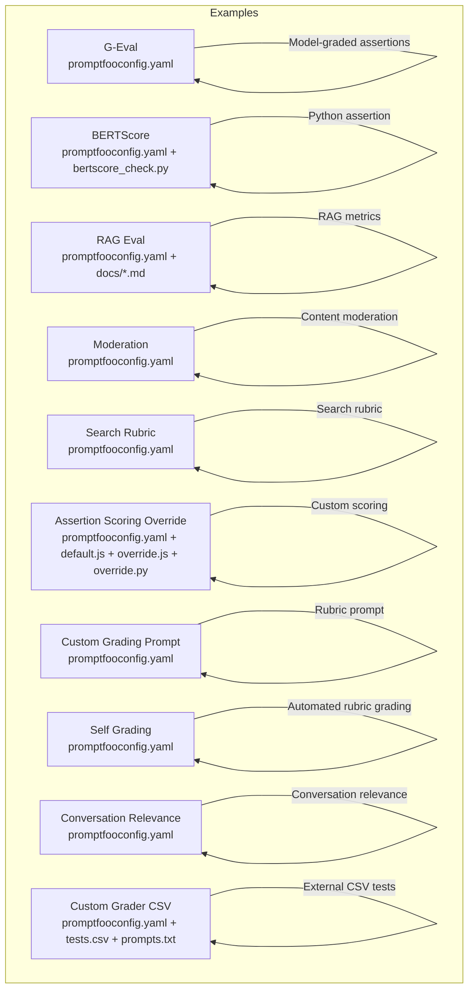

**Diagram sources**
- [promptfooconfig.yaml:1-45](file://examples/g-eval/promptfooconfig.yaml#L1-L45)
- [promptfooconfig.yaml:1-26](file://examples/bert-score/promptfooconfig.yaml#L1-L26)
- [bertscore_check.py](file://examples/bert-score/bertscore_check.py)
- [promptfooconfig.yaml:1-44](file://examples/rag-eval/promptfooconfig.yaml#L1-L44)
- [maternity.md](file://examples/rag-eval/docs/maternity.md)
- [reimbursement.md](file://examples/rag-eval/docs/reimbursement.md)
- [promptfooconfig.yaml:1-22](file://examples/moderation/promptfooconfig.yaml#L1-L22)
- [promptfooconfig.yaml:1-102](file://examples/search-rubric/promptfooconfig.yaml#L1-L102)
- [promptfooconfig.yaml:1-51](file://examples/assertion-scoring-override/promptfooconfig.yaml#L1-L51)
- [default.js](file://examples/assertion-scoring-override/default.js)
- [override.js](file://examples/assertion-scoring-override/override.js)
- [override.py](file://examples/assertion-scoring-override/override.py)
- [promptfooconfig.yaml:1-52](file://examples/custom-grading-prompt/promptfooconfig.yaml#L1-L52)
- [promptfooconfig.yaml:1-22](file://examples/self-grading/promptfooconfig.yaml#L1-L22)
- [promptfooconfig.yaml:1-91](file://examples/conversation-relevance/promptfooconfig.yaml#L1-L91)
- [promptfooconfig.yaml:1-8](file://examples/custom-grader-csv/promptfooconfig.yaml#L1-L8)

**Section sources**
- [promptfooconfig.yaml:1-45](file://examples/g-eval/promptfooconfig.yaml#L1-L45)
- [promptfooconfig.yaml:1-26](file://examples/bert-score/promptfooconfig.yaml#L1-L26)
- [promptfooconfig.yaml:1-44](file://examples/rag-eval/promptfooconfig.yaml#L1-L44)
- [promptfooconfig.yaml:1-22](file://examples/moderation/promptfooconfig.yaml#L1-L22)
- [promptfooconfig.yaml:1-102](file://examples/search-rubric/promptfooconfig.yaml#L1-L102)
- [promptfooconfig.yaml:1-51](file://examples/assertion-scoring-override/promptfooconfig.yaml#L1-L51)
- [promptfooconfig.yaml:1-52](file://examples/custom-grading-prompt/promptfooconfig.yaml#L1-L52)
- [promptfooconfig.yaml:1-22](file://examples/self-grading/promptfooconfig.yaml#L1-L22)
- [promptfooconfig.yaml:1-91](file://examples/conversation-relevance/promptfooconfig.yaml#L1-L91)
- [promptfooconfig.yaml:1-8](file://examples/custom-grader-csv/promptfooconfig.yaml#L1-L8)

## Core Components
- Model-graded evaluations (G-Eval): Evaluate coherence, consistency, fluency, and relevance using criteria-based prompts.
- Semantic similarity (BERTScore): Use a Python script to compute similarity against reference texts.
- RAG multi-metric evaluation: Combine answer relevance, context recall, context relevance, and context faithfulness.
- Content moderation: Enforce safety policies using provider-specific moderation checks.
- Search rubric: Validate factual claims using rubrics for live-search-capable models.
- Assertion scoring override: Replace default scoring with custom functions (JavaScript, Python).
- Self-grading and rubric prompts: Automate grading using LLM rubrics and custom rubric prompts.
- Conversation relevance: Assess multi-turn relevance with configurable window sizes.
- External CSV grading: Load prompts and test cases from CSV files.

**Section sources**
- [promptfooconfig.yaml:10-45](file://examples/g-eval/promptfooconfig.yaml#L10-L45)
- [promptfooconfig.yaml:10-26](file://examples/bert-score/promptfooconfig.yaml#L10-L26)
- [promptfooconfig.yaml:11-44](file://examples/rag-eval/promptfooconfig.yaml#L11-L44)
- [promptfooconfig.yaml:10-22](file://examples/moderation/promptfooconfig.yaml#L10-L22)
- [promptfooconfig.yaml:37-102](file://examples/search-rubric/promptfooconfig.yaml#L37-L102)
- [promptfooconfig.yaml:9-51](file://examples/assertion-scoring-override/promptfooconfig.yaml#L9-L51)
- [promptfooconfig.yaml:8-22](file://examples/self-grading/promptfooconfig.yaml#L8-L22)
- [promptfooconfig.yaml:16-91](file://examples/conversation-relevance/promptfooconfig.yaml#L16-L91)
- [promptfooconfig.yaml:3-8](file://examples/custom-grader-csv/promptfooconfig.yaml#L3-L8)

## Architecture Overview
The evaluation pipeline in each example follows a consistent flow:
- Define prompts and providers
- Configure tests with variables and assertions
- Optionally customize scoring or grading logic
- Run evaluations and interpret metrics

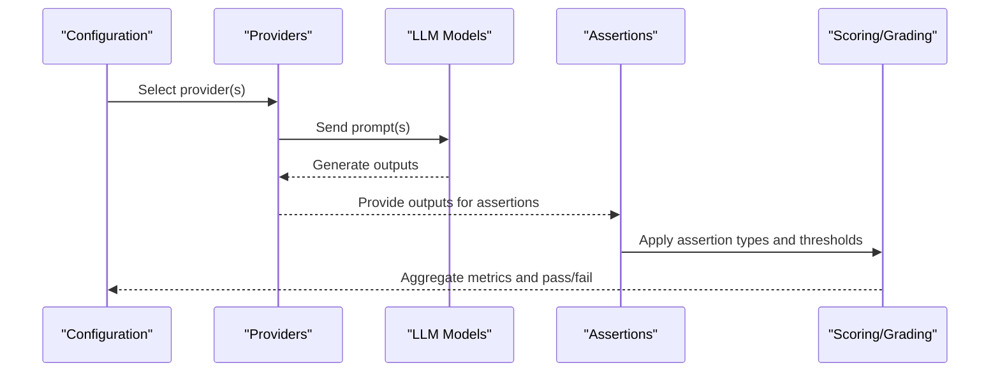

[No sources needed since this diagram shows conceptual workflow, not actual code structure]

## Detailed Component Analysis

### G-Eval: Model-graded evaluation of coherence, consistency, fluency, and relevance
G-Eval demonstrates criteria-based evaluation using model-graded assertions. It supports:
- Single-criteria scoring
- Multi-criteria averaging

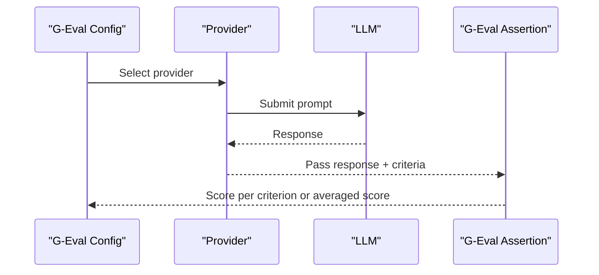

**Diagram sources**
- [promptfooconfig.yaml:4-45](file://examples/g-eval/promptfooconfig.yaml#L4-L45)

**Section sources**
- [promptfooconfig.yaml:10-45](file://examples/g-eval/promptfooconfig.yaml#L10-L45)
- [README.md](file://examples/g-eval/README.md)

### BERTScore: Semantic similarity testing
BERTScore computes semantic similarity against reference texts using a Python script invoked via a Python assertion. Thresholds control pass/fail decisions.

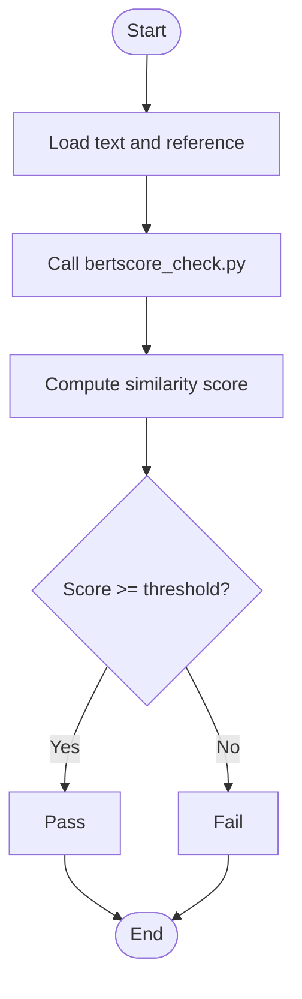

**Diagram sources**
- [promptfooconfig.yaml:10-26](file://examples/bert-score/promptfooconfig.yaml#L10-L26)
- [bertscore_check.py](file://examples/bert-score/bertscore_check.py)

**Section sources**
- [promptfooconfig.yaml:1-26](file://examples/bert-score/promptfooconfig.yaml#L1-L26)
- [requirements.txt](file://examples/bert-score/requirements.txt)

### RAG Eval: Retrieval Augmented Generation evaluation
RAG Eval combines multiple quality metrics:
- Answer relevance
- Context recall
- Context relevance
- Context faithfulness
- Factual consistency (factuality)

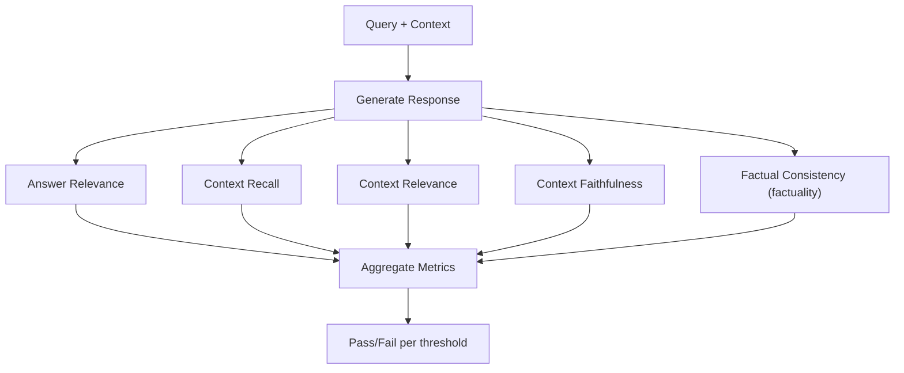

**Diagram sources**
- [promptfooconfig.yaml:11-44](file://examples/rag-eval/promptfooconfig.yaml#L11-L44)
- [maternity.md](file://examples/rag-eval/docs/maternity.md)
- [reimbursement.md](file://examples/rag-eval/docs/reimbursement.md)

**Section sources**
- [promptfooconfig.yaml:1-44](file://examples/rag-eval/promptfooconfig.yaml#L1-L44)
- [maternity.md](file://examples/rag-eval/docs/maternity.md)
- [reimbursement.md](file://examples/rag-eval/docs/reimbursement.md)

### Moderation: Content safety evaluation
Moderation ensures policy compliance by invoking a moderation provider and optionally restricting categories.

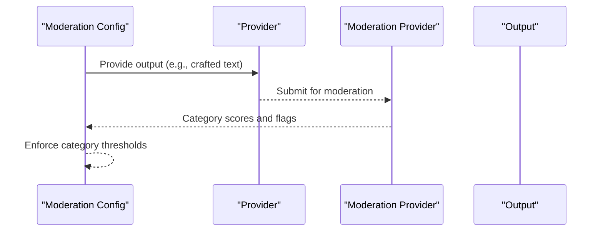

**Diagram sources**
- [promptfooconfig.yaml:10-22](file://examples/moderation/promptfooconfig.yaml#L10-L22)

**Section sources**
- [promptfooconfig.yaml:1-22](file://examples/moderation/promptfooconfig.yaml#L1-L22)

### Search Rubric: Fact-checking with live search
Search rubric validates factual claims using rubrics tailored for real-time information (e.g., stock prices, current events). Tests demonstrate:
- CEO identification
- Financial market data
- Current events and sports
- Technology facts
- Weather queries

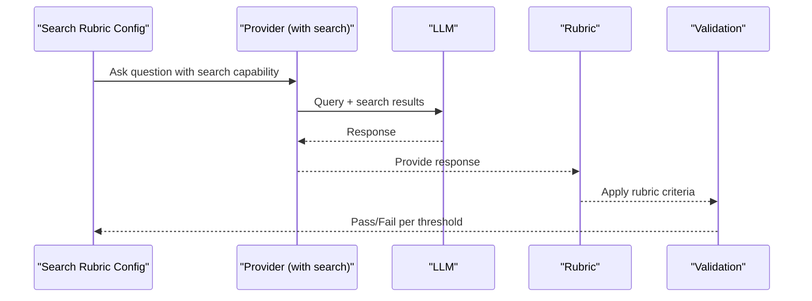

**Diagram sources**
- [promptfooconfig.yaml:37-102](file://examples/search-rubric/promptfooconfig.yaml#L37-L102)

**Section sources**
- [promptfooconfig.yaml:1-102](file://examples/search-rubric/promptfooconfig.yaml#L1-L102)

### Assertion Scoring Override: Custom scoring functions
Override default assertion scoring with custom functions written in JavaScript or Python. This enables domain-specific weighting or selection strategies.

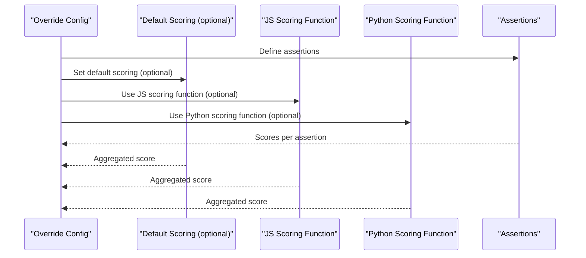

**Diagram sources**
- [promptfooconfig.yaml:9-51](file://examples/assertion-scoring-override/promptfooconfig.yaml#L9-L51)
- [default.js](file://examples/assertion-scoring-override/default.js)
- [override.js](file://examples/assertion-scoring-override/override.js)
- [override.py](file://examples/assertion-scoring-override/override.py)

**Section sources**
- [promptfooconfig.yaml:1-51](file://examples/assertion-scoring-override/promptfooconfig.yaml#L1-L51)

### Self Grading and Custom Grading Prompt: Automated rubric-based grading
Automate grading using LLM rubrics and custom rubric prompts. Supports:
- LLM rubric assertions
- Custom rubric prompts with templated scoring logic
- Embedding-based options for advanced comparisons

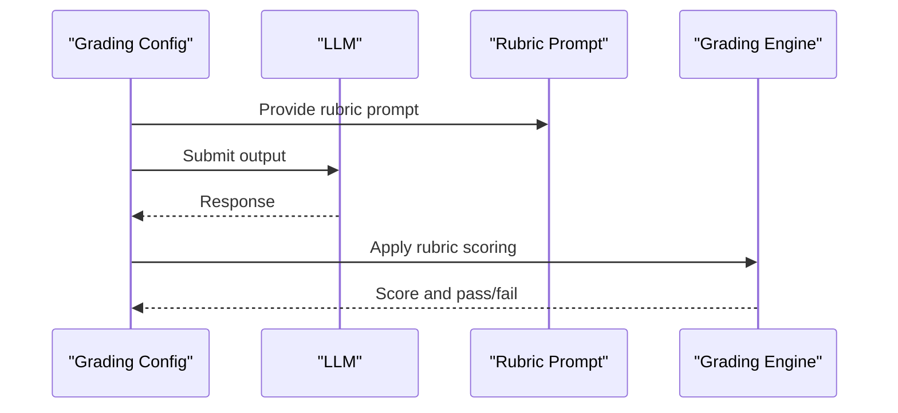

**Diagram sources**
- [promptfooconfig.yaml:8-22](file://examples/self-grading/promptfooconfig.yaml#L8-L22)
- [promptfooconfig.yaml:8-52](file://examples/custom-grading-prompt/promptfooconfig.yaml#L8-L52)

**Section sources**
- [promptfooconfig.yaml:1-22](file://examples/self-grading/promptfooconfig.yaml#L1-L22)
- [promptfooconfig.yaml:1-52](file://examples/custom-grading-prompt/promptfooconfig.yaml#L1-L52)

### Conversation Relevance: Multi-turn relevance assessment
Evaluate conversational relevance across turns with configurable window sizes and thresholds.

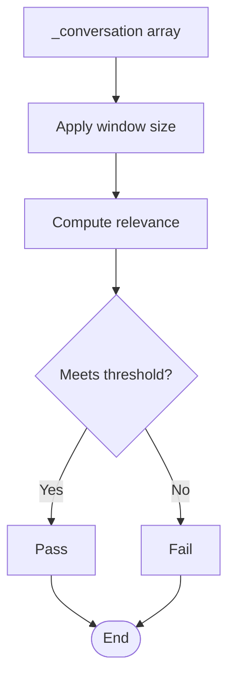

**Diagram sources**
- [promptfooconfig.yaml:16-91](file://examples/conversation-relevance/promptfooconfig.yaml#L16-L91)

**Section sources**
- [promptfooconfig.yaml:1-91](file://examples/conversation-relevance/promptfooconfig.yaml#L1-L91)

### Custom Grader CSV: External CSV-backed test cases
Load prompts and test cases from CSV files for scalable, externalized grading.

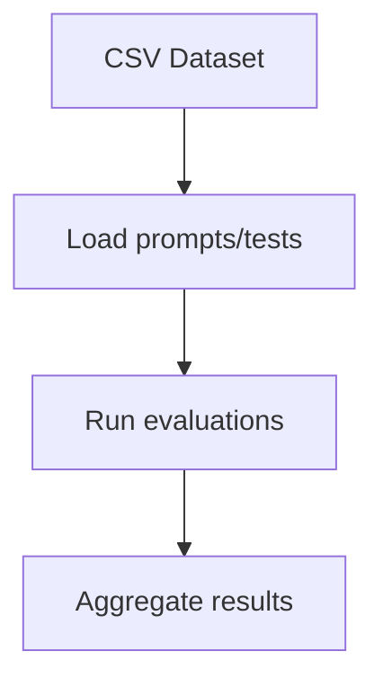

**Diagram sources**
- [promptfooconfig.yaml:3-8](file://examples/custom-grader-csv/promptfooconfig.yaml#L3-L8)

**Section sources**
- [promptfooconfig.yaml:1-8](file://examples/custom-grader-csv/promptfooconfig.yaml#L1-L8)

## Dependency Analysis
- Assertions depend on provider outputs; some assertions (e.g., BERTScore) rely on external scripts.
- G-Eval and rubric-based evaluations depend on model capabilities and prompt quality.
- RAG metrics depend on accurate context retrieval and response generation.
- Moderation depends on provider-specific moderation endpoints and category configurations.
- Search rubric depends on live search capabilities of providers.

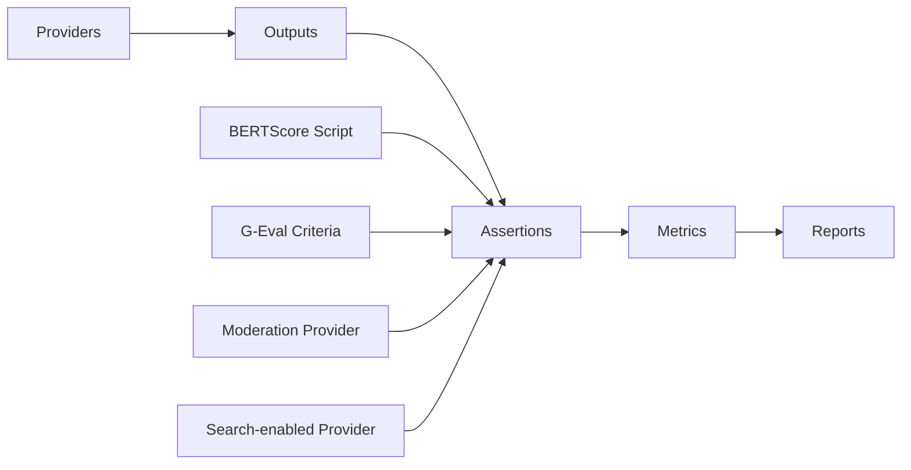

[No sources needed since this diagram shows conceptual relationships, not specific code structure]

**Section sources**
- [promptfooconfig.yaml:10-26](file://examples/bert-score/promptfooconfig.yaml#L10-L26)
- [promptfooconfig.yaml:10-45](file://examples/g-eval/promptfooconfig.yaml#L10-L45)
- [promptfooconfig.yaml:10-22](file://examples/moderation/promptfooconfig.yaml#L10-L22)
- [promptfooconfig.yaml:37-102](file://examples/search-rubric/promptfooconfig.yaml#L37-L102)

## Performance Considerations
- Prefer provider options that minimize latency for rubric-based evaluations when using higher-tier models.
- Use thresholds judiciously to balance precision and recall; overly strict thresholds may increase false negatives.
- For BERTScore, tune thresholds based on domain similarity expectations.
- In RAG, ensure context quality and retrieval performance to avoid noisy metrics.
- Batch or parallelize evaluations where feasible to reduce total runtime.

[No sources needed since this section provides general guidance]

## Troubleshooting Guide
Common issues and resolutions:
- BERTScore assertion failures: Adjust threshold or verify reference text and similarity script.
- G-Eval scoring variability: Refine criteria prompts and ensure consistent provider/model selection.
- Moderation mismatches: Confirm moderation provider configuration and category lists.
- RAG metric inconsistencies: Validate context retrieval and ensure correct variable binding for context files.
- Search rubric timeouts: Verify provider search tool availability and limits; adjust rubric thresholds.

**Section sources**
- [promptfooconfig.yaml:10-26](file://examples/bert-score/promptfooconfig.yaml#L10-L26)
- [promptfooconfig.yaml:10-45](file://examples/g-eval/promptfooconfig.yaml#L10-L45)
- [promptfooconfig.yaml:10-22](file://examples/moderation/promptfooconfig.yaml#L10-L22)
- [promptfooconfig.yaml:11-44](file://examples/rag-eval/promptfooconfig.yaml#L11-L44)
- [promptfooconfig.yaml:37-102](file://examples/search-rubric/promptfooconfig.yaml#L37-L102)

## Conclusion
PromptFoo’s examples demonstrate robust evaluation patterns across diverse domains:
- Use G-Eval for structured, criteria-based assessments
- Apply BERTScore for semantic similarity tasks
- Combine RAG metrics for comprehensive retrieval quality
- Enforce safety with moderation providers
- Validate real-time facts with search rubrics
- Customize scoring and grading with assertion overrides and rubric prompts
These patterns enable building reliable, interpretable evaluation pipelines tailored to specialized domains and use cases.

[No sources needed since this section summarizes without analyzing specific files]

## Appendices

### Specialized Domains and Recommended Patterns
- Healthcare: Combine RAG metrics (context recall/relevance/faithfulness) with moderation and G-Eval fluency/coherence to ensure safe, accurate, and well-structured responses.
- Legal: Use search rubric for up-to-date legal precedents and regulations; apply G-Eval consistency to ensure factual alignment with cited sources.
- Financial Services: Employ search rubric for real-time financial data; pair with RAG context-faithfulness and moderation to prevent misinformation and unsafe advice.

[No sources needed since this section provides general guidance]

### Selecting Evaluation Patterns and Combining Criteria
- Start with domain requirements: safety (moderation), factual accuracy (factuality/G-Eval), relevance (answer/context metrics), and semantic similarity (BERTScore).
- Compose multi-criteria evaluations by layering assertions; set thresholds aligned with risk tolerance.
- Use assertion scoring overrides to emphasize critical criteria or incorporate domain heuristics.

[No sources needed since this section provides general guidance]

### Creating Comprehensive Evaluation Pipelines
- Define prompts and providers aligned with domain needs
- Build tests with representative variables and ground truths
- Add assertions for each target dimension
- Integrate external scripts (e.g., BERTScore) and provider-specific tools (e.g., moderation)
- Aggregate metrics and interpret results with clear pass/fail rules

[No sources needed since this section provides general guidance]