# Examples & Use Cases

<cite>
**Referenced Files in This Document**
- [examples/getting-started/promptfooconfig.yaml](file://examples/getting-started/promptfooconfig.yaml)
- [examples/getting-started/README.md](file://examples/getting-started/README.md)
- [examples/openai-model-comparison/promptfooconfig.yaml](file://examples/openai-model-comparison/promptfooconfig.yaml)
- [examples/rag-eval/promptfooconfig.yaml](file://examples/rag-eval/promptfooconfig.yaml)
- [examples/rag-full/promptfooconfig.yaml](file://examples/rag-full/promptfooconfig.yaml)
- [examples/redteam-starter/promptfooconfig.yaml](file://examples/redteam-starter/promptfooconfig.yaml)
- [examples/redteam-api-top-10/promptfooconfig.yaml](file://examples/redteam-api-top-10/promptfooconfig.yaml)
- [examples/langchain-python/promptfooconfig.yaml](file://examples/langchain-python/promptfooconfig.yaml)
- [examples/crewai/promptfooconfig.yaml](file://examples/crewai/promptfooconfig.yaml)
- [examples/langgraph/promptfooconfig.yaml](file://examples/langgraph/promptfooconfig.yaml)
- [examples/openai-agents/promptfooconfig.yaml](file://examples/openai-agents/promptfooconfig.yaml)
- [examples/claude-agent-sdk/basic/promptfooconfig.yaml](file://examples/claude-agent-sdk/basic/promptfooconfig.yaml)
- [examples/docker/promptfooconfig.comparison.simple.yaml](file://examples/docker/promptfooconfig.comparison.simple.yaml)
- [examples/custom-provider/promptfooconfig.yaml](file://examples/custom-provider/promptfooconfig.yaml)
- [examples/bert-score/promptfooconfig.yaml](file://examples/bert-score/promptfooconfig.yaml)
- [examples/amazon-bedrock/promptfooconfig.yaml](file://examples/amazon-bedrock/promptfooconfig.yaml)
</cite>

## Table of Contents
1. [Introduction](#introduction)
2. [Project Structure](#project-structure)
3. [Core Components](#core-components)
4. [Architecture Overview](#architecture-overview)
5. [Detailed Component Analysis](#detailed-component-analysis)
6. [Dependency Analysis](#dependency-analysis)
7. [Performance Considerations](#performance-considerations)
8. [Troubleshooting Guide](#troubleshooting-guide)
9. [Conclusion](#conclusion)
10. [Appendices](#appendices)

## Introduction
This document presents a comprehensive guide to PromptFoo’s examples and use cases. It organizes over 200 example configurations by common evaluation patterns and industries, and explains how to adapt them for your own projects. You will learn:
- Getting started patterns for beginners
- Advanced configurations for model comparison, prompt testing, and Retrieval-Augmented Generation (RAG)
- Agent evaluation examples across frameworks (OpenAI Agents, LangGraph, CrewAI, Claude Agent SDK)
- Red team testing scenarios and security assessment workflows
- Integrations with popular tools (LangChain, CrewAI, OpenAI Assistants)
- Best practices and common pitfalls
- Guidance for adapting examples to specific use cases and customizing evaluation workflows

## Project Structure
PromptFoo’s examples are organized by domain and capability. Each example includes a configuration file and often a README with setup and execution steps. Representative categories include:
- Getting started: minimal configuration to evaluate multiple providers and test cases
- Model comparison: benchmarking multiple models on shared prompts and rubrics
- RAG evaluation: end-to-end evaluation of retrieval and generation quality
- Red team testing: adversarial testing against targets via HTTP endpoints
- Agent evaluation: validating agent outputs across frameworks and custom providers
- Integrations: connecting PromptFoo with external libraries and SDKs
- Specialized providers: Bedrock, Docker, custom providers, and embeddings

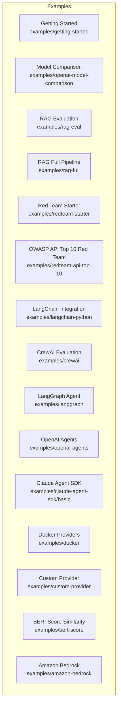

**Diagram sources**
- [examples/getting-started/promptfooconfig.yaml](file://examples/getting-started/promptfooconfig.yaml)
- [examples/openai-model-comparison/promptfooconfig.yaml](file://examples/openai-model-comparison/promptfooconfig.yaml)
- [examples/rag-eval/promptfooconfig.yaml](file://examples/rag-eval/promptfooconfig.yaml)
- [examples/rag-full/promptfooconfig.yaml](file://examples/rag-full/promptfooconfig.yaml)
- [examples/redteam-starter/promptfooconfig.yaml](file://examples/redteam-starter/promptfooconfig.yaml)
- [examples/redteam-api-top-10/promptfooconfig.yaml](file://examples/redteam-api-top-10/promptfooconfig.yaml)
- [examples/langchain-python/promptfooconfig.yaml](file://examples/langchain-python/promptfooconfig.yaml)
- [examples/crewai/promptfooconfig.yaml](file://examples/crewai/promptfooconfig.yaml)
- [examples/langgraph/promptfooconfig.yaml](file://examples/langgraph/promptfooconfig.yaml)
- [examples/openai-agents/promptfooconfig.yaml](file://examples/openai-agents/promptfooconfig.yaml)
- [examples/claude-agent-sdk/basic/promptfooconfig.yaml](file://examples/claude-agent-sdk/basic/promptfooconfig.yaml)
- [examples/docker/promptfooconfig.comparison.simple.yaml](file://examples/docker/promptfooconfig.comparison.simple.yaml)
- [examples/custom-provider/promptfooconfig.yaml](file://examples/custom-provider/promptfooconfig.yaml)
- [examples/bert-score/promptfooconfig.yaml](file://examples/bert-score/promptfooconfig.yaml)
- [examples/amazon-bedrock/promptfooconfig.yaml](file://examples/amazon-bedrock/promptfooconfig.yaml)

**Section sources**
- [examples/getting-started/README.md:1-42](file://examples/getting-started/README.md#L1-L42)

## Core Components
This section highlights representative examples and their primary use cases.

- Getting Started
  - Purpose: Minimal configuration to compare two models on simple prompts and test cases
  - Key elements: prompts with variables, multiple providers, simple assertions
  - Path: [examples/getting-started/promptfooconfig.yaml](file://examples/getting-started/promptfooconfig.yaml)

- Model Comparison
  - Purpose: Benchmark multiple models on a shared task with default performance assertions
  - Key elements: defaultTest cost and latency thresholds, rubric-based scoring
  - Path: [examples/openai-model-comparison/promptfooconfig.yaml](file://examples/openai-model-comparison/promptfooconfig.yaml)

- RAG Evaluation
  - Purpose: Evaluate RAG responses using multiple quality metrics (factuality, relevance, faithfulness)
  - Key elements: context files, multiple assertion types, thresholds
  - Path: [examples/rag-eval/promptfooconfig.yaml](file://examples/rag-eval/promptfooconfig.yaml)

- RAG Full Pipeline
  - Purpose: End-to-end evaluation of a retrieval provider plus prompts
  - Key elements: provider pointing to a retrieval script, multiple questions
  - Path: [examples/rag-full/promptfooconfig.yaml](file://examples/rag-full/promptfooconfig.yaml)

- Red Team Starter
  - Purpose: Basic adversarial testing against a target endpoint
  - Key elements: targets with HTTP config, redteam plugins and strategies
  - Path: [examples/redteam-starter/promptfooconfig.yaml](file://examples/redteam-starter/promptfooconfig.yaml)

- OWASP API Top 10 Red Team
  - Purpose: Adversarial testing aligned with API security risks
  - Key elements: session ID handling, purpose statement, OWASP plugin
  - Path: [examples/redteam-api-top-10/promptfooconfig.yaml](file://examples/redteam-api-top-10/promptfooconfig.yaml)

- LangChain Integration
  - Purpose: Evaluate a LangChain chain via a Python provider
  - Key elements: provider pointing to a Python script, test variables
  - Path: [examples/langchain-python/promptfooconfig.yaml](file://examples/langchain-python/promptfooconfig.yaml)

- CrewAI Evaluation
  - Purpose: Evaluate CrewAI agents returning structured JSON
  - Key elements: custom provider, default JSON assertions, role-specific validations
  - Path: [examples/crewai/promptfooconfig.yaml](file://examples/crewai/promptfooconfig.yaml)

- LangGraph Agent
  - Purpose: Evaluate a LangGraph research agent with JSON schema assertions
  - Key elements: provider pointing to a Python script, JSON schema validation
  - Path: [examples/langgraph/promptfooconfig.yaml](file://examples/langgraph/promptfooconfig.yaml)

- OpenAI Agents
  - Purpose: Evaluate handoffs between multiple OpenAI Agents
  - Key elements: multiple providers with different agent types, rubric-based assertions
  - Path: [examples/openai-agents/promptfooconfig.yaml](file://examples/openai-agents/promptfooconfig.yaml)

- Claude Agent SDK
  - Purpose: Evaluate Claude Agent SDK with a basic task
  - Key elements: Claude Agent SDK provider, simple assertions
  - Path: [examples/claude-agent-sdk/basic/promptfooconfig.yaml](file://examples/claude-agent-sdk/basic/promptfooconfig.yaml)

- Docker Providers
  - Purpose: Compare local models via Docker images
  - Key elements: docker provider id, simple prompt and assertion
  - Path: [examples/docker/promptfooconfig.comparison.simple.yaml](file://examples/docker/promptfooconfig.comparison.simple.yaml)

- Custom Provider
  - Purpose: Implement a custom provider in JavaScript and reuse variables from CSV
  - Key elements: provider id pointing to a script, CSV-backed test cases
  - Path: [examples/custom-provider/promptfooconfig.yaml](file://examples/custom-provider/promptfooconfig.yaml)

- BERTScore Similarity
  - Purpose: Semantic similarity evaluation using BERTScore via a Python assertion
  - Key elements: custom Python assertion with threshold
  - Path: [examples/bert-score/promptfooconfig.yaml](file://examples/bert-score/promptfooconfig.yaml)

- Amazon Bedrock
  - Purpose: Evaluate multiple Bedrock models and configure embeddings provider overrides
  - Key elements: multiple Bedrock providers, defaultTest embedding override, many test cases
  - Path: [examples/amazon-bedrock/promptfooconfig.yaml](file://examples/amazon-bedrock/promptfooconfig.yaml)

**Section sources**
- [examples/getting-started/promptfooconfig.yaml:1-30](file://examples/getting-started/promptfooconfig.yaml#L1-L30)
- [examples/openai-model-comparison/promptfooconfig.yaml:1-80](file://examples/openai-model-comparison/promptfooconfig.yaml#L1-L80)
- [examples/rag-eval/promptfooconfig.yaml:1-44](file://examples/rag-eval/promptfooconfig.yaml#L1-L44)
- [examples/rag-full/promptfooconfig.yaml:1-29](file://examples/rag-full/promptfooconfig.yaml#L1-L29)
- [examples/redteam-starter/promptfooconfig.yaml:1-34](file://examples/redteam-starter/promptfooconfig.yaml#L1-L34)
- [examples/redteam-api-top-10/promptfooconfig.yaml:1-62](file://examples/redteam-api-top-10/promptfooconfig.yaml#L1-L62)
- [examples/langchain-python/promptfooconfig.yaml:1-22](file://examples/langchain-python/promptfooconfig.yaml#L1-L22)
- [examples/crewai/promptfooconfig.yaml:1-79](file://examples/crewai/promptfooconfig.yaml#L1-L79)
- [examples/langgraph/promptfooconfig.yaml:1-36](file://examples/langgraph/promptfooconfig.yaml#L1-L36)
- [examples/openai-agents/promptfooconfig.yaml:1-49](file://examples/openai-agents/promptfooconfig.yaml#L1-L49)
- [examples/claude-agent-sdk/basic/promptfooconfig.yaml:1-17](file://examples/claude-agent-sdk/basic/promptfooconfig.yaml#L1-L17)
- [examples/docker/promptfooconfig.comparison.simple.yaml:1-16](file://examples/docker/promptfooconfig.comparison.simple.yaml#L1-L16)
- [examples/custom-provider/promptfooconfig.yaml:1-23](file://examples/custom-provider/promptfooconfig.yaml#L1-L23)
- [examples/bert-score/promptfooconfig.yaml:1-26](file://examples/bert-score/promptfooconfig.yaml#L1-L26)
- [examples/amazon-bedrock/promptfooconfig.yaml:1-129](file://examples/amazon-bedrock/promptfooconfig.yaml#L1-L129)

## Architecture Overview
The examples demonstrate a consistent configuration pattern: prompts, providers, tests, and optional defaults. Many examples also leverage redteam blocks for adversarial testing and targets for HTTP-based evaluations.

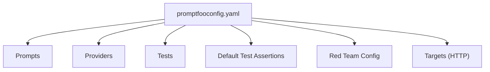

**Diagram sources**
- [examples/openai-model-comparison/promptfooconfig.yaml:1-80](file://examples/openai-model-comparison/promptfooconfig.yaml#L1-L80)
- [examples/rag-eval/promptfooconfig.yaml:1-44](file://examples/rag-eval/promptfooconfig.yaml#L1-L44)
- [examples/redteam-starter/promptfooconfig.yaml:1-34](file://examples/redteam-starter/promptfooconfig.yaml#L1-L34)
- [examples/redteam-api-top-10/promptfooconfig.yaml:1-62](file://examples/redteam-api-top-10/promptfooconfig.yaml#L1-L62)

## Detailed Component Analysis

### Getting Started Example
- Purpose: Introduce core concepts—prompts with variables, multiple providers, and simple assertions
- Execution: Initialize example and run evaluation
- Best practices: Keep prompts and variables explicit; use environment variables for secrets

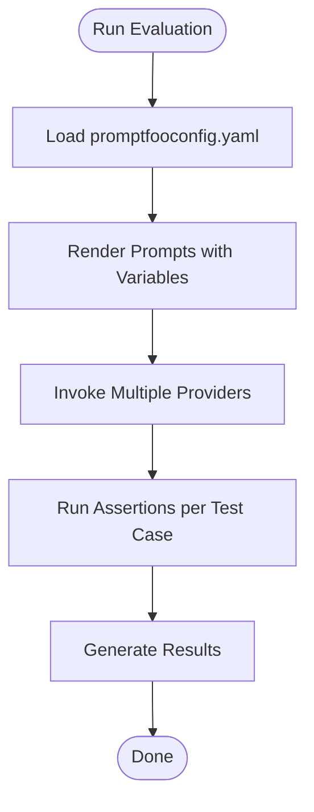

**Diagram sources**
- [examples/getting-started/promptfooconfig.yaml:1-30](file://examples/getting-started/promptfooconfig.yaml#L1-L30)

**Section sources**
- [examples/getting-started/README.md:1-42](file://examples/getting-started/README.md#L1-L42)
- [examples/getting-started/promptfooconfig.yaml:1-30](file://examples/getting-started/promptfooconfig.yaml#L1-L30)

### Model Comparison Example
- Purpose: Compare multiple models on a shared task with default performance constraints
- Patterns: defaultTest cost and latency thresholds; rubric-based assertions; multiple test cases

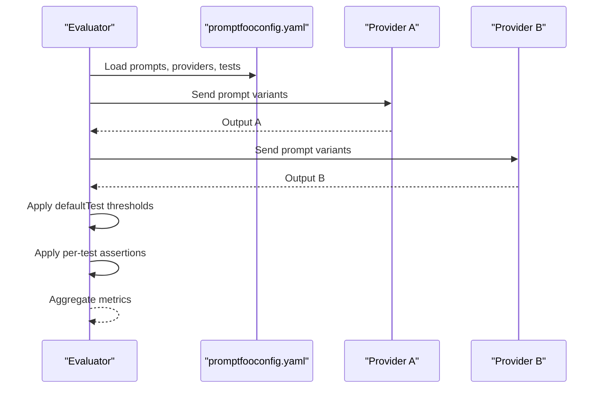

**Diagram sources**
- [examples/openai-model-comparison/promptfooconfig.yaml:1-80](file://examples/openai-model-comparison/promptfooconfig.yaml#L1-L80)

**Section sources**
- [examples/openai-model-comparison/promptfooconfig.yaml:1-80](file://examples/openai-model-comparison/promptfooconfig.yaml#L1-L80)

### RAG Evaluation Example
- Purpose: Evaluate RAG responses across multiple quality dimensions
- Patterns: context files, multiple assertion types, thresholds for relevance and faithfulness

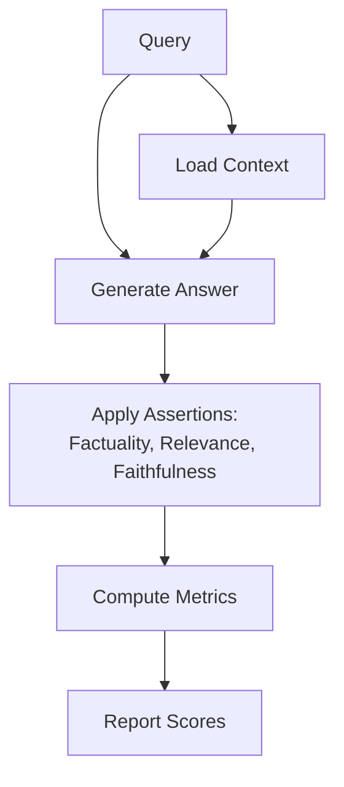

**Diagram sources**
- [examples/rag-eval/promptfooconfig.yaml:1-44](file://examples/rag-eval/promptfooconfig.yaml#L1-L44)

**Section sources**
- [examples/rag-eval/promptfooconfig.yaml:1-44](file://examples/rag-eval/promptfooconfig.yaml#L1-L44)

### Red Team Starter Example
- Purpose: Perform adversarial testing against a target endpoint
- Patterns: targets with HTTP configuration, redteam plugins and strategies

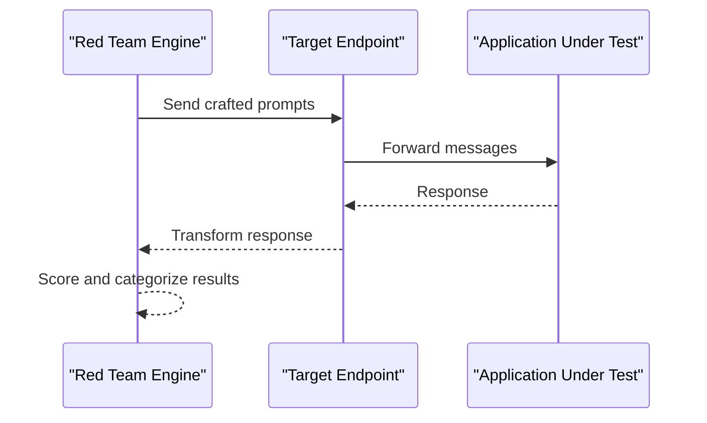

**Diagram sources**
- [examples/redteam-starter/promptfooconfig.yaml:1-34](file://examples/redteam-starter/promptfooconfig.yaml#L1-L34)

**Section sources**
- [examples/redteam-starter/promptfooconfig.yaml:1-34](file://examples/redteam-starter/promptfooconfig.yaml#L1-L34)

### OWASP API Top 10 Red Team Example
- Purpose: Align adversarial testing with API security risks
- Patterns: session ID handling, purpose statement, OWASP plugin, extended timeouts

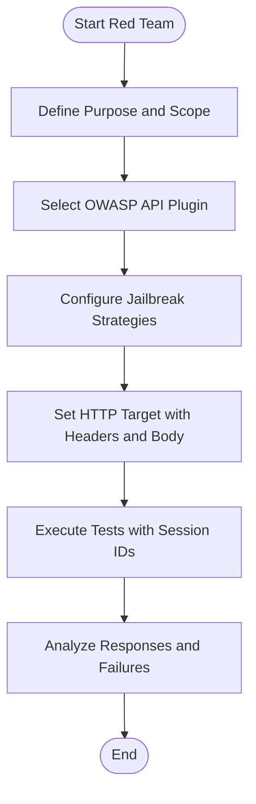

**Diagram sources**
- [examples/redteam-api-top-10/promptfooconfig.yaml:1-62](file://examples/redteam-api-top-10/promptfooconfig.yaml#L1-L62)

**Section sources**
- [examples/redteam-api-top-10/promptfooconfig.yaml:1-62](file://examples/redteam-api-top-10/promptfooconfig.yaml#L1-L62)

### LangChain Integration Example
- Purpose: Evaluate a LangChain chain via a Python provider
- Patterns: provider pointing to a Python script; multiple math problems as test variables

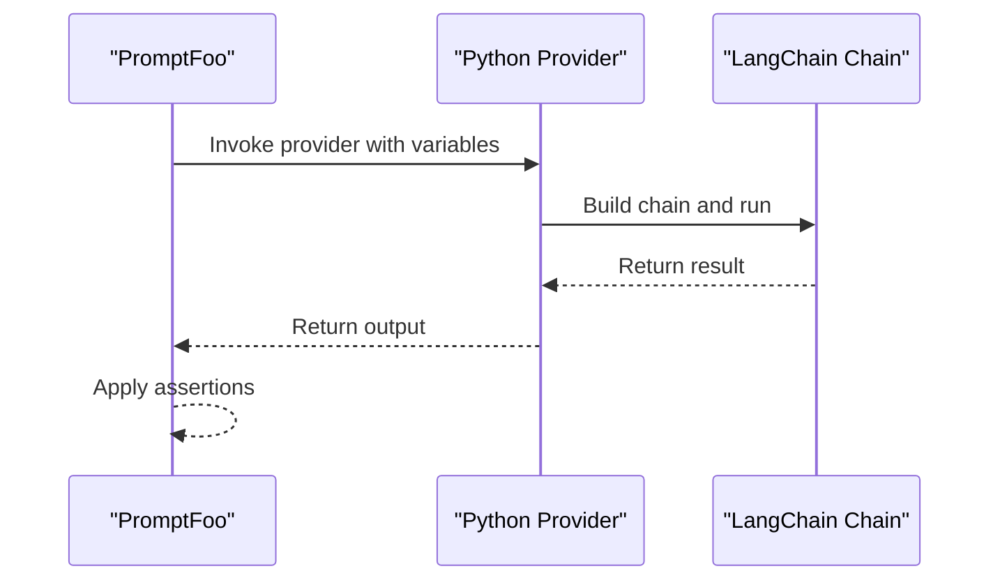

**Diagram sources**
- [examples/langchain-python/promptfooconfig.yaml:1-22](file://examples/langchain-python/promptfooconfig.yaml#L1-L22)

**Section sources**
- [examples/langchain-python/promptfooconfig.yaml:1-22](file://examples/langchain-python/promptfooconfig.yaml#L1-L22)

### CrewAI Evaluation Example
- Purpose: Evaluate CrewAI agents returning structured JSON
- Patterns: custom provider, default JSON assertions, role-specific validations

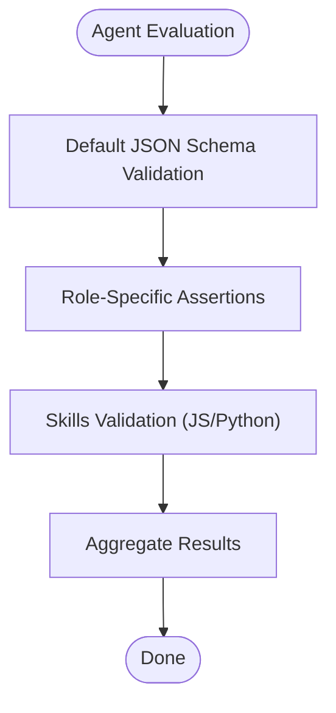

**Diagram sources**
- [examples/crewai/promptfooconfig.yaml:1-79](file://examples/crewai/promptfooconfig.yaml#L1-L79)

**Section sources**
- [examples/crewai/promptfooconfig.yaml:1-79](file://examples/crewai/promptfooconfig.yaml#L1-L79)

### LangGraph Agent Example
- Purpose: Evaluate a LangGraph research agent with JSON schema assertions
- Patterns: provider pointing to a Python script, JSON schema validation

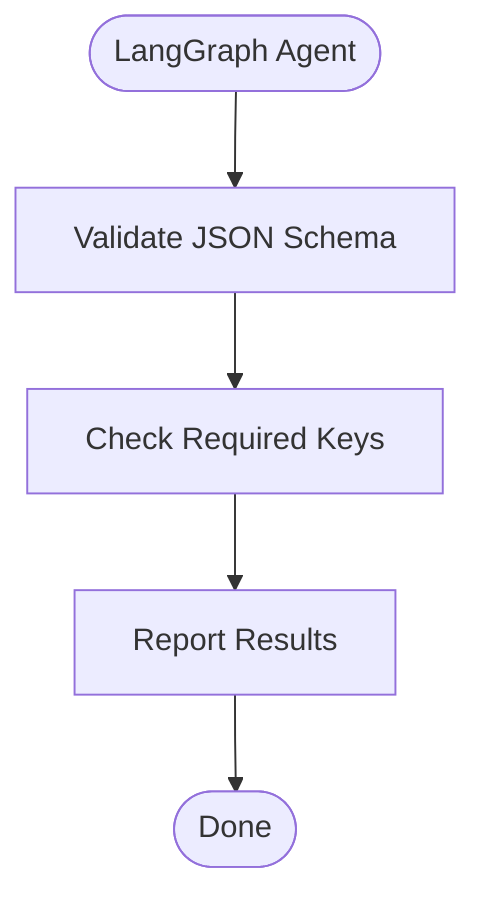

**Diagram sources**
- [examples/langgraph/promptfooconfig.yaml:1-36](file://examples/langgraph/promptfooconfig.yaml#L1-L36)

**Section sources**
- [examples/langgraph/promptfooconfig.yaml:1-36](file://examples/langgraph/promptfooconfig.yaml#L1-L36)

### OpenAI Agents Example
- Purpose: Evaluate handoffs between multiple OpenAI Agents
- Patterns: multiple providers with different agent types, rubric-based assertions

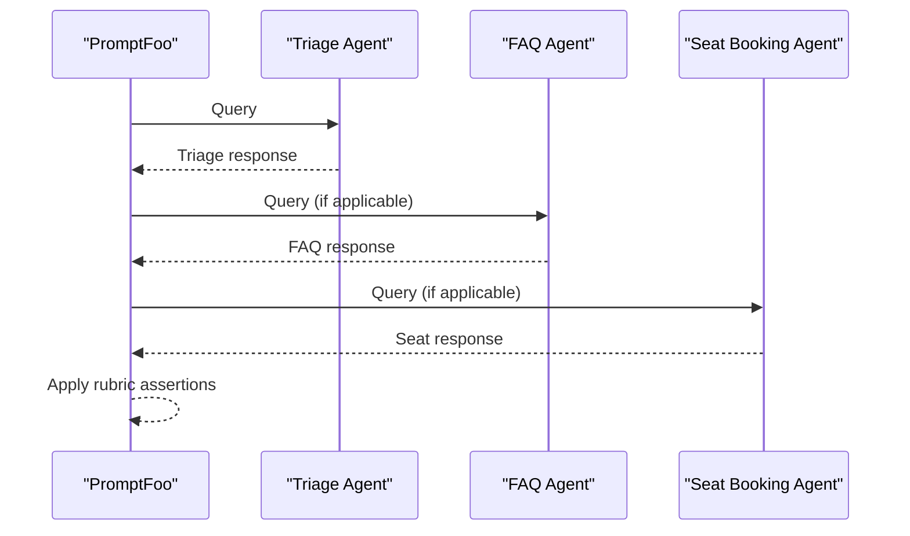

**Diagram sources**
- [examples/openai-agents/promptfooconfig.yaml:1-49](file://examples/openai-agents/promptfooconfig.yaml#L1-L49)

**Section sources**
- [examples/openai-agents/promptfooconfig.yaml:1-49](file://examples/openai-agents/promptfooconfig.yaml#L1-L49)

### Claude Agent SDK Example
- Purpose: Evaluate Claude Agent SDK with a basic task
- Patterns: Claude Agent SDK provider, simple assertions

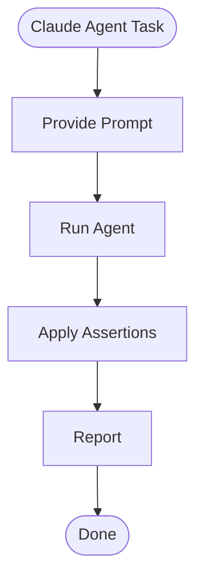

**Diagram sources**
- [examples/claude-agent-sdk/basic/promptfooconfig.yaml:1-17](file://examples/claude-agent-sdk/basic/promptfooconfig.yaml#L1-L17)

**Section sources**
- [examples/claude-agent-sdk/basic/promptfooconfig.yaml:1-17](file://examples/claude-agent-sdk/basic/promptfooconfig.yaml#L1-L17)

### Docker Providers Example
- Purpose: Compare local models via Docker images
- Patterns: docker provider id, simple prompt and assertion

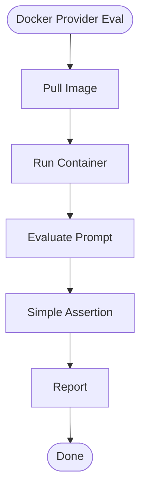

**Diagram sources**
- [examples/docker/promptfooconfig.comparison.simple.yaml:1-16](file://examples/docker/promptfooconfig.comparison.simple.yaml#L1-L16)

**Section sources**
- [examples/docker/promptfooconfig.comparison.simple.yaml:1-16](file://examples/docker/promptfooconfig.comparison.simple.yaml#L1-L16)

### Custom Provider Example
- Purpose: Implement a custom provider in JavaScript and reuse variables from CSV
- Patterns: provider id pointing to a script, CSV-backed test cases

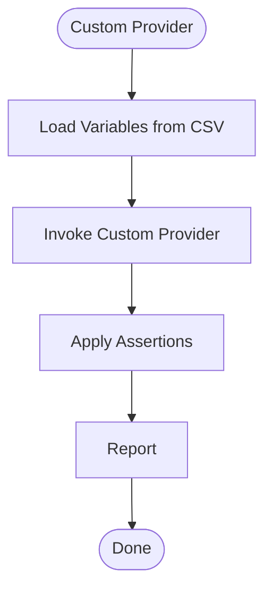

**Diagram sources**
- [examples/custom-provider/promptfooconfig.yaml:1-23](file://examples/custom-provider/promptfooconfig.yaml#L1-L23)

**Section sources**
- [examples/custom-provider/promptfooconfig.yaml:1-23](file://examples/custom-provider/promptfooconfig.yaml#L1-L23)

### BERTScore Similarity Example
- Purpose: Semantic similarity evaluation using BERTScore via a Python assertion
- Patterns: custom Python assertion with threshold

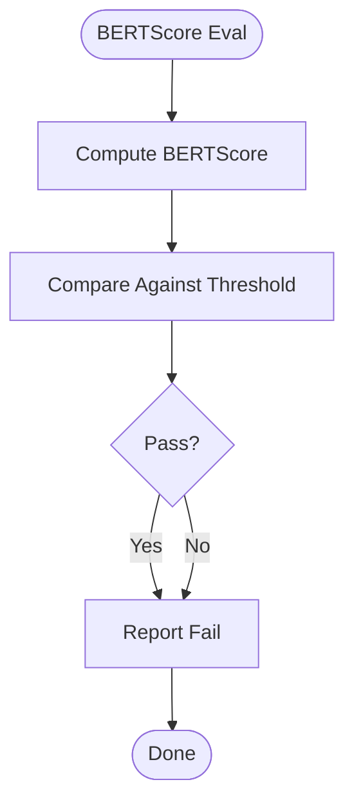

**Diagram sources**
- [examples/bert-score/promptfooconfig.yaml:1-26](file://examples/bert-score/promptfooconfig.yaml#L1-L26)

**Section sources**
- [examples/bert-score/promptfooconfig.yaml:1-26](file://examples/bert-score/promptfooconfig.yaml#L1-L26)

### Amazon Bedrock Example
- Purpose: Evaluate multiple Bedrock models and configure embeddings provider overrides
- Patterns: multiple Bedrock providers, defaultTest embedding override, many test cases

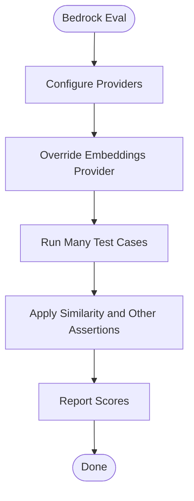

**Diagram sources**
- [examples/amazon-bedrock/promptfooconfig.yaml:1-129](file://examples/amazon-bedrock/promptfooconfig.yaml#L1-L129)

**Section sources**
- [examples/amazon-bedrock/promptfooconfig.yaml:1-129](file://examples/amazon-bedrock/promptfooconfig.yaml#L1-L129)

## Dependency Analysis
- Cohesion: Each example focuses on a single evaluation pattern or integration
- Coupling: Examples depend on configuration files and optional external scripts/providers
- External dependencies: Many examples rely on provider SDKs (OpenAI, Anthropic, Bedrock), Python packages, or HTTP endpoints
- Red team targets: Some examples depend on external services exposed via HTTP

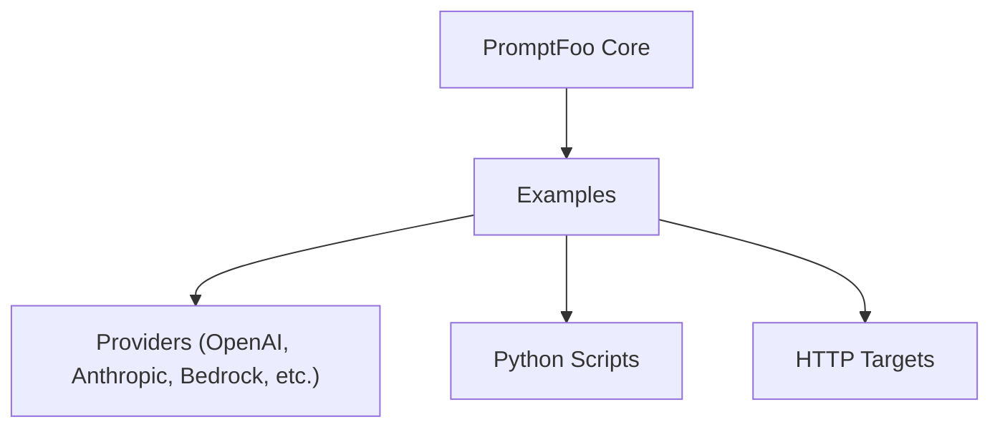

[No sources needed since this diagram shows conceptual relationships]

## Performance Considerations
- Cost and latency: Use defaultTest cost and latency thresholds to constrain resource usage
- Embeddings: Configure embeddings providers explicitly to avoid repeated initialization overhead
- Assertions: Prefer lightweight assertions for large-scale evaluations; offload heavy checks to external scripts
- Red team: Increase timeouts for slow operations (e.g., MCP tool calls) and isolate sessions to prevent cross-contamination

[No sources needed since this section provides general guidance]

## Troubleshooting Guide
- Secrets and environment variables: Set API keys via environment variables or a .env file; avoid committing secrets
- HTTP targets: Ensure headers, body, and response parsing are correct; verify timeouts and session IDs
- Custom providers: Validate provider signatures and error handling; confirm script paths are correct
- Assertions: For custom assertions, ensure scripts return deterministic results and handle edge cases
- Red team: Confirm plugin and strategy combinations align with target capabilities; validate purpose statements and sensitive data handling

**Section sources**
- [examples/getting-started/README.md:11-25](file://examples/getting-started/README.md#L11-L25)
- [examples/redteam-api-top-10/promptfooconfig.yaml:4-10](file://examples/redteam-api-top-10/promptfooconfig.yaml#L4-L10)

## Conclusion
PromptFoo’s examples provide a practical foundation for evaluating prompts, models, agents, and systems across domains and frameworks. By studying these patterns, you can quickly adapt configurations for your use cases, integrate with popular tools, and build robust evaluation workflows tailored to your needs.

[No sources needed since this section summarizes without analyzing specific files]

## Appendices
- Getting started: Initialize and run the minimal example to become familiar with the CLI and configuration
- Model comparison: Extend defaultTest thresholds and add rubric-based assertions for nuanced evaluation
- RAG evaluation: Combine context files with multiple quality metrics for comprehensive assessment
- Red team testing: Start with starter configurations and evolve to OWASP-aligned strategies
- Agent integrations: Connect LangChain, CrewAI, and OpenAI Agents via custom providers
- Specialized providers: Use Bedrock, Docker, and custom providers to broaden coverage

[No sources needed since this section provides general guidance]