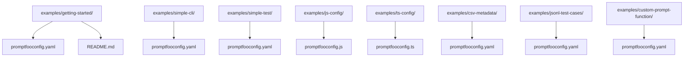
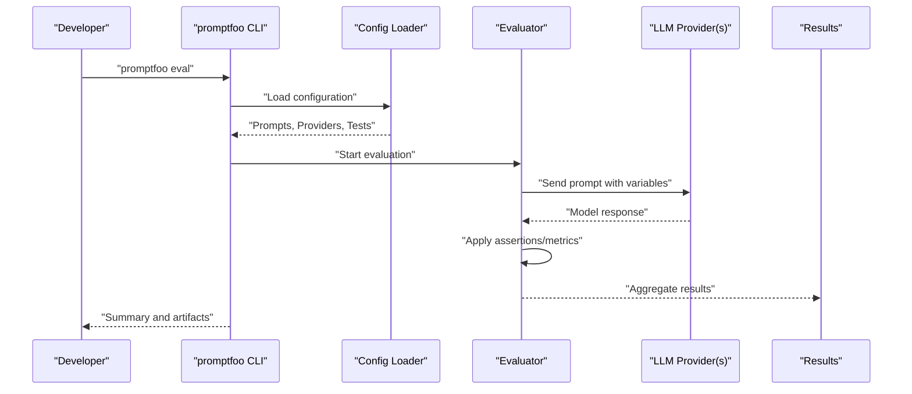
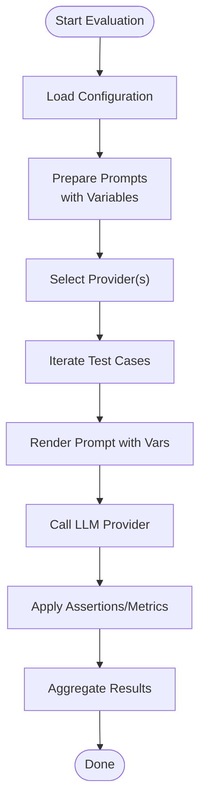
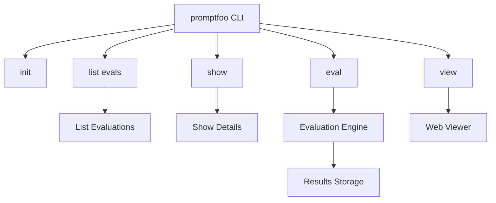

# Getting Started Examples

<cite>
**Referenced Files in This Document**
- [README.md](file://README.md)
- [examples/getting-started/README.md](file://examples/getting-started/README.md)
- [examples/getting-started/promptfooconfig.yaml](file://examples/getting-started/promptfooconfig.yaml)
- [examples/simple-cli/promptfooconfig.yaml](file://examples/simple-cli/promptfooconfig.yaml)
- [examples/simple-test/promptfooconfig.yaml](file://examples/simple-test/promptfooconfig.yaml)
- [examples/js-config/promptfooconfig.js](file://examples/js-config/promptfooconfig.js)
- [examples/ts-config/promptfooconfig.ts](file://examples/ts-config/promptfooconfig.ts)
- [examples/csv-metadata/promptfooconfig.yaml](file://examples/csv-metadata/promptfooconfig.yaml)
- [examples/jsonl-test-cases/promptfooconfig.yaml](file://examples/jsonl-test-cases/promptfooconfig.yaml)
- [examples/custom-prompt-function/promptfooconfig.yaml](file://examples/custom-prompt-function/promptfooconfig.yaml)
- [site/docs/getting-started.md](file://site/docs/getting-started.md)
- [site/docs/usage/command-line.md](file://site/docs/usage/command-line.md)
- [src/commands/list.ts](file://src/commands/list.ts)
- [src/commands/show.ts](file://src/commands/show.ts)
</cite>

## Table of Contents
1. [Introduction](#introduction)
2. [Project Structure](#project-structure)
3. [Core Components](#core-components)
4. [Architecture Overview](#architecture-overview)
5. [Detailed Component Analysis](#detailed-component-analysis)
6. [Dependency Analysis](#dependency-analysis)
7. [Performance Considerations](#performance-considerations)
8. [Troubleshooting Guide](#troubleshooting-guide)
9. [Conclusion](#conclusion)
10. [Appendices](#appendices)

## Introduction
This guide helps you quickly set up and run your first LLM evaluation using PromptFoo. You will learn how to:
- Configure prompts and providers
- Define simple test cases
- Run evaluations via CLI
- Interpret results and understand metrics
- Explore configuration formats (YAML, JavaScript, TypeScript)
- Load test cases from CSV and JSONL

The examples focus on a basic translation workflow so you can see how different prompts and models behave on the same inputs.

## Project Structure
The getting-started materials are organized under the examples directory. The minimal setup includes:
- A configuration file (YAML, JavaScript, or TypeScript)
- Optional prompt files
- Optional test case files (CSV or JSONL)

**Diagram sources**
- [examples/getting-started/README.md:1-42](file://examples/getting-started/README.md#L1-L42)
- [examples/getting-started/promptfooconfig.yaml:1-30](file://examples/getting-started/promptfooconfig.yaml#L1-L30)
- [examples/simple-cli/promptfooconfig.yaml:1-24](file://examples/simple-cli/promptfooconfig.yaml#L1-L24)
- [examples/simple-test/promptfooconfig.yaml:1-60](file://examples/simple-test/promptfooconfig.yaml#L1-L60)
- [examples/js-config/promptfooconfig.js:1-32](file://examples/js-config/promptfooconfig.js#L1-L32)
- [examples/ts-config/promptfooconfig.ts:1-39](file://examples/ts-config/promptfooconfig.ts#L1-L39)
- [examples/csv-metadata/promptfooconfig.yaml:1-13](file://examples/csv-metadata/promptfooconfig.yaml#L1-L13)
- [examples/jsonl-test-cases/promptfooconfig.yaml:1-12](file://examples/jsonl-test-cases/promptfooconfig.yaml#L1-L12)
- [examples/custom-prompt-function/promptfooconfig.yaml:1-100](file://examples/custom-prompt-function/promptfooconfig.yaml#L1-L100)

**Section sources**
- [README.md:23-46](file://README.md#L23-L46)
- [examples/getting-started/README.md:1-42](file://examples/getting-started/README.md#L1-L42)

## Core Components
- Configuration file: Defines prompts, providers, and tests. Supported formats:
  - YAML: [examples/getting-started/promptfooconfig.yaml](file://examples/getting-started/promptfooconfig.yaml)
  - JavaScript: [examples/js-config/promptfooconfig.js](file://examples/js-config/promptfooconfig.js)
  - TypeScript: [examples/ts-config/promptfooconfig.ts](file://examples/ts-config/promptfooconfig.ts)
- Test cases:
  - YAML arrays: [examples/simple-cli/promptfooconfig.yaml](file://examples/simple-cli/promptfooconfig.yaml)
  - Assertions and templates: [examples/simple-test/promptfooconfig.yaml](file://examples/simple-test/promptfooconfig.yaml)
  - CSV-backed: [examples/csv-metadata/promptfooconfig.yaml](file://examples/csv-metadata/promptfooconfig.yaml)
  - JSONL-backed: [examples/jsonl-test-cases/promptfooconfig.yaml](file://examples/jsonl-test-cases/promptfooconfig.yaml)
- Prompt rendering and dynamic sources: [examples/custom-prompt-function/promptfooconfig.yaml](file://examples/custom-prompt-function/promptfooconfig.yaml)

Key concepts:
- Prompts support variables like {{variable_name}} for dynamic inputs.
- Providers specify the LLM APIs to evaluate (e.g., openai:gpt-5.2).
- Tests define variable sets and optional assertions for grading.

**Section sources**
- [examples/getting-started/promptfooconfig.yaml:7-29](file://examples/getting-started/promptfooconfig.yaml#L7-L29)
- [examples/simple-cli/promptfooconfig.yaml:4-23](file://examples/simple-cli/promptfooconfig.yaml#L4-L23)
- [examples/simple-test/promptfooconfig.yaml:4-59](file://examples/simple-test/promptfooconfig.yaml#L4-L59)
- [examples/js-config/promptfooconfig.js:1-32](file://examples/js-config/promptfooconfig.js#L1-L32)
- [examples/ts-config/promptfooconfig.ts:1-39](file://examples/ts-config/promptfooconfig.ts#L1-L39)
- [examples/csv-metadata/promptfooconfig.yaml:4-12](file://examples/csv-metadata/promptfooconfig.yaml#L4-L12)
- [examples/jsonl-test-cases/promptfooconfig.yaml:4-11](file://examples/jsonl-test-cases/promptfooconfig.yaml#L4-L11)
- [examples/custom-prompt-function/promptfooconfig.yaml:4-100](file://examples/custom-prompt-function/promptfooconfig.yaml#L4-L100)

## Architecture Overview
The evaluation pipeline follows a predictable flow: configuration is loaded, prompts are prepared, providers are invoked, outputs are scored, and results are summarized.

[No sources needed since this diagram shows conceptual workflow, not actual code structure]

## Detailed Component Analysis

### Getting Started Example Walkthrough
Step-by-step setup and execution:
1. Initialize the example:
   - Use the CLI to scaffold the getting-started project.
   - Reference: [examples/getting-started/README.md:5-7](file://examples/getting-started/README.md#L5-L7)
2. Set your API key:
   - Export your provider key as an environment variable or use a .env file.
   - Reference: [examples/getting-started/README.md:13-19](file://examples/getting-started/README.md#L13-L19)
3. Run the evaluation:
   - Execute the eval command to run the configured tests.
   - Reference: [examples/getting-started/README.md:21-25](file://examples/getting-started/README.md#L21-L25)
4. View results:
   - Use the view command to open the web results viewer.
   - Reference: [README.md:42-44](file://README.md#L42-L44)

What the example demonstrates:
- Two prompts for translation
- Two providers/models
- Two test cases with different languages and inputs
- Assertions for expected outputs

References:
- [examples/getting-started/README.md:27-42](file://examples/getting-started/README.md#L27-L42)
- [examples/getting-started/promptfooconfig.yaml:1-30](file://examples/getting-started/promptfooconfig.yaml#L1-L30)

**Section sources**
- [examples/getting-started/README.md:1-42](file://examples/getting-started/README.md#L1-L42)
- [examples/getting-started/promptfooconfig.yaml:1-30](file://examples/getting-started/promptfooconfig.yaml#L1-L30)
- [README.md:23-46](file://README.md#L23-L46)

### Configuration Formats: YAML, JavaScript, TypeScript
- YAML configuration is ideal for quick prototypes and readability.
  - Example: [examples/getting-started/promptfooconfig.yaml](file://examples/getting-started/promptfooconfig.yaml)
  - Example: [examples/simple-cli/promptfooconfig.yaml](file://examples/simple-cli/promptfooconfig.yaml)
- JavaScript configuration enables programmatic setups and dynamic logic.
  - Example: [examples/js-config/promptfooconfig.js](file://examples/js-config/promptfooconfig.js)
- TypeScript configuration adds type safety for larger projects.
  - Example: [examples/ts-config/promptfooconfig.ts](file://examples/ts-config/promptfooconfig.ts)

Best practices:
- Keep secrets in environment variables or .env files.
- Use descriptive descriptions for configs to improve traceability.
- Prefer arrays for small, static test sets; use file:// for large datasets.

**Section sources**
- [examples/getting-started/promptfooconfig.yaml:1-30](file://examples/getting-started/promptfooconfig.yaml#L1-L30)
- [examples/simple-cli/promptfooconfig.yaml:1-24](file://examples/simple-cli/promptfooconfig.yaml#L1-L24)
- [examples/js-config/promptfooconfig.js:1-32](file://examples/js-config/promptfooconfig.js#L1-L32)
- [examples/ts-config/promptfooconfig.ts:1-39](file://examples/ts-config/promptfooconfig.ts#L1-L39)

### Test Case Patterns: Assertions, Templates, and Data Sources
- Assertions: Define how outputs are evaluated (exact match, substring, JSON validity, similarity, LLM rubrics).
  - Example: [examples/simple-test/promptfooconfig.yaml](file://examples/simple-test/promptfooconfig.yaml)
- Assertion templates: Reuse common checks across tests.
  - Example: [examples/simple-test/promptfooconfig.yaml:56-60](file://examples/simple-test/promptfooconfig.yaml#L56-L60)
- CSV-backed tests: Load prompts and variables from CSV.
  - Example: [examples/csv-metadata/promptfooconfig.yaml](file://examples/csv-metadata/promptfooconfig.yaml)
- JSONL-backed tests: Stream test cases from JSONL.
  - Example: [examples/jsonl-test-cases/promptfooconfig.yaml](file://examples/jsonl-test-cases/promptfooconfig.yaml)

**Diagram sources**
- [examples/simple-test/promptfooconfig.yaml:4-59](file://examples/simple-test/promptfooconfig.yaml#L4-L59)
- [examples/csv-metadata/promptfooconfig.yaml:4-12](file://examples/csv-metadata/promptfooconfig.yaml#L4-L12)
- [examples/jsonl-test-cases/promptfooconfig.yaml:4-11](file://examples/jsonl-test-cases/promptfooconfig.yaml#L4-L11)

**Section sources**
- [examples/simple-test/promptfooconfig.yaml:1-60](file://examples/simple-test/promptfooconfig.yaml#L1-L60)
- [examples/csv-metadata/promptfooconfig.yaml:1-13](file://examples/csv-metadata/promptfooconfig.yaml#L1-L13)
- [examples/jsonl-test-cases/promptfooconfig.yaml:1-12](file://examples/jsonl-test-cases/promptfooconfig.yaml#L1-L12)

### Dynamic Prompt Sources and Function-Based Rendering
PromptFoo supports loading prompts from files, globs, and language-specific modules (JavaScript, TypeScript, Python). This enables dynamic prompt generation and templating.

- File-based and glob patterns: [examples/custom-prompt-function/promptfooconfig.yaml](file://examples/custom-prompt-function/promptfooconfig.yaml)
- Echo provider for previewing rendered prompts without LLM calls: [examples/custom-prompt-function/promptfooconfig.yaml:80-81](file://examples/custom-prompt-function/promptfooconfig.yaml#L80-L81)

Use cases:
- Template engines (Jinja2, etc.) via file://*.j2
- Multiple prompt variants in a single config
- Dynamic configuration per prompt

**Section sources**
- [examples/custom-prompt-function/promptfooconfig.yaml:1-100](file://examples/custom-prompt-function/promptfooconfig.yaml#L1-L100)

## Dependency Analysis
The CLI commands integrate with the evaluation engine and result storage. The following diagram shows how top-level commands relate to evaluation and viewing.

**Diagram sources**
- [src/commands/list.ts:192-230](file://src/commands/list.ts#L192-L230)
- [src/commands/show.ts:174-197](file://src/commands/show.ts#L174-L197)

**Section sources**
- [src/commands/list.ts:192-230](file://src/commands/list.ts#L192-L230)
- [src/commands/show.ts:174-197](file://src/commands/show.ts#L174-L197)

## Performance Considerations
- Use caching to avoid re-running identical prompt/provider/test combinations.
- Limit concurrency during development to reduce API costs and rate limits.
- Prefer smaller test sets while iterating; move to CSV/JSONL for scale.
- Use the echo provider to preview prompts and reduce LLM calls during early stages.

[No sources needed since this section provides general guidance]

## Troubleshooting Guide
Common beginner issues and resolutions:
- Missing API keys:
  - Ensure your provider key is exported or placed in a .env file.
  - Reference: [examples/getting-started/README.md:13-19](file://examples/getting-started/README.md#L13-L19)
- Permission denied when writing results:
  - Verify write permissions in the current directory and any configured output paths.
- Network errors or rate limits:
  - Retry failed results from the last evaluation using the retry flag.
  - Reference: [site/docs/usage/command-line.md:135-144](file://site/docs/usage/command-line.md#L135-L144)
- Unexpected exit codes:
  - The eval command exits with a special code when pass rates fall below thresholds.
  - Reference: [site/docs/usage/command-line.md:124](file://site/docs/usage/command-line.md#L124)
- Viewing previous evaluations:
  - List evaluations and use the show command to inspect details.
  - References: [src/commands/list.ts:192-230](file://src/commands/list.ts#L192-L230), [src/commands/show.ts:174-197](file://src/commands/show.ts#L174-L197)

**Section sources**
- [examples/getting-started/README.md:13-19](file://examples/getting-started/README.md#L13-L19)
- [site/docs/usage/command-line.md:124-144](file://site/docs/usage/command-line.md#L124-L144)
- [src/commands/list.ts:192-230](file://src/commands/list.ts#L192-L230)
- [src/commands/show.ts:174-197](file://src/commands/show.ts#L174-L197)

## Conclusion
You now have the essentials to run your first evaluation:
- Choose a configuration format (YAML/JS/TS)
- Define prompts with variables and providers
- Create simple tests and assertions
- Run eval and view results
- Scale up with CSV/JSONL and dynamic prompt sources

As you grow, explore advanced assertion types, provider-specific configs, and CI/CD integration.

[No sources needed since this section summarizes without analyzing specific files]

## Appendices

### Quick Start Commands
- Install and initialize:
  - Reference: [README.md:25-28](file://README.md#L25-L28)
- Set API key:
  - Reference: [examples/getting-started/README.md:13-19](file://examples/getting-started/README.md#L13-L19)
- Run evaluation and view results:
  - Reference: [README.md:40-44](file://README.md#L40-L44)

### CLI Usage Patterns
- Init via CLI or Web UI:
  - References: [site/docs/getting-started.md:76-125](file://site/docs/getting-started.md#L76-L125)
- Resume or retry evaluations:
  - References: [site/docs/usage/command-line.md:126-144](file://site/docs/usage/command-line.md#L126-L144)

**Section sources**
- [README.md:25-44](file://README.md#L25-L44)
- [site/docs/getting-started.md:76-125](file://site/docs/getting-started.md#L76-L125)
- [site/docs/usage/command-line.md:126-144](file://site/docs/usage/command-line.md#L126-L144)