# Model Comparison Examples

<cite>
**Referenced Files in This Document**
- [claude-vs-gpt/promptfooconfig.yaml](file://examples/claude-vs-gpt/promptfooconfig.yaml)
- [claude-vs-gpt/README.md](file://examples/claude-vs-gpt/README.md)
- [claude-vs-gpt/prompt.yaml](file://examples/claude-vs-gpt/prompt.yaml)
- [gpt-4o-temperature-comparison/promptfooconfig.yaml](file://examples/gpt-4o-temperature-comparison/promptfooconfig.yaml)
- [open-source-comparison/promptfooconfig.yaml](file://examples/open-source-comparison/promptfooconfig.yaml)
- [mistral-llama-comparison/promptfooconfig.yaml](file://examples/mistral-llama-comparison/promptfooconfig.yaml)
- [openai-model-comparison/promptfooconfig.yaml](file://examples/openai-model-comparison/promptfooconfig.yaml)
- [docker/promptfooconfig.comparison.simple.yaml](file://examples/docker/promptfooconfig.comparison.simple.yaml)
- [llama-gpt-comparison/promptfooconfig.yaml](file://examples/llama-gpt-comparison/promptfooconfig.yaml)
- [gpt-vs-claude-vs-gemini/promptfooconfig.yaml](file://examples/gpt-vs-claude-vs-gemini/promptfooconfig.yaml)
- [deepseek-r1-vs-openai-o1/promptfooconfig.yaml](file://examples/deepseek-r1-vs-openai-o1/promptfooconfig.yaml)
- [ollama/promptfooconfig.yaml](file://examples/ollama/promptfooconfig.yaml)
- [amazon-bedrock/promptfooconfig.yaml](file://examples/amazon-bedrock/promptfooconfig.yaml)
- [amazon-bedrock/README.md](file://examples/amazon-bedrock/README.md)
- [amazon-bedrock/prompts.txt](file://examples/amazon-bedrock/prompts.txt)
- [amazon-bedrock/converse-images.yaml](file://examples/amazon-bedrock/promptfooconfig.converse-images.yaml)
- [amazon-bedrock/converse-system.yaml](file://examples/amazon-bedrock/promptfooconfig.converse-system.yaml)
- [amazon-bedrock/converse-tools.yaml](file://examples/amazon-bedrock/promptfooconfig.converse-tools.yaml)
- [amazon-bedrock/converse.yaml](file://examples/amazon-bedrock/promptfooconfig.converse.yaml)
- [amazon-bedrock/inference-profiles.yaml](file://examples/amazon-bedrock/promptfooconfig.inference-profiles.yaml)
- [amazon-bedrock/inference-profiles-simple.yaml](file://examples/amazon-bedrock/promptfooconfig.inference-profiles-simple.yaml)
- [amazon-bedrock/nova-2-converse.yaml](file://examples/amazon-bedrock/promptfooconfig.nova-2-converse.yaml)
- [amazon-bedrock/nova-2-reasoning.yaml](file://examples/amazon-bedrock/promptfooconfig.nova-2-reasoning.yaml)
- [amazon-bedrock/nova.multimodal.yaml](file://examples/amazon-bedrock/promptfooconfig.nova.multimodal.yaml)
- [amazon-bedrock/nova.tool.yaml](file://examples/amazon-bedrock/promptfooconfig.nova.tool.yaml)
- [amazon-bedrock/nova.yaml](file://examples/amazon-bedrock/promptfooconfig.nova.yaml)
- [amazon-bedrock/openai.yaml](file://examples/amazon-bedrock/promptfooconfig.openai.yaml)
- [amazon-bedrock/qwen.yaml](file://examples/amazon-bedrock/promptfooconfig.qwen.yaml)
- [amazon-bedrock/titan-text.yaml](file://examples/amazon-bedrock/promptfooconfig.titan-text.yaml)
- [amazon-bedrock/llama-vision.yaml](file://examples/amazon-bedrock/promptfooconfig.llama-vision.yaml)
- [amazon-bedrock/llama.yaml](file://examples/amazon-bedrock/promptfooconfig.llama.yaml)
- [amazon-bedrock/mistral.yaml](file://examples/amazon-bedrock/promptfooconfig.mistral.yaml)
- [amazon-bedrock/kb.yaml](file://examples/amazon-bedrock/promptfooconfig.kb.yaml)
- [amazon-bedrock/a21.yaml](file://examples/amazon-bedrock/promptfooconfig.a21.yaml)
- [amazon-bedrock/nova_sonic_prompt.js](file://examples/amazon-bedrock/nova_sonic_prompt.js)
- [amazon-bedrock/llama_vision_prompt.json](file://examples/amazon-bedrock/llama_vision_prompt.json)
- [amazon-bedrock/converse_image_prompt.json](file://examples/amazon-bedrock/converse_image_prompt.json)
- [amazon-bedrock/prompts.txt](file://examples/amazon-bedrock/prompts.txt)
- [amazon-sagemaker/llama-vs-mistral.yaml](file://examples/amazon-sagemaker/promptfooconfig.llama-vs-mistral.yaml)
- [amazon-sagemaker/multimodel.yaml](file://examples/amazon-sagemaker/promptfooconfig.multimodel.yaml)
- [amazon-sagemaker/jumpstart.yaml](file://examples/amazon-sagemaker/promptfooconfig.jumpstart.yaml)
- [amazon-sagemaker/embedding.yaml](file://examples/amazon-sagemaker/promptfooconfig.embedding.yaml)
- [amazon-sagemaker/transform.yaml](file://examples/amazon-sagemaker/promptfooconfig.transform.yaml)
- [amazon-sagemaker/test-sagemaker-provider.js](file://examples/amazon-sagemaker/test-sagemaker-provider.js)
- [amazon-sagemaker/transform.js](file://examples/amazon-sagemaker/transform.js)
- [amazon-sagemaker/README.md](file://examples/amazon-sagemaker/README.md)
- [cohere-benchmark/promptfooconfig.yaml](file://examples/cohere-benchmark/promptfooconfig.yaml)
- [cohere-benchmark/README.md](file://examples/cohere-benchmark/README.md)
- [dbrx-benchmark/promptfooconfig.yaml](file://examples/dbrx-benchmark/promptfooconfig.yaml)
- [dbrx-benchmark/README.md](file://examples/dbrx-benchmark/README.md)
- [harmbench/promptfooconfig.yaml](file://examples/harmbench/promptfooconfig.yaml)
- [harmbench/README.md](file://examples/harmbench/README.md)
- [harmbench/harmbench_behaviors_text_all.csv](file://examples/harmbench/harmbench_behaviors_text_all.csv)
- [grok-4-political-bias/promptfooconfig.yaml](file://examples/grok-4-political-bias/promptfooconfig.yaml)
- [grok-4-political-bias/political-bias-rubric.yaml](file://examples/grok-4-political-bias/political-bias-rubric.yaml)
- [grok-4-political-bias/political-questions.csv](file://examples/grok-4-political-bias/political-questions.csv)
- [grok-4-political-bias/README.md](file://examples/grok-4-political-bias/README.md)
- [g-eval/promptfooconfig.yaml](file://examples/g-eval/promptfooconfig.yaml)
- [g-eval/README.md](file://examples/g-eval/README.md)
- [bert-score/promptfooconfig.yaml](file://examples/bert-score/promptfooconfig.yaml)
- [bert-score/README.md](file://examples/bert-score/README.md)
- [bert-score/bertscore_check.py](file://examples/bert-score/bertscore_check.py)
- [huggingface-dataset-factuality/promptfooconfig.yaml](file://examples/huggingface-dataset-factuality/promptfooconfig.yaml)
- [huggingface-dataset-factuality/dataset_loader.ts](file://examples/huggingface-dataset-factuality/dataset_loader.ts)
- [huggingface-dataset-factuality/README.md](file://examples/huggingface-dataset-factuality/README.md)
- [huggingface-hle/promptfooconfig.yaml](file://examples/huggingface-hle/promptfooconfig.yaml)
- [huggingface-hle/prompt.py](file://examples/huggingface-hle/prompt.py)
- [huggingface-hle/README.md](file://examples/huggingface-hle/README.md)
- [huggingface-hate-speech-detection/promptfooconfig.yaml](file://examples/huggingface-hate-speech-detection/promptfooconfig.yaml)
- [huggingface-hate-speech-detection/README.md](file://examples/huggingface-hate-speech-detection/README.md)
- [huggingface-pii/promptfooconfig.yaml](file://examples/huggingface-pii/promptfooconfig.yaml)
- [huggingface-pii/README.md](file://examples/huggingface-pii/README.md)
- [huggingface-similarity/promptfooconfig.yaml](file://examples/huggingface-similarity/promptfooconfig.yaml)
- [huggingface-similarity/README.md](file://examples/huggingface-similarity/README.md)
- [huggingface-inference-endpoint/promptfooconfig.yaml](file://examples/huggingface-inference-endpoint/promptfooconfig.yaml)
- [huggingface-inference-endpoint/README.md](file://examples/huggingface-inference-endpoint/README.md)
- [google-aistudio-gemini/promptfooconfig.yaml](file://examples/google-aistudio-gemini/promptfooconfig.yaml)
- [google-aistudio-gemini/README.md](file://examples/google-aistudio-gemini/README.md)
- [google-aistudio-gemini/system-instruction.txt](file://examples/google-aistudio-gemini/system-instruction.txt)
- [google-aistudio-gemini/image.yaml](file://examples/google-aistudio-gemini/promptfooconfig.image.yaml)
- [google-vertex/promptfooconfig.yaml](file://examples/google-vertex/promptfooconfig.yaml)
- [google-vertex/README.md](file://examples/google-vertex/README.md)
- [google-vertex/image.yaml](file://examples/google-vertex/promptfooconfig.image.yaml)
- [google-vertex/search.yaml](file://examples/google-vertex/promptfooconfig.search.yaml)
- [google-vertex/tools.yaml](file://examples/google-vertex/promptfooconfig.tools.yaml)
- [google-vertex/response-schema.yaml](file://examples/google-vertex/promptfooconfig.response-schema.yaml)
- [google-vertex/response-schema.json](file://examples/google-vertex/response-schema.json)
- [google-vertex-tools/promptfooconfig.yaml](file://examples/google-vertex-tools/promptfooconfig.yaml)
- [google-vertex-tools/README.md](file://examples/google-vertex-tools/README.md)
- [google-vertex-tools/tools.json](file://examples/google-vertex-tools/tools.json)
- [google-vertex-tools/callback.js](file://examples/google-vertex-tools/promptfooconfig-callback.js)
- [google-live/promptfooconfig.yaml](file://examples/google-live/promptfooconfig.yaml)
- [google-live/README.md](file://examples/google-live/README.md)
- [google-live/prompt.yaml](file://examples/google-live/prompt.yaml)
- [google-live/tools.json](file://examples/google-live/tools.json)
- [google-live-audio/promptfooconfig.yaml](file://examples/google-live-audio/promptfooconfig.yaml)
- [google-live-audio/README.md](file://examples/google-live-audio/README.md)
- [google-live-audio/prompt.yaml](file://examples/google-live-audio/prompt.yaml)
- [google-video/promptfooconfig.yaml](file://examples/google-video/promptfooconfig.yaml)
- [google-video/README.md](file://examples/google-video/README.md)
- [google-video/promptfooconfig-image.yaml](file://examples/google-video/promptfooconfig-image.yaml)
- [google-video/promptfooconfig-extension.yaml](file://examples/google-video/promptfooconfig-extension.yaml)
- [google-imagen/promptfooconfig.yaml](file://examples/google-imagen/promptfooconfig.yaml)
- [google-imagen/README.md](file://examples/google-imagen/README.md)
- [google-imagen/promptfooconfig-gemini.yaml](file://examples/google-imagen/promptfooconfig-gemini.yaml)
- [google-imagen/promptfooconfig-advanced.yaml](file://examples/google-imagen/promptfooconfig-advanced.yaml)
- [azure/comparison/promptfooconfig.yaml](file://examples/azure/comparison/promptfooconfig.yaml)
- [azure/README.md](file://examples/azure/README.md)
- [openai-azure-comparison/promptfooconfig.yaml](file://examples/openai-azure-comparison/promptfooconfig.yaml)
- [openai-azure-comparison/README.md](file://examples/openai-azure-comparison/README.md)
- [openai-model-comparison/README.md](file://examples/openai-model-comparison/README.md)
- [open-source-comparison/README.md](file://examples/open-source-comparison/README.md)
- [mistral-llama-comparison/README.md](file://examples/mistral-llama-comparison/README.md)
- [llama-gpt-comparison/README.md](file://examples/llama-gpt-comparison/README.md)
- [gpt-vs-claude-vs-gemini/README.md](file://examples/gpt-vs-claude-vs-gemini/README.md)
- [deepseek-r1-vs-openai-o1/README.md](file://examples/deepseek-r1-vs-openai-o1/README.md)
- [ollama/README.md](file://examples/ollama/README.md)
- [docker/README.md](file://examples/docker/README.md)
- [docker/promptfooconfig.comparison.advanced.yaml](file://examples/docker/README.md)
- [gpt-4o-temperature-comparison/README.md](file://examples/gpt-4o-temperature-comparison/README.md)
- [anthropic/opus-4-6-coding/README.md](file://examples/anthropic/opus-4-6-coding/README.md)
- [anthropic/opus-4-6-coding/promptfooconfig.yaml](file://examples/anthropic/opus-4-6-coding/promptfooconfig.yaml)
- [anthropic/structured-outputs/README.md](file://examples/anthropic/structured-outputs/README.md)
- [anthropic/structured-outputs/promptfooconfig.yaml](file://examples/anthropic/structured-outputs/promptfooconfig.yaml)
- [anthropic/web-tools/README.md](file://examples/anthropic/web-tools/README.md)
- [anthropic/web-tools/promptfooconfig.yaml](file://examples/anthropic/web-tools/promptfooconfig.yaml)
- [anthropic/thinking/README.md](file://examples/anthropic/thinking/README.md)
- [anthropic/thinking/promptfooconfig.yaml](file://examples/anthropic/thinking/promptfooconfig.yaml)
- [anthropic/vision/README.md](file://examples/anthropic/vision/README.md)
- [anthropic/vision/promptfooconfig.yaml](file://examples/anthropic/vision/promptfooconfig.yaml)
- [anthropic/agent-sdk/README.md](file://examples/anthropic/agent-sdk/README.md)
- [anthropic/agent-sdk/advanced/README.md](file://examples/anthropic/agent-sdk/advanced/README.md)
- [anthropic/agent-sdk/advanced-options/README.md](file://examples/anthropic/agent-sdk/advanced-options/README.md)
- [anthropic/agent-sdk/ask-user-question/README.md](file://examples/anthropic/agent-sdk/ask-user-question/README.md)
- [anthropic/agent-sdk/basic/README.md](file://examples/anthropic/agent-sdk/basic/README.md)
- [anthropic/agent-sdk/cyber-espionage/README.md](file://examples/anthropic/agent-sdk/cyber-espionage/README.md)
- [anthropic/agent-sdk/mcp/README.md](file://examples/anthropic/agent-sdk/mcp/README.md)
- [anthropic/agent-sdk/skills/README.md](file://examples/anthropic/agent-sdk/skills/README.md)
- [anthropic/agent-sdk/structured-output/README.md](file://examples/anthropic/agent-sdk/structured-output/README.md)
- [anthropic/agent-sdk/working-dir/README.md](file://examples/anthropic/agent-sdk/working-dir/README.md)
- [anthropic/agent-sdk/advanced/promptfooconfig.yaml](file://examples/anthropic/agent-sdk/advanced/promptfooconfig.yaml)
- [anthropic/agent-sdk/advanced-options/promptfooconfig.yaml](file://examples/anthropic/agent-sdk/advanced-options/promptfooconfig.yaml)
- [anthropic/agent-sdk/ask-user-question/promptfooconfig.yaml](file://examples/anthropic/agent-sdk/ask-user-question/promptfooconfig.yaml)
- [anthropic/agent-sdk/basic/promptfooconfig.yaml](file://examples/anthropic/agent-sdk/basic/promptfooconfig.yaml)
- [anthropic/agent-sdk/cyber-espionage/promptfooconfig.yaml](file://examples/anthropic/agent-sdk/cyber-espionage/promptfooconfig.yaml)
- [anthropic/agent-sdk/mcp/promptfooconfig.yaml](file://examples/anthropic/agent-sdk/mcp/promptfooconfig.yaml)
- [anthropic/agent-sdk/skills/promptfooconfig.yaml](file://examples/anthropic/agent-sdk/skills/promptfooconfig.yaml)
- [anthropic/agent-sdk/structured-output/promptfooconfig.yaml](file://examples/anthropic/agent-sdk/structured-output/promptfooconfig.yaml)
- [anthropic/agent-sdk/working-dir/promptfooconfig.yaml](file://examples/anthropic/agent-sdk/working-dir/promptfooconfig.yaml)
- [agentic-sdk-comparison/README.md](file://examples/agentic-sdk-comparison/README.md)
- [agentic-sdk-comparison/promptfooconfig.yaml](file://examples/agentic-sdk-comparison/promptfooconfig.yaml)
- [agentic-sdk-comparison/test-codebase/payment_processor.py](file://examples/agentic-sdk-comparison/test-codebase/payment_processor.py)
- [agentic-sdk-comparison/test-codebase/user_service.py](file://examples/agentic-sdk-comparison/test-codebase/user_service.py)
</cite>

## Table of Contents
1. [Introduction](#introduction)
2. [Project Structure](#project-structure)
3. [Core Components](#core-components)
4. [Architecture Overview](#architecture-overview)
5. [Detailed Component Analysis](#detailed-component-analysis)
6. [Dependency Analysis](#dependency-analysis)
7. [Performance Considerations](#performance-considerations)
8. [Troubleshooting Guide](#troubleshooting-guide)
9. [Conclusion](#conclusion)
10. [Appendices](#appendices)

## Introduction
This document presents comprehensive, practical examples for comparing AI models using PromptFoo. It consolidates real-world configurations from the repository’s examples to demonstrate how to set up fair, reproducible comparisons across commercial and open-source models, temperature sweeps, multimodal providers, and specialized benchmarks. It explains structured comparison configurations, statistical interpretation of results, and methodological best practices for reliable model evaluation.

## Project Structure
PromptFoo organizes comparison examples under the examples/ directory, grouped by provider or scenario. Representative categories include:
- Cross-provider comparisons (Claude vs GPT, GPT vs Claude vs Gemini)
- Temperature sensitivity studies (GPT-4o temperature sweep)
- Open-source model comparisons (Mistral, Mixtral, Llama, Gemma)
- Multi-model and multimodal provider setups (Amazon Bedrock, Google Vertex, Azure)
- Specialized benchmarks (MMLU-style reasoning, safety, factuality, similarity)
- Local and containerized comparisons (Ollama, Docker)

```mermaid
graph TB
A["examples/"] --> B["claude-vs-gpt/"]
A --> C["gpt-4o-temperature-comparison/"]
A --> D["open-source-comparison/"]
A --> E["mistral-llama-comparison/"]
A --> F["llama-gpt-comparison/"]
A --> G["gpt-vs-claude-vs-gemini/"]
A --> H["deepseek-r1-vs-openai-o1/"]
A --> I["ollama/"]
A --> J["amazon-bedrock/"]
A --> K["amazon-sagemaker/"]
A --> L["google-* and vertex-* examples"]
A --> M["huggingface-* examples"]
A --> N["cohere-benchmark/"]
A --> O["dbrx-benchmark/"]
A --> P["harmbench/"]
A --> Q["grok-4-political-bias/"]
A --> R["g-eval/"]
A --> S["bert-score/"]
A --> T["docker/"]
```

**Diagram sources**
- [claude-vs-gpt/promptfooconfig.yaml](file://examples/claude-vs-gpt/promptfooconfig.yaml)
- [gpt-4o-temperature-comparison/promptfooconfig.yaml](file://examples/gpt-4o-temperature-comparison/promptfooconfig.yaml)
- [open-source-comparison/promptfooconfig.yaml](file://examples/open-source-comparison/promptfooconfig.yaml)
- [mistral-llama-comparison/promptfooconfig.yaml](file://examples/mistral-llama-comparison/promptfooconfig.yaml)
- [llama-gpt-comparison/promptfooconfig.yaml](file://examples/llama-gpt-comparison/promptfooconfig.yaml)
- [gpt-vs-claude-vs-gemini/promptfooconfig.yaml](file://examples/gpt-vs-claude-vs-gemini/promptfooconfig.yaml)
- [deepseek-r1-vs-openai-o1/promptfooconfig.yaml](file://examples/deepseek-r1-vs-openai-o1/promptfooconfig.yaml)
- [ollama/promptfooconfig.yaml](file://examples/ollama/promptfooconfig.yaml)
- [amazon-bedrock/promptfooconfig.yaml](file://examples/amazon-bedrock/promptfooconfig.yaml)
- [amazon-sagemaker/llama-vs-mistral.yaml](file://examples/amazon-sagemaker/promptfooconfig.llama-vs-mistral.yaml)
- [google-aistudio-gemini/promptfooconfig.yaml](file://examples/google-aistudio-gemini/promptfooconfig.yaml)
- [google-vertex/promptfooconfig.yaml](file://examples/google-vertex/promptfooconfig.yaml)
- [huggingface-dataset-factuality/promptfooconfig.yaml](file://examples/huggingface-dataset-factuality/promptfooconfig.yaml)
- [cohere-benchmark/promptfooconfig.yaml](file://examples/cohere-benchmark/promptfooconfig.yaml)
- [dbrx-benchmark/promptfooconfig.yaml](file://examples/dbrx-benchmark/promptfooconfig.yaml)
- [harmbench/promptfooconfig.yaml](file://examples/harmbench/promptfooconfig.yaml)
- [grok-4-political-bias/promptfooconfig.yaml](file://examples/grok-4-political-bias/promptfooconfig.yaml)
- [g-eval/promptfooconfig.yaml](file://examples/g-eval/promptfooconfig.yaml)
- [bert-score/promptfooconfig.yaml](file://examples/bert-score/promptfooconfig.yaml)
- [docker/promptfooconfig.comparison.simple.yaml](file://examples/docker/promptfooconfig.comparison.simple.yaml)

**Section sources**
- [claude-vs-gpt/README.md](file://examples/claude-vs-gpt/README.md)
- [openai-model-comparison/README.md](file://examples/openai-model-comparison/README.md)
- [open-source-comparison/README.md](file://examples/open-source-comparison/README.md)
- [mistral-llama-comparison/README.md](file://examples/mistral-llama-comparison/README.md)
- [llama-gpt-comparison/README.md](file://examples/llama-gpt-comparison/README.md)
- [gpt-vs-claude-vs-gemini/README.md](file://examples/gpt-vs-claude-vs-gemini/README.md)
- [deepseek-r1-vs-openai-o1/README.md](file://examples/deepseek-r1-vs-openai-o1/README.md)
- [ollama/README.md](file://examples/ollama/README.md)
- [docker/README.md](file://examples/docker/README.md)
- [gpt-4o-temperature-comparison/README.md](file://examples/gpt-4o-temperature-comparison/README.md)

## Core Components
- Configuration schema: All examples adhere to a consistent YAML structure with top-level keys for description, prompts, providers, defaultTest, and tests. See [promptfooconfig.yaml](file://examples/claude-vs-gpt/promptfooconfig.yaml) for a canonical layout.
- Providers: Each provider block defines an id, optional label, and optional provider-specific config (e.g., temperature, max_tokens, region). See [promptfooconfig.yaml](file://examples/llama-gpt-comparison/promptfooconfig.yaml) and [promptfooconfig.yaml](file://examples/amazon-bedrock/promptfooconfig.yaml).
- Prompts: Can be inline strings, file references, or provider-specific prompt sets. See [promptfooconfig.yaml](file://examples/ollama/promptfooconfig.yaml) and [promptfooconfig.yaml](file://examples/amazon-bedrock/promptfooconfig.yaml).
- Tests: A list of test cases with vars and optional per-test assertions. See [promptfooconfig.yaml](file://examples/open-source-comparison/promptfooconfig.yaml).
- Assertions: Include deterministic checks (contains, icontains), provider-grade rubrics (llm-rubric), and performance constraints (cost, latency). See [promptfooconfig.yaml](file://examples/claude-vs-gpt/promptfooconfig.yaml).

**Section sources**
- [claude-vs-gpt/promptfooconfig.yaml](file://examples/claude-vs-gpt/promptfooconfig.yaml)
- [llama-gpt-comparison/promptfooconfig.yaml](file://examples/llama-gpt-comparison/promptfooconfig.yaml)
- [ollama/promptfooconfig.yaml](file://examples/ollama/promptfooconfig.yaml)
- [amazon-bedrock/promptfooconfig.yaml](file://examples/amazon-bedrock/promptfooconfig.yaml)

## Architecture Overview
The evaluation pipeline is provider-agnostic and driven by configuration. The high-level flow is:
- Resolve prompts and provider configs
- For each provider, render prompts and call the provider API
- Apply defaultTest and per-test assertions
- Aggregate metrics (latency, cost, pass/fail counts) and export results

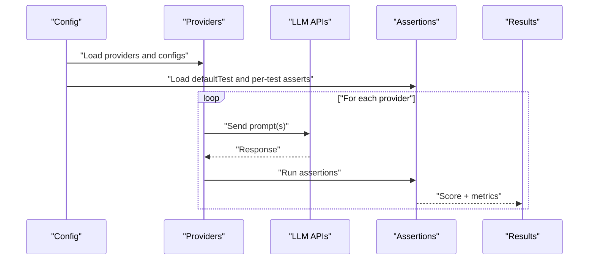

[No sources needed since this diagram shows conceptual workflow, not actual code structure]

## Detailed Component Analysis

### Claude vs GPT: Balanced Reasoning and Style
- Purpose: Compare two leading models on a set of riddles with explicit quality constraints.
- Key configuration:
  - providers: Two providers with distinct ids and labels
  - defaultTest: cost and latency caps
  - tests: multiple vars with deterministic and rubric-based assertions
- Interpretation:
  - Cost and latency thresholds ensure operational constraints are met
  - Rubric assertions evaluate adherence to style and helpfulness
  - Deterministic checks ensure required keywords appear

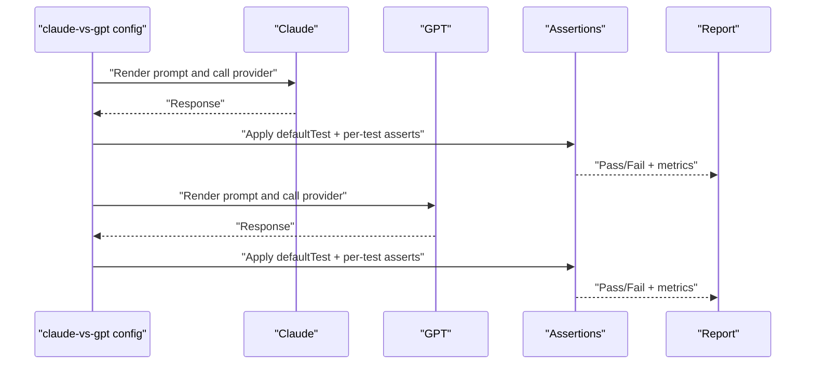

**Diagram sources**
- [claude-vs-gpt/promptfooconfig.yaml](file://examples/claude-vs-gpt/promptfooconfig.yaml)

**Section sources**
- [claude-vs-gpt/promptfooconfig.yaml](file://examples/claude-vs-gpt/promptfooconfig.yaml)
- [claude-vs-gpt/README.md](file://examples/claude-vs-gpt/README.md)
- [claude-vs-gpt/prompt.yaml](file://examples/claude-vs-gpt/prompt.yaml)

### Temperature Sensitivity: GPT-4o Behavior Sweep
- Purpose: Study how temperature affects output variability and helpfulness.
- Key configuration:
  - providers: Same model with different temperature values
  - tests: neutral instruction prompts with rubric assertions to detect hallucinations or unsafe claims
- Interpretation:
  - Low temperature tends to reduce variability and may increase factual accuracy
  - High temperature increases creativity but can degrade safety and factualness

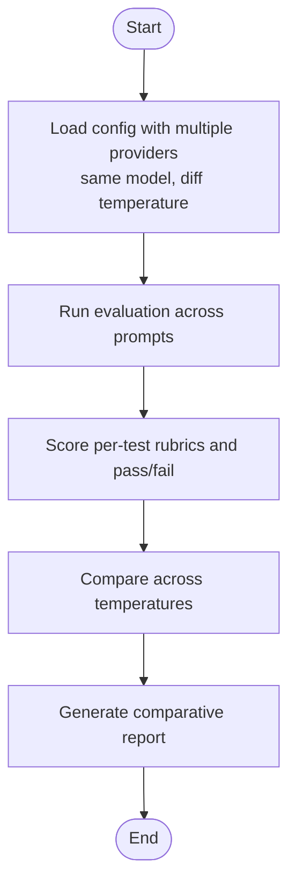

**Diagram sources**
- [gpt-4o-temperature-comparison/promptfooconfig.yaml](file://examples/gpt-4o-temperature-comparison/promptfooconfig.yaml)

**Section sources**
- [gpt-4o-temperature-comparison/promptfooconfig.yaml](file://examples/gpt-4o-temperature-comparison/promptfooconfig.yaml)
- [gpt-4o-temperature-comparison/README.md](file://examples/gpt-4o-temperature-comparison/README.md)

### Open-Source Model Comparison: Mistral, Mixtral, Llama, Gemma
- Purpose: Evaluate open-source models from a single router endpoint.
- Key configuration:
  - providers: Multiple openrouter endpoints with shared temperature
  - tests: short instruction prompts and rubric assertions to detect misinformation
- Interpretation:
  - Useful baseline for cost-sensitive or privacy-conscious deployments
  - Differences often reflect training data and instruction-tuning

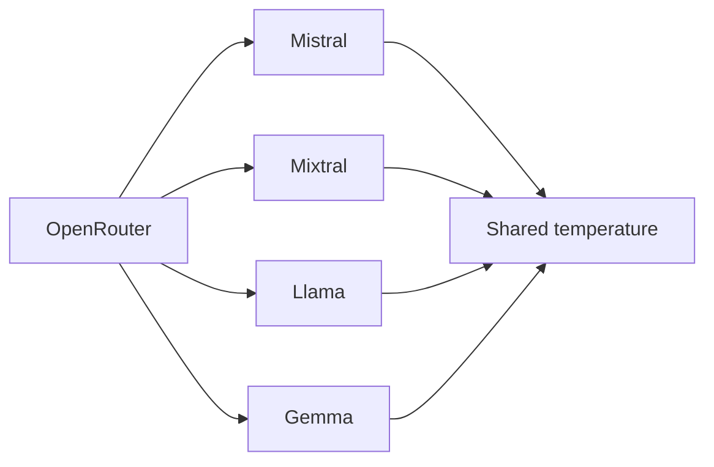

**Diagram sources**
- [open-source-comparison/promptfooconfig.yaml](file://examples/open-source-comparison/promptfooconfig.yaml)

**Section sources**
- [open-source-comparison/promptfooconfig.yaml](file://examples/open-source-comparison/promptfooconfig.yaml)
- [open-source-comparison/README.md](file://examples/open-source-comparison/README.md)

### Multi-Model Evaluation: Llama vs GPT (Replicate + OpenAI)
- Purpose: Cross-provider comparison with temperature and token limits.
- Key configuration:
  - providers: Mix of Replicate and OpenAI models with different temperature and token settings
  - tests: instruction prompts with rubric assertions to avoid claiming unknown facts
- Interpretation:
  - Controls like temperature and max tokens help normalize behavior across providers
  - Useful for selecting models that balance speed, cost, and helpfulness

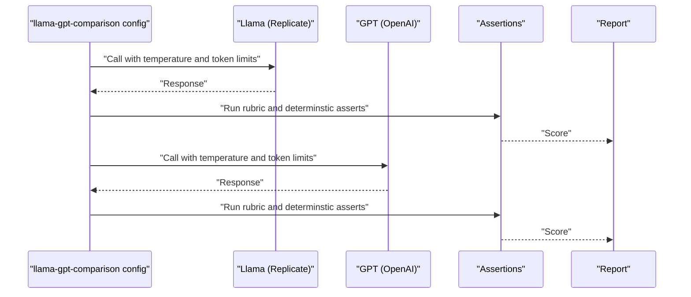

**Diagram sources**
- [llama-gpt-comparison/promptfooconfig.yaml](file://examples/llama-gpt-comparison/promptfooconfig.yaml)

**Section sources**
- [llama-gpt-comparison/promptfooconfig.yaml](file://examples/llama-gpt-comparison/promptfooconfig.yaml)
- [llama-gpt-comparison/README.md](file://examples/llama-gpt-comparison/README.md)

### Multi-Model Benchmark: GPT vs Claude vs Gemini
- Purpose: Three-way comparison on a small set of riddles with latency and output-length constraints.
- Key configuration:
  - providers: Three major providers
  - defaultTest: latency and length penalties
  - tests: keyword checks and rubric assertions
- Interpretation:
  - Good for quick apples-to-apples comparisons across providers
  - Length penalties favor concise, focused answers

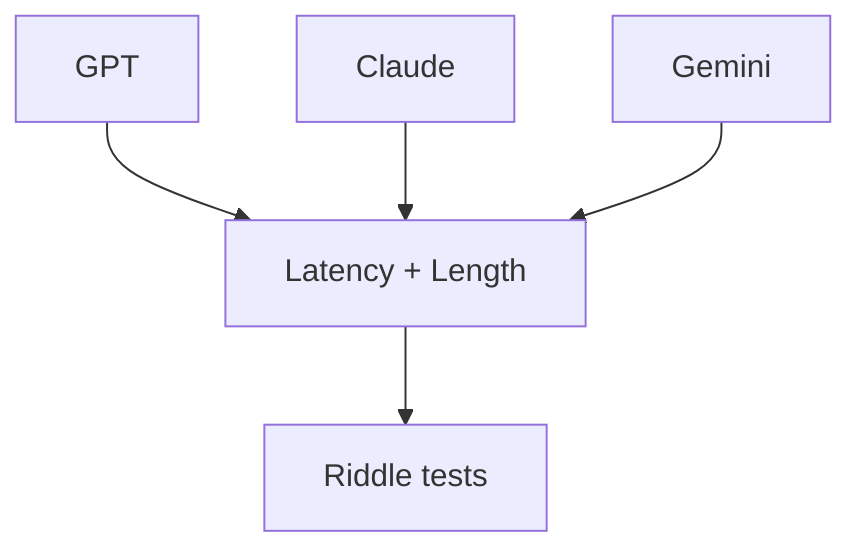

**Diagram sources**
- [gpt-vs-claude-vs-gemini/promptfooconfig.yaml](file://examples/gpt-vs-claude-vs-gemini/promptfooconfig.yaml)

**Section sources**
- [gpt-vs-claude-vs-gemini/promptfooconfig.yaml](file://examples/gpt-vs-claude-vs-gemini/promptfooconfig.yaml)
- [gpt-vs-claude-vs-gemini/README.md](file://examples/gpt-vs-claude-vs-gemini/README.md)

### Reasoning Capability: DeepSeek-R1 vs OpenAI o1 (MMLU-style)
- Purpose: Evaluate step-by-step reasoning on MMLU-like questions.
- Key configuration:
  - providers: o1 and DeepSeek-R1
  - defaultTest: latency cap, step-by-step reasoning requirement, and answer-choice regex
  - tests: Hugging Face dataset loader for MMLU subsets
- Interpretation:
  - Step-by-step rubric ensures reasoning transparency
  - Regex enforces answer format correctness
  - Latency threshold prevents runaway inference costs

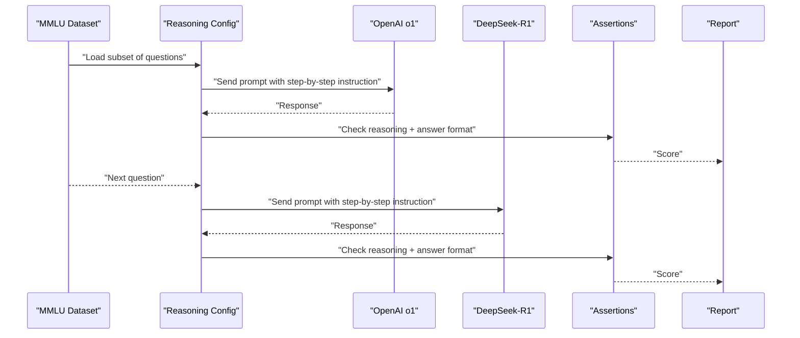

**Diagram sources**
- [deepseek-r1-vs-openai-o1/promptfooconfig.yaml](file://examples/deepseek-r1-vs-openai-o1/promptfooconfig.yaml)

**Section sources**
- [deepseek-r1-vs-openai-o1/promptfooconfig.yaml](file://examples/deepseek-r1-vs-openai-o1/promptfooconfig.yaml)
- [deepseek-r1-vs-openai-o1/README.md](file://examples/deepseek-r1-vs-openai-o1/README.md)

### Local and Containerized Comparisons: Ollama and Docker
- Purpose: Compare local models with different prompts and constraints.
- Key configuration:
  - providers: Ollama models with provider-specific prompt mapping and generation parameters
  - defaultTest: negative-word filters to avoid AI disclaimers
  - tests: sensitive prompts to probe safety and helpfulness
- Interpretation:
  - Useful for privacy-sensitive or offline-first workflows
  - Prompt mapping enables consistent evaluation across local and hosted providers

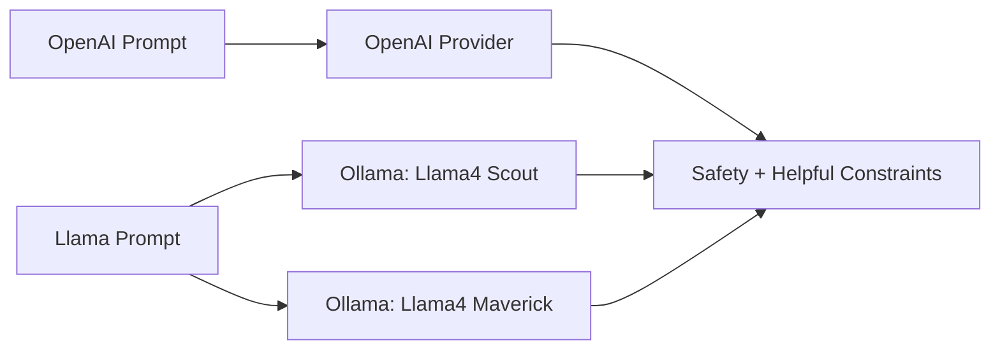

**Diagram sources**
- [ollama/promptfooconfig.yaml](file://examples/ollama/promptfooconfig.yaml)

**Section sources**
- [ollama/promptfooconfig.yaml](file://examples/ollama/promptfooconfig.yaml)
- [ollama/README.md](file://examples/ollama/README.md)
- [docker/promptfooconfig.comparison.simple.yaml](file://examples/docker/promptfooconfig.comparison.simple.yaml)
- [docker/README.md](file://examples/docker/README.md)

### Multi-Provider, Multi-Modal: Amazon Bedrock
- Purpose: Evaluate multiple providers and modalities (text, images) in a single config.
- Key configuration highlights:
  - providers: Claude, Llama, Nova, Pixtral with region and token/temperature controls
  - defaultTest: embedding provider override for similarity assertions
  - tests: broad knowledge questions and multimodal prompts
- Interpretation:
  - Embedding override ensures consistent similarity scoring across providers
  - Region and token settings help control latency and cost

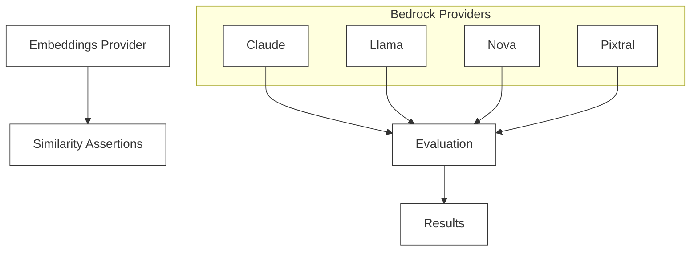

**Diagram sources**
- [amazon-bedrock/promptfooconfig.yaml](file://examples/amazon-bedrock/promptfooconfig.yaml)

**Section sources**
- [amazon-bedrock/promptfooconfig.yaml](file://examples/amazon-bedrock/promptfooconfig.yaml)
- [amazon-bedrock/README.md](file://examples/amazon-bedrock/README.md)
- [amazon-bedrock/prompts.txt](file://examples/amazon-bedrock/prompts.txt)

### Additional Benchmarks and Specialized Evaluations
- Cohere Benchmark: Dedicated benchmark configuration for Cohere models. See [promptfooconfig.yaml](file://examples/cohere-benchmark/promptfooconfig.yaml).
- DBRX Benchmark: Example for structured benchmarking. See [promptfooconfig.yaml](file://examples/dbrx-benchmark/promptfooconfig.yaml).
- HarmBench: Safety-focused adversarial benchmark. See [promptfooconfig.yaml](file://examples/harmbench/promptfooconfig.yaml) and [harmbench_behaviors_text_all.csv](file://examples/harmbench/harmbench_behaviors_text_all.csv).
- Political Bias (GROK-4): Rubric-driven evaluation on political questions. See [promptfooconfig.yaml](file://examples/grok-4-political-bias/promptfooconfig.yaml), [political-bias-rubric.yaml](file://examples/grok-4-political-bias/political-bias-rubric.yaml), and [political-questions.csv](file://examples/grok-4-political-bias/political-questions.csv).
- G-Eval: Instruction-following and factuality evaluation. See [promptfooconfig.yaml](file://examples/g-eval/promptfooconfig.yaml).
- BERTScore: Automated text quality scoring. See [promptfooconfig.yaml](file://examples/bert-score/promptfooconfig.yaml) and [bertscore_check.py](file://examples/bert-score/bertscore_check.py).
- Hugging Face Datasets: Factuality, HLE, hate speech detection, PII, similarity, and inference endpoints. See respective promptfooconfigs and loaders.

**Section sources**
- [cohere-benchmark/promptfooconfig.yaml](file://examples/cohere-benchmark/promptfooconfig.yaml)
- [cohere-benchmark/README.md](file://examples/cohere-benchmark/README.md)
- [dbrx-benchmark/promptfooconfig.yaml](file://examples/dbrx-benchmark/promptfooconfig.yaml)
- [dbrx-benchmark/README.md](file://examples/dbrx-benchmark/README.md)
- [harmbench/promptfooconfig.yaml](file://examples/harmbench/promptfooconfig.yaml)
- [harmbench/README.md](file://examples/harmbench/README.md)
- [harmbench/harmbench_behaviors_text_all.csv](file://examples/harmbench/harmbench_behaviors_text_all.csv)
- [grok-4-political-bias/promptfooconfig.yaml](file://examples/grok-4-political-bias/promptfooconfig.yaml)
- [grok-4-political-bias/political-bias-rubric.yaml](file://examples/grok-4-political-bias/political-bias-rubric.yaml)
- [grok-4-political-bias/political-questions.csv](file://examples/grok-4-political-bias/political-questions.csv)
- [grok-4-political-bias/README.md](file://examples/grok-4-political-bias/README.md)
- [g-eval/promptfooconfig.yaml](file://examples/g-eval/promptfooconfig.yaml)
- [g-eval/README.md](file://examples/g-eval/README.md)
- [bert-score/promptfooconfig.yaml](file://examples/bert-score/promptfooconfig.yaml)
- [bert-score/README.md](file://examples/bert-score/README.md)
- [bert-score/bertscore_check.py](file://examples/bert-score/bertscore_check.py)
- [huggingface-dataset-factuality/promptfooconfig.yaml](file://examples/huggingface-dataset-factuality/promptfooconfig.yaml)
- [huggingface-dataset-factuality/dataset_loader.ts](file://examples/huggingface-dataset-factuality/dataset_loader.ts)
- [huggingface-dataset-factuality/README.md](file://examples/huggingface-dataset-factuality/README.md)
- [huggingface-hle/promptfooconfig.yaml](file://examples/huggingface-hle/promptfooconfig.yaml)
- [huggingface-hle/prompt.py](file://examples/huggingface-hle/prompt.py)
- [huggingface-hle/README.md](file://examples/huggingface-hle/README.md)
- [huggingface-hate-speech-detection/promptfooconfig.yaml](file://examples/huggingface-hate-speech-detection/promptfooconfig.yaml)
- [huggingface-hate-speech-detection/README.md](file://examples/huggingface-hate-speech-detection/README.md)
- [huggingface-pii/promptfooconfig.yaml](file://examples/huggingface-pii/promptfooconfig.yaml)
- [huggingface-pii/README.md](file://examples/huggingface-pii/README.md)
- [huggingface-similarity/promptfooconfig.yaml](file://examples/huggingface-similarity/promptfooconfig.yaml)
- [huggingface-similarity/README.md](file://examples/huggingface-similarity/README.md)
- [huggingface-inference-endpoint/promptfooconfig.yaml](file://examples/huggingface-inference-endpoint/promptfooconfig.yaml)
- [huggingface-inference-endpoint/README.md](file://examples/huggingface-inference-endpoint/README.md)

### Provider-Specific Advanced Examples
- Anthropic Agent SDK: Multi-config examples for advanced agent workflows. See [promptfooconfig.yaml](file://examples/anthropic/agent-sdk/advanced/promptfooconfig.yaml) and related READMEs.
- Google AI Studio and Vertex: Text, image, tools, and multimodal configurations. See [promptfooconfig.yaml](file://examples/google-aistudio-gemini/promptfooconfig.yaml), [promptfooconfig.yaml](file://examples/google-vertex/promptfooconfig.yaml), and [promptfooconfig.yaml](file://examples/google-vertex-tools/promptfooconfig.yaml).
- Azure and OpenAI Azure Comparison: See [promptfooconfig.yaml](file://examples/azure/comparison/promptfooconfig.yaml) and [promptfooconfig.yaml](file://examples/openai-azure-comparison/promptfooconfig.yaml).

**Section sources**
- [anthropic/agent-sdk/advanced/promptfooconfig.yaml](file://examples/anthropic/agent-sdk/advanced/promptfooconfig.yaml)
- [anthropic/agent-sdk/advanced/README.md](file://examples/anthropic/agent-sdk/advanced/README.md)
- [google-aistudio-gemini/promptfooconfig.yaml](file://examples/google-aistudio-gemini/promptfooconfig.yaml)
- [google-aistudio-gemini/README.md](file://examples/google-aistudio-gemini/README.md)
- [google-vertex/promptfooconfig.yaml](file://examples/google-vertex/promptfooconfig.yaml)
- [google-vertex/README.md](file://examples/google-vertex/README.md)
- [google-vertex-tools/promptfooconfig.yaml](file://examples/google-vertex-tools/promptfooconfig.yaml)
- [google-vertex-tools/README.md](file://examples/google-vertex-tools/README.md)
- [azure/comparison/promptfooconfig.yaml](file://examples/azure/comparison/promptfooconfig.yaml)
- [azure/README.md](file://examples/azure/README.md)
- [openai-azure-comparison/promptfooconfig.yaml](file://examples/openai-azure-comparison/promptfooconfig.yaml)
- [openai-azure-comparison/README.md](file://examples/openai-azure-comparison/README.md)

## Dependency Analysis
- Provider abstraction: All examples rely on a unified provider interface. Differences are encapsulated in provider ids and optional config blocks.
- Assertion composition: defaultTest and per-test assertions compose to form a scoring pipeline.
- External datasets: Some examples integrate Hugging Face datasets for standardized benchmarks.

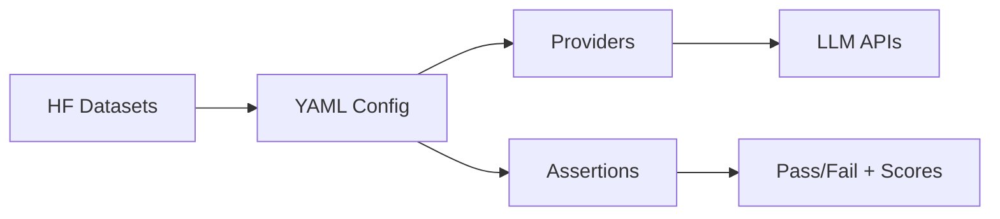

[No sources needed since this diagram shows conceptual relationships, not specific code structure]

## Performance Considerations
- Cost and latency caps: Use defaultTest cost and latency assertions to bound resource usage. See [promptfooconfig.yaml](file://examples/claude-vs-gpt/promptfooconfig.yaml) and [promptfooconfig.yaml](file://examples/gpt-vs-claude-vs-gemini/promptfooconfig.yaml).
- Token and temperature controls: Normalize behavior across providers via temperature and token limits. See [promptfooconfig.yaml](file://examples/llama-gpt-comparison/promptfooconfig.yaml) and [promptfooconfig.yaml](file://examples/gpt-4o-temperature-comparison/promptfooconfig.yaml).
- Embedding overrides: Ensure consistent similarity scoring across providers. See [promptfooconfig.yaml](file://examples/amazon-bedrock/promptfooconfig.yaml).
- Batch and dataset loading: Use dataset loaders for scalable benchmarking. See [promptfooconfig.yaml](file://examples/deepseek-r1-vs-openai-o1/promptfooconfig.yaml).

[No sources needed since this section provides general guidance]

## Troubleshooting Guide
- Provider credentials and regions: Verify provider ids and region settings. See [promptfooconfig.yaml](file://examples/amazon-bedrock/promptfooconfig.yaml).
- Assertion failures: Review per-test rubrics and adjust thresholds. See [promptfooconfig.yaml](file://examples/claude-vs-gpt/promptfooconfig.yaml).
- Dataset loading issues: Confirm dataset URIs and access permissions. See [promptfooconfig.yaml](file://examples/deepseek-r1-vs-openai-o1/promptfooconfig.yaml).
- Local model performance: Tune generation parameters and prompt mapping. See [promptfooconfig.yaml](file://examples/ollama/promptfooconfig.yaml).

**Section sources**
- [amazon-bedrock/promptfooconfig.yaml](file://examples/amazon-bedrock/promptfooconfig.yaml)
- [claude-vs-gpt/promptfooconfig.yaml](file://examples/claude-vs-gpt/promptfooconfig.yaml)
- [deepseek-r1-vs-openai-o1/promptfooconfig.yaml](file://examples/deepseek-r1-vs-openai-o1/promptfooconfig.yaml)
- [ollama/promptfooconfig.yaml](file://examples/ollama/promptfooconfig.yaml)

## Conclusion
These examples illustrate how to construct robust, reproducible model comparisons across diverse providers and use cases. By combining structured configurations, deterministic and rubric-based assertions, and performance constraints, teams can reliably compare models, interpret results, and select the best fit for their applications.

[No sources needed since this section summarizes without analyzing specific files]

## Appendices

### Best Practices for Fair Comparisons
- Control variables: Keep temperature, max tokens, and prompts constant across providers when comparing capabilities.
- Representative datasets: Use balanced, domain-representative prompts and datasets.
- Metrics alignment: Align scoring with business goals (accuracy, safety, latency, cost).
- Statistical reporting: Report means, confidence intervals, and failure rates for actionable insights.

[No sources needed since this section provides general guidance]