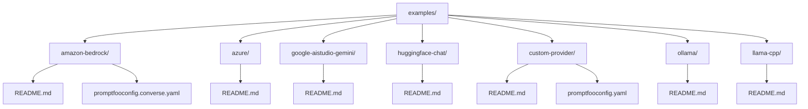
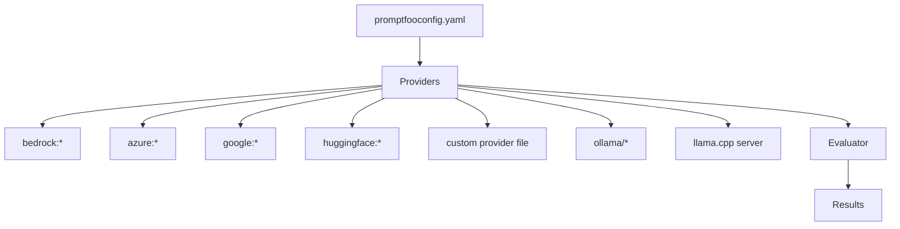
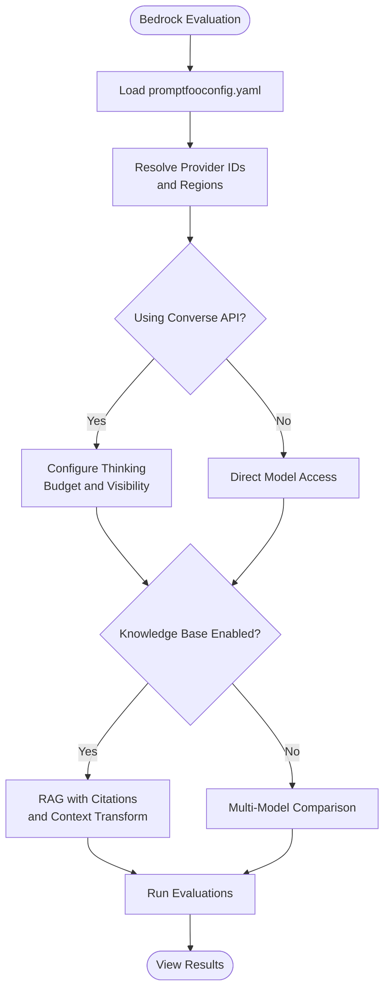
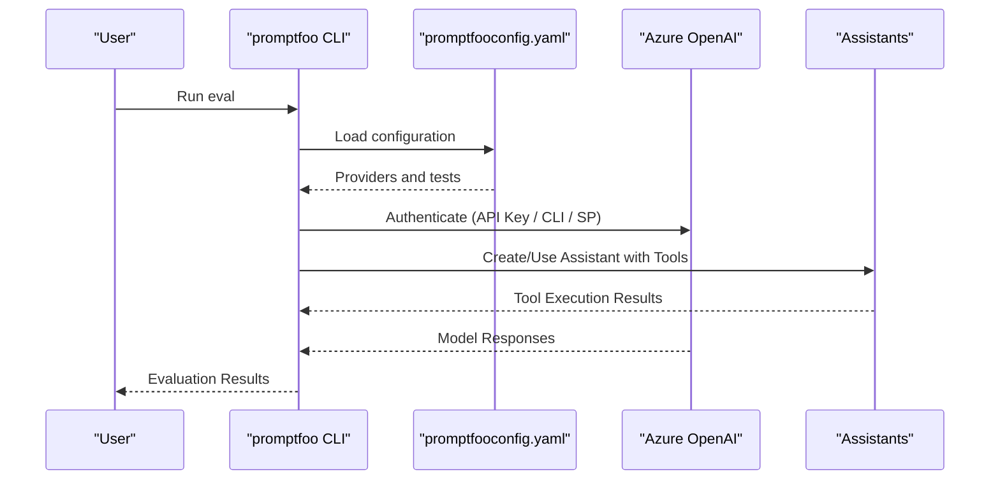
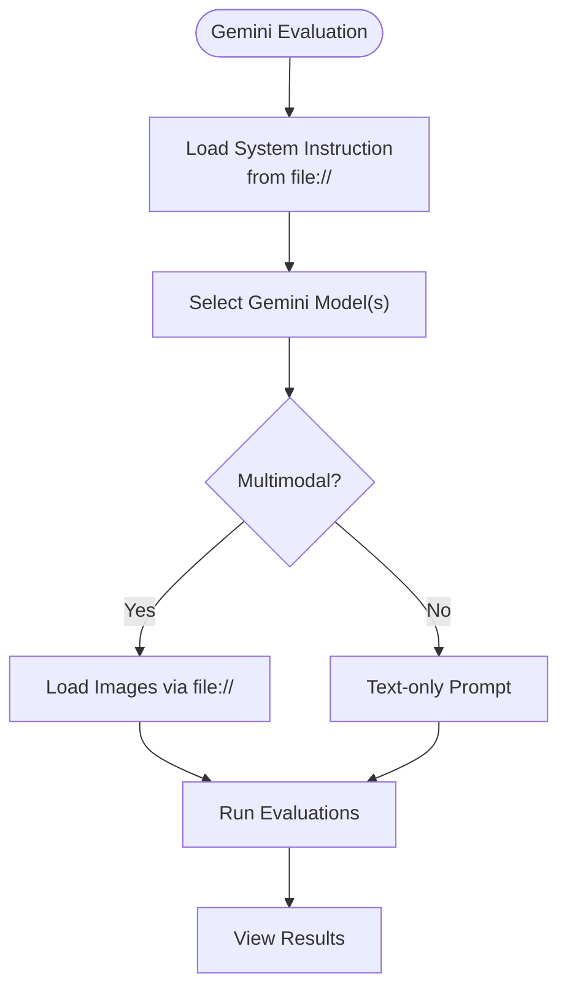
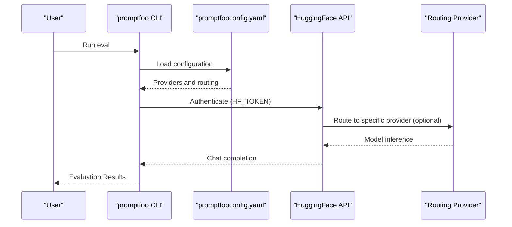
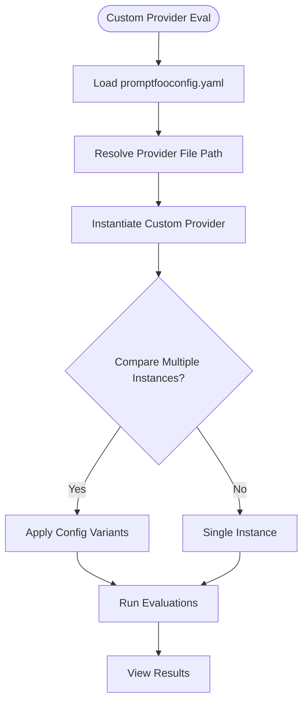
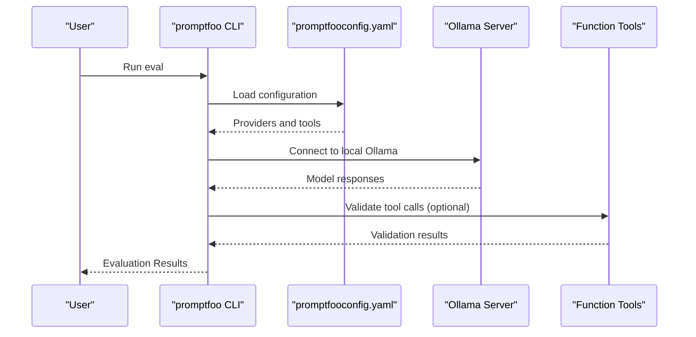
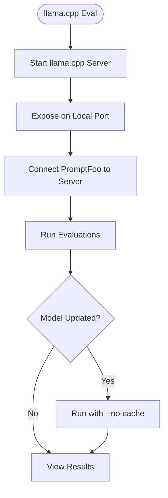
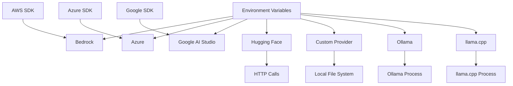

# Provider Integration Examples

<cite>
**Referenced Files in This Document**
- [README.md](file://README.md)
- [examples/amazon-bedrock/README.md](file://examples/amazon-bedrock/README.md)
- [examples/amazon-bedrock/promptfooconfig.converse.yaml](file://examples/amazon-bedrock/promptfooconfig.converse.yaml)
- [examples/azure/README.md](file://examples/azure/README.md)
- [examples/google-aistudio-gemini/README.md](file://examples/google-aistudio-gemini/README.md)
- [examples/huggingface-chat/README.md](file://examples/huggingface-chat/README.md)
- [examples/custom-provider/README.md](file://examples/custom-provider/README.md)
- [examples/custom-provider/promptfooconfig.yaml](file://examples/custom-provider/promptfooconfig.yaml)
- [examples/ollama/README.md](file://examples/ollama/README.md)
- [examples/llama-cpp/README.md](file://examples/llama-cpp/README.md)
</cite>

## Table of Contents
1. [Introduction](#introduction)
2. [Project Structure](#project-structure)
3. [Core Components](#core-components)
4. [Architecture Overview](#architecture-overview)
5. [Detailed Component Analysis](#detailed-component-analysis)
6. [Dependency Analysis](#dependency-analysis)
7. [Performance Considerations](#performance-considerations)
8. [Troubleshooting Guide](#troubleshooting-guide)
9. [Conclusion](#conclusion)
10. [Appendices](#appendices)

## Introduction
This document provides comprehensive provider integration examples for PromptFoo, focusing on major AI providers and local inference solutions. It covers:
- Authentication setup and provider-specific configuration patterns
- Multi-provider evaluation setups and provider switching strategies
- Cost optimization techniques and reliability best practices
- Provider-specific features such as vision, function/tool calling, and streaming
- Guidance on provider selection, benchmarking, and migration

PromptFoo supports many providers out of the box and allows custom provider development. The examples in this repository demonstrate real-world configurations for Amazon Bedrock, Azure OpenAI, Google AI Studio (Gemini), Hugging Face, Ollama, and llama.cpp.

**Section sources**
- [README.md:1-97](file://README.md#L1-L97)

## Project Structure
The repository organizes provider examples under the examples directory. Each provider example includes:
- A README with prerequisites, environment variables, and usage instructions
- One or more promptfooconfig.yaml files demonstrating provider configurations
- Optional assets, prompts, and tool definitions

Key provider example directories used in this document:
- examples/amazon-bedrock
- examples/azure
- examples/google-aistudio-gemini
- examples/huggingface-chat
- examples/custom-provider
- examples/ollama
- examples/llama-cpp

**Diagram sources**
- [examples/amazon-bedrock/README.md](file://examples/amazon-bedrock/README.md)
- [examples/amazon-bedrock/promptfooconfig.converse.yaml](file://examples/amazon-bedrock/promptfooconfig.converse.yaml)
- [examples/azure/README.md](file://examples/azure/README.md)
- [examples/google-aistudio-gemini/README.md](file://examples/google-aistudio-gemini/README.md)
- [examples/huggingface-chat/README.md](file://examples/huggingface-chat/README.md)
- [examples/custom-provider/README.md](file://examples/custom-provider/README.md)
- [examples/custom-provider/promptfooconfig.yaml](file://examples/custom-provider/promptfooconfig.yaml)
- [examples/ollama/README.md](file://examples/ollama/README.md)
- [examples/llama-cpp/README.md](file://examples/llama-cpp/README.md)

**Section sources**
- [examples/amazon-bedrock/README.md:1-245](file://examples/amazon-bedrock/README.md#L1-L245)
- [examples/azure/README.md:1-68](file://examples/azure/README.md#L1-L68)
- [examples/google-aistudio-gemini/README.md:1-79](file://examples/google-aistudio-gemini/README.md#L1-L79)
- [examples/huggingface-chat/README.md:1-75](file://examples/huggingface-chat/README.md#L1-L75)
- [examples/custom-provider/README.md:1-22](file://examples/custom-provider/README.md#L1-L22)
- [examples/custom-provider/promptfooconfig.yaml:1-23](file://examples/custom-provider/promptfooconfig.yaml#L1-L23)
- [examples/ollama/README.md:1-145](file://examples/ollama/README.md#L1-L145)
- [examples/llama-cpp/README.md:1-49](file://examples/llama-cpp/README.md#L1-L49)

## Core Components
This section outlines the essential building blocks for provider integration in PromptFoo:
- Provider identifiers and configuration keys
- Authentication mechanisms
- Multi-provider evaluation patterns
- Streaming and tool/function calling support
- Local inference integration

Key patterns demonstrated in the examples:
- Bedrock Converse API with thinking and multimodal support
- Azure OpenAI and Foundry agent examples
- Google AI Studio Gemini with system instructions and images
- Hugging Face OpenAI-compatible chat completions
- Custom provider development via local files
- Ollama function calling and model comparison
- llama.cpp server integration

**Section sources**
- [examples/amazon-bedrock/README.md:34-245](file://examples/amazon-bedrock/README.md#L34-L245)
- [examples/amazon-bedrock/promptfooconfig.converse.yaml:1-52](file://examples/amazon-bedrock/promptfooconfig.converse.yaml#L1-L52)
- [examples/azure/README.md:1-68](file://examples/azure/README.md#L1-L68)
- [examples/google-aistudio-gemini/README.md:1-79](file://examples/google-aistudio-gemini/README.md#L1-L79)
- [examples/huggingface-chat/README.md:1-75](file://examples/huggingface-chat/README.md#L1-L75)
- [examples/custom-provider/README.md:1-22](file://examples/custom-provider/README.md#L1-L22)
- [examples/custom-provider/promptfooconfig.yaml:1-23](file://examples/custom-provider/promptfooconfig.yaml#L1-L23)
- [examples/ollama/README.md:1-145](file://examples/ollama/README.md#L1-L145)
- [examples/llama-cpp/README.md:1-49](file://examples/llama-cpp/README.md#L1-L49)

## Architecture Overview
The provider integration architecture in PromptFoo follows a consistent pattern:
- Configuration defines prompts, providers, and tests
- Providers are resolved by ID and instantiated with provider-specific config
- Evaluations run across providers and produce standardized results
- Custom providers can be loaded from local files

**Diagram sources**
- [examples/amazon-bedrock/promptfooconfig.converse.yaml:1-52](file://examples/amazon-bedrock/promptfooconfig.converse.yaml#L1-L52)
- [examples/custom-provider/promptfooconfig.yaml:1-23](file://examples/custom-provider/promptfooconfig.yaml#L1-L23)
- [examples/ollama/README.md:1-145](file://examples/ollama/README.md#L1-L145)
- [examples/llama-cpp/README.md:1-49](file://examples/llama-cpp/README.md#L1-L49)

## Detailed Component Analysis

### Amazon Bedrock Integration
Amazon Bedrock examples showcase:
- Converse API with extended thinking and multimodal support
- Knowledge Base RAG with citations and context transformation
- Application inference profiles for multi-region failover and cost optimization
- Support for OpenAI GPT-OSS models via Bedrock

Authentication and prerequisites:
- AWS credentials and region configuration
- Optional installation of AWS SDK packages for specialized features

Key configuration patterns:
- Provider IDs using the bedrock: scheme
- Region and model-specific parameters
- Thinking configuration and showThinking flag
- Inference profile ARNs with required inferenceModelType

**Diagram sources**
- [examples/amazon-bedrock/README.md:53-245](file://examples/amazon-bedrock/README.md#L53-L245)
- [examples/amazon-bedrock/promptfooconfig.converse.yaml:1-52](file://examples/amazon-bedrock/promptfooconfig.converse.yaml#L1-L52)

**Section sources**
- [examples/amazon-bedrock/README.md:9-245](file://examples/amazon-bedrock/README.md#L9-L245)
- [examples/amazon-bedrock/promptfooconfig.converse.yaml:1-52](file://examples/amazon-bedrock/promptfooconfig.converse.yaml#L1-L52)

### Azure OpenAI Integration
Azure examples demonstrate:
- Basic chat and vision models
- Azure OpenAI Assistants with tools
- Third-party models via Azure AI Foundry (Claude, Llama, DeepSeek, Mistral)
- Multiple authentication methods (API key, Azure CLI, service principal)

Authentication setup:
- AZURE_API_KEY and AZURE_API_HOST for API key method
- Azure CLI login for development
- Service principal environment variables for CI/CD

**Diagram sources**
- [examples/azure/README.md:45-68](file://examples/azure/README.md#L45-L68)

**Section sources**
- [examples/azure/README.md:1-68](file://examples/azure/README.md#L1-L68)

### Google AI Studio (Gemini) Integration
Google AI Studio examples show:
- Multiple Gemini models (2.5 Pro, Flash, Flash-Lite, 1.5 Pro/Flash)
- System instruction loading from external files
- Multimodal image understanding and comparison
- Structured JSON output and function calling capabilities

Key configuration patterns:
- Provider IDs using google:gemini-* format
- System instruction via file:// prefix
- Image handling with file:// prefix for multimodal prompts

**Diagram sources**
- [examples/google-aistudio-gemini/README.md:28-79](file://examples/google-aistudio-gemini/README.md#L28-L79)

**Section sources**
- [examples/google-aistudio-gemini/README.md:1-79](file://examples/google-aistudio-gemini/README.md#L1-L79)

### Hugging Face Integration
Hugging Face examples demonstrate:
- OpenAI-compatible chat completions via huggingface:chat
- Model routing to specific inference providers
- Configuration options including temperature, token limits, and custom base URLs

Key configuration patterns:
- Provider IDs using huggingface:chat:model_name
- Inference provider routing via suffix or config
- Environment variable HF_TOKEN or apiKey config

**Diagram sources**
- [examples/huggingface-chat/README.md:22-75](file://examples/huggingface-chat/README.md#L22-L75)

**Section sources**
- [examples/huggingface-chat/README.md:1-75](file://examples/huggingface-chat/README.md#L1-L75)

### Custom Provider Development
PromptFoo supports custom providers via local files. The example shows:
- Loading a custom provider from a local file path
- Comparing multiple instances of the same provider with different configs
- Using CSV test cases and prompt files

Key patterns:
- Provider ID pointing to a local file path
- Optional provider-specific config overrides
- CSV-based test case loading

**Diagram sources**
- [examples/custom-provider/promptfooconfig.yaml:1-23](file://examples/custom-provider/promptfooconfig.yaml#L1-L23)

**Section sources**
- [examples/custom-provider/README.md:1-22](file://examples/custom-provider/README.md#L1-L22)
- [examples/custom-provider/promptfooconfig.yaml:1-23](file://examples/custom-provider/promptfooconfig.yaml#L1-L23)

### Ollama Integration
Ollama examples demonstrate:
- Model comparison across local models
- Function/tool calling with tiny parameter models
- Prompt formatting differences and assertion validation

Key patterns:
- Provider IDs for local Ollama models
- Function calling with OpenAI-compatible tool format
- Tool definitions and validation via assertions

**Diagram sources**
- [examples/ollama/README.md:56-145](file://examples/ollama/README.md#L56-L145)

**Section sources**
- [examples/ollama/README.md:1-145](file://examples/ollama/README.md#L1-L145)

### llama.cpp Integration
llama.cpp examples show:
- Running a local server and connecting via HTTP
- Passing prompts as-is to the server
- Cache invalidation considerations when changing models

Key patterns:
- Starting llama.cpp server on a local port
- Configuring PromptFoo to connect to the local server
- Managing cache behavior during model updates

**Diagram sources**
- [examples/llama-cpp/README.md:13-49](file://examples/llama-cpp/README.md#L13-L49)

**Section sources**
- [examples/llama-cpp/README.md:1-49](file://examples/llama-cpp/README.md#L1-L49)

## Dependency Analysis
Provider integration examples rely on:
- Environment variables for authentication (AWS, Azure, Google, Hugging Face)
- Provider-specific SDKs or server processes (e.g., AWS SDK for Bedrock)
- Local server processes for Ollama and llama.cpp
- Configuration files defining prompts, providers, and tests

**Diagram sources**
- [examples/amazon-bedrock/README.md:9-33](file://examples/amazon-bedrock/README.md#L9-L33)
- [examples/azure/README.md:45-61](file://examples/azure/README.md#L45-L61)
- [examples/google-aistudio-gemini/README.md:13-14](file://examples/google-aistudio-gemini/README.md#L13-L14)
- [examples/huggingface-chat/README.md:7-13](file://examples/huggingface-chat/README.md#L7-L13)
- [examples/ollama/README.md:11-23](file://examples/ollama/README.md#L11-L23)
- [examples/llama-cpp/README.md:9-21](file://examples/llama-cpp/README.md#L9-L21)

**Section sources**
- [examples/amazon-bedrock/README.md:9-33](file://examples/amazon-bedrock/README.md#L9-L33)
- [examples/azure/README.md:45-61](file://examples/azure/README.md#L45-L61)
- [examples/google-aistudio-gemini/README.md:13-14](file://examples/google-aistudio-gemini/README.md#L13-L14)
- [examples/huggingface-chat/README.md:7-13](file://examples/huggingface-chat/README.md#L7-L13)
- [examples/ollama/README.md:11-23](file://examples/ollama/README.md#L11-L23)
- [examples/llama-cpp/README.md:9-21](file://examples/llama-cpp/README.md#L9-L21)

## Performance Considerations
- Cost optimization
  - Use Bedrock inference profiles for multi-region failover and cost optimization
  - Prefer smaller, efficient models (e.g., Gemini Flash-Lite) for high-volume tasks
  - Leverage provider-specific pricing pages and model selection guidelines
- Latency and throughput
  - Choose appropriate models for latency-sensitive tasks (e.g., Flash variants)
  - Use local inference (Ollama, llama.cpp) to avoid network latency
- Caching and reproducibility
  - For llama.cpp, disable cache when changing models to avoid stale results
- Multi-provider comparisons
  - Run side-by-side evaluations to benchmark performance and quality across providers

[No sources needed since this section provides general guidance]

## Troubleshooting Guide
Common issues and resolutions:
- Authentication failures
  - Verify environment variables for each provider (AWS, Azure, Google, Hugging Face)
  - Confirm region and resource settings for cloud providers
- Model access and permissions
  - Ensure models are enabled in the target region (Bedrock, Azure Foundry)
  - Check Hugging Face token validity and model availability
- Local inference
  - Confirm Ollama server is running and reachable
  - Ensure llama.cpp server is listening on the configured port
- Cache behavior
  - Use --no-cache when switching models in llama.cpp to avoid stale results
- Tool/function calling
  - Validate tool definitions and assertions for custom providers and Ollama
  - Ensure provider supports the requested tool format

**Section sources**
- [examples/amazon-bedrock/README.md:11-23](file://examples/amazon-bedrock/README.md#L11-L23)
- [examples/azure/README.md:45-61](file://examples/azure/README.md#L45-L61)
- [examples/google-aistudio-gemini/README.md:13-14](file://examples/google-aistudio-gemini/README.md#L13-L14)
- [examples/huggingface-chat/README.md:7-13](file://examples/huggingface-chat/README.md#L7-L13)
- [examples/llama-cpp/README.md:46-49](file://examples/llama-cpp/README.md#L46-L49)

## Conclusion
PromptFoo’s provider integration examples demonstrate robust patterns for evaluating and comparing AI models across major cloud providers, third-party ecosystems, and local inference solutions. By following the configuration patterns and best practices outlined here—covering authentication, provider-specific features, multi-provider setups, cost optimization, and troubleshooting—you can build reliable, scalable evaluation pipelines tailored to your needs.

[No sources needed since this section summarizes without analyzing specific files]

## Appendices
- Provider selection criteria
  - Evaluate based on model capabilities, latency, cost, and geographic availability
  - Use multi-provider comparisons to benchmark quality and performance
- Migration strategies
  - Start with small-scale evaluations using the same prompts and tests
  - Gradually increase scale while monitoring cost and latency
  - Use configuration files to switch providers without changing code

[No sources needed since this section provides general guidance]