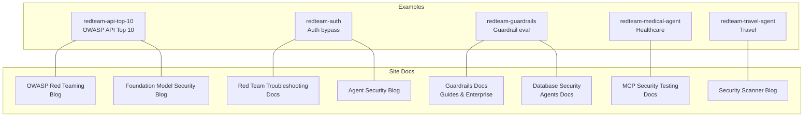
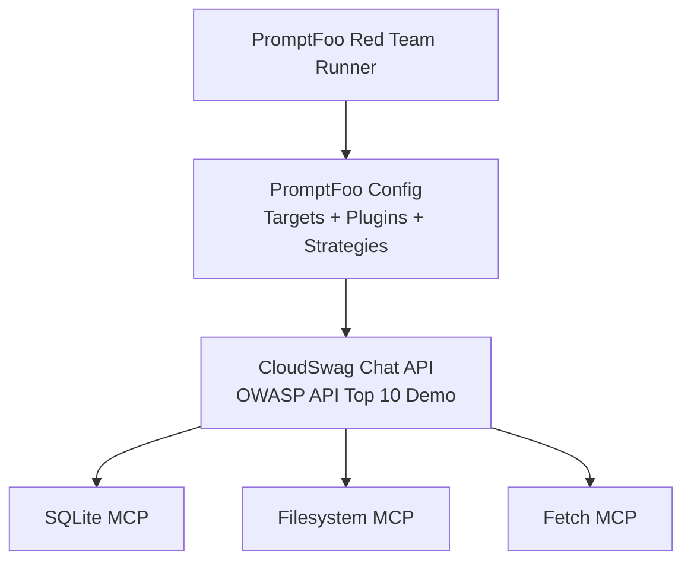
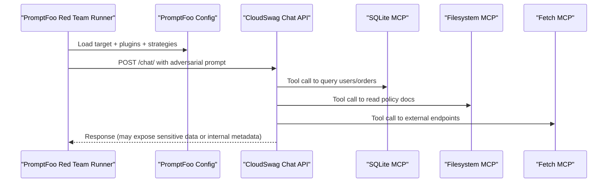
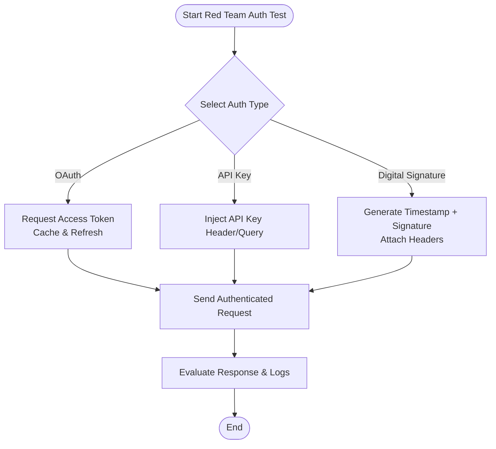
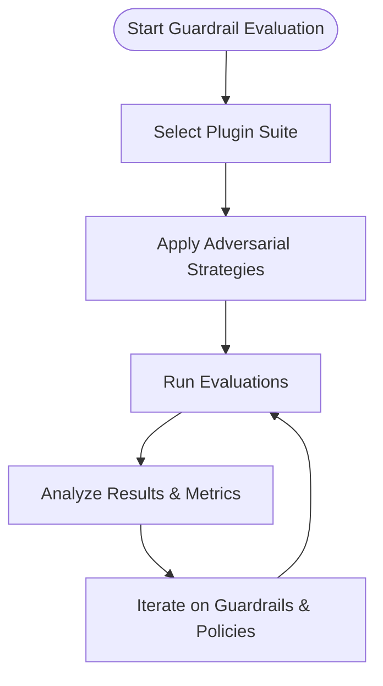
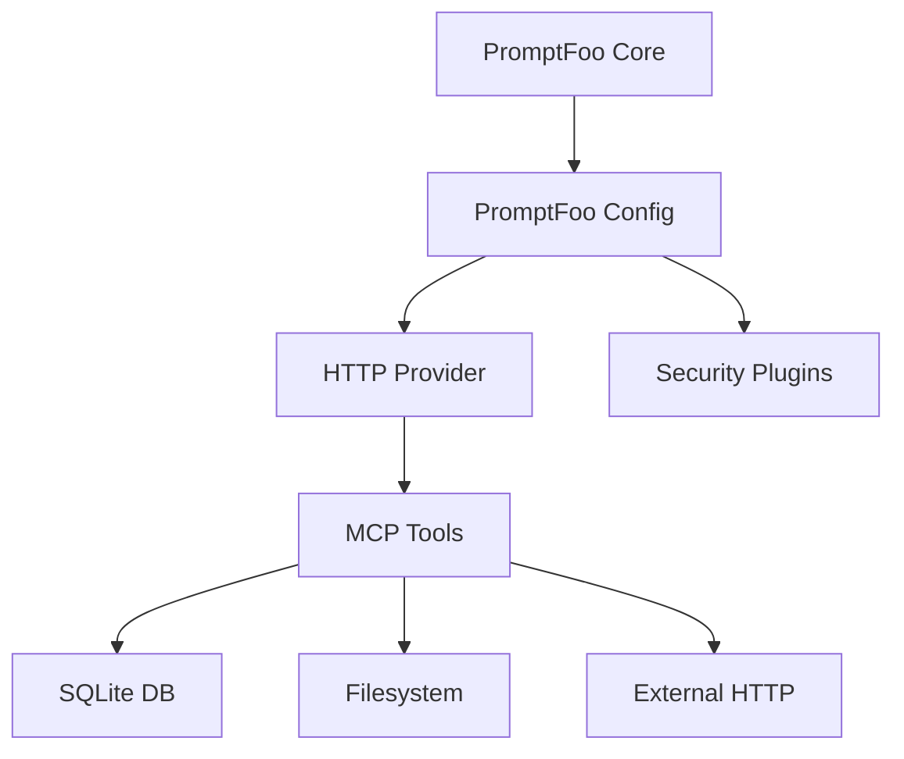

# Red Team & Security Examples

<cite>
**Referenced Files in This Document**
- [README.md](file://examples/redteam-api-top-10/README.md)
- [promptfooconfig.yaml](file://examples/redteam-api-top-10/promptfooconfig.yaml)
- [README.md](file://examples/redteam-auth/README.md)
- [README.md](file://examples/redteam-guardrails/README.md)
- [promptfooconfig.yaml](file://examples/redteam-guardrails/promptfooconfig.yaml)
- [README.md](file://examples/redteam-medical-agent/README.md)
- [README.md](file://examples/redteam-travel-agent/README.md)
- [README.md](file://site/blog/owasp-red-teaming.md)
- [overview.md](file://site/docs/red-team/troubleshooting/overview.md)
- [README.md](file://site/docs/configuration/expected-outputs/guardrails.md)
- [README.md](file://site/docs/guides/testing-guardrails.md)
- [README.md](file://site/docs/enterprise/guardrails.md)
- [README.md](file://site/docs/red-team/mcp-security-testing.md)
- [README.md](file://site/blog/building-a-security-scanner-for-llm-apps.md)
- [README.md](file://site/blog/foundation-model-security.md)
- [README.md](file://site/blog/agent-security.md)
- [README.md](file://docs/agents/database-security.md)
</cite>

## Table of Contents
1. [Introduction](#introduction)
2. [Project Structure](#project-structure)
3. [Core Components](#core-components)
4. [Architecture Overview](#architecture-overview)
5. [Detailed Component Analysis](#detailed-component-analysis)
6. [Dependency Analysis](#dependency-analysis)
7. [Performance Considerations](#performance-considerations)
8. [Troubleshooting Guide](#troubleshooting-guide)
9. [Conclusion](#conclusion)
10. [Appendices](#appendices)

## Introduction
This document presents comprehensive red team and security examples for PromptFoo, focusing on systematic adversarial testing across domains and attack vectors. It covers API security testing aligned with the OWASP API Security Top 10, authentication bypass scenarios, jailbreaking demonstrations, and guardrail penetration testing. It also explains vulnerability assessment workflows, security plugin usage, adversarial strategy implementation, and domain-specific security testing for healthcare and travel. Guidance is included for prompt injection testing, data leakage prevention, and malicious use case evaluation, along with red team methodology implementation, strategy selection, and measurement of security effectiveness. Ethical considerations, responsible disclosure practices, and best practices for AI security assessments are addressed.

## Project Structure
The repository includes dedicated red team and security examples under the examples directory, alongside site documentation that provides conceptual and operational guidance. The key areas covered here are:
- API security testing with OWASP Top 10-aligned vulnerabilities
- Authentication bypass testing across OAuth, API key, and digital signature mechanisms
- Guardrail evaluation using curated plugin suites
- Domain-specific examples for medical and travel agents
- Operational troubleshooting and security plugin documentation

**Section sources**
- [README.md:1-215](file://examples/redteam-api-top-10/README.md#L1-L215)
- [README.md:1-183](file://examples/redteam-auth/README.md#L1-L183)
- [README.md:1-116](file://examples/redteam-guardrails/README.md#L1-L116)
- [README.md:237-255](file://site/blog/owasp-red-teaming.md#L237-L255)
- [overview.md:7-21](file://site/docs/red-team/troubleshooting/overview.md#L7-L21)
- [README.md](file://site/docs/configuration/expected-outputs/guardrails.md)
- [README.md](file://site/docs/guides/testing-guardrails.md)
- [README.md](file://site/docs/enterprise/guardrails.md)
- [README.md](file://site/docs/red-team/mcp-security-testing.md)
- [README.md](file://site/blog/building-a-security-scanner-for-llm-apps.md)
- [README.md](file://site/blog/foundation-model-security.md)
- [README.md](file://site/blog/agent-security.md)
- [README.md](file://docs/agents/database-security.md)

## Core Components
- OWASP API Security Top 10 Red Team Example: A deliberately vulnerable demo app with configurable security weaknesses mapped to the OWASP API Security Top 10 (2023). It integrates MCP tools for database, filesystem, and HTTP fetching, enabling prompt-driven exploitation of vulnerabilities such as broken object level authorization, broken authentication, property exposure, function-level access control, SSRF, misconfiguration, legacy endpoints, and unsafe consumption of input.
- Authentication Bypass Scenarios: Demonstrates configuring authentication for red team evaluations against HTTP endpoints, covering OAuth 2.0 client credentials, API key headers, and digital signature authentication with timestamped signatures and certificate handling.
- Guardrail Penetration Testing: Provides a comprehensive guardrail evaluation preset using 42 plugins targeting prompt injection, jailbreaking, harmful content categories (violence, weapons, cybercrime, privacy), system integrity, and hallucination risks.
- Domain-Specific Agents: Includes examples for red teaming specialized agents such as medical and travel agents, highlighting domain-specific threat surfaces and evaluation strategies.
- Operational Security Plugins and Strategies: Documents plugin usage for guardrails, strategies for adversarial testing (e.g., jailbreak, cresciendo, hydra), and MCP security testing guidance.

**Section sources**
- [README.md:41-55](file://examples/redteam-api-top-10/README.md#L41-L55)
- [README.md:15-183](file://examples/redteam-auth/README.md#L15-L183)
- [README.md:11-116](file://examples/redteam-guardrails/README.md#L11-L116)
- [README.md](file://examples/redteam-medical-agent/README.md)
- [README.md](file://examples/redteam-travel-agent/README.md)
- [README.md](file://site/docs/red-team/mcp-security-testing.md)

## Architecture Overview
The red team architecture combines a target application with integrated MCP tools and a PromptFoo red team runner. The target app exposes chat endpoints and vulnerable routes, while PromptFoo orchestrates adversarial prompts, authentication, and plugin-driven evaluation.

**Diagram sources**
- [promptfooconfig.yaml:15-28](file://examples/redteam-api-top-10/promptfooconfig.yaml#L15-L28)
- [README.md:56-70](file://examples/redteam-api-top-10/README.md#L56-L70)

**Section sources**
- [promptfooconfig.yaml:15-62](file://examples/redteam-api-top-10/promptfooconfig.yaml#L15-L62)
- [README.md:56-70](file://examples/redteam-api-top-10/README.md#L56-L70)

## Detailed Component Analysis

### OWASP API Security Top 10 Red Team Example
This example demonstrates prompt-driven exploitation of intentionally weak configurations aligned with the OWASP API Security Top 10. It includes:
- Vulnerability matrix with configurable security levels (weak, bypassable, secure)
- MCP tool integration for database queries, policy reading, and external HTTP calls
- Preconfigured PromptFoo configuration with OWASP API plugin and adversarial strategies
- Quick-start commands for seeding the database, starting the server, and running red team evaluations

Key capabilities:
- BOLA (Broken Object Level Authorization): Prompt injection to access other users’ data
- Broken Authentication: Unsigned JWT acceptance and debug parameters
- Sensitive Property Exposure: Access to sensitive columns (salary, SSN, cost price)
- Function-Level Access Control: Admin tools available to regular users
- SSRF: Internal endpoints reachable via fetch tool
- Misconfiguration: Debug endpoints and JWT secrets in logs
- Legacy API Without Authentication: Unprotected v1 endpoints
- Unsafe Consumption of Input: No response sanitization

Operational flow:
- Start the server and seed the database
- Generate a JWT token and update the configuration
- Run red team evaluation with configured plugins and strategies
- Observe results indicating whether vulnerabilities are bypassed at different security levels

**Diagram sources**
- [promptfooconfig.yaml:15-28](file://examples/redteam-api-top-10/promptfooconfig.yaml#L15-L28)
- [README.md:72-77](file://examples/redteam-api-top-10/README.md#L72-L77)

**Section sources**
- [README.md:41-55](file://examples/redteam-api-top-10/README.md#L41-L55)
- [README.md:116-153](file://examples/redteam-api-top-10/README.md#L116-L153)
- [promptfooconfig.yaml:56-62](file://examples/redteam-api-top-10/promptfooconfig.yaml#L56-L62)

### Authentication Bypass Scenarios
This example focuses on configuring authentication for red team evaluations against protected HTTP endpoints. It supports:
- OAuth 2.0 client credentials flow with automatic token caching and refresh
- API key authentication via headers or query parameters
- Digital signature authentication with timestamped signatures and PEM-based private keys

Best practices:
- Use environment variables for all credentials
- Employ the most restrictive scopes for OAuth
- Rotate credentials regularly
- Secure private keys and encode them appropriately when stored in environment variables
- Configure signature validity windows to balance security and usability

**Diagram sources**
- [README.md:134-183](file://examples/redteam-auth/README.md#L134-L183)

**Section sources**
- [README.md:15-183](file://examples/redteam-auth/README.md#L15-L183)

### Guardrail Penetration Testing
The guardrail evaluation preset provides a comprehensive suite of 42 plugins to test guardrails against:
- Prompt injection and jailbreaking (e.g., ASCII smuggling, indirect prompt injection, CCA, hijacking, system prompt override, Beavertails, HarmBench, Pliny, Do Not Answer, prompt extraction)
- Harmful content (weapons, violence, crime, exploitation, radicalization, cybercrime, substances, misinformation, legal/IP)
- System integrity (cyberseceval, excessive agency, hallucination, overreliance, divergent repetition, reasoning DoS)
- Privacy protection (PII)

Usage patterns:
- Basic: Enable guardrails-eval plugin
- Enhanced: Combine with strategies such as jailbreak, prompt-injection, and multilingual

**Diagram sources**
- [README.md:11-116](file://examples/redteam-guardrails/README.md#L11-L116)
- [promptfooconfig.yaml:7-15](file://examples/redteam-guardrails/promptfooconfig.yaml#L7-L15)

**Section sources**
- [README.md:11-116](file://examples/redteam-guardrails/README.md#L11-L116)
- [promptfooconfig.yaml:7-15](file://examples/redteam-guardrails/promptfooconfig.yaml#L7-L15)

### Domain-Specific Security Testing
Domain-specific examples highlight unique threat surfaces and evaluation approaches:
- Medical Agent: Focus on protecting patient data, maintaining HIPAA-like safeguards, and preventing unauthorized access to health records. Red team strategies should emphasize PII leakage, insider threats, and misuse of clinical decision support.
- Travel Agent: Emphasize payment data protection, itinerary privacy, and abuse of booking systems. Red team strategies should target session hijacking, data exposure, and misuse of travel APIs.

Implementation guidance:
- Tailor prompts to domain-specific regulations and risk profiles
- Integrate domain-specific plugins and policies
- Measure outcomes such as data leakage, session persistence, and policy bypass rates

**Section sources**
- [README.md](file://examples/redteam-medical-agent/README.md)
- [README.md](file://examples/redteam-travel-agent/README.md)

### MCP Security Testing
MCP (Model Context Protocol) introduces additional attack surfaces. Security testing should:
- Validate MCP server configurations and permissions
- Test tool call isolation and least privilege
- Monitor MCP traffic for unexpected data flows
- Integrate MCP security checks into guardrail workflows

**Section sources**
- [README.md](file://site/docs/red-team/mcp-security-testing.md)

## Dependency Analysis
The red team examples depend on PromptFoo’s configuration system, HTTP provider authentication, and plugin ecosystems. The OWASP API example depends on MCP tool servers and a local database, while guardrail examples rely on curated plugin sets.

**Diagram sources**
- [promptfooconfig.yaml:15-28](file://examples/redteam-api-top-10/promptfooconfig.yaml#L15-L28)
- [README.md:72-77](file://examples/redteam-api-top-10/README.md#L72-L77)

**Section sources**
- [promptfooconfig.yaml:15-62](file://examples/redteam-api-top-10/promptfooconfig.yaml#L15-L62)
- [README.md:72-77](file://examples/redteam-api-top-10/README.md#L72-L77)

## Performance Considerations
- Increase timeouts for MCP tool calls to accommodate slower operations
- Use targeted test counts and strategies to balance coverage and runtime
- Cache tokens and minimize redundant authentication requests
- Segment tests by vulnerability category to optimize resource allocation

[No sources needed since this section provides general guidance]

## Troubleshooting Guide
Common red team issues and resolutions:
- Attack Generation: Verify system scope, permissions, and available actions
- Connection Problems: Check authentication, rate limits, and endpoint configuration
- Data Handling: Understand what data leaves your machine; configure remote generation and telemetry appropriately
- Linking Targets: Use linkedTargetId to consolidate findings and track performance
- False Positives: Improve system context and adjust grader settings
- Inference Limits: Account for usage caps on cloud inference services
- Multi-Turn Sessions: Manage session state consistently across client and server
- Multiple Response Types: Parse non-standard formats, guardrails, and error states correctly
- Remote Generation: Address corporate firewall restrictions on adversarial content

**Section sources**
- [overview.md:7-21](file://site/docs/red-team/troubleshooting/overview.md#L7-L21)

## Conclusion
PromptFoo’s red team and security examples enable systematic adversarial testing across API security, authentication, guardrails, and domain-specific contexts. By combining OWASP-aligned vulnerabilities, robust authentication configurations, comprehensive guardrail plugins, and domain-focused strategies, teams can assess AI application resilience, measure effectiveness, and improve defenses. Operational troubleshooting and ethical practices ensure responsible and effective security assessments.

[No sources needed since this section summarizes without analyzing specific files]

## Appendices

### OWASP API Security Top 10 Mapping
- API1: BOLA – Prompt injection to access other users’ data
- API2: Broken Authentication – Unsigned JWT acceptance, debug parameters
- API3: Sensitive Property Exposure – Access to sensitive columns
- API5: Function Level Access Control – Admin tools available to all
- API7: Server-Side Request Forgery (SSRF) – Internal endpoints via fetch tool
- API8: Misconfiguration – Debug endpoints and JWT secrets in logs
- API9: Legacy API Without Authentication – Unprotected v1 endpoints
- API10: Unsafe Consumption of Input – No response sanitization

**Section sources**
- [README.md:41-55](file://examples/redteam-api-top-10/README.md#L41-L55)

### Guardrail Plugin Categories
- Prompt Injection & Jailbreaking: 10 plugins
- Harmful Content (Weapons, Violence, Crime, Exploitation, Radicalization, Cybercrime, Substances, Information Integrity, Legal/IP): 23 plugins
- System Security & Integrity: 6 plugins
- Privacy Protection: 1 plugin

**Section sources**
- [README.md:13-89](file://examples/redteam-guardrails/README.md#L13-L89)