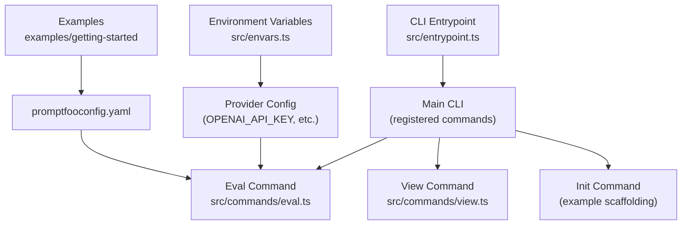
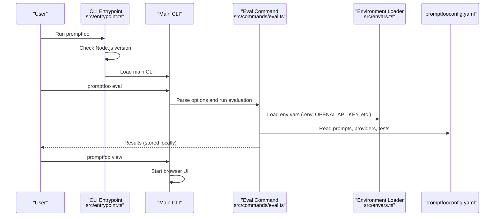
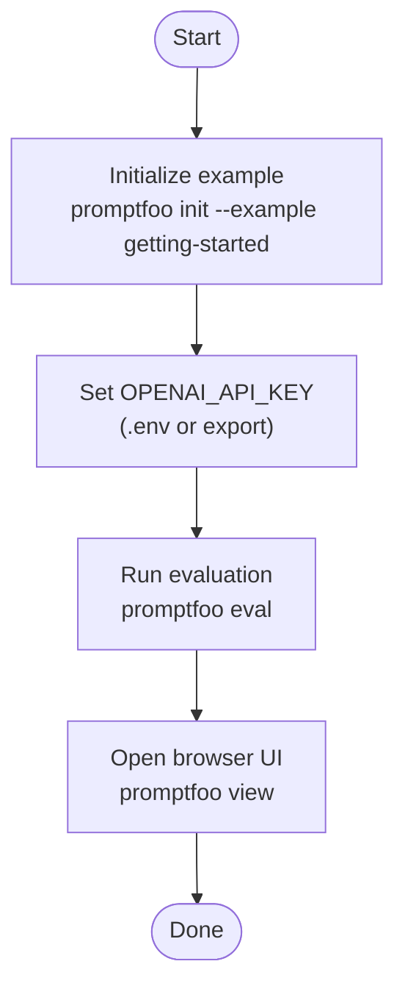
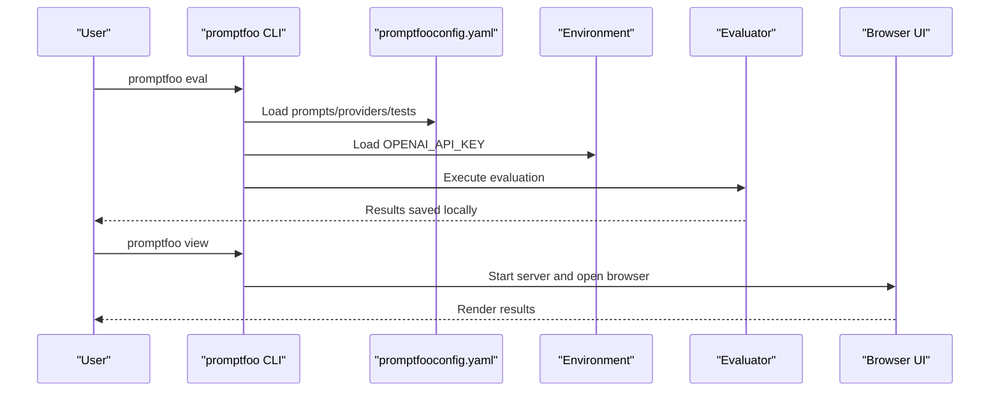
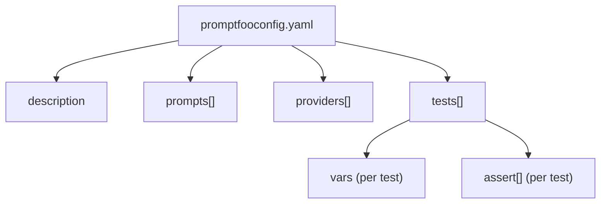
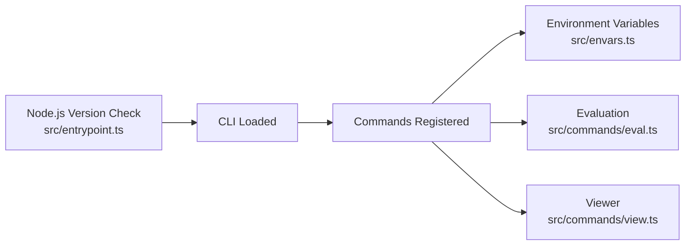

# Getting Started

<cite>
**Referenced Files in This Document**
- [package.json](file://package.json)
- [README.md](file://README.md)
- [examples/getting-started/README.md](file://examples/getting-started/README.md)
- [examples/getting-started/promptfooconfig.yaml](file://examples/getting-started/promptfooconfig.yaml)
- [src/entrypoint.ts](file://src/entrypoint.ts)
- [src/envars.ts](file://src/envars.ts)
- [src/commands/eval.ts](file://src/commands/eval.ts)
- [src/commands/view.ts](file://src/commands/view.ts)
</cite>

## Table of Contents
1. [Introduction](#introduction)
2. [Project Structure](#project-structure)
3. [Core Components](#core-components)
4. [Architecture Overview](#architecture-overview)
5. [Detailed Component Analysis](#detailed-component-analysis)
6. [Dependency Analysis](#dependency-analysis)
7. [Performance Considerations](#performance-considerations)
8. [Troubleshooting Guide](#troubleshooting-guide)
9. [Conclusion](#conclusion)
10. [Appendices](#appendices)

## Introduction
Promptfoo is a CLI and library for evaluating and red-teaming LLM applications. It enables you to compare models, run automated evaluations, review results in a browser UI, and integrate checks into CI/CD. This guide helps you install Promptfoo, configure environment variables, initialize a quick-start example, run evaluations, and view results.

## Project Structure
Promptfoo is distributed as a Node.js package with a CLI entrypoint. The repository includes:
- A CLI entrypoint that validates Node.js compatibility before loading the rest of the application
- A main CLI that registers commands such as init, eval, and view
- Example configurations under examples, including a getting-started example
- Environment variable helpers that load .env and expose provider-specific keys

**Diagram sources**
- [src/entrypoint.ts:1-50](file://src/entrypoint.ts#L1-L50)
- [src/commands/eval.ts:1150-1168](file://src/commands/eval.ts#L1150-L1168)
- [src/commands/view.ts](file://src/commands/view.ts)
- [src/envars.ts:350-360](file://src/envars.ts#L350-L360)
- [examples/getting-started/promptfooconfig.yaml:1-30](file://examples/getting-started/promptfooconfig.yaml#L1-L30)

**Section sources**
- [src/entrypoint.ts:1-50](file://src/entrypoint.ts#L1-L50)
- [src/commands/eval.ts:1150-1168](file://src/commands/eval.ts#L1150-L1168)
- [src/commands/view.ts](file://src/commands/view.ts)
- [src/envars.ts:350-360](file://src/envars.ts#L350-L360)
- [examples/getting-started/promptfooconfig.yaml:1-30](file://examples/getting-started/promptfooconfig.yaml#L1-L30)

## Core Components
- CLI Entrypoint: Validates Node.js version and bootstraps the main CLI
- Commands:
  - eval: Runs evaluations against configured prompts, providers, and test cases
  - view: Starts a local browser UI to inspect results
  - init: Scaffolds example configurations and files
- Environment Variables: Loads .env and exposes provider-specific keys (e.g., OPENAI_API_KEY)

**Section sources**
- [src/entrypoint.ts:1-50](file://src/entrypoint.ts#L1-L50)
- [src/commands/eval.ts:1150-1168](file://src/commands/eval.ts#L1150-L1168)
- [src/commands/view.ts](file://src/commands/view.ts)
- [src/envars.ts:350-360](file://src/envars.ts#L350-L360)

## Architecture Overview
The CLI initializes by checking Node.js compatibility, then loads the main CLI and registers commands. Evaluations read configuration files and environment variables, call providers, and produce results stored locally. The view command serves a browser UI to render results.

**Diagram sources**
- [src/entrypoint.ts:24-40](file://src/entrypoint.ts#L24-L40)
- [src/commands/eval.ts:1150-1168](file://src/commands/eval.ts#L1150-L1168)
- [src/envars.ts:350-360](file://src/envars.ts#L350-L360)
- [examples/getting-started/promptfooconfig.yaml:1-30](file://examples/getting-started/promptfooconfig.yaml#L1-L30)

## Detailed Component Analysis

### Installation Methods
Promptfoo supports multiple installation approaches. Choose the one that fits your workflow.

- npm global install
  - Install globally with npm and run the CLI directly
  - Reference: [README.md:25-28](file://README.md#L25-L28)

- Homebrew (macOS/Linux)
  - Install via brew and run the CLI directly
  - Reference: [README.md](file://README.md#L30)

- pip (Python ecosystem)
  - Install via pip and run the CLI directly
  - Reference: [README.md](file://README.md#L30)

- npx (run without installing)
  - Use npx to run any command without a global install
  - Reference: [README.md](file://README.md#L30)

System requirements and Node.js version
- Node.js version requirement is enforced at startup
- Reference: [package.json:31-33](file://package.json#L31-L33), [src/entrypoint.ts:24-40](file://src/entrypoint.ts#L24-L40)

**Section sources**
- [README.md:25-28](file://README.md#L25-L28)
- [README.md](file://README.md#L30)
- [package.json:31-33](file://package.json#L31-L33)
- [src/entrypoint.ts:24-40](file://src/entrypoint.ts#L24-L40)

### Quick Start: Initialize and Evaluate
Follow this classic workflow to get started quickly.

1. Initialize the getting-started example
   - Reference: [README.md:25-28](file://README.md#L25-L28), [examples/getting-started/README.md:5-7](file://examples/getting-started/README.md#L5-L7)

2. Set your API key
   - Export OPENAI_API_KEY or place it in a .env file
   - Reference: [README.md:32-36](file://README.md#L32-L36), [examples/getting-started/README.md:13-19](file://examples/getting-started/README.md#L13-L19), [src/envars.ts:350-360](file://src/envars.ts#L350-L360)

3. Run the evaluation
   - Reference: [README.md:38-44](file://README.md#L38-L44), [examples/getting-started/README.md:21-25](file://examples/getting-started/README.md#L21-L25)

4. View results in the browser
   - Reference: [README.md:38-44](file://README.md#L38-L44), [src/commands/view.ts](file://src/commands/view.ts)

**Diagram sources**
- [README.md:25-28](file://README.md#L25-L28)
- [README.md:32-36](file://README.md#L32-L36)
- [README.md:38-44](file://README.md#L38-L44)
- [examples/getting-started/README.md:5-7](file://examples/getting-started/README.md#L5-L7)
- [examples/getting-started/README.md:13-19](file://examples/getting-started/README.md#L13-L19)
- [examples/getting-started/README.md:21-25](file://examples/getting-started/README.md#L21-L25)
- [src/commands/view.ts](file://src/commands/view.ts)

**Section sources**
- [README.md:25-28](file://README.md#L25-L28)
- [README.md:32-36](file://README.md#L32-L36)
- [README.md:38-44](file://README.md#L38-L44)
- [examples/getting-started/README.md:5-7](file://examples/getting-started/README.md#L5-L7)
- [examples/getting-started/README.md:13-19](file://examples/getting-started/README.md#L13-L19)
- [examples/getting-started/README.md:21-25](file://examples/getting-started/README.md#L21-L25)
- [src/commands/view.ts](file://src/commands/view.ts)

### Basic Evaluation Process
- promptfoo eval
  - Reads prompts, providers, and test cases from configuration
  - Executes evaluations and stores results locally
  - Reference: [src/commands/eval.ts:1150-1168](file://src/commands/eval.ts#L1150-L1168), [examples/getting-started/promptfooconfig.yaml:1-30](file://examples/getting-started/promptfooconfig.yaml#L1-L30)

- promptfoo view
  - Starts a local server and opens a browser UI to inspect results
  - Reference: [src/commands/view.ts](file://src/commands/view.ts)

**Diagram sources**
- [src/commands/eval.ts:1150-1168](file://src/commands/eval.ts#L1150-L1168)
- [examples/getting-started/promptfooconfig.yaml:1-30](file://examples/getting-started/promptfooconfig.yaml#L1-L30)
- [src/envars.ts:350-360](file://src/envars.ts#L350-L360)
- [src/commands/view.ts](file://src/commands/view.ts)

**Section sources**
- [src/commands/eval.ts:1150-1168](file://src/commands/eval.ts#L1150-L1168)
- [examples/getting-started/promptfooconfig.yaml:1-30](file://examples/getting-started/promptfooconfig.yaml#L1-L30)
- [src/envars.ts:350-360](file://src/envars.ts#L350-L360)
- [src/commands/view.ts](file://src/commands/view.ts)

### Environment Variable Configuration
- Provider-specific keys
  - OPENAI_API_KEY is commonly used for OpenAI models
  - Other providers have dedicated keys (e.g., ANTHROPIC_API_KEY, AZURE keys)
  - Reference: [src/envars.ts:350-360](file://src/envars.ts#L350-L360), [src/envars.ts:240-245](file://src/envars.ts#L240-L245), [src/envars.ts:265-275](file://src/envars.ts#L265-L275)

- Loading order and .env
  - Environment variables are loaded from .env and process.env
  - Reference: [src/envars.ts:1-10](file://src/envars.ts#L1-L10)

- Example usage
  - Set OPENAI_API_KEY via export or .env
  - Reference: [README.md:32-36](file://README.md#L32-L36), [examples/getting-started/README.md:13-19](file://examples/getting-started/README.md#L13-L19)

**Section sources**
- [src/envars.ts:1-10](file://src/envars.ts#L1-L10)
- [src/envars.ts:240-245](file://src/envars.ts#L240-L245)
- [src/envars.ts:265-275](file://src/envars.ts#L265-L275)
- [src/envars.ts:350-360](file://src/envars.ts#L350-L360)
- [README.md:32-36](file://README.md#L32-L36)
- [examples/getting-started/README.md:13-19](file://examples/getting-started/README.md#L13-L19)

### Initial Configuration File Structure
The getting-started example includes a minimal configuration file that defines:
- Description
- Prompts with variable placeholders
- Providers (e.g., OpenAI models)
- Test cases with variables and assertions

Reference: [examples/getting-started/promptfooconfig.yaml:1-30](file://examples/getting-started/promptfooconfig.yaml#L1-L30)

**Diagram sources**
- [examples/getting-started/promptfooconfig.yaml:1-30](file://examples/getting-started/promptfooconfig.yaml#L1-L30)

**Section sources**
- [examples/getting-started/promptfooconfig.yaml:1-30](file://examples/getting-started/promptfooconfig.yaml#L1-L30)

## Dependency Analysis
- Node.js version enforcement occurs early in the CLI lifecycle
- The CLI registers commands and delegates to command handlers
- Environment variables are loaded before provider calls

**Diagram sources**
- [src/entrypoint.ts:24-40](file://src/entrypoint.ts#L24-L40)
- [src/envars.ts:1-10](file://src/envars.ts#L1-L10)
- [src/commands/eval.ts:1150-1168](file://src/commands/eval.ts#L1150-L1168)
- [src/commands/view.ts](file://src/commands/view.ts)

**Section sources**
- [src/entrypoint.ts:24-40](file://src/entrypoint.ts#L24-L40)
- [src/envars.ts:1-10](file://src/envars.ts#L1-L10)
- [src/commands/eval.ts:1150-1168](file://src/commands/eval.ts#L1150-L1168)
- [src/commands/view.ts](file://src/commands/view.ts)

## Performance Considerations
- Use appropriate concurrency and delays for provider rate limits
- Keep prompt sizes reasonable to reduce latency
- Prefer local caching and avoid unnecessary re-runs during development

## Troubleshooting Guide
Common installation and setup issues:

- Node.js version mismatch
  - Symptom: Startup fails with a version warning
  - Resolution: Upgrade Node.js to meet the required version
  - Reference: [package.json:31-33](file://package.json#L31-L33), [src/entrypoint.ts:24-40](file://src/entrypoint.ts#L24-L40)

- Missing API key
  - Symptom: Evaluation fails due to missing provider credentials
  - Resolution: Set OPENAI_API_KEY (or provider-specific key) via export or .env
  - Reference: [README.md:32-36](file://README.md#L32-L36), [examples/getting-started/README.md:13-19](file://examples/getting-started/README.md#L13-L19), [src/envars.ts:350-360](file://src/envars.ts#L350-L360)

- Permission denied when installing globally
  - Symptom: npm install -g fails due to permissions
  - Resolution: Use a Node.js version manager (e.g., fnm, nvm) or install locally

- Using npx without installing
  - Symptom: Slow first-run due to package download
  - Resolution: Install globally for repeated use; use npx for one-off commands
  - Reference: [README.md](file://README.md#L30)

- Browser does not open automatically
  - Symptom: promptfoo view starts server but does not open browser
  - Resolution: Use --yes to auto-open or --no to skip; adjust port if needed
  - Reference: [src/commands/view.ts](file://src/commands/view.ts)

**Section sources**
- [package.json:31-33](file://package.json#L31-L33)
- [src/entrypoint.ts:24-40](file://src/entrypoint.ts#L24-L40)
- [README.md:32-36](file://README.md#L32-L36)
- [examples/getting-started/README.md:13-19](file://examples/getting-started/README.md#L13-L19)
- [src/envars.ts:350-360](file://src/envars.ts#L350-L360)
- [README.md](file://README.md#L30)
- [src/commands/view.ts](file://src/commands/view.ts)

## Conclusion
You now have multiple installation options, understand system requirements, and can initialize, evaluate, and view results with Promptfoo. Start with the getting-started example, set your API keys, run an evaluation, and explore the browser UI to review outcomes.

## Appendices

### Quick Reference: Commands and Files
- Install: npm, brew, pip, npx
  - Reference: [README.md:25-28](file://README.md#L25-L28), [README.md](file://README.md#L30)

- Initialize example: promptfoo init --example getting-started
  - Reference: [README.md:25-28](file://README.md#L25-L28), [examples/getting-started/README.md:5-7](file://examples/getting-started/README.md#L5-L7)

- Evaluate: promptfoo eval
  - Reference: [README.md:38-44](file://README.md#L38-L44), [examples/getting-started/README.md:21-25](file://examples/getting-started/README.md#L21-L25), [src/commands/eval.ts:1150-1168](file://src/commands/eval.ts#L1150-L1168)

- View results: promptfoo view
  - Reference: [README.md:38-44](file://README.md#L38-L44), [src/commands/view.ts](file://src/commands/view.ts)

- Configuration: promptfooconfig.yaml
  - Reference: [examples/getting-started/promptfooconfig.yaml:1-30](file://examples/getting-started/promptfooconfig.yaml#L1-L30)

- Environment variables: OPENAI_API_KEY, provider-specific keys
  - Reference: [README.md:32-36](file://README.md#L32-L36), [examples/getting-started/README.md:13-19](file://examples/getting-started/README.md#L13-L19), [src/envars.ts:350-360](file://src/envars.ts#L350-L360)