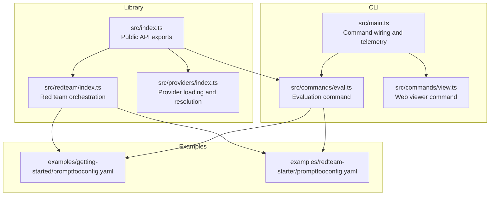
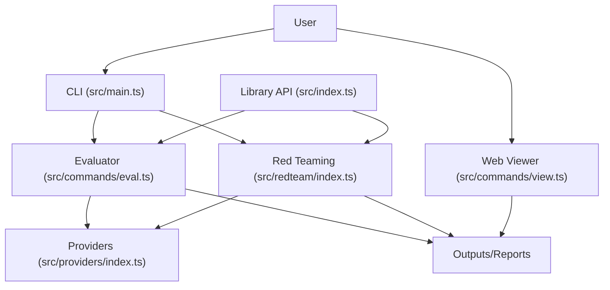
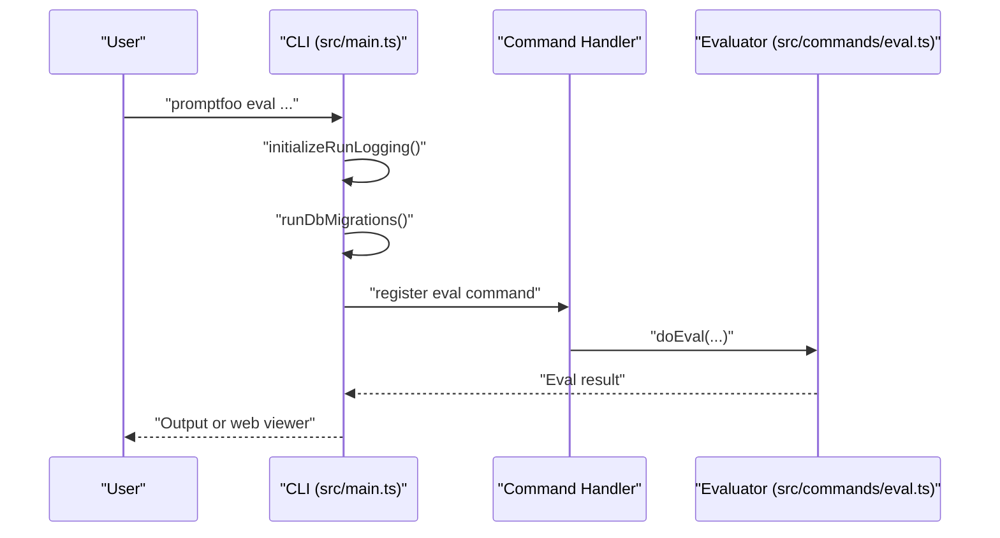
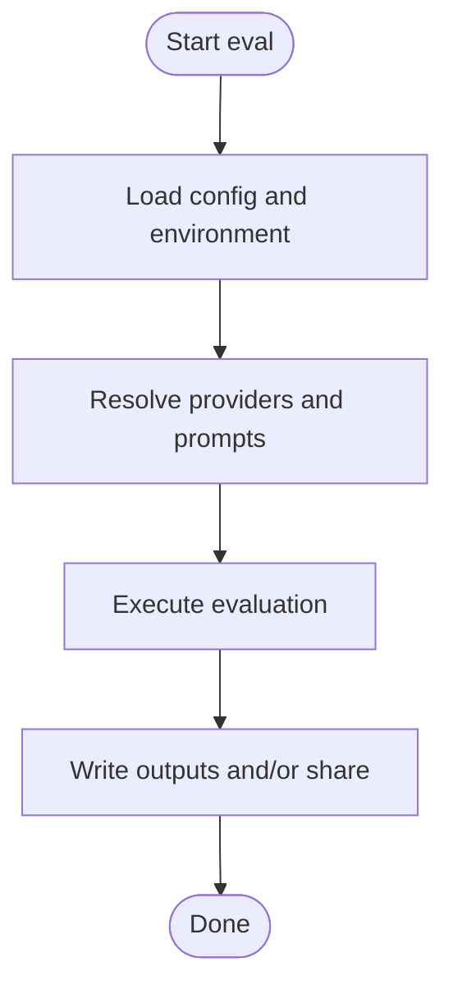
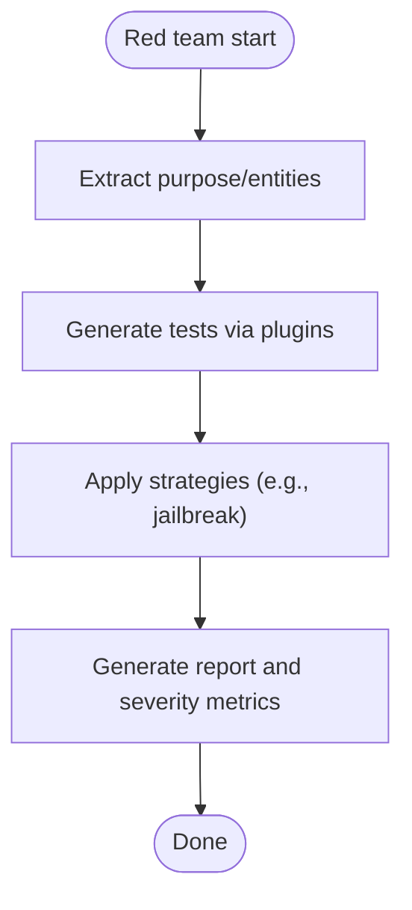
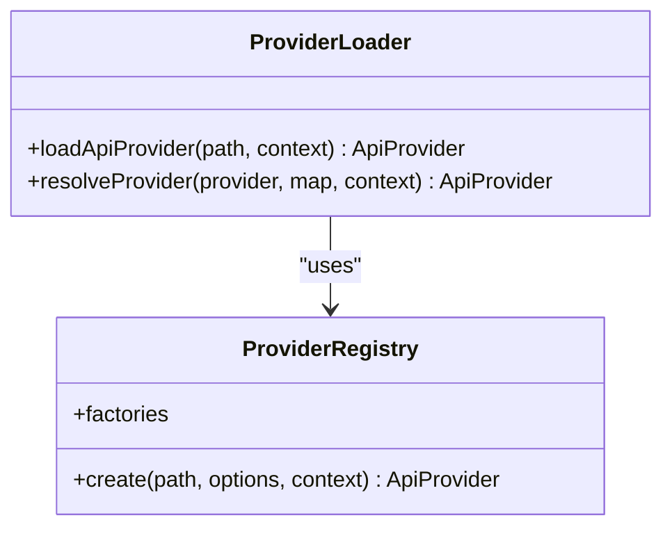
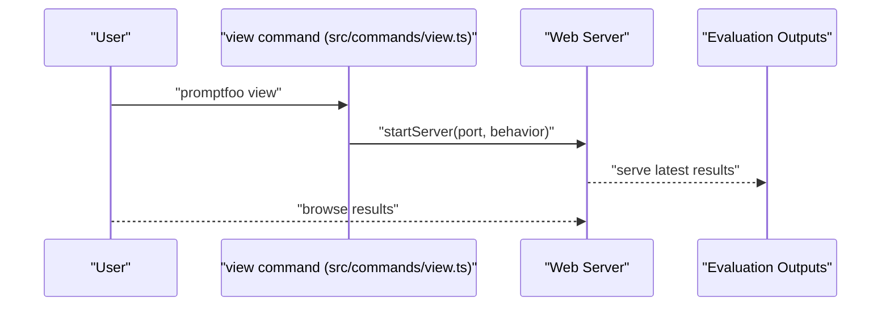
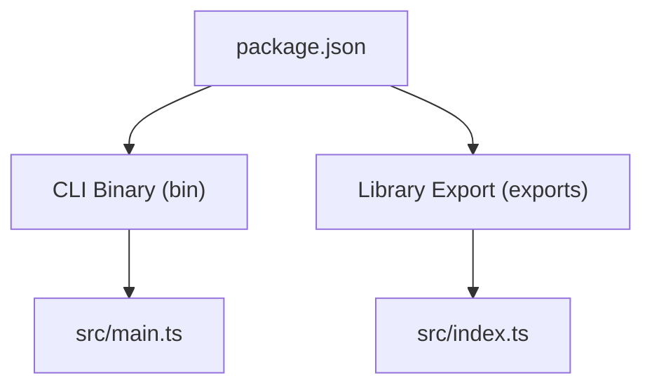

# Project Overview

<cite>
**Referenced Files in This Document**
- [README.md](file://README.md)
- [package.json](file://package.json)
- [src/main.ts](file://src/main.ts)
- [src/index.ts](file://src/index.ts)
- [src/commands/eval.ts](file://src/commands/eval.ts)
- [src/commands/view.ts](file://src/commands/view.ts)
- [src/providers/index.ts](file://src/providers/index.ts)
- [src/redteam/index.ts](file://src/redteam/index.ts)
- [examples/getting-started/promptfooconfig.yaml](file://examples/getting-started/promptfooconfig.yaml)
- [examples/redteam-starter/promptfooconfig.yaml](file://examples/redteam-starter/promptfooconfig.yaml)
- [CONTRIBUTING.md](file://CONTRIBUTING.md)
- [CODE_OF_CONDUCT.md](file://CODE_OF_CONDUCT.md)
</cite>

## Table of Contents
1. [Introduction](#introduction)
2. [Project Structure](#project-structure)
3. [Core Components](#core-components)
4. [Architecture Overview](#architecture-overview)
5. [Detailed Component Analysis](#detailed-component-analysis)
6. [Dependency Analysis](#dependency-analysis)
7. [Performance Considerations](#performance-considerations)
8. [Troubleshooting Guide](#troubleshooting-guide)
9. [Conclusion](#conclusion)
10. [Appendices](#appendices)

## Introduction
Promptfoo is a CLI and library for evaluating and red-teaming LLM applications. Its core mission is to replace trial-and-error experimentation with automated testing, enabling developers and teams to ship secure, reliable AI applications. The project emphasizes a developer-first approach, privacy-focused local processing, flexibility across providers and languages, and an open-source community.

Key value propositions:
- Automated evaluations to validate prompts and models consistently
- Red teaming and vulnerability scanning to uncover risks before deployment
- Model comparison across providers (e.g., OpenAI, Anthropic, Azure, Bedrock, Ollama)
- CI/CD integration for continuous security checks
- Shareable results and reporting for collaboration
- Local-first privacy: evaluations run entirely on your machine

Target audiences span from individual developers iterating quickly to enterprise teams enforcing governance and compliance.

**Section sources**
- [README.md:11-13](file://README.md#L11-L13)
- [README.md:48-68](file://README.md#L48-L68)
- [README.md:69-77](file://README.md#L69-L77)

## Project Structure
Promptfoo is organized around a CLI entrypoint, a Node.js library, and a rich ecosystem of commands, providers, evaluators, and red teaming capabilities. The CLI exposes subcommands for evaluation, viewing results, generating datasets, and red teaming workflows. The library provides programmatic APIs for embedding evaluation logic into applications.

Highlights:
- CLI entrypoint wires up commands and telemetry
- Library exports evaluation, providers, assertions, guardrails, and red teaming APIs
- Providers registry supports multiple LLM backends and custom integrations
- Red teaming orchestrates plugins, strategies, and reporting
- Examples demonstrate typical configurations for evaluations and red teaming

**Diagram sources**
- [src/main.ts:169-256](file://src/main.ts#L169-L256)
- [src/index.ts:41-178](file://src/index.ts#L41-L178)
- [src/commands/eval.ts:84-200](file://src/commands/eval.ts#L84-L200)
- [src/commands/view.ts:9-57](file://src/commands/view.ts#L9-L57)
- [src/providers/index.ts:31-177](file://src/providers/index.ts#L31-L177)
- [src/redteam/index.ts:700-800](file://src/redteam/index.ts#L700-L800)
- [examples/getting-started/promptfooconfig.yaml:1-30](file://examples/getting-started/promptfooconfig.yaml#L1-L30)
- [examples/redteam-starter/promptfooconfig.yaml:1-34](file://examples/redteam-starter/promptfooconfig.yaml#L1-L34)

**Section sources**
- [src/main.ts:169-256](file://src/main.ts#L169-L256)
- [src/index.ts:180-195](file://src/index.ts#L180-L195)
- [src/commands/eval.ts:84-200](file://src/commands/eval.ts#L84-L200)
- [src/commands/view.ts:9-57](file://src/commands/view.ts#L9-L57)
- [src/providers/index.ts:31-177](file://src/providers/index.ts#L31-L177)
- [src/redteam/index.ts:700-800](file://src/redteam/index.ts#L700-L800)

## Core Components
- CLI and Commands
  - The CLI initializes logging, migrations, and telemetry, then registers commands for evaluation, red teaming, generation, sharing, and viewing results.
  - Example commands include eval, view, and redteam subcommands with nested actions.

- Library API
  - The library exposes evaluate, redteam, assertions, guardrails, and provider loading utilities for programmatic use.

- Providers
  - A flexible provider registry loads providers from strings, files, or cloud-backed configurations, merging environment overrides and labels.

- Red Teaming
  - Red teaming orchestrates plugins, strategies, and reporting, with support for multilingual test generation and severity-aware outcomes.

- Evaluation Engine
  - The evaluation pipeline loads test suites, resolves providers and prompts, executes evaluations, and writes outputs or shares results.

**Section sources**
- [src/main.ts:169-256](file://src/main.ts#L169-L256)
- [src/index.ts:41-178](file://src/index.ts#L41-L178)
- [src/providers/index.ts:31-177](file://src/providers/index.ts#L31-L177)
- [src/redteam/index.ts:700-800](file://src/redteam/index.ts#L700-L800)
- [src/commands/eval.ts:84-200](file://src/commands/eval.ts#L84-L200)

## Architecture Overview
Promptfoo’s architecture centers on a CLI that delegates to a robust evaluation engine and a red teaming subsystem. The library provides programmatic access to the same evaluation and red teaming capabilities. Providers are resolved dynamically, enabling comparisons across multiple LLM backends. Outputs can be persisted, shared, and viewed via a built-in web interface.

**Diagram sources**
- [src/main.ts:169-256](file://src/main.ts#L169-L256)
- [src/commands/eval.ts:84-200](file://src/commands/eval.ts#L84-L200)
- [src/index.ts:41-178](file://src/index.ts#L41-L178)
- [src/redteam/index.ts:700-800](file://src/redteam/index.ts#L700-L800)
- [src/providers/index.ts:31-177](file://src/providers/index.ts#L31-L177)
- [src/commands/view.ts:9-57](file://src/commands/view.ts#L9-L57)

## Detailed Component Analysis

### CLI Entry and Command Wiring
The CLI sets up logging, migrations, and telemetry, then registers commands for evaluation, red teaming, generation, sharing, and viewing. It ensures consistent handling of environment variables and verbose logging, and it records telemetry for all command invocations.

**Diagram sources**
- [src/main.ts:169-256](file://src/main.ts#L169-L256)
- [src/commands/eval.ts:84-200](file://src/commands/eval.ts#L84-L200)

**Section sources**
- [src/main.ts:169-256](file://src/main.ts#L169-L256)
- [src/commands/eval.ts:84-200](file://src/commands/eval.ts#L84-L200)

### Evaluation Pipeline
The evaluation command loads configuration, validates options, resolves providers and prompts, and executes the evaluation loop. It supports resuming previous runs, filtering tests, and writing outputs in multiple formats.

**Diagram sources**
- [src/commands/eval.ts:84-200](file://src/commands/eval.ts#L84-L200)
- [src/providers/index.ts:31-177](file://src/providers/index.ts#L31-L177)

**Section sources**
- [src/commands/eval.ts:84-200](file://src/commands/eval.ts#L84-L200)
- [src/providers/index.ts:31-177](file://src/providers/index.ts#L31-L177)

### Red Teaming Orchestration
Red teaming synthesizes adversarial test cases by combining plugins and strategies, then applies transformations and generates reports. It supports multilingual generation, severity tagging, and layered strategies.

**Diagram sources**
- [src/redteam/index.ts:700-800](file://src/redteam/index.ts#L700-L800)

**Section sources**
- [src/redteam/index.ts:700-800](file://src/redteam/index.ts#L700-L800)

### Provider Loading and Resolution
Providers are loaded from strings, files, or cloud-backed configurations. The loader merges environment overrides, labels, and per-provider options, ensuring flexible integration with any LLM backend.

**Diagram sources**
- [src/providers/index.ts:31-177](file://src/providers/index.ts#L31-L177)

**Section sources**
- [src/providers/index.ts:31-177](file://src/providers/index.ts#L31-L177)

### Web Viewer and Sharing
The view command starts a local web server to browse evaluation results. Results can be shared when configured, enabling collaboration and review.

**Diagram sources**
- [src/commands/view.ts:9-57](file://src/commands/view.ts#L9-L57)

**Section sources**
- [src/commands/view.ts:9-57](file://src/commands/view.ts#L9-L57)

## Dependency Analysis
Promptfoo’s package defines a CLI binary and exports a Node.js library. The CLI binary maps to the main entrypoint, which wires commands and telemetry. The library exports evaluation, red teaming, and provider utilities. The project supports multiple providers and integrates with CI/CD systems.

**Diagram sources**
- [package.json:34-37](file://package.json#L34-L37)
- [package.json:13-18](file://package.json#L13-L18)
- [src/main.ts:169-256](file://src/main.ts#L169-L256)
- [src/index.ts:199-207](file://src/index.ts#L199-L207)

**Section sources**
- [package.json:34-37](file://package.json#L34-L37)
- [package.json:13-18](file://package.json#L13-L18)
- [src/main.ts:169-256](file://src/main.ts#L169-L256)
- [src/index.ts:199-207](file://src/index.ts#L199-L207)

## Performance Considerations
- Concurrency and caching: The evaluation engine supports configurable concurrency and cache disabling for repeatable runs. Provider resolution and prompt processing are optimized to minimize overhead.
- Streaming and progress: The CLI uses progress indicators and streaming where appropriate to improve responsiveness.
- Local-first design: Running evaluations locally avoids network latency and reduces risk, while still supporting cloud-backed providers and sharing.

[No sources needed since this section provides general guidance]

## Troubleshooting Guide
- Environment variables and .env files: Use the --env-file or --env-path options to load environment variables for API keys and configuration.
- Verbose logging: Enable --verbose to capture detailed logs for diagnosing issues.
- Command validation: Unknown options trigger helpful suggestions and exit codes to aid quick fixes.
- Provider resolution: Ensure provider IDs and file paths are correct; the loader provides explicit error messages for unsupported providers.
- CI/CD integration: Use JSON output formats and configure failure thresholds to gate deployments.

**Section sources**
- [src/main.ts:124-167](file://src/main.ts#L124-L167)
- [src/commands/eval.ts:56-67](file://src/commands/eval.ts#L56-L67)
- [src/providers/index.ts:167-177](file://src/providers/index.ts#L167-L177)

## Conclusion
Promptfoo delivers a developer-first, privacy-preserving, and open-source toolkit for evaluating and red-teaming LLM applications. By automating testing, enabling model comparisons, integrating with CI/CD, and providing shareable reports, it helps teams ship secure, reliable AI systems. The CLI and library offer complementary pathways—command-line convenience and programmatic control—while the provider ecosystem and red teaming capabilities scale from individual experimentation to enterprise-grade governance.

[No sources needed since this section summarizes without analyzing specific files]

## Appendices

### Community and Governance
- Contributions: Follow the contribution guidelines and dependency update policies.
- Code of Conduct: Adheres to a community covenant emphasizing safety, equity, and constructive engagement.

**Section sources**
- [CONTRIBUTING.md:1-10](file://CONTRIBUTING.md#L1-L10)
- [CODE_OF_CONDUCT.md:1-96](file://CODE_OF_CONDUCT.md#L1-L96)

### Example Configurations
- Getting started: Demonstrates basic prompt and provider configuration for automated evaluation.
- Red team starter: Shows how to define targets, plugins, and strategies for adversarial testing.

**Section sources**
- [examples/getting-started/promptfooconfig.yaml:1-30](file://examples/getting-started/promptfooconfig.yaml#L1-L30)
- [examples/redteam-starter/promptfooconfig.yaml:1-34](file://examples/redteam-starter/promptfooconfig.yaml#L1-L34)